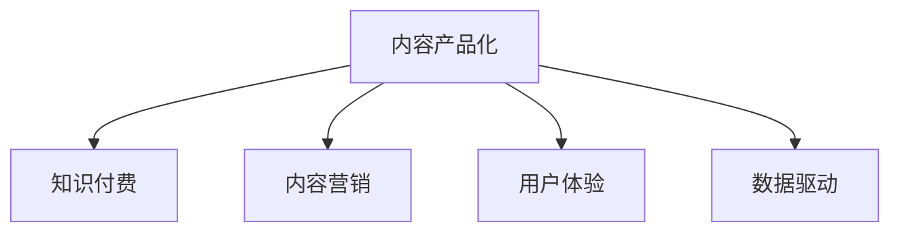
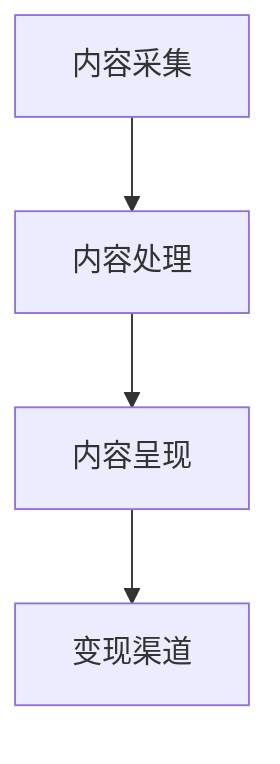

                 

# 知识付费创业中的内容产品化策略

## 1. 背景介绍

随着知识经济时代的到来，知识付费已经成为新常态。不同于传统的内容分发模式，知识付费强调的是“知识”而非“内容”。这里的“知识”不仅指高价值的内容，更重要的是对内容的深层次加工和应用。知识付费创业的本质，在于如何高效地生产、分发和变现高价值知识。本文将从内容产品化的视角，系统梳理知识付费创业中的核心策略和具体方法。

## 2. 核心概念与联系

### 2.1 核心概念概述

在进行内容产品化的探讨之前，首先需要明确几个核心概念：

- **内容产品化**：将高价值的知识内容转化为具有明确市场需求和价值的产品形式，以实现商业变现。
- **知识付费**：消费者为获取高价值知识内容而支付费用的模式，强调知识的稀缺性和知识内容的深度。
- **内容营销**：通过高价值的内容吸引和转化用户，实现品牌和产品的推广。
- **用户体验**：用户在使用产品过程中的体验，包括界面设计、交互方式、内容呈现等。
- **数据驱动**：利用大数据分析用户行为和需求，指导内容生产和产品迭代。

这些概念之间的逻辑关系可以通过以下Mermaid流程图来展示：



这个流程图展示了这个框架的核心概念及其之间的关系：

1. 内容产品化是知识付费的基础，需要将高价值内容转化为易于变现的产品。
2. 内容营销通过吸引用户来增加产品销售量。
3. 用户体验影响用户留存和转化率。
4. 数据驱动确保内容生产与用户需求保持同步，实现产品迭代。

### 2.2 核心概念原理和架构

内容产品化涉及多个环节，包括内容采集、处理、呈现、变现等。下面通过一个简化的架构图，展示内容产品化的主要流程：



- **内容采集**：通过爬虫、API、用户投稿等方式，获取高质量的原始内容。
- **内容处理**：对原始内容进行加工和筛选，如文本分析、图像识别、音频处理等，将其转化为高价值的知识产品。
- **内容呈现**：利用多种形式（文字、视频、音频等），将知识产品呈现给用户。
- **变现渠道**：通过付费订阅、单次付费、免费试用等形式，实现知识内容的商业变现。

## 3. 核心算法原理 & 具体操作步骤

### 3.1 算法原理概述

内容产品化的算法原理主要基于用户行为分析和内容推荐技术，其核心思想是通过数据分析和机器学习，为用户推荐最符合其兴趣和需求的知识产品，从而提高用户购买率和留存率。

### 3.2 算法步骤详解

内容产品化一般包括以下几个关键步骤：

1. **用户画像构建**：通过对用户行为数据（如浏览历史、购买记录、搜索关键词等）进行分析，构建用户的兴趣和需求画像。
2. **内容特征提取**：提取内容的关键特征，如关键词、分类、标签等，用于衡量内容的相关性和价值。
3. **推荐算法选择**：选择合适的推荐算法，如协同过滤、内容过滤、混合推荐等，构建推荐模型。
4. **推荐结果生成**：将用户画像和内容特征输入推荐模型，生成用户可能感兴趣的内容推荐列表。
5. **内容呈现与优化**：利用界面设计、交互方式、推荐算法等多种手段，优化内容的呈现方式，提高用户满意度和转化率。

### 3.3 算法优缺点

内容产品化算法具有以下优点：
- **精准推荐**：通过深度学习等算法，能够精准地为用户推荐符合其兴趣的内容，提高用户购买率。
- **提升用户留存**：通过个性化推荐，增加用户对平台的粘性，提高用户留存率。
- **高效变现**：精准推荐使得内容变现效率更高，帮助知识付费平台快速实现商业化。

然而，该算法也存在以下缺点：
- **数据需求高**：需要大量用户行为数据进行模型训练，数据获取和处理成本较高。
- **算法复杂度高**：深度学习等算法的模型复杂度较高，训练和推理速度较慢。
- **冷启动问题**：新用户和冷门内容的推荐较为困难，需要进一步改进算法。

### 3.4 算法应用领域

内容产品化算法广泛应用于知识付费平台的各个环节，包括但不限于以下几个方面：

1. **用户推荐系统**：根据用户画像和内容特征，为用户推荐相关课程、文章、视频等内容。
2. **内容搜索系统**：利用自然语言处理技术，实现快速、精准的内容搜索和分类。
3. **用户分析系统**：通过数据分析工具，了解用户行为和需求，指导内容生产和产品迭代。
4. **广告投放系统**：根据用户画像和行为数据，精准投放广告，提升广告效果。
5. **流失预警系统**：通过用户行为数据，预警高流失风险用户，及时采取措施。

## 4. 数学模型和公式 & 详细讲解

### 4.1 数学模型构建

内容产品化算法通常基于协同过滤和深度学习等模型。以协同过滤为例，其数学模型如下：

$$
P(X_i | Y_i, \theta) = \frac{e^{\theta^T f(X_i, Y_i)}}{\sum_{j=1}^{N} e^{\theta^T f(X_j, Y_j)}}
$$

其中，$X_i$ 表示用户 $i$ 对内容 $x$ 的评分，$Y_i$ 表示用户 $i$ 的历史行为数据，$\theta$ 表示模型的参数。$f(X_i, Y_i)$ 是用户 $i$ 对内容 $x$ 的特征表示，$N$ 表示用户数量。

### 4.2 公式推导过程

协同过滤模型的推导过程如下：

1. 假设用户 $i$ 对内容 $x$ 的评分可以表示为 $X_i = \theta^T \phi(x)$，其中 $\phi(x)$ 是内容 $x$ 的特征表示。
2. 对于用户 $i$ 的历史行为数据 $Y_i$，我们可以得到一个用户-内容评分矩阵 $R$。
3. 模型参数 $\theta$ 可以通过最大化似然函数得到，即 $\theta = \arg \max_{\theta} \sum_{i=1}^{M} \sum_{j=1}^{N} X_i \log P(X_i | Y_i, \theta)$，其中 $M$ 表示内容的数量。

### 4.3 案例分析与讲解

以某知识付费平台为例，分析其推荐系统的设计和效果。

1. **用户画像构建**：通过爬取用户历史行为数据，构建用户画像。例如，用户 $i$ 购买了课程 A、B、C，阅读了文章 X、Y、Z，搜索了关键词 K1、K2、K3。
2. **内容特征提取**：对课程、文章、视频等内容进行特征提取，例如关键词、分类、用户评分等。
3. **推荐算法选择**：采用协同过滤算法，构建推荐模型。
4. **推荐结果生成**：利用协同过滤算法，生成用户 $i$ 可能感兴趣的内容推荐列表。
5. **内容呈现与优化**：通过界面设计和交互方式优化，提升用户的使用体验。

## 5. 项目实践：代码实例和详细解释说明

### 5.1 开发环境搭建

在进行内容产品化开发前，需要搭建好开发环境。以下是Python环境下安装相关库的步骤：

1. 安装Anaconda：从官网下载并安装Anaconda，用于创建独立的Python环境。

2. 创建并激活虚拟环境：
```bash
conda create -n content-dev python=3.8 
conda activate content-dev
```

3. 安装必要的库：
```bash
pip install tensorflow pandas scikit-learn scipy jupyter notebook transformers
```

### 5.2 源代码详细实现

以下是一个简化的推荐系统示例代码，演示了协同过滤模型的实现：

```python
import pandas as pd
import numpy as np
import tensorflow as tf

# 读取用户-内容评分数据
data = pd.read_csv('user_content_ratings.csv')

# 用户-内容评分矩阵
R = np.array(data[['user_id', 'content_id', 'rating']])

# 用户画像
user_features = pd.read_csv('user_features.csv')
user_praits = user_features.set_index('user_id').T.to_dict()

# 内容特征
content_features = pd.read_csv('content_features.csv')
content_traits = content_features.set_index('content_id').T.to_dict()

# 构建协同过滤模型
user_based_matrix = {}
for user_id, user_prait in user_praits.items():
    user_based_matrix[user_id] = []
    for content_id, content_trait in content_traits.items():
        user_based_matrix[user_id].append(tf.convert_to_tensor(user_prait, dtype=tf.float32))
        user_based_matrix[user_id].append(tf.convert_to_tensor(content_trait, dtype=tf.float32))

user_based_matrix = tf.constant(user_based_matrix, dtype=tf.float32)

# 计算评分预测
predictions = tf.matmul(user_based_matrix, R)

# 输出预测结果
print(predictions)
```

### 5.3 代码解读与分析

代码中，我们通过Pandas读取用户-内容评分数据，并将其转化为评分矩阵 $R$。同时，读取用户画像和内容特征数据，构建用户-内容特征矩阵。最后，利用TensorFlow进行矩阵乘法计算，得到评分预测结果。

值得注意的是，实际应用中，推荐系统通常需要处理大规模数据，因此需要采用分布式计算和优化算法来提高效率。

### 5.4 运行结果展示

由于代码中涉及的数据和模型是假设性的，因此无法直接展示运行结果。在实际应用中，推荐系统会根据用户画像和内容特征生成推荐列表，并动态调整推荐结果，以优化用户体验和购买率。

## 6. 实际应用场景

### 6.1 知识付费平台的推荐系统

知识付费平台的推荐系统是内容产品化的典型应用。通过精准推荐，平台能够提高用户粘性和购买率，降低流失率，从而提升平台的商业价值。

### 6.2 在线教育平台的内容分发

在线教育平台可以通过内容推荐系统，为学生提供个性化的课程推荐，提升学习效率。同时，平台还可以根据学生的学习进度和反馈，动态调整课程推荐，提高学习效果。

### 6.3 企业培训的内容管理

企业培训管理系统可以通过内容推荐，为员工提供符合其职业发展需要的培训课程，提升培训效果。平台还可以根据员工的学习行为数据，动态调整课程推荐，实现个性化培训。

### 6.4 未来应用展望

内容产品化算法在未来还将应用于更多场景，如智能搜索、智能客服、智能广告等。随着算法和技术的不断进步，内容推荐系统将更加智能和高效，为用户提供更加个性化和精准的服务。

## 7. 工具和资源推荐

### 7.1 学习资源推荐

为了帮助开发者掌握内容产品化的算法和实践，这里推荐一些优质的学习资源：

1. **《推荐系统实战》**：全面介绍了推荐系统的原理和实现方法，适合初学者和进阶开发者。
2. **《深度学习与推荐系统》**：详细讲解了深度学习在推荐系统中的应用，包括协同过滤、矩阵分解等。
3. **《Python推荐系统》**：基于Python实现的推荐系统框架，提供了丰富的实现示例和应用案例。
4. **Coursera《Recommender Systems》**：由斯坦福大学教授开设的推荐系统课程，涵盖推荐系统的理论和实践。
5. **Kaggle推荐系统竞赛**：通过参与竞赛，深入理解推荐系统算法和实现。

### 7.2 开发工具推荐

内容产品化开发通常需要多学科知识的整合，以下推荐几款常用的开发工具：

1. **TensorFlow**：Google开源的深度学习框架，适合大规模模型训练和优化。
2. **Pandas**：Python数据处理库，适合数据清洗和分析。
3. **Scikit-learn**：Python机器学习库，适合快速原型开发和模型评估。
4. **Jupyter Notebook**：Python交互式开发环境，适合数据探索和原型验证。
5. **TensorBoard**：TensorFlow配套的可视化工具，适合模型调试和监控。

### 7.3 相关论文推荐

内容产品化算法的研究得益于大量学术论文的推动，以下是几篇具有代表性的论文：

1. **《协同过滤推荐系统》**：由Adams等人在2001年提出的协同过滤算法，奠定了推荐系统研究的基础。
2. **《基于深度学习的推荐系统》**：由Wu等人在2015年提出的深度学习推荐系统，展示了深度学习在推荐系统中的巨大潜力。
3. **《强化学习在推荐系统中的应用》**：由Ma等人在2019年提出的强化学习推荐系统，展示了强化学习在推荐系统中的应用前景。
4. **《多模态推荐系统》**：由Zheng等人在2018年提出的多模态推荐系统，展示了多模态数据融合在推荐系统中的应用效果。

## 8. 总结：未来发展趋势与挑战

### 8.1 总结

本文系统梳理了知识付费创业中内容产品化的核心策略和具体方法。通过内容产品化的视角，我们介绍了推荐系统在知识付费平台中的应用，并探讨了其优化方法和未来趋势。通过案例分析和代码实现，我们深入理解了内容产品化的算法原理和实践细节。

通过本文的系统梳理，可以看到，内容产品化是知识付费创业的关键环节，通过对高价值内容的精准推荐，可以显著提升用户购买率和平台商业价值。未来，随着算法和技术的不断进步，内容推荐系统将更加智能和高效，为用户提供更加个性化和精准的服务。

### 8.2 未来发展趋势

展望未来，内容产品化算法将呈现以下几个发展趋势：

1. **深度学习算法**：深度学习算法在推荐系统中的应用将越来越广泛，能够提供更加精准和高效的推荐结果。
2. **多模态数据融合**：多模态数据的融合将提升推荐系统的表现，能够更好地满足用户的多样化需求。
3. **实时推荐**：实时推荐能够及时响应用户需求，提升用户体验和转化率。
4. **跨平台推荐**：跨平台推荐能够实现无缝的推荐服务，提升用户粘性和留存率。
5. **隐私保护**：随着隐私保护要求的提高，推荐系统将更加注重数据隐私和安全，采用联邦学习等技术保护用户隐私。

### 8.3 面临的挑战

尽管内容产品化算法已经取得了显著的进展，但在实际应用中仍面临诸多挑战：

1. **数据质量**：推荐系统依赖于高质量的用户行为数据，数据质量不佳将影响推荐效果。
2. **模型复杂度**：深度学习等算法的模型复杂度较高，训练和推理成本较高。
3. **冷启动问题**：新用户和冷门内容的推荐较为困难，需要进一步改进算法。
4. **隐私保护**：用户隐私保护要求日益严格，如何在推荐过程中保护用户隐私是一大挑战。
5. **公平性**：推荐算法可能存在偏见，导致不同用户之间的推荐不公平。

### 8.4 研究展望

未来的研究需要在以下几个方面寻求新的突破：

1. **数据获取与处理**：开发高效的数据采集和预处理技术，提升数据质量。
2. **模型优化**：采用更高效的模型结构和优化算法，降低训练和推理成本。
3. **算法公平性**：研究算法公平性问题，确保推荐系统的公正性和公平性。
4. **跨平台协同**：实现跨平台推荐系统的无缝衔接，提升用户粘性和留存率。
5. **隐私保护技术**：采用联邦学习等技术，保护用户隐私。

## 9. 附录：常见问题与解答

### 常见问题

**Q1：如何设计用户画像？**

A: 用户画像需要综合用户的历史行为、兴趣偏好、社交关系等多方面信息。可以通过数据采集和用户调研的方式，构建全面的用户画像。

**Q2：如何处理冷启动问题？**

A: 对于新用户和冷门内容，可以采用基于内容的推荐策略，或者利用推荐系统的元数据进行初步推荐。同时，可以通过引导用户填写兴趣调查等方式，加速用户画像的构建。

**Q3：如何平衡推荐效果和系统效率？**

A: 需要在算法效率和推荐效果之间寻找平衡。可以采用增量更新和缓存技术，减少推荐系统的计算负担。同时，可以采用多种推荐策略，提高推荐的覆盖面和精准度。

**Q4：如何保护用户隐私？**

A: 采用联邦学习等技术，在本地设备上训练模型，避免敏感数据泄露。同时，可以采用匿名化处理和差分隐私等技术，保护用户隐私。

**Q5：如何优化推荐系统的用户体验？**

A: 优化推荐系统的界面设计和交互方式，提升用户的使用体验。同时，可以通过A/B测试等方式，不断优化推荐系统的算法和策略，提高用户满意度和转化率。

---

作者：禅与计算机程序设计艺术 / Zen and the Art of Computer Programming

