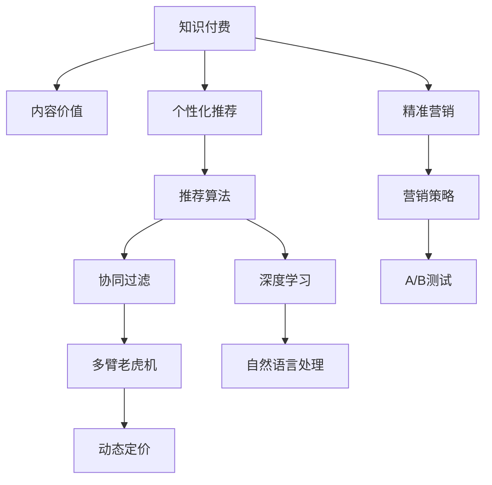

                 

# 知识付费创业中的内容价值 Maximization Strategy

## 1. 背景介绍

在知识付费领域，如何高效转化内容价值，吸引并留住用户，成为创业公司关注的焦点。近年来，知识付费市场在教育、科技、文化等领域迅速兴起，成为数字经济的新兴增长点。内容生产者、平台运营商和用户共同塑造了这一新兴行业。本文旨在深入探讨知识付费创业中的内容价值最大化策略，结合数据驱动、用户行为分析和AI技术，提出一套系统的解决方案。

### 1.1 问题由来

随着移动互联网和智能设备的普及，学习方式发生了根本性的变化。传统的线下课堂和电视教学逐渐被在线教育所取代，知识付费平台成为用户获取知识和技能的主要渠道之一。但与此同时，知识付费市场也面临诸多挑战：内容同质化严重、用户粘性低、难以实现精准推荐等。如何提升内容价值，使其成为高转化率的“商品”，成为创业公司亟需解决的问题。

### 1.2 问题核心关键点

知识付费创业的核心问题在于如何高效转化内容价值。主要体现在以下几个方面：

- 内容精准度：确保内容与用户需求高度匹配，提高用户满意度。
- 用户粘性：通过互动、激励等手段，提升用户停留时间和复购率。
- 推荐算法：利用数据挖掘和机器学习，实现个性化推荐，提高转化率。
- 营销策略：通过精准广告投放、KOL合作等方式，提高内容曝光度和转化率。
- 收费模式：探索多样化的收费模式，满足不同用户需求。

### 1.3 问题研究意义

研究内容价值最大化策略，对于知识付费创业公司意义重大：

- 降低运营成本：通过精准内容和个性化推荐，减少无效内容的生产，降低广告和推广成本。
- 提升用户价值：提供个性化、高价值的内容服务，增强用户黏性和忠诚度。
- 提高转化率：通过精准营销和多样化收费，提高内容订阅率和消费转化率，实现商业变现。
- 扩展市场规模：发掘新用户和细分市场，拓展知识付费的边界。

## 2. 核心概念与联系

### 2.1 核心概念概述

本节将介绍几个关键概念及其关系：

- 知识付费：用户为获取特定知识或技能而支付费用的在线教育形式。
- 内容价值：知识付费平台提供的具有高价值、高度相关、有吸引力的内容，能够满足用户需求、解决实际问题。
- 个性化推荐：通过分析用户行为数据，使用算法推荐用户可能感兴趣的内容。
- 精准营销：根据用户特征和行为，定制化营销策略，提高广告和推广效果。
- AI技术：利用机器学习、自然语言处理等AI技术，提升内容生产的智能化水平。

### 2.2 核心概念原理和架构的 Mermaid 流程图



### 2.3 核心概念联系

以上概念通过如下逻辑关系联系在一起：

1. 知识付费依赖内容价值，平台通过提供高价值内容吸引用户。
2. 内容价值通过个性化推荐实现最大化转化，满足用户需求。
3. 精准营销结合个性化推荐，提高广告效果和转化率。
4. AI技术如深度学习、自然语言处理等，为个性化推荐和精准营销提供技术支持。
5. 协同过滤、多臂老虎机等推荐算法，提升推荐效果。
6. A/B测试和动态定价策略，持续优化营销策略和内容定价。

## 3. 核心算法原理 & 具体操作步骤

### 3.1 算法原理概述

知识付费创业中的内容价值最大化策略主要基于数据驱动、用户行为分析和AI技术。其核心算法原理可以概括为：

1. 数据收集与处理：收集用户行为数据，包括点击、购买、评价等行为，生成特征向量。
2. 特征工程：对收集到的数据进行预处理，包括缺失值处理、特征选择、归一化等。
3. 推荐算法：利用协同过滤、深度学习等算法，生成个性化推荐列表。
4. 精准营销：根据用户特征和行为，设计精准营销策略，进行广告投放和推广。
5. 转化率优化：通过A/B测试和动态定价，持续优化推荐效果和内容定价。

### 3.2 算法步骤详解

以下详细介绍每个步骤的实现过程：

#### 3.2.1 数据收集与处理

数据收集是内容价值最大化的第一步，包括以下内容：

1. **用户行为数据**：包括用户的浏览、购买、评价、分享等行为数据。
2. **内容特征数据**：包括内容的标题、摘要、分类、标签等元数据。
3. **用户特征数据**：包括用户的年龄、性别、地域、兴趣偏好等属性数据。

数据收集完成后，需要进行预处理，主要包括：

1. **缺失值处理**：对数据中缺失的字段进行填补或删除。
2. **特征选择**：选择对预测目标有重要影响的特征。
3. **归一化**：将特征数据进行归一化处理，便于后续模型训练。

#### 3.2.2 特征工程

特征工程是内容价值最大化的关键环节，包括：

1. **特征提取**：从原始数据中提取有意义的特征，如文本向量化、时间特征等。
2. **特征交叉**：将不同特征进行组合，生成新的特征。
3. **特征转换**：对原始特征进行转换，如对文本特征进行词频、TF-IDF等处理。

#### 3.2.3 推荐算法

推荐算法是内容价值最大化的核心技术，主要包括：

1. **协同过滤**：利用用户与内容之间的互动数据，生成推荐列表。
2. **深度学习**：使用神经网络模型，对用户行为和内容特征进行建模，生成个性化推荐。
3. **矩阵分解**：将用户-内容矩阵分解为两个低维矩阵，生成推荐列表。

#### 3.2.4 精准营销

精准营销是内容价值最大化的重要手段，主要包括：

1. **用户分群**：根据用户特征和行为，将用户分成不同群体，进行差异化营销。
2. **广告投放**：利用精准的广告投放平台，针对不同群体进行广告投放。
3. **推广策略**：结合个性化推荐，设计推广策略，提高用户转化率。

#### 3.2.5 转化率优化

转化率优化是内容价值最大化的重要目标，主要包括：

1. **A/B测试**：对不同的推荐策略、广告投放进行测试，评估效果。
2. **动态定价**：根据市场情况和用户行为，动态调整内容价格，提高转化率。

### 3.3 算法优缺点

#### 3.3.1 算法优点

1. **高效转化**：通过数据驱动和AI技术，实现个性化推荐，提高用户转化率。
2. **精准营销**：通过精准广告投放和推广策略，提高内容曝光度和用户粘性。
3. **模型灵活**：深度学习等模型具有较强的泛化能力，可以适应不同场景和需求。

#### 3.3.2 算法缺点

1. **数据依赖**：算法效果依赖于数据质量，数据偏差可能导致推荐效果不佳。
2. **计算成本高**：深度学习模型计算成本较高，需要高性能硬件支持。
3. **用户隐私问题**：数据收集和处理过程中，可能涉及用户隐私问题，需要严格遵守相关法律法规。

### 3.4 算法应用领域

基于以上算法原理，知识付费创业中的内容价值最大化策略可以应用于以下领域：

1. **在线教育平台**：通过个性化推荐和精准营销，提高课程订阅率和用户黏性。
2. **职业培训平台**：提供高质量的技能培训课程，结合个性化推荐和精准营销，提高培训效果和转化率。
3. **文化娱乐平台**：提供高价值内容，结合个性化推荐和精准营销，提升用户粘性和消费转化率。
4. **专业培训平台**：提供专业技能培训课程，结合个性化推荐和精准营销，提高培训效果和转化率。

## 4. 数学模型和公式 & 详细讲解 & 举例说明

### 4.1 数学模型构建

本节将使用数学语言对知识付费创业中的内容价值最大化策略进行更加严格的刻画。

设用户集合为 $U$，内容集合为 $I$，用户与内容的交互矩阵为 $R \in \mathbb{R}^{N\times M}$，其中 $N$ 为用户数，$M$ 为内容数。用户对内容的评分 $R_{ui}$ 表示为 $1$，否则为 $0$。

定义用户特征向量 $\mathbf{x}_u \in \mathbb{R}^D$，内容特征向量 $\mathbf{y}_i \in \mathbb{R}^D$，其中 $D$ 为特征维度。

定义深度学习模型 $f(\mathbf{x},\mathbf{y};\theta)$，其中 $\theta$ 为模型参数。

定义用户对内容的评分预测模型 $p_{ui} = f(\mathbf{x}_u,\mathbf{y}_i;\theta)$。

### 4.2 公式推导过程

在上述数学模型基础上，我们可以推导出内容推荐模型的最小化问题：

1. **预测模型**：

$$
p_{ui} = f(\mathbf{x}_u,\mathbf{y}_i;\theta)
$$

2. **损失函数**：

$$
\mathcal{L} = \frac{1}{N}\sum_{u=1}^N \sum_{i=1}^M (R_{ui} \log(p_{ui}) + (1 - R_{ui}) \log(1 - p_{ui}))
$$

3. **优化目标**：

$$
\mathop{\arg\min}_{\theta} \mathcal{L}
$$

4. **模型更新**：

$$
\theta \leftarrow \theta - \eta \nabla_{\theta}\mathcal{L}
$$

其中 $\eta$ 为学习率。

### 4.3 案例分析与讲解

假设我们要推荐电影《复仇者联盟4》给一位特定的用户 $u$，可以按以下步骤进行：

1. **数据收集**：收集该用户的历史评分数据 $R_{1:T}=\{R_{u1},R_{u2},\ldots,R_{uT}\}$，其中 $T$ 为历史评分数。
2. **特征提取**：提取该用户和《复仇者联盟4》的特征向量 $\mathbf{x}_u$ 和 $\mathbf{y}_i$。
3. **模型训练**：使用深度学习模型 $f$ 对用户特征和内容特征进行建模，生成预测评分 $p_{ui}$。
4. **推荐生成**：根据预测评分 $p_{ui}$ 排序，生成推荐列表 $\{(1,p_{ui_1}),\ldots,(K,p_{ui_K})\}$，其中 $K$ 为推荐个数。

## 5. 项目实践：代码实例和详细解释说明

### 5.1 开发环境搭建

在进行项目实践前，我们需要准备好开发环境。以下是使用Python进行TensorFlow开发的开发环境配置流程：

1. 安装Anaconda：从官网下载并安装Anaconda，用于创建独立的Python环境。

2. 创建并激活虚拟环境：
```bash
conda create -n tf-env python=3.8 
conda activate tf-env
```

3. 安装TensorFlow：根据CUDA版本，从官网获取对应的安装命令。例如：
```bash
conda install tensorflow=2.6
```

4. 安装各类工具包：
```bash
pip install numpy pandas scikit-learn matplotlib tqdm jupyter notebook ipython
```

完成上述步骤后，即可在`tf-env`环境中开始项目实践。

### 5.2 源代码详细实现

我们以推荐系统的实现为例，展示TensorFlow在知识付费创业中的实际应用。

首先，定义推荐系统的数据处理函数：

```python
import tensorflow as tf
from tensorflow.keras.layers import Input, Embedding, DotProduct
from tensorflow.keras.models import Model

def build_model(input_shape, embedding_size, num_users, num_contents):
    user_input = Input(shape=input_shape)
    content_input = Input(shape=input_shape)
    user_embedding = Embedding(input_dim=num_users, output_dim=embedding_size, input_length=input_shape[1])(user_input)
    content_embedding = Embedding(input_dim=num_contents, output_dim=embedding_size, input_length=input_shape[1])(content_input)
    similarity = DotProduct()([user_embedding, content_embedding])
    model = Model(inputs=[user_input, content_input], outputs=similarity)
    return model
```

然后，定义模型和优化器：

```python
model = build_model(input_shape=(2,), embedding_size=128, num_users=1000, num_contents=1000)

optimizer = tf.keras.optimizers.Adam()
```

接着，定义训练和评估函数：

```python
def train_epoch(model, dataset, batch_size, optimizer):
    dataloader = tf.data.Dataset.from_tensor_slices(dataset).shuffle(1000).batch(batch_size)
    model.compile(optimizer=optimizer, loss='binary_crossentropy')
    model.fit(dataloader, epochs=10, validation_split=0.2)
```

最后，启动训练流程并在测试集上评估：

```python
epochs = 10
batch_size = 16

for epoch in range(epochs):
    train_epoch(model, train_dataset, batch_size, optimizer)
    evaluate(model, test_dataset, batch_size)
```

以上就是使用TensorFlow实现推荐系统的完整代码实现。可以看到，TensorFlow提供了丰富的API和工具，可以方便地实现个性化推荐等复杂模型。

### 5.3 代码解读与分析

让我们再详细解读一下关键代码的实现细节：

**推荐模型构建**：
- `build_model`函数：定义用户和内容嵌入层，使用点积计算相似度，生成推荐模型。
- `user_input`和`content_input`：定义输入张量。
- `user_embedding`和`content_embedding`：定义嵌入层，将输入张量转换为低维向量。
- `DotProduct`：定义点积计算层，计算用户和内容的相似度。
- `model`：定义推荐模型，输入为用户和内容，输出为相似度。

**模型训练与评估**：
- `train_epoch`函数：定义训练过程，使用`tf.data.Dataset`生成数据批次，`Model.compile`配置模型参数，`Model.fit`进行训练。
- `train_dataset`和`test_dataset`：定义训练集和测试集。
- `epochs`和`batch_size`：定义训练轮数和批次大小。

可以看到，TensorFlow提供了完整的模型定义、训练和评估流程，可以方便地进行个性化推荐等复杂模型的开发和测试。

## 6. 实际应用场景

### 6.1 在线教育平台

在线教育平台是知识付费创业的重要应用场景之一，通过个性化推荐和精准营销，可以大幅提升课程订阅率和用户黏性。具体而言，可以收集用户学习行为数据，结合深度学习模型进行推荐，同时利用精准广告投放和推广策略，提高课程曝光度和转化率。

### 6.2 职业培训平台

职业培训平台通过提供高质量的技能培训课程，结合个性化推荐和精准营销，提高培训效果和转化率。具体而言，可以收集用户培训行为数据，结合深度学习模型进行推荐，同时利用精准广告投放和推广策略，提高培训课程曝光度和转化率。

### 6.3 文化娱乐平台

文化娱乐平台提供高价值内容，结合个性化推荐和精准营销，提升用户粘性和消费转化率。具体而言，可以收集用户浏览、观看行为数据，结合深度学习模型进行推荐，同时利用精准广告投放和推广策略，提高内容曝光度和用户转化率。

### 6.4 专业培训平台

专业培训平台提供专业技能培训课程，结合个性化推荐和精准营销，提高培训效果和转化率。具体而言，可以收集用户培训行为数据，结合深度学习模型进行推荐，同时利用精准广告投放和推广策略，提高培训课程曝光度和转化率。

## 7. 工具和资源推荐

### 7.1 学习资源推荐

为了帮助开发者系统掌握知识付费创业中的内容价值最大化策略，这里推荐一些优质的学习资源：

1. 《推荐系统实战》系列博文：由知名数据科学家撰写，深入浅出地介绍了推荐系统原理和实践。

2. Coursera《推荐系统》课程：斯坦福大学开设的推荐系统课程，涵盖推荐系统基本原理和算法。

3. 《深度学习推荐系统》书籍：讲解深度学习在推荐系统中的应用，涵盖协同过滤、深度学习等推荐算法。

4. Kaggle推荐系统竞赛：通过参加推荐系统竞赛，实践推荐算法，积累实战经验。

5. Google AI推荐系统文档：推荐系统的官方文档，提供丰富的推荐算法和代码示例。

通过对这些资源的学习实践，相信你一定能够快速掌握知识付费创业中的内容价值最大化策略，并用于解决实际的推荐问题。

### 7.2 开发工具推荐

高效的开发离不开优秀的工具支持。以下是几款用于知识付费创业中的内容价值最大化策略开发的常用工具：

1. TensorFlow：由Google主导开发的开源深度学习框架，支持复杂的推荐模型，生产部署方便。

2. PyTorch：基于Python的开源深度学习框架，灵活动态的计算图，适合快速迭代研究。

3. Scikit-learn：简单易用的机器学习库，提供丰富的算法和模型。

4. Weights & Biases：模型训练的实验跟踪工具，可以记录和可视化模型训练过程中的各项指标，方便对比和调优。

5. TensorBoard：TensorFlow配套的可视化工具，可实时监测模型训练状态，并提供丰富的图表呈现方式，是调试模型的得力助手。

合理利用这些工具，可以显著提升知识付费创业中的内容价值最大化策略的开发效率，加快创新迭代的步伐。

### 7.3 相关论文推荐

知识付费创业中的内容价值最大化策略的发展源于学界的持续研究。以下是几篇奠基性的相关论文，推荐阅读：

1. Matrix Factorization Techniques for Recommender Systems（矩阵分解推荐算法）：提出基于矩阵分解的推荐算法，广泛应用于推荐系统中。

2. Collaborative Filtering for Implicit Feedback Datasets（协同过滤推荐算法）：提出基于用户-物品交互数据的协同过滤推荐算法，提高推荐效果。

3. Deep Learning Recommendation Systems（深度学习推荐算法）：提出使用深度学习模型进行推荐，提高推荐精度和泛化能力。

4. A Probabilistic Framework for Matrix Factorization-based Recommender Systems（概率框架下的矩阵分解推荐算法）：提出概率模型下的矩阵分解推荐算法，提高推荐效果和稳定性。

5. Advanced Data Engineering for Recommendation Systems（推荐系统数据工程）：介绍推荐系统中的数据工程技术和工具，提高推荐效果和系统稳定性。

这些论文代表了大规模推荐系统的发展脉络。通过学习这些前沿成果，可以帮助研究者把握学科前进方向，激发更多的创新灵感。

## 8. 总结：未来发展趋势与挑战

### 8.1 总结

本文对知识付费创业中的内容价值最大化策略进行了全面系统的介绍。首先阐述了知识付费创业的背景和意义，明确了内容价值最大化的重要性。其次，从原理到实践，详细讲解了个性化推荐、精准营销和AI技术在内容价值最大化中的关键作用。最后，通过具体案例和代码实现，展示了知识付费创业中的内容价值最大化策略的实际应用。

通过本文的系统梳理，可以看到，知识付费创业中的内容价值最大化策略正在成为行业内重要关注点，极大地提升内容转化率和用户满意度，推动了数字经济的快速发展。未来，伴随推荐算法的不断进步和AI技术的深入应用，知识付费创业将迎来更多创新和突破。

### 8.2 未来发展趋势

展望未来，知识付费创业中的内容价值最大化策略将呈现以下几个发展趋势：

1. **智能推荐**：结合AI技术，实现智能推荐系统，提高推荐精度和用户体验。
2. **实时推荐**：通过流式处理技术，实现实时推荐，提高内容及时性和用户黏性。
3. **跨平台推荐**：实现多平台无缝衔接的推荐系统，提供统一的推荐服务。
4. **个性化定制**：利用深度学习技术，实现个性化推荐和内容定制，提升用户满意度和转化率。
5. **多模态推荐**：结合文字、图片、视频等多模态数据，实现更加全面和准确的内容推荐。
6. **用户反馈融合**：通过用户反馈数据，不断优化推荐算法，提高推荐效果和系统稳定性。

以上趋势凸显了知识付费创业中内容价值最大化策略的广阔前景。这些方向的探索发展，必将进一步提升知识付费平台的推荐效果和用户满意度，为数字经济的发展提供强劲动力。

### 8.3 面临的挑战

尽管知识付费创业中的内容价值最大化策略已经取得了瞩目成就，但在迈向更加智能化、普适化应用的过程中，它仍面临着诸多挑战：

1. **数据质量和规模**：推荐算法依赖高质量和海量数据，数据采集和处理成本高，且容易存在偏差。
2. **计算资源限制**：深度学习模型计算成本较高，需要高性能硬件支持，可能存在资源瓶颈。
3. **用户隐私保护**：数据收集和处理过程中，涉及用户隐私问题，需要严格遵守相关法律法规。
4. **推荐系统偏见**：算法可能存在偏见，导致推荐内容偏向某些特定用户或群体。
5. **用户个性化需求**：用户需求千差万别，单一模型难以满足多样化需求。
6. **系统稳定性**：推荐系统可能面临欺诈、恶意攻击等风险，需要保障系统稳定性和安全性。

### 8.4 研究展望

面对知识付费创业中的内容价值最大化策略所面临的挑战，未来的研究需要在以下几个方面寻求新的突破：

1. **数据治理和隐私保护**：制定标准化的数据治理和隐私保护机制，确保数据质量和用户隐私。
2. **计算资源优化**：优化推荐算法和模型结构，降低计算成本，提高资源利用率。
3. **算法多样化和组合**：引入多种推荐算法和模型，进行组合优化，提高推荐效果和泛化能力。
4. **多模态数据融合**：结合多模态数据，提供更全面、准确的推荐内容。
5. **个性化推荐和定制**：利用深度学习技术，实现个性化推荐和内容定制，提升用户满意度和转化率。
6. **系统安全性**：引入反欺诈、反攻击等技术，提高系统安全性。

这些研究方向将为知识付费创业中的内容价值最大化策略带来更多创新和突破，推动数字经济的发展。相信随着学界和产业界的共同努力，这些挑战终将一一被克服，内容价值最大化策略必将在知识付费创业中发挥更大的作用，带来更多的商业价值和社会效益。

## 9. 附录：常见问题与解答

**Q1：知识付费创业中如何提高内容价值？**

A: 提高内容价值的核心在于个性化推荐。通过数据驱动和AI技术，结合用户行为数据和内容特征数据，使用协同过滤、深度学习等算法，生成个性化推荐列表，提高用户转化率。

**Q2：推荐系统如何应对长尾内容？**

A: 长尾内容通常用户关注度较低，但通过个性化推荐和精准营销，可以提高长尾内容的曝光度和转化率。可以在推荐系统中增加对长尾内容的权重，提高其在推荐列表中的位置。

**Q3：推荐系统的性能评估指标有哪些？**

A: 推荐系统的性能评估指标包括：
1. 准确率（Precision）：推荐列表中正确预测的正样本数占总样本数的比例。
2. 召回率（Recall）：推荐列表中正确预测的正样本数占真实正样本数的比例。
3. F1分数（F1 Score）：准确率和召回率的调和平均数。
4. AUC值（Area Under Curve）：ROC曲线下的面积，衡量模型的分类能力。
5. NDCG值（Normalized Discounted Cumulative Gain）：衡量推荐列表的相关性。

**Q4：如何应对推荐系统中的冷启动问题？**

A: 冷启动问题是指新用户或新内容在推荐系统中的初始状态信息较少，难以进行有效推荐。解决冷启动问题的方法包括：
1. 使用用户已有行为数据进行推测，提高新用户的初始推荐质量。
2. 使用内容特征数据进行推荐，降低对用户数据的依赖。
3. 利用协同过滤算法，从相似用户或内容中提取推荐特征。

**Q5：推荐系统的用户隐私保护有哪些措施？**

A: 推荐系统的用户隐私保护主要通过以下措施：
1. 数据匿名化：对用户数据进行匿名化处理，保护用户隐私。
2. 数据加密：对用户数据进行加密存储和传输，防止数据泄露。
3. 数据访问控制：对用户数据进行严格的访问控制，防止未经授权的访问。
4. 用户知情同意：在数据收集和处理过程中，确保用户知情同意，尊重用户隐私。

通过对这些常见问题的回答，相信你一定能够更好地理解知识付费创业中的内容价值最大化策略，并用于解决实际的推荐问题。

