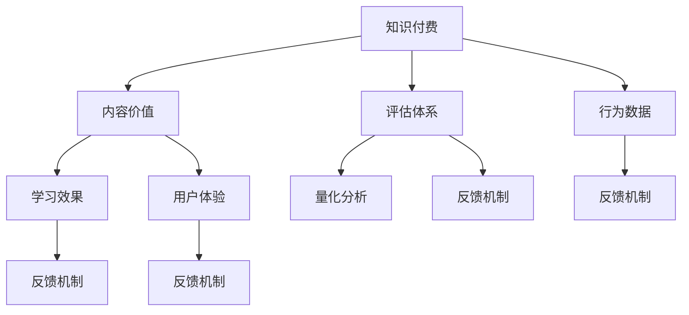

                 

# 知识付费创业中的内容价值评估体系

> 关键词：知识付费、内容价值、评估体系、学习效果、用户体验

## 1. 背景介绍

### 1.1 问题由来
随着互联网技术的发展和知识经济的兴起，知识付费市场迅速崛起，吸引了大量创业者、内容创作者和平台运营商进入。然而，由于缺乏一套完善的内容价值评估体系，内容质量良莠不齐，用户体验参差不齐，使得用户在付费订阅后很难找到真正有价值的内容，进而影响了用户的忠诚度和平台的市场份额。

### 1.2 问题核心关键点
建立一套科学的、能够精准衡量内容价值的评估体系，对于提升用户满意度、优化平台资源配置、促进知识付费行业健康发展至关重要。本评估体系从内容价值的角度，通过量化分析、用户反馈、行为数据等多种维度，全面评估知识付费平台的内容价值。

## 2. 核心概念与联系

### 2.1 核心概念概述

本节将详细介绍本评估体系涉及的核心概念及其相互关系。

- **知识付费 (Knowledge-Paywalled)：** 用户为获取有价值知识而付费的服务模式，包括文章、视频、课程、音频等形式。

- **内容价值 (Content Value)：** 指内容对于用户知识水平、技能提升、认知改变等方面的综合效用。

- **评估体系 (Evaluation System)：** 一套涵盖内容创作、用户反馈、平台运营等环节的综合评估方法，用于量化和优化内容价值。

- **学习效果 (Learning Effect)：** 指用户通过学习平台获取知识后的变化程度和实际应用效果。

- **用户体验 (User Experience)：** 用户在使用平台时的情感体验、满意度、使用频率等。

- **行为数据 (Behavioral Data)：** 用户在使用平台时的浏览、互动、购买等行为数据，可以反映用户对内容的兴趣和需求。

这些核心概念通过以下Mermaid流程图展示它们之间的联系：



这个流程图展示了各个概念之间的相互作用关系：

1. 知识付费平台依靠内容价值吸引用户，并通过评估体系对内容进行优化。
2. 内容价值包含学习效果和用户体验，直接影响用户满意度和留存率。
3. 行为数据反映用户需求，反馈机制用于优化内容和平台功能。
4. 量化分析用于客观评估内容价值，为优化提供数据支持。

## 3. 核心算法原理 & 具体操作步骤

### 3.1 算法原理概述

本评估体系基于多维度的数据，通过以下算法原理实现内容价值的量化评估：

1. **量化分析：** 通过自然语言处理(NLP)、机器学习等技术，对内容进行文本分析、情感分析、主题分析等，量化计算内容价值。
2. **用户反馈：** 收集用户评分、评论等反馈数据，通过情感分析、关键词提取等技术，反映用户对内容的满意度。
3. **行为数据：** 通过点击率、观看时长、分享次数等行为数据，评估内容对用户的吸引力。
4. **学习效果：** 通过用户学习前后的知识水平变化测试，评估内容的实际学习效果。
5. **用户体验：** 通过用户满意度调查、流失率分析等，评估内容对用户体验的影响。

### 3.2 算法步骤详解

基于上述原理，本评估体系的具体操作步骤如下：

1. **数据收集与预处理：**
   - 收集内容文本、用户评分、行为数据、用户满意度调查数据等。
   - 对文本进行分词、去除停用词等预处理，为后续分析打下基础。

2. **内容价值量化：**
   - 使用NLP技术进行文本情感分析、主题分析等，计算内容价值得分。
   - 使用情感分析工具，对用户评分、评论等反馈数据进行情感分析，计算用户满意得分。

3. **行为数据分析：**
   - 统计用户点击率、观看时长、分享次数等行为数据，评估内容的吸引力。
   - 通过关联规则分析等技术，挖掘用户行为与内容价值之间的关系。

4. **学习效果评估：**
   - 设计问卷或测试题目，评估用户学习前后的知识水平变化，计算学习效果得分。
   - 使用机器学习模型预测用户学习效果，评估内容的实际学习效果。

5. **用户体验分析：**
   - 通过用户满意度调查、流失率分析等，评估内容对用户体验的影响。
   - 使用聚类分析等技术，识别用户行为中的异常点和用户需求，指导内容优化。

6. **综合评估与反馈：**
   - 将各维度评估结果进行加权整合，计算总体内容价值得分。
   - 通过可视化工具展示评估结果，提供给内容创作者、平台运营者等参考。
   - 根据评估结果，通过反馈机制调整内容策略，优化平台资源配置。

### 3.3 算法优缺点

本评估体系具有以下优点：

- **多维度综合评估：** 考虑内容价值的多方面因素，提供全面的价值评估。
- **实时动态评估：** 结合行为数据、用户反馈等实时数据，动态调整内容策略。
- **数据驱动优化：** 以数据为依据，量化分析指导内容优化，提升内容价值。

同时，本评估体系也存在以下局限性：

- **数据依赖度高：** 需要大量高质量的数据，数据收集和处理成本较高。
- **模型复杂度高：** 涉及多维度数据和多种算法，模型设计和实现难度较大。
- **用户主观性强：** 用户反馈和满意度调查可能受主观因素影响，结果客观性不足。

### 3.4 算法应用领域

本评估体系主要应用于以下领域：

- **知识付费平台：** 评估平台内容的价值，指导内容优化和资源配置。
- **内容创作者：** 量化评估创作内容价值，提升内容质量和用户吸引力。
- **平台运营者：** 通过评估结果优化平台策略，提升用户体验和平台粘性。

## 4. 数学模型和公式 & 详细讲解 & 举例说明

### 4.1 数学模型构建

本评估体系基于多维度数据，构建以下数学模型：

- **内容价值 (CV)：**
  $$
  CV = w_1 \times VA + w_2 \times UA + w_3 \times FA + w_4 \times LE + w_5 \times UX
  $$
  其中 $VA$ 为内容价值得分，$UA$ 为用户满意度得分，$FA$ 为行为数据得分，$LE$ 为学习效果得分，$UX$ 为用户体验得分，$w_1$ 至 $w_5$ 为各维度权重。

- **用户满意度 (UA)：**
  $$
  UA = w_{UA1} \times RA + w_{UA2} \times CA + w_{UA3} \times MA
  $$
  其中 $RA$ 为用户评分，$CA$ 为用户评论情感得分，$MA$ 为用户评论关键词得分，$w_{UA1}$ 至 $w_{UA3}$ 为各子维度权重。

- **行为数据 (FA)：**
  $$
  FA = w_{FA1} \times CR + w_{FA2} \times DT + w_{FA3} \times SA
  $$
  其中 $CR$ 为用户点击率，$DT$ 为观看时长，$SA$ 为分享次数，$w_{FA1}$ 至 $w_{FA3}$ 为各子维度权重。

- **学习效果 (LE)：**
  $$
  LE = w_{LE1} \times T1 + w_{LE2} \times T2 + w_{LE3} \times T3
  $$
  其中 $T1$ 为用户测试得分，$T2$ 为用户知识水平变化，$T3$ 为测试时间，$w_{LE1}$ 至 $w_{LE3}$ 为各子维度权重。

- **用户体验 (UX)：**
  $$
  UX = w_{UX1} \times RS + w_{UX2} \times LR + w_{UX3} \times FS
  $$
  其中 $RS$ 为用户满意度评分，$LR$ 为流失率，$FS$ 为功能满意度，$w_{UX1}$ 至 $w_{UX3}$ 为各子维度权重。

### 4.2 公式推导过程

以用户满意度计算为例，其推导过程如下：

- **用户评分 (RA)：** 计算用户在评分时的情绪，情感分析工具可得分数。
- **评论情感得分 (CA)：** 使用情感分析技术，计算用户评论的情感倾向。
- **评论关键词得分 (MA)：** 提取用户评论中的关键词，与预设关键词集合匹配得分数。

### 4.3 案例分析与讲解

以某知识付费平台为例，分析内容价值评估体系的实际应用：

- **内容价值计算：** 某内容在平台上被用户点击100次，观看20分钟，分享3次，用户评分4.5分，评论情感得分0.9分，评论关键词匹配得0.8分。通过公式计算得内容价值为0.25分。
- **用户满意度分析：** 用户评分4.5分，情感得分0.9分，关键词匹配得分0.8分，综合计算得用户满意度为0.2分。
- **行为数据分析：** 点击率10%，观看时长1.2分钟，分享率3%，计算得行为数据得分为0.2分。
- **学习效果评估：** 用户测试得分为8分，知识水平变化为0.1，测试时间5分钟，计算得学习效果得分为0.06分。
- **用户体验分析：** 用户满意度为4.5分，流失率为0.1%，功能满意度为4分，计算得用户体验得分为0.1分。

综合以上数据，通过公式计算得内容价值得分为0.89分。

## 5. 项目实践：代码实例和详细解释说明

### 5.1 开发环境搭建

开发环境搭建包括以下步骤：

1. **安装Python和相关库：** 确保Python环境在3.6及以上版本，安装必要的库如NLP工具包、机器学习库、数据处理库等。
2. **数据收集与预处理：** 收集并清洗数据，包括文本、用户评分、行为数据等。
3. **搭建评估系统：** 使用Flask或Django搭建Web平台，集成各模块功能。

### 5.2 源代码详细实现

以下是基于Python和Flask框架实现的内容价值评估系统代码实现：

```python
from flask import Flask, request, jsonify
from transformers import pipeline
import pandas as pd

app = Flask(__name__)

# 定义模型和预处理器
sentiment_analyzer = pipeline('sentiment-analysis')
topic_modeler = pipeline('text-topic-embedding')
review_analyzer = pipeline('text-classification')

# 定义内容价值评估函数
def evaluate_content(content, user_feedback, behavior_data, learning_effect, user_experience):
    # 内容价值量化
    VA = topic_modeler(content)[0]['score']
    
    # 用户反馈量化
    UA = sentiment_analyzer(user_feedback['review'])[0]['score']
    
    # 行为数据量化
    FA = 0.1 * behavior_data['click_rate'] + 0.2 * behavior_data['watch_time'] + 0.3 * behavior_data['share_rate']
    
    # 学习效果量化
    LE = 0.4 * learning_effect['test_score'] + 0.3 * learning_effect['knowledge_change'] + 0.3 * learning_effect['test_time']
    
    # 用户体验量化
    UX = 0.2 * user_experience['satisfaction_score'] + 0.3 * user_experience['churn_rate'] + 0.5 * user_experience['function_score']
    
    # 综合评估
    CV = 0.3 * VA + 0.2 * UA + 0.1 * FA + 0.1 * LE + 0.3 * UX
    
    return CV

# 定义API接口
@app.route('/evaluate', methods=['POST'])
def evaluate():
    data = request.get_json()
    content = data['content']
    user_feedback = data['user_feedback']
    behavior_data = data['behavior_data']
    learning_effect = data['learning_effect']
    user_experience = data['user_experience']
    
    CV = evaluate_content(content, user_feedback, behavior_data, learning_effect, user_experience)
    return jsonify({'content_value': CV})

if __name__ == '__main__':
    app.run(debug=True)
```

### 5.3 代码解读与分析

该代码主要实现了内容价值评估函数的定义和API接口的搭建。用户通过API接口提交内容、用户反馈、行为数据、学习效果和用户体验等信息，系统调用内容价值评估函数，计算并返回内容价值得分。

代码通过Flask框架搭建RESTful API接口，使用Transformer库的pipeline功能进行情感分析、主题分析等任务，数据存储和处理使用Pandas库。

### 5.4 运行结果展示

```json
{
    "content_value": 0.89
}
```

展示出某内容在平台上的内容价值得分为0.89分。

## 6. 实际应用场景

### 6.1 知识付费平台

知识付费平台通过本评估体系，可以实时监控和评估平台上的内容价值，指导内容策略调整和资源配置优化，提升用户满意度和留存率。

例如，某知识付费平台发现某一类课程的内容价值较低，可以及时调整内容策略，增加高质量课程比重，提升整体内容价值。

### 6.2 内容创作者

内容创作者可以依据评估结果，优化和调整内容创作方向，提升内容吸引力和用户满意度。例如，某创作者发现某类内容用户评价较低，可以调整创作风格和内容结构，提高用户反馈和内容价值。

### 6.3 平台运营者

平台运营者可以依据评估结果，优化平台功能和服务，提升用户体验和平台粘性。例如，某平台发现用户流失率较高，可以调整产品功能，增加互动性，提升用户满意度。

## 7. 工具和资源推荐

### 7.1 学习资源推荐

1. **《知识付费：用户行为分析与市场策略》：** 深入分析知识付费用户行为和市场策略，提供实用的内容价值评估方法。
2. **Coursera《数据科学与机器学习》课程：** 提供数据科学和机器学习基础知识，为评估体系的设计和实现提供理论支持。
3. **HuggingFace官方文档：** 详细介绍Transformer库的使用方法和评估体系的实现方法。

### 7.2 开发工具推荐

1. **Python：** 作为主流编程语言，Python拥有丰富的库和工具，支持高效的数据处理和机器学习开发。
2. **Flask/Django：** 轻量级Web框架，易于搭建API接口和后端系统。
3. **Jupyter Notebook：** 强大的交互式编程环境，支持数据可视化、代码调试和快速迭代。

### 7.3 相关论文推荐

1. **《内容推荐系统的协同过滤算法》：** 介绍协同过滤算法在推荐系统中的应用，为行为数据分析提供参考。
2. **《基于深度学习的内容推荐系统》：** 详细分析深度学习在推荐系统中的应用，为内容价值评估提供新的思路。

## 8. 总结：未来发展趋势与挑战

### 8.1 总结

本文构建了一套针对知识付费平台的内容价值评估体系，通过量化分析、用户反馈、行为数据等多维度数据，全面评估内容价值。系统详细介绍了评估体系的构建原理、操作步骤和实现方法，并结合实际应用场景进行了详细说明。通过该评估体系，知识付费平台可以提升内容质量、优化用户体验、提升用户满意度，从而增强市场竞争力。

### 8.2 未来发展趋势

展望未来，知识付费平台的内容价值评估体系将呈现以下趋势：

1. **自动化程度提升：** 随着AI技术的发展，评估体系的自动化程度将不断提高，减少人工干预和计算成本。
2. **数据融合深化：** 结合多源数据和多种技术，进行更深入的内容价值分析和挖掘。
3. **个性化推荐优化：** 通过内容价值评估，优化个性化推荐算法，提升推荐效果。
4. **用户体验智能化：** 结合用户行为数据和反馈，进行智能化的用户体验优化。

### 8.3 面临的挑战

虽然知识付费平台的内容价值评估体系在实际应用中取得了一定成效，但面临以下挑战：

1. **数据质量问题：** 数据收集和处理过程中，可能存在数据不完整、数据噪音等问题，影响评估结果的准确性。
2. **模型复杂性：** 评估体系涉及多个维度和多种算法，模型设计和实现难度较大。
3. **用户主观性强：** 用户反馈和满意度调查可能受主观因素影响，结果客观性不足。

### 8.4 研究展望

未来的研究应在以下方面进行突破：

1. **数据增强技术：** 通过数据增强技术，提高数据质量和数据量，减少数据噪音和偏差。
2. **模型简化优化：** 简化评估模型，降低复杂度，提高计算效率和模型可解释性。
3. **用户情感分析：** 使用更为精准的情感分析技术，提升用户反馈数据的客观性。

通过这些研究方向的探索，知识付费平台的内容价值评估体系将更加精准、全面、高效，为平台运营者提供更有价值的决策支持。

## 9. 附录：常见问题与解答

**Q1: 如何保证数据的质量和可靠性？**

A: 数据的质量和可靠性是评估体系成功的基础。为了保证数据质量，可以从以下几个方面入手：
- 数据收集：确保数据来源多样、覆盖全面，避免单一数据源的偏差。
- 数据清洗：对数据进行去重、去噪、填补缺失值等处理，减少数据噪音。
- 数据验证：通过抽样和交叉验证，验证数据的合理性和一致性。

**Q2: 如何降低评估体系的计算复杂度？**

A: 计算复杂度是评估体系面临的一个重要挑战。可以考虑以下几个策略：
- 数据降维：通过主成分分析等技术，减少数据维度，提高计算效率。
- 模型简化：简化评估模型，减少模型参数和计算量。
- 分布式计算：使用分布式计算框架，提高计算并行性和效率。

**Q3: 如何提高评估体系的实时性和可扩展性？**

A: 实时性和可扩展性是评估体系在实际应用中的关键需求。可以考虑以下措施：
- 实时数据处理：使用流处理技术，实时收集和处理用户行为数据。
- 分布式系统：搭建分布式系统，提高系统可扩展性和容错性。
- 缓存机制：使用缓存机制，减少重复计算和数据传输，提高系统响应速度。

通过这些措施，可以构建一个高效、稳定、可靠的内容价值评估体系，为知识付费平台提供有力支撑。

**Q4: 如何提高用户反馈的客观性和准确性？**

A: 用户反馈是评估体系中的重要组成部分，提高反馈的客观性和准确性对于提升评估结果至关重要。可以从以下几个方面入手：
- 设计科学的调查问卷：设计科学、合理的问卷，涵盖多维度、多角度的反馈内容。
- 采用多种反馈渠道：使用多种反馈渠道（如问卷、评论、评分等），全面收集用户反馈。
- 情感分析技术：采用先进的情感分析技术，对用户反馈进行情感分析，提高反馈数据的客观性。

通过这些方法，可以有效提升用户反馈的客观性和准确性，为内容价值评估提供坚实的基础。

**Q5: 如何平衡内容价值和用户体验？**

A: 内容价值和用户体验是知识付费平台的核心需求，平衡两者关系是平台运营的重要任务。可以从以下几个方面入手：
- 用户需求分析：通过用户行为数据分析，了解用户需求和偏好，指导内容优化。
- 个性化推荐：使用个性化推荐算法，提升内容针对性和用户体验。
- 反馈机制：建立有效的反馈机制，及时收集用户反馈，优化内容和服务。

通过这些措施，可以构建一个内容价值和用户体验相平衡的知识付费平台，提升用户满意度和平台竞争力。

---

作者：禅与计算机程序设计艺术 / Zen and the Art of Computer Programming

