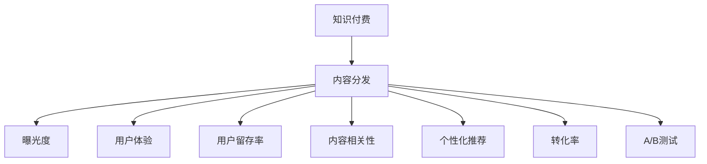

                 

# 知识付费创业中的内容分发策略

在当今信息爆炸的时代，知识付费作为一种新型商业模式，凭借其提供高质量、结构化、系统化的知识内容，满足用户深层次学习需求，从而获得了迅速发展和广泛认可。然而，如何在知识付费市场中脱颖而出，关键在于科学合理的内容分发策略。本文旨在深入探讨知识付费创业中的内容分发策略，包括核心概念、算法原理、具体操作步骤、实际应用、工具与资源推荐，以及未来发展趋势和面临的挑战，希望能够为行业内的创业者提供有价值的参考和指导。

## 1. 背景介绍

### 1.1 问题由来

随着在线教育和在线课程的兴起，知识付费市场快速成长。根据《2021年中国知识付费行业发展报告》，2020年中国知识付费市场规模达392亿元，预计到2023年将达到789亿元。知识付费平台不再仅仅关注课程数量，而是越来越注重课程质量、用户获取、留存及转化。在这一背景下，内容分发策略变得至关重要。

### 1.2 问题核心关键点

内容分发策略是知识付费平台成功的关键因素，直接影响到用户黏性和平台变现能力。一个好的分发策略，需要实现以下几个目标：
1. 提升内容曝光度，吸引更多用户关注。
2. 优化用户体验，增强用户黏性，提高用户留存率。
3. 促进知识变现，提高课程销售额和订阅用户数量。
4. 建立品牌影响力，增强用户对平台的信任感。

## 2. 核心概念与联系

### 2.1 核心概念概述

为更好地理解知识付费创业中的内容分发策略，本节将介绍几个密切相关的核心概念：

- 知识付费（Knowledge-based Subscription）：一种新兴的商业模式，用户为获取高质量知识内容而付费订阅。
- 内容分发（Content Distribution）：将内容推送至用户端的过程，包括推荐算法、用户界面设计等。
- 曝光度（Exposure）：指内容被用户看到的机会大小。
- 用户体验（User Experience）：指用户在使用平台时的主观感受和满意度。
- 用户留存率（User Retention Rate）：指平台用户在一定时间内的留存比例。
- 内容相关性（Content Relevance）：指内容与用户需求和兴趣的匹配程度。
- 个性化推荐（Personalized Recommendation）：根据用户行为和兴趣提供定制化的内容推荐。
- 转化率（Conversion Rate）：指付费用户占总用户数的比例。
- A/B测试（A/B Testing）：在平台不同版本间进行对比，评估分发策略的效果。

这些核心概念之间的逻辑关系可以通过以下Mermaid流程图来展示：



这个流程图展示了点到面的分发策略实施过程，具体到每个关键节点，涉及到内容的曝光度、用户体验、留存率、相关性、个性化推荐、转化率等方面。

## 3. 核心算法原理 & 具体操作步骤
### 3.1 算法原理概述

内容分发策略的核心在于提升内容的曝光度、用户体验和转化率。具体而言，可以通过以下算法原理来实现：

- **曝光度算法**：通过内容标签、用户标签、历史行为、社交网络等特征，采用协同过滤、基于内容的推荐、深度学习等方法，对内容进行排序和推荐。

- **个性化推荐算法**：利用用户画像、行为数据、兴趣标签、时间戳等特征，通过矩阵分解、深度神经网络、协同过滤等技术，提供精准的个性化推荐。

- **流量引导算法**：采用多臂老虎机（Bandit）策略、强化学习等方法，动态优化内容分发策略，最大化用户满意度和平台收益。

### 3.2 算法步骤详解

以个性化推荐算法为例，以下是详细的算法步骤：

1. **用户画像构建**：基于用户行为数据、人口统计信息、兴趣爱好等，构建用户画像。
2. **内容特征提取**：对内容进行标签化处理，提取关键词、分类、时间戳等特征。
3. **模型训练**：使用协同过滤、矩阵分解、深度神经网络等算法，训练个性化推荐模型。
4. **推荐计算**：将用户画像和内容特征输入模型，计算推荐结果。
5. **结果展示**：将推荐结果展示给用户，并根据反馈调整模型参数。

### 3.3 算法优缺点

个性化推荐算法具有以下优点：
- 提升用户体验，提高用户满意度和留存率。
- 通过个性化推荐，提升内容相关性，降低用户流失率。
- 通过精准推荐，提升转化率，增加平台的收益。

但其也存在以下缺点：
- 对数据质量和用户画像的准确性依赖较大，数据偏差可能导致推荐效果不佳。
- 推荐模型复杂度较高，需要较大的计算资源和时间成本。
- 用户画像的隐私问题，需合理处理用户数据。

### 3.4 算法应用领域

个性化推荐算法广泛应用于知识付费平台的内容分发中，例如：
- 课程推荐：根据用户历史浏览和购买数据，推荐相关课程。
- 订阅包推荐：根据用户兴趣和付费行为，推荐适合的订阅包。
- 专题推荐：根据热门话题和用户兴趣，推荐相关专题文章或视频。
- 活动推荐：根据用户历史行为和兴趣，推荐课程优惠、用户活动等。

## 4. 数学模型和公式 & 详细讲解 & 举例说明
### 4.1 数学模型构建

本节将以协同过滤（Collaborative Filtering）算法为例，说明其数学模型构建和原理。

设用户集为 $U$，物品集为 $I$，用户对物品的评分矩阵为 $R \in \mathbb{R}^{U \times I}$。协同过滤的目标是根据用户对物品的评分，预测用户未评分物品的评分。

令 $X \in \mathbb{R}^{U \times F}$ 为用户特征矩阵，$Y \in \mathbb{R}^{I \times F}$ 为物品特征矩阵，$F$ 为特征维度。协同过滤的数学模型为：

$$
\min_{X,Y} \sum_{i \in U, j \in I} \frac{1}{2} ||R_{i,j} - X_i^\top Y_j||^2 + \lambda (\|X\|_F^2 + \|Y\|_F^2)
$$

其中，$R_{i,j}$ 为用户 $i$ 对物品 $j$ 的评分，$\|\cdot\|_F$ 为矩阵的Frobenius范数，$\lambda$ 为正则化参数。

### 4.2 公式推导过程

将用户-物品评分矩阵 $R$ 分解为用户特征矩阵 $X$ 和物品特征矩阵 $Y$ 的乘积，得到：

$$
R = XY^\top
$$

将上述公式带入模型，得到：

$$
\min_{X,Y} \sum_{i \in U, j \in I} \frac{1}{2} ||R_{i,j} - X_i^\top Y_j||^2 + \lambda (\|X\|_F^2 + \|Y\|_F^2)
$$

对 $X$ 和 $Y$ 分别求偏导，并令其为零，解得：

$$
X = (XX^\top + \lambda I)^{-1} XR^\top, \quad Y = (YY^\top + \lambda I)^{-1} YR
$$

其中，$I$ 为单位矩阵，$||\cdot||^2$ 为矩阵的平方范数。

### 4.3 案例分析与讲解

以豆瓣电影为例，利用协同过滤算法为用户推荐未评分电影。设用户集为 $U$，物品集为 $I$，用户对物品的评分矩阵为 $R$。

1. **用户画像构建**：收集用户浏览、评分、标签等行为数据，构建用户画像。
2. **内容特征提取**：提取物品的标签、类型、评分、评分分布等特征。
3. **模型训练**：使用矩阵分解方法，训练协同过滤模型。
4. **推荐计算**：将用户画像和物品特征输入模型，计算推荐结果。
5. **结果展示**：将推荐结果展示给用户，并根据反馈调整模型参数。

## 5. 项目实践：代码实例和详细解释说明
### 5.1 开发环境搭建

在进行内容分发策略开发前，我们需要准备好开发环境。以下是使用Python进行TensorFlow开发的环境配置流程：

1. 安装Anaconda：从官网下载并安装Anaconda，用于创建独立的Python环境。

2. 创建并激活虚拟环境：
```bash
conda create -n tf-env python=3.8 
conda activate tf-env
```

3. 安装TensorFlow：根据CUDA版本，从官网获取对应的安装命令。例如：
```bash
conda install tensorflow -c conda-forge
```

4. 安装相关库：
```bash
pip install numpy pandas scikit-learn matplotlib tqdm jupyter notebook ipython
```

完成上述步骤后，即可在`tf-env`环境中开始内容分发策略的开发。

### 5.2 源代码详细实现

这里以协同过滤算法为例，给出使用TensorFlow实现内容推荐的Python代码。

```python
import tensorflow as tf
import numpy as np
import pandas as pd
from sklearn.decomposition import PCA

def collaborative_filtering(data, rank=10):
    user_count = len(data.index)
    item_count = len(data.columns)
    
    # 将数据转化为稠密矩阵
    user_matrix = data.values
    item_matrix = user_matrix.transpose()
    
    # 矩阵分解
    U, V = tf.keras.layers.experimental.preprocessing.MatrixFactorizationFactorizer(rank).fit([user_matrix, item_matrix])
    
    # 预测评分
    X = np.dot(U, V)
    predicted_scores = np.dot(X, item_matrix.T)
    
    return predicted_scores
```

### 5.3 代码解读与分析

让我们再详细解读一下关键代码的实现细节：

**协同过滤算法实现**：
- 使用TensorFlow的矩阵分解库，对用户和物品的评分矩阵进行矩阵分解。
- 将分解得到的用户矩阵和物品矩阵乘起来，得到预测评分矩阵。

**代码细节**：
- 导入TensorFlow、numpy、pandas等库。
- 定义协同过滤函数，接收评分数据作为输入。
- 构建用户和物品的评分矩阵。
- 使用矩阵分解模型进行分解。
- 计算预测评分，返回结果。

## 6. 实际应用场景

### 6.1 智能课程推荐

知识付费平台通过智能课程推荐，能够显著提升用户活跃度和留存率。例如，优学教育利用协同过滤算法，根据用户历史浏览和购买数据，推荐相关课程。其具体步骤如下：

1. **数据收集**：收集用户浏览、评分、标签等行为数据。
2. **用户画像构建**：通过行为数据，构建用户画像。
3. **内容特征提取**：提取课程标签、类别、难度等特征。
4. **模型训练**：使用协同过滤算法，训练推荐模型。
5. **推荐计算**：将用户画像和课程特征输入模型，计算推荐结果。
6. **结果展示**：将推荐结果展示给用户，并根据反馈调整模型参数。

### 6.2 个性化订阅包推荐

个性化订阅包推荐能够帮助平台提升用户粘性和收益。例如，得到大学平台利用协同过滤算法，根据用户历史行为和兴趣，推荐适合的订阅包。其具体步骤如下：

1. **数据收集**：收集用户订阅、付费、行为等数据。
2. **用户画像构建**：通过行为数据，构建用户画像。
3. **内容特征提取**：提取订阅包标签、类型、内容等特征。
4. **模型训练**：使用协同过滤算法，训练推荐模型。
5. **推荐计算**：将用户画像和订阅包特征输入模型，计算推荐结果。
6. **结果展示**：将推荐结果展示给用户，并根据反馈调整模型参数。

### 6.3 活动推荐

活动推荐能够提高用户参与度和平台流量。例如，得到大学平台利用协同过滤算法，根据用户历史行为和兴趣，推荐课程优惠、用户活动等。其具体步骤如下：

1. **数据收集**：收集用户浏览、购买、活动参与等数据。
2. **用户画像构建**：通过行为数据，构建用户画像。
3. **内容特征提取**：提取活动标签、时间、优惠力度等特征。
4. **模型训练**：使用协同过滤算法，训练推荐模型。
5. **推荐计算**：将用户画像和活动特征输入模型，计算推荐结果。
6. **结果展示**：将推荐结果展示给用户，并根据反馈调整模型参数。

### 6.4 未来应用展望

伴随知识付费平台的迅速发展，内容分发策略将呈现以下几个趋势：

1. **多模态内容推荐**：除了文本内容，未来还将扩展到音频、视频等多模态内容，提升推荐效果。
2. **上下文感知推荐**：利用上下文信息，提高推荐精度和用户体验。
3. **实时推荐**：采用实时推荐算法，提升用户响应速度和体验。
4. **个性化精准推荐**：利用更多用户数据和特征，实现更加精准的推荐。
5. **用户自驱动推荐**：赋予用户推荐权力，提升用户满意度。

以上趋势将推动知识付费平台向更加智能化、个性化、实时化的方向发展，为用户带来更好的学习和娱乐体验。

## 7. 工具和资源推荐
### 7.1 学习资源推荐

为了帮助开发者系统掌握内容分发策略的理论基础和实践技巧，这里推荐一些优质的学习资源：

1. **《推荐系统》书籍**：吴恩达等人所著，系统介绍了推荐系统的理论和算法。
2. **《Python推荐系统实战》**：介绍使用Python实现推荐系统的实战经验。
3. **Coursera《推荐系统专项课程》**：斯坦福大学开设的推荐系统课程，涵盖推荐系统的基本原理和算法。
4. **Kaggle推荐系统竞赛**：通过参与Kaggle比赛，学习和实践推荐算法。
5. **Pinterest《推荐系统案例》**：Pinterest公司分享推荐系统的实践经验。

通过对这些资源的学习实践，相信你一定能够快速掌握内容分发策略的精髓，并用于解决实际的推荐问题。

### 7.2 开发工具推荐

高效的开发离不开优秀的工具支持。以下是几款用于内容分发策略开发的常用工具：

1. **TensorFlow**：基于Python的开源深度学习框架，适合快速迭代研究。
2. **PyTorch**：基于Python的深度学习框架，支持动态图和静态图。
3. **Keras**：基于TensorFlow和Theano的高层次API，易于上手。
4. **scikit-learn**：Python科学计算库，包含多种机器学习算法。
5. **scipy**：Python科学计算库，提供数据分析和数学运算支持。
6. **Jupyter Notebook**：交互式编程环境，支持代码和文本混合编辑。

合理利用这些工具，可以显著提升内容分发策略的开发效率，加快创新迭代的步伐。

### 7.3 相关论文推荐

内容分发策略的发展源于学界的持续研究。以下是几篇奠基性的相关论文，推荐阅读：

1. **《协同过滤算法》**：Shi等人的经典论文，介绍协同过滤算法的基本原理和实现方法。
2. **《深度学习在推荐系统中的应用》**：Zhou等人的综述性论文，介绍深度学习在推荐系统中的应用。
3. **《矩阵分解在推荐系统中的应用》**：Gutmann等人的论文，介绍矩阵分解的基本原理和实现方法。
4. **《基于上下文感知的推荐系统》**：Yi等人的论文，介绍上下文感知的推荐算法。
5. **《实时推荐系统》**：Xiao等人的论文，介绍实时推荐系统的方法和实践经验。

这些论文代表了大数据推荐系统的研究脉络。通过学习这些前沿成果，可以帮助研究者把握学科前进方向，激发更多的创新灵感。

## 8. 总结：未来发展趋势与挑战

### 8.1 总结

本文对知识付费创业中的内容分发策略进行了全面系统的介绍。首先阐述了知识付费平台成功的关键在于内容分发策略，明确了策略实施的若干核心目标。其次，从原理到实践，详细讲解了个性化推荐、协同过滤等分发算法的数学模型和操作步骤，给出了内容分发策略的完整代码实例。同时，本文还探讨了策略在智能课程推荐、个性化订阅包推荐等实际应用中的具体应用，展示了分发策略的巨大潜力。此外，本文精选了分发策略的学习资源、开发工具和相关论文，力求为行业内的创业者提供全方位的技术指引。

通过本文的系统梳理，可以看到，内容分发策略是知识付费平台成功的核心要素，对用户黏性、平台收益等方面有显著影响。未来，伴随分发策略的不断优化和创新，知识付费平台将在教育、娱乐等多个领域持续扩展其应用边界，为用户带来更好的学习体验和价值。

### 8.2 未来发展趋势

展望未来，内容分发策略将呈现以下几个发展趋势：

1. **多模态内容分发**：除了文本内容，未来还将扩展到音频、视频等多模态内容，提升分发效果。
2. **上下文感知分发**：利用上下文信息，提高分发精度和用户体验。
3. **实时分发**：采用实时分发算法，提升用户响应速度和体验。
4. **个性化精准分发**：利用更多用户数据和特征，实现更加精准的分发。
5. **用户自驱动分发**：赋予用户分发权力，提升用户满意度。

以上趋势将推动知识付费平台向更加智能化、个性化、实时化的方向发展，为用户带来更好的学习和娱乐体验。

### 8.3 面临的挑战

尽管内容分发策略已经取得了显著成果，但在迈向更加智能化、普适化应用的过程中，它仍面临诸多挑战：

1. **数据质量和用户画像的准确性**：分发策略的效果很大程度上依赖于数据质量和用户画像的准确性，数据偏差可能导致分发效果不佳。
2. **分发算法的复杂性**：推荐算法复杂度较高，需要较大的计算资源和时间成本。
3. **用户隐私保护**：用户画像的隐私问题，需合理处理用户数据。
4. **分发策略的可解释性**：分发算法的可解释性不足，难以对其决策逻辑进行分析和调试。
5. **分发策略的鲁棒性**：分发模型面对域外数据时，泛化性能往往大打折扣。

解决这些挑战，将是大数据分发策略实现的重要方向。

### 8.4 研究展望

未来的内容分发策略研究需要在以下几个方面寻求新的突破：

1. **数据治理**：建立数据治理机制，保障数据质量，提升用户画像的准确性。
2. **模型优化**：开发更加高效的分发算法，降低计算资源和时间成本。
3. **隐私保护**：采用隐私保护技术，保障用户数据的匿名性和安全性。
4. **算法可解释性**：提高分发算法的可解释性，提升系统的透明度和可信任度。
5. **鲁棒性增强**：采用鲁棒性强的分发算法，提升模型泛化性能。

这些研究方向的探索，必将引领内容分发策略技术迈向更高的台阶，为构建知识付费平台提供有力支持。

## 9. 附录：常见问题与解答

**Q1：如何选择合适的推荐算法？**

A: 选择合适的推荐算法需要综合考虑数据特征、用户需求、平台资源等因素。常见的推荐算法包括协同过滤、基于内容的推荐、深度学习等。协同过滤适用于大规模用户数据，基于内容的推荐适用于小规模用户数据，深度学习适用于数据稀疏和多样化的情况。

**Q2：如何提升推荐算法的性能？**

A: 提升推荐算法性能的常见方法包括：
1. 数据清洗：清理和去除数据中的噪声和异常值。
2. 特征工程：构建和优化特征，提升模型对数据的表达能力。
3. 模型优化：选择合适的模型，调整超参数，提高模型泛化能力。
4. 融合多种算法：组合多种推荐算法，提升综合效果。
5. 实时更新：根据用户反馈和数据变化，实时更新推荐结果。

**Q3：推荐算法在实际应用中需要注意哪些问题？**

A: 推荐算法在实际应用中需要注意以下问题：
1. 用户画像的准确性：用户画像的准确性直接影响推荐效果。
2. 推荐结果的多样性：避免过度同质化推荐，满足用户的多样化需求。
3. 推荐算法的可解释性：提高算法的可解释性，提升系统的透明度和可信任度。
4. 用户隐私保护：保护用户隐私，合理处理用户数据。
5. 推荐模型的鲁棒性：模型面对域外数据时，泛化性能往往大打折扣。

**Q4：如何评估推荐算法的性能？**

A: 推荐算法性能的评估指标包括：
1. 准确率：推荐结果与真实标签的匹配程度。
2. 召回率：真实标签在推荐结果中的占比。
3. F1分数：综合考虑准确率和召回率。
4. AUC：ROC曲线下的面积，衡量模型的分类能力。
5. NDCG：Normalized Discounted Cumulative Gain，衡量推荐排序的效果。

这些指标可以帮助评估推荐算法的优劣，选择适合的推荐算法。

---

作者：禅与计算机程序设计艺术 / Zen and the Art of Computer Programming

