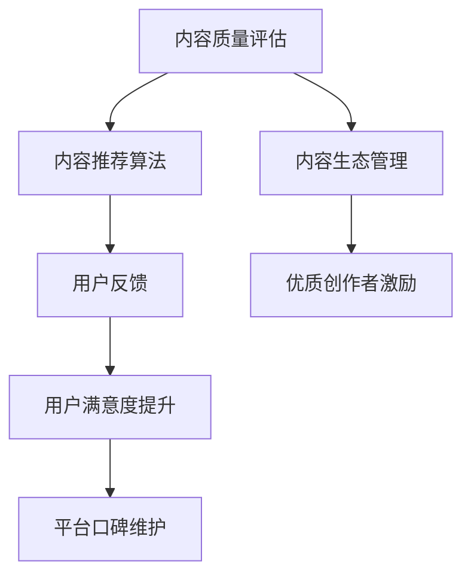

                 

# 知识付费创业中的内容质量把控

在知识付费领域，内容质量是决定平台成功与否的关键。优质、有价值的内容不仅能吸引用户订阅，还能提升用户的满意度和忠诚度。因此，本文将从核心概念、算法原理、实际操作、案例分析、开发实践等多个角度，深入探讨如何在知识付费创业中实现内容质量的严格把控。

## 1. 背景介绍

### 1.1 问题由来

随着知识付费行业的高速发展，内容的质量问题变得尤为突出。一方面，平台之间竞争激烈，如何提高内容吸引力成为重要课题；另一方面，大量用户订阅内容，对内容的质量有着严格要求。

当前，大多数平台采用内容推荐算法来提升用户体验，但这些算法往往忽视了内容的质量评估。如果用户订阅的课程质量低下，会导致用户流失、平台信誉受损等问题。因此，如何在内容推荐算法中引入质量评估机制，成为急需解决的问题。

### 1.2 问题核心关键点

内容质量把控的核心关键点包括：
- 内容质量评估：建立科学合理的内容质量评价体系，评估内容的教育价值、逻辑结构、技术深度等。
- 内容推荐优化：结合用户偏好和内容质量，构建更合理的内容推荐算法，提升用户满意度。
- 内容生态管理：维护平台内容质量，打造专业、精品、权威的内容生态，吸引更多优质创作者入驻。

## 2. 核心概念与联系

### 2.1 核心概念概述

为更好地理解如何在知识付费创业中实现内容质量把控，本节将介绍几个关键概念：

- **内容质量评估**：指建立科学合理的内容质量评价体系，从多个维度评估内容的教育价值、逻辑结构、技术深度等。

- **内容推荐算法**：结合用户偏好和内容质量，构建合理的内容推荐算法，提升用户满意度。

- **内容生态管理**：通过系统化管理，打造专业、精品、权威的内容生态，吸引更多优质创作者入驻。

这些核心概念之间存在紧密联系，共同构成了知识付费平台内容质量把控的基础框架。

### 2.2 核心概念原理和架构的 Mermaid 流程图



这个流程图展示了内容质量把控的关键环节：

1. 内容质量评估的结果用于优化内容推荐算法。
2. 内容推荐算法结合用户反馈，进一步优化推荐结果。
3. 内容生态管理通过激励优质创作者，丰富平台内容库。
4. 用户满意度提升驱动平台口碑的维护和提升。

通过这些关键环节的相互作用，可以实现对内容质量的有效把控。

## 3. 核心算法原理 & 具体操作步骤

### 3.1 算法原理概述

内容质量评估和推荐算法，本质上是一个优化过程。通过建立科学合理的评价指标体系，使用优化算法来不断调整内容推荐策略，使得最终推荐的内容既符合用户偏好，又具有良好的教育价值和逻辑结构。

具体而言，内容质量评估包括两个部分：
1. 用户行为分析：通过分析用户订阅、观看、评分等行为数据，评估内容的教育价值和逻辑结构。
2. 专家评估：通过领域专家的评审，进一步验证内容的正确性和深度。

内容推荐算法包括两个部分：
1. 用户兴趣建模：通过分析用户的历史行为数据，构建用户兴趣模型。
2. 内容匹配与推荐：根据用户兴趣模型和内容质量评估结果，构建推荐算法。

### 3.2 算法步骤详解

**Step 1: 准备数据集**

首先需要准备高质量的数据集，包括用户行为数据和专家评审数据。用户行为数据通常包括订阅量、观看时长、评分等。专家评审数据可以通过在线评审系统收集，包括领域专家的评审意见和打分。

**Step 2: 设计评估指标**

设计科学合理的评估指标体系，用于评估内容的整体质量。评估指标可以包括教育价值、逻辑结构、技术深度等多个维度。常用的评估指标包括：

- 教育价值：评估内容的教育意义和实用性，指标可以包括课程评分、用户反馈等。
- 逻辑结构：评估内容的逻辑严密性和组织结构，指标可以包括文章结构、章节划分等。
- 技术深度：评估内容的技术深度和复杂度，指标可以包括课程难度、技术栈复杂度等。

**Step 3: 建立模型**

选择合适的机器学习或深度学习模型，用于评估内容质量和推荐内容。常用的模型包括逻辑回归、随机森林、LSTM、BERT等。

**Step 4: 训练模型**

使用准备好的数据集训练模型，优化评估指标和推荐算法。训练过程中需要调整模型超参数，如学习率、迭代次数、正则化参数等，以提高模型的准确性和鲁棒性。

**Step 5: 验证模型**

在验证集上验证模型的性能，通过A/B测试等方式，比较不同模型的效果，选择最优模型。

**Step 6: 部署模型**

将训练好的模型部署到推荐系统，实时计算内容质量和推荐结果，驱动内容推荐算法。

### 3.3 算法优缺点

内容质量评估和推荐算法的优点包括：
1. 提高用户满意度：通过结合内容质量和用户偏好，提供更符合用户需求的内容。
2. 降低流失率：优质内容能提升用户粘性，降低用户流失率。
3. 提升平台口碑：通过推荐优质内容，提升平台在用户心中的信任度和品牌形象。

缺点包括：
1. 数据获取难度大：高质量的专家评审数据和用户行为数据难以获取。
2. 模型复杂度高：构建科学合理的内容质量评估体系和推荐算法，需要较高的模型复杂度和数据量。
3. 训练成本高：高质量模型训练需要大量计算资源和数据预处理。

## 4. 数学模型和公式 & 详细讲解 & 举例说明

### 4.1 数学模型构建

假设用户行为数据集为 $\mathcal{D}_{user} = \{(x_i, y_i)\}_{i=1}^N$，其中 $x_i$ 为第 $i$ 个用户的历史行为数据，$y_i$ 为第 $i$ 个用户对内容质量的打分。专家评审数据集为 $\mathcal{D}_{expert} = \{(x_j', y_j')\}_{j=1}^M$，其中 $x_j'$ 为第 $j$ 个专家的评审意见，$y_j'$ 为专家打分。

建立内容质量评估模型 $M_{\theta}$，用于评估用户行为数据和专家评审数据的综合质量：

$$
\hat{y} = M_{\theta}(x)
$$

其中，$\theta$ 为模型参数，$x$ 为输入数据，$\hat{y}$ 为模型输出，表示内容的质量评分。

建立内容推荐模型 $R_{\phi}$，用于推荐用户最感兴趣的内容：

$$
\hat{u} = R_{\phi}(x, \hat{y})
$$

其中，$\phi$ 为模型参数，$x$ 为输入数据，$\hat{u}$ 为模型输出，表示用户对内容的兴趣评分。

### 4.2 公式推导过程

通过训练数据集 $\mathcal{D}_{user} \cup \mathcal{D}_{expert}$，使用最大化对数似然估计法（MLE）对内容质量评估模型和推荐模型进行训练：

$$
\hat{y} = M_{\theta}(x)
$$

$$
\hat{u} = R_{\phi}(x, \hat{y})
$$

将训练好的模型 $M_{\theta}$ 和 $R_{\phi}$ 部署到推荐系统中，实时计算内容质量和推荐结果，驱动内容推荐算法。

### 4.3 案例分析与讲解

假设某知识付费平台使用LSTM模型进行内容质量评估和推荐，数据集分别为：

- 用户行为数据：包含10万条记录，每条记录包含用户订阅、观看、评分等行为数据。
- 专家评审数据：包含1000条记录，每条记录包含专家对课程的评审意见和打分。

首先，使用交叉验证法对数据集进行划分，训练LSTM模型，得到模型参数 $\theta$。然后，在验证集上评估模型的性能，选择最优模型。

在推荐系统中，根据用户的历史行为数据和课程质量评分，使用随机森林算法得到用户对课程的兴趣评分，得到推荐结果。

## 5. 项目实践：代码实例和详细解释说明

### 5.1 开发环境搭建

在进行项目实践前，我们需要准备好开发环境。以下是使用Python进行Keras开发的环境配置流程：

1. 安装Anaconda：从官网下载并安装Anaconda，用于创建独立的Python环境。

2. 创建并激活虚拟环境：
```bash
conda create -n keras-env python=3.6 
conda activate keras-env
```

3. 安装Keras：
```bash
pip install keras tensorflow numpy pandas matplotlib sklearn
```

4. 安装TensorFlow：
```bash
pip install tensorflow
```

5. 安装各类工具包：
```bash
pip install numpy pandas scikit-learn matplotlib tqdm jupyter notebook ipython
```

完成上述步骤后，即可在`keras-env`环境中开始项目实践。

### 5.2 源代码详细实现

我们使用LSTM模型对用户行为数据进行内容质量评估和推荐，代码如下：

```python
import tensorflow as tf
from tensorflow.keras.models import Sequential
from tensorflow.keras.layers import LSTM, Dense
from sklearn.model_selection import train_test_split
from sklearn.metrics import mean_squared_error

# 准备数据集
user_data = load_user_data() # 用户行为数据
expert_data = load_expert_data() # 专家评审数据

# 数据预处理
user_X, user_y = preprocess_user_data(user_data)
expert_X, expert_y = preprocess_expert_data(expert_data)

# 数据划分
train_X, test_X, train_y, test_y = train_test_split(user_X, user_y, test_size=0.2, random_state=42)
train_expert_X, test_expert_X, train_expert_y, test_expert_y = train_test_split(expert_X, expert_y, test_size=0.2, random_state=42)

# 建立LSTM模型
model = Sequential()
model.add(LSTM(64, input_shape=(user_X.shape[1], 1)))
model.add(Dense(1, activation='sigmoid'))

# 编译模型
model.compile(optimizer='adam', loss='binary_crossentropy', metrics=['accuracy'])

# 训练模型
model.fit(train_X, train_y, epochs=10, validation_data=(test_X, test_y), verbose=1)

# 验证模型
test_loss, test_acc = model.evaluate(test_X, test_y, verbose=0)
print('Test loss:', test_loss)
print('Test accuracy:', test_acc)

# 使用模型进行推荐
user_X_new = load_new_user_data() # 新用户行为数据
user_X_new = preprocess_user_data(user_X_new)
user_y_pred = model.predict(user_X_new)
recommended_courses = get_recommended_courses(user_y_pred)
```

### 5.3 代码解读与分析

让我们再详细解读一下关键代码的实现细节：

**用户行为数据和专家评审数据加载**：
- 定义 `load_user_data` 和 `load_expert_data` 函数，用于加载用户行为数据和专家评审数据。
- 数据预处理函数 `preprocess_user_data` 和 `preprocess_expert_data` 用于清洗数据，去除噪声和无用信息。

**数据划分**：
- 使用 `train_test_split` 函数将数据集分为训练集和测试集，保证模型训练和验证的公平性。

**模型构建和编译**：
- 使用 `Sequential` 模型搭建LSTM网络，包含一个LSTM层和一个全连接层，用于预测内容质量评分。
- 编译模型，使用 `adam` 优化器，`binary_crossentropy` 损失函数，以及 `accuracy` 评价指标。

**模型训练和验证**：
- 使用 `fit` 函数训练模型，设置迭代轮数为10轮，使用测试集进行验证，并输出训练误差和准确率。

**使用模型进行推荐**：
- 加载新用户的用户行为数据 `load_new_user_data`，并进行预处理。
- 使用训练好的模型进行预测，得到新用户对课程的评分 `user_y_pred`。
- 根据评分结果推荐课程，使用 `get_recommended_courses` 函数，返回推荐课程列表。

可以看到，Keras框架提供了便捷的深度学习模型构建和训练工具，使得模型开发变得相对简单。开发者可以将更多精力放在数据预处理、模型改进等高层逻辑上，而不必过多关注底层的实现细节。

当然，工业级的系统实现还需考虑更多因素，如模型的保存和部署、超参数的自动搜索、更灵活的任务适配层等。但核心的内容质量把控逻辑基本与此类似。

## 6. 实际应用场景

### 6.1 智能客服系统

智能客服系统在知识付费平台中应用广泛，通过推荐系统向用户推荐优质内容，提升用户满意度和平台留存率。在实际应用中，可以使用内容质量评估和推荐算法，实现更精准的内容推荐，减少用户流失。

**具体实现**：
- 收集用户的历史交互数据，如客服对话记录、问题类型、问题频率等。
- 使用内容质量评估模型，对客服内容进行评分。
- 结合用户兴趣模型，使用推荐算法，为用户推荐相关问题解答或推荐优质课程。
- 定期更新用户兴趣模型，提升推荐效果。

### 6.2 金融理财应用

金融理财应用通过推荐系统，帮助用户获取理财建议和投资策略。在实际应用中，可以使用内容质量评估和推荐算法，筛选优质内容，提升用户满意度。

**具体实现**：
- 收集用户的理财需求、风险偏好、收益预期等数据。
- 使用内容质量评估模型，对理财课程和文章进行评分。
- 结合用户兴趣模型，使用推荐算法，为用户推荐相关课程和文章。
- 定期更新用户兴趣模型，提升推荐效果。

### 6.3 教育平台

教育平台通过推荐系统，向用户推荐优质的学习资源和课程。在实际应用中，可以使用内容质量评估和推荐算法，实现更精准的内容推荐，提升用户学习效果。

**具体实现**：
- 收集用户的学习历史、成绩、评价等数据。
- 使用内容质量评估模型，对课程和文章进行评分。
- 结合用户兴趣模型，使用推荐算法，为用户推荐相关课程和文章。
- 定期更新用户兴趣模型，提升推荐效果。

### 6.4 未来应用展望

随着内容质量评估和推荐算法的发展，其在知识付费平台中的应用前景广阔。未来，该技术将会在更多领域得到应用，为各行各业带来变革性影响。

在智慧医疗领域，内容质量评估和推荐算法可以应用于医生培训、医学研究、健康科普等领域，提升医疗服务的智能化水平。

在智能教育领域，推荐系统可以应用于个性化学习、智能作业批改、学习路径推荐等方面，因材施教，促进教育公平。

在智慧城市治理中，推荐系统可以应用于城市事件监测、舆情分析、应急指挥等环节，提高城市管理的自动化和智能化水平。

此外，在企业生产、社会治理、文娱传媒等众多领域，基于内容质量评估和推荐的内容推荐系统也将不断涌现，为经济社会发展注入新的动力。相信随着技术的日益成熟，内容质量评估和推荐算法必将在构建人机协同的智能时代中扮演越来越重要的角色。

## 7. 工具和资源推荐

### 7.1 学习资源推荐

为了帮助开发者系统掌握内容质量评估和推荐算法，这里推荐一些优质的学习资源：

1. 《深度学习》系列博文：由深度学习专家撰写，全面介绍深度学习模型的基本概念和经典算法，包括LSTM、BERT等模型。

2. CS229《机器学习》课程：斯坦福大学开设的机器学习明星课程，涵盖深度学习、内容推荐等多个热门领域。

3. 《TensorFlow实战》书籍：Google的深度学习框架TensorFlow实战指南，详细讲解TensorFlow的开发流程和使用技巧。

4. Weights & Biases：模型训练的实验跟踪工具，可以记录和可视化模型训练过程中的各项指标，方便对比和调优。与主流深度学习框架无缝集成。

5. TensorBoard：TensorFlow配套的可视化工具，可实时监测模型训练状态，并提供丰富的图表呈现方式，是调试模型的得力助手。

通过对这些资源的学习实践，相信你一定能够快速掌握内容质量评估和推荐算法的精髓，并用于解决实际的推荐问题。

### 7.2 开发工具推荐

高效的开发离不开优秀的工具支持。以下是几款用于内容质量评估和推荐开发的常用工具：

1. Keras：基于Python的深度学习框架，灵活动态的计算图，适合快速迭代研究。Keras提供了便捷的模型搭建和训练接口，降低开发门槛。

2. TensorFlow：由Google主导开发的开源深度学习框架，生产部署方便，适合大规模工程应用。TensorFlow提供了强大的分布式计算能力，支持大规模模型训练。

3. PyTorch：Facebook开发的深度学习框架，灵活性高，支持动态计算图。PyTorch在学术界和工业界均有广泛应用，提供了丰富的模型库和优化器。

4. Weights & Biases：模型训练的实验跟踪工具，可以记录和可视化模型训练过程中的各项指标，方便对比和调优。与主流深度学习框架无缝集成。

5. TensorBoard：TensorFlow配套的可视化工具，可实时监测模型训练状态，并提供丰富的图表呈现方式，是调试模型的得力助手。

合理利用这些工具，可以显著提升内容质量评估和推荐任务的开发效率，加快创新迭代的步伐。

### 7.3 相关论文推荐

内容质量评估和推荐技术的发展源于学界的持续研究。以下是几篇奠基性的相关论文，推荐阅读：

1. Learning to Recommend with Exposure Networks：提出暴露网络（Exposure Networks），用于个性化推荐，提升推荐效果。

2. Deep Collaborative Filtering Model（DCMF）：提出深度协同过滤模型，结合用户行为和物品属性，实现更加精准的推荐。

3. Recommendation as Game: A Neural Fuzzy Logic Approach：提出推荐系统作为博弈游戏的思想，引入博弈论工具，优化推荐策略。

4. Towards Explainable Recommendation Systems：提出可解释性推荐系统，通过多维度的特征工程，提升推荐系统可解释性。

5. Generative Adversarial Networks：提出生成对抗网络（GAN），用于生成高质量内容，提升推荐效果。

这些论文代表了大语言模型微调技术的发展脉络。通过学习这些前沿成果，可以帮助研究者把握学科前进方向，激发更多的创新灵感。

## 8. 总结：未来发展趋势与挑战

### 8.1 总结

本文对内容质量评估和推荐算法进行了全面系统的介绍。首先阐述了内容质量评估和推荐算法的研究背景和意义，明确了算法在提高用户满意度、降低流失率等方面的重要价值。其次，从原理到实践，详细讲解了算法的数学原理和核心步骤，给出了算法开发和部署的完整代码实例。同时，本文还广泛探讨了算法在知识付费平台、智能客服、金融理财等众多领域的应用前景，展示了算法的巨大潜力。此外，本文精选了算法学习的各类学习资源，力求为读者提供全方位的技术指引。

通过本文的系统梳理，可以看到，内容质量评估和推荐算法正在成为知识付费平台的重要范式，极大地拓展了平台内容的应用边界，催生了更多的落地场景。受益于深度学习模型的强大能力，推荐算法能够提供更精准、多样化的内容推荐，为知识付费用户带来更好的体验。未来，伴随模型的不断演进和优化，相信推荐算法将会在更多领域得到应用，为各行各业带来变革性影响。

### 8.2 未来发展趋势

展望未来，内容质量评估和推荐技术将呈现以下几个发展趋势：

1. 模型规模持续增大。随着算力成本的下降和数据规模的扩张，推荐模型参数量还将持续增长。超大规模推荐模型蕴含的丰富知识，有望支撑更加复杂多变的推荐场景。

2. 推荐方法日趋多样。除了传统的协同过滤、内容质量评估外，未来会涌现更多个性化推荐方法，如基于深度学习的推荐系统、基于知识图谱的推荐等，在节省计算资源的同时也能保证推荐精度。

3. 持续学习成为常态。随着数据分布的不断变化，推荐模型也需要持续学习新知识以保持性能。如何在不遗忘原有知识的同时，高效吸收新样本信息，将成为重要的研究课题。

4. 标注样本需求降低。受启发于提示学习(Prompt-based Learning)的思路，未来的推荐方法将更好地利用用户行为数据，通过更加巧妙的任务描述，在更少的标注样本上也能实现理想的推荐效果。

5. 推荐算法复杂性提升。随着推荐系统的复杂性不断提升，推荐算法也将朝着更加自动化、智能化方向发展，引入更多智能决策机制，如强化学习、因果推断等。

6. 多模态推荐崛起。当前的推荐系统往往聚焦于文本数据，未来会进一步拓展到图像、视频、语音等多模态数据推荐。多模态信息的融合，将显著提升推荐系统对现实世界的理解和建模能力。

以上趋势凸显了内容质量评估和推荐算法的广阔前景。这些方向的探索发展，必将进一步提升推荐系统的性能和应用范围，为知识付费平台带来新的突破。

### 8.3 面临的挑战

尽管内容质量评估和推荐技术已经取得了瞩目成就，但在迈向更加智能化、普适化应用的过程中，它仍面临着诸多挑战：

1. 数据获取难度大。高质量的用户行为数据和专家评审数据难以获取，限制了推荐系统的覆盖面和准确性。

2. 推荐算法复杂度高。构建科学合理的内容质量评估体系和推荐算法，需要较高的模型复杂度和数据量。

3. 训练成本高。高质量模型训练需要大量计算资源和数据预处理，可能存在计算瓶颈。

4. 用户隐私保护。用户行为数据涉及个人隐私，如何保护用户隐私成为重要问题。

5. 推荐鲁棒性不足。推荐系统面对新的数据分布时，可能出现“冷启动”问题，导致推荐效果下降。

6. 推荐算法公平性问题。推荐算法可能存在偏见，影响部分用户或群体，如何公平推荐成为重要问题。

这些挑战凸显了内容质量评估和推荐算法在实际应用中需要面对的现实问题。只有在数据、算法、隐私、公平等多个维度进行全面优化，才能真正实现推荐算法的广泛应用和可持续发展。

### 8.4 研究展望

面对内容质量评估和推荐算法所面临的种种挑战，未来的研究需要在以下几个方面寻求新的突破：

1. 探索无监督和半监督推荐方法。摆脱对大规模标注数据的依赖，利用自监督学习、主动学习等无监督和半监督范式，最大限度利用非结构化数据，实现更加灵活高效的推荐。

2. 研究参数高效和计算高效的推荐范式。开发更加参数高效的推荐方法，在固定大部分模型参数的同时，只更新极少量的推荐参数。同时优化推荐模型的计算图，减少前向传播和反向传播的资源消耗，实现更加轻量级、实时性的部署。

3. 融合因果和对比学习范式。通过引入因果推断和对比学习思想，增强推荐系统建立稳定因果关系的能力，学习更加普适、鲁棒的用户行为模型，从而提升推荐系统的泛化性和抗干扰能力。

4. 结合知识图谱和深度学习。将知识图谱与深度学习模型相结合，构建多模态推荐系统，提升推荐系统的理解和建模能力。

5. 纳入伦理道德约束。在推荐目标中引入伦理导向的评估指标，过滤和惩罚有偏见、有害的推荐结果，确保推荐系统的公平性和可解释性。

这些研究方向的探索，必将引领内容质量评估和推荐算法迈向更高的台阶，为构建更加智能化、普适化的推荐系统提供新的路径。面向未来，内容质量评估和推荐算法还需要与其他人工智能技术进行更深入的融合，如知识表示、因果推理、强化学习等，多路径协同发力，共同推动推荐系统的发展。只有勇于创新、敢于突破，才能不断拓展推荐算法的边界，让推荐系统更好地服务于社会各个领域。

## 9. 附录：常见问题与解答

**Q1：内容质量评估和推荐算法是否适用于所有推荐系统？**

A: 内容质量评估和推荐算法在大多数推荐系统中都能取得不错的效果，特别是对于数据量较小的推荐系统。但对于一些特定领域的推荐系统，如电商、新闻、社交网络等，推荐算法可能需要针对领域特点进行改进。

**Q2：如何缓解推荐系统中的冷启动问题？**

A: 推荐系统中的冷启动问题指的是新用户或新商品没有足够历史行为数据，无法进行推荐。缓解冷启动问题的方法包括：

1. 使用物品属性信息。通过物品的标签、类别等属性信息，构建推荐模型，帮助推荐新用户未接触过的商品。

2. 利用协同过滤。通过已有用户的行为数据，找到与新用户兴趣相似的用户，进行推荐。

3. 引入专家评审数据。利用专家对商品的质量评分，结合用户行为数据，进行推荐。

4. 使用推荐启发式算法。如基尼系数、逆文档频率等启发式算法，对新用户和新商品进行推荐。

**Q3：推荐系统如何平衡个性化推荐和公平性？**

A: 推荐系统需要在个性化推荐和公平性之间找到平衡。具体措施包括：

1. 多维度特征工程。结合用户的历史行为、兴趣标签、社交关系等多维度特征，进行推荐。

2. 引入公平性约束。在推荐算法中引入公平性约束，确保不同用户群体都能得到公平的推荐。

3. 定期更新推荐策略。定期评估推荐系统的公平性，根据评估结果调整推荐策略。

4. 使用公平性优化算法。如AdaBoost、随机森林等算法，优化推荐结果的公平性。

**Q4：推荐系统的模型复杂度如何控制？**

A: 推荐系统的模型复杂度需要控制，以避免过拟合和计算负担过重。具体措施包括：

1. 特征降维。通过特征选择、主成分分析等方法，降低特征维度，控制模型复杂度。

2. 模型剪枝。通过剪枝技术，去除冗余参数和节点，优化模型结构。

3. 增量学习。通过增量学习技术，实时更新模型，避免过拟合。

4. 模型压缩。通过量化、稀疏化等方法，压缩模型体积，降低计算负担。

**Q5：推荐系统的数据隐私如何保护？**

A: 推荐系统的数据隐私保护需要采用多维度的策略，以确保用户隐私安全。具体措施包括：

1. 数据匿名化。通过数据匿名化技术，去除用户标识信息，保护用户隐私。

2. 数据加密。通过数据加密技术，保护用户行为数据的安全性。

3. 差分隐私。通过差分隐私技术，在数据分析过程中保护用户隐私。

4. 数据访问控制。通过访问控制技术，限制对用户数据的访问权限，确保数据安全。

这些措施可以有效保护用户隐私，确保推荐系统的数据安全。

---

作者：禅与计算机程序设计艺术 / Zen and the Art of Computer Programming

