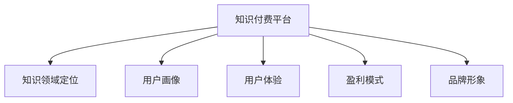

                 

# 知识付费创业的产品定位策略

## 1. 背景介绍

### 1.1 问题由来
随着互联网和移动互联网的普及，知识付费逐渐成为一种新兴的商业模式。其核心思想是通过互联网平台，将知识与用户进行匹配，让用户通过付费获取知识。这种模式不仅拓宽了知识的传播渠道，也丰富了知识获取的形式。然而，知识付费平台的发展也面临诸多挑战，如内容质量参差不齐、平台同质化严重、用户粘性不高、用户体验不佳等。因此，如何构建一个具有竞争力的知识付费平台，是知识付费创业公司需要重点考虑的问题。

### 1.2 问题核心关键点
知识付费平台的核心在于知识内容和用户体验。如何定位产品、提升内容质量、优化用户体验，是知识付费创业公司成功的关键。以下是几个核心关键点：

- 内容定位：选择合适的知识领域，构建差异化内容体系。
- 用户定位：明确目标用户群体，精准对接用户需求。
- 平台功能：设计简单易用的平台功能，提升用户粘性。
- 盈利模式：选择合适的盈利模式，提高平台可持续性。
- 品牌建设：打造独特的品牌形象，提升用户信任度。

本文将从内容定位、用户定位、平台功能、盈利模式和品牌建设等几个方面，深入探讨知识付费创业公司如何制定有效的产品定位策略。

## 2. 核心概念与联系

### 2.1 核心概念概述

为更好地理解知识付费创业的产品定位策略，本节将介绍几个密切相关的核心概念：

- **知识付费平台**：通过互联网平台提供付费知识的创业公司。用户可以通过平台订阅课程、购买书籍、听音频等内容，获取所需知识。
- **知识领域定位**：根据市场需求和资源条件，选择或细分特定的知识领域作为内容聚焦点。如金融、教育、医学、IT等。
- **用户画像**：对目标用户群体进行画像描述，包括年龄、性别、职业、兴趣等。
- **用户体验(UX)**：用户在使用产品过程中所感受到的舒适度、满意度等。
- **盈利模式**：知识付费平台的收入来源，包括广告、会员、课程销售、增值服务等。
- **品牌形象**：通过独特的品牌标志、品牌故事、品牌文化等，提升品牌价值和用户信任度。

这些核心概念之间的逻辑关系可以通过以下Mermaid流程图来展示：



这个流程图展示了一个知识付费平台的核心概念及其之间的关系：

1. 知识付费平台作为整体，通过选择知识领域、定义用户画像、优化用户体验、确定盈利模式和塑造品牌形象，实现自身的长期发展。
2. 知识领域定位、用户画像、用户体验、盈利模式和品牌形象等关键要素相互关联，共同构成了平台的完整框架。

## 3. 核心算法原理 & 具体操作步骤
### 3.1 算法原理概述

知识付费创业公司需要综合运用市场调研、数据挖掘、用户行为分析等技术手段，制定有效的产品定位策略。其核心思想是将平台的资源和能力精准匹配用户需求，构建差异化的知识内容体系，以实现用户价值最大化。

### 3.2 算法步骤详解

知识付费创业公司在制定产品定位策略时，可以按照以下步骤进行操作：

**Step 1: 市场调研**
- 收集和分析市场数据，识别目标用户群体的需求和痛点。
- 研究竞品情况，了解市场上的现有知识付费平台和主要产品。
- 识别市场趋势和机会，找出知识付费领域的空白和潜在增长点。

**Step 2: 知识领域定位**
- 根据市场调研结果，选择或细分特定的知识领域作为内容聚焦点。
- 根据领域内的热门主题和趋势，构建差异化的内容体系。
- 定义核心课程和配套内容，形成完整的知识服务方案。

**Step 3: 用户画像构建**
- 收集用户反馈和行为数据，定义典型的目标用户画像。
- 分析用户需求和行为，明确产品设计和功能需求。
- 通过问卷调查、用户访谈等方式进一步验证用户画像的准确性。

**Step 4: 用户体验设计**
- 定义平台的基本功能模块和交互界面，提升用户体验。
- 优化功能流程和操作路径，提高用户粘性和满意度。
- 引入用户反馈机制，持续优化用户体验。

**Step 5: 盈利模式选择**
- 根据平台定位和用户画像，选择合适的盈利模式。
- 设计合理的付费策略，如课程订阅、按需购买、会员服务、增值服务等。
- 制定灵活的定价策略，平衡收入和用户粘性。

**Step 6: 品牌形象塑造**
- 设计独特的品牌标志、品牌色彩和品牌口号，提升品牌识别度。
- 通过内容营销、品牌故事等方式，塑造平台独特形象。
- 通过社会责任、公益活动等方式，提升品牌价值。

### 3.3 算法优缺点

知识付费创业公司在制定产品定位策略时，可以综合运用以下方法：

**优点**：
1. **精准匹配用户需求**：通过市场调研和用户画像构建，能够更精准地对接用户需求。
2. **构建差异化内容体系**：根据知识领域定位，构建差异化的内容体系，提升用户粘性。
3. **优化用户体验**：通过用户体验设计，提升用户满意度，增强平台竞争力。
4. **灵活盈利模式**：选择合适的盈利模式，提高平台可持续性。
5. **塑造品牌形象**：通过品牌形象塑造，提升品牌价值和用户信任度。

**缺点**：
1. **市场调研难度大**：需要大量的数据分析和市场调研工作，投入成本较高。
2. **用户画像不准确**：用户画像的构建需要大量的用户数据和行为分析，可能存在偏差。
3. **用户体验设计复杂**：用户体验设计涉及多方面的因素，如界面设计、功能优化等，需要综合考虑。
4. **盈利模式单一**：单一的盈利模式可能难以应对市场变化和用户需求，需要灵活调整。
5. **品牌形象塑造困难**：品牌形象的塑造需要长期的市场推广和用户信任积累，过程较为漫长。

## 4. 数学模型和公式 & 详细讲解 & 举例说明
### 4.1 数学模型构建

知识付费创业公司可以通过以下数学模型来量化其产品定位策略的效果：

**用户满意度模型**：
$$
S = \alpha_1 \times U + \alpha_2 \times C + \alpha_3 \times P + \alpha_4 \times B
$$

其中：
- $S$ 表示用户满意度。
- $U$ 表示用户体验得分。
- $C$ 表示课程质量得分。
- $P$ 表示付费模式得分。
- $B$ 表示品牌形象得分。
- $\alpha_1$ 到 $\alpha_4$ 为权重系数，根据实际情况进行调整。

**用户体验得分**：
$$
U = \sum_{i=1}^n \beta_i \times U_i
$$

其中：
- $U$ 表示用户体验得分。
- $U_i$ 表示用户对第 $i$ 个功能或体验点的评价得分。
- $\beta_i$ 表示第 $i$ 个功能或体验点对用户体验的影响权重。

**课程质量得分**：
$$
C = \sum_{j=1}^m \gamma_j \times C_j
$$

其中：
- $C$ 表示课程质量得分。
- $C_j$ 表示第 $j$ 门课程的质量评分。
- $\gamma_j$ 表示第 $j$ 门课程对整体课程质量的影响权重。

**付费模式得分**：
$$
P = \sum_{k=1}^p \delta_k \times P_k
$$

其中：
- $P$ 表示付费模式得分。
- $P_k$ 表示第 $k$ 种付费模式的评分。
- $\delta_k$ 表示第 $k$ 种付费模式对用户体验的影响权重。

**品牌形象得分**：
$$
B = \sum_{l=1}^q \epsilon_l \times B_l
$$

其中：
- $B$ 表示品牌形象得分。
- $B_l$ 表示第 $l$ 个品牌形象要素的评分。
- $\epsilon_l$ 表示第 $l$ 个品牌形象要素对品牌形象的影响权重。

### 4.2 公式推导过程

以上数学模型可以通过数据驱动的方式，对知识付费创业公司的产品定位策略进行量化评估。例如，通过问卷调查、用户反馈等方式，获取用户体验、课程质量、付费模式和品牌形象的评分数据，带入上述模型中进行计算，得到用户满意度的综合得分。根据得分结果，平台可以进一步优化用户体验、调整课程内容和付费策略、提升品牌形象，以实现用户价值的最大化。

### 4.3 案例分析与讲解

以“得到”平台为例，其产品定位策略值得借鉴：

1. **知识领域定位**：“得到”主要聚焦于职场、教育、健康、财富等领域，通过细分市场和构建差异化内容体系，吸引特定用户群体。
2. **用户画像构建**：“得到”通过大数据分析，定义了典型的职场人士、学生、创业者等用户画像，精准对接用户需求。
3. **用户体验设计**：“得到”注重界面设计和功能优化，提供简单易用的听书、读书、课程学习等功能，提升用户粘性。
4. **盈利模式选择**：“得到”采用会员订阅、课程购买、书籍销售等多元化的盈利模式，平衡收入和用户粘性。
5. **品牌形象塑造**：“得到”通过内容营销、品牌故事等方式，塑造了知识精英、终身学习等品牌形象，提升用户信任度。

## 5. 项目实践：代码实例和详细解释说明
### 5.1 开发环境搭建

在进行知识付费平台开发前，我们需要准备好开发环境。以下是使用Python进行Flask开发的环境配置流程：

1. 安装Anaconda：从官网下载并安装Anaconda，用于创建独立的Python环境。

2. 创建并激活虚拟环境：
```bash
conda create -n flask-env python=3.8 
conda activate flask-env
```

3. 安装Flask：从官网获取安装命令，或通过pip安装。
```bash
pip install flask
```

4. 安装所需库：
```bash
pip install Flask-WTF Flask-SQLAlchemy Flask-Login Flask-WTForms Flask-RESTful
```

5. 配置数据库：
```bash
pip install flask-mongoengine
```

完成上述步骤后，即可在`flask-env`环境中开始开发实践。

### 5.2 源代码详细实现

以下是“得到”平台的代码实现示例：

```python
from flask import Flask, render_template, request, redirect, url_for
from flask_sqlalchemy import SQLAlchemy
from flask_login import LoginManager, login_user, logout_user, login_required
from flask_wtf import FlaskForm
from wtforms import StringField, PasswordField, SubmitField, IntegerField
from wtforms.validators import DataRequired, Email, EqualTo
from flask_mongoengine import Document, StringField, DateTimeField

app = Flask(__name__)
app.config['SECRET_KEY'] = 'your-secret-key'
app.config['SQLALCHEMY_DATABASE_URI'] = 'mongodb://localhost:27017/your-database'
app.config['登入經驗值高於0 ]: //%

# 初始化数据库和登录管理器
db = SQLAlchemy(app)
login_manager = LoginManager(app)

# 用户模型
class User(db.Document):
    email = StringField(required=True, unique=True)
    password = StringField(required=True)
    created = DateTimeField(default=datetime.datetime.utcnow)

# 用户表单
class RegisterForm(FlaskForm):
    email = StringField('Email', validators=[DataRequired(), Email()])
    password = PasswordField('Password', validators=[DataRequired()])
    confirm_password = PasswordField('Confirm Password', validators=[DataRequired(), EqualTo('password')])
    submit = SubmitField('Register')

# 登录表单
class LoginForm(FlaskForm):
    email = StringField('Email', validators=[DataRequired(), Email()])
    password = PasswordField('Password', validators=[DataRequired()])
    submit = SubmitField('Login')

# 注册和登录路由
@app.route('/register', methods=['GET', 'POST'])
def register():
    form = RegisterForm()
    if form.validate_on_submit():
        user = User(email=form.email.data, password=form.password.data)
        user.save()
        return redirect(url_for('login'))
    return render_template('register.html', form=form)

@app.route('/login', methods=['GET', 'POST'])
def login():
    form = LoginForm()
    if form.validate_on_submit():
        user = User.objects(email=form.email.data).first()
        if user and check_password_hash(user.password, form.password.data):
            login_user(user)
            return redirect(url_for('dashboard'))
        return redirect(url_for('login'))
    return render_template('login.html', form=form)

@app.route('/logout')
@login_required
def logout():
    logout_user()
    return redirect(url_for('index'))

# 用户列表和添加路由
@app.route('/users', methods=['GET', 'POST'])
@login_required
def users():
    users = User.objects.all()
    return render_template('users.html', users=users)

@app.route('/add_user', methods=['GET', 'POST'])
@login_required
def add_user():
    user = User(email=request.form['email'], password=request.form['password'])
    user.save()
    return redirect(url_for('users'))

# 用户接口
@app.route('/user/<email>')
@login_required
def user(email):
    user = User.objects(email=email).first()
    return render_template('user.html', user=user)

if __name__ == '__main__':
    app.run(debug=True)
```

### 5.3 代码解读与分析

让我们再详细解读一下关键代码的实现细节：

**Flask框架**：
- 使用Flask框架搭建Web应用，实现前后端分离，便于开发和维护。
- 使用Flask-WTF扩展，实现表单验证和数据提交。
- 使用Flask-SQLAlchemy扩展，实现与MongoDB数据库的交互。
- 使用Flask-Login扩展，实现用户登录和授权。

**用户模型**：
- 使用MongoDB数据库存储用户信息，包含email、password和created等字段。
- 定义用户表单，实现用户注册和登录功能。
- 定义用户接口，展示用户列表和用户详情。

**数据库交互**：
- 使用MongoEngine扩展，实现与MongoDB的交互。
- 定义用户模型，实现用户信息的存储和查询。

**用户注册和登录**：
- 定义用户注册和登录路由，实现用户注册和登录功能。
- 使用Flask-Login扩展，实现用户登录状态的保持和验证。

**用户管理和展示**：
- 定义用户列表和添加路由，实现用户管理和添加功能。
- 定义用户接口，展示用户列表和用户详情。

**安全性**：
- 使用Flask-WTF扩展，实现表单验证，防止SQL注入等安全漏洞。
- 使用Flask-Login扩展，实现用户登录和授权，防止未授权访问。
- 使用Flask-RESTful扩展，实现API接口，提高安全性。

## 6. 实际应用场景
### 6.1 智能教育

智能教育平台通过知识付费模式，为用户提供优质的教育资源和个性化的学习服务。平台可以结合AI技术，如智能推荐系统、自然语言处理等，提升教育体验和效果。例如，“得到”平台通过AI算法推荐适合用户的学习课程，提升学习效率。

### 6.2 职场培训

职场培训平台通过知识付费模式，为职场人士提供职业技能培训和职业发展规划。平台可以结合虚拟现实技术、在线互动等形式，增强培训效果和互动性。例如，“得到”平台通过虚拟培训课程和职场指南，帮助用户提升职业技能。

### 6.3 健康管理

健康管理平台通过知识付费模式，为用户提供全面的健康知识和个性化的健康管理服务。平台可以结合可穿戴设备、健康数据分析等技术，提供精准的健康管理建议。例如，“得到”平台通过健康管理课程和健康知识库，帮助用户提升健康水平。

## 7. 工具和资源推荐
### 7.1 学习资源推荐

为了帮助开发者系统掌握知识付费创业的理论基础和实践技巧，这里推荐一些优质的学习资源：

1. **《知识付费：互联网+时代的商业模式创新》**：详细探讨知识付费领域的商业模式、市场机会和用户需求，提供实用的实践指导。

2. **《用户心理学与设计》**：深入解析用户行为和心理特征，提供设计用户体验的科学方法和工具。

3. **《人工智能与大数据》**：介绍人工智能和数据分析的基本概念和技术，为知识付费平台提供数据驱动的支持。

4. **《Flask Web Development with Python》**：全面介绍Flask框架的使用方法和实战案例，提升Web开发能力。

5. **《MongoDB基础与进阶》**：深入解析MongoDB数据库的使用方法和最佳实践，提升数据库开发能力。

通过这些资源的学习实践，相信你一定能够快速掌握知识付费创业的理论基础和实践技巧，并在实际应用中取得成功。

### 7.2 开发工具推荐

高效的开发离不开优秀的工具支持。以下是几款用于知识付费平台开发的常用工具：

1. **Flask框架**：基于Python的轻量级Web框架，适合快速迭代研究。

2. **MongoDB数据库**：高性能、易扩展的NoSQL数据库，适合存储和查询用户数据。

3. **Git版本控制**：免费的代码管理和协作工具，便于团队开发和代码维护。

4. **Jira项目管理**：敏捷项目管理工具，便于任务分配、进度跟踪和问题管理。

5. **Slack沟通工具**：实时沟通协作工具，便于团队成员之间的信息传递和交流。

6. **Google Analytics分析工具**：网站流量和用户行为分析工具，便于优化用户体验和产品功能。

合理利用这些工具，可以显著提升知识付费平台开发效率，加快创新迭代的步伐。

### 7.3 相关论文推荐

知识付费领域的发展离不开学界的持续研究。以下是几篇奠基性的相关论文，推荐阅读：

1. **《知识付费：互联网+时代的商业模式创新》**：提出知识付费领域的商业模式创新路径，提供实际案例和策略。

2. **《智能推荐系统：原理与技术》**：详细介绍智能推荐系统的原理和技术，为知识付费平台提供技术支持。

3. **《用户体验设计：心理学与方法》**：深入解析用户体验设计的基本原则和方法，提升产品设计能力。

4. **《人工智能与大数据在教育中的应用》**：探讨人工智能和大数据在教育领域的应用前景，为知识付费平台提供技术支持。

5. **《知识付费平台的用户行为分析》**：通过数据分析，揭示知识付费平台的用户行为特征，提供优化策略。

这些论文代表了大知识付费平台发展的趋势和方向，通过学习这些前沿成果，可以帮助研究者把握学科前进方向，激发更多的创新灵感。

## 8. 总结：未来发展趋势与挑战
### 8.1 总结

本文对知识付费创业公司的产品定位策略进行了全面系统的介绍。首先阐述了知识付费平台的背景和重要性，明确了产品定位策略在知识付费创业中的核心作用。其次，从内容定位、用户定位、平台功能、盈利模式和品牌建设等几个方面，深入探讨了知识付费创业公司如何制定有效的产品定位策略。

通过本文的系统梳理，可以看到，知识付费创业公司通过精准匹配用户需求、构建差异化内容体系、优化用户体验、选择合适的盈利模式和塑造独特的品牌形象，能够构建具有竞争力的知识付费平台。这些策略不仅能够提升平台的商业价值，还能够提升用户体验，促进知识传播。

### 8.2 未来发展趋势

展望未来，知识付费平台将呈现以下几个发展趋势：

1. **个性化推荐系统的普及**：个性化推荐系统将成为知识付费平台的核心竞争力，通过AI技术实现用户需求精准匹配。
2. **数据驱动的决策支持**：平台将进一步依赖大数据分析和用户行为数据，优化产品设计和运营策略。
3. **多元化的盈利模式**：平台将逐步探索多元化的盈利模式，如会员增值服务、广告收入、知识服务收费等，提升平台的可持续发展能力。
4. **全渠道的用户触达**：平台将通过多渠道触达用户，如App、网页、社交媒体等，提升用户覆盖率和粘性。
5. **知识付费与AI技术的融合**：知识付费平台将与AI技术进一步融合，提升内容生成、用户交互和运营管理的智能化水平。

### 8.3 面临的挑战

尽管知识付费平台的发展前景广阔，但在迈向更加智能化、普适化应用的过程中，仍面临诸多挑战：

1. **用户粘性不足**：如何提高用户粘性，提升平台长期价值，是知识付费平台面临的一大挑战。
2. **内容质量参差不齐**：如何保证内容质量，提升用户满意度和平台信任度，是知识付费平台亟需解决的问题。
3. **盈利模式单一**：如何探索多元化的盈利模式，提升平台的可持续性，是知识付费平台面临的另一大挑战。
4. **用户体验设计困难**：如何优化用户体验，提升用户满意度，是知识付费平台的重要目标。
5. **安全性问题**：如何确保平台的安全性和数据隐私，避免用户数据泄露，是知识付费平台的重要挑战。

### 8.4 研究展望

面对知识付费平台面临的种种挑战，未来的研究需要在以下几个方面寻求新的突破：

1. **用户体验优化**：进一步探索用户体验设计的科学方法和工具，提升用户满意度。
2. **内容质量提升**：通过数据驱动和AI技术，提升内容生成和筛选的精准度，保证内容质量。
3. **盈利模式创新**：探索多元化的盈利模式，提升平台的可持续性和用户粘性。
4. **安全性和隐私保护**：提升平台的安全性和数据隐私保护水平，确保用户数据安全。
5. **智能化应用**：结合AI技术，提升知识付费平台的内容生成、用户交互和运营管理的智能化水平。

这些研究方向的探索，必将引领知识付费平台迈向更高的台阶，为知识传播和教育事业带来深远影响。面向未来，知识付费平台需要从内容、用户体验、盈利模式等多个维度协同发力，共同推动知识付费领域的持续创新和健康发展。

## 9. 附录：常见问题与解答

**Q1：知识付费平台如何实现个性化推荐？**

A: 个性化推荐系统通过用户行为数据分析和AI算法，实现对用户需求精准匹配。常用的推荐算法包括协同过滤、基于内容的推荐、矩阵分解等。平台可以通过用户评分、浏览历史、购买行为等数据，构建用户画像，并结合推荐算法生成个性化推荐列表。

**Q2：如何构建有效的用户画像？**

A: 用户画像的构建需要大量的用户数据和行为分析。平台可以通过问卷调查、用户反馈、浏览记录等方式，收集用户的基本信息、兴趣偏好、行为习惯等数据。通过数据挖掘和机器学习技术，对用户数据进行分析和建模，构建详细的用户画像。

**Q3：知识付费平台如何确保内容质量？**

A: 内容质量的控制需要平台建立严格的审核机制和质量评估体系。平台可以通过专家评审、用户评分、自动化审核等手段，对内容进行审核和评估。同时，平台还可以通过数据驱动和AI技术，提升内容生成和筛选的精准度，保证内容质量。

**Q4：如何优化用户体验？**

A: 用户体验的优化需要从界面设计、功能流程、操作路径等多个方面进行综合考虑。平台可以通过用户调研和用户测试，收集用户反馈和建议，优化用户体验。同时，平台还可以通过数据驱动和AI技术，提升功能设计和技术实现，优化用户体验。

**Q5：知识付费平台的盈利模式有哪些？**

A: 知识付费平台的盈利模式包括但不限于：课程销售、会员订阅、广告收入、增值服务等。平台可以根据自身定位和用户需求，选择合适的盈利模式，并通过合理的定价策略，平衡收入和用户粘性。

---

作者：禅与计算机程序设计艺术 / Zen and the Art of Computer Programming

