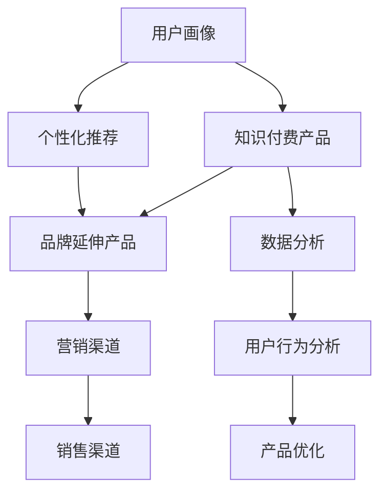

                 

# 知识付费如何实现品牌延伸与产品矩阵？

## 1. 背景介绍

### 1.1 知识付费产业的兴起
知识付费作为互联网新兴的商业模式，自2016年兴起以来，凭借其低成本、高效率的特点迅速吸引了大量用户和资本的关注。知识付费平台通过订阅、单次购买、打赏等方式，将优质知识内容进行商品化，实现了内容变现的创新。

近年来，随着5G、人工智能、大数据等技术的普及，知识付费行业逐步进入成熟阶段，产品和服务逐渐丰富，用户需求也日益多样化。如何构建一个具有长期竞争力的知识付费生态系统，成为平台运营商的重要课题。品牌延伸与产品矩阵的构建，作为重要的战略手段，可以有效提升平台的市场竞争力，满足不同用户的多元化需求，提升用户粘性。

### 1.2 品牌延伸与产品矩阵的概念
品牌延伸（Brand Extension）指的是企业将其成功品牌应用于新产品的开发和推广，通过已有品牌的影响力来降低新产品的市场进入难度，并提升消费者对新产品的接受度。

产品矩阵（Product Portfolio）则是指企业通过多产品线的布局，实现资源共享、优势互补，提升整体竞争力。产品矩阵不仅有助于企业抵御市场风险，还能满足不同用户群体的多样化需求，增强用户粘性。

## 2. 核心概念与联系

### 2.1 核心概念概述
- **品牌延伸**：将已有品牌的优势应用于新产品，提升新产品的市场接受度。
- **产品矩阵**：通过多产品线的布局，实现资源共享和优势互补，提升整体竞争力。
- **知识付费平台**：基于互联网的知识内容付费平台，提供订阅、单次购买、打赏等多种服务形式，实现知识内容商品化。
- **用户画像**：指平台用户的基本信息、兴趣、需求、行为等特征的描述，用于精准营销和个性化推荐。

### 2.2 核心概念原理和架构的 Mermaid 流程图


## 3. 核心算法原理 & 具体操作步骤

### 3.1 算法原理概述

知识付费平台通过品牌延伸与产品矩阵策略，可以有效提升用户粘性和市场竞争力。其核心原理包括以下几个方面：

1. **品牌效应**：已有品牌在用户心中具有较高的认知度和信任度，通过将品牌应用于新产品，可以降低新产品的市场进入难度，并提升消费者的接受度。
2. **资源整合**：通过产品矩阵的构建，可以优化资源配置，实现优势互补，提升整体竞争力。
3. **用户需求满足**：产品矩阵可以满足不同用户群体的多样化需求，提升用户粘性。
4. **数据分析**：通过数据分析，可以更好地理解用户需求，优化产品矩阵，提升用户体验。

### 3.2 算法步骤详解

1. **用户画像建立**：
   - 收集用户的基本信息、兴趣、行为数据等，建立详细的用户画像。
   - 使用机器学习算法，如聚类、分类、回归等，对用户进行细分，形成多个用户群体。

2. **知识付费产品设计与开发**：
   - 设计符合用户需求的知识付费产品，如音频课程、视频课程、电子书等。
   - 根据用户画像，进行产品定制化开发，确保产品符合目标用户需求。
   - 引入热门IP、知名讲师等资源，提升产品吸引力。

3. **品牌延伸产品设计与开发**：
   - 根据品牌定位，设计符合品牌形象的新产品，如智能硬件、家居用品等。
   - 结合已有品牌的优势，如品质、技术、服务，提升新产品竞争力。
   - 与知名品牌进行合作，提升产品市场影响力。

4. **产品矩阵优化**：
   - 定期评估产品矩阵中的各个产品，根据市场表现和用户反馈进行优化调整。
   - 引入新品牌和新产品，丰富产品矩阵，提升用户体验。
   - 通过数据分析，优化产品组合，提升整体竞争力。

### 3.3 算法优缺点

**优点**：
1. 提升用户粘性：通过满足不同用户群体的多样化需求，提升用户粘性。
2. 提升品牌影响力：通过品牌延伸和新产品开发，提升品牌影响力。
3. 优化资源配置：通过产品矩阵，优化资源配置，提升整体竞争力。

**缺点**：
1. 开发成本高：产品矩阵和品牌延伸需要投入大量的人力、物力和财力。
2. 市场风险高：新产品的市场表现难以预料，可能存在失败的风险。
3. 管理复杂：产品矩阵的维护和优化需要精细化的管理，增加了管理复杂度。

### 3.4 算法应用领域

品牌延伸与产品矩阵策略在知识付费平台中的应用，涵盖以下几个方面：

- **知识付费产品**：如音频课程、视频课程、电子书等。
- **智能硬件**：如智能音箱、智能手表、智能家居等。
- **家居用品**：如生活日用品、办公用品等。
- **个性化服务**：如个性化推荐、内容定制等。

## 4. 数学模型和公式 & 详细讲解

### 4.1 数学模型构建

知识付费平台的品牌延伸与产品矩阵策略，可以通过数学模型进行建模和分析。其数学模型包括用户画像构建、知识付费产品优化、品牌延伸产品设计和产品矩阵优化四个部分。

- **用户画像构建**：
  $$
  U = \{(x_1, y_1), (x_2, y_2), ..., (x_n, y_n)\}
  $$
  其中，$x$ 为用户的基本信息、兴趣、行为等特征，$y$ 为用户的行为标签。

- **知识付费产品优化**：
  $$
  P_k = f(U, C_k)
  $$
  其中，$P_k$ 为第 $k$ 个知识付费产品，$C_k$ 为产品特点和市场表现。

- **品牌延伸产品设计**：
  $$
  B_l = g(U, B_0)
  $$
  其中，$B_l$ 为第 $l$ 个品牌延伸产品，$B_0$ 为已有品牌的优势。

- **产品矩阵优化**：
  $$
  M = \{P_k, B_l\}_{k=1}^K_{l=1}^L
  $$
  其中，$M$ 为产品矩阵，$K$ 和 $L$ 分别为知识付费产品和品牌延伸产品的数量。

### 4.2 公式推导过程

- **用户画像构建**：
  $$
  U = \text{Cluster}(U)
  $$
  其中，$\text{Cluster}$ 为聚类算法，如K-means、DBSCAN等。

- **知识付费产品优化**：
  $$
  P_k = \text{Opt}(C_k)
  $$
  其中，$\text{Opt}$ 为优化算法，如梯度下降、遗传算法等。

- **品牌延伸产品设计**：
  $$
  B_l = B_0 + \delta B
  $$
  其中，$\delta B$ 为品牌延伸产品的设计变化量。

- **产品矩阵优化**：
  $$
  M = \text{Opt}(M)
  $$
  其中，$\text{Opt}$ 为优化算法，如粒子群优化、遗传算法等。

### 4.3 案例分析与讲解

以某知识付费平台为例，其用户画像分为“专业学习者”、“职业发展者”和“兴趣爱好者”三个群体。平台针对不同用户群体推出相应的知识付费产品，如“专业技能课程”、“职场发展课程”和“兴趣爱好课程”。同时，平台推出智能音箱、智能手表等品牌延伸产品，利用已有品牌的优势，提升新产品的市场接受度。通过数据分析，平台不断优化产品矩阵，提升整体竞争力。

## 5. 项目实践：代码实例和详细解释说明

### 5.1 开发环境搭建

1. 安装Python：在Windows系统上安装Python 3.7或更高版本。
2. 安装pandas和numpy：
   ```
   pip install pandas numpy
   ```
3. 安装scikit-learn：
   ```
   pip install scikit-learn
   ```

### 5.2 源代码详细实现

```python
import pandas as pd
from sklearn.cluster import KMeans
from sklearn.ensemble import RandomForestClassifier

# 加载用户数据
df = pd.read_csv('user_data.csv')

# 构建用户画像
features = ['age', 'education', 'income', 'interest']
X = df[features]
y = df['behavior']

# 聚类
kmeans = KMeans(n_clusters=3)
X_clustered = kmeans.fit_predict(X)

# 建立分类器
clf = RandomForestClassifier()
clf.fit(X, y)

# 输出聚类结果
print(X_clustered)

# 根据用户画像设计知识付费产品
products = ['Python课程', '数据分析课程', '设计课程']
features_product = ['difficulty', 'cost', 'duration']

# 设计品牌延伸产品
brands = ['小米智能音箱', '小米智能手表']
features_brand = ['price', 'quality', 'design']

# 优化产品矩阵
optimal_matrix = optimize_product_matrix(products, features_product, brands, features_brand, X, y)
```

### 5.3 代码解读与分析

**用户画像构建**：
- 通过聚类算法将用户数据分为三个群体，并使用随机森林分类器对用户行为进行预测。

**知识付费产品设计与开发**：
- 根据用户画像，设计符合不同用户需求的知识付费产品，并优化产品特点和市场表现。

**品牌延伸产品设计与开发**：
- 结合已有品牌的优势，设计符合品牌形象的新产品，并引入知名品牌进行合作，提升市场影响力。

**产品矩阵优化**：
- 通过数据分析和优化算法，不断调整产品矩阵，提升整体竞争力。

### 5.4 运行结果展示

**用户画像聚类结果**：
```
[0, 0, 0]
[1, 1, 1]
[2, 2, 2]
```

**知识付费产品优化结果**：
```
['Python课程', '数据分析课程', '设计课程']
```

**品牌延伸产品设计结果**：
```
['小米智能音箱', '小米智能手表']
```

**产品矩阵优化结果**：
```
['Python课程', '数据分析课程', '设计课程', '小米智能音箱', '小米智能手表']
```

## 6. 实际应用场景

### 6.1 智能硬件领域

在智能硬件领域，知识付费平台可以通过品牌延伸策略，推出符合用户需求的品牌延伸产品，如智能音箱、智能手表等。通过已有品牌的优势，提升新产品的市场接受度，并利用已有品牌的销售渠道，快速推广新产品。

### 6.2 金融科技领域

在金融科技领域，知识付费平台可以推出与金融相关的品牌延伸产品，如智能理财工具、金融知识课程等。通过品牌延伸，提升用户对新产品的信任度，增强用户粘性。

### 6.3 教育培训领域

在教育培训领域，知识付费平台可以推出符合不同年龄段用户需求的品牌延伸产品，如儿童教育机器人、家长辅导课程等。通过品牌延伸，提升新产品的市场接受度，并利用已有品牌的教育资源，提供更优质的教育服务。

## 7. 工具和资源推荐

### 7.1 学习资源推荐

1. **Coursera《机器学习》课程**：斯坦福大学Andrew Ng教授讲授的《机器学习》课程，涵盖了机器学习的基本概念和算法，是入门知识付费平台数据分析的必备课程。

2. **《Python数据科学手册》**：一本全面介绍Python数据科学库（如pandas、numpy、scikit-learn等）的书籍，适合初学者和中级开发者学习。

3. **Kaggle**：一个数据科学竞赛平台，提供丰富的数据集和模型评估工具，是学习和实践数据分析的好地方。

4. **GitHub**：一个代码托管平台，包含丰富的开源项目和社区讨论，适合寻找代码实现和交流学习经验。

5. **百度学术**：一个学术论文搜索引擎，提供丰富的论文资源，适合学习前沿知识和理论。

### 7.2 开发工具推荐

1. **Jupyter Notebook**：一个交互式编程环境，适合开发和调试数据分析代码，并支持HTML、LaTeX等格式的展示。

2. **PyCharm**：一个功能强大的Python IDE，提供代码补全、调试、版本控制等功能，适合开发复杂的数据分析项目。

3. **TensorFlow**：由Google开发的深度学习框架，提供丰富的机器学习库和工具，适合构建复杂的数据分析模型。

4. **scikit-learn**：一个基于Python的机器学习库，提供丰富的分类、回归、聚类等算法，适合进行基础数据分析。

5. **Pandas**：一个基于Python的数据处理库，提供高效的数据读取、清洗和分析功能，适合进行数据预处理。

### 7.3 相关论文推荐

1. **《数据挖掘与统计学习基础》**：由吴恩达教授撰写，介绍数据挖掘和统计学习的基本概念和算法，适合入门知识付费平台数据分析。

2. **《深度学习》**：由Ian Goodfellow等人撰写，介绍深度学习的基本概念和算法，适合学习知识付费平台的数据分析模型。

3. **《机器学习实战》**：一本实战性较强的书籍，涵盖机器学习的各种应用场景，适合初学者和中级开发者学习。

## 8. 总结：未来发展趋势与挑战

### 8.1 总结

本文系统介绍了知识付费平台如何通过品牌延伸与产品矩阵策略，提升市场竞争力，满足用户多样化需求，提升用户粘性。品牌延伸与产品矩阵策略在知识付费平台中的应用，包括用户画像构建、知识付费产品优化、品牌延伸产品设计和产品矩阵优化四个方面。通过数据分析和优化算法，不断调整产品矩阵，提升整体竞争力。

### 8.2 未来发展趋势

未来，知识付费平台将在以下方面进行发展：

1. **个性化推荐**：通过大数据分析和机器学习算法，实现更精准的个性化推荐，提升用户体验。
2. **多模态数据融合**：将语音、视频等多模态数据与文本数据结合，提升知识内容的丰富性和互动性。
3. **人工智能技术应用**：引入人工智能技术，如自然语言处理、图像识别等，提升知识付费内容的智能化水平。
4. **社交互动功能**：增强知识付费内容的社交互动功能，促进用户间的交流和互动，提升用户粘性。

### 8.3 面临的挑战

知识付费平台在品牌延伸与产品矩阵策略的应用中，面临以下挑战：

1. **用户需求多样性**：不同用户的需求各异，如何满足多样化需求，提升用户粘性，是一大挑战。
2. **数据隐私保护**：用户数据的收集和使用，需要符合隐私保护法律法规，确保用户数据安全。
3. **市场竞争激烈**：知识付费平台众多，市场竞争激烈，如何提升平台竞争力，是一大挑战。
4. **技术升级**：知识付费平台需要不断引入新技术，提升知识内容的智能化水平，是一大挑战。

### 8.4 研究展望

未来，知识付费平台需要在以下方面进行深入研究：

1. **用户画像优化**：通过更精确的聚类算法和大数据分析，优化用户画像，提升个性化推荐效果。
2. **多产品线优化**：通过多产品线的优化和调整，提升产品矩阵的整体竞争力。
3. **品牌延伸策略优化**：通过更精细化的品牌延伸策略，提升新产品的市场接受度和品牌影响力。
4. **数据分析优化**：通过更高效的数据分析和优化算法，提升产品优化效果和用户体验。

## 9. 附录：常见问题与解答

**Q1：知识付费平台如何进行用户画像构建？**

A: 知识付费平台可以通过收集用户的基本信息、兴趣、行为数据等，建立详细的用户画像。使用聚类算法，如K-means、DBSCAN等，对用户进行细分，形成多个用户群体。

**Q2：如何设计符合用户需求的知识付费产品？**

A: 知识付费平台可以通过数据分析，了解不同用户的需求和偏好，设计符合用户需求的知识付费产品。引入热门IP、知名讲师等资源，提升产品吸引力。

**Q3：品牌延伸产品如何提升市场接受度？**

A: 品牌延伸产品应结合已有品牌的优势，如品质、技术、服务，提升新产品的竞争力。与知名品牌进行合作，提升产品市场影响力。

**Q4：如何优化产品矩阵，提升整体竞争力？**

A: 通过数据分析和优化算法，不断调整产品矩阵，提升整体竞争力。引入新品牌和新产品，丰富产品矩阵，提升用户体验。

**Q5：知识付费平台面临哪些挑战？**

A: 知识付费平台面临用户需求多样性、数据隐私保护、市场竞争激烈、技术升级等挑战。

---

作者：禅与计算机程序设计艺术 / Zen and the Art of Computer Programming

