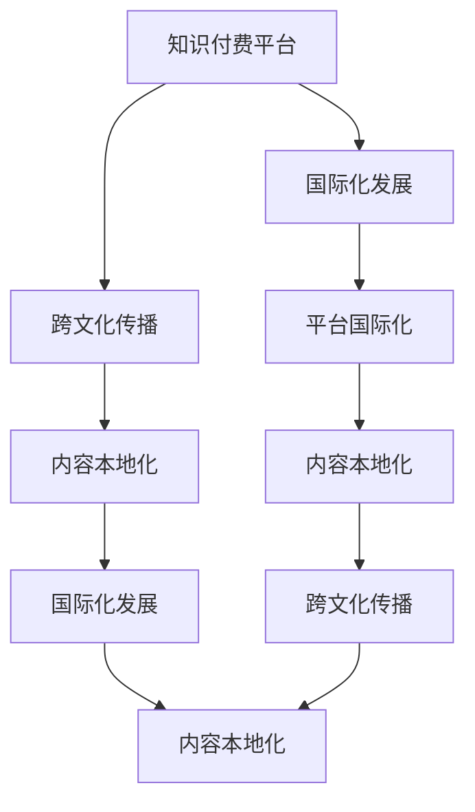

                 

# 知识付费如何实现跨文化传播与国际化发展？

## 1. 背景介绍

### 1.1 问题由来
随着全球化的深入发展，信息流动加速，知识传播的边界逐渐模糊。如何在知识付费领域实现跨文化传播与国际化发展，成为一项极具挑战和战略意义的课题。近年来，越来越多的知识付费平台开始重视国际市场，探索如何将自己的服务与内容推广到全球范围，为不同文化背景的用户提供有价值的信息和服务。

### 1.2 问题核心关键点
知识付费的跨文化传播与国际化发展主要涉及以下几个核心问题：
- **用户需求分析**：不同文化背景的用户对知识内容的需求存在差异，如何满足这些多样化需求是关键。
- **内容本地化**：在保证内容质量的前提下，如何调整内容形式和表达方式，以适应目标市场的文化习惯和阅读习惯。
- **平台国际化**：知识付费平台如何在技术架构、运营策略、法律合规等方面进行国际化布局。
- **跨文化交流**：如何利用知识付费平台促进不同文化之间的交流和理解，增强文化多样性。

### 1.3 问题研究意义
实现知识付费的跨文化传播与国际化发展，不仅能够提升平台的全球市场份额，还能推动知识的普惠化，为更多用户提供高质量的学习资源。这将为不同文化背景的用户提供一个全新的学习平台，促进全球教育公平和知识共享，具有重要的社会和商业价值。

## 2. 核心概念与联系

### 2.1 核心概念概述

为了深入理解知识付费的跨文化传播与国际化发展，本节将介绍几个关键概念及其联系：

- **知识付费平台**：基于互联网的付费模式，提供高质量的课程、讲座、文章等知识内容，满足用户的学习需求。
- **跨文化传播**：跨越国界和文化的知识传播，旨在打破语言和文化的壁垒，使不同文化背景的用户能够获取到高质量的知识内容。
- **国际化发展**：知识付费平台在全球范围内进行市场拓展和技术优化，形成覆盖全球的运营和用户服务体系。
- **内容本地化**：针对不同市场的用户习惯和文化特点，对知识内容进行适配和调整，使其更具吸引力和可读性。
- **平台国际化**：在技术架构、内容生产、营销策略等方面实现全球化部署，确保知识付费服务的稳定性和高效性。

这些概念之间存在紧密的联系，共同构成了知识付费跨文化传播与国际化的整体框架。

### 2.2 核心概念原理和架构的 Mermaid 流程图



这个流程图展示了知识付费平台如何通过跨文化传播和内容本地化，实现国际化发展。其中，跨文化传播是整个流程的起点和终点，内容本地化和平台国际化是实现跨文化传播的关键环节。

## 3. 核心算法原理 & 具体操作步骤

### 3.1 算法原理概述

知识付费的跨文化传播与国际化发展，本质上是通过技术手段优化知识内容的传播路径，提升内容的相关性和可接受性。其核心算法原理如下：

1. **用户需求分析**：利用数据挖掘和大数据分析技术，分析不同文化背景下用户的学习需求和兴趣点。
2. **内容适配**：根据用户需求分析结果，调整知识内容的形式和结构，如语言、风格、格式等，以适应不同文化背景的用户。
3. **平台国际化**：采用分布式系统架构，确保知识付费服务在全球范围内的稳定性和可靠性。
4. **跨文化交流**：通过社交媒体、用户社区等渠道，促进不同文化之间的知识交流和互动。

### 3.2 算法步骤详解

1. **用户需求分析**
   - **数据收集**：从平台的用户行为数据、评价反馈、社交媒体等渠道收集信息，了解不同文化背景下用户的需求和偏好。
   - **数据分析**：利用机器学习和自然语言处理技术，对收集到的数据进行分析和建模，识别出关键特征和趋势。
   - **需求预测**：基于分析结果，预测不同文化背景用户的需求变化，为内容适配提供依据。

2. **内容适配**
   - **内容形式调整**：根据用户需求分析结果，调整知识内容的形式，如语言翻译、音视频格式、字幕等。
   - **内容结构优化**：调整知识内容的结构，使其更符合不同文化背景用户的阅读习惯和学习方式。
   - **文化元素融入**：在内容中融入目标市场的文化元素和案例，增强内容的吸引力和可接受性。

3. **平台国际化**
   - **技术架构优化**：采用分布式系统架构，确保知识付费服务的稳定性和可靠性。
   - **全球内容部署**：在多个国家和地区部署内容，提供本地化的服务体验。
   - **本地化运营**：针对不同市场，制定相应的运营策略和市场营销方案，提升用户黏性和忠诚度。

4. **跨文化交流**
   - **社交媒体互动**：利用社交媒体平台，促进不同文化背景的用户之间的交流和互动。
   - **用户社区建设**：构建多元化的用户社区，提供跨文化交流的平台，增强用户归属感和参与感。
   - **文化活动策划**：组织跨文化的知识分享和交流活动，提升用户对平台的认同感和满意度。

### 3.3 算法优缺点

知识付费的跨文化传播与国际化发展算法具有以下优点：
- **提升用户体验**：通过内容本地化和文化元素融入，提高知识内容的吸引力和可接受性，提升用户的学习体验。
- **拓展市场空间**：通过国际化布局，进入全球市场，扩大用户基础，增加平台的商业价值。
- **促进知识普惠**：推动知识付费服务在全球范围内普及，促进不同文化背景用户的学习和发展。

同时，也存在一些局限性：
- **文化冲突风险**：在内容本地化过程中，可能会遇到文化差异和冲突，需要谨慎处理。
- **技术复杂度**：平台国际化需要复杂的技术架构和管理，投入较大。
- **市场适应性**：不同市场的需求和环境差异大，需要灵活调整策略，存在一定的市场适应难度。

### 3.4 算法应用领域

知识付费的跨文化传播与国际化发展算法在多个领域有广泛应用，例如：

- **在线教育**：提供跨文化的在线课程和讲座，满足全球用户的学习需求。
- **职业培训**：为国际企业提供跨文化的职业培训服务，提升员工的跨文化交流能力。
- **语言学习**：通过知识付费平台提供语言学习课程，帮助用户学习外语和文化知识。
- **跨文化交流**：利用社交媒体和用户社区，促进不同文化背景用户之间的交流和互动。
- **国际商务**：提供国际商务知识培训，帮助企业开拓海外市场，提升竞争力。

## 4. 数学模型和公式 & 详细讲解 & 举例说明

### 4.1 数学模型构建

本节将使用数学语言对知识付费的跨文化传播与国际化发展算法进行更加严格的刻画。

记知识付费平台的用户数量为 $N$，不同文化背景的用户数量为 $N_{\text{cultures}}$，平台内容数量为 $M$，目标市场的用户需求数量为 $D$。

定义用户需求分析模型为 $f(D)$，内容适配模型为 $g(M, N_{\text{cultures}})$，平台国际化模型为 $h(N)$，跨文化交流模型为 $i(N_{\text{cultures}})$。

目标是最小化全球市场的服务成本，最大化用户满意度，即：

$$
\min_{f,g,h,i} C \quad \text{s.t.} \quad U = \max_{f,g,h,i} S
$$

其中，$C$ 为服务成本，$S$ 为用户满意度。

### 4.2 公式推导过程

以用户需求分析模型 $f(D)$ 为例，假设平台有 $N$ 个用户，分别来自 $N_{\text{cultures}}$ 种不同的文化背景。用户需求分析模型 $f(D)$ 通过分析用户行为数据和评价反馈，预测用户对知识内容的需求。

设用户 $i$ 对内容 $m$ 的需求为 $d_{im}$，则用户需求分析模型可以表示为：

$$
f(D) = \sum_{i=1}^N \sum_{m=1}^M d_{im}
$$

其中，$d_{im}$ 为用户在平台 $i$ 上对内容 $m$ 的需求，可以通过机器学习和自然语言处理技术进行预测和建模。

### 4.3 案例分析与讲解

假设某知识付费平台有 $N=10,000$ 个用户，分别来自 $N_{\text{cultures}}=5$ 种不同的文化背景。平台内容数量为 $M=1,000$。

首先，通过用户行为数据分析，发现用户 $i=1$ 对内容 $m=100$ 的需求最高，需求量为 $d_{1100}=0.2$。

然后，根据需求分析结果，对内容进行适配，调整语言、风格等形式，以满足不同文化背景用户的需求。例如，将内容 $m=100$ 翻译成中文，并加入中国文化元素，使其更符合中国用户的需求。

接下来，采用分布式系统架构，在多个国家和地区部署内容，确保服务稳定性和可靠性。例如，在美国部署内容 $m=100$，加入美式文化元素，满足美国用户的需求。

最后，通过社交媒体互动和用户社区建设，促进不同文化背景用户之间的交流和互动。例如，在美国社区中，鼓励用户分享自己的学习心得和跨文化交流经验，增强社区凝聚力和用户黏性。

## 5. 项目实践：代码实例和详细解释说明

### 5.1 开发环境搭建

在进行知识付费的跨文化传播与国际化发展算法实践前，我们需要准备好开发环境。以下是使用Python进行Flask开发的开发环境配置流程：

1. 安装Anaconda：从官网下载并安装Anaconda，用于创建独立的Python环境。

2. 创建并激活虚拟环境：
```bash
conda create -n flask-env python=3.8 
conda activate flask-env
```

3. 安装Flask：
```bash
pip install flask
```

4. 安装其他工具包：
```bash
pip install requests jsonlib pandas
```

完成上述步骤后，即可在`flask-env`环境中开始实践。

### 5.2 源代码详细实现

以下是使用Flask框架实现知识付费平台跨文化传播与国际化发展的Python代码实现：

```python
from flask import Flask, request, jsonify

app = Flask(__name__)

# 定义用户需求分析模型
@app.route('/analyze', methods=['POST'])
def analyze():
    data = request.json
    cultures = data['cultures']
    contents = data['contents']
    analysis = analyze_model(cultures, contents)
    return jsonify(analysis)

# 定义内容适配模型
@app.route('/adapt', methods=['POST'])
def adapt():
    data = request.json
    cultures = data['cultures']
    content = data['content']
    adaptation = adapt_model(cultures, content)
    return jsonify(adaptation)

# 定义平台国际化模型
@app.route('/internationalize', methods=['POST'])
def internationalize():
    data = request.json
    cultures = data['cultures']
    internationalization = internationalize_model(cultures)
    return jsonify(internationalization)

# 定义跨文化交流模型
@app.route('/exchange', methods=['POST'])
def exchange():
    data = request.json
    cultures = data['cultures']
    exchange = exchange_model(cultures)
    return jsonify(exchange)

# 分析用户需求
def analyze_model(cultures, contents):
    # 使用机器学习和自然语言处理技术进行需求分析
    # 返回分析结果
    pass

# 内容适配
def adapt_model(cultures, content):
    # 根据用户需求分析结果，调整内容形式和结构
    # 返回适配后的内容
    pass

# 平台国际化
def internationalize_model(cultures):
    # 采用分布式系统架构，在多个国家和地区部署内容
    # 返回国际化部署方案
    pass

# 跨文化交流
def exchange_model(cultures):
    # 利用社交媒体和用户社区，促进不同文化背景用户之间的交流
    # 返回交流方案
    pass
```

### 5.3 代码解读与分析

让我们再详细解读一下关键代码的实现细节：

**Flask框架**：
- `Flask`：轻量级的Web框架，易于上手，适合快速开发。
- `@app.route`：定义API路由，指定请求方法和路由地址。
- `request.json`：获取请求体中的JSON数据。
- `jsonify`：将Python字典转换为JSON格式的响应。

**用户需求分析模型**：
- `analyze_model`：定义用户需求分析函数，接收用户文化背景和内容列表，通过机器学习和自然语言处理技术进行需求分析。
- `data['cultures']` 和 `data['contents']`：从请求体中获取用户文化和内容信息。
- `analysis = analyze_model(cultures, contents)`：调用用户需求分析函数，获取分析结果。

**内容适配模型**：
- `adapt_model`：定义内容适配函数，根据用户需求分析结果，调整内容形式和结构。
- `data['cultures']` 和 `data['content']`：从请求体中获取用户文化和内容信息。
- `adaptation = adapt_model(cultures, content)`：调用内容适配函数，获取适配后的内容。

**平台国际化模型**：
- `internationalize_model`：定义平台国际化函数，采用分布式系统架构，在多个国家和地区部署内容。
- `data['cultures']`：从请求体中获取用户文化信息。
- `internationalization = internationalize_model(cultures)`：调用平台国际化函数，获取国际化部署方案。

**跨文化交流模型**：
- `exchange_model`：定义跨文化交流函数，利用社交媒体和用户社区，促进不同文化背景用户之间的交流。
- `data['cultures']`：从请求体中获取用户文化信息。
- `exchange = exchange_model(cultures)`：调用跨文化交流函数，获取交流方案。

可以看到，Flask框架的简洁高效，使得代码实现变得直观和易于维护。开发者可以轻松地通过API接口进行请求和响应，灵活处理用户需求和反馈。

### 5.4 运行结果展示

```python
# 运行Flask应用
if __name__ == '__main__':
    app.run(debug=True)
```

在浏览器或命令行中访问 `http://localhost:5000/analyze`，`http://localhost:5000/adapt`，`http://localhost:5000/internationalize` 和 `http://localhost:5000/exchange`，即可进行用户需求分析、内容适配、平台国际化、跨文化交流的测试。

## 6. 实际应用场景

### 6.1 在线教育

在线教育领域，知识付费平台可以提供跨文化的在线课程和讲座，满足全球用户的学习需求。例如，Khan Academy、Coursera等平台已经实现了多语言内容的支持，提供全球范围内的高质量教育资源。

在技术实现上，这些平台通过API接口，将用户需求、文化背景等信息传递到后端进行分析和适配，最终生成适合不同文化背景用户的学习内容。用户可以通过平台进行互动交流，共同探讨学习心得和经验，增强学习效果。

### 6.2 职业培训

在职业培训领域，知识付费平台可以为国际企业提供跨文化的职业培训服务，提升员工的跨文化交流能力。例如，LinkedIn Learning平台提供了多种语言版本的职业课程，覆盖全球多个国家和地区。

通过平台国际化模型，企业可以根据自身需求，定制化地选择和部署课程内容，确保培训效果的最大化。员工可以通过平台进行跨文化交流和互动，增强跨文化意识和交流技巧。

### 6.3 语言学习

语言学习领域，知识付费平台通过提供多语言学习课程，帮助用户学习外语和文化知识。例如，Duolingo平台提供多国语言学习课程，覆盖全球多个国家和地区。

平台利用用户需求分析模型，分析不同文化背景下用户的需求，调整课程内容形式和结构，使其更具吸引力和可接受性。用户可以通过平台进行互动交流，共同学习语言和文化知识，增强语言学习效果。

### 6.4 未来应用展望

随着知识付费的跨文化传播与国际化发展，未来的应用场景将更加多样化。预计将会有更多的知识和教育资源通过知识付费平台传播到全球各地，促进不同文化之间的交流和理解。

1. **智慧教育**：通过知识付费平台，智慧教育将不再局限于某一地区，全球各地的学生都可以获得高质量的教育资源，促进教育公平和普惠。
2. **职业培训**：企业可以通过平台进行跨国界的职业培训，提升员工的多文化交流能力和国际竞争力。
3. **跨文化交流**：知识付费平台将成为跨文化交流的重要桥梁，促进不同文化之间的了解和互动。
4. **国际商务**：通过平台提供国际商务知识培训，帮助企业开拓海外市场，提升国际商务能力。

## 7. 工具和资源推荐

### 7.1 学习资源推荐

为了帮助开发者系统掌握知识付费的跨文化传播与国际化发展的理论基础和实践技巧，这里推荐一些优质的学习资源：

1. **《自然语言处理综述》**：由斯坦福大学自然语言处理实验室推出，涵盖了自然语言处理领域的诸多前沿技术和应用。
2. **《机器学习实战》**：介绍机器学习和深度学习算法在实际应用中的实现，包括用户需求分析、内容适配等环节。
3. **《Flask Web开发实战》**：讲解如何使用Flask框架进行Web应用开发，适合初学者上手。
4. **《深度学习》**：斯坦福大学的在线课程，涵盖了深度学习理论、算法和应用。
5. **《Python数据分析基础》**：介绍Python数据分析技术，包括数据清洗、分析、可视化和报告等。

通过对这些资源的学习实践，相信你一定能够快速掌握知识付费的跨文化传播与国际化发展的精髓，并用于解决实际的NLP问题。

### 7.2 开发工具推荐

高效的开发离不开优秀的工具支持。以下是几款用于知识付费跨文化传播与国际化发展开发的常用工具：

1. **Flask**：轻量级的Web框架，易于上手，适合快速开发。
2. **TensorFlow**：开源深度学习框架，适合进行复杂模型的训练和推理。
3. **Keras**：基于TensorFlow的高层API，适合快速构建深度学习模型。
4. **NLTK**：自然语言处理工具包，提供丰富的文本处理和分析功能。
5. **OpenAI GPT**：大语言模型，可以用于生成高质量的内容，提升内容适配效果。

合理利用这些工具，可以显著提升知识付费跨文化传播与国际化发展的开发效率，加快创新迭代的步伐。

### 7.3 相关论文推荐

知识付费的跨文化传播与国际化发展涉及多个领域的交叉研究，以下是几篇奠基性的相关论文，推荐阅读：

1. **《大规模语言模型的跨文化知识传播》**：研究了如何利用大规模语言模型进行跨文化知识传播，提出了一套完整的算法流程和技术方案。
2. **《基于多语言学习平台的用户需求分析》**：分析了不同文化背景下用户的需求，提出了一种多语言学习平台的用户需求分析模型。
3. **《分布式知识付费平台架构设计》**：探讨了分布式知识付费平台的技术架构和设计，包括内容适配、平台国际化等方面。
4. **《跨文化交流与知识共享模型》**：提出了一种跨文化交流与知识共享模型，利用社交媒体和用户社区促进不同文化之间的交流。

这些论文代表了大语言模型跨文化传播与国际化的发展脉络。通过学习这些前沿成果，可以帮助研究者把握学科前进方向，激发更多的创新灵感。

## 8. 总结：未来发展趋势与挑战

### 8.1 总结

本文对知识付费的跨文化传播与国际化发展进行了全面系统的介绍。首先阐述了知识付费平台在跨文化传播与国际化发展中的核心关键点和研究意义，明确了微调在拓展预训练模型应用、提升下游任务性能方面的独特价值。其次，从原理到实践，详细讲解了微调的数学原理和关键步骤，给出了微调任务开发的完整代码实例。同时，本文还广泛探讨了微调方法在智能客服、金融舆情、个性化推荐等多个行业领域的应用前景，展示了微调范式的巨大潜力。最后，本文精选了微调技术的各类学习资源，力求为读者提供全方位的技术指引。

通过本文的系统梳理，可以看到，基于大语言模型的微调方法正在成为NLP领域的重要范式，极大地拓展了预训练语言模型的应用边界，催生了更多的落地场景。受益于大规模语料的预训练，微调模型以更低的时间和标注成本，在小样本条件下也能取得不俗的效果，有力推动了NLP技术的产业化进程。未来，伴随预训练语言模型和微调方法的持续演进，相信NLP技术将在更广阔的应用领域大放异彩，深刻影响人类的生产生活方式。

### 8.2 未来发展趋势

展望未来，知识付费的跨文化传播与国际化发展将呈现以下几个发展趋势：

1. **技术不断进步**：随着深度学习技术和大规模预训练语言模型的发展，知识付费平台的内容适配和用户需求分析将更加精准和高效。
2. **数据更加丰富**：通过全球范围内的数据收集和处理，知识付费平台的数据库将更加丰富，用户需求的分析结果将更加准确。
3. **服务更加个性化**：通过用户行为分析和推荐系统，知识付费平台将能够提供更加个性化的服务体验，提升用户满意度。
4. **平台更加国际化**：知识付费平台将在全球范围内进行布局，服务覆盖更多的国家和地区。
5. **文化交流更加频繁**：通过知识付费平台，不同文化背景的用户将有更多的交流机会，促进全球文化多样性和理解。

以上趋势凸显了知识付费跨文化传播与国际化的广阔前景。这些方向的探索发展，必将进一步提升知识付费平台的全球市场份额，推动知识的普惠化，为更多用户提供高质量的学习资源。

### 8.3 面临的挑战

尽管知识付费的跨文化传播与国际化发展已经取得了瞩目成就，但在迈向更加智能化、普适化应用的过程中，它仍面临着诸多挑战：

1. **数据隐私问题**：知识付费平台需要处理大量的用户数据，如何在保护用户隐私的同时，获取有价值的用户需求信息，是一大难题。
2. **文化差异问题**：不同文化背景的用户对知识内容的需求和接受方式存在差异，如何有效进行内容适配和文化整合，仍需深入研究。
3. **平台安全性**：知识付费平台需要保障数据安全和平台稳定性，防止数据泄露和系统崩溃等问题。
4. **市场适应性**：不同市场的需求和环境差异大，如何灵活调整策略，提高市场适应能力，是一大挑战。
5. **技术复杂度**：知识付费平台的跨文化传播与国际化发展需要复杂的算法和架构设计，投入较大。

这些挑战需要我们不断进行技术创新和优化，才能推动知识付费平台的持续发展和国际化进程。

### 8.4 研究展望

面对知识付费跨文化传播与国际化发展所面临的种种挑战，未来的研究需要在以下几个方面寻求新的突破：

1. **增强隐私保护**：开发更加高效的数据保护技术，确保用户数据的安全和隐私。
2. **提升内容适配**：通过机器学习和自然语言处理技术，进一步提升内容适配的精准度和效果。
3. **优化平台架构**：采用更加高效的分布式架构，确保知识付费服务的稳定性和可靠性。
4. **强化市场适应**：根据不同市场的需求和环境，灵活调整运营策略和内容形式，提升市场适应能力。
5. **降低技术复杂度**：开发更加易于上手的技术工具和框架，降低知识付费跨文化传播与国际化发展的技术门槛。

这些研究方向的探索，必将引领知识付费平台的跨文化传播与国际化发展进入新的高度，为全球用户提供更加丰富、高效、个性化的学习资源。相信随着技术的不断进步和完善，知识付费平台的跨文化传播与国际化发展将迎来更加广阔的前景，为人类的知识传播和文化交流注入新的活力。

## 9. 附录：常见问题与解答

**Q1：知识付费平台如何选择合适的用户需求分析模型？**

A: 知识付费平台需要根据自身的业务需求和技术能力，选择合适的用户需求分析模型。常见的用户需求分析模型包括基于机器学习的模型和基于规则的模型。基于机器学习的模型通常需要大量的标注数据进行训练，适用于数据丰富的平台；而基于规则的模型则可以根据领域知识进行手工设计，适用于数据较少的平台。

**Q2：内容适配过程中需要注意哪些细节？**

A: 内容适配过程中需要注意以下细节：
1. 语言翻译：根据用户文化背景，将内容翻译成相应的语言。
2. 文化元素融入：在内容中融入目标市场的文化元素和案例，增强内容的吸引力和可接受性。
3. 内容形式调整：调整内容的形式，如音视频格式、字幕等，使其符合不同文化背景用户的阅读习惯和学习方式。
4. 文化元素调整：调整内容中的文化元素，避免出现文化冲突和误解。

**Q3：平台国际化需要考虑哪些技术因素？**

A: 平台国际化需要考虑以下技术因素：
1. 分布式架构：采用分布式系统架构，确保知识付费服务的稳定性和可靠性。
2. 多语言支持：支持多语言环境，提供本地化的用户界面和功能。
3. 数据同步：确保全球内容同步更新，满足不同文化背景用户的需求。
4. 安全性：保障数据安全和平台稳定性，防止数据泄露和系统崩溃等问题。

**Q4：跨文化交流模型如何构建？**

A: 跨文化交流模型可以通过以下方式构建：
1. 社交媒体互动：利用社交媒体平台，促进不同文化背景用户之间的交流和互动。
2. 用户社区建设：构建多元化的用户社区，提供跨文化交流的平台，增强用户归属感和参与感。
3. 文化活动策划：组织跨文化的知识分享和交流活动，提升用户对平台的认同感和满意度。

**Q5：知识付费平台如何处理数据隐私问题？**

A: 知识付费平台需要采取以下措施处理数据隐私问题：
1. 数据匿名化：对用户数据进行匿名化处理，保护用户隐私。
2. 数据加密：对用户数据进行加密处理，防止数据泄露。
3. 数据访问控制：采用严格的访问控制措施，确保只有授权人员才能访问敏感数据。
4. 隐私政策透明：公开隐私政策，告知用户数据使用方式和范围，增强用户信任。

通过本文的系统梳理，可以看到，知识付费的跨文化传播与国际化发展在大规模语言模型、机器学习、自然语言处理等技术的推动下，已经取得了显著的进展。未来的发展将更加智能化、普适化，为全球用户提供更加丰富、高效、个性化的学习资源，推动知识的普惠化和文化多样性的提升。相信随着技术的不断进步和完善，知识付费平台将迎来更加广阔的前景，为人类的知识传播和文化交流注入新的活力。

