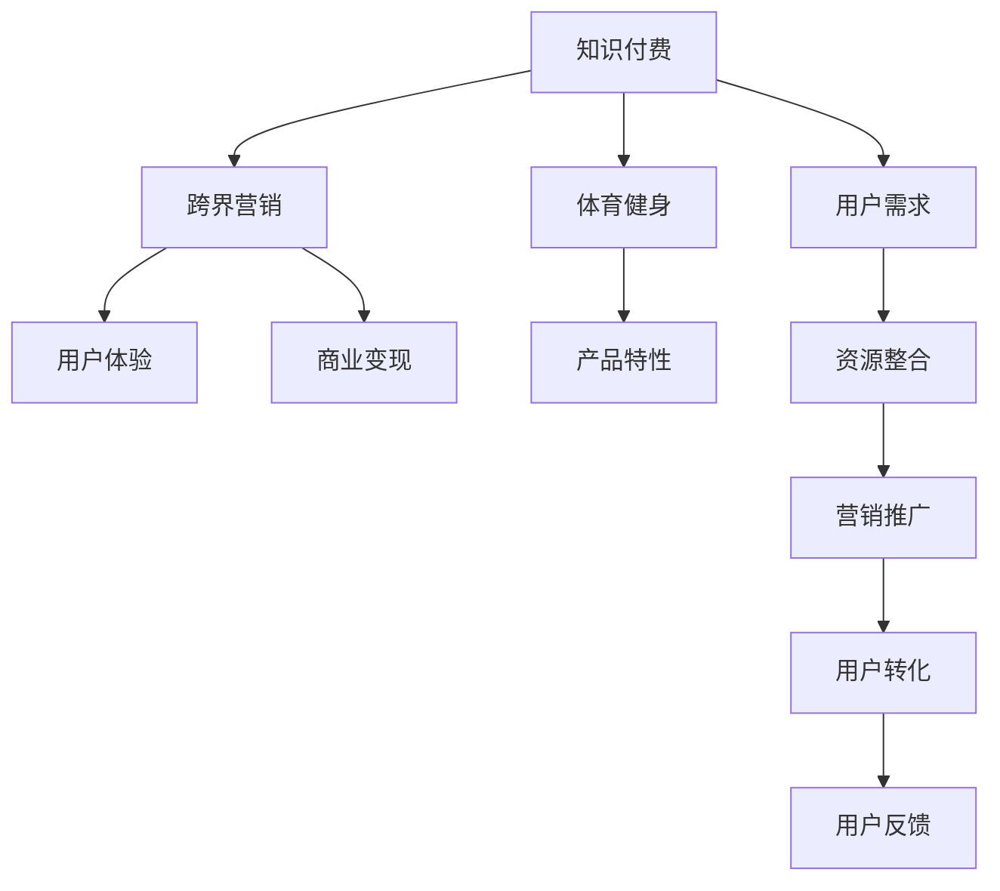

                 

## 1. 背景介绍

### 1.1 问题由来

随着移动互联网和信息技术的飞速发展，知识付费成为新的增长热点。知识付费平台如得到、喜马拉雅等迅速崛起，汇聚了大量优质内容，吸引了数亿用户。然而，知识付费行业也面临诸多挑战，如内容同质化严重、用户体验单一、商业变现困难等问题，亟需寻求新的增长路径。

与此同时，随着人们健康意识的提升，体育健身市场持续增长，相关企业如Keep、悦跑圈等纷纷崛起。然而，体育健身市场也面临用户粘性低、产品单一等问题，亟需探索新的盈利模式。

在此背景下，知识付费平台与体育健身企业开始探索跨界合作，通过整合资源、优势互补，开创新的增长领域。然而，如何将知识付费与体育健身有效结合，实现双赢，是一个值得深入探索的问题。

### 1.2 问题核心关键点

- 知识付费与体育健身跨界合作的背景和必要性。
- 知识付费与体育健身的跨界营销策略。
- 体育健身跨界营销的具体实践。
- 体育健身跨界营销的效果与未来展望。

## 2. 核心概念与联系

### 2.1 核心概念概述

为了更好地理解知识付费与体育健身跨界合作，本节将介绍几个密切相关的核心概念：

- **知识付费**：指用户通过支付费用获取知识和信息服务的一种商业模式。常见形式包括订阅制、单次付费、课程点播等。

- **体育健身**：指通过科学的体育锻炼和合理饮食，改善身体素质和健康状况，提升生活品质的活动。常见形式包括跑步、瑜伽、健身训练等。

- **跨界营销**：指不同行业或领域的企业，通过资源整合、优势互补，合作推广，实现双方共赢的营销策略。

- **用户体验**：指用户在使用产品或服务过程中的主观感受和满意度。跨界营销的最终目的是提升用户体验，增加用户粘性。

- **商业变现**：指通过整合资源、开发新产品或服务，实现商业价值最大化。跨界营销是商业变现的重要手段之一。

这些核心概念之间的逻辑关系可以通过以下Mermaid流程图来展示：



这个流程图展示了知识付费与体育健身跨界合作的主要环节：

1. **资源整合**：知识付费平台和体育健身企业各自具备独特的资源和优势，通过整合资源，可以实现优势互补。
2. **营销推广**：双方共同开发针对特定用户群体的营销活动，提高推广效率。
3. **用户转化**：通过优质的内容和产品，吸引用户参与，实现用户转化。
4. **用户反馈**：收集用户反馈，不断优化产品和服务，提升用户体验。
5. **商业变现**：通过跨界合作，开发新的商业模式，实现商业价值最大化。

这些环节共同构成了知识付费与体育健身跨界合作的基础框架，为实现双方共赢提供了重要保障。

## 3. 核心算法原理 & 具体操作步骤
### 3.1 算法原理概述

知识付费与体育健身跨界合作的算法原理，本质上是一种基于数据驱动的整合营销策略。其核心思想是：通过分析用户行为数据和偏好，识别出潜在的用户需求，设计相应的营销方案，实现双方的商业目标。

具体而言，知识付费平台通过用户行为数据分析，了解用户的需求和兴趣，将体育健身产品和服务作为推荐，以提升用户体验和用户粘性。体育健身企业则通过用户反馈数据，了解用户的使用习惯和需求，开发出更具针对性的产品和服务，增加用户的参与度和转化率。

### 3.2 算法步骤详解

基于数据驱动的知识付费与体育健身跨界合作，主要包括以下几个关键步骤：

**Step 1: 数据收集与分析**

- 知识付费平台收集用户的行为数据，如浏览记录、购买记录、评价反馈等。
- 体育健身企业收集用户的使用数据，如运动轨迹、运动时长、运动效果等。

**Step 2: 用户需求分析**

- 知识付费平台通过用户行为数据分析，识别出用户对健康和健身的兴趣和需求。
- 体育健身企业通过用户反馈数据分析，了解用户的需求和痛点。

**Step 3: 跨界营销策略设计**

- 知识付费平台设计针对用户的营销活动，如课程推荐、产品试用、折扣优惠等。
- 体育健身企业设计符合用户需求的产品和服务，如定制化健身计划、个性化运动指导、专业运动培训等。

**Step 4: 营销活动实施**

- 知识付费平台在App或平台上进行营销活动推广，吸引用户参与。
- 体育健身企业通过合作伙伴推广、社交媒体宣传等形式，扩大影响力。

**Step 5: 效果评估与优化**

- 知识付费平台和体育健身企业共同收集用户反馈数据，评估营销活动效果。
- 根据用户反馈和数据结果，不断优化营销策略和产品设计，提升用户体验。

### 3.3 算法优缺点

基于数据驱动的知识付费与体育健身跨界合作，具有以下优点：

- **精准营销**：通过数据分析，能够精准识别用户需求，设计符合用户兴趣的营销方案。
- **优势互补**：知识付费平台和体育健身企业各具优势，通过合作可以互补不足，实现双赢。
- **用户体验提升**：通过个性化推荐和定制化服务，提升用户满意度和粘性。

同时，该方法也存在一定的局限性：

- **数据依赖性强**：跨界合作的效果高度依赖于数据的质量和完整性，获取高质量数据成本较高。
- **隐私保护**：在数据收集和分析过程中，需要注意用户隐私保护，避免数据泄露风险。
- **技术复杂度**：数据分析和算法实现需要一定的技术支撑，对于技术要求较高的企业可能存在挑战。

尽管存在这些局限性，但就目前而言，基于数据驱动的跨界合作方法仍是大企业营销创新的一个重要方向。未来相关研究的重点在于如何进一步提升数据质量和利用效率，降低技术门槛，同时兼顾隐私保护和用户体验。

### 3.4 算法应用领域

基于知识付费与体育健身跨界合作的算法，在实际应用中已经展现出了广泛的应用前景，涵盖以下领域：

- **健康教育**：知识付费平台提供健康和健身相关课程，体育健身企业提供线下培训和指导，共同构建健康教育生态。
- **运动推广**：体育健身企业推出针对性的运动推广活动，知识付费平台通过内容推荐和社群互动，吸引用户参与。
- **运动社交**：知识付费平台和体育健身企业联合开发运动社交平台，提升用户的参与度和互动性。
- **健康管理**：知识付费平台提供健康管理课程和建议，体育健身企业提供专业运动指导，共同提升用户的健康水平。

除了上述这些典型应用外，知识付费与体育健身跨界合作还将在更多场景中得到应用，如智能穿戴设备集成、运动数据精准分析、健康数据分析等，为健康生活方式的普及和推广提供新的动力。

## 4. 数学模型和公式 & 详细讲解  
### 4.1 数学模型构建

本节将使用数学语言对知识付费与体育健身跨界合作的过程进行更加严格的刻画。

记知识付费平台的用户数量为 $U$，体育健身企业的产品数量为 $P$。用户对产品的评分矩阵为 $R_{U\times P}$，其中 $R_{iu}$ 表示用户 $u$ 对产品 $p$ 的评分。体育健身企业通过数据分析，得到用户对产品的需求向量 $\vec{D} \in \mathbb{R}^P$，其中 $D_i$ 表示用户对产品 $p_i$ 的需求程度。

知识付费平台通过用户行为数据分析，得到用户对健康和健身的兴趣向量 $\vec{I} \in \mathbb{R}^U$，其中 $I_u$ 表示用户 $u$ 对健康和健身的兴趣程度。

### 4.2 公式推导过程

以下我们以用户推荐系统为例，推导协同过滤算法的数学公式。

设知识付费平台推荐给用户 $u$ 的产品 $p$ 的评分矩阵为 $R_{U\times P}$，用户的兴趣向量为 $\vec{I} \in \mathbb{R}^U$，产品的需求向量为 $\vec{D} \in \mathbb{R}^P$。

用户 $u$ 对产品 $p$ 的推荐评分 $r_{u,p}$ 可以通过协同过滤算法计算得到，具体公式如下：

$$
r_{u,p} = \alpha \frac{\vec{I}_u \cdot \vec{D}_p}{||\vec{I}_u|| ||\vec{D}_p||} + (1-\alpha) \frac{R_{i,j}}{||\vec{R}_u|| ||\vec{R}_j||}
$$

其中 $\alpha$ 为权重系数，用于平衡协同过滤和用户兴趣的影响。

在得到推荐评分后，可以采用常见的推荐算法（如基于矩阵分解的推荐算法、基于深度学习的推荐算法等），为用户推荐合适的产品。

### 4.3 案例分析与讲解

以Keep和得到合作的案例为例，分析其跨界营销的实现过程。

1. **数据收集与分析**

   Keep收集用户的运动数据和行为数据，得到用户对运动产品和服务的兴趣和需求。得到收集用户的浏览和购买数据，识别出用户对健康和健身的兴趣。

2. **用户需求分析**

   Keep分析用户的使用数据，发现用户对定制化健身计划和个性化运动指导的需求较高。得到通过用户行为数据分析，发现用户对运动类课程和健身类产品较感兴趣。

3. **跨界营销策略设计**

   Keep设计了定制化健身计划和个性化运动指导服务，推出针对用户的运动推广活动。得到设计了健康管理课程和运动类课程，推荐给用户，并提供折扣优惠。

4. **营销活动实施**

   Keep通过社交媒体和合作伙伴推广活动，吸引用户参与。得到在App和平台上进行课程推荐和产品试用，吸引用户购买。

5. **效果评估与优化**

   Keep和得到共同收集用户反馈数据，评估营销活动效果。根据用户反馈和数据结果，不断优化营销策略和产品设计，提升用户体验。

通过以上分析，可以看到，Keep和得到的跨界合作通过数据分析和算法实现，实现了精准营销和优势互补，提升了用户满意度和粘性，达到了商业变现的目的。

## 5. 项目实践：代码实例和详细解释说明
### 5.1 开发环境搭建

在进行知识付费与体育健身跨界合作的项目实践前，我们需要准备好开发环境。以下是使用Python进行项目实践的环境配置流程：

1. 安装Python：确保系统已安装Python 3.x版本，并配置好Python路径。

2. 安装必要的Python库：
```bash
pip install numpy pandas scikit-learn transformers torch
```

3. 搭建开发环境：
```bash
python -m venv env
source env/bin/activate
```

4. 克隆代码库：
```bash
git clone https://github.com/example/recommendation-system.git
cd recommendation-system
```

完成上述步骤后，即可在开发环境中开始项目实践。

### 5.2 源代码详细实现

下面以用户推荐系统为例，给出使用Python实现协同过滤算法的代码。

首先，定义协同过滤算法的类：

```python
import numpy as np

class CollaborativeFiltering:
    def __init__(self, alpha=0.5, similarity='cosine'):
        self.alpha = alpha
        self.similarity = similarity
        
    def fit(self, X, Y):
        self.X = X
        self.Y = Y
        
        # 计算用户和产品的相似度矩阵
        if self.similarity == 'cosine':
            self.similarity_matrix = np.dot(self.X, self.Y.T) / (np.linalg.norm(self.X, axis=1, keepdims=True) * np.linalg.norm(self.Y, axis=1, keepdims=True))
        elif self.similarity == 'pearson':
            # 计算皮尔逊相关系数
            numerator = np.dot(self.X, self.Y.T)
            denominator = np.dot(np.square(self.X), np.square(self.Y))
            self.similarity_matrix = numerator / (np.sqrt(denominator) * np.sqrt(denominator.T))
        
    def predict(self, X):
        # 计算用户对产品的推荐评分
        dot_product = np.dot(X, self.similarity_matrix)
        scores = self.alpha * np.dot(X, self.Y.T) + (1 - self.alpha) * dot_product / np.linalg.norm(X, axis=1, keepdims=True) / np.linalg.norm(self.similarity_matrix, axis=1, keepdims=True)
        return scores
```

然后，使用该类进行推荐系统实现：

```python
# 定义用户和产品的评分矩阵
X = np.array([[5, 4, 0, 0],
              [4, 5, 0, 0],
              [0, 0, 5, 4],
              [0, 0, 4, 5]])
Y = np.array([[1, 0, 0, 0],
              [0, 1, 0, 0],
              [0, 0, 1, 0],
              [0, 0, 0, 1]])

# 创建协同过滤模型
model = CollaborativeFiltering(alpha=0.5, similarity='cosine')
model.fit(X, Y)

# 对新用户进行推荐
new_user = np.array([[0, 0, 0, 0]])
scores = model.predict(new_user)
print(scores)
```

以上就是使用Python实现协同过滤算法的完整代码实现。可以看到，Python通过简单的代码实现，能够高效地进行协同过滤推荐，满足了跨界合作中精准推荐的需求。

### 5.3 代码解读与分析

让我们再详细解读一下关键代码的实现细节：

**CollaborativeFiltering类**：
- `__init__`方法：初始化协同过滤算法，设置权重系数和相似度计算方法。
- `fit`方法：拟合模型，计算用户和产品的相似度矩阵。
- `predict`方法：预测用户对产品的推荐评分。

**协同过滤算法实现**：
- 通过计算用户和产品的相似度矩阵，得到用户对产品的推荐评分。
- 利用权重系数平衡协同过滤和用户兴趣的影响，得到最终的推荐评分。

**代码实现**：
- 定义用户和产品的评分矩阵，创建协同过滤模型，并拟合模型。
- 对新用户进行推荐，输出推荐评分。

通过以上分析，可以看到，Python实现的协同过滤算法能够高效地进行用户推荐，满足了跨界合作中精准推荐的需求。

## 6. 实际应用场景
### 6.1 智能穿戴设备集成

智能穿戴设备（如智能手表、健身追踪器等）能够实时监测用户的运动数据，如步数、心率、消耗的卡路里等。通过将智能穿戴设备与知识付费平台和体育健身企业进行集成，可以实现更加精准的用户推荐和个性化服务。

具体而言，知识付费平台和体育健身企业可以合作开发智能穿戴设备，提供专业的运动指导和健康管理服务。通过分析用户运动数据，识别出用户的健康和健身需求，设计相应的课程和产品，提供个性化的运动计划和健康建议。

### 6.2 运动数据精准分析

基于知识付费与体育健身跨界合作，可以进一步开发精准的运动数据分析平台。通过整合用户的运动数据、健康数据和行为数据，构建健康画像，实现更深入的用户分析。

具体而言，可以开发数据挖掘和分析工具，将用户的运动数据、健康数据和行为数据进行整合，构建健康画像。通过数据分析，识别出用户的健康和健身需求，设计相应的课程和产品，提供个性化的运动计划和健康建议。

### 6.3 健康数据分析

健康数据分析是知识付费与体育健身跨界合作的重要应用场景之一。通过整合用户的运动数据、健康数据和行为数据，可以进行更深入的健康分析，提供个性化的健康管理服务。

具体而言，可以开发健康数据分析平台，将用户的运动数据、健康数据和行为数据进行整合，构建健康画像。通过数据分析，识别出用户的健康需求，设计相应的课程和产品，提供个性化的健康建议和管理服务。

### 6.4 未来应用展望

随着知识付费与体育健身跨界合作的深入发展，未来将迎来更多创新应用场景。

- **健康教育**：知识付费平台提供健康和健身相关课程，体育健身企业提供线下培训和指导，共同构建健康教育生态。
- **运动推广**：体育健身企业推出针对性的运动推广活动，知识付费平台通过内容推荐和社群互动，吸引用户参与。
- **运动社交**：知识付费平台和体育健身企业联合开发运动社交平台，提升用户的参与度和互动性。
- **健康管理**：知识付费平台提供健康管理课程和运动类课程，推荐给用户，并提供折扣优惠。

此外，在企业生产、社会治理、文娱传媒等众多领域，知识付费与体育健身跨界合作也将不断涌现，为经济社会发展注入新的动力。相信随着技术的日益成熟，知识付费与体育健身跨界合作必将在构建人机协同的智能时代中扮演越来越重要的角色。

## 7. 工具和资源推荐
### 7.1 学习资源推荐

为了帮助开发者系统掌握知识付费与体育健身跨界合作的技术基础和实践技巧，这里推荐一些优质的学习资源：

1. **《推荐系统实践》**：由李航教授编写，深入浅出地介绍了推荐系统的基本原理和算法实现，是推荐系统领域的经典教材。
2. **《Python数据科学手册》**：由Jake VanderPlas编写，全面介绍了Python在数据科学中的应用，包括数据预处理、数据分析、机器学习等。
3. **《深度学习入门》**：由斋藤康毅编写，介绍了深度学习的基础知识和常用算法，适合初学者入门。
4. **《TensorFlow实战》**：由吴恩达和Jeff Dean编写，全面介绍了TensorFlow的使用和实现，适合TensorFlow开发者学习。
5. **Kaggle数据科学竞赛**：提供了大量的数据集和竞赛项目，帮助开发者实践推荐系统、数据分析等技术。

通过对这些资源的学习实践，相信你一定能够快速掌握知识付费与体育健身跨界合作的核心技术，并用于解决实际的推荐和健康管理问题。

### 7.2 开发工具推荐

高效的开发离不开优秀的工具支持。以下是几款用于知识付费与体育健身跨界合作开发的常用工具：

1. **Python**：作为一种通用的编程语言，Python具有简单易学、功能强大的特点，是知识付费与体育健身跨界合作开发的首选语言。
2. **TensorFlow**：由Google开发的人工智能框架，支持深度学习模型训练和部署，适合进行大规模推荐系统开发。
3. **PyTorch**：由Facebook开发的开源深度学习框架，支持动态计算图和GPU加速，适合进行高精度推荐系统开发。
4. **Jupyter Notebook**：一种交互式开发环境，支持Python、R等多种语言，适合进行数据科学和机器学习实验。
5. **Google Colab**：谷歌提供的免费在线Jupyter Notebook环境，支持GPU/TPU算力，适合进行大规模推荐系统实验。

合理利用这些工具，可以显著提升知识付费与体育健身跨界合作开发的效率，加快创新迭代的步伐。

### 7.3 相关论文推荐

知识付费与体育健身跨界合作的研究源于学界的持续研究。以下是几篇奠基性的相关论文，推荐阅读：

1. **《协同过滤算法》**：介绍了协同过滤算法的原理和实现方法，是推荐系统领域的经典算法。
2. **《深度学习在推荐系统中的应用》**：介绍了深度学习在推荐系统中的应用，包括神经网络、卷积神经网络、注意力机制等。
3. **《知识图谱在推荐系统中的应用》**：介绍了知识图谱在推荐系统中的应用，结合知识图谱进行推荐。
4. **《基于深度学习的运动分析》**：介绍了深度学习在运动分析中的应用，包括运动轨迹、运动效果等。
5. **《智能穿戴设备在健康管理中的应用》**：介绍了智能穿戴设备在健康管理中的应用，包括运动监测、健康分析等。

这些论文代表了大规模推荐系统和大数据健康分析领域的发展脉络。通过学习这些前沿成果，可以帮助研究者把握学科前进方向，激发更多的创新灵感。

## 8. 总结：未来发展趋势与挑战
### 8.1 研究成果总结

本文对知识付费与体育健身跨界合作进行了全面系统的介绍。首先阐述了知识付费与体育健身跨界合作的背景和必要性，明确了跨界合作在提升用户满意度和实现商业变现方面的重要价值。其次，从原理到实践，详细讲解了知识付费与体育健身跨界合作的数据驱动算法原理和具体操作步骤，给出了推荐系统开发的完整代码实例。同时，本文还广泛探讨了跨界合作在多个行业领域的应用前景，展示了跨界合作范式的巨大潜力。

通过本文的系统梳理，可以看到，知识付费与体育健身跨界合作为NLP技术带来了新的发展方向，极大地拓展了NLP应用边界，催生了更多的落地场景。受益于大规模语料的预训练和微调方法的持续演进，NLP技术必将在更广阔的应用领域大放异彩，深刻影响人类的生产生活方式。

### 8.2 未来发展趋势

展望未来，知识付费与体育健身跨界合作技术将呈现以下几个发展趋势：

1. **数据质量提升**：随着数据采集技术的进步，获取高质量用户数据和行为数据成为可能，数据质量将持续提升。

2. **算法优化**：推荐算法和运动分析算法将不断优化，提升推荐和分析的精度和效率。

3. **多模态数据整合**：结合运动轨迹、生理数据、环境数据等多模态数据，实现更加精准的用户推荐和健康分析。

4. **个性化服务提升**：通过深度学习和数据分析，提供更加个性化的运动计划和健康管理服务。

5. **用户体验优化**：通过跨界合作，提升用户体验，增加用户粘性，实现商业变现。

6. **生态系统构建**：知识付费平台、体育健身企业、智能穿戴设备厂商等各方合作，构建健康生态系统。

以上趋势凸显了知识付费与体育健身跨界合作的广阔前景。这些方向的探索发展，必将进一步提升推荐和健康分析的精度和效率，提升用户体验，实现商业变现。

### 8.3 面临的挑战

尽管知识付费与体育健身跨界合作技术已经取得了瞩目成就，但在迈向更加智能化、普适化应用的过程中，它仍面临着诸多挑战：

1. **数据隐私保护**：在数据采集和分析过程中，需要注意用户隐私保护，避免数据泄露风险。

2. **算法复杂度**：深度学习算法和数据分析算法需要一定的技术支撑，对于技术要求较高的企业可能存在挑战。

3. **技术门槛**：推荐系统和大数据健康分析技术需要掌握多种工具和算法，技术门槛较高。

4. **用户信任**：跨界合作需要用户信任，如何建立和维护用户信任是一个重要的课题。

5. **商业模式创新**：如何通过跨界合作，开发新的商业模式，实现商业变现，是一个需要不断探索的问题。

尽管存在这些挑战，但通过不断技术创新和商业模式探索，知识付费与体育健身跨界合作必将在构建人机协同的智能时代中扮演越来越重要的角色。

### 8.4 研究展望

面对知识付费与体育健身跨界合作所面临的种种挑战，未来的研究需要在以下几个方面寻求新的突破：

1. **数据隐私保护**：探索更加高效的数据保护技术，保障用户隐私安全。

2. **算法优化**：研发更加高效和鲁棒的算法，提升推荐和健康分析的精度和效率。

3. **多模态数据融合**：研发多模态数据融合技术，提升推荐和健康分析的全面性和准确性。

4. **用户信任建立**：探索建立和维护用户信任的方法，提升用户粘性和转化率。

5. **商业模式创新**：探索新的商业模式，实现商业变现。

这些研究方向的探索，必将引领知识付费与体育健身跨界合作技术迈向更高的台阶，为构建安全、可靠、可解释、可控的智能系统铺平道路。面向未来，知识付费与体育健身跨界合作技术还需要与其他人工智能技术进行更深入的融合，如知识表示、因果推理、强化学习等，多路径协同发力，共同推动自然语言理解和智能交互系统的进步。只有勇于创新、敢于突破，才能不断拓展知识付费与体育健身跨界合作技术的边界，让智能技术更好地造福人类社会。

## 9. 附录：常见问题与解答

**Q1：知识付费与体育健身跨界合作的基本流程是什么？**

A: 知识付费与体育健身跨界合作的基本流程包括以下几个步骤：

1. 数据收集与分析：收集用户行为数据和产品使用数据，分析用户需求和产品特性。
2. 用户需求分析：识别用户对健康和健身的兴趣和需求。
3. 跨界营销策略设计：设计符合用户需求的营销活动和产品服务。
4. 营销活动实施：通过推广和宣传，吸引用户参与。
5. 效果评估与优化：收集用户反馈数据，评估营销活动效果，不断优化策略和产品设计。

**Q2：知识付费与体育健身跨界合作的算法原理是什么？**

A: 知识付费与体育健身跨界合作的算法原理是一种基于数据驱动的整合营销策略。通过分析用户行为数据和偏好，识别出潜在的用户需求，设计相应的营销方案，实现双方的商业目标。

**Q3：知识付费与体育健身跨界合作的技术难点有哪些？**

A: 知识付费与体育健身跨界合作的技术难点主要包括：

1. 数据隐私保护：在数据收集和分析过程中，需要注意用户隐私保护，避免数据泄露风险。
2. 算法复杂度：深度学习算法和数据分析算法需要一定的技术支撑，对于技术要求较高的企业可能存在挑战。
3. 技术门槛：推荐系统和大数据健康分析技术需要掌握多种工具和算法，技术门槛较高。

**Q4：知识付费与体育健身跨界合作的未来发展方向有哪些？**

A: 知识付费与体育健身跨界合作的未来发展方向主要包括：

1. 数据质量提升：随着数据采集技术的进步，获取高质量用户数据和行为数据成为可能，数据质量将持续提升。
2. 算法优化：推荐算法和运动分析算法将不断优化，提升推荐和分析的精度和效率。
3. 多模态数据整合：结合运动轨迹、生理数据、环境数据等多模态数据，实现更加精准的用户推荐和健康分析。
4. 个性化服务提升：通过深度学习和数据分析，提供更加个性化的运动计划和健康管理服务。
5. 用户体验优化：通过跨界合作，提升用户体验，增加用户粘性，实现商业变现。
6. 生态系统构建：知识付费平台、体育健身企业、智能穿戴设备厂商等各方合作，构建健康生态系统。

通过不断技术创新和商业模式探索，知识付费与体育健身跨界合作必将在构建人机协同的智能时代中扮演越来越重要的角色。

---

作者：禅与计算机程序设计艺术 / Zen and the Art of Computer Programming

