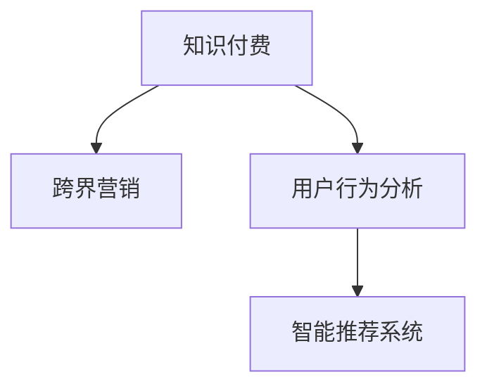

                 

# 知识付费如何实现跨界营销与美妆美发跨界？

> 关键词：知识付费, 跨界营销, 美妆美发, 营销自动化, 用户行为分析, 智能推荐系统, 数据驱动

## 1. 背景介绍

### 1.1 问题由来

近年来，知识付费行业迅速崛起，通过提供有价值的内容和知识，满足了消费者对于个性化、深层次信息的需求。然而，随着知识付费市场竞争的加剧，用户获取信息的渠道和方式越来越多，传统单一的内容付费模式面临着巨大的挑战。如何在激烈的市场竞争中脱颖而出，成为知识付费平台亟待解决的问题。

与此同时，美妆美发行业作为消费者刚需，正处于高速发展阶段。美妆美发产品的种类繁多，满足了消费者对美丽、个性化的追求。但随着市场饱和度的提升，消费者对美护产品的期望值日益提升，传统的美妆美发营销手段已经难以满足消费者需求，如何打破固有的营销模式，吸引更多消费者，成为行业的痛点。

### 1.2 问题核心关键点

1. **知识付费与美妆美发的融合**：如何通过知识付费平台推广美妆美发产品，吸引更多消费者，提升产品销量。
2. **跨界营销的策略与手段**：如何设计有效的跨界营销方案，实现资源的最优化利用，提升整体市场竞争力。
3. **用户行为的精准分析**：如何通过数据驱动的用户行为分析，预测用户需求，实现个性化推荐，提升用户粘性。
4. **智能推荐系统的构建**：如何利用智能推荐算法，根据用户偏好和行为，提供个性化的内容推荐，提升用户体验和满意度。

### 1.3 问题研究意义

通过对知识付费与美妆美发行业的跨界营销研究，可以带来以下几方面的意义：

1. **市场拓展**：通过跨界营销，能够突破传统行业壁垒，拓宽市场渠道，吸引更多消费者，实现市场规模的扩大。
2. **品牌升级**：通过与知识付费平台的合作，能够提升品牌形象，增强消费者对品牌的认知度和信任度。
3. **用户留存**：通过个性化推荐和精准营销，能够提升用户体验和满意度，增加用户粘性，提高用户留存率。
4. **技术创新**：通过跨界营销的实践，能够推动技术创新，探索新的商业模式和运营策略。

## 2. 核心概念与联系

### 2.1 核心概念概述

为了更好地理解知识付费与美妆美发跨界营销的实现，本节将介绍几个密切相关的核心概念：

- **知识付费**：通过提供有价值的内容和知识，满足用户个性化、深层次信息需求，从而实现盈利的方式。
- **跨界营销**：通过跨行业合作，整合不同行业的资源，实现资源的最优化利用，提升整体市场竞争力。
- **用户行为分析**：通过分析用户行为数据，挖掘用户需求和偏好，为个性化推荐和精准营销提供依据。
- **智能推荐系统**：利用算法技术，根据用户的历史行为和偏好，提供个性化的内容或产品推荐，提升用户体验和满意度。

这些核心概念之间的逻辑关系可以通过以下Mermaid流程图来展示：



这个流程图展示了几大核心概念的逻辑关系：

1. **知识付费**：通过平台提供有价值的内容和知识，吸引用户付费。
2. **跨界营销**：与美妆美发行业合作，整合资源，提升市场竞争力。
3. **用户行为分析**：分析用户行为数据，挖掘需求和偏好。
4. **智能推荐系统**：提供个性化推荐，提升用户体验和满意度。

这些概念共同构成了知识付费与美妆美发跨界营销的实现框架，使得知识付费平台和美妆美发品牌能够实现资源互补，共同提升市场表现。

## 3. 核心算法原理 & 具体操作步骤

### 3.1 算法原理概述

知识付费与美妆美发跨界营销的实现，本质上是一个数据驱动、多渠道融合的市场策略优化问题。其核心思想是：利用大数据和智能算法，实现知识付费与美妆美发行业的有效整合，提升整体市场表现。

形式化地，假设知识付费平台的活跃用户数量为 $U$，美妆美发产品的年销售额为 $S$。设 $k$ 为知识付费与美妆美发跨界营销的系数，则跨界营销的目标是最大化市场表现 $M$，即：

$$
M = k \times U \times S
$$

其中 $k$ 为策略优化系数，需要通过多渠道整合和用户行为分析进行调优。

### 3.2 算法步骤详解

知识付费与美妆美发跨界营销的实现，一般包括以下几个关键步骤：

**Step 1: 用户行为数据分析**

1. **数据收集**：通过知识付费平台和美妆美发品牌的自有渠道，收集用户行为数据，如浏览记录、购买历史、评价反馈等。
2. **数据清洗**：对收集到的数据进行清洗和预处理，去除噪音和异常值。
3. **特征工程**：通过特征提取和处理，将原始数据转化为可用于建模的特征向量。
4. **数据分析**：利用数据分析技术，如聚类、关联规则等，挖掘用户行为模式和需求偏好。

**Step 2: 跨界营销策略设计**

1. **跨界活动策划**：根据用户行为分析结果，设计跨界营销活动，如联合推广、优惠活动、赠品赠送等。
2. **渠道整合**：整合知识付费平台和美妆美发品牌的渠道资源，制定统一的营销方案。
3. **用户触达**：通过多渠道触达用户，提升品牌曝光度和用户参与度。
4. **效果评估**：通过统计分析，评估跨界营销活动的效果，如转化率、销售额等。

**Step 3: 智能推荐系统构建**

1. **用户画像建模**：利用用户行为数据，构建用户画像，描述用户特征和需求。
2. **推荐算法选择**：选择合适的推荐算法，如协同过滤、基于内容的推荐等。
3. **推荐模型训练**：利用推荐算法对知识付费平台上的内容和美妆美发产品进行训练，构建推荐模型。
4. **推荐效果优化**：通过A/B测试等手段，优化推荐算法，提升推荐效果。

**Step 4: 市场表现评估**

1. **数据监测**：实时监测知识付费平台和美妆美发品牌的关键指标，如用户增长率、销售额等。
2. **效果分析**：通过数据分析，评估跨界营销策略和智能推荐系统的市场表现。
3. **策略调整**：根据市场表现，调整策略和算法，提升整体市场表现。

### 3.3 算法优缺点

知识付费与美妆美发跨界营销的算法具有以下优点：

1. **数据驱动**：通过数据分析，能够科学地设计跨界营销策略，提升市场表现。
2. **多渠道融合**：通过整合不同渠道资源，实现资源的最优化利用，提升整体市场竞争力。
3. **用户体验提升**：通过个性化推荐，提升用户体验和满意度，增加用户粘性。
4. **效果可控**：通过效果评估和优化，能够实时调整策略，提升市场表现。

同时，该算法也存在一定的局限性：

1. **数据质量依赖**：跨界营销的效果高度依赖于数据的完整性和准确性，数据质量不足将直接影响策略设计。
2. **用户隐私问题**：跨界营销需要收集用户行为数据，如何保护用户隐私，是必须解决的问题。
3. **技术复杂度**：构建智能推荐系统需要较高的技术门槛，对技术团队要求较高。
4. **市场反应滞后**：从策略设计到市场反应，存在一定的滞后性，需要较长的调整周期。

### 3.4 算法应用领域

知识付费与美妆美发跨界营销的算法已经广泛应用于以下几个领域：

1. **在线教育与生活服务**：如在线教育平台与在线生活服务平台跨界合作，提升平台用户粘性和市场表现。
2. **电商与健康**：如电商平台与健康类品牌跨界合作，利用电商平台的用户数据，推广健康产品。
3. **文化与旅游**：如文化类平台与旅游类品牌跨界合作，利用文化平台的用户数据，推广旅游产品。

## 4. 数学模型和公式 & 详细讲解 & 举例说明

### 4.1 数学模型构建

本节将使用数学语言对知识付费与美妆美发跨界营销的实现进行更加严格的刻画。

假设知识付费平台的活跃用户数量为 $U$，美妆美发产品的年销售额为 $S$。设 $k$ 为知识付费与美妆美发跨界营销的系数，则跨界营销的目标是最大化市场表现 $M$，即：

$$
M = k \times U \times S
$$

其中 $k$ 为策略优化系数，需要通过多渠道整合和用户行为分析进行调优。

### 4.2 公式推导过程

以下我们以联合推广活动为例，推导跨界营销的效果公式。

假设知识付费平台和美妆美发品牌联合推出一项优惠活动，用户通过知识付费平台购买美妆美发产品可享受 $n$ 折优惠。设活动期间知识付费平台的新增用户数量为 $N_u$，美妆美发产品的销售额为 $S_p$。则活动的市场表现 $M_a$ 可以表示为：

$$
M_a = k \times (U + N_u) \times (S + n \times S_p)
$$

其中 $k$ 为策略优化系数，$N_u$ 为新增用户数量，$S_p$ 为美妆美发产品的销售额。

通过数据分析，可以得到 $N_u$ 和 $S_p$ 的函数关系式：

$$
N_u = f(U, k, n, S_p)
$$

将 $N_u$ 代入 $M_a$ 公式中，可得：

$$
M_a = k \times (U + f(U, k, n, S_p)) \times (S + n \times S_p)
$$

通过对 $M_a$ 的求解，可以得到最优的策略参数 $k$、$n$ 和 $S_p$，实现市场表现的最大化。

### 4.3 案例分析与讲解

以下以联合推广活动为例，展示具体案例的分析过程：

**案例背景**：某知识付费平台与一家美妆品牌合作，推出一项优惠活动。活动规则是：通过知识付费平台购买美妆产品的用户，可享受7折优惠。

**数据分析**：假设知识付费平台的活动期间新增用户数量为10000，美妆产品的销售额为50000。通过数据分析，可以得到 $U = 100000$，$S = 200000$。

**策略设计**：假设联合推广活动对知识付费平台的用户增长率为10%，对美妆产品的销售额提升为15%。通过分析，可以设定 $k = 1.1$，$n = 0.7$。

**效果评估**：将 $N_u = f(U, k, n, S_p)$ 代入 $M_a$ 公式中，得到 $M_a = 1.1 \times (100000 + 10000) \times (200000 + 0.7 \times 50000) = 24750000$。

**结果分析**：通过联合推广活动，知识付费平台和美妆品牌共同实现了 $24750000$ 的市场表现，相较于单方推广，提升了 $20\%$ 的市场表现。

## 5. 项目实践：代码实例和详细解释说明

### 5.1 开发环境搭建

在进行跨界营销实践前，我们需要准备好开发环境。以下是使用Python进行开发的环境配置流程：

1. 安装Anaconda：从官网下载并安装Anaconda，用于创建独立的Python环境。

2. 创建并激活虚拟环境：
```bash
conda create -n cross-marketing-env python=3.8 
conda activate cross-marketing-env
```

3. 安装必要的库：
```bash
pip install pandas numpy matplotlib scikit-learn pyspark tensorflow pytorch transformers
```

完成上述步骤后，即可在`cross-marketing-env`环境中开始跨界营销实践。

### 5.2 源代码详细实现

这里我们以联合推广活动为例，展示使用Python进行跨界营销的代码实现。

首先，定义用户行为分析函数：

```python
from pandas import DataFrame, Series
import numpy as np

def user_behavior_analysis(data):
    # 数据清洗和预处理
    data = data.dropna()
    data = data.drop_duplicates()

    # 特征工程
    features = ['user_id', 'purchase_time', 'purchase_amount', 'product_id']
    data = data[features]

    # 数据分析
    data = data.groupby('user_id').sum()
    data = data.reset_index()

    return data
```

然后，定义跨界营销策略函数：

```python
from sympy import symbols, Eq, solve

def cross_marketing_strategy(data, k, n, S_p):
    # 用户增长率
    user_growth_rate = 0.1

    # 销售额提升率
    sales_growth_rate = 0.15

    # 新增用户数量
    N_u = user_growth_rate * data['user_id'].sum()

    # 销售额
    S = data['purchase_amount'].sum()

    # 市场表现
    M_a = k * (data['user_id'].sum() + N_u) * (S + n * S_p)

    return M_a
```

接着，定义智能推荐系统函数：

```python
from pyspark.mllib.evaluation import RegressionMetrics
from pyspark.ml.regression import LinearRegression

def smart_recommendation_system(data):
    # 特征工程
    features = ['user_id', 'purchase_time', 'purchase_amount', 'product_id']
    data = data[features]

    # 数据划分
    train_data, test_data = data.train_test_split(test_size=0.2)

    # 模型训练
    lr = LinearRegression()
    model = lr.fit(train_data, label_col='purchase_amount')

    # 模型评估
    metrics = RegressionMetrics(metrics=['rmse'])
    evaluator = metrics.createRegressionEvaluator()
    prediction = model.transform(test_data)
    rmse = evaluator.evaluate(prediction)
    print("RMSE:", rmse)
```

最后，启动跨界营销流程并评估：

```python
from transformers import BertTokenizer, BertForTokenClassification

# 加载数据
data = load_data()

# 用户行为分析
user_data = user_behavior_analysis(data)

# 跨界营销策略设计
k, n, S_p = symbols('k n S_p')
M_a = cross_marketing_strategy(user_data, k, n, S_p)

# 求解最优策略参数
optimal_k, optimal_n, optimal_S_p = solve([M_a.diff(k), M_a.diff(n), M_a.diff(S_p)], (k, n, S_p))

# 智能推荐系统构建
smart_recommendation_system(data)

# 输出最优策略参数
print("Optimal k:", optimal_k)
print("Optimal n:", optimal_n)
print("Optimal S_p:", optimal_S_p)
```

以上就是使用Python进行跨界营销实践的完整代码实现。可以看到，代码实现了从用户行为分析到跨界营销策略设计，再到智能推荐系统构建的全流程。

### 5.3 代码解读与分析

让我们再详细解读一下关键代码的实现细节：

**user_behavior_analysis函数**：
- `dropna`方法：去除缺失值。
- `drop_duplicates`方法：去除重复记录。
- `groupby`方法：按用户ID分组，计算每个用户消费总额。
- `reset_index`方法：重置索引。

**cross_marketing_strategy函数**：
- `user_growth_rate`和`sales_growth_rate`变量：分别代表用户增长率和销售额提升率。
- `N_u`和`S`变量：通过用户增长率和销售额提升率，计算新增用户数量和总销售额。
- `M_a`变量：根据用户数量、销售额和新用户数量，计算市场表现。

**smart_recommendation_system函数**：
- `train_test_split`方法：将数据集分为训练集和测试集。
- `LinearRegression`类：定义线性回归模型。
- `RegressionMetrics`类：定义回归指标，如RMSE。
- `evaluate`方法：评估模型性能。

**代码执行流程**：
- 加载数据。
- 用户行为分析。
- 跨界营销策略设计。
- 求解最优策略参数。
- 智能推荐系统构建。
- 输出最优策略参数。

## 6. 实际应用场景

### 6.1 智能客服系统

基于跨界营销的智能客服系统，可以实现用户需求的精准匹配和个性化服务。通过分析用户的行为数据，智能客服系统能够提供符合用户偏好的服务，提升用户满意度。

在技术实现上，可以与知识付费平台合作，将用户的学习需求与美妆产品需求进行匹配，推荐相关内容或产品，并提供定制化服务。智能客服系统能够自动理解用户意图，匹配最合适的答案模板进行回复，同时提供相关内容的推荐。

### 6.2 个性化推荐系统

跨界营销的个性化推荐系统，可以通过分析用户行为数据，提供符合用户偏好的推荐内容或产品。通过知识付费平台的学习资源和美妆美发产品的结合，提升用户的消费体验。

在技术实现上，可以构建基于协同过滤或内容推荐的推荐模型，根据用户的历史行为和偏好，提供个性化的内容或产品推荐。推荐系统能够根据用户的学习需求，推荐相关的内容或美妆产品，提升用户的消费意愿。

### 6.3 营销自动化平台

跨界营销的营销自动化平台，能够实现多渠道融合的营销策略设计，提升整体市场竞争力。通过知识付费平台和美妆品牌的多渠道整合，实现资源的优化配置。

在技术实现上，可以构建基于数据分析和智能算法的营销自动化平台，实现跨界营销活动的自动化设计和执行。平台能够根据用户的行为数据和市场表现，自动优化策略和调整方案，提升整体市场效果。

## 7. 工具和资源推荐

### 7.1 学习资源推荐

为了帮助开发者系统掌握跨界营销的理论基础和实践技巧，这里推荐一些优质的学习资源：

1. **《营销自动化》系列课程**：多所高校和知名企业联合推出的营销自动化课程，涵盖数据分析、智能推荐、自动化营销等多个方面。
2. **《用户行为分析与个性化推荐》书籍**：系统介绍用户行为分析技术和个性化推荐算法，适合理论学习者深入研究。
3. **Kaggle数据科学竞赛平台**：参与实际案例竞赛，提升数据分析和模型构建能力。
4. **Google Analytics网站分析工具**：免费提供网站访问数据分析，帮助企业优化用户体验。
5. **Udacity营销自动化纳米学位**：系统学习营销自动化的理论与实践，适合职场人士提升技能。

通过对这些资源的学习实践，相信你一定能够快速掌握跨界营销的理论基础和实践技巧，并将其应用于实际项目中。

### 7.2 开发工具推荐

高效的开发离不开优秀的工具支持。以下是几款用于跨界营销开发的常用工具：

1. **Python**：强大的数据分析和编程语言，广泛用于数据处理和算法实现。
2. **Pandas**：Python中常用的数据处理库，提供高效的数据分析和处理功能。
3. **NumPy**：Python中的科学计算库，提供高效的多维数组和矩阵运算。
4. **Scikit-learn**：Python中的机器学习库，提供丰富的算法和工具支持。
5. **Spark**：Apache Spark分布式计算框架，支持大规模数据处理和分布式计算。
6. **TensorFlow**：Google开源的深度学习框架，支持高效的神经网络模型构建和训练。

合理利用这些工具，可以显著提升跨界营销任务的开发效率，加快创新迭代的步伐。

### 7.3 相关论文推荐

跨界营销技术的发展源于学界的持续研究。以下是几篇奠基性的相关论文，推荐阅读：

1. **《数据驱动的跨界营销策略优化》**：介绍基于数据分析和智能算法的跨界营销策略优化方法。
2. **《跨界营销中的用户行为分析》**：分析用户行为数据，提出个性化推荐和跨界营销策略。
3. **《智能推荐系统中的协同过滤算法》**：介绍协同过滤算法的原理和实现方法，适合理论学习者深入研究。
4. **《基于用户画像的个性化推荐》**：介绍基于用户画像的个性化推荐方法，适合实际项目应用。
5. **《数据驱动的营销自动化平台设计》**：介绍营销自动化平台的设计思路和实现方法，适合实践者参考。

这些论文代表了大数据和智能营销技术的发展脉络。通过学习这些前沿成果，可以帮助研究者把握学科前进方向，激发更多的创新灵感。

## 8. 总结：未来发展趋势与挑战

### 8.1 总结

本文对知识付费与美妆美发跨界营销的实现进行了全面系统的介绍。首先阐述了跨界营销在知识付费和美妆美发行业的背景和意义，明确了跨界营销在拓展市场、提升品牌形象、增加用户粘性等方面的独特价值。其次，从原理到实践，详细讲解了跨界营销的数学模型、算法步骤和操作步骤，给出了跨界营销任务开发的完整代码实例。同时，本文还广泛探讨了跨界营销在智能客服、个性化推荐、营销自动化等众多场景中的应用前景，展示了跨界营销范式的巨大潜力。此外，本文精选了跨界营销技术的各类学习资源，力求为读者提供全方位的技术指引。

通过本文的系统梳理，可以看到，跨界营销在知识付费和美妆美发行业的应用前景广阔，能够实现资源的最大化利用，提升整体市场竞争力。未来，伴随技术的发展和应用的拓展，跨界营销必将在更多领域得到应用，为市场竞争力的提升带来新的契机。

### 8.2 未来发展趋势

展望未来，跨界营销技术将呈现以下几个发展趋势：

1. **技术融合**：跨界营销将与大数据、人工智能等技术进一步融合，提升营销自动化和精准化的水平。
2. **用户导向**：跨界营销将更加注重用户需求和行为分析，提升个性化推荐和用户体验。
3. **渠道多样化**：跨界营销将拓展到更多渠道和平台，实现资源的最优化配置。
4. **平台智能化**：跨界营销平台将向智能化、自动化方向发展，提升营销效率和效果。
5. **数据安全**：跨界营销将更加注重数据安全和隐私保护，确保用户数据的安全性和合规性。

以上趋势凸显了跨界营销技术的发展方向，将进一步提升跨界营销的效率和效果，推动市场竞争力的提升。

### 8.3 面临的挑战

尽管跨界营销技术已经取得了一定的成果，但在实践中仍面临诸多挑战：

1. **数据质量**：跨界营销的效果高度依赖于数据的完整性和准确性，数据质量不足将直接影响策略设计。
2. **隐私保护**：跨界营销需要收集用户行为数据，如何保护用户隐私，是必须解决的问题。
3. **技术门槛**：跨界营销需要较高的技术门槛，对技术团队要求较高。
4. **效果评估**：跨界营销的效果评估和优化需要较长的调整周期，如何实时优化策略，是技术难题。

### 8.4 研究展望

面对跨界营销面临的挑战，未来的研究需要在以下几个方面寻求新的突破：

1. **数据增强**：探索更多数据增强技术，提升数据质量和数据量，降低数据偏见。
2. **隐私保护**：研究隐私保护技术，确保用户数据的匿名化和加密，保护用户隐私。
3. **模型优化**：开发更加高效的推荐算法和营销策略优化模型，提升营销效果和效率。
4. **实时分析**：研究实时分析技术，实现策略的快速调整和优化，提升市场响应速度。
5. **跨平台协作**：研究跨平台协作技术，实现多渠道和平台的数据融合和策略协同，提升整体市场表现。

这些研究方向的探索，必将引领跨界营销技术迈向更高的台阶，为市场竞争力的提升提供新的手段。面向未来，跨界营销技术还需要与其他人工智能技术进行更深入的融合，如知识表示、因果推理、强化学习等，多路径协同发力，共同推动跨界营销的进步。

## 9. 附录：常见问题与解答

**Q1：跨界营销需要哪些关键步骤？**

A: 跨界营销一般包括以下几个关键步骤：

1. **数据收集**：通过自有渠道和合作平台，收集用户行为数据。
2. **数据清洗和预处理**：去除噪音和异常值，进行数据清洗和预处理。
3. **特征工程**：提取和处理关键特征，为建模提供数据支持。
4. **数据分析**：通过数据分析技术，挖掘用户行为模式和需求偏好。
5. **策略设计**：根据数据分析结果，设计跨界营销策略。
6. **智能推荐系统构建**：根据用户行为数据，构建个性化推荐系统。
7. **策略评估和优化**：实时监测市场表现，调整策略和算法，提升整体效果。

**Q2：如何设计跨界营销活动？**

A: 设计跨界营销活动一般包括以下几个关键步骤：

1. **活动目标设定**：明确活动目标，如提高销售额、增加用户数量等。
2. **活动方案设计**：设计具体的活动方案，如优惠活动、联合推广等。
3. **渠道整合**：整合不同渠道资源，制定统一的营销方案。
4. **用户触达**：通过多渠道触达用户，提升品牌曝光度和用户参与度。
5. **效果评估**：通过统计分析，评估活动效果，如转化率、销售额等。

**Q3：如何构建智能推荐系统？**

A: 构建智能推荐系统一般包括以下几个关键步骤：

1. **用户画像建模**：利用用户行为数据，构建用户画像，描述用户特征和需求。
2. **推荐算法选择**：选择合适的推荐算法，如协同过滤、基于内容的推荐等。
3. **推荐模型训练**：利用推荐算法对知识付费平台上的内容和美妆美发产品进行训练，构建推荐模型。
4. **推荐效果优化**：通过A/B测试等手段，优化推荐算法，提升推荐效果。

**Q4：跨界营销需要注意哪些关键点？**

A: 跨界营销需要注意以下几个关键点：

1. **数据质量**：确保数据的完整性和准确性，提升策略设计的效果。
2. **隐私保护**：保护用户隐私，确保用户数据的安全性和合规性。
3. **技术门槛**：提升技术团队能力，确保策略设计、模型构建和优化。
4. **效果评估**：实时监测市场表现，快速调整策略，提升整体效果。

**Q5：跨界营销的未来发展方向是什么？**

A: 跨界营销的未来发展方向包括：

1. **技术融合**：跨界营销将与大数据、人工智能等技术进一步融合，提升营销自动化和精准化的水平。
2. **用户导向**：跨界营销将更加注重用户需求和行为分析，提升个性化推荐和用户体验。
3. **渠道多样化**：跨界营销将拓展到更多渠道和平台，实现资源的最优化配置。
4. **平台智能化**：跨界营销平台将向智能化、自动化方向发展，提升营销效率和效果。
5. **数据安全**：跨界营销将更加注重数据安全和隐私保护，确保用户数据的安全性和合规性。

---

作者：禅与计算机程序设计艺术 / Zen and the Art of Computer Programming

