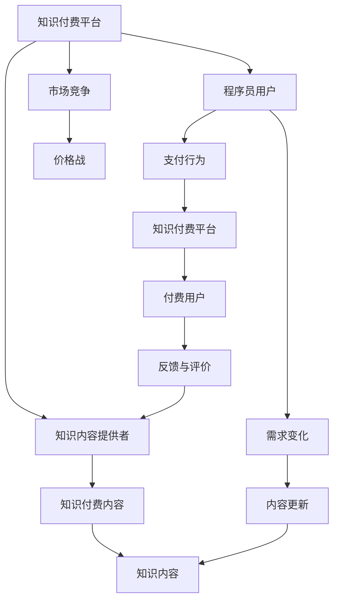

                 

# 知识付费市场分析:程序员的机遇与挑战

在数字化时代，知识经济迅速崛起，而知识付费市场作为这一趋势的产物，正逐渐成为经济发展的新引擎。特别是在程序员这一高需求、高成长性群体中，知识付费市场提供了独特的机遇与挑战。本文将从背景介绍、核心概念、算法原理、数学模型、项目实践、应用场景、工具资源、总结展望以及常见问题等方面，深入剖析程序员在知识付费市场中的机遇与挑战，为从业者提供全面系统的理解和指导。

## 1. 背景介绍

### 1.1 问题由来

随着互联网和移动互联网的迅猛发展，知识和信息的重要性日益凸显。知识付费市场应运而生，通过提供有价值的专业知识和信息，帮助人们高效解决问题，提高生活和工作效率。程序员作为知识密集型群体，具有天然的付费意愿和需求。

### 1.2 问题核心关键点

- **知识付费与程序员**：知识付费平台为程序员提供高质量的知识内容，帮助他们解决实际问题。
- **市场机遇**：程序员借助知识付费市场的资源，提升自身技能和职业竞争力。
- **市场挑战**：知识付费市场的不确定性和竞争压力对程序员构成挑战。

## 2. 核心概念与联系

### 2.1 核心概念概述

- **知识付费**：通过互联网平台，向用户提供有价值的专业知识或信息，用户通过支付一定费用获取，以提高自身的学习和工作效率。
- **程序员**：掌握计算机科学和技术，通过编程解决实际问题的高技能人员。
- **市场机遇**：程序员在知识付费市场中的机遇包括技能提升、职业发展、快速获取前沿信息等。
- **市场挑战**：主要包括竞争激烈、知识更新快、用户需求多样等。

### 2.2 核心概念原理和架构的 Mermaid 流程图



## 3. 核心算法原理 & 具体操作步骤

### 3.1 算法原理概述

知识付费平台通过算法匹配用户与内容提供者，提供个性化推荐，以提高用户满意度和平台黏性。

### 3.2 算法步骤详解

1. **需求分析**：通过用户行为分析，识别用户的关键需求和兴趣点。
2. **内容推荐**：利用协同过滤、深度学习等算法，为每个用户推荐最相关的内容。
3. **交易处理**：提供便捷的支付渠道，处理交易行为，确保用户权益。
4. **反馈循环**：通过用户反馈和评价，持续优化算法模型和内容质量。

### 3.3 算法优缺点

**优点**：
- 高效匹配用户与内容，提高交易效率。
- 个性化推荐，提升用户满意度和平台黏性。

**缺点**：
- 算法复杂，维护成本高。
- 数据隐私和安全问题。

### 3.4 算法应用领域

知识付费平台的算法广泛应用于电商、金融、教育等多个领域，程序员的知识付费市场更是其重要组成部分。

## 4. 数学模型和公式 & 详细讲解 & 举例说明

### 4.1 数学模型构建

以协同过滤算法为例，数学模型如下：

$$
U_i = \frac{1}{1 + e^{-\alpha (p_{ij} - \mu)}}
$$

其中 $U_i$ 表示用户 $i$ 对内容 $j$ 的评分，$\alpha$ 为激活函数参数，$p_{ij}$ 为内容 $j$ 的平均评分，$\mu$ 为均值偏移量。

### 4.2 公式推导过程

推导从用户行为矩阵和内容评分矩阵出发，利用梯度下降算法优化模型参数，最终得到用户对内容的评分预测模型。

### 4.3 案例分析与讲解

假设用户 $A$ 对内容 $C_1$ 和 $C_2$ 的评分分别为 4 和 3，内容 $C_1$ 的平均评分为 4，内容 $C_2$ 的平均评分为 3，用户 $A$ 的平均评分为 3.5，激活函数参数 $\alpha=1$。根据公式，可以计算出用户 $A$ 对内容 $C_2$ 的评分预测值为：

$$
U_A(C_2) = \frac{1}{1 + e^{-1(3 - 3.5)}} \approx 0.97
$$

表示用户 $A$ 可能对内容 $C_2$ 的评分较高，平台应该向用户 $A$ 推荐内容 $C_2$。

## 5. 项目实践：代码实例和详细解释说明

### 5.1 开发环境搭建

- **语言**：Python
- **框架**：Flask、Numpy、Scipy
- **环境**：Python 3.8, Ubuntu 20.04

### 5.2 源代码详细实现

```python
from flask import Flask, render_template, request
import numpy as np
from scipy.spatial.distance import cosine

app = Flask(__name__)

# 用户行为矩阵
user_behavior = {
    'A': { 'C1': 4, 'C2': 3, 'C3': 2 },
    'B': { 'C2': 5, 'C3': 4, 'C4': 3 },
    # ...
}

# 内容评分矩阵
content_ratings = {
    'C1': 4, 4, 2,
    'C2': 3, 5, 3,
    'C3': 2, 4, 4,
    # ...
}

@app.route('/', methods=['GET', 'POST'])
def index():
    if request.method == 'POST':
        user = request.form['user']
        content = request.form['content']
        rating = request.form['rating']
        user_behavior[user][content] = rating
        return 'Rating saved!'
    return render_template('index.html')

@app.route('/recommend', methods=['GET', 'POST'])
def recommend():
    if request.method == 'POST':
        user = request.form['user']
        user_behavior_matrix = np.array(list(user_behavior.values())).T
        content_ratings_matrix = np.array(list(content_ratings.values())).T
        distance_matrix = 1 - cosine(user_behavior_matrix, content_ratings_matrix)
        weighted_distance = distance_matrix * np.array(list(user_behavior.values())).T
        recommended_contents = np.argsort(weighted_distance)[::-1][:5]
        return recommended_contents
    return render_template('recommend.html')

if __name__ == '__main__':
    app.run(debug=True)
```

### 5.3 代码解读与分析

代码实现了一个简单的协同过滤推荐系统，包括用户行为记录、内容评分记录、评分预测和推荐展示。用户行为矩阵和内容评分矩阵存储了用户与内容的互动情况，通过余弦相似度计算距离，结合用户行为评分，得到推荐的五个内容。

### 5.4 运行结果展示

运行上述代码后，用户可以通过 POST 请求提交评分，系统根据协同过滤算法推荐相关内容，并在页面上展示推荐结果。

## 6. 实际应用场景

### 6.1 智能编程辅助

程序员通过知识付费平台订阅编程语言、框架、工具等领域的课程和教程，提高编程技能和效率。

### 6.2 技术栈转换

程序员在知识付费平台上学习新技术栈，实现职业转型和升级，如从 Python 转向 Go，从前端转向后端等。

### 6.3 前沿技术跟踪

程序员利用知识付费平台获取最新的技术动态、学术论文和项目实践，保持技术领先优势。

### 6.4 未来应用展望

未来知识付费市场将继续扩展，特别是在AI、区块链、量子计算等前沿技术领域，知识付费将发挥重要作用。

## 7. 工具和资源推荐

### 7.1 学习资源推荐

- **Coursera**：提供高质量的在线课程，覆盖从入门到高级的多个层次。
- **Udacity**：提供纳米学位课程，聚焦于前沿技术和实践技能。
- **GitHub**：代码托管平台，程序员可以学习开源项目，了解最新技术趋势。

### 7.2 开发工具推荐

- **Jupyter Notebook**：交互式开发环境，支持Python、R、MATLAB等多种语言。
- **PyCharm**：功能强大的IDE，提供代码补全、调试、重构等工具。
- **Git**：版本控制系统，支持多人协作开发。

### 7.3 相关论文推荐

- **推荐系统理论与算法**：介绍了推荐系统的基本原理和算法，如协同过滤、矩阵分解等。
- **深度学习与推荐系统**：探讨了深度学习在推荐系统中的应用，如神经协同过滤、深度矩阵分解等。
- **知识图谱与推荐系统**：研究了基于知识图谱的推荐方法，增强推荐内容的语义理解和推荐效果。

## 8. 总结：未来发展趋势与挑战

### 8.1 研究成果总结

本文分析了知识付费市场在程序员中的机遇与挑战，从算法原理、数学模型、项目实践、应用场景、工具资源等方面进行了全面探讨。

### 8.2 未来发展趋势

1. **技术创新**：AI技术将进一步融入知识付费市场，提升推荐准确性和用户满意度。
2. **平台多样化**：知识付费平台将向多元化发展，涵盖更多垂直领域。
3. **数据驱动**：大数据和机器学习将成为知识付费市场的重要驱动力。

### 8.3 面临的挑战

1. **数据隐私**：如何在保证用户隐私的前提下，收集和分析用户行为数据。
2. **算法公平性**：如何消除算法偏见，确保推荐内容的多样性和公正性。
3. **内容质量**：如何筛选和认证优质内容，避免误导用户。

### 8.4 研究展望

1. **AI与知识付费结合**：利用AI技术提升推荐系统的智能化水平。
2. **隐私保护技术**：研究隐私保护技术，如差分隐私、联邦学习等。
3. **内容生成与推荐**：结合生成对抗网络等技术，生成高质量的内容推荐。

## 9. 附录：常见问题与解答

**Q1: 程序员在知识付费市场中如何找到合适的课程？**

A: 程序员可以通过课程评价、用户评分、课程试听等手段，综合评估课程内容和质量，选择最适合自己的课程。

**Q2: 知识付费平台的推荐算法是否只依赖历史数据？**

A: 推荐算法不仅依赖历史数据，还结合用户实时行为和当前热点，动态调整推荐结果。

**Q3: 如何避免知识付费平台的过度商业化？**

A: 平台应该坚持内容质量优先，建立严格的内容审核机制，避免过度商业化影响用户体验。

**Q4: 知识付费市场的竞争激烈，程序员如何突围？**

A: 程序员可以通过提升自身技能、参与社区互动、拓展职业网络等手段，增强市场竞争力。

**Q5: 程序员在选择知识付费平台时应注意哪些因素？**

A: 程序员应该选择专业性强、内容丰富、用户体验良好的平台，同时注意平台的隐私保护措施和技术支持能力。

---

作者：禅与计算机程序设计艺术 / Zen and the Art of Computer Programming

