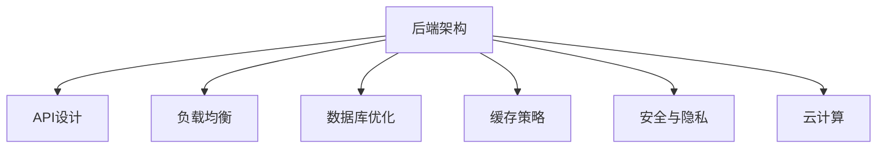

                 

# 知识付费平台的后端架构设计

> 关键词：知识付费, 后端架构, API设计, 负载均衡, 数据库优化, 缓存策略, 安全与隐私, 云计算

## 1. 背景介绍

### 1.1 问题由来
随着互联网和智能设备的普及，知识付费已经成为了信息时代的重要趋势。用户对于高质量知识和服务的追求，推动了知识付费平台的快速发展。然而，一个成功的知识付费平台不仅仅依赖于优质的内容和服务，还需要一个高效、稳定、可扩展的后端架构来支撑。

### 1.2 问题核心关键点
知识付费平台后端架构的设计需要考虑以下几个关键点：
- **性能与可靠性**：保证平台的响应时间和稳定性，提高用户体验。
- **可扩展性**：系统能够支撑大量的用户访问和复杂的业务逻辑。
- **数据安全与隐私**：保障用户数据和交易信息的安全，符合相关法律法规。
- **可维护性**：系统架构清晰，便于未来的维护和迭代。

本文将从这些关键点出发，探讨知识付费平台后端架构的设计思路和具体实现。

## 2. 核心概念与联系

### 2.1 核心概念概述

为了更好地理解知识付费平台后端架构的设计，本节将介绍几个密切相关的核心概念：

- **后端架构**：后端架构通常指的是应用程序的后端系统，包括服务器、数据库、消息队列、缓存、API接口等组件，是支持前端和用户交互的核心部分。
- **API设计**：API是后端架构与前端、移动端进行数据交互的接口，良好的API设计能够提高系统复用性、安全性和扩展性。
- **负载均衡**：通过将请求分发到多个服务器上，避免单点故障，提高系统的响应速度和稳定性。
- **数据库优化**：通过索引、分库分表、读写分离等手段，提升数据库的读写性能，减少延迟。
- **缓存策略**：通过将频繁访问的数据缓存到快速访问的存储中，减少数据库的访问次数，提高系统的响应速度。
- **安全与隐私**：包括数据加密、访问控制、隐私保护等，确保用户数据的安全和隐私。
- **云计算**：利用云服务提供的基础设施和工具，实现系统的高可用性、弹性扩展和成本控制。

这些核心概念之间的逻辑关系可以通过以下Mermaid流程图来展示：



这个流程图展示了她們之间的逻辑关系：后端架构包含API设计、负载均衡、数据库优化、缓存策略、安全与隐私和云计算等子概念，它们共同构成了知识付费平台后端架构的完整图景。

## 3. 核心算法原理 & 具体操作步骤
### 3.1 算法原理概述

知识付费平台后端架构的设计主要遵循以下算法原理：

- **模块化设计**：将系统划分为多个模块，每个模块负责单一的功能，以便于管理和扩展。
- **异步处理**：通过异步处理技术，将长时间运行的任务从主线程中分离出来，提高系统的响应速度和吞吐量。
- **事件驱动**：采用事件驱动架构，使系统能够高效地处理并发请求和高频率的操作。
- **微服务架构**：将系统划分为多个独立运行的微服务，每个微服务只负责单一的业务功能，以提高系统的可扩展性和可用性。

### 3.2 算法步骤详解

基于以上算法原理，知识付费平台后端架构的设计步骤可以分为以下几个阶段：

**Step 1: 架构规划**
- 确定系统的功能需求和业务场景，划分为多个模块。
- 选择合适的技术栈和框架，如Django、Flask、Spring Boot等，以及数据库、缓存、消息队列等组件。
- 设计系统的整体架构，包括API设计、数据库设计、缓存策略、负载均衡等。

**Step 2: 环境搭建**
- 安装和配置操作系统、数据库、缓存、消息队列等组件。
- 搭建开发环境和测试环境，保证系统的可测试性。
- 配置自动化构建和部署工具，如Docker、Jenkins、Kubernetes等。

**Step 3: 模块开发**
- 开发模块的基础功能，实现数据的增删改查。
- 实现API接口，保证数据的安全性和可靠性。
- 实现负载均衡和缓存策略，提升系统的性能和可用性。

**Step 4: 系统集成**
- 将各个模块进行集成，确保系统功能的完整性和一致性。
- 实现系统的高可用性和扩展性，如故障转移、数据备份、弹性扩展等。
- 进行系统测试和性能优化，确保系统的稳定性和可靠性。

**Step 5: 部署上线**
- 将系统部署到生产环境，进行持续集成和持续部署（CI/CD）。
- 监控系统运行状态，及时发现和解决问题。
- 根据业务需求和用户反馈，进行迭代和优化。

### 3.3 算法优缺点

知识付费平台后端架构的设计遵循上述算法原理，具有以下优点：
- **模块化**：各个模块相对独立，便于维护和扩展。
- **异步处理**：提高了系统的响应速度和并发处理能力。
- **事件驱动**：灵活处理各种事件，提高了系统的可扩展性和弹性。
- **微服务架构**：提高了系统的独立性、可扩展性和可用性。

同时，也存在一些缺点：
- **复杂性增加**：系统由多个模块和组件组成，增加了设计和维护的复杂度。
- **性能瓶颈**：负载均衡和缓存策略需要精心设计，否则可能成为系统的性能瓶颈。
- **安全风险**：各个模块和组件之间的通信接口需要严格的安全控制，防止攻击和数据泄露。
- **成本高昂**：云服务的使用成本较高，需要合理规划和控制。

尽管如此，现代后端架构的设计理念仍然是基于以上算法原理，通过合理的设计和实践，可以最大化地发挥其优势，克服其不足。

### 3.4 算法应用领域

知识付费平台后端架构的设计具有广泛的应用领域，包括但不限于以下几个方面：

- **在线教育平台**：为在线课程的发布、订阅、学习提供支持。
- **企业培训系统**：为企业的员工培训提供支持，包括课程推荐、学习进度管理等。
- **在线医疗咨询**：为医生和患者提供在线咨询服务，包括问答、诊断等。
- **金融理财平台**：为金融产品推荐、理财规划提供支持。
- **旅游景区导览**：为旅游者提供导览、讲解、预订等支持。

## 4. 数学模型和公式 & 详细讲解 & 举例说明
### 4.1 数学模型构建

知识付费平台后端架构的数学模型主要涉及以下几个方面：

- **负载均衡模型**：负载均衡算法需要优化，如轮询、加权轮询、随机、最小连接数等算法。
- **数据库优化模型**：包括索引优化、分库分表、读写分离等策略。
- **缓存策略模型**：包括缓存失效策略、缓存淘汰算法等。
- **安全与隐私模型**：包括数据加密、访问控制、隐私保护等。
- **云计算模型**：包括资源规划、弹性扩展、成本控制等。

### 4.2 公式推导过程

以负载均衡算法为例，假设系统的请求数随时间变化，使用轮询算法（Round Robin）进行负载均衡：

- 定义 $n$ 个服务器，每个服务器的处理能力为 $c_i$。
- 定义每个请求的处理时间为 $t_i$，$1 \leq i \leq n$。
- 定义系统的总请求数为 $N$，单位时间内的请求数为 $R$。
- 定义系统当前的处理能力为 $C$，初始值为系统总处理能力 $Nc$。

轮询算法的负载均衡公式为：

$$
C_{t+1} = C_t + \frac{t_i}{R} - \frac{C_t}{R}
$$

其中 $C_t$ 表示当前时间 $t$ 的处理能力，$t_i$ 表示当前时间 $t$ 内到达请求的时间，$R$ 表示单位时间内的请求数。

### 4.3 案例分析与讲解

以一个典型的在线教育平台为例，其负载均衡模型可以分为以下几个步骤：

1. **请求到达**：用户访问平台，请求被路由到负载均衡器。
2. **负载均衡器决策**：负载均衡器根据轮询算法决定请求的下一个目标服务器。
3. **请求处理**：目标服务器接收请求，处理后返回响应。
4. **响应返回**：负载均衡器将响应返回给用户。

当系统负载增加时，可以通过调整轮询算法参数或增加服务器数量来优化系统性能。例如，使用加权轮询算法，根据服务器的处理能力，为不同的服务器分配不同的权重。

## 5. 项目实践：代码实例和详细解释说明
### 5.1 开发环境搭建

以下是基于Python的Flask框架搭建知识付费平台后端架构的示例：

```python
from flask import Flask
app = Flask(__name__)

@app.route('/')
def home():
    return 'Hello, World!'
```

### 5.2 源代码详细实现

以下是一个典型的API接口实现，用于获取用户信息：

```python
from flask import Flask, request, jsonify
app = Flask(__name__)

@app.route('/user', methods=['GET'])
def get_user_info():
    user_id = request.args.get('user_id')
    user_info = get_user_info_from_database(user_id)
    return jsonify(user_info)

def get_user_info_from_database(user_id):
    # 从数据库中获取用户信息
    # ...
    return user_info
```

### 5.3 代码解读与分析

**Flask框架**：Flask是一个轻量级的Python Web框架，易于使用和扩展。在上述代码中，我们使用Flask定义了一个API接口，用于获取用户信息。

**请求处理**：通过`request`对象获取请求参数，使用`jsonify`函数将结果转换为JSON格式返回。

**数据库操作**：使用`get_user_info_from_database`函数从数据库中获取用户信息，这部分操作需要根据具体的数据库实现方式进行修改。

**性能优化**：可以使用缓存技术，如Redis或Memcached，将 frequently accessed data cache into the memory to improve the system's performance.

### 5.4 运行结果展示

运行上述代码后，可以在浏览器中访问`http://127.0.0.1:5000/user?user_id=123`获取用户信息。

## 6. 实际应用场景
### 6.1 智能教育平台

智能教育平台的后端架构设计需要考虑以下几个方面：

- **学习管理**：包括课程发布、订阅、学习进度管理等功能。
- **推荐系统**：根据学生的学习行为和历史数据，推荐合适的课程和学习资源。
- **实时互动**：包括在线课堂、实时问答等功能，保障教学互动的及时性和高效性。
- **数据统计**：对学生的学习行为、课程效果等进行统计和分析，为教学优化提供数据支持。

### 6.2 金融理财平台

金融理财平台的后端架构设计需要考虑以下几个方面：

- **产品推荐**：根据用户的财务状况和偏好，推荐合适的理财产品和理财方案。
- **风险控制**：对用户的投资行为进行风险评估和控制，保障用户资金安全。
- **交易系统**：保障金融交易的实时性和可靠性，支持多用户并发交易。
- **数据安全**：保护用户金融信息的安全，防止数据泄露和篡改。

### 6.3 在线医疗咨询

在线医疗咨询平台的后端架构设计需要考虑以下几个方面：

- **医生管理**：包括医生的注册、登录、在线问答等功能。
- **患者管理**：包括患者的注册、登录、在线咨询等功能。
- **数据存储**：保障医疗数据的安全性和隐私性，符合相关法律法规。
- **服务质量**：保障医疗服务的及时性和准确性，提升用户满意度。

## 7. 工具和资源推荐
### 7.1 学习资源推荐

为了帮助开发者系统掌握知识付费平台后端架构的设计，这里推荐一些优质的学习资源：

1. **Flask官方文档**：Flask框架的官方文档，详细介绍了Flask的各个组件和API的使用方法。
2. **Django官方文档**：Django框架的官方文档，提供了丰富的案例和示例。
3. **Spring Boot官方文档**：Spring Boot框架的官方文档，涵盖了Spring Boot的各个组件和API的使用方法。
4. **Docker官方文档**：Docker容器化技术的官方文档，提供了详细的部署和配置方法。
5. **Kubernetes官方文档**：Kubernetes容器编排平台的官方文档，提供了详细的部署和配置方法。

### 7.2 开发工具推荐

高效的开发离不开优秀的工具支持。以下是几款用于知识付费平台后端架构开发的常用工具：

1. **Flask框架**：轻量级的Python Web框架，易于使用和扩展。
2. **Django框架**：强大的Python Web框架，适用于大型Web应用。
3. **Spring Boot框架**：基于Spring框架的快速开发框架，适用于Java应用。
4. **Redis**：高性能的内存数据库，适用于缓存和高性能数据访问。
5. **Memcached**：高性能的内存缓存系统，适用于缓存和数据存储。
6. **Elasticsearch**：高性能的分布式搜索和分析引擎，适用于大数据处理。
7. **RabbitMQ**：高性能的消息队列，适用于异步处理和消息传递。

### 7.3 相关论文推荐

知识付费平台后端架构的设计源于学界的持续研究。以下是几篇奠基性的相关论文，推荐阅读：

1. **Design Patterns for Large Scale High Performance Web Applications**：探讨了大型高并发Web应用的设计模式，如事件驱动、异步处理、微服务等。
2. **Load Balancing Techniques for Large Scale Web Applications**：介绍了多种负载均衡算法，如轮询、加权轮询、随机等。
3. **Database Performance Optimization for Large Scale Web Applications**：介绍了数据库优化的多种策略，如索引优化、分库分表、读写分离等。
4. **Cache Strategy Design for Large Scale Web Applications**：介绍了缓存策略的设计和实现方法，如缓存失效策略、缓存淘汰算法等。
5. **Security and Privacy Protection for Large Scale Web Applications**：介绍了数据安全和隐私保护的多项技术和策略，如数据加密、访问控制、隐私保护等。

## 8. 总结：未来发展趋势与挑战
### 8.1 研究成果总结

本文对知识付费平台后端架构的设计进行了全面系统的介绍。首先阐述了知识付费平台后端架构的设计思路和核心概念，明确了后端架构设计需要考虑的性能与可靠性、可扩展性、数据安全与隐私、可维护性等因素。其次，从算法原理和具体操作步骤的视角，详细讲解了后端架构的实现方法。最后，结合实际应用场景，探讨了知识付费平台后端架构的设计思路和具体实现。

通过本文的系统梳理，可以看到，知识付费平台后端架构设计不仅需要考虑前端用户体验，还需要兼顾系统性能、安全性和扩展性。只有从数据、算法、工程、业务等多个维度协同发力，才能真正实现知识付费平台的稳定运行和高质量服务。

### 8.2 未来发展趋势

展望未来，知识付费平台后端架构的设计将呈现以下几个发展趋势：

1. **云计算的广泛应用**：云计算技术的应用将使知识付费平台的扩展性和弹性大幅提升，降低运营成本。
2. **微服务的普及**：微服务架构的普及将使知识付费平台更加模块化和可扩展，便于维护和升级。
3. **分布式数据库的采用**：分布式数据库的采用将使知识付费平台能够处理更大量的数据，提升系统的读写性能。
4. **缓存技术的优化**：缓存技术的应用将使知识付费平台能够更好地应对高并发请求，提升系统的响应速度。
5. **安全与隐私保护**：安全与隐私保护技术的应用将使知识付费平台更加安全可靠，保障用户数据的安全和隐私。
6. **实时数据处理**：实时数据处理技术的应用将使知识付费平台能够更好地支持实时互动和数据分析。

### 8.3 面临的挑战

尽管知识付费平台后端架构的设计已经取得了不少成果，但在迈向更加智能化、普适化应用的过程中，它仍面临着诸多挑战：

1. **性能瓶颈**：负载均衡和缓存策略需要精心设计，否则可能成为系统的性能瓶颈。
2. **安全风险**：各个模块和组件之间的通信接口需要严格的安全控制，防止攻击和数据泄露。
3. **成本高昂**：云服务的使用成本较高，需要合理规划和控制。
4. **技术复杂**：后端架构涉及多种技术栈和组件，增加了设计和维护的复杂度。

尽管如此，现代后端架构的设计理念仍然是基于以上算法原理，通过合理的设计和实践，可以最大化地发挥其优势，克服其不足。

### 8.4 研究展望

面向未来，知识付费平台后端架构的研究需要在以下几个方面寻求新的突破：

1. **云计算的优化**：优化云计算资源的规划和调度，提高系统的弹性扩展能力和成本控制。
2. **微服务的优化**：优化微服务架构的设计和部署，提高系统的模块化和可扩展性。
3. **分布式数据库的优化**：优化分布式数据库的设计和优化，提高系统的读写性能和数据一致性。
4. **缓存技术的优化**：优化缓存策略的设计和实现，提高系统的响应速度和并发处理能力。
5. **安全与隐私保护的优化**：优化数据安全和隐私保护技术的设计和实现，提高系统的安全性和可靠性。
6. **实时数据处理的优化**：优化实时数据处理技术的设计和实现，提高系统的实时性和分析能力。

这些研究方向的探索，必将引领知识付费平台后端架构技术迈向更高的台阶，为知识付费平台的稳定运行和高质量服务提供坚实的技术保障。

## 9. 附录：常见问题与解答
**Q1：知识付费平台后端架构的设计需要考虑哪些关键因素？**

A: 知识付费平台后端架构的设计需要考虑以下几个关键因素：
- **性能与可靠性**：保证平台的响应时间和稳定性，提高用户体验。
- **可扩展性**：系统能够支撑大量的用户访问和复杂的业务逻辑。
- **数据安全与隐私**：保障用户数据和交易信息的安全，符合相关法律法规。
- **可维护性**：系统架构清晰，便于未来的维护和迭代。

**Q2：负载均衡算法的实现有哪些？**

A: 负载均衡算法有多种实现方式，包括：
- **轮询算法**：按顺序轮流分配请求，实现简单。
- **加权轮询算法**：根据服务器的处理能力，为不同的服务器分配不同的权重。
- **随机算法**：随机选择服务器，避免某些服务器过载。
- **最少连接数算法**：选择连接数最少的服务器处理请求。

**Q3：数据库优化有哪些策略？**

A: 数据库优化的策略包括：
- **索引优化**：合理设计索引，提高查询效率。
- **分库分表**：将数据分散存储，提高系统的读写性能。
- **读写分离**：将读操作和写操作分离，提高系统的并发处理能力。

**Q4：如何保障知识付费平台的数据安全与隐私？**

A: 保障知识付费平台的数据安全与隐私需要采取以下措施：
- **数据加密**：对敏感数据进行加密存储和传输。
- **访问控制**：设置严格的访问控制策略，防止非法访问。
- **隐私保护**：采用隐私保护技术，如差分隐私、联邦学习等。

**Q5：知识付费平台的后端架构设计需要哪些核心组件？**

A: 知识付费平台的后端架构设计需要以下核心组件：
- **API设计**：用于系统组件之间的数据交互。
- **负载均衡**：保证系统的响应速度和稳定性。
- **数据库优化**：提升系统的读写性能。
- **缓存策略**：提高系统的响应速度。
- **安全与隐私保护**：保障用户数据的安全和隐私。
- **云计算**：实现系统的弹性扩展和成本控制。

---

作者：禅与计算机程序设计艺术 / Zen and the Art of Computer Programming

