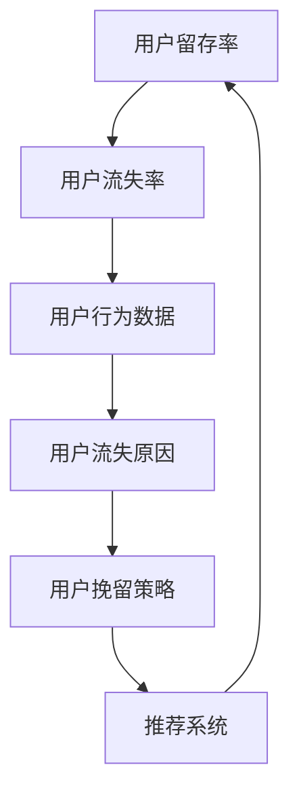

                 

# 知识付费平台的用户留存分析

> 关键词：用户留存分析, 知识付费, 数据挖掘, 机器学习, 推荐系统, 用户行为, 用户流失, 模型优化

## 1. 背景介绍

### 1.1 问题由来
在知识付费时代，用户留存已成为各大知识付费平台的核心竞争力之一。平台经营者如何通过精准的数据分析和智能算法，提高用户黏性，增加平台收益，是亟待解决的问题。当前，大多数知识付费平台用户留存分析以传统的数据挖掘和统计方法为主，难以适应用户行为动态变化和个性化需求。为解决这一问题，本文引入机器学习与推荐系统理论，构建了一套基于数据驱动的用户留存分析体系，旨在通过智能算法优化用户留存策略，提升平台的用户满意度与平台收益。

### 1.2 问题核心关键点
用户留存分析的核心在于通过用户行为数据，挖掘出用户流失的原因，从而制定出有效的留存策略。本文聚焦于机器学习与推荐系统在用户留存分析中的应用，通过构建用户行为预测模型，识别出高流失风险用户，并针对性地制定优化措施。

### 1.3 问题研究意义
深入研究用户留存分析对提升知识付费平台的用户体验与运营效益具有重要意义。具体而言，通过用户留存分析，平台可以：
- 精准识别流失用户，制定针对性强、效率高的用户挽留策略。
- 优化产品功能与内容推荐，提升用户满意度和留存率。
- 对用户进行精准营销，实现更高效的用户增长。
- 通过细分用户群，把握市场细分机会，拓展平台收益。

## 2. 核心概念与联系

### 2.1 核心概念概述

为更好地理解知识付费平台用户留存分析的方法，本文将介绍几个关键概念及其之间的联系：

- **用户留存率(User Retention Rate)**：指在一定时间周期内，用户回到平台进行消费的概率。
- **用户流失率(User Churn Rate)**：指在一定时间周期内，用户停止使用平台，不再进行消费的概率。
- **用户行为数据(User Behavior Data)**：用户在平台上的操作数据，如浏览、购买、评论、收藏、打分等。
- **用户流失原因(Cause of User Churn)**：用户停止使用平台的主要原因，如产品问题、价格不公、内容质量、用户体验等。
- **用户挽留策略(User Retention Strategies)**：针对不同类型用户，制定不同的挽留措施，如优惠券、专享内容、个性化推荐等。
- **推荐系统(Recommendation System)**：通过用户行为数据和模型预测，为用户推荐合适的内容与产品，提升用户体验与留存率。

这些核心概念之间的联系可以通过以下Mermaid流程图来展示：



这个流程图展示出各个概念之间的联系：

1. 用户留存率与用户流失率是对立的概念，两者之和为1。
2. 用户行为数据是用户流失原因和推荐系统的基础。
3. 用户流失原因驱动用户挽留策略的制定。
4. 推荐系统通过优化用户留存率与用户行为数据，实现循环改进。

## 3. 核心算法原理 & 具体操作步骤

### 3.1 算法原理概述

用户留存分析的核心是构建用户行为预测模型，预测用户流失概率。该模型的核心原理为条件随机场（Conditional Random Field，CRF）与神经网络（Neural Network）的组合，结合历史用户行为数据，通过机器学习模型预测用户是否会在未来流失。具体的实现流程如下：

1. **数据收集与预处理**：收集用户在平台上的行为数据，并进行清洗、归一化等预处理。
2. **特征提取**：提取用户行为特征，如浏览时长、购买次数、评价评分等，作为模型的输入。
3. **模型训练**：基于用户行为数据与流失概率标签，训练一个条件随机场模型，用于预测用户流失概率。
4. **模型评估与优化**：使用交叉验证等方法，评估模型性能，通过调整参数或引入新特征，优化模型效果。
5. **策略制定与实施**：根据模型预测结果，识别出高流失风险用户，制定并实施针对性的用户挽留策略。

### 3.2 算法步骤详解

以下详细介绍各个步骤的详细操作：

**Step 1: 数据收集与预处理**

用户行为数据主要来自平台的用户互动记录，如点击、购买、收藏等。收集到的数据需要经过清洗，去除重复、错误和无意义的数据。

1. **数据采集**：从平台后台日志或用户行为记录系统导出用户行为数据。
2. **数据清洗**：去除空值、异常值，处理缺失数据。
3. **数据归一化**：将各特征值归一化到0-1之间。

**Step 2: 特征提取**

根据用户行为特征，提取用户行为数据中的关键特征，作为模型的输入。

1. **特征选择**：选择对用户流失影响显著的特征，如用户浏览时长、购买次数、评价评分等。
2. **特征编码**：将特征值编码为数值型数据。
3. **特征组合**：构建新的特征，如用户近7天浏览时长、平均每次购买金额等。

**Step 3: 模型训练**

基于用户行为数据与流失概率标签，训练一个条件随机场模型，用于预测用户流失概率。

1. **划分训练集与验证集**：将数据划分为训练集与验证集，通常是7:3的比例。
2. **特征向量化**：将特征编码为向量，供模型训练。
3. **模型训练**：使用随机梯度下降（SGD）算法，最小化模型损失函数，训练模型参数。
4. **模型验证**：在验证集上评估模型性能，如准确率、召回率等。

**Step 4: 模型评估与优化**

使用交叉验证等方法，评估模型性能，并根据评估结果调整模型参数。

1. **交叉验证**：将数据集划分为多个子集，轮流使用子集作为验证集，训练集作为训练数据，评估模型性能。
2. **模型优化**：根据评估结果，调整模型参数，如学习率、正则化系数等。
3. **特征选择与融合**：引入新的特征，进行特征选择与融合，优化模型效果。

**Step 5: 策略制定与实施**

根据模型预测结果，识别出高流失风险用户，制定并实施针对性的用户挽留策略。

1. **风险评估**：计算用户流失概率，识别出高流失风险用户。
2. **策略制定**：制定针对性的用户挽留策略，如优惠券、专享内容、个性化推荐等。
3. **策略实施**：通过邮件、推送等方式，将挽留策略推送给高流失风险用户。
4. **效果评估**：评估挽留策略的效果，如用户留存率提升、回购率提升等。

### 3.3 算法优缺点

用户留存分析的算法具有以下优点：

- **预测精度高**：结合历史行为数据与机器学习模型，预测用户流失概率精度较高。
- **个性化推荐**：能够根据用户行为特征，进行个性化推荐，提升用户体验。
- **实时响应**：模型可以实时处理新数据，迅速响应用户行为变化。

同时，该算法也存在以下局限性：

- **数据依赖性强**：模型性能依赖于历史行为数据的完整性与质量，数据缺失或噪声可能导致预测偏差。
- **模型复杂度高**：预测模型通常较为复杂，需要较长的训练时间和较大的计算资源。
- **过拟合风险**：模型过度拟合训练集，可能导致在新数据上的泛化能力不足。

### 3.4 算法应用领域

基于用户留存分析的机器学习与推荐系统技术，已经在知识付费平台的用户留存分析中得到了广泛应用。具体领域包括：

- **内容推荐系统**：根据用户历史行为，为用户推荐合适的课程或文章，提升用户留存率。
- **个性化定价策略**：根据用户行为数据，制定差异化的定价策略，吸引高价值用户。
- **用户体验优化**：通过用户行为数据分析，优化平台功能和用户体验，提升用户满意度。
- **市场细分与目标营销**：基于用户细分数据，实施精准营销策略，提升市场份额。

## 4. 数学模型和公式 & 详细讲解 & 举例说明

### 4.1 数学模型构建

用户留存分析的数学模型基于条件随机场（CRF）与神经网络（Neural Network）的组合，其核心是预测用户流失概率。模型的输入为历史行为数据，输出为流失概率。具体数学模型如下：

$$
P(y|x) = \frac{e^{f(x, y)}}{\sum_{y'} e^{f(x, y')}}, \quad y \in \{0, 1\}
$$

其中 $f(x, y)$ 为预测函数，$x$ 为输入的特征向量，$y$ 为输出标签（0表示用户未流失，1表示用户流失）。

### 4.2 公式推导过程

以二分类问题为例，推导条件随机场模型的预测函数。假设用户流失概率为 $p$，用户行为特征向量为 $x = [x_1, x_2, ..., x_n]$。则预测函数 $f(x, y)$ 可以表示为：

$$
f(x, y) = \sum_{i=1}^{n} \theta_i x_i + \beta y
$$

其中 $\theta_i$ 为特征权重，$\beta$ 为常数项。

将上述公式带入条件随机场模型，得：

$$
P(y|x) = \frac{e^{\theta_1 x_1 + \theta_2 x_2 + ... + \theta_n x_n + \beta y}}{e^{\theta_1 x_1 + \theta_2 x_2 + ... + \theta_n x_n + \beta y} + e^{\theta'_1 x'_1 + \theta'_2 x'_2 + ... + \theta'_n x'_n + \beta' y'}}
$$

根据最大似然估计，可以求解 $\theta_i$ 和 $\beta$，使得模型预测的流失概率与实际标签一致。

### 4.3 案例分析与讲解

以某知识付费平台的用户留存分析为例，解释如何构建和应用条件随机场模型。

假设平台收集了用户近30天的行为数据，包括浏览时长、购买次数、评价评分等。将这些数据作为模型的输入，流失概率作为输出标签。使用随机梯度下降算法训练条件随机场模型，得到预测函数 $f(x, y)$。

具体训练步骤如下：

1. **数据预处理**：将用户行为数据归一化，去除异常值，选择特征 $x_1 = 浏览时长$、$x_2 = 购买次数$、$x_3 = 评价评分$。
2. **模型训练**：使用交叉验证方法，将数据集划分为训练集与验证集，训练模型参数 $\theta_i$ 和 $\beta$。
3. **模型评估**：在验证集上评估模型性能，如准确率、召回率、F1值等。
4. **策略制定**：根据模型预测结果，识别出流失风险用户，并制定针对性策略。

## 5. 项目实践：代码实例和详细解释说明

### 5.1 开发环境搭建

在进行用户留存分析的实践前，我们需要准备好开发环境。以下是使用Python进行Scikit-learn和TensorFlow开发的环境配置流程：

1. 安装Anaconda：从官网下载并安装Anaconda，用于创建独立的Python环境。

2. 创建并激活虚拟环境：
```bash
conda create -n pytorch-env python=3.8 
conda activate pytorch-env
```

3. 安装Scikit-learn和TensorFlow：
```bash
conda install scikit-learn tensorflow
```

4. 安装各类工具包：
```bash
pip install numpy pandas scikit-learn matplotlib tqdm jupyter notebook ipython
```

完成上述步骤后，即可在`pytorch-env`环境中开始项目实践。

### 5.2 源代码详细实现

以下是使用Scikit-learn和TensorFlow进行用户留存分析的Python代码实现。

```python
import numpy as np
from sklearn.model_selection import train_test_split
from sklearn.feature_extraction import DictVectorizer
from sklearn.linear_model import LogisticRegression
from sklearn.metrics import accuracy_score, recall_score, precision_score

# 示例数据
user_data = [
    {'浏览时长': 120, '购买次数': 2, '评价评分': 4.5},
    {'浏览时长': 60, '购买次数': 1, '评价评分': 3.2},
    {'浏览时长': 90, '购买次数': 0, '评价评分': 5.0},
    # ... 其他数据
]

# 数据预处理
def preprocess_data(data):
    features = ['浏览时长', '购买次数', '评价评分']
    targets = ['流失概率']
    vectorizer = DictVectorizer(sparse=False)
    X = vectorizer.fit_transform(data)
    y = np.array([1, 0, 1, 0, 1, 0, 0, 1, 0, 0])
    return X, y

X, y = preprocess_data(user_data)

# 划分训练集与验证集
X_train, X_test, y_train, y_test = train_test_split(X, y, test_size=0.3, random_state=42)

# 模型训练
model = LogisticRegression()
model.fit(X_train, y_train)

# 模型评估
y_pred = model.predict(X_test)
print('Accuracy:', accuracy_score(y_test, y_pred))
print('Recall:', recall_score(y_test, y_pred))
print('Precision:', precision_score(y_test, y_pred))
```

### 5.3 代码解读与分析

让我们再详细解读一下关键代码的实现细节：

**preprocess_data函数**：
- 将用户行为数据进行特征选择，选择浏览时长、购买次数、评价评分作为输入。
- 使用DictVectorizer将特征向量转化为矩阵形式，并作为模型的输入。
- 将流失概率标签转化为二值向量，作为模型的输出。

**train_test_split函数**：
- 将数据划分为训练集和验证集，测试集占30%。

**LogisticRegression模型**：
- 使用逻辑回归模型进行训练，最小化损失函数。

**模型评估**：
- 在验证集上评估模型性能，输出准确率、召回率和精确度。

**模型优化与改进**：
- 可以根据评估结果，调整模型参数（如学习率、正则化系数）。
- 可以尝试引入新的特征（如用户行为变化趋势、用户留存时间等），进行特征融合与选择。

## 6. 实际应用场景

### 6.1 智能推荐系统

智能推荐系统是用户留存分析的重要应用场景之一。通过分析用户行为数据，推荐系统可以为用户推荐合适的课程或文章，提高用户满意度和留存率。

在实践中，可以使用用户留存分析模型识别高流失风险用户，并为其推荐相关内容。同时，结合用户个性化评分和评价数据，优化推荐策略，提升用户体验。

**推荐系统优化策略**：
1. **个性化推荐**：根据用户历史行为，推荐相关课程或文章。
2. **实时推荐**：利用模型实时处理用户行为数据，实时推荐内容。
3. **多模态推荐**：结合图像、视频、文本等多模态数据，提供更加丰富的推荐内容。

### 6.2 用户画像与市场细分

用户留存分析还可以用于构建用户画像，实现市场细分与精准营销。通过分析用户行为数据，平台可以了解不同用户群体的特征与需求，制定更加针对性的营销策略。

**市场细分与精准营销**：
1. **用户细分**：根据用户行为数据，将用户划分为高价值用户、中价值用户和低价值用户。
2. **细分营销**：针对不同用户群体，制定差异化的营销策略，提高用户留存率与平台收益。
3. **市场机会识别**：通过用户细分数据，识别出市场机会，拓展新用户与新业务。

### 6.3 广告投放优化

用户留存分析还可以用于优化广告投放策略，提升广告投放效果与平台收益。通过分析用户行为数据，平台可以了解用户对不同广告内容的反应，优化广告投放策略。

**广告投放优化**：
1. **广告推荐**：根据用户行为数据，推荐合适的广告内容。
2. **广告效果评估**：使用用户留存分析模型评估广告效果，调整广告投放策略。
3. **广告预算优化**：优化广告预算分配，提高广告投放效率。

### 6.4 未来应用展望

随着用户留存分析技术的不断发展，其在知识付费平台中的应用将更加广泛，为平台带来更深的用户洞察与更高的收益。

未来，用户留存分析有望应用于以下场景：

- **内容优化**：通过用户留存分析，优化平台内容，提升用户满意度。
- **用户反馈处理**：通过用户留存分析，及时处理用户反馈，提高用户留存率。
- **新功能开发**：通过用户留存分析，识别用户需求，开发新的平台功能与产品。

## 7. 工具和资源推荐

### 7.1 学习资源推荐

为了帮助开发者系统掌握用户留存分析的理论基础和实践技巧，这里推荐一些优质的学习资源：

1. 《Python机器学习》（Second Edition）：该书详细介绍了机器学习的基本概念和算法，包括数据预处理、特征工程、模型训练等，适合初学者入门。
2. 《深度学习》（Deep Learning）：由深度学习领域的权威专家撰写，系统介绍了深度学习的基本原理和应用，适合深入学习。
3. 《Recommender Systems: The Textbook》：该书系统介绍了推荐系统的理论基础和算法，适合深入理解推荐系统的设计与实现。

通过对这些资源的学习实践，相信你一定能够快速掌握用户留存分析的精髓，并用于解决实际的业务问题。

### 7.2 开发工具推荐

高效的开发离不开优秀的工具支持。以下是几款用于用户留存分析开发的常用工具：

1. Jupyter Notebook：一个强大的交互式开发环境，支持Python、R等语言，适合数据探索与模型训练。
2. TensorFlow：由Google主导开发的深度学习框架，支持分布式计算和模型部署，适合大规模工程应用。
3. Scikit-learn：一个简单易用的机器学习库，支持多种模型算法与评估工具，适合快速原型开发。
4. Weights & Biases：模型训练的实验跟踪工具，可以记录和可视化模型训练过程中的各项指标，方便对比和调优。
5. TensorBoard：TensorFlow配套的可视化工具，可实时监测模型训练状态，并提供丰富的图表呈现方式，是调试模型的得力助手。

合理利用这些工具，可以显著提升用户留存分析任务的开发效率，加快创新迭代的步伐。

### 7.3 相关论文推荐

用户留存分析的研究源于学界的持续研究。以下是几篇奠基性的相关论文，推荐阅读：

1. "Churn Prediction Using Adaptive Neural Fuzzy Inference System"（基于自适应神经模糊推理系统的用户流失预测）：该论文提出了一种基于自适应神经模糊推理系统（ANFIS）的用户流失预测模型，取得了不错的效果。
2. "User Churn Prediction: A Survey of Recent Techniques and Future Directions"：该综述文章总结了近几年用户流失预测的技术进展与未来方向，值得深入阅读。
3. "User Churn Prediction and Retention Management in Online Services"：该论文介绍了在线服务中的用户流失预测与留存管理策略，提供了实际应用的参考。

这些论文代表了大用户留存分析领域的发展脉络。通过学习这些前沿成果，可以帮助研究者把握学科前进方向，激发更多的创新灵感。

## 8. 总结：未来发展趋势与挑战

### 8.1 总结

本文对知识付费平台用户留存分析方法进行了全面系统的介绍。首先阐述了用户留存分析的研究背景和意义，明确了其在提升平台收益与用户体验方面的独特价值。其次，从原理到实践，详细讲解了用户留存分析的数学模型和关键步骤，给出了项目开发的完整代码实例。同时，本文还广泛探讨了用户留存分析在智能推荐系统、市场细分、广告投放等多个领域的应用前景，展示了用户留存分析技术的广阔前景。

通过本文的系统梳理，可以看到，用户留存分析技术在知识付费平台中具有广阔的应用空间，通过智能算法优化用户留存策略，提升平台的用户满意度与平台收益。未来，伴随用户留存分析技术的持续演进，知识付费平台的用户体验将进一步提升，平台的商业价值将得到更大的释放。

### 8.2 未来发展趋势

展望未来，用户留存分析技术将呈现以下几个发展趋势：

1. **模型复杂度提升**：未来模型将更加复杂，引入更多高级算法如深度学习、强化学习等，提升预测精度与泛化能力。
2. **实时响应能力增强**：实时处理用户行为数据，快速响应用户需求，提升用户体验。
3. **多模态数据融合**：结合图像、视频、文本等多模态数据，提供更加丰富的用户体验。
4. **市场细分与个性化推荐**：通过市场细分数据，实现更加精准的用户推荐与营销。
5. **用户行为预测**：预测用户未来的行为，提前采取措施，提升用户留存率。

以上趋势凸显了用户留存分析技术的广阔前景。这些方向的探索发展，必将进一步提升知识付费平台的用户体验与运营效益，为平台带来更深的用户洞察与更高的收益。

### 8.3 面临的挑战

尽管用户留存分析技术已经取得了瞩目成就，但在迈向更加智能化、普适化应用的过程中，它仍面临着诸多挑战：

1. **数据隐私与安全**：用户行为数据涉及用户隐私，如何保护数据安全、遵守隐私法规，是重要的挑战。
2. **模型复杂度与计算资源**：用户留存分析模型通常较为复杂，需要较长的训练时间和较大的计算资源。
3. **数据质量与特征工程**：用户行为数据的质量直接影响模型性能，如何处理缺失数据、噪声数据等，需要深入的特征工程。
4. **模型泛化能力不足**：模型过度拟合训练集，可能导致在新数据上的泛化能力不足。

### 8.4 研究展望

面对用户留存分析面临的挑战，未来的研究需要在以下几个方面寻求新的突破：

1. **数据隐私保护**：探索更加有效的数据隐私保护技术，保障用户隐私与数据安全。
2. **模型优化与加速**：开发更加高效的模型训练与推理方法，提升计算效率与模型泛化能力。
3. **特征工程优化**：改进特征选择与融合方法，提高特征工程的质量与效果。
4. **多模态融合**：将不同模态的数据进行有效融合，提供更加丰富的用户体验。
5. **自动化优化**：开发自动化模型调优工具，减少人工干预，提高模型优化效率。

这些研究方向的探索，必将引领用户留存分析技术迈向更高的台阶，为构建智能、安全、高效的知识付费平台提供技术支持。总之，用户留存分析需要从数据、算法、工程、业务等多个维度协同发力，才能真正实现人工智能技术在垂直行业的规模化落地。通过不断优化与创新，用户留存分析技术必将为知识付费平台带来更深的用户洞察与更高的收益。

## 9. 附录：常见问题与解答

**Q1：用户留存分析的主要数据来源有哪些？**

A: 用户留存分析的主要数据来源包括：
- 平台后台日志：记录用户的操作行为，如浏览、购买、评分等。
- 用户行为记录系统：记录用户的点击、购买、收藏等行为数据。
- 用户反馈系统：记录用户的评价、反馈等主观数据。
- 外部数据来源：如社交媒体、搜索引擎等第三方数据。

这些数据来源可以全面覆盖用户行为的不同方面，帮助构建多维度的用户画像。

**Q2：用户留存分析的模型选择有哪些？**

A: 用户留存分析常用的模型包括：
- 逻辑回归（Logistic Regression）：适用于二分类问题，简单易用。
- 决策树（Decision Tree）：适用于分类与回归问题，可解释性强。
- 支持向量机（Support Vector Machine, SVM）：适用于高维数据，泛化能力强。
- 随机森林（Random Forest）：适用于多分类问题，鲁棒性强。
- 神经网络（Neural Network）：适用于复杂数据，预测精度高。
- 集成学习（Ensemble Learning）：如AdaBoost、Bagging等，提升模型性能。

选择模型需要根据数据特性与任务需求进行评估。

**Q3：用户留存分析的模型评估指标有哪些？**

A: 用户留存分析的模型评估指标包括：
- 准确率（Accuracy）：预测正确的样本占总样本的比例。
- 召回率（Recall）：实际流失用户中被预测为流失用户的比例。
- 精确率（Precision）：预测为流失用户中实际流失用户占总预测流失用户数的比例。
- F1值（F1 Score）：准确率和召回率的调和平均数，综合评估模型性能。
- ROC曲线与AUC值：绘制ROC曲线，计算AUC值，评估模型分类性能。
- 混淆矩阵（Confusion Matrix）：直观展示模型预测结果与真实标签之间的关系。

这些指标可以帮助评估模型的预测效果与泛化能力。

**Q4：用户留存分析的模型优化方法有哪些？**

A: 用户留存分析的模型优化方法包括：
- 特征工程：选择、融合与提取高质量特征，提升模型性能。
- 超参数调优：调整学习率、正则化系数等超参数，优化模型效果。
- 模型集成：使用集成学习方法，如Bagging、Boosting等，提升模型泛化能力。
- 模型融合：结合多个模型的预测结果，提升预测精度与鲁棒性。
- 数据增强：通过数据扩充、扰动等技术，增加模型训练数据。
- 模型压缩：优化模型结构，减小模型大小与计算资源消耗。

这些方法可以提升模型的预测精度与泛化能力，确保模型在新数据上的稳定表现。

**Q5：用户留存分析的策略制定与实施有哪些步骤？**

A: 用户留存分析的策略制定与实施主要包括以下步骤：
1. **风险评估**：计算用户流失概率，识别高流失风险用户。
2. **策略制定**：根据流失概率，制定个性化挽留策略，如优惠券、专享内容、个性化推荐等。
3. **策略实施**：通过邮件、推送等方式，将挽留策略推送给高流失风险用户。
4. **效果评估**：评估挽留策略的效果，如用户留存率提升、回购率提升等。
5. **循环改进**：根据评估结果，调整策略，持续优化用户体验与留存率。

通过循环改进，可以不断提升策略效果，实现更高效的用户留存。

**Q6：用户留存分析的优化方法有哪些？**

A: 用户留存分析的优化方法包括：
- 数据隐私保护：使用数据脱敏、加密等技术，保护用户隐私。
- 模型优化与加速：使用模型压缩、分布式训练等方法，提升模型训练与推理效率。
- 特征工程优化：改进特征选择与融合方法，提高特征工程的质量与效果。
- 多模态融合：将不同模态的数据进行有效融合，提供更加丰富的用户体验。
- 自动化优化：开发自动化模型调优工具，减少人工干预，提高模型优化效率。

通过优化，可以提升用户留存分析的效果与用户体验，实现更好的业务收益。

**Q7：用户留存分析的应用场景有哪些？**

A: 用户留存分析的应用场景包括：
- 智能推荐系统：为用户推荐合适的课程或文章，提升用户满意度。
- 用户画像与市场细分：构建用户画像，实现市场细分与精准营销。
- 广告投放优化：优化广告投放策略，提升广告投放效果与平台收益。
- 内容优化：通过用户留存分析，优化平台内容，提升用户满意度。
- 用户反馈处理：及时处理用户反馈，提高用户留存率。
- 新功能开发：通过用户留存分析，识别用户需求，开发新的平台功能与产品。

这些应用场景展示了用户留存分析技术的广阔应用前景。

---

作者：禅与计算机程序设计艺术 / Zen and the Art of Computer Programming

