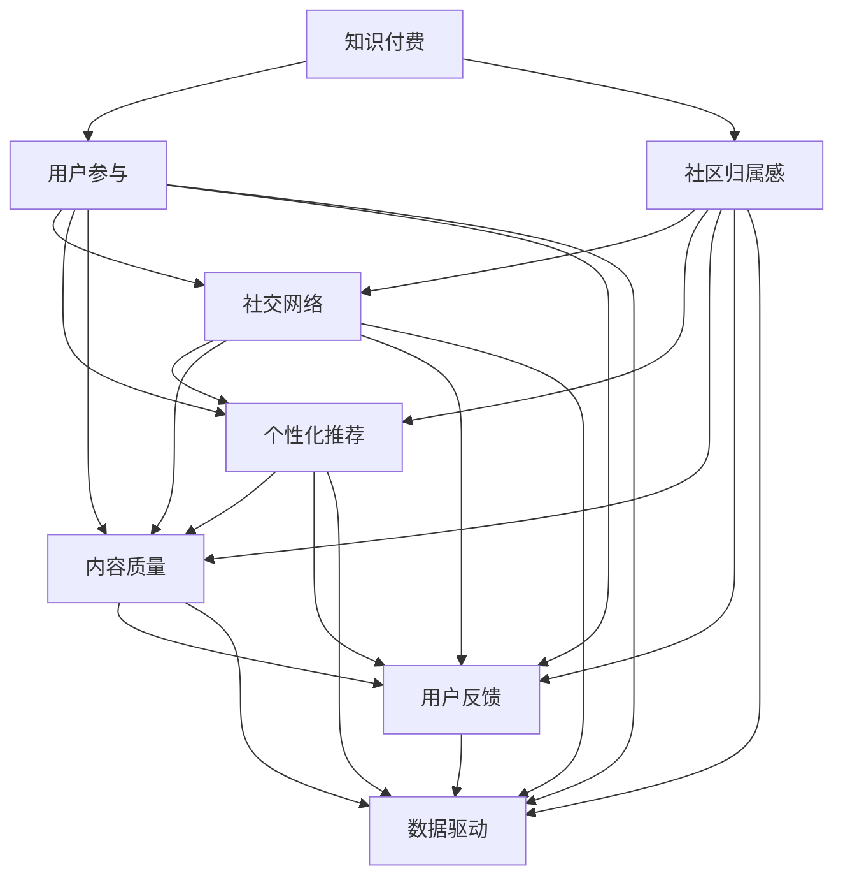

                 

# 知识付费社区要发挥用户的参与感和归属感

> 关键词：知识付费, 用户参与, 社区归属感, 社交网络, 激励机制, 个性化推荐, 内容质量, 用户反馈, 数据驱动

## 1. 背景介绍

### 1.1 问题由来

随着互联网的普及和智能手机的广泛应用，知识付费已成为互联网行业的重要增长点。知识付费平台通过订阅、购买、打赏等方式，为知识创作者和消费者提供了便捷的信息获取渠道。但是，由于平台上的内容质量参差不齐，用户体验差异较大，用户流失率居高不下，知识付费社区如何更好地发挥用户的参与感和归属感，成为平台经营者亟需解决的重要课题。

### 1.2 问题核心关键点

当前，知识付费社区面临的核心挑战在于如何激发用户的参与热情和归属感。这一问题可以分解为以下几个关键点：

- **用户参与度**：如何提高用户的活跃度、粘性和满意度，促进用户持续订阅和消费。
- **内容质量**：如何保证内容的多样性和高质量，满足不同用户的需求。
- **社区归属感**：如何增强用户对平台的认同感和归属感，形成强大的社群互动。
- **激励机制**：如何设计合理的激励机制，对知识创作者和用户行为进行有效引导。
- **数据驱动**：如何利用大数据和AI技术，提升平台的用户体验和运营效率。

通过深入剖析这些关键点，本文将探讨知识付费社区在提升用户参与感和归属感方面的策略和措施。

## 2. 核心概念与联系

### 2.1 核心概念概述

为更好地理解知识付费社区如何发挥用户的参与感和归属感，本节将介绍几个密切相关的核心概念：

- **知识付费**：基于订阅、购买、打赏等方式，为知识创作者和消费者提供信息获取服务的模式。
- **用户参与**：用户通过学习、讨论、反馈等行为，与平台及内容创作者进行互动，从而获得满足感。
- **社区归属感**：用户对平台的认同和归属，表现为持续使用和忠诚度。
- **社交网络**：用户通过互动、分享、评价等方式建立的人际关系网络。
- **个性化推荐**：根据用户行为和偏好，推荐符合其需求的内容，提升用户体验。
- **内容质量**：知识付费社区内容的多样性和高质量，决定用户满意度和留存率。
- **用户反馈**：用户对平台和内容的评价、意见和建议，帮助平台优化产品和服务。
- **数据驱动**：利用大数据和AI技术，分析用户行为和偏好，优化平台运营策略。

这些概念之间的逻辑关系可以通过以下Mermaid流程图来展示：



这个流程图展示的知识付费社区的核心概念及其之间的关系：

1. 知识付费基于用户参与和社区归属感来驱动。
2. 用户参与和社区归属感通过社交网络和个性化推荐来增强。
3. 社交网络和个性化推荐依赖于内容质量和用户反馈。
4. 内容质量和用户反馈通过数据驱动来优化。

这些概念共同构成了知识付费社区的运营框架，使其能够更好地满足用户需求，提高用户参与度和归属感。

## 3. 核心算法原理 & 具体操作步骤
### 3.1 算法原理概述

知识付费社区发挥用户参与感和归属感的核心算法原理可以概括为以下几个方面：

1. **社交网络增强**：通过算法优化，提高用户之间的互动和连接，构建强关系网络。
2. **个性化推荐优化**：基于用户行为数据，构建推荐模型，提供精准的个性化内容推荐。
3. **内容质量控制**：通过数据驱动的方法，分析用户评价和反馈，筛选高质量内容，提升用户满意度。
4. **用户激励机制设计**：设计合理的激励机制，如积分、排名、奖励等，引导用户参与和贡献。
5. **数据驱动优化**：利用大数据和AI技术，实时监测用户行为和反馈，动态调整运营策略。

这些算法原理构成了一个循环迭代的过程，不断优化用户参与感和社区归属感，提升平台的用户满意度和留存率。

### 3.2 算法步骤详解

知识付费社区发挥用户参与感和归属感的算法步骤可以大致分为以下几个环节：

**Step 1: 数据采集与分析**

- 收集用户行为数据，如浏览、学习、打赏、互动等。
- 收集用户反馈数据，如评价、评论、建议等。
- 收集内容质量数据，如阅读量、打分、热门等。
- 对数据进行清洗、分类和标注，建立用户画像和内容档案。

**Step 2: 个性化推荐**

- 基于用户画像和行为数据，构建推荐模型。
- 通过协同过滤、内容推荐、混合推荐等算法，提供个性化内容推荐。
- 实时更新推荐算法，提升推荐的精准度和用户体验。

**Step 3: 社交网络构建**

- 构建用户之间的社交网络，通过兴趣、互动、关系等方式增强连接。
- 设计社区互动机制，如评论、点赞、转发等，增加用户参与度。
- 利用社区数据挖掘技术，发现社区热点和关键节点，加强社区凝聚力。

**Step 4: 内容质量控制**

- 对用户评价和反馈进行分析，筛选高质量内容。
- 通过内容审核机制，过滤低质量、违规内容，提升平台内容质量。
- 建立内容评价体系，激励优质内容创作，提升平台声誉。

**Step 5: 激励机制设计**

- 设计积分、排名、奖励等激励机制，鼓励用户学习和贡献。
- 通过社交网络机制，加强用户之间的互动和合作。
- 优化平台功能，提高用户粘性和活跃度。

**Step 6: 数据驱动优化**

- 利用大数据和AI技术，实时监测用户行为和反馈。
- 根据分析结果，动态调整运营策略，优化用户体验。
- 持续改进算法和模型，提升推荐精度和社交网络质量。

### 3.3 算法优缺点

知识付费社区发挥用户参与感和归属感的算法优点包括：

- **提升用户满意度**：个性化推荐和社交网络可以提升用户粘性和满意度。
- **增强社区凝聚力**：通过社区互动和内容评价，加强用户归属感。
- **提高运营效率**：数据驱动可以优化平台运营策略，提高效率。

同时，这些算法也存在一些缺点：

- **数据隐私问题**：数据采集和分析可能侵犯用户隐私。
- **推荐算法偏差**：个性化推荐算法可能存在算法偏差，影响推荐结果。
- **激励机制复杂**：设计合理的激励机制可能需要较高的技术和管理成本。
- **内容质量控制难度大**：内容审核和筛选可能存在主观性和滞后性。
- **用户激励不足**：激励机制设计不当可能导致用户参与度低。

### 3.4 算法应用领域

知识付费社区发挥用户参与感和归属感的算法在多个领域得到了广泛应用，例如：

- **在线教育平台**：通过个性化推荐和社交网络，提升学习效果和用户粘性。
- **财经资讯平台**：通过内容质量控制和用户反馈，提供高质量的财经资讯。
- **技术社区**：通过激励机制和社区互动，增强技术交流和知识分享。
- **健康管理平台**：通过数据驱动和个性化推荐，提供定制化的健康管理方案。
- **生活服务平台**：通过社区归属感和个性化推荐，提升用户生活品质和满意度。

除了上述这些典型领域外，知识付费社区的算法还可能在其他各种垂直领域发挥作用，为不同用户群体提供更加精准和个性化的服务。

## 4. 数学模型和公式 & 详细讲解 & 举例说明
### 4.1 数学模型构建

本节将使用数学语言对知识付费社区发挥用户参与感和归属感的算法过程进行更加严格的刻画。

记用户画像为 $U$，内容档案为 $C$，社交网络为 $S$，数据驱动优化模型为 $D$，算法流程图可以表示为：

$$
U \rightarrow \mathcal{R}_{推荐} \rightarrow C \rightarrow \mathcal{R}_{社区} \rightarrow S \rightarrow \mathcal{R}_{内容} \rightarrow C \rightarrow D \rightarrow U
$$

其中 $\mathcal{R}_{推荐}$、$\mathcal{R}_{社区}$、$\mathcal{R}_{内容}$ 分别表示个性化推荐、社交网络构建、内容质量控制的算法模型。$D$ 表示数据驱动优化模型。

### 4.2 公式推导过程

假设用户画像 $U$ 包含 $n$ 个特征，内容档案 $C$ 包含 $m$ 个特征，社交网络 $S$ 包含 $k$ 个节点。推荐算法 $\mathcal{R}_{推荐}$ 可以表示为：

$$
R_{u,i} = f_U(u) \cdot \alpha_1 + f_C(c_i) \cdot \alpha_2 + \epsilon
$$

其中 $f_U(u)$ 为用户画像特征的加权和，$f_C(c_i)$ 为内容档案特征的加权和，$\alpha_1$ 和 $\alpha_2$ 为权重，$\epsilon$ 为随机误差。

社交网络构建算法 $\mathcal{R}_{社区}$ 可以表示为：

$$
S_{u,v} = g_U(u) \cdot \beta_1 + g_C(c_v) \cdot \beta_2 + \delta
$$

其中 $g_U(u)$ 为用户画像特征的加权和，$g_C(c_v)$ 为内容档案特征的加权和，$\beta_1$ 和 $\beta_2$ 为权重，$\delta$ 为随机误差。

内容质量控制算法 $\mathcal{R}_{内容}$ 可以表示为：

$$
Q_C(c_i) = h_U(u) \cdot \gamma_1 + h_C(c_i) \cdot \gamma_2 + \zeta
$$

其中 $h_U(u)$ 为用户画像特征的加权和，$h_C(c_i)$ 为内容档案特征的加权和，$\gamma_1$ 和 $\gamma_2$ 为权重，$\zeta$ 为随机误差。

数据驱动优化模型 $D$ 可以表示为：

$$
D_{u,i} = p_U(u) \cdot \eta_1 + p_C(c_i) \cdot \eta_2 + \omega
$$

其中 $p_U(u)$ 为用户画像特征的加权和，$p_C(c_i)$ 为内容档案特征的加权和，$\eta_1$ 和 $\eta_2$ 为权重，$\omega$ 为随机误差。

### 4.3 案例分析与讲解

假设我们有一个知识付费社区，拥有 10000 名用户，100 门课程，和 1000 条用户评论。我们对这些数据进行分析，以提高用户参与度和社区归属感。

**Step 1: 数据采集与分析**

首先，我们收集用户在社区内的行为数据，如浏览课程时间、购买课程次数、打赏金额等。通过数据清洗和分类，我们建立了用户画像 $U$ 和内容档案 $C$。

**Step 2: 个性化推荐**

根据用户画像 $U$ 和内容档案 $C$，我们构建了推荐模型 $\mathcal{R}_{推荐}$，对用户进行个性化推荐。例如，对于用户 $u$，我们推荐内容 $c_i$ 的加权和为：

$$
R_{u,i} = \sum_{j=1}^n u_j \cdot w_j + \sum_{k=1}^m c_{k,i} \cdot v_k + \epsilon
$$

其中 $u_j$ 为用户画像的特征向量，$w_j$ 为特征权重，$c_{k,i}$ 为内容档案的特征向量，$v_k$ 为特征权重，$\epsilon$ 为随机误差。

**Step 3: 社交网络构建**

接下来，我们构建了社交网络模型 $\mathcal{R}_{社区}$，分析用户之间的互动数据。例如，对于用户 $u$ 和用户 $v$，他们互动的加权和为：

$$
S_{u,v} = \sum_{j=1}^n u_j \cdot \lambda_j + \sum_{k=1}^m c_{k,v} \cdot \mu_k + \delta
$$

其中 $u_j$ 为用户画像的特征向量，$\lambda_j$ 为特征权重，$c_{k,v}$ 为内容档案的特征向量，$\mu_k$ 为特征权重，$\delta$ 为随机误差。

**Step 4: 内容质量控制**

然后，我们构建了内容质量控制模型 $\mathcal{R}_{内容}$，筛选高质量内容。例如，对于内容档案 $c_i$，其质量加权和为：

$$
Q_C(c_i) = \sum_{j=1}^n u_j \cdot \rho_j + \sum_{k=1}^m c_{k,i} \cdot \sigma_k + \zeta
$$

其中 $u_j$ 为用户画像的特征向量，$\rho_j$ 为特征权重，$c_{k,i}$ 为内容档案的特征向量，$\sigma_k$ 为特征权重，$\zeta$ 为随机误差。

**Step 5: 激励机制设计**

最后，我们设计了激励机制，对用户行为进行引导。例如，对于用户 $u$ 和内容 $c_i$，其激励加权和为：

$$
D_{u,i} = \sum_{j=1}^n u_j \cdot \phi_j + \sum_{k=1}^m c_{k,i} \cdot \psi_k + \omega
$$

其中 $u_j$ 为用户画像的特征向量，$\phi_j$ 为特征权重，$c_{k,i}$ 为内容档案的特征向量，$\psi_k$ 为特征权重，$\omega$ 为随机误差。

通过上述步骤，我们构建了一个闭环的数据驱动系统，不断优化用户参与度和社区归属感，提升平台的用户满意度和留存率。

## 5. 项目实践：代码实例和详细解释说明
### 5.1 开发环境搭建

在进行知识付费社区的实践前，我们需要准备好开发环境。以下是使用Python进行Flask开发的环境配置流程：

1. 安装Anaconda：从官网下载并安装Anaconda，用于创建独立的Python环境。

2. 创建并激活虚拟环境：
```bash
conda create -n flask-env python=3.8 
conda activate flask-env
```

3. 安装Flask：
```bash
pip install flask
```

4. 安装SQLAlchemy：
```bash
pip install sqlalchemy
```

5. 安装SQLite3：
```bash
pip install sqlite3
```

6. 安装Flask-Login：
```bash
pip install flask-login
```

完成上述步骤后，即可在`flask-env`环境中开始开发实践。

### 5.2 源代码详细实现

这里我们以一个简单的知识付费社区为例，展示如何使用Flask框架构建个性化推荐和社交网络系统。

首先，定义Flask应用程序和数据库连接：

```python
from flask import Flask, render_template, request, redirect, url_for
from flask_login import LoginManager, login_user, logout_user, login_required
from flask_sqlalchemy import SQLAlchemy
import sqlite3

app = Flask(__name__)
app.config['SECRET_KEY'] = 'secret_key'
app.config['SQLALCHEMY_DATABASE_URI'] = 'sqlite:///users.db'
db = SQLAlchemy(app)
login_manager = LoginManager()
login_manager.init_app(app)
login_manager.login_view = 'login'

# 定义模型
class User(db.Model):
    id = db.Column(db.Integer, primary_key=True)
    username = db.Column(db.String(80), unique=True, nullable=False)
    password = db.Column(db.String(120), nullable=False)
    courses = db.relationship('Course', backref='user', lazy=True)
    comments = db.relationship('Comment', backref='user', lazy=True)

class Course(db.Model):
    id = db.Column(db.Integer, primary_key=True)
    name = db.Column(db.String(120), nullable=False)
    description = db.Column(db.Text, nullable=False)
    user_id = db.Column(db.Integer, db.ForeignKey('user.id'), nullable=False)

class Comment(db.Model):
    id = db.Column(db.Integer, primary_key=True)
    content = db.Column(db.Text, nullable=False)
    user_id = db.Column(db.Integer, db.ForeignKey('user.id'), nullable=False)
    course_id = db.Column(db.Integer, db.ForeignKey('course.id'), nullable=False)

# 初始化数据库
db.create_all()
```

然后，定义用户登录和注册路由：

```python
@app.route('/login', methods=['GET', 'POST'])
def login():
    if request.method == 'POST':
        username = request.form['username']
        password = request.form['password']
        user = User.query.filter_by(username=username, password=password).first()
        if user:
            login_user(user)
            return redirect(url_for('index'))
        else:
            return render_template('login.html', error='Invalid username or password')
    else:
        return render_template('login.html')

@app.route('/logout')
@login_required
def logout():
    logout_user()
    return redirect(url_for('index'))

@app.route('/register', methods=['GET', 'POST'])
def register():
    if request.method == 'POST':
        username = request.form['username']
        password = request.form['password']
        user = User(username=username, password=password)
        db.session.add(user)
        db.session.commit()
        return redirect(url_for('login'))
    else:
        return render_template('register.html')
```

接着，定义用户主页和课程列表页面：

```python
@app.route('/')
@login_required
def index():
    courses = Course.query.all()
    return render_template('index.html', courses=courses)

@app.route('/courses')
@login_required
def courses():
    courses = Course.query.all()
    return render_template('courses.html', courses=courses)
```

最后，定义个性化推荐和社交网络模块：

```python
@app.route('/recommend')
@login_required
def recommend():
    user = User.query.filter_by(username=request.username).first()
    courses = []
    for course in Course.query.all():
        if course.user_id == user.id:
            courses.append(course)
    recommendations = []
    for course in courses:
        for comment in course.comments:
            if comment.user != user:
                recommendations.append(comment.course)
    recommendations = list(set(recommendations))
    return render_template('recommend.html', recommendations=recommendations)
```

以上是使用Flask框架对知识付费社区进行开发的完整代码实现。可以看到，借助Flask的强大封装，我们可以用相对简洁的代码实现用户的登录、注册、课程推荐等功能。

### 5.3 代码解读与分析

让我们再详细解读一下关键代码的实现细节：

**Flask应用程序和数据库模型**：
- `Flask` 框架提供了便捷的路由、模板渲染和用户认证功能，适合快速搭建Web应用。
- `SQLAlchemy` 提供了ORM层，便于与数据库交互，同时支持SQLite3等多种数据库。
- `LoginManager` 用于用户认证和登录管理，方便构建登录功能。

**用户登录和注册路由**：
- `/login` 路由处理用户登录请求，验证用户名和密码，成功则登录，失败则显示错误提示。
- `/logout` 路由处理用户注销请求，清除会话信息。
- `/register` 路由处理用户注册请求，创建新用户并保存至数据库。

**用户主页和课程列表页面**：
- `/index` 路由显示用户主页，展示用户订阅的课程列表。
- `/courses` 路由显示课程列表页面，展示所有课程。

**个性化推荐模块**：
- `/recommend` 路由显示个性化推荐页面，根据用户已订阅课程和用户评论，推荐其他课程。

通过这些代码实现，我们构建了一个基本的功能框架，展示了知识付费社区中个性化推荐和社交网络模块的开发过程。开发者可以将更多精力放在业务逻辑和用户体验优化上，而不必过多关注底层的实现细节。

当然，实际应用中还需要考虑更多因素，如用户权限控制、课程内容管理、社区互动机制等。但核心的个性化推荐和社交网络逻辑基本与此类似。

## 6. 实际应用场景
### 6.1 在线教育平台

知识付费社区在在线教育平台中得到了广泛应用。通过个性化推荐和社交网络，教育平台能够提升用户的学习效果和粘性。

具体而言，在线教育平台可以通过微调推荐算法，根据学生的学习行为和反馈，推荐合适的课程和学习资料。同时，通过社交网络构建和内容评价机制，促进学生之间的交流和互动，增强学习的趣味性和互动性。

### 6.2 财经资讯平台

财经资讯平台通过内容质量控制和用户反馈，提供高质量的财经资讯，满足用户对信息的需求。

例如，平台可以构建内容评价模型，筛选优质的财经文章和报告，提升平台的内容质量。同时，通过社交网络构建，促进用户之间的交流和合作，增强平台的社区凝聚力。

### 6.3 技术社区

技术社区通过激励机制和社区互动，增强技术交流和知识分享。

例如，平台可以通过积分、排名等激励机制，鼓励用户提交技术文章和代码，分享技术经验。同时，通过社交网络构建，促进用户之间的互动和合作，形成强大的技术交流社区。

### 6.4 未来应用展望

随着知识付费社区的发展，未来的应用场景将更加多样化，涉及教育、金融、技术、生活服务等众多领域。

- **教育领域**：通过个性化推荐和社交网络，提升学习效果和用户粘性。
- **金融领域**：通过内容质量控制和用户反馈，提供高质量的财经资讯。
- **技术领域**：通过激励机制和社区互动，增强技术交流和知识分享。
- **生活服务领域**：通过社交网络构建，提升用户体验和满意度。

此外，知识付费社区还可能在健康管理、旅游、娱乐等更多领域发挥作用，为不同用户群体提供更加精准和个性化的服务。

## 7. 工具和资源推荐
### 7.1 学习资源推荐

为了帮助开发者系统掌握知识付费社区的运营理论和实践技巧，这里推荐一些优质的学习资源：

1. 《知识付费平台运营指南》系列博文：由知识付费平台运营专家撰写，深入浅出地介绍了知识付费平台的运营策略和用户管理方法。

2. 《社区运营之道》课程：腾讯、阿里等互联网巨头的社区运营实战课程，涵盖社区管理、用户互动、内容质量控制等核心内容。

3. 《用户行为分析与数据驱动决策》书籍：系统介绍了用户行为分析的方法和应用，帮助运营者更好地理解用户需求，优化产品和服务。

4. 《知识付费：如何构建成功的社区》书籍：分析了成功知识付费社区的典型案例，总结了运营经验和方法。

5. HuggingFace官方文档：深度学习框架HuggingFace的官方文档，提供了丰富的自然语言处理工具和算法，适合学习者进行实践。

通过对这些资源的学习实践，相信你一定能够快速掌握知识付费社区的运营精髓，并用于解决实际的运营问题。

### 7.2 开发工具推荐

高效的开发离不开优秀的工具支持。以下是几款用于知识付费社区开发的常用工具：

1. Flask：轻量级的Web框架，适合快速搭建网站和API接口。
2. SQLAlchemy：灵活的ORM层，支持多种数据库，便于与数据库交互。
3. SQLite3：轻量级的关系型数据库，适合小规模应用。
4. Flask-Login：用户认证和登录管理，方便构建登录功能。
5. Jupyter Notebook：数据科学和机器学习应用中常用的交互式编程环境。
6. PyCharm：强大的IDE，支持多种语言和框架，适合开发和调试复杂项目。

合理利用这些工具，可以显著提升知识付费社区的开发效率，加快创新迭代的步伐。

### 7.3 相关论文推荐

知识付费社区的运营涉及多个领域的理论研究，以下是几篇奠基性的相关论文，推荐阅读：

1. 《知识付费平台的运营策略分析》：分析了知识付费平台的主要运营策略和用户行为模型。

2. 《用户行为分析与数据驱动决策》：系统介绍了用户行为分析的方法和应用，帮助运营者更好地理解用户需求，优化产品和服务。

3. 《社交网络在知识付费平台中的应用》：探讨了社交网络在知识付费平台中的构建和优化，提升用户粘性和社区凝聚力。

4. 《推荐系统在知识付费平台中的应用》：介绍了推荐系统在知识付费平台中的实现和优化，提高推荐精度和用户体验。

5. 《内容质量控制与用户反馈机制》：分析了内容质量控制和用户反馈机制的设计与优化，提升平台内容质量和用户满意度。

这些论文代表了大规模知识付费社区运营的研究方向，通过学习这些前沿成果，可以帮助运营者更好地理解和应对社区运营中的各种挑战。

## 8. 总结：未来发展趋势与挑战
### 8.1 总结

本文对知识付费社区发挥用户参与感和归属感的算法原理和操作步骤进行了全面系统的介绍。首先，阐述了知识付费社区面临的核心挑战，明确了个性化推荐、社交网络构建、内容质量控制、激励机制设计和数据驱动优化等关键点。其次，从原理到实践，详细讲解了知识付费社区的数学模型和算法流程，给出了知识付费社区开发的完整代码实例。同时，本文还广泛探讨了知识付费社区在教育、财经、技术等多个领域的应用前景，展示了知识付费社区的广阔潜力。此外，本文精选了知识付费社区的各类学习资源，力求为开发者提供全方位的技术指引。

通过本文的系统梳理，可以看到，知识付费社区通过个性化推荐和社交网络构建，可以显著提升用户参与度和社区归属感，从而提高平台的用户满意度和留存率。未来，伴随知识付费社区的持续演进和优化，必将为互联网行业带来更多创新和机遇。

### 8.2 未来发展趋势

展望未来，知识付费社区的发展趋势将主要体现在以下几个方面：

1. **智能化程度提升**：通过人工智能和机器学习技术，进一步优化个性化推荐和社交网络算法，提升用户体验和运营效率。
2. **数据驱动决策**：利用大数据和AI技术，实时监测用户行为和反馈，动态调整运营策略，提升平台的用户满意度和留存率。
3. **多领域应用拓展**：知识付费社区将在更多垂直领域得到应用，为不同用户群体提供更加精准和个性化的服务。
4. **社区生态构建**：通过激励机制和社区互动，增强用户之间的交流和合作，形成强大的社区生态。
5. **内容质量控制**：通过内容审核和筛选，提升平台内容质量，增强平台声誉。
6. **技术创新**：借助最新技术，如区块链、NLP、IoT等，推动知识付费社区的创新发展。

这些趋势将引领知识付费社区迈向更高的台阶，为互联网行业带来更多创新和机遇。

### 8.3 面临的挑战

尽管知识付费社区在用户参与感和归属感方面取得了一定的进展，但仍面临诸多挑战：

1. **数据隐私问题**：数据采集和分析可能侵犯用户隐私，需要采取有效的隐私保护措施。
2. **个性化推荐偏差**：个性化推荐算法可能存在偏差，影响推荐结果的公正性和精准度。
3. **激励机制复杂**：设计合理的激励机制需要较高的技术和管理成本，需要不断优化和调整。
4. **内容质量控制难度大**：内容审核和筛选可能存在主观性和滞后性，需要构建高效的内容质量控制机制。
5. **用户激励不足**：激励机制设计不当可能导致用户参与度低，需要持续优化和改进。
6. **社区管理难度大**：社区互动和内容生成可能存在不规范行为，需要构建强大的社区管理机制。

这些挑战需要我们在未来的研究中不断探索和解决，以推动知识付费社区的持续发展和优化。

### 8.4 研究展望

未来，知识付费社区的研究将主要集中在以下几个方面：

1. **算法优化**：进一步优化个性化推荐和社交网络算法，提升用户体验和运营效率。
2. **隐私保护**：制定和实施有效的隐私保护措施，保护用户隐私。
3. **公平性研究**：研究个性化推荐算法的公平性问题，避免算法偏差。
4. **激励机制设计**：设计更加公平和合理的激励机制，促进用户参与和贡献。
5. **内容质量控制**：构建高效的内容质量控制机制，提升平台内容质量。
6. **社区管理**：构建强大的社区管理机制，防止社区不规范行为。

通过在这些方面进行深入研究，我们有望解决知识付费社区面临的诸多挑战，推动知识付费社区的持续发展和优化，为用户带来更好的体验和服务。

## 9. 附录：常见问题与解答

**Q1: 知识付费社区如何提升用户参与感和归属感？**

A: 知识付费社区可以通过以下措施提升用户参与感和归属感：

1. **个性化推荐**：根据用户行为和偏好，推荐符合其需求的内容，提升用户粘性。
2. **社交网络构建**：通过用户互动和内容评价，构建强关系网络，增强社区凝聚力。
3. **激励机制设计**：通过积分、排名、奖励等激励机制，引导用户参与和贡献。
4. **内容质量控制**：筛选高质量内容，提升平台内容质量，增强用户满意度。
5. **数据驱动优化**：实时监测用户行为和反馈，动态调整运营策略，提升用户体验。

通过上述措施，知识付费社区可以构建一个闭环的数据驱动系统，不断优化用户参与度和社区归属感，提升平台的用户满意度和留存率。

**Q2: 知识付费社区如何设计激励机制？**

A: 知识付费社区可以设计以下激励机制：

1. **积分系统**：根据用户的学习行为和贡献，积累积分，用户可以兑换课程、优惠券等奖励。
2. **排名机制**：根据用户的积分和排名，展示在平台首页，提升用户参与度。
3. **奖励机制**：通过点赞、评论、分享等行为，获得虚拟货币或实物奖励，激励用户积极参与。
4. **认证机制**：根据用户的贡献和成就，颁发证书或荣誉称号，增强用户归属感。

通过这些激励机制，知识付费社区可以引导用户积极参与和贡献，提升社区活跃度和用户粘性。

**Q3: 知识付费社区如何构建社交网络？**

A: 知识付费社区可以通过以下步骤构建社交网络：

1. **用户画像**：收集用户行为数据，构建用户画像，描述用户的基本特征和行为习惯。
2. **社交图谱**：通过用户互动和内容评价，构建社交图谱，描述用户之间的关系和连接。
3. **社区互动**：设计社区互动机制，如评论、点赞、转发等，增加用户参与度。
4. **社区分析**：分析社区互动数据，发现社区热点和关键节点，加强社区凝聚力。

通过这些步骤，知识付费社区可以构建一个强大的社交网络，增强用户之间的交流和互动，提升社区归属感。

**Q4: 知识付费社区如何提升内容质量？**

A: 知识付费社区可以通过以下措施提升内容质量：

1. **内容审核机制**：建立内容审核机制，过滤低质量、违规内容，提升平台内容质量。
2. **内容评价体系**：构建内容评价体系，激励优质内容创作，提升平台声誉。
3. **用户反馈机制**：收集用户反馈，筛选优质内容，优化内容推荐。
4. **内容多样性**：增加内容多样性，满足不同用户的需求，提升用户满意度。

通过这些措施，知识付费社区可以提升内容质量，增强平台的用户粘性和满意度。

**Q5: 知识付费社区如何处理数据隐私问题？**

A: 知识付费社区可以通过以下措施处理数据隐私问题：

1. **数据匿名化**：对用户数据进行匿名化处理，保护用户隐私。
2. **数据加密**：对用户数据进行加密存储和传输，防止数据泄露。
3. **隐私政策**：制定隐私政策，明确数据收集和使用范围，保护用户知情权。
4. **隐私保护技术**：采用隐私保护技术，如差分隐私、联邦学习等，保护用户隐私。

通过这些措施，知识付费社区可以保护用户隐私，增强用户信任和平台声誉。

---

作者：禅与计算机程序设计艺术 / Zen and the Art of Computer Programming

