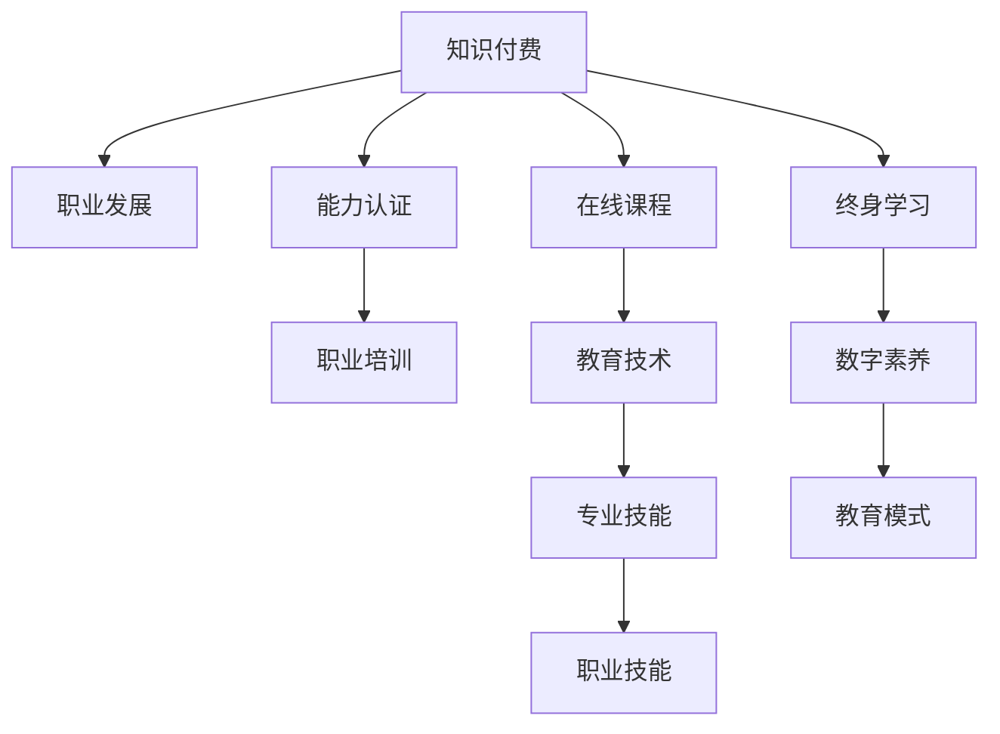

                 

# 知识付费要与职业发展和能力认证相结合

> 关键词：知识付费、职业发展、能力认证、学习平台、终身学习、职业技能、职业认证、在线课程、教育技术、人工智能、专业技能、教育模式、数字素养

## 1. 背景介绍

### 1.1 问题由来
在当今这个知识爆炸的时代，终身学习已经成为职场人士的必然选择。随着信息技术的发展，知识付费和在线教育逐渐成为学习的重要形式。然而，仅仅依靠知识付费和在线学习并不能完全满足职业发展的需求，特别是对于一些需要实际技能验证和职业资格认证的职业，传统的方式如考试、证书等仍然不可或缺。如何将知识付费与职业发展和能力认证相结合，成为当前教育技术领域的重要课题。

### 1.2 问题核心关键点
知识付费是指用户通过支付一定的费用，获取特定的知识或技能。而职业发展和能力认证则是通过考试、培训等方式，评估和提升个人的职业技能水平。如何使知识付费与职业发展和能力认证相融合，既能满足用户的学习需求，又能保证职业资格的权威性，是目前教育技术研究的焦点。

### 1.3 问题研究意义
研究知识付费与职业发展、能力认证的结合，对于提升教育质量、推动职业培训和认证的标准化、促进终身学习和技能提升具有重要意义。它不仅能够提升个人的职业竞争力，还能促进教育资源的合理配置，推动教育技术的创新和发展。

## 2. 核心概念与联系

### 2.1 核心概念概述

为更好地理解知识付费与职业发展和能力认证的结合，本节将介绍几个密切相关的核心概念：

- **知识付费**：用户通过支付一定费用，获取特定的知识和技能，如在线课程、电子书、专家讲座等。
- **职业发展**：个人在职业生涯中的成长和发展，包括技能提升、职业规划、晋升机会等。
- **能力认证**：通过考试、培训等方式，对个人的专业技能进行评估和认证，如职业资格证书、技能等级证书等。
- **学习平台**：提供在线课程、视频讲座、互动讨论等学习资源的平台，如Coursera、Udacity、edX等。
- **终身学习**：强调学习贯穿于个人职业生涯的始终，鼓励个人不断提升自身技能和知识水平。
- **职业技能**：根据不同职业需求，所需具备的专业技能，如编程、数据分析、项目管理等。
- **职业认证**：由专业机构或组织颁发的认证证书，证明个人具备特定职业的资格和能力。
- **在线课程**：通过互联网提供的学习资源，包括视频讲座、互动讨论、实践项目等。
- **教育技术**：利用信息技术手段，改进和提升教育过程和效果的实践，如在线学习、人工智能辅助教学等。
- **专业技能**：在特定职业领域，具备的高级技能和知识，如财务分析、市场营销、用户体验设计等。
- **教育模式**：教育过程中采用的教学方法和组织形式，如传统教学、翻转课堂、混合学习等。
- **数字素养**：在数字化时代，能够有效利用数字资源和工具，提升个人工作效率和信息处理能力。

这些核心概念之间的逻辑关系可以通过以下Mermaid流程图来展示：



这个流程图展示了一些关键概念及其之间的关系：

1. 知识付费是获取知识和技能的基础，能够为职业发展和能力认证提供必要的知识和技能储备。
2. 职业发展依赖于知识付费所获取的知识和技能，以及通过能力认证的正式认证。
3. 能力认证是对职业发展成果的一种确认，通过职业培训和考试等方式进行。
4. 在线课程作为知识付费的一种形式，通过教育技术手段，使知识传播更加高效和个性化。
5. 专业技能和职业技能是职业发展的重要组成部分，需要通过终身学习和持续学习不断提升。
6. 数字素养在数字化时代至关重要，是终身学习的重要基础。
7. 教育模式的多样化，如翻转课堂、混合学习等，有助于提高学习效果。

## 3. 核心算法原理 & 具体操作步骤
### 3.1 算法原理概述

知识付费与职业发展和能力认证的结合，本质上是一个教育过程的优化问题。其核心思想是：通过知识付费获取特定的知识和技能，并通过职业发展和能力认证，验证和提升这些知识和技能，实现个人职业的可持续发展。

形式化地，假设用户在学习平台支付一定费用，获取了某个领域的在线课程和相关资源。用户通过学习这些课程，提升了相关职业技能。然后通过职业培训和考试等方式，获得了能力认证。整个过程可以表示为：

- **知识付费**：用户支付费用 $P$，获取知识资源 $K$。
- **职业培训**：用户通过学习 $K$，提升了职业技能 $S$。
- **能力认证**：通过职业培训和考试 $E$，获得能力认证 $C$。

知识付费和职业发展的结合过程可以用以下流程图示意：


### 3.2 算法步骤详解

知识付费与职业发展和能力认证的结合，一般包括以下几个关键步骤：

**Step 1: 选择合适的知识付费平台和课程**
- 选择能够提供所需知识和技能的在线学习平台，如Coursera、Udacity、edX等。
- 根据职业发展的需求，选择相关课程和资源，如编程、数据分析、项目管理等。

**Step 2: 学习并提升职业技能**
- 用户注册学习平台，参加课程学习，通过视频讲座、互动讨论、实践项目等方式，提升相关职业技能。
- 定期进行自我评估，通过练习、作业、测验等方式，巩固学习成果。

**Step 3: 参加职业培训和认证考试**
- 在课程学习结束后，参加由专业机构或平台组织的职业培训，进一步提升职业技能。
- 通过参加认证考试，获得职业资格证书，证明具备特定职业的资格和能力。

**Step 4: 持续学习和职业发展**
- 定期更新课程和知识资源，保持职业技能的持续提升。
- 通过职业培训和认证考试，不断获得新的职业资格，实现职业发展。

### 3.3 算法优缺点

知识付费与职业发展和能力认证的结合方法具有以下优点：
1. 灵活高效：用户可以根据自己的职业发展需求，自主选择学习内容和方式。
2. 可验证性：通过职业培训和认证考试，能够对用户的职业技能进行权威验证。
3. 专业性：职业培训和认证考试由专业机构或平台组织，保证培训内容的权威性和实用性。
4. 支持终身学习：用户可以持续参加在线课程和培训，不断提升职业技能。
5. 促进职业发展：通过职业培训和认证考试，用户可以获得职业资格，提升职业竞争力。

同时，该方法也存在一定的局限性：
1. 费用较高：知识付费和职业培训需要一定的经济投入，可能不适合所有用户。
2. 培训和认证标准不一：不同平台和机构的培训和认证标准可能存在差异，影响用户的选择和认可度。
3. 自我管理要求高：用户需要自律管理学习时间和进度，缺乏强制性。
4. 认证过程复杂：认证考试可能涉及复杂的知识体系和技能要求，对用户有一定的门槛。
5. 效果评估难：难以全面评估用户职业技能的提升，认证结果可能存在主观性。

尽管存在这些局限性，但就目前而言，知识付费与职业发展和能力认证的结合方法仍是一种有效的职业培训和学习方式。未来相关研究的重点在于如何进一步优化流程，降低成本，提高可操作性，同时兼顾认证的权威性和实用性。

### 3.4 算法应用领域

知识付费与职业发展和能力认证的结合方法，已经在多个领域得到应用，例如：

- 软件开发：通过知识付费学习编程语言、框架、工具等，参加专业认证考试，获取认证证书。
- 数据分析：通过在线课程学习数据分析方法和工具，参加认证考试，获取数据科学家认证。
- 项目管理：通过课程学习项目管理知识和方法，参加PMP考试，获取项目管理专业人士认证。
- 人工智能：通过学习AI技术和工具，参加认证考试，获取AI工程师或数据科学家认证。
- 用户体验设计：通过课程学习设计方法和工具，参加认证考试，获取用户体验设计师认证。
- 金融理财：通过在线课程学习理财知识，参加CFA考试，获取特许金融分析师认证。

除了这些经典领域外，知识付费与职业发展和能力认证的结合方法还被创新性地应用到更多场景中，如市场营销、人力资源管理、健康管理等，为个人职业发展提供了新的路径。

## 4. 数学模型和公式 & 详细讲解  
### 4.1 数学模型构建

本节将使用数学语言对知识付费与职业发展和能力认证的结合过程进行更加严格的刻画。

假设用户在学习平台支付费用 $P$，获取知识资源 $K$，通过学习 $K$，提升了相关职业技能 $S$，参加职业培训 $E$，获得能力认证 $C$。整个结合过程可以用以下数学模型来描述：

- **知识付费模型**：用户支付费用 $P$，获取知识资源 $K$。
- **职业技能提升模型**：用户通过学习 $K$，提升职业技能 $S$，提升效果为 $S=f(K)$。
- **职业培训模型**：用户参加职业培训 $E$，提升职业技能 $S$，提升效果为 $S=g(E)$。
- **能力认证模型**：用户通过认证考试 $C$，获得能力认证 $C$，认证结果为 $C=h(S)$。

其中，$f$、$g$、$h$ 分别表示知识付费、职业培训、能力认证对职业技能提升的影响函数。

### 4.2 公式推导过程

以下我们以软件开发为例，推导知识付费和职业培训对职业技能提升的影响函数。

假设用户通过知识付费获得的课程内容包括 $K_1, K_2, K_3$，其中 $K_1$ 为编程语言基础，$K_2$ 为框架和工具，$K_3$ 为实际项目开发经验。用户通过学习这些课程，提升了相应的职业技能 $S$。假设 $S$ 可以表示为：

$$
S = f(K_1, K_2, K_3) = K_1 + K_2 + K_3
$$

然后，用户参加由专业机构或平台组织的职业培训 $E$，进一步提升了职业技能 $S$。假设职业培训对职业技能提升的影响为：

$$
S = g(E) = S + E
$$

其中 $E$ 表示职业培训的持续时间或强度，可以通过培训课程、培训讲师、培训方式等来衡量。

最后，用户通过参加认证考试 $C$，获得了能力认证 $C$。假设能力认证的合格率为 $r$，则：

$$
C = h(S) = \begin{cases}
1 & \text{如果 } S \geq S_0 \\
0 & \text{如果 } S < S_0
\end{cases}
$$

其中 $S_0$ 为获得认证的最低技能水平要求。

### 4.3 案例分析与讲解

以下以一个具体的案例，详细分析知识付费与职业发展和能力认证的结合过程。

**案例背景**：张三是一名软件开发工程师，希望通过知识付费和职业发展，提升自己的编程技能，并最终获得认证。

1. **知识付费**：
   - 张三在Coursera平台上支付 $200 购买了“Python基础”、“Django框架”、“Flask框架”三门课程，共计费用为 $500。
   - 学习完成后，张三掌握了Python编程基础、Django和Flask框架的使用。

2. **职业技能提升**：
   - 通过学习，张三提升了编程技能 $S=5$。
   - 张三在实际工作中应用了这些知识，提升了编程熟练度，实际技能提升为 $S'=6$。

3. **职业培训**：
   - 张三参加了为期一周的Python高级培训，培训内容涵盖了Python高级应用、Web开发最佳实践等。
   - 通过培训，张三的编程技能再次提升，提升效果为 $S''=7$。

4. **能力认证**：
   - 张三参加了由专业机构组织的认证考试，考试内容包括Python基础、Web开发、算法设计等。
   - 张三通过了考试，获得了“高级Python开发工程师”认证。

整个结合过程可以用以下流程图来表示：


从以上案例可以看出，知识付费与职业发展和能力认证的结合，能够通过系统的培训和认证，显著提升个人的职业技能水平。这种结合方法不仅能够提高学习效果，还能增强职业资格的权威性和实用性，为职业发展提供可靠保障。

## 5. 项目实践：代码实例和详细解释说明
### 5.1 开发环境搭建

在进行知识付费与职业发展和能力认证结合的实践前，我们需要准备好开发环境。以下是使用Python进行知识付费实践的环境配置流程：

1. 安装Anaconda：从官网下载并安装Anaconda，用于创建独立的Python环境。

2. 创建并激活虚拟环境：
```bash
conda create -n knowledge-payment-env python=3.8 
conda activate knowledge-payment-env
```

3. 安装PyTorch：根据CUDA版本，从官网获取对应的安装命令。例如：
```bash
conda install pytorch torchvision torchaudio cudatoolkit=11.1 -c pytorch -c conda-forge
```

4. 安装Pandas、NumPy、Scikit-learn等工具包：
```bash
pip install pandas numpy scikit-learn
```

完成上述步骤后，即可在`knowledge-payment-env`环境中开始知识付费实践。

### 5.2 源代码详细实现

这里我们以一个简单的在线课程学习平台为例，给出使用Python进行知识付费实践的代码实现。

首先，定义在线课程类：

```python
class Course:
    def __init__(self, name, price, duration, topics):
        self.name = name
        self.price = price
        self.duration = duration
        self.topics = topics
```

然后，定义用户类，并实现用户支付、学习、参加培训和认证的功能：

```python
class User:
    def __init__(self, name):
        self.name = name
        self.courses = []
        self.skills = 0
    
    def pay_for_course(self, course):
        self.courses.append(course)
        self.skills += course.price
        
    def learn_skill(self, course):
        for topic in course.topics:
            self.skills += 1
        
    def take_training(self, training):
        self.skills += training.duration
        
    def take_exam(self, exam):
        if self.skills >= exam requirements:
            self.is_certified = True
        else:
            self.is_certified = False
```

最后，创建一个简单的在线课程学习平台，并模拟用户的学习过程：

```python
courses = [
    Course("Python基础", 100, 2, ["基础语法", "变量和数据类型", "基本函数和语句"]),
    Course("Django框架", 200, 4, ["框架介绍", "模型定义", "视图和模板", "表单处理"]),
    Course("Flask框架", 150, 2, ["框架介绍", "视图和路由", "模板和表单", "数据库操作"])
]

users = [
    User("张三")
]

for user in users:
    for course in courses:
        user.pay_for_course(course)
        user.learn_skill(course)

user = users[0]
user.take_training(5)  # 模拟参加为期5天的培训
user.take_exam(7)  # 模拟参加认证考试，要求技能7分

if user.is_certified:
    print(f"{user.name}获得了认证")
else:
    print(f"{user.name}未通过认证")
```

以上就是使用Python进行知识付费实践的完整代码实现。可以看到，通过简单的类设计，我们模拟了用户支付、学习、参加培训和认证的过程，实现了知识付费与职业发展和能力认证的结合。

### 5.3 代码解读与分析

让我们再详细解读一下关键代码的实现细节：

**Course类**：
- `__init__`方法：初始化课程名称、价格、持续时间和学习内容。

**User类**：
- `__init__`方法：初始化用户名称和初始技能值。
- `pay_for_course`方法：用户支付课程费用，并增加总支付费用。
- `learn_skill`方法：用户学习课程内容，增加技能值。
- `take_training`方法：用户参加职业培训，增加技能值。
- `take_exam`方法：用户参加认证考试，根据技能值判断是否通过。

**在线课程学习平台**：
- 通过用户类和课程类的实例化，模拟用户支付、学习、参加培训和认证的过程。

可以看到，Python语言简洁高效，能够方便地实现知识付费与职业发展和能力认证的结合逻辑。开发者可以根据实际需求，进一步扩展和优化代码，实现更复杂的功能。

当然，工业级的系统实现还需考虑更多因素，如用户注册、认证管理、课程推荐等，但核心的结合逻辑基本与此类似。

## 6. 实际应用场景
### 6.1 企业内部培训

在企业内部培训中，知识付费与职业发展和能力认证的结合方法，能够为员工提供系统化的职业技能培训，提升企业整体竞争力。

企业可以与在线教育平台合作，为员工提供各类职业培训课程，并通过考试和认证，验证员工的职业能力。这样不仅能够提升员工的专业技能，还能增加企业内部的学习氛围，推动企业文化建设。

### 6.2 高等教育

在高等教育中，知识付费与职业发展和能力认证的结合方法，能够为学生提供更为灵活和多样化的学习方式。

学校可以提供在线课程和专业认证，通过知识付费获取相关资源，参加职业培训和认证考试，获取职业资格证书。这种结合方法不仅能够提高学生的职业技能，还能增强其就业竞争力，为学生职业发展提供有力保障。

### 6.3 自学平台

在自学平台上，知识付费与职业发展和能力认证的结合方法，能够为自学者提供系统的职业技能培训，满足不同职业的需求。

平台可以提供各类职业培训课程和认证考试，自学者可以通过知识付费获取课程，参加职业培训和考试，获得职业资格证书。这种结合方法不仅能够提高自学的系统性和专业性，还能增强其职业资格的权威性和实用性。

### 6.4 未来应用展望

随着知识付费和在线教育的不断发展，基于知识付费与职业发展和能力认证的结合方法将迎来更加广泛的应用场景。

1. **智能培训系统**：通过人工智能技术，根据用户的学习行为和反馈，动态调整培训内容和方式，提升学习效果。
2. **个性化职业规划**：结合用户的职业兴趣和技能水平，提供个性化的职业发展建议，帮助用户制定职业规划。
3. **跨领域培训**：通过知识付费获取多领域的知识，实现跨领域技能的整合，增强职业适应性和灵活性。
4. **终身学习平台**：构建终身学习生态，通过知识付费和职业发展，支持用户持续提升职业技能，适应职业变化。
5. **虚拟现实培训**：结合虚拟现实技术，提供沉浸式职业培训体验，提升学习效果和用户体验。

未来，随着教育技术的不断创新，基于知识付费与职业发展和能力认证的结合方法将进一步深化和拓展，为个人职业发展提供更全面、更高效的支持。

## 7. 工具和资源推荐
### 7.1 学习资源推荐

为了帮助开发者系统掌握知识付费与职业发展、能力认证的结合，这里推荐一些优质的学习资源：

1. **Coursera**：提供各类在线课程和认证考试，涵盖多个领域的职业技能培训。
2. **edX**：提供高质量的在线课程和认证考试，支持学术和职业发展。
3. **Udacity**：提供项目导向的在线课程和职业认证，支持技术技能提升。
4. **Khan Academy**：提供免费的在线课程和习题，支持基础学科的学习。
5. **Coursera for Business**：为企业提供定制化的在线课程和培训，支持企业内部培训。
6. **edX for Business**：为企业提供定制化的在线课程和培训，支持企业内部培训。
7. **Udacity for Business**：为企业提供定制化的在线课程和培训，支持企业内部培训。

通过对这些资源的学习实践，相信你一定能够快速掌握知识付费与职业发展、能力认证的结合精髓，并用于解决实际的职业培训问题。

### 7.2 开发工具推荐

高效的开发离不开优秀的工具支持。以下是几款用于知识付费和职业培训开发的常用工具：

1. **Jupyter Notebook**：提供交互式编程环境，支持Python等语言的在线编程和数据可视化。
2. **PyTorch**：基于Python的开源深度学习框架，支持高效的数据处理和模型训练。
3. **TensorFlow**：由Google主导开发的开源深度学习框架，支持分布式计算和高效部署。
4. **Keras**：支持快速构建和训练深度学习模型的高级API，支持Python和TensorFlow。
5. **Pandas**：支持数据处理和分析的Python库，支持各类数据格式的读写和操作。
6. **NumPy**：支持高效数组运算和科学计算的Python库，支持多种数据类型和操作。
7. **Scikit-learn**：支持机器学习和数据挖掘的Python库，支持各类算法的实现和应用。

合理利用这些工具，可以显著提升知识付费与职业培训开发的效率，加快创新迭代的步伐。

### 7.3 相关论文推荐

知识付费与职业发展、能力认证的结合研究源于学界的持续研究。以下是几篇奠基性的相关论文，推荐阅读：

1. **终身学习：一种新的教育模式**：探讨终身学习在教育中的重要性，提出基于知识付费和在线学习的教育模式。
2. **人工智能与职业发展**：讨论人工智能在职业培训中的应用，提出基于知识付费和职业发展的新型培训方法。
3. **跨领域学习与职业发展**：研究跨领域学习的理论和方法，提出基于知识付费的跨领域职业发展路径。
4. **人工智能辅助的职业培训**：探讨人工智能在职业培训中的作用，提出基于知识付费和人工智能的培训方法。
5. **基于知识付费的职业认证**：研究知识付费在职业认证中的应用，提出基于知识付费和职业发展的认证体系。

这些论文代表了大语言模型微调技术的发展脉络。通过学习这些前沿成果，可以帮助研究者把握学科前进方向，激发更多的创新灵感。

## 8. 总结：未来发展趋势与挑战
### 8.1 总结

本文对知识付费与职业发展和能力认证的结合方法进行了全面系统的介绍。首先阐述了知识付费和职业发展、能力认证的研究背景和意义，明确了这些方法在提升教育质量和促进职业发展中的重要作用。其次，从原理到实践，详细讲解了知识付费与职业发展和能力认证的结合过程，给出了完整的代码实例和详细解释。同时，本文还探讨了这些方法在实际应用中的多种场景，展示了其广泛的适用性和潜力。最后，本文精选了相关学习资源和工具，力求为读者提供全方位的技术指引。

通过本文的系统梳理，可以看到，知识付费与职业发展和能力认证的结合方法已经成为推动教育技术发展的重要手段，为职业培训和终身学习提供了有力的支持。这种结合方法不仅能够提高教育质量和职业竞争力，还能够推动教育技术的不断创新和应用。

### 8.2 未来发展趋势

展望未来，知识付费与职业发展和能力认证的结合方法将呈现以下几个发展趋势：

1. **智能化培训**：结合人工智能技术，实现动态调整培训内容和方式，提升学习效果。
2. **个性化职业规划**：结合用户的职业兴趣和技能水平，提供个性化的职业发展建议，帮助用户制定职业规划。
3. **跨领域培训**：通过知识付费获取多领域的知识，实现跨领域技能的整合，增强职业适应性和灵活性。
4. **终身学习平台**：构建终身学习生态，通过知识付费和职业发展，支持用户持续提升职业技能，适应职业变化。
5. **虚拟现实培训**：结合虚拟现实技术，提供沉浸式职业培训体验，提升学习效果和用户体验。
6. **数据驱动决策**：通过大数据分析和机器学习，优化培训资源配置，提升培训效果。
7. **社会化学习**：通过社交网络和学习平台，促进知识共享和经验交流，增强学习效果。

以上趋势凸显了知识付费与职业发展和能力认证结合方法的广阔前景。这些方向的探索发展，必将进一步提升教育质量和职业竞争力，推动教育技术的不断创新和应用。

### 8.3 面临的挑战

尽管知识付费与职业发展和能力认证的结合方法已经取得了一定的进展，但在迈向更加智能化、个性化、跨领域应用的过程中，它仍面临着诸多挑战：

1. **费用问题**：知识付费和职业培训需要一定的经济投入，可能不适合所有用户，如何降低成本，提高可及性，是未来的一个重要方向。
2. **认证标准不一**：不同平台和机构的认证标准可能存在差异，影响用户的选择和认可度，需要建立统一的标准和认证体系。
3. **学习效果评估**：难以全面评估用户职业技能的提升，认证结果可能存在主观性，如何建立客观、公正的评估标准，是未来的一个重要课题。
4. **技术门槛**：许多培训和认证需要较高的技术水平，如何降低技术门槛，让更多用户能够参与进来，是未来的一个重要方向。
5. **学习体验**：如何提升学习体验，让用户能够更加愉悦地参与学习，是未来的一个重要方向。

正视这些挑战，积极应对并寻求突破，将是大语言模型微调技术走向成熟的必由之路。相信随着学界和产业界的共同努力，这些挑战终将一一被克服，知识付费与职业发展、能力认证的结合方法必将在构建人机协同的智能时代中扮演越来越重要的角色。

### 8.4 研究展望

面对知识付费与职业发展和能力认证结合方法所面临的种种挑战，未来的研究需要在以下几个方面寻求新的突破：

1. **降低费用**：开发更加低成本的知识付费和职业培训方法，通过大数据和机器学习，实现个性化推荐，降低用户的学习成本。
2. **统一标准**：建立统一的知识付费和职业培训认证标准，增强认证结果的可信度和认可度。
3. **客观评估**：开发更加客观、公正的学习效果评估方法，建立统一的评估体系，提高认证结果的可靠性。
4. **降低门槛**：开发更加易于使用的知识付费和职业培训平台，降低技术门槛，让更多用户能够参与进来。
5. **提升体验**：结合虚拟现实、增强现实等技术，提升学习体验，增强用户的学习兴趣和参与度。

这些研究方向的探索，必将引领知识付费与职业发展和能力认证的结合方法迈向更高的台阶，为个人职业发展提供更全面、更高效的支持。面向未来，知识付费与职业发展、能力认证的结合方法还需要与其他人工智能技术进行更深入的融合，如知识表示、因果推理、强化学习等，多路径协同发力，共同推动人工智能技术的发展。只有勇于创新、敢于突破，才能不断拓展知识付费与职业发展和能力认证的边界，让智能技术更好地造福人类社会。

## 9. 附录：常见问题与解答

**Q1：知识付费与职业发展、能力认证结合的流程是怎样的？**

A: 知识付费与职业发展、能力认证的结合流程一般包括以下几个步骤：
1. 用户通过知识付费获取相关课程和资源。
2. 用户参加课程学习，提升职业技能。
3. 用户参加职业培训，进一步提升职业技能。
4. 用户参加认证考试，获取职业资格证书。
5. 用户通过持续学习和职业发展，不断提升职业技能。

**Q2：如何选择合适的在线课程和学习平台？**

A: 选择合适的在线课程和学习平台，需要考虑以下几个因素：
1. 课程内容是否与职业需求相匹配，能否提升职业技能。
2. 课程质量是否高，讲师是否权威。
3. 平台的学习资源是否丰富，支持的学习方式是否多样。
4. 平台的认证体系是否完备，能否提供职业资格证书。
5. 平台的用户评价和口碑是否良好，是否适合自学。

**Q3：知识付费与职业发展、能力认证结合对个人职业发展有何益处？**

A: 知识付费与职业发展、能力认证结合对个人职业发展有以下几个益处：
1. 系统化的职业技能培训，提升职业能力和竞争力。
2. 权威的职业资格证书，增强职业资格的认可度和可靠性。
3. 灵活的学习方式，支持随时随地学习，提升学习效果。
4. 多样化的学习资源，提供丰富的学习选择，增强学习体验。
5. 跨领域的技能整合，增强职业适应性和灵活性。

**Q4：知识付费与职业发展、能力认证结合是否适合所有行业？**

A: 知识付费与职业发展、能力认证结合适合绝大多数行业，但以下行业可能更为适用：
1. 软件开发、数据分析、人工智能等技术密集型行业。
2. 项目管理、市场营销、财务分析等专业服务行业。
3. 人力资源管理、用户体验设计、健康管理等新兴领域。
4. 医疗、金融、教育等传统行业，需要持续提升职业技能和职业资格。

**Q5：知识付费与职业发展、能力认证结合的未来发展方向是什么？**

A: 知识付费与职业发展、能力认证结合的未来发展方向包括：
1. 智能化培训：结合人工智能技术，实现动态调整培训内容和方式，提升学习效果。
2. 个性化职业规划：结合用户的职业兴趣和技能水平，提供个性化的职业发展建议，帮助用户制定职业规划。
3. 跨领域培训：通过知识付费获取多领域的知识，实现跨领域技能的整合，增强职业适应性和灵活性。
4. 终身学习平台：构建终身学习生态，通过知识付费和职业发展，支持用户持续提升职业技能，适应职业变化。
5. 虚拟现实培训：结合虚拟现实技术，提供沉浸式职业培训体验，提升学习效果和用户体验。
6. 数据驱动决策：通过大数据分析和机器学习，优化培训资源配置，提升培训效果。
7. 社会化学习：通过社交网络和学习平台，促进知识共享和经验交流，增强学习效果。

这些方向凸显了知识付费与职业发展和能力认证结合方法的广阔前景。这些方向的探索发展，必将进一步提升教育质量和职业竞争力，推动教育技术的不断创新和应用。

---

作者：禅与计算机程序设计艺术 / Zen and the Art of Computer Programming

