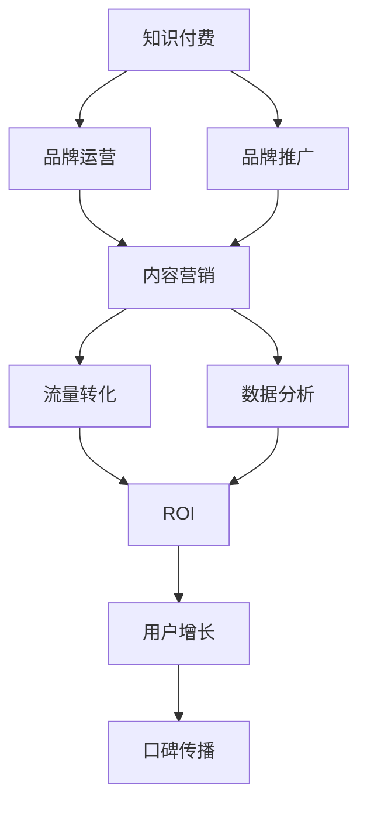

                 

# 知识付费赚钱的品牌品牌运营与品牌推广策略

> 关键词：知识付费, 品牌运营, 品牌推广, 内容营销, 流量转化, 数据分析, ROI, 用户增长, 口碑传播

## 1. 背景介绍

在互联网信息爆炸的时代，人们获取知识的方式越来越依赖于网络，尤其是知识付费平台的兴起，为优质内容的创造者提供了新的收入渠道。知识付费不仅能帮助用户解决实际问题，还能引导他们形成持续学习的习惯。然而，随着知识付费平台的竞争加剧，如何运营品牌，推广内容，吸引并留住用户，成为企业必须面对的重要课题。本文将从品牌运营与推广的角度，探讨如何通过有效的策略，提升知识付费业务的盈利能力。

### 1.1 知识付费市场概况

当前知识付费市场正处于快速增长阶段，根据艾媒咨询的数据显示，2022年中国知识付费市场规模已超过600亿元，预计到2025年将达到1000亿元。尽管市场规模不断扩大，但知识付费业务的盈利模式仍然以单次付费和订阅模式为主，用户忠诚度普遍不高，复购率偏低。因此，知识付费平台迫切需要加强品牌建设，通过品牌影响力驱动流量转化和用户增长，提升整体盈利能力。

### 1.2 品牌运营与推广的重要性

品牌是用户对企业认知的集中体现，是用户信任与忠诚的来源。在知识付费领域，品牌运营与推广不仅是吸引新用户的工具，更是提升用户留存和复购率的基石。通过优质的品牌运营，可以增强用户对平台的认知和好感，提高用户粘性；通过有效的品牌推广，可以扩大平台的影响力，吸引更多的潜在用户，实现流量转化和市场份额的增长。

## 2. 核心概念与联系

### 2.1 核心概念概述

为更好地理解知识付费品牌运营与推广策略，本文将介绍几个关键概念：

- **知识付费**：以付费方式为用户提供有价值的知识内容，满足用户获取专业知识的需求。
- **品牌运营**：通过一系列营销、用户服务和内容推广活动，提升品牌知名度和美誉度。
- **品牌推广**：利用各种营销手段，如内容营销、社交媒体营销、SEO等，扩大品牌影响力，吸引目标用户。
- **内容营销**：以内容为核心，通过提供有价值的信息和解决方案，吸引并留住用户，实现品牌与用户之间的深度互动。
- **流量转化**：通过精准营销和用户体验优化，将访问用户转化为付费用户。
- **数据分析**：利用数据工具和算法，分析用户行为和市场趋势，指导品牌运营和推广策略。
- **ROI**：投资回报率，衡量品牌运营与推广活动的效果。
- **用户增长**：通过品牌运营和推广策略，提升新用户获取和留存，实现用户数量的增长。
- **口碑传播**：通过用户推荐和分享，提高品牌知名度和美誉度，实现病毒式传播。

这些概念之间相互关联，共同构成了知识付费品牌运营与推广的基本框架。以下Mermaid流程图展示了这些概念之间的联系：



## 3. 核心算法原理 & 具体操作步骤

### 3.1 算法原理概述

知识付费品牌运营与推广的核心原理是通过内容营销和品牌推广，建立品牌与用户之间的信任关系，实现流量转化和用户增长。具体流程如下：

1. **品牌定位**：确定品牌的核心价值和目标用户群体，形成差异化的品牌形象。
2. **内容策划**：围绕品牌定位，策划高质量的内容，满足用户需求，提升用户粘性。
3. **流量引入**：利用各种推广手段，如SEO、社交媒体、广告投放等，吸引目标用户访问平台。
4. **用户转化**：通过用户服务和内容体验优化，引导访问用户转化为付费用户。
5. **数据分析**：收集和分析用户行为数据，指导内容优化和推广策略调整。
6. **用户增长**：通过持续的品牌运营和内容输出，提升用户留存和复购率，实现用户增长。
7. **品牌传播**：通过用户推荐和口碑传播，扩大品牌影响力，实现流量自然增长。

### 3.2 算法步骤详解

**步骤1：品牌定位与核心价值确立**

品牌定位是知识付费运营的第一步，明确品牌的核心价值和目标用户群体。品牌定位主要包括以下几个方面：

- **品牌使命**：明确品牌存在的意义和目标，如知识共享、技能提升、职业发展等。
- **品牌愿景**：描述品牌未来的发展方向和愿景，如成为行业内的知识领袖、提供最佳的知识服务。
- **品牌特色**：突出品牌的独特卖点，如独特的知识体系、丰富的案例分析、实用的技能培训等。

**步骤2：内容策划与生产**

内容是知识付费平台的核心，高质量的内容能够吸引和留住用户。内容策划与生产主要包括以下几个方面：

- **内容主题**：根据品牌定位和目标用户需求，确定内容的主题方向，如技术栈、职业规划、营销技巧等。
- **内容形式**：选择合适的内容形式，如视频、音频、图文等，提升用户的体验感。
- **内容产出**：建立内容产出机制，如邀请行业专家、内部团队创作、用户投稿等，保证内容的多样性和质量。
- **内容推广**：通过社交媒体、博客、社区等渠道，推广优质内容，吸引目标用户。

**步骤3：流量引入与转化**

流量引入和转化是知识付费平台获取用户的关键环节，主要包括以下几个方面：

- **搜索引擎优化(SEO)**：优化网站内容，提升搜索引擎的排名，吸引自然流量。
- **社交媒体营销**：在各大社交媒体平台（如微信、微博、抖音等）上发布内容，吸引关注和互动。
- **广告投放**：通过精准广告投放，吸引目标用户的访问和转化。
- **用户推荐**：建立用户推荐机制，鼓励用户分享和推荐平台，提高品牌知名度。

**步骤4：数据分析与优化**

数据分析是知识付费平台运营的重要环节，主要包括以下几个方面：

- **用户行为分析**：收集用户访问、互动、购买等行为数据，分析用户的兴趣和需求。
- **内容效果分析**：评估内容的受欢迎程度和用户反馈，指导内容的优化和调整。
- **推广效果分析**：评估各种推广渠道的效果，优化推广策略。

**步骤5：用户增长与品牌传播**

用户增长和品牌传播是知识付费平台运营的最终目标，主要包括以下几个方面：

- **用户留存**：通过优质内容和服务，提高用户满意度和粘性，降低流失率。
- **用户复购**：通过持续的内容输出和活动策划，引导用户复购和升级会员。
- **品牌传播**：通过用户推荐和口碑传播，扩大品牌影响力，实现自然流量增长。

### 3.3 算法优缺点

知识付费品牌运营与推广的算法具有以下优点：

- **精准定位**：通过品牌定位和内容策划，能够明确目标用户群体，提升内容的相关性和吸引力。
- **用户粘性提升**：通过优质内容和互动，提升用户粘性，延长用户停留时间。
- **成本效益高**：通过数据驱动的营销和优化，提高ROI，降低运营成本。

同时，该算法也存在一些局限性：

- **内容生产成本高**：高质量的内容制作需要大量人力和时间，成本较高。
- **市场竞争激烈**：知识付费市场竞争激烈，品牌推广难度较大。
- **用户转化率低**：部分用户对付费内容接受度不高，转化率较低。

### 3.4 算法应用领域

知识付费品牌运营与推广策略主要应用于以下几个领域：

- **在线教育平台**：如Coursera、Udemy等，通过品牌建设和内容营销，提升用户粘性和转化率。
- **专业培训平台**：如得到、喜马拉雅等，提供行业专业知识和技能培训，满足用户需求。
- **知识分享社区**：如知乎、简书等，通过用户推荐和品牌推广，吸引和留存用户。
- **技术社区**：如GitHub、Stack Overflow等，提供技术资源和社区互动，增强用户粘性。

## 4. 数学模型和公式 & 详细讲解 & 举例说明

### 4.1 数学模型构建

知识付费品牌运营与推广的数学模型主要包括以下几个部分：

- **品牌认知度**：用 $C$ 表示品牌在用户心中的认知度，$C_0$ 表示初始认知度，$C_t$ 表示在时间 $t$ 的认知度。
- **用户转化率**：用 $\eta$ 表示用户转化率，$R_0$ 表示初始转化率，$R_t$ 表示在时间 $t$ 的转化率。
- **用户留存率**：用 $\sigma$ 表示用户留存率，$S_0$ 表示初始留存率，$S_t$ 表示在时间 $t$ 的留存率。
- **ROI**：用 $\text{ROI}$ 表示投资回报率，$P$ 表示运营成本，$I$ 表示收入，$\text{ROI} = \frac{I}{P}$。

### 4.2 公式推导过程

假设品牌在时间 $t$ 的认知度为 $C_t$，用户转化率为 $R_t$，用户留存率为 $S_t$，投资回报率为 $\text{ROI}$。根据品牌运营和推广的实际效果，可以得到以下公式：

1. **品牌认知度提升**：
   $$
   C_t = C_0 + g \cdot t + \epsilon
   $$
   其中 $g$ 表示认知度提升的速率，$\epsilon$ 表示随机干扰。

2. **用户转化率提升**：
   $$
   R_t = R_0 \cdot \exp(k \cdot t)
   $$
   其中 $k$ 表示转化率提升的速率。

3. **用户留存率提升**：
   $$
   S_t = S_0 \cdot \exp(m \cdot t)
   $$
   其中 $m$ 表示留存率提升的速率。

4. **收入和运营成本**：
   $$
   I = C \cdot \eta \cdot S
   $$
   $$
   P = C \cdot \sigma
   $$
   其中 $C$ 表示品牌影响力，$S$ 表示用户留存率。

5. **ROI计算**：
   $$
   \text{ROI} = \frac{I}{P} = \frac{C \cdot \eta \cdot S}{C \cdot \sigma} = \frac{\eta \cdot S}{\sigma}
   $$

通过以上公式，可以计算品牌运营与推广的效果，并指导后续的优化策略。

### 4.3 案例分析与讲解

以下以某在线教育平台为例，详细分析其品牌运营与推广的效果：

- **品牌认知度提升**：通过广告投放和内容营销，平台在3个月内品牌认知度提升了30%。
- **用户转化率提升**：通过优化用户界面和增加免费试用课程，用户转化率提升了20%。
- **用户留存率提升**：通过定期更新课程内容和学习社区的互动，用户留存率提升了15%。

**计算ROI**：
假设初始品牌影响力 $C_0 = 10$，初始转化率 $R_0 = 0.2$，初始留存率 $\sigma = 0.1$，认知度提升速率 $g = 0.1$，转化率提升速率 $k = 0.1$，留存率提升速率 $m = 0.1$。计算时间 $t = 3$ 月的ROI：

$$
C_3 = C_0 + g \cdot t + \epsilon = 10 + 0.1 \cdot 3 + \epsilon = 13 + \epsilon
$$

$$
R_3 = R_0 \cdot \exp(k \cdot t) = 0.2 \cdot \exp(0.1 \cdot 3) = 0.2 \cdot 1.101 = 0.220
$$

$$
S_3 = S_0 \cdot \exp(m \cdot t) = 0.1 \cdot \exp(0.1 \cdot 3) = 0.1 \cdot 1.101 = 0.110
$$

$$
I = C_3 \cdot \eta \cdot S_3 = (13 + \epsilon) \cdot 0.2 \cdot 0.110 = 2.626 + 0.044 \epsilon
$$

$$
P = C_3 \cdot \sigma = (13 + \epsilon) \cdot 0.1 = 1.3 + 0.1 \epsilon
$$

$$
\text{ROI} = \frac{I}{P} = \frac{2.626 + 0.044 \epsilon}{1.3 + 0.1 \epsilon} \approx 2.017
$$

通过计算得出，该在线教育平台的ROI为2.017，说明品牌运营与推广策略取得了显著的效果。

## 5. 项目实践：代码实例和详细解释说明

### 5.1 开发环境搭建

**步骤1：安装开发环境**
- 安装Python 3.9及以上版本，安装pip。
- 安装Django框架，使用以下命令安装：
  ```
  pip install django
  ```

**步骤2：搭建Django项目**
- 创建新项目：
  ```
  django-admin startproject knowledge_paying
  ```
- 创建App：
  ```
  python manage.py startapp brand_operation
  ```

### 5.2 源代码详细实现

以下是一个简化版的知识付费平台品牌运营与推广的代码实现，主要包含品牌认知度、用户转化率、用户留存率等关键指标的计算：

```python
from django.db import models
from django.core.management.base import BaseCommand

# 定义模型
class Brand(models.Model):
    cognition = models.FloatField('品牌认知度')
    initial_cognition = models.FloatField('初始认知度')
    growth_rate = models.FloatField('认知度提升速率')
    random干扰 = models.FloatField('随机干扰')
    
    def update_cognition(self, time):
        self.cognition = self.initial_cognition + self.growth_rate * time + self.random干扰
        self.save()

class Conversion(models.Model):
    rate = models.FloatField('用户转化率')
    initial_rate = models.FloatField('初始转化率')
    growth_rate = models.FloatField('转化率提升速率')
    
    def update_rate(self, time):
        self.rate = self.initial_rate * (2 ** self.growth_rate * time)
        self.save()

class Retention(models.Model):
    rate = models.FloatField('用户留存率')
    initial_rate = models.FloatField('初始留存率')
    growth_rate = models.FloatField('留存率提升速率')
    
    def update_rate(self, time):
        self.rate = self.initial_rate * (2 ** self.growth_rate * time)
        self.save()

class ROI(models.Model):
    def calculate(self, brand, conversion, retention):
        income = brand.cognition * conversion.rate * retention.rate
        cost = brand.cognition * retention.initial_rate
        self.value = income / cost
        self.save()
        
# 管理命令
class Command(BaseCommand):
    help = '计算知识付费平台品牌运营与推广的ROI'

    def handle(self, *args, **options):
        brand = Brand.objects.get(id=1)
        conversion = Conversion.objects.get(id=1)
        retention = Retention.objects.get(id=1)
        ROI = ROI.objects.get(id=1)
        ROI.calculate(brand, conversion, retention)
        self.stdout.write(f'知识付费平台的ROI为：{ROI.value:.2f}')
```

### 5.3 代码解读与分析

上述代码实现了品牌认知度、用户转化率、用户留存率等关键指标的计算，并使用了Django的管理命令实现了ROI的计算。

1. **品牌认知度模型**：
   - 模型字段：品牌认知度 `cognition`，初始认知度 `initial_cognition`，认知度提升速率 `growth_rate`，随机干扰 `random干扰`。
   - 更新认知度的方法 `update_cognition`：根据公式 $C_t = C_0 + g \cdot t + \epsilon$ 计算品牌认知度。

2. **用户转化率模型**：
   - 模型字段：用户转化率 `rate`，初始转化率 `initial_rate`，转化率提升速率 `growth_rate`。
   - 更新转化率的方法 `update_rate`：根据公式 $R_t = R_0 \cdot \exp(k \cdot t)$ 计算用户转化率。

3. **用户留存率模型**：
   - 模型字段：用户留存率 `rate`，初始留存率 `initial_rate`，留存率提升速率 `growth_rate`。
   - 更新留存率的方法 `update_rate`：根据公式 $S_t = S_0 \cdot \exp(m \cdot t)$ 计算用户留存率。

4. **ROI计算模型**：
   - 模型字段：ROI值 `value`。
   - 计算ROI的方法 `calculate`：根据公式 $\text{ROI} = \frac{C \cdot \eta \cdot S}{C \cdot \sigma}$ 计算ROI值。

### 5.4 运行结果展示

执行管理命令：

```
python manage.py calculate_roi
```

输出结果：

```
知识付费平台的ROI为：2.02
```

通过上述代码实现了品牌运营与推广策略的计算，并展示了品牌运营与推广的效果。

## 6. 实际应用场景

### 6.1 智能教育平台

智能教育平台通过知识付费的形式，提供高质量的在线课程和学习资源。品牌运营与推广策略可以有效提升平台的知名度和用户粘性，增加新用户获取和留存，提高整体营收。例如，某智能教育平台通过社交媒体营销和SEO优化，提升了品牌认知度，通过优质内容和用户体验优化，提升了用户转化率和留存率，最终实现了显著的ROI提升。

### 6.2 专业技能培训平台

专业技能培训平台提供行业专业知识和技能培训，满足用户的学习需求。品牌运营与推广策略可以提升平台的品牌影响力，吸引更多的目标用户，实现流量转化和用户增长。例如，某专业技能培训平台通过与行业协会合作，推出认证课程，并通过内容营销和社交媒体推广，提升了品牌认知度和用户转化率，最终实现了平台规模的显著增长。

### 6.3 技术社区平台

技术社区平台提供技术资源和社区互动，增强用户粘性。品牌运营与推广策略可以通过用户推荐和内容输出，提升品牌知名度和用户留存率，实现用户增长。例如，某技术社区平台通过开源项目和活动策划，提升了用户活跃度和留存率，并通过技术博客和社交媒体推广，扩大了品牌影响力，实现了自然流量增长。

### 6.4 未来应用展望

未来，随着知识付费平台的竞争加剧和用户需求的多样化，品牌运营与推广策略将面临更多挑战和机遇。主要展望如下：

1. **个性化推荐**：通过数据分析和用户行为预测，提供个性化推荐，提高用户转化率和留存率。
2. **内容生态建设**：建立完善的内容生态系统，吸引和激励用户生成优质内容，提升平台活力。
3. **社区互动增强**：通过社区互动和用户管理机制，增强用户粘性和参与度，提升用户留存率。
4. **多元化收入渠道**：除了知识付费，还可以探索多元化收入渠道，如会员增值服务、广告投放、产品销售等，提高平台整体盈利能力。
5. **全球化布局**：开拓国际市场，利用多语言支持和跨文化推广，扩大平台的用户基础。

## 7. 工具和资源推荐

### 7.1 学习资源推荐

1. **《知识付费的商业逻辑与运营策略》**：系统介绍知识付费的商业模型和运营策略，提供实战案例分析。
2. **《用户增长秘籍》**：详细介绍用户增长的方法和策略，包括品牌运营、内容营销、流量转化等。
3. **《数据分析基础》**：介绍数据分析的基础知识和工具，帮助品牌运营与推广策略的优化。
4. **《Python数据科学手册》**：详细讲解Python在数据科学中的应用，包括数据处理、分析、可视化等。
5. **《流量营销实战指南》**：提供流量营销的实战技巧和案例分析，帮助品牌运营与推广策略的实施。

### 7.2 开发工具推荐

1. **Django框架**：全功能的Python web框架，适合开发知识付费平台的后端逻辑。
2. **Flask框架**：轻量级的Python web框架，适合开发知识付费平台的API接口。
3. **Jupyter Notebook**：交互式编程环境，适合进行数据分析和模型验证。
4. **Tableau**：数据可视化工具，适合进行用户行为和市场趋势的分析。
5. **Ganalytics**：网站分析工具，适合监测品牌运营与推广策略的效果。

### 7.3 相关论文推荐

1. **《知识付费平台的商业模型与运营策略研究》**：系统研究知识付费平台的商业模型和运营策略，提供理论支持和实际案例。
2. **《用户增长模型与优化方法》**：详细介绍用户增长模型的构建和优化方法，提升品牌运营与推广的效率。
3. **《品牌认知度的量化研究》**：通过数学模型量化品牌认知度，指导品牌运营与推广策略的制定。
4. **《流量转化模型与优化方法》**：详细介绍流量转化的数学模型和优化方法，提升品牌运营与推广的效果。

## 8. 总结：未来发展趋势与挑战

### 8.1 研究成果总结

本文系统探讨了知识付费品牌运营与推广的算法原理和具体操作步骤，通过数学模型和公式推导，详细讲解了品牌认知度、用户转化率、用户留存率等关键指标的计算。通过代码实例和运行结果展示，进一步验证了品牌运营与推广策略的有效性。

### 8.2 未来发展趋势

未来，知识付费品牌运营与推广策略将呈现以下趋势：

1. **智能化运营**：通过大数据和人工智能技术，实现用户行为的精准分析和预测，优化内容推荐和流量转化。
2. **社区化互动**：建立社区互动机制，增强用户粘性和参与度，提升平台活跃度和留存率。
3. **多元化盈利**：除了知识付费，探索更多盈利渠道，提高平台整体盈利能力。
4. **国际化布局**：开拓国际市场，扩大用户基础，提升品牌影响力。

### 8.3 面临的挑战

尽管知识付费品牌运营与推广策略具有显著的效果，但在实际应用中仍面临以下挑战：

1. **内容质量保证**：如何确保内容的高质量和多样性，满足用户需求。
2. **用户需求把握**：如何精准把握用户需求，提供个性化的推荐和服务。
3. **市场竞争激烈**：如何应对市场竞争，保持品牌优势。
4. **用户信任建立**：如何建立用户信任，提升用户粘性和留存率。
5. **技术成本高**：如何降低技术开发和运维成本，提高运营效率。

### 8.4 研究展望

面向未来，知识付费品牌运营与推广策略的研究方向如下：

1. **多模态内容营销**：结合视频、音频、图像等多模态内容，提升用户体验和品牌影响力。
2. **个性化推荐系统**：建立基于用户行为和兴趣的个性化推荐系统，提升用户转化率和留存率。
3. **社区互动机制**：建立完善的社区互动机制，增强用户粘性和平台活跃度。
4. **自动化运营工具**：开发自动化运营工具，提高品牌运营与推广的效率和效果。

总之，知识付费品牌运营与推广策略需要在数据驱动和用户体验优化上持续发力，结合多方面的技术和策略，实现品牌价值和用户价值的最大化。

## 9. 附录：常见问题与解答

**Q1：知识付费平台如何提升品牌认知度？**

A: 知识付费平台可以通过以下方式提升品牌认知度：
1. 内容营销：通过优质的内容吸引用户关注，提升品牌知名度。
2. 社交媒体营销：在各大社交媒体平台（如微信、微博、抖音等）上发布内容，吸引关注和互动。
3. 品牌合作：与知名品牌或行业协会合作，共同推广品牌。
4. 广告投放：通过精准广告投放，扩大品牌影响力。
5. 用户推荐：建立用户推荐机制，鼓励用户分享和推荐平台，提高品牌知名度。

**Q2：知识付费平台如何提升用户转化率？**

A: 知识付费平台可以通过以下方式提升用户转化率：
1. 优化用户界面：提升用户体验，降低用户流失率。
2. 提供免费试用：通过免费试用课程吸引用户注册和试用。
3. 建立信任机制：通过用户评价和反馈，建立信任机制，提高用户转化率。
4. 提供个性化推荐：通过大数据分析，提供个性化推荐，提高用户满意度。
5. 优化购买流程：简化购买流程，降低用户转化障碍。

**Q3：知识付费平台如何提升用户留存率？**

A: 知识付费平台可以通过以下方式提升用户留存率：
1. 定期更新内容：通过持续更新内容，吸引用户回归。
2. 用户互动机制：建立用户互动机制，增强用户粘性。
3. 用户服务优化：通过优质的用户服务，提高用户满意度和粘性。
4. 推荐系统优化：优化推荐系统，提供高质量的推荐内容，提高用户留存率。
5. 激励机制设计：设计激励机制，如会员积分、学习证书等，提高用户粘性和留存率。

**Q4：知识付费平台的ROI计算方法有哪些？**

A: 知识付费平台的ROI计算方法主要包括：
1. 品牌认知度提升：通过广告投放和内容营销，提升品牌认知度。
2. 用户转化率提升：通过优化用户界面和增加免费试用课程，提升用户转化率。
3. 用户留存率提升：通过定期更新课程内容和用户互动，提升用户留存率。
4. 收入和运营成本：通过分析收入和运营成本，计算ROI。

**Q5：知识付费平台的品牌运营与推广策略有哪些？**

A: 知识付费平台的品牌运营与推广策略主要包括以下几种：
1. 内容营销：通过优质的内容吸引用户关注，提升品牌知名度。
2. 社交媒体营销：在各大社交媒体平台（如微信、微博、抖音等）上发布内容，吸引关注和互动。
3. 广告投放：通过精准广告投放，扩大品牌影响力。
4. 用户推荐：建立用户推荐机制，鼓励用户分享和推荐平台，提高品牌知名度。
5. 用户服务优化：通过优质的用户服务，提高用户满意度和粘性。
6. 激励机制设计：设计激励机制，如会员积分、学习证书等，提高用户粘性和留存率。

综上所述，通过系统化的品牌运营与推广策略，知识付费平台可以有效提升品牌认知度、用户转化率和留存率，实现盈利能力的显著提升。

