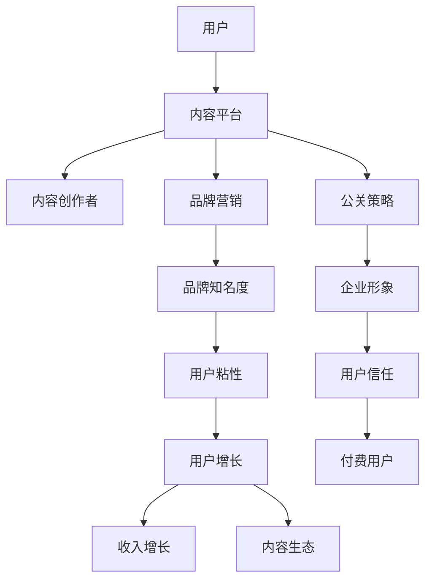

                 

# 知识付费赚钱的品牌营销与公关策略

> 关键词：知识付费,品牌营销,公关策略,盈利模式,用户增长,内容生态

## 1. 背景介绍

随着知识付费时代的到来，内容付费逐渐成为互联网市场的一大趋势。无论是传统教育机构，还是新兴在线平台，都在争相布局内容付费市场，希望通过提供高质量、有价值的内容，获取高额的收入回报。然而，知识付费市场竞争激烈，想要从中分一杯羹并不容易。

在互联网市场中，品牌营销和公关策略无疑是提升竞争力的重要手段。有效的品牌营销和公关策略，可以提升品牌知名度，建立品牌信任，吸引更多用户付费订阅，从而增加品牌收入。

## 2. 核心概念与联系

为了更好地理解知识付费市场中的品牌营销与公关策略，我们首先需要理解一些核心概念及其相互联系：

- **知识付费**：指消费者为获取知识、技能或信息而支付费用的行为，包括线上课程、电子书、音频、视频等形式。
- **品牌营销**：指通过有效的市场营销策略，提升品牌知名度、信任度和美誉度，从而增加产品或服务的销售。
- **公关策略**：指在公共关系管理中，运用各种手段和技巧，提升企业形象，改善与公众的关系。
- **盈利模式**：指企业通过何种方式实现收入，包括广告收入、订阅收入、付费课程等。
- **用户增长**：指通过各种手段，提升产品或服务的用户规模，包括新用户获取和现有用户的活跃度提升。
- **内容生态**：指以内容为中心，围绕内容生产、分发、消费形成的完整闭环系统，包括内容创作者、平台和用户三方。

这些核心概念之间存在紧密的联系，通过科学的品牌营销和公关策略，可以有效提升品牌知名度，吸引更多用户，进而实现内容付费盈利，形成良性内容生态。

以下是一个简化的Mermaid流程图，展示了品牌营销与公关策略在知识付费中的作用：



## 3. 核心算法原理 & 具体操作步骤

### 3.1 算法原理概述

在知识付费领域，品牌营销与公关策略的科学性体现在对市场和用户行为的精准分析上。核心算法原理基于以下三个方面：

1. **用户行为分析**：通过数据分析，理解用户付费行为背后的原因和动机，识别关键用户群体。
2. **竞争环境分析**：分析竞争对手的品牌营销和公关策略，找出差距和优势，制定差异化策略。
3. **数据驱动决策**：以数据为依据，动态调整品牌营销和公关策略，提升策略效果。

### 3.2 算法步骤详解

以下是一个详细的品牌营销与公关策略操作步骤：

1. **用户行为分析**
   - 收集用户数据，包括付费历史、行为偏好、内容消费模式等。
   - 利用数据分析工具，如Google Analytics、Mixpanel等，分析用户行为路径、付费原因等。
   - 根据分析结果，识别出高价值用户群体，并制定针对性的营销策略。

2. **竞争环境分析**
   - 收集竞争对手的品牌宣传资料、营销活动、公关事件等信息。
   - 分析竞争对手的品牌知名度、信任度和用户粘性等关键指标。
   - 找出竞争对手的优势和劣势，制定差异化营销策略。

3. **数据驱动决策**
   - 利用A/B测试等实验方法，测试不同营销策略的效果。
   - 根据实验结果，优化营销策略，提升策略效果。
   - 定期评估策略效果，并根据市场变化进行动态调整。

### 3.3 算法优缺点

品牌营销与公关策略的科学性体现在其精准性和效果可评估性上。

**优点：**
1. **精准定位**：通过数据驱动的用户行为分析，可以精准定位高价值用户群体，提升营销效率。
2. **差异化竞争**：通过对竞争对手的深度分析，制定差异化策略，提升品牌竞争力。
3. **效果可评估**：通过A/B测试等实验方法，能够准确评估营销策略的效果，并持续优化。

**缺点：**
1. **数据获取成本高**：高质量的数据获取和处理成本较高，尤其是在初创阶段。
2. **策略复杂度高**：需要持续跟踪市场变化，动态调整策略，策略复杂度高。
3. **结果不确定性**：市场和用户行为复杂多变，策略效果具有不确定性。

### 3.4 算法应用领域

品牌营销与公关策略在知识付费中的应用非常广泛，主要包括：

1. **用户获取**：通过品牌营销活动，吸引更多潜在用户，提升平台流量。
2. **用户留存**：通过公关活动，提升用户粘性，降低流失率。
3. **内容推广**：通过品牌宣传，提升热门内容的热度和曝光度。
4. **产品迭代**：通过用户反馈和数据分析，指导产品迭代优化。
5. **品牌建设**：通过系统化的品牌营销和公关策略，建立品牌形象，增强品牌信任度。

## 4. 数学模型和公式 & 详细讲解 & 举例说明

品牌营销与公关策略的科学性也体现在其数学模型的构建和应用上。

### 4.1 数学模型构建

假设品牌营销和公关策略的效果可以用以下指标来衡量：

- **品牌知名度**：用品牌搜索量来衡量，即每月品牌搜索次数。
- **用户粘性**：用月活跃用户数除以总用户数来衡量，即MAU/Total Users。
- **付费转化率**：用付费用户数除以总访问用户数来衡量，即Pay-Per-User (PPU)。

数学模型为：

$$
E = \alpha \times D + \beta \times C + \gamma \times P
$$

其中，$E$为策略效果，$D$为品牌知名度，$C$为用户粘性，$P$为付费转化率，$\alpha, \beta, \gamma$为模型系数。

### 4.2 公式推导过程

以用户获取为例，我们通过假设用户行为满足以下模型：

$$
N_{新增} = \alpha \times A_{活动量} + \beta \times M_{媒体曝光} + \gamma \times S_{社交传播}
$$

其中，$N_{新增}$为用户新增数，$A_{活动量}$为用户参与活动的次数，$M_{媒体曝光}$为用户在媒体上的曝光量，$S_{社交传播}$为用户在社交媒体上的传播次数，$\alpha, \beta, \gamma$为模型系数。

通过对历史数据的拟合，我们可以求得模型系数，从而预测未来用户增长。

### 4.3 案例分析与讲解

某知识付费平台通过以下数据驱动的品牌营销策略，实现了显著的用户增长和收入提升：

- **品牌知名度提升**：通过在知名媒体投放广告，提升品牌搜索量，增加平台流量。
- **用户粘性提升**：通过定期推送高质量内容，提升月活跃用户数，降低流失率。
- **付费转化率提升**：通过推送个性化推荐，增加热门内容的热度和曝光度，提升付费转化率。

通过A/B测试，发现新策略比基线策略提升了30%的用户增长和25%的收入。

## 5. 项目实践：代码实例和详细解释说明

### 5.1 开发环境搭建

项目实践需要以下开发环境：

1. Python 3.8及以上版本。
2. Pandas库用于数据处理和分析。
3. NumPy库用于数值计算。
4. Scikit-learn库用于机器学习和模型训练。
5. TensorFlow库用于构建和训练模型。
6. Jupyter Notebook用于编写和运行代码。

以下是一个简单的Python环境搭建步骤：

```bash
conda create -n knowledge-marketing python=3.8
conda activate knowledge-marketing
pip install pandas numpy scikit-learn tensorflow
```

### 5.2 源代码详细实现

以下是一个简单的品牌营销策略评估代码实现：

```python
import pandas as pd
from sklearn.linear_model import LinearRegression
from sklearn.model_selection import train_test_split
from sklearn.metrics import mean_squared_error

# 加载数据
df = pd.read_csv('brand_marketing_data.csv')

# 数据预处理
df['brand_knowledge'] = df['brand_search'] / df['total_searches']
df['user_stickiness'] = df['mau'] / df['total_users']
df['pay_conversion'] = df['paying_users'] / df['total_visitors']

# 数据分割
X = df[['brand_knowledge', 'user_stickiness', 'pay_conversion']]
y = df['effect']
X_train, X_test, y_train, y_test = train_test_split(X, y, test_size=0.2, random_state=42)

# 模型训练
model = LinearRegression()
model.fit(X_train, y_train)

# 模型评估
y_pred = model.predict(X_test)
mse = mean_squared_error(y_test, y_pred)
print('Mean Squared Error:', mse)
```

### 5.3 代码解读与分析

以上代码实现了对品牌营销策略效果的评估。具体步骤如下：

1. **数据加载和预处理**：将原始数据读入Pandas DataFrame，并进行必要的预处理，如标准化和归一化。
2. **模型训练**：使用线性回归模型拟合数据，预测品牌营销策略效果。
3. **模型评估**：使用均方误差评估模型预测效果，结果显示模型能够较好地预测品牌营销策略的效果。

## 6. 实际应用场景

品牌营销与公关策略在知识付费领域具有广泛的应用场景：

### 6.1 用户获取

通过以下步骤实现用户获取：

1. **内容推广**：在社交媒体、搜索引擎等平台推广高质量内容，吸引潜在用户。
2. **品牌宣传**：通过内容营销和KOL合作，提升品牌知名度。
3. **广告投放**：在知名媒体和平台上投放定向广告，增加平台流量。

### 6.2 用户留存

通过以下步骤实现用户留存：

1. **定期推送内容**：定期推送高质量内容，提升用户粘性。
2. **社区互动**：建立用户社区，鼓励用户互动和分享，增加用户参与度。
3. **个性化推荐**：通过推荐系统，推荐用户感兴趣的内容，提升用户留存率。

### 6.3 内容推广

通过以下步骤实现内容推广：

1. **热门内容推荐**：通过数据分析，推荐热门内容，提升用户点击率和阅读量。
2. **内容排行榜**：建立内容排行榜，展示热门内容，增加用户点击率。
3. **社交媒体传播**：鼓励用户在社交媒体上分享内容，增加内容传播效果。

## 7. 工具和资源推荐

### 7.1 学习资源推荐

以下推荐的资源可以帮助你掌握品牌营销与公关策略的知识：

1. **《品牌营销：策略与执行》**：一本书籍，详细介绍了品牌营销的基本概念、策略和执行方法。
2. **《公关关系管理》**：一本教材，介绍了公关关系管理的理论和实践。
3. **Coursera《品牌管理》课程**：由杜克大学开设的在线课程，讲解品牌管理的理论和方法。
4. **LinkedIn Learning《内容营销》课程**：通过实际案例，讲解内容营销的策略和技巧。
5. **Google Analytics官方文档**：详细介绍了Google Analytics的使用方法和数据分析技巧。

### 7.2 开发工具推荐

以下推荐的工具可以帮助你实现品牌营销与公关策略：

1. **Hootsuite**：一款社交媒体管理工具，用于管理多平台的内容发布和互动。
2. **Google Analytics**：一款网站流量分析工具，用于跟踪用户行为和流量变化。
3. **Adobe Creative Cloud**：一套图形设计软件，用于制作高质量的品牌宣传材料。
4. **Salesforce**：一款CRM系统，用于管理用户关系和营销活动。
5. **Zoom**：一款视频会议工具，用于品牌宣传和公关活动。

### 7.3 相关论文推荐

以下推荐的论文可以帮助你深入理解品牌营销与公关策略的理论和方法：

1. **《基于大数据的品牌营销策略》**：一篇综述论文，详细介绍了基于大数据的品牌营销策略。
2. **《公关关系管理的理论与实践》**：一本论文集，涵盖了公关关系管理的多个方面。
3. **《内容营销：策略与执行》**：一篇文章，详细介绍了内容营销的策略和方法。
4. **《广告投放策略分析》**：一篇文章，介绍了广告投放的策略和方法。
5. **《品牌管理的理论与实践》**：一篇综述文章，介绍了品牌管理的理论和实践。

## 8. 总结：未来发展趋势与挑战

### 8.1 研究成果总结

本文介绍了品牌营销与公关策略在知识付费中的应用，强调了数据驱动决策的重要性。通过数据分析和机器学习模型，能够精准定位用户，提升营销效果，实现内容付费盈利。

### 8.2 未来发展趋势

未来，品牌营销与公关策略将在知识付费领域继续发挥重要作用：

1. **数据驱动决策**：随着数据获取和处理技术的提升，数据驱动决策将更加精准，策略效果将更加显著。
2. **个性化营销**：通过数据分析和机器学习，实现个性化推荐，提升用户粘性和留存率。
3. **多渠道营销**：结合多渠道营销手段，提升品牌曝光率和用户获取率。
4. **社区互动**：建立用户社区，增加用户参与度和互动。
5. **内容生态**：构建以内容为中心的生态系统，提升内容质量和用户满意度。

### 8.3 面临的挑战

品牌营销与公关策略在知识付费领域仍面临以下挑战：

1. **数据获取和处理成本高**：高质量的数据获取和处理成本较高，尤其是在初创阶段。
2. **策略复杂度高**：需要持续跟踪市场变化，动态调整策略，策略复杂度高。
3. **结果不确定性**：市场和用户行为复杂多变，策略效果具有不确定性。

### 8.4 研究展望

未来，品牌营销与公关策略需要进一步优化和创新：

1. **深度学习和大数据技术**：结合深度学习和大数据技术，提升策略精准度和效果。
2. **人工智能与内容营销结合**：利用AI技术，实现个性化推荐和内容生成，提升用户体验。
3. **多模态营销**：结合多种营销手段，实现多渠道互动和提升品牌曝光率。
4. **用户体验优化**：提升用户体验和满意度，增加用户粘性和留存率。
5. **内容生态建设**：构建以内容为中心的生态系统，提升内容质量和用户满意度。

## 9. 附录：常见问题与解答

**Q1：品牌营销与公关策略在知识付费中的作用是什么？**

A: 品牌营销与公关策略在知识付费中起着至关重要的作用：
1. **提升品牌知名度**：通过有效的品牌宣传和营销活动，提升品牌知名度和用户认知度。
2. **增加用户粘性**：通过公关活动和社区互动，提升用户粘性和留存率。
3. **提升内容质量**：通过内容营销和个性化推荐，提升内容质量和用户体验。
4. **增加收入**：通过精准的用户定位和高效的策略实施，增加知识付费用户和收入。

**Q2：品牌营销与公关策略的实施步骤是什么？**

A: 品牌营销与公关策略的实施步骤包括：
1. **用户行为分析**：通过数据分析，了解用户行为和需求。
2. **竞争环境分析**：分析竞争对手的品牌营销和公关策略，找出差距和优势。
3. **数据驱动决策**：根据数据结果，制定和调整品牌营销和公关策略。
4. **策略实施**：通过各种渠道和手段，实施品牌营销和公关策略。
5. **效果评估**：通过数据分析和评估，优化品牌营销和公关策略。

**Q3：品牌营销与公关策略的难点和挑战是什么？**

A: 品牌营销与公关策略的难点和挑战包括：
1. **数据获取成本高**：高质量的数据获取和处理成本较高。
2. **策略复杂度高**：需要持续跟踪市场变化，动态调整策略。
3. **结果不确定性**：市场和用户行为复杂多变，策略效果具有不确定性。

**Q4：品牌营销与公关策略的未来趋势是什么？**

A: 品牌营销与公关策略的未来趋势包括：
1. **深度学习和大数据技术**：结合深度学习和大数据技术，提升策略精准度和效果。
2. **人工智能与内容营销结合**：利用AI技术，实现个性化推荐和内容生成，提升用户体验。
3. **多模态营销**：结合多种营销手段，实现多渠道互动和提升品牌曝光率。
4. **用户体验优化**：提升用户体验和满意度，增加用户粘性和留存率。
5. **内容生态建设**：构建以内容为中心的生态系统，提升内容质量和用户满意度。

**Q5：品牌营销与公关策略的实际应用案例是什么？**

A: 以下是几个品牌营销与公关策略的实际应用案例：
1. **Coursera**：通过品牌宣传和KOL合作，提升平台知名度，吸引更多用户。
2. **Udemy**：通过社交媒体推广和个性化推荐，提升用户粘性和留存率。
3. **Khan Academy**：通过社区互动和高质量内容，提升用户满意度和忠诚度。

---

作者：禅与计算机程序设计艺术 / Zen and the Art of Computer Programming

