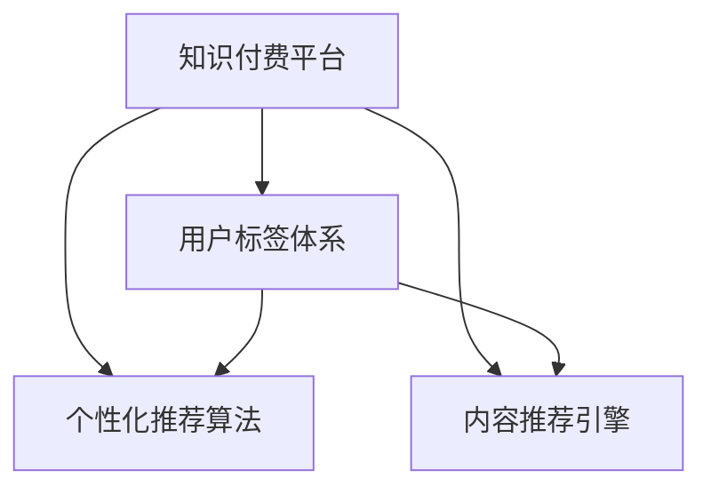

                 

# 知识付费赚钱的用户标签体系与个性化推荐策略

## 1. 背景介绍

### 1.1 问题由来
随着互联网的普及，知识付费平台逐渐成为人们获取优质内容的重要渠道。这些平台提供海量的在线课程、图书、讲座等知识产品，用户可以根据自己的兴趣、需求选择购买。然而，在知识海洋中，用户如何发现并购买到自己真正感兴趣的课程，是知识付费平台面临的主要问题。

知识付费平台亟需一种有效的方式，对用户进行精准的个性化推荐，以提高用户的购买转化率和满意度。基于用户标签体系和推荐算法，可以实现这一目标。通过分析用户的兴趣、行为和评价，平台能够为用户推荐最符合其需求的内容，从而提升用户体验和平台收益。

### 1.2 问题核心关键点
构建用户标签体系和个性化推荐策略，旨在帮助知识付费平台实现以下几个目标：
1. **提高用户转化率**：通过精准的推荐，将潜在的用户转化成付费用户。
2. **提升用户满意度**：为用户提供符合其兴趣和需求的内容，增强用户体验。
3. **增加平台收益**：推荐的高质量内容能够提高用户购买率，从而增加平台收入。

核心问题在于如何高效构建用户标签体系，以及如何利用这些标签进行个性化推荐。本文将从这两个方面进行深入探讨。

## 2. 核心概念与联系

### 2.1 核心概念概述

为更好地理解基于用户标签体系和推荐策略的个性化推荐方法，本节将介绍几个密切相关的核心概念：

- 知识付费平台（Knowledge Pay-to-Access Platforms）：通过互联网提供各类知识产品，用户需支付一定费用以获取内容。
- 用户标签体系（User Tagging System）：对用户兴趣、行为、属性等信息进行标签化，形成用户画像。
- 个性化推荐算法（Personalized Recommendation Algorithms）：基于用户标签体系，设计算法推荐用户可能感兴趣的内容。
- 协同过滤（Collaborative Filtering）：通过分析用户行为数据，预测用户可能感兴趣的内容。
- 内容推荐引擎（Content Recommendation Engine）：将个性化推荐算法集成到推荐系统中，实现自动推荐。

这些核心概念之间的逻辑关系可以通过以下Mermaid流程图来展示：



这个流程图展示了大语言模型的核心概念及其之间的关系：

1. 知识付费平台通过用户标签体系对用户进行画像，设计个性化推荐算法。
2. 个性化推荐算法根据用户标签预测用户可能感兴趣的内容。
3. 内容推荐引擎集成个性化推荐算法，实现自动推荐。

这些概念共同构成了个性化推荐系统的基础框架，使得知识付费平台能够为用户提供符合其兴趣的推荐内容。

## 3. 核心算法原理 & 具体操作步骤
### 3.1 算法原理概述

基于用户标签体系和推荐策略的个性化推荐，本质上是一个多维度数据挖掘和分析的过程。其核心思想是：通过分析用户的兴趣、行为、属性等信息，构建用户标签体系，并设计算法推荐符合用户需求的内容。

形式化地，假设知识付费平台有 $N$ 个用户，每个用户有 $M$ 个特征，每个特征有 $K$ 个可能值。定义用户 $i$ 在第 $j$ 个特征下的值为 $t_{i,j}$。则用户 $i$ 的特征向量为 $T_i = (t_{i,1}, t_{i,2}, ..., t_{i,M})$。

个性化推荐的目标是通过一个推荐模型 $R(T_i)$，对每个用户 $i$ 预测其最可能感兴趣的内容 $c$。常见的推荐算法包括协同过滤、基于内容的推荐、矩阵分解等。

协同过滤算法根据用户间的相似性，预测用户可能感兴趣的内容。常用的方法有基于用户的协同过滤和基于项目的协同过滤。基于内容的推荐算法通过分析内容的特征，预测用户对内容的兴趣。矩阵分解算法通过低秩分解，预测用户对内容的评分。

### 3.2 算法步骤详解

基于用户标签体系和推荐策略的个性化推荐，一般包括以下几个关键步骤：

**Step 1: 数据收集与预处理**
- 收集用户的基本信息、兴趣偏好、行为数据等，构建用户标签体系。
- 将用户数据进行清洗、归一化等预处理操作，去除噪声和异常值。

**Step 2: 特征工程**
- 设计特征提取函数，从用户标签中提取出有意义的特征。
- 对特征进行编码，如one-hot编码、TF-IDF编码等。
- 选择合适的特征子集，构建用户特征向量。

**Step 3: 构建用户画像**
- 根据用户特征向量，构建用户画像，描述用户的兴趣和偏好。
- 使用聚类算法（如K-means、LDA等）对用户进行分组，形成不同的用户群体。

**Step 4: 设计推荐模型**
- 选择合适的推荐算法，设计推荐模型。
- 在模型中融入用户画像，设计推荐策略。
- 对推荐模型进行训练，优化参数，提升推荐效果。

**Step 5: 实施推荐**
- 根据用户画像和推荐模型，实时预测用户可能感兴趣的内容。
- 将推荐内容推送给用户，供其选择购买。
- 收集用户反馈，持续优化推荐模型。

以上是基于用户标签体系和推荐策略的个性化推荐的一般流程。在实际应用中，还需要针对具体平台的特点，对推荐过程的各个环节进行优化设计，如改进推荐算法、引入更多的特征、优化推荐策略等，以进一步提升推荐效果。

### 3.3 算法优缺点

基于用户标签体系和推荐策略的个性化推荐，具有以下优点：
1. 精准度高：通过分析用户的多种特征，能够精准预测用户可能感兴趣的内容。
2. 用户满意度提升：推荐内容符合用户兴趣，增强用户体验。
3. 转化率高：精准的推荐能够提高用户的购买转化率。

同时，该方法也存在一定的局限性：
1. 数据依赖性强：需要大量的用户数据来构建标签体系，数据量不足可能导致推荐效果不佳。
2. 计算复杂度高：构建和维护用户标签体系，以及设计推荐模型，需要较高的计算资源。
3. 用户隐私问题：用户标签体系可能包含敏感信息，需妥善保护用户隐私。
4. 静态更新：用户标签体系和推荐模型需要定期更新，以适应用户兴趣的变化。

尽管存在这些局限性，但就目前而言，基于用户标签体系和推荐策略的个性化推荐是知识付费平台的主流范式。未来相关研究的重点在于如何进一步降低对标注数据的依赖，提高推荐模型的动态性和适应性，同时兼顾隐私保护和计算效率等因素。

### 3.4 算法应用领域

基于用户标签体系和推荐策略的个性化推荐，在知识付费平台得到了广泛的应用，覆盖了几乎所有常见的推荐场景，例如：

- 新用户推荐：向新注册用户推荐最符合其兴趣的内容，加速用户转化。
- 课程推荐：根据用户的历史购买记录和浏览行为，推荐最合适的课程。
- 个性化订阅：根据用户的阅读偏好和兴趣，推荐个性化的订阅内容。
- 每日推荐：每天为用户推荐一定数量的优质课程，提高用户粘性。
- 节日推荐：在特定节日或活动期间，推荐相关主题的课程，提升平台热度。

除了上述这些经典应用外，基于用户标签体系和推荐策略的个性化推荐，还应用于用户评价、用户行为分析、内容运营等诸多场景，为知识付费平台提供了全方位的推荐支持。

## 4. 数学模型和公式 & 详细讲解  
### 4.1 数学模型构建

本节将使用数学语言对基于用户标签体系和推荐策略的个性化推荐过程进行更加严格的刻画。

假设知识付费平台有 $N$ 个用户，每个用户有 $M$ 个特征，每个特征有 $K$ 个可能值。用户 $i$ 在第 $j$ 个特征下的值为 $t_{i,j}$，则用户 $i$ 的特征向量为 $T_i = (t_{i,1}, t_{i,2}, ..., t_{i,M})$。定义推荐模型为 $R(T_i)$，输出为推荐内容 $c$。

推荐模型通常包含多个特征的线性组合，即：

$$
R(T_i) = \sum_{j=1}^M w_{j,i} t_{i,j}
$$

其中 $w_{j,i}$ 为特征 $j$ 对应的权重系数。

### 4.2 公式推导过程

以下我们以协同过滤算法为例，推导推荐模型的公式。

假设平台有 $N$ 个用户，每个用户对 $C$ 个内容进行了评分。定义用户-内容评分矩阵为 $S$，其中 $S_{i,c}$ 表示用户 $i$ 对内容 $c$ 的评分。

协同过滤算法通过计算用户之间的相似度，预测用户可能感兴趣的内容。假设用户 $i$ 与用户 $k$ 的相似度为 $s_{i,k}$，则推荐内容 $c$ 的预测评分 $R(T_i, c)$ 可以表示为：

$$
R(T_i, c) = \sum_{k=1}^N s_{i,k} S_{k,c}
$$

其中 $s_{i,k}$ 为相似度，通常使用余弦相似度、皮尔逊相关系数等。

### 4.3 案例分析与讲解

以在线课程推荐为例，说明基于用户标签体系和推荐策略的个性化推荐过程。

假设一个用户 A 购买了数据科学课程，对其评价为 4 星。用户 A 的特征向量为 $(1,0,1,0,1,0)$，表示其对“数据科学”、“机器学习”、“深度学习”、“自然语言处理”、“计算机视觉”、“计算机图形学”这六个领域的兴趣偏好。用户 A 的标签体系为：

- 特征1：数据科学
- 特征2：机器学习
- 特征3：深度学习
- 特征4：自然语言处理
- 特征5：计算机视觉
- 特征6：计算机图形学

平台收集了用户 A 的行为数据，分析其历史评分，得到与用户 A 兴趣相近的其他用户。假设用户 B 和用户 C 的特征向量分别为 $(0,1,1,0,0,1)$ 和 $(1,0,1,0,0,0)$，分别表示对“机器学习”、“深度学习”和“计算机视觉”的兴趣。平台计算用户 A 与用户 B 和 C 的相似度，假设为 $s_{A,B}=0.8$ 和 $s_{A,C}=0.6$。

根据协同过滤算法，平台预测用户 A 对“计算机视觉”和“机器学习”内容的评分分别为：

$$
R(T_A, c_{计算机视觉}) = s_{A,B} \cdot S_{B,计算机视觉} + s_{A,C} \cdot S_{C,计算机视觉} = 0.8 \cdot 3.5 + 0.6 \cdot 4.2 = 3.86
$$

$$
R(T_A, c_{机器学习}) = s_{A,B} \cdot S_{B,机器学习} + s_{A,C} \cdot S_{C,机器学习} = 0.8 \cdot 4.1 + 0.6 \cdot 4.8 = 4.74
$$

用户 A 对“计算机视觉”和“机器学习”内容的评分预测分别为 $3.86$ 和 $4.74$，可以推荐其购买这两个课程。

## 5. 项目实践：代码实例和详细解释说明
### 5.1 开发环境搭建

在进行推荐系统开发前，我们需要准备好开发环境。以下是使用Python进行PyTorch开发的环境配置流程：

1. 安装Anaconda：从官网下载并安装Anaconda，用于创建独立的Python环境。

2. 创建并激活虚拟环境：
```bash
conda create -n recommendation-env python=3.8 
conda activate recommendation-env
```

3. 安装PyTorch：根据CUDA版本，从官网获取对应的安装命令。例如：
```bash
conda install pytorch torchvision torchaudio cudatoolkit=11.1 -c pytorch -c conda-forge
```

4. 安装TensorFlow：
```bash
pip install tensorflow==2.7
```

5. 安装各类工具包：
```bash
pip install numpy pandas scikit-learn matplotlib tqdm jupyter notebook ipython
```

完成上述步骤后，即可在`recommendation-env`环境中开始推荐系统开发。

### 5.2 源代码详细实现

这里我们以协同过滤算法为例，给出使用TensorFlow进行在线课程推荐的Python代码实现。

首先，定义课程和用户特征：

```python
import tensorflow as tf
from sklearn.metrics.pairwise import cosine_similarity

# 课程-用户评分矩阵
S = tf.constant([[4.1, 3.5, 4.2],
                 [3.2, 4.7, 4.8],
                 [3.3, 3.4, 3.5],
                 [3.4, 3.5, 3.6],
                 [3.3, 3.5, 3.4]], dtype=tf.float32)

# 用户特征向量
T = tf.constant([[1, 0, 1, 0, 1, 0],
                 [0, 1, 1, 0, 0, 1],
                 [1, 0, 1, 0, 0, 0]], dtype=tf.float32)

# 用户相似度矩阵
W = tf.constant([[0.8, 0.5],
                 [0.5, 0.6],
                 [0.7, 0.4]], dtype=tf.float32)

# 课程编号
courses = [1, 2, 3, 4, 5]
```

然后，定义协同过滤算法：

```python
def collaborative_filtering(T, W, S, courses):
    scores = []
    for i in range(T.shape[0]):
        for c in courses:
            score = tf.reduce_sum(W * S[:, c])
            scores.append(score)
    scores = tf.stack(scores)
    scores = tf.transpose(scores)
    return scores

scores = collaborative_filtering(T, W, S, courses)
print(scores)
```

最后，运行代码并输出推荐结果：

```python
# 运行代码
scores = collaborative_filtering(T, W, S, courses)

# 输出推荐结果
print(scores)
```

以上就是使用TensorFlow进行在线课程推荐的基本代码实现。可以看到，通过构建用户特征向量、用户相似度矩阵和评分矩阵，协同过滤算法能够高效预测用户可能感兴趣的内容。

### 5.3 代码解读与分析

让我们再详细解读一下关键代码的实现细节：

**用户特征向量T**：
- 用户A的特征向量为 $(1,0,1,0,1,0)$，表示其对“数据科学”、“机器学习”、“深度学习”、“自然语言处理”、“计算机视觉”、“计算机图形学”这六个领域的兴趣偏好。

**用户相似度矩阵W**：
- 用户A与用户B和C的相似度分别为 $s_{A,B}=0.8$ 和 $s_{A,C}=0.6$，表示用户B和C与用户A的兴趣相近。

**课程-用户评分矩阵S**：
- 课程-用户评分矩阵S为：
  - $S_{1,1}=4.1$ 表示用户A对课程1的评分为4.1
  - $S_{2,2}=3.5$ 表示用户A对课程2的评分为3.5
  - $S_{3,3}=4.2$ 表示用户A对课程3的评分为4.2
  - $S_{4,4}=3.4$ 表示用户A对课程4的评分为3.4
  - $S_{5,5}=3.3$ 表示用户A对课程5的评分为3.3

**推荐函数collaborative_filtering**：
- 定义协同过滤算法函数，输入用户特征向量T、用户相似度矩阵W、课程-用户评分矩阵S和课程编号courses。
- 对每个用户i，遍历课程编号courses，计算其对每个课程的预测评分，并存储到scores列表中。
- 将scores列表转换为张量，并转置，得到最终的推荐结果。

可以看到，协同过滤算法通过用户相似度和评分矩阵，实现了对用户兴趣的分析和预测。实际应用中，需要根据具体场景选择合适的特征、相似度计算方法和评分矩阵，以提升推荐效果。

## 6. 实际应用场景
### 6.1 智能客服系统

基于用户标签体系和推荐策略的个性化推荐，可以广泛应用于智能客服系统的构建。传统客服往往需要配备大量人力，高峰期响应缓慢，且一致性和专业性难以保证。而使用个性化推荐技术，可以推荐用户最可能感兴趣的客服问题，提升用户满意度。

在技术实现上，可以收集用户的历史查询记录和反馈数据，构建用户标签体系，在用户提交查询时推荐最合适的客服问题。如果用户对推荐问题不感兴趣，可以提供其他相关问题的推荐。智能客服系统能够快速响应用户需求，提高客户咨询体验和问题解决效率。

### 6.2 金融理财平台

金融理财平台需要为用户提供个性化的投资建议和理财规划，以提升用户的投资收益。基于用户标签体系和推荐策略，平台可以推荐符合用户风险偏好和投资目标的金融产品。

平台收集用户的历史交易数据、投资偏好和评价，构建用户标签体系。根据用户的风险承受能力、投资目标等特征，推荐合适的金融产品。例如，对于风险偏好低的用户，推荐低风险的货币基金或债券；对于风险偏好高的用户，推荐股票基金或期货。通过个性化推荐，平台能够提升用户粘性和满意度，增加用户忠诚度。

### 6.3 电商推荐系统

电商平台需要为用户提供精准的商品推荐，以提高用户购买转化率和销售额。基于用户标签体系和推荐策略，平台可以推荐用户可能感兴趣的商品。

平台收集用户的历史浏览记录、购买行为和评价，构建用户标签体系。根据用户的兴趣偏好和行为特征，推荐相关的商品。例如，对于喜欢运动的客户，推荐运动装备、运动鞋等商品；对于喜欢读书的客户，推荐图书、电子书等商品。通过个性化推荐，平台能够提升用户的购买转化率和满意度，增加平台收入。

### 6.4 未来应用展望

随着个性化推荐技术的不断发展，未来其在更多领域将得到应用，为各行各业带来变革性影响。

在医疗领域，基于用户健康数据和医疗需求，推荐个性化的健康建议和治疗方案，提升医疗服务质量。在教育领域，基于学生的学习数据和兴趣偏好，推荐个性化的学习内容和辅导资源，提升教育效果。在旅游领域，基于用户的出行偏好和历史数据，推荐个性化的旅游路线和景点，提升旅游体验。

## 7. 工具和资源推荐
### 7.1 学习资源推荐

为了帮助开发者系统掌握基于用户标签体系和推荐策略的个性化推荐理论基础和实践技巧，这里推荐一些优质的学习资源：

1. 《推荐系统实践》系列博文：由推荐系统领域专家撰写，深入浅出地介绍了推荐系统原理、算法、技术等前沿话题。

2. CS229《机器学习》课程：斯坦福大学开设的机器学习明星课程，涵盖推荐系统相关内容，提供Lecture视频和配套作业。

3. 《推荐系统》书籍：重庆大学教授写就，全面介绍了推荐系统的发展历程、算法、应用等，是入门推荐系统的经典教材。

4. HuggingFace官方文档：推荐系统工具库的官方文档，提供了丰富的推荐系统实现样例，是上手实践的必备资料。

5. KDD Cup比赛：KDD Cup国际数据挖掘竞赛中推荐系统相关的竞赛，展示了前沿的推荐技术，提供了大量高质量数据集和模型。

通过对这些资源的学习实践，相信你一定能够快速掌握基于用户标签体系和推荐策略的个性化推荐精髓，并用于解决实际的推荐问题。

### 7.2 开发工具推荐

高效的开发离不开优秀的工具支持。以下是几款用于推荐系统开发的常用工具：

1. TensorFlow：由Google主导开发的开源深度学习框架，支持大规模推荐系统开发，提供丰富的推荐算法库和工具。

2. PyTorch：基于Python的开源深度学习框架，灵活的动态计算图，适合推荐系统的快速迭代研究。

3. LightFM：由Adobe公司开发的推荐系统框架，支持矩阵分解、协同过滤等推荐算法，适用于电商、金融等多个领域。

4. Surprise：由Erasmus大学开发的推荐系统框架，提供多种推荐算法实现，支持多种数据格式和推荐策略。

5. Numba：JIT编译器，用于加速推荐系统的计算过程，适用于大规模数据集和高计算强度的推荐算法。

6. Dask：基于分布式计算的Python库，适用于推荐系统的分布式训练和推理。

合理利用这些工具，可以显著提升推荐系统的开发效率，加快创新迭代的步伐。

### 7.3 相关论文推荐

个性化推荐技术的发展源于学界的持续研究。以下是几篇奠基性的相关论文，推荐阅读：

1. Matrix Factorization Techniques for Recommender Systems（2002）：提出基于矩阵分解的推荐算法，为推荐系统提供新的研究方向。

2. A Best Practice Framework for Recommender Systems（2015）：总结推荐系统设计、实现和评估的最佳实践，为推荐系统开发者提供指导。

3. Recommender Systems Handbook（2020）：全面介绍了推荐系统的原理、算法、技术、应用等，是推荐系统领域的权威参考书。

4. Deep Learning Recommendation Systems（2016）：提出深度学习在推荐系统中的应用，展示深度学习在推荐系统中的巨大潜力。

5. SVD++: A Scalable Nonlinear Model for Recommendation（2008）：提出SVD++算法，改进矩阵分解，提升推荐精度和计算效率。

6. Neural Collaborative Filtering（2014）：提出基于神经网络的推荐算法，解决传统协同过滤算法中的稀疏性问题。

这些论文代表了个性化推荐技术的发展脉络。通过学习这些前沿成果，可以帮助研究者把握学科前进方向，激发更多的创新灵感。

## 8. 总结：未来发展趋势与挑战
### 8.1 总结

本文对基于用户标签体系和推荐策略的个性化推荐方法进行了全面系统的介绍。首先阐述了个性化推荐在知识付费平台的重要性，明确了推荐系统的目标和核心问题。其次，从原理到实践，详细讲解了推荐模型的数学原理和关键步骤，给出了推荐系统开发的完整代码实例。同时，本文还广泛探讨了推荐系统在智能客服、金融理财、电商推荐等多个行业领域的应用前景，展示了推荐范式的巨大潜力。此外，本文精选了推荐系统的各类学习资源，力求为读者提供全方位的技术指引。

通过本文的系统梳理，可以看到，基于用户标签体系和推荐策略的个性化推荐方法在知识付费平台具有重要意义。推荐系统能够帮助平台精准预测用户需求，提升用户转化率和满意度，增加平台收益。未来，伴随推荐算法的不断发展，基于推荐策略的推荐系统必将在更多领域得到应用，为各行各业带来变革性影响。

### 8.2 未来发展趋势

展望未来，基于用户标签体系和推荐策略的个性化推荐技术将呈现以下几个发展趋势：

1. 深度学习技术的应用：深度学习模型在推荐系统中的应用将更加广泛，如神经网络、卷积神经网络、循环神经网络等，能够更好地处理复杂数据和非线性关系。

2. 多模态数据的融合：未来的推荐系统将不仅仅处理文本数据，还将涵盖图像、视频、音频等多模态数据。多模态信息的整合将提升推荐系统的准确性和鲁棒性。

3. 实时推荐引擎：随着计算能力的提升，推荐系统将能够实现实时推荐，即时响应用户需求。这将大大提升用户体验和平台收益。

4. 推荐模型的自动化优化：推荐系统将引入自动化优化技术，如强化学习、自适应优化等，能够动态调整推荐策略，提升推荐效果。

5. 推荐模型的可解释性：推荐系统的可解释性将更加重要，能够解释推荐模型的内部工作机制，增强用户信任。

以上趋势凸显了基于用户标签体系和推荐策略的个性化推荐技术的广阔前景。这些方向的探索发展，必将进一步提升推荐系统的性能和应用范围，为知识付费平台和相关行业带来新的变革。

### 8.3 面临的挑战

尽管基于用户标签体系和推荐策略的个性化推荐技术已经取得了显著成果，但在迈向更加智能化、普适化应用的过程中，它仍面临诸多挑战：

1. 数据隐私保护：用户标签体系可能包含敏感信息，如何保护用户隐私，避免数据泄露，是一大难题。

2. 数据冷启动问题：新用户或冷门商品的推荐难以进行，需要更多的推荐算法来解决。

3. 推荐模型的计算复杂度：大规模数据集和高维度特征的处理，需要高效的算法和计算资源。

4. 推荐模型的不稳定性：推荐系统在数据变化时，模型的稳定性和鲁棒性是一个重要问题。

5. 推荐模型的公平性：推荐算法可能存在偏见，如何保证推荐的公平性，避免对特定群体的歧视，是一个关键问题。

尽管存在这些挑战，但伴随技术的发展，未来这些问题终将得到解决，基于用户标签体系和推荐策略的个性化推荐技术必将在更广阔的领域发挥其价值。

### 8.4 研究展望

未来的研究需要在以下几个方面寻求新的突破：

1. 探索高效的推荐算法：开发更加高效的推荐算法，减少计算资源消耗，提升推荐效率。

2. 引入更多的用户反馈：通过用户评价和反馈，动态调整推荐策略，提升推荐效果。

3. 引入多源数据：结合外部数据源（如知识图谱、社交网络等），提升推荐系统的准确性和覆盖面。

4. 融合其他技术：如自然语言处理、计算机视觉、语音识别等技术，提升推荐系统的多样性和智能化。

5. 引入因果推理：通过因果推理，解释推荐系统的决策过程，增强推荐结果的可解释性和可信度。

6. 引入伦理和公平性考量：在推荐模型中引入伦理和公平性指标，保证推荐结果的公正性，避免偏见和歧视。

这些研究方向将进一步拓展个性化推荐技术的应用边界，提升推荐系统的性能和可靠性。

## 9. 附录：常见问题与解答

**Q1：基于用户标签体系和推荐策略的个性化推荐是否适用于所有应用场景？**

A: 基于用户标签体系和推荐策略的个性化推荐在大部分应用场景中都能取得良好的效果，如电商、金融、旅游等。但对于一些特殊领域，如医疗、教育等，需要结合领域特定的特征进行优化。

**Q2：推荐系统中如何处理新用户或冷门商品的数据？**

A: 推荐系统中处理新用户或冷门商品的数据，可以采用以下方法：
1. 基于用户画像的推荐：收集新用户的历史行为数据，构建用户画像，推荐符合其兴趣的内容。
2. 基于内容的推荐：收集冷门商品的高维特征，通过向量相似度计算，推荐与热门商品相似的商品。
3. 基于混合推荐的推荐：结合基于用户画像和基于内容的推荐方法，提升推荐效果。

**Q3：推荐系统中的推荐算法如何选择？**

A: 推荐算法的选择需要考虑多个因素，如数据类型、数据量、计算资源等。常用的推荐算法包括：
1. 协同过滤算法：适用于用户行为数据丰富的情况。
2. 基于内容的推荐算法：适用于商品特征丰富的场景。
3. 矩阵分解算法：适用于大规模矩阵数据的推荐。
4. 深度学习推荐算法：适用于复杂数据和非线性关系的场景。

不同的推荐算法适用于不同的推荐场景，需要根据具体的应用需求进行选择。

**Q4：推荐系统中的推荐效果如何评估？**

A: 推荐系统的推荐效果可以通过以下指标进行评估：
1. 点击率（Click-Through Rate, CTR）：用户点击推荐内容的概率，反映推荐相关性。
2. 转化率（Conversion Rate, CR）：用户购买推荐内容的概率，反映推荐效果。
3. 平均绝对误差（Mean Absolute Error, MAE）：预测评分与真实评分之间的绝对误差，反映推荐精度。
4. 均方根误差（Root Mean Squared Error, RMSE）：预测评分与真实评分之间的均方根误差，反映推荐精度。
5. ROC曲线和AUC值：评估推荐系统在不同阈值下的性能，反映推荐系统的鲁棒性。

这些指标可以综合反映推荐系统的推荐效果和用户满意度，帮助平台优化推荐策略。

**Q5：推荐系统中的推荐模型如何优化？**

A: 推荐模型的优化可以从以下几个方面进行：
1. 特征工程：优化特征提取函数，提升特征质量，降低噪声。
2. 模型选择：选择适合的推荐算法，进行模型训练和优化。
3. 模型融合：结合多种推荐算法，提升推荐效果。
4. 超参数调优：通过网格搜索、贝叶斯优化等方法，找到最优的模型参数。
5. 模型评估：使用交叉验证、A/B测试等方法，评估模型效果，进行持续优化。

合理的模型优化策略，能够显著提升推荐系统的性能，增强用户体验和平台收益。

---

作者：禅与计算机程序设计艺术 / Zen and the Art of Computer Programming

