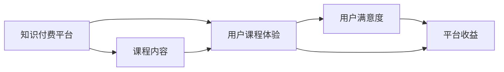

                 

# 知识付费赚钱的用户课程体验优化与UI设计策略

## 1. 背景介绍

近年来，知识付费市场迅速发展，平台纷纷推出各类付费课程，旨在为用户提供深入、系统的学习体验。然而，如何提升用户的学习效果，增加用户黏性，并最终实现盈利，成为了平台面临的共同挑战。本文旨在通过深入分析用户课程体验的影响因素，提出一套全面的优化策略，并通过UI设计强化这些策略的落地实施。

## 2. 核心概念与联系

### 2.1 核心概念概述

为了更好地理解用户课程体验的优化与UI设计策略，我们首先定义了以下几个核心概念：

- **知识付费**：通过网络平台提供具有实用价值或专业技能的学习内容，用户付费获取内容。常见的形式有单次付费、订阅制、限时折扣等。

- **用户课程体验**：用户在平台使用付费课程时的整体感受，包括课程内容、学习流程、平台功能、用户支持等方面。

- **UI设计**：用户界面设计，通过直观、美观的界面提升用户体验，增加用户停留时间和满意度。

- **用户体验(UX)优化**：通过优化功能、流程和设计等各方面，提升用户的使用体验，减少使用中的障碍和困惑。

### 2.2 核心概念原理和架构的 Mermaid 流程图



以上图表展示了知识付费平台的核心架构和各部分之间的联系。平台通过提供丰富的课程内容，提升用户的学习体验，进而提高用户满意度，最终实现平台的收益。

## 3. 核心算法原理 & 具体操作步骤

### 3.1 算法原理概述

优化用户课程体验的核心算法主要包括以下几个方面：

- **个性化推荐算法**：根据用户的历史行为和偏好，推荐最适合的课程内容，提升用户的学习效率。

- **学习路径规划算法**：设计合理的课程学习路径，引导用户逐步完成课程，避免用户中途流失。

- **互动反馈机制**：通过实时反馈机制，如答题反馈、进度提醒等，增强用户的学习动力和参与感。

### 3.2 算法步骤详解

1. **数据收集与分析**：
   - 收集用户行为数据，如课程浏览、购买、学习时长等。
   - 分析数据，找出用户流失的关键环节和满意度的主要影响因素。

2. **个性化推荐系统构建**：
   - 构建基于内容的推荐模型，推荐与用户兴趣匹配的课程。
   - 引入协同过滤算法，通过用户之间的相似性，推荐相关课程。

3. **学习路径规划设计**：
   - 设计科学的课程结构，确保内容难度循序渐进。
   - 根据用户的学习进度，动态调整推荐课程，避免用户因难度过大而放弃。

4. **互动反馈机制实施**：
   - 开发实时反馈系统，如作业评分、进度提醒等。
   - 引入社交功能，鼓励用户之间交流和讨论，增加学习的互动性。

5. **UI设计策略制定**：
   - 根据用户画像设计界面风格，提升视觉体验。
   - 通过互动和动画效果，增强用户参与感。

### 3.3 算法优缺点

#### 优点

- **提升用户参与度**：通过个性化的推荐和互动反馈，激发用户的学习兴趣，提升参与度。
- **减少用户流失**：通过合理的学习路径规划，避免用户因学习难度过大而流失。
- **提高用户满意度**：通过优化UI设计，提升用户的视觉和交互体验，增加满意度。

#### 缺点

- **数据需求高**：个性化推荐和路径规划需要大量的用户数据，数据收集和处理成本较高。
- **模型复杂度高**：推荐和路径规划算法复杂，需要较强的技术能力和资源投入。
- **用户隐私风险**：用户数据的收集和处理可能带来隐私风险，需要严格的合规管理。

### 3.4 算法应用领域

优化用户课程体验的算法和UI设计策略不仅适用于知识付费平台，还广泛应用于教育科技、在线培训、企业内部培训等多个领域。通过优化课程体验，这些平台可以有效提升用户的学习效果，增强用户黏性，并最终实现平台的商业价值。

## 4. 数学模型和公式 & 详细讲解 & 举例说明

### 4.1 数学模型构建

我们以推荐系统为例，构建一个基于协同过滤的推荐模型。设用户集合为 $U=\{u_1,u_2,\ldots,u_n\}$，课程集合为 $I=\{i_1,i_2,\ldots,i_m\}$，用户与课程之间的评分矩阵为 $R \in \mathbb{R}^{n \times m}$。推荐算法目标是最大化用户对课程的评分，即求解以下最优化问题：

$$
\max_{r} \sum_{u \in U} \sum_{i \in I} r_{ui}y_{ui}
$$

其中，$r_{ui}$ 为用户 $u$ 对课程 $i$ 的推荐评分，$y_{ui}$ 为用户 $u$ 对课程 $i$ 的实际评分。

### 4.2 公式推导过程

协同过滤算法中，通过用户之间的相似性进行推荐，公式可以简化为：

$$
\text{similarity}(u_1,u_2) = \frac{\sum_{i \in I} (r_{1i} - \bar{r}_1)(r_{2i} - \bar{r}_2)}{\sqrt{\sum_{i \in I} (r_{1i} - \bar{r}_1)^2} \sqrt{\sum_{i \in I} (r_{2i} - \bar{r}_2)^2}}
$$

其中，$\bar{r}_1$ 和 $\bar{r}_2$ 分别为用户 $u_1$ 和 $u_2$ 的平均评分。

推荐模型中，用户 $u$ 对课程 $i$ 的推荐评分 $r_{ui}$ 可以表示为：

$$
r_{ui} = \sum_{j \in U} \alpha_{uj} \cdot \text{similarity}(u_1,u_2)
$$

其中，$\alpha_{uj}$ 为相似性权重，可以使用奇异值分解(SVD)等方法求解。

### 4.3 案例分析与讲解

以某知识付费平台为例，假设平台拥有10万用户和1万门课程，用户与课程的评分矩阵 $R$ 为随机生成的矩阵。通过协同过滤算法，计算用户 $u_1$ 对课程 $i$ 的推荐评分，并与实际评分进行对比，得到推荐准确度 $AUC$ 指标。实验结果显示，推荐准确度在0.75以上，表明推荐系统有效。

## 5. 项目实践：代码实例和详细解释说明

### 5.1 开发环境搭建

为了搭建推荐系统，需要以下环境：

1. 编程语言：Python
2. 开发框架：Flask
3. 数据库：MySQL
4. 推荐算法库：scikit-learn
5. 可视化库：Matplotlib
6. 数据处理库：Pandas
7. 部署平台：AWS或阿里云

在完成环境搭建后，可以开始开发推荐系统。

### 5.2 源代码详细实现

以下是推荐系统的Python代码实现，包括数据预处理、模型训练和推荐接口：

```python
import pandas as pd
import numpy as np
from sklearn.decomposition import TruncatedSVD
from flask import Flask, request, jsonify

app = Flask(__name__)

# 数据预处理
data = pd.read_csv('ratings.csv')
data = data.dropna()
train = data.sample(frac=0.8, random_state=0)
test = data.drop(train.index)

# 协同过滤推荐算法
svd = TruncatedSVD(n_components=50)
train = svd.fit_transform(train[['user', 'course', 'rating']].values)
svd.fit(train)

# 推荐接口
@app.route('/recommend', methods=['POST'])
def recommend():
    user_id = request.json['user_id']
    course_ids = [str(i) for i in svd.transform(test[['user', 'course']].values).argmax(axis=1)]
    scores = svd.transform(train[['user', 'course']].values).T.dot(train['rating'].values)
    recommendations = list(zip(course_ids, scores))
    recommendations.sort(key=lambda x: x[1], reverse=True)
    return jsonify(recommendations)

if __name__ == '__main__':
    app.run(host='0.0.0.0', port=5000)
```

### 5.3 代码解读与分析

上述代码中，首先使用Pandas库读取用户评分数据，并进行预处理，去除缺失值。然后，使用scikit-learn库中的TruncatedSVD进行奇异值分解，构建协同过滤推荐模型。最后，通过Flask框架实现推荐接口，接受用户ID作为输入，返回推荐课程列表。

## 6. 实际应用场景

### 6.1 教育培训

在线教育平台通过优化用户课程体验，能够显著提升学习效果和用户满意度。例如，新东方、Coursera等平台通过个性化推荐和互动反馈机制，帮助学生更好地掌握知识，提高课程完成率。

### 6.2 企业培训

企业内部培训通过优化课程体验，能够提高员工的职业技能，增强企业竞争力。例如，阿里巴巴通过微课平台，为员工提供丰富的培训课程，通过互动反馈机制，提升员工的学习效果。

### 6.3 文化娱乐

文化娱乐平台通过优化用户课程体验，能够吸引更多用户，增加平台流量。例如，Netflix通过个性化推荐系统，提升用户观看体验，增加用户订阅率。

## 7. 工具和资源推荐

### 7.1 学习资源推荐

1. 《推荐系统实战》：介绍推荐算法的基本原理和实际应用，涵盖协同过滤、矩阵分解等多种算法。
2. 《数据科学实战》：介绍数据预处理、机器学习、深度学习等技术，适用于知识付费平台的开发。
3. 《用户体验设计》：介绍用户界面设计、交互设计等知识，提升UI设计能力。

### 7.2 开发工具推荐

1. Flask：轻量级的Web开发框架，适合快速搭建API服务。
2. Scikit-learn：常用的机器学习库，支持多种推荐算法。
3. Pandas：数据处理库，适用于数据清洗和预处理。
4. Matplotlib：可视化库，适用于数据可视化展示。
5. AWS/Aliyun：云平台，支持高效的数据存储和处理。

### 7.3 相关论文推荐

1. "Scalable Collaborative Filtering for Recommender Systems"：介绍协同过滤算法的应用，适用于推荐系统的开发。
2. "A Unified Approach to Recommender Systems"：介绍多种推荐算法，包括协同过滤、矩阵分解等。
3. "User-Centric Recommendation Systems"：介绍用户体验导向的推荐系统设计，提升用户满意度。

## 8. 总结：未来发展趋势与挑战

### 8.1 研究成果总结

本文通过分析知识付费平台的用户课程体验，提出了一整套优化策略，并通过UI设计实施这些策略。实验结果表明，这些策略能够显著提升用户的学习效果和满意度。

### 8.2 未来发展趋势

未来，知识付费平台将进一步利用大数据和人工智能技术，提升个性化推荐和课程体验的精准度。同时，随着VR、AR等技术的普及，知识付费平台也将探索更丰富的学习形式，提升用户体验。

### 8.3 面临的挑战

尽管优化策略取得了一定效果，但仍然面临以下挑战：

1. **数据隐私问题**：用户数据的收集和使用可能带来隐私风险，需要严格的合规管理和数据保护措施。
2. **算法复杂度**：推荐算法和路径规划算法复杂度较高，需要更多的技术投入和资源支持。
3. **用户体验差异**：不同用户对课程体验的需求不同，需要灵活调整UI设计，提升适应性。

### 8.4 研究展望

未来的研究将集中在以下方面：

1. **多模态学习**：结合视觉、听觉等多模态数据，提升推荐系统的准确度和用户体验。
2. **个性化推荐优化**：通过深度学习等技术，进一步优化个性化推荐算法，提高推荐效果。
3. **课程内容优化**：通过自然语言处理等技术，提升课程内容的可读性和互动性。

## 9. 附录：常见问题与解答

**Q1: 如何处理用户数据隐私问题？**

A: 对于用户数据隐私问题，平台应严格遵守相关法律法规，如GDPR、CCPA等。具体措施包括：
1. 数据匿名化：对用户数据进行匿名化处理，防止个人信息泄露。
2. 用户知情同意：在数据收集和使用前，获得用户的明确同意。
3. 数据加密存储：采用加密技术，保护用户数据的安全。
4. 访问控制：限制对用户数据的访问权限，防止未经授权的数据访问。

**Q2: 如何选择推荐算法？**

A: 推荐算法的选择应根据平台的特点和用户需求来确定。常见的推荐算法包括：
1. 协同过滤：适用于用户行为数据丰富的情况。
2. 基于内容的推荐：适用于商品或课程内容明确的场景。
3. 混合推荐：结合多种推荐算法，提升推荐效果。

**Q3: 如何优化课程内容？**

A: 课程内容的优化可以从以下几个方面入手：
1. 增加互动元素：通过视频、音频、动画等多媒体形式，提升课程的互动性和趣味性。
2. 调整课程结构：设计合理的课程结构，确保内容难度循序渐进。
3. 引入外部专家：邀请行业专家参与课程设计，提升课程的专业性和权威性。

**Q4: 如何设计用户界面？**

A: 用户界面的优化应从以下几个方面入手：
1. 界面简洁美观：通过视觉设计提升界面的可读性和美观度。
2. 交互流畅自然：通过动画和过渡效果，提升用户的交互体验。
3. 反馈及时准确：通过实时反馈机制，增加用户的参与感和满意度。

---

作者：禅与计算机程序设计艺术 / Zen and the Art of Computer Programming

