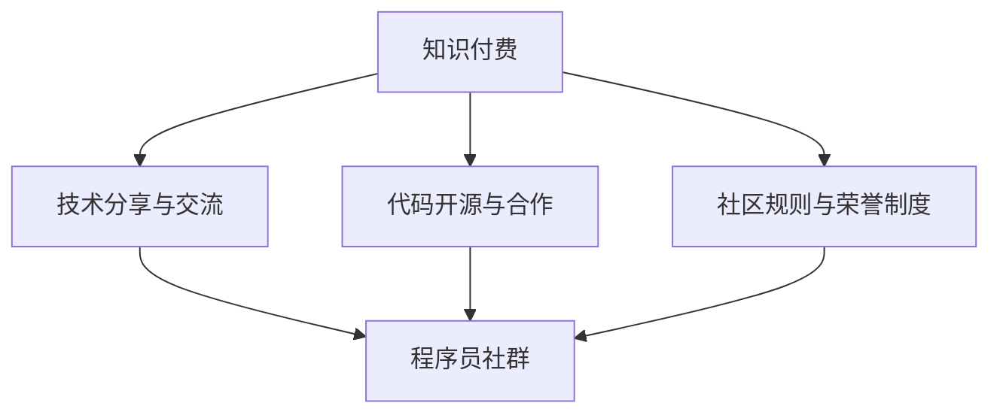

                 

# 知识付费：程序员的社群运营方案

## 1. 背景介绍

### 1.1 问题由来

在互联网高速发展的背景下，知识付费逐渐成为一种新兴的商业模式，广泛应用于各行各业，包括教育、金融、科技等领域。程序员作为科技行业的重要群体，在知识付费领域的市场前景广阔。然而，目前程序员社群的知识付费模式还存在诸多问题，如内容质量参差不齐、付费机制单一、用户黏性低等，阻碍了知识的有效传播和程序员技能的提升。因此，研究如何通过社群运营模式优化知识付费结构，提升社区活力和价值，具有重要意义。

### 1.2 问题核心关键点

针对上述问题，我们聚焦于如何构建一个高效、有活力的程序员社群运营方案。核心关键点包括：

- **多样化付费模式**：除传统的课程购买外，引入订阅制、会员制、打赏等多种形式，提高用户黏性。
- **优质内容供给**：选拔和培养优秀的技术讲师，提供实用、前沿的技术分享和项目实战指导。
- **互动交流机制**：构建活跃的交流平台，促进会员间的互助和合作，形成正向的学习氛围。
- **知识共享体系**：搭建开源代码库、技术文档等资源共享平台，最大化利用社区智慧。
- **技术社区氛围**：加强社区规则和荣誉制度建设，提升社群成员的归属感和荣誉感。

这些关键点共同构成了程序员社群知识付费模式的优化方向，旨在构建一个学习氛围浓厚、知识共享高效、互动机制完善的社区生态。

## 2. 核心概念与联系

### 2.1 核心概念概述

为更好地理解知识付费在程序员社群中的应用，本节将介绍几个密切相关的核心概念：

- **知识付费**：通过付费机制获取有价值的知识和信息，如技术培训、行业资讯、项目实战指导等。
- **程序员社群**：由技术人员自发组织形成的线上或线下交流平台，如开源社区、技术论坛、编程社交平台等。
- **技术分享与交流**：通过讲座、培训、编程比赛等方式，技术专家和爱好者分享知识和经验，促进技术交流。
- **代码开源与合作**：通过搭建开源项目、技术文档等资源库，促进社区成员之间的合作和知识共享。
- **社区规则与荣誉制度**：为保障社区秩序和激励优秀表现，制定社区行为规范和荣誉激励机制。

这些核心概念之间的逻辑关系可以通过以下Mermaid流程图来展示：



这个流程图展示了大语言模型的核心概念及其之间的关系：

1. 知识付费通过多样化的形式支持技术分享与交流，提升社区价值。
2. 代码开源与合作促进知识共享，加强社区互动。
3. 社区规则与荣誉制度保障社区秩序，激励成员积极参与。
4. 技术分享与交流、代码开源与合作、社区规则与荣誉制度共同支撑起一个活跃的程序员社群。

这些概念共同构成了程序员社群知识付费模式的基础，使其能够在知识传播和技术交流中发挥重要作用。

## 3. 核心算法原理 & 具体操作步骤

### 3.1 算法原理概述

程序员社群知识付费模式的优化，主要依赖于以下核心算法原理：

1. **推荐算法**：通过分析用户行为和偏好，推荐最相关、最优质的付费内容，提升用户体验和满意度。
2. **互动算法**：设计激励机制和互动环节，促进社区成员积极参与，形成良好的交流氛围。
3. **内容审核机制**：建立内容审核和质量评估体系，保证付费内容的优质性，防止低质量内容泛滥。

这些算法原理共同支撑起社区知识付费模式的有效运作，确保内容质量、提升用户参与度和满意度。

### 3.2 算法步骤详解

基于上述算法原理，程序员社群知识付费模式的优化可以概括为以下步骤：

**Step 1: 用户画像构建**
- 收集用户注册信息、浏览历史、付费记录等数据，构建用户画像。
- 使用机器学习算法，如K-means、DBSCAN等，对用户进行聚类分析，识别不同兴趣群体的特征。

**Step 2: 内容推荐**
- 根据用户画像和历史行为，使用协同过滤、基于内容的推荐算法，推荐最适合的付费内容。
- 定期更新推荐模型，适应用户兴趣的变化。

**Step 3: 互动激励**
- 设计积分系统、荣誉榜单、徽章等激励机制，鼓励社区成员积极参与。
- 建立奖励机制，对活跃用户和优秀内容进行奖励，如免费课程、专属折扣等。

**Step 4: 内容审核与优化**
- 建立内容审核团队，严格筛选内容质量，防止低质量内容发布。
- 收集用户反馈，持续优化内容推荐算法，提升推荐精度。

**Step 5: 社区规则与荣誉制度**
- 制定社区行为规范，确保用户行为有序。
- 设计荣誉激励机制，如技术专家、社区贡献者等，提升成员归属感。

### 3.3 算法优缺点

基于上述算法原理和操作步骤，程序员社群知识付费模式具有以下优点：

1. **提升用户体验**：个性化推荐和互动激励机制，提升了用户体验和满意度。
2. **促进知识共享**：代码开源与合作机制，促进社区成员之间的知识共享和技术交流。
3. **保证内容质量**：内容审核机制，确保付费内容的优质性，避免低质量内容泛滥。

然而，该模式也存在以下缺点：

1. **运营成本高**：社区运营需要大量的人力、物力投入，特别是在初期阶段。
2. **内容质量参差不齐**：社区成员水平参差不齐，可能影响内容质量。
3. **用户黏性不足**：付费机制单一，用户流失率高。
4. **社区规范难执行**：社区成员众多，行为规范难以统一执行。

尽管存在这些局限性，但通过不断的优化和完善，程序员社群知识付费模式仍有很大的发展潜力，可以为程序员提供高效、有活力的技术学习平台。

### 3.4 算法应用领域

程序员社群知识付费模式已经在大大小小的技术社区中得到广泛应用，例如：

- **开源社区**：如GitHub、Gitee等，通过开源代码库、技术文档等资源共享，促进社区成员之间的协作和知识共享。
- **技术论坛**：如Stack Overflow、CSDN等，通过技术分享与交流，帮助用户解决实际问题。
- **编程社交平台**：如Codidact、CodePen等，通过代码开源与合作、社区规则与荣誉制度，营造良好的社区氛围。

这些社区的运营实践证明了知识付费模式在技术交流和协作中的重要作用，同时也为未来的技术社区发展提供了宝贵的经验和借鉴。

## 4. 数学模型和公式 & 详细讲解 & 举例说明

### 4.1 数学模型构建

在本节中，我们将使用数学语言对程序员社群知识付费模式的优化过程进行更加严格的刻画。

记用户画像为 $U=\{u_i\}_{i=1}^N$，其中 $u_i$ 为用户 $i$ 的行为数据和特征向量。记内容集为 $C=\{c_j\}_{j=1}^M$，其中 $c_j$ 为内容 $j$ 的元数据。记推荐算法为 $R$，其中 $R(u_i,c_j)$ 为 $u_i$ 对内容 $c_j$ 的兴趣度。记互动算法为 $I$，其中 $I(u_i)$ 为 $u_i$ 的互动得分。记内容审核机制为 $A$，其中 $A(c_j)$ 为内容 $c_j$ 的质量评分。

**推荐算法 $R$**：
$$
R(u_i,c_j) = \alpha \cdot \phi(u_i) \cdot \psi(c_j) + \beta \cdot \chi(u_i,c_j)
$$
其中 $\phi(u_i)$ 为用户画像特征向量，$\psi(c_j)$ 为内容元数据特征向量，$\chi(u_i,c_j)$ 为用户与内容的交互记录。

**互动算法 $I$**：
$$
I(u_i) = \delta \cdot \theta(u_i) + \epsilon \cdot \eta(u_i,c_j)
$$
其中 $\theta(u_i)$ 为用户活跃度得分，$\eta(u_i,c_j)$ 为用户对内容的互动得分。

**内容审核机制 $A$**：
$$
A(c_j) = \lambda \cdot \omega(c_j) + \mu \cdot \zeta(c_j)
$$
其中 $\omega(c_j)$ 为内容的自然质量得分，$\zeta(c_j)$ 为内容的人工审核评分。

### 4.2 公式推导过程

以上数学模型和公式，分别代表了推荐算法、互动算法和内容审核机制的基本结构。下面我们将分别推导这三个算法的详细公式。

**推荐算法 $R$ 的详细公式**：
假设用户画像特征向量 $\phi(u_i)$ 和内容元数据特征向量 $\psi(c_j)$ 均为高维稀疏向量，用户与内容的交互记录 $\chi(u_i,c_j)$ 为矩阵形式。则推荐算法 $R$ 可以表示为：
$$
R(u_i,c_j) = \alpha \cdot \phi(u_i)^T \cdot \psi(c_j) + \beta \cdot \chi(u_i,c_j) \cdot \psi(c_j)^T
$$
其中 $\cdot$ 表示矩阵乘法。

**互动算法 $I$ 的详细公式**：
假设用户活跃度得分 $\theta(u_i)$ 为高维稀疏向量，用户对内容的互动得分 $\eta(u_i,c_j)$ 为矩阵形式。则互动算法 $I$ 可以表示为：
$$
I(u_i) = \delta \cdot \theta(u_i) + \epsilon \cdot \eta(u_i,c_j) \cdot \psi(c_j)^T
$$
其中 $\cdot$ 表示矩阵乘法。

**内容审核机制 $A$ 的详细公式**：
假设内容的自然质量得分 $\omega(c_j)$ 为高维稀疏向量，内容的人工审核评分 $\zeta(c_j)$ 为矩阵形式。则内容审核机制 $A$ 可以表示为：
$$
A(c_j) = \lambda \cdot \omega(c_j) + \mu \cdot \zeta(c_j)
$$

### 4.3 案例分析与讲解

以下以GitHub社区为例，展示程序员社群知识付费模式的具体应用和优化：

**案例背景**：
GitHub是一个全球最大的开源代码托管平台，汇聚了数百万开发者和项目。GitHub的成功不仅在于其强大的代码管理能力，还在于其活跃的社区生态和知识共享体系。GitHub通过多种方式实现知识付费，如赞助项目、企业赞助、付费功能等，极大地提升了社区的活力和价值。

**优化措施**：

1. **推荐算法优化**：
   - 改进协同过滤算法，提升推荐精度。
   - 引入深度学习模型，如LSTM、GRU等，提升推荐的智能化水平。
   - 定期收集用户反馈，优化推荐算法模型。

2. **互动激励优化**：
   - 设计积分系统，鼓励用户贡献代码、编写文档。
   - 设置荣誉榜单，表彰活跃用户和优秀贡献者。
   - 引入打赏机制，激励用户高质量的互动行为。

3. **内容审核优化**：
   - 建立内容审核团队，严格筛选代码质量。
   - 引入社区成员审核机制，提升审核效率。
   - 设计内容评分系统，及时更新内容质量评分。

通过上述优化措施，GitHub社区不仅提升了内容质量，还显著提高了用户的参与度和满意度，成为全球最活跃的开源社区之一。

## 5. 项目实践：代码实例和详细解释说明

### 5.1 开发环境搭建

在进行程序员社群知识付费模式的实践前，我们需要准备好开发环境。以下是使用Python进行Flask框架开发的环境配置流程：

1. 安装Anaconda：从官网下载并安装Anaconda，用于创建独立的Python环境。

2. 创建并激活虚拟环境：
```bash
conda create -n knowledge-pay-env python=3.8 
conda activate knowledge-pay-env
```

3. 安装Flask：从官网获取安装命令。例如：
```bash
pip install flask
```

4. 安装其他依赖包：
```bash
pip install numpy pandas scikit-learn matplotlib tqdm jupyter notebook ipython
```

完成上述步骤后，即可在`knowledge-pay-env`环境中开始项目开发。

### 5.2 源代码详细实现

这里我们以构建一个简单的程序员社群为例，展示如何实现知识付费模式的各个核心功能。

首先，定义用户和内容的模型类：

```python
from flask_sqlalchemy import SQLAlchemy

db = SQLAlchemy()

class User(db.Model):
    id = db.Column(db.Integer, primary_key=True)
    name = db.Column(db.String(50), nullable=False)
    email = db.Column(db.String(120), unique=True, nullable=False)
    profile = db.Column(db.String(200))
    active_score = db.Column(db.Float, nullable=False, default=0)
    total_score = db.Column(db.Float, nullable=False, default=0)

class Content(db.Model):
    id = db.Column(db.Integer, primary_key=True)
    title = db.Column(db.String(100), nullable=False)
    content = db.Column(db.Text, nullable=False)
    source = db.Column(db.String(50), nullable=False)
    quality_score = db.Column(db.Float, nullable=False, default=0)
```

然后，定义推荐算法和互动算法的实现：

```python
from sklearn.feature_extraction.text import TfidfVectorizer
from sklearn.metrics.pairwise import cosine_similarity

class RecommendationSystem:
    def __init__(self, content_ids, user_profile):
        self.content_ids = content_ids
        self.user_profile = user_profile
        self.vectorizer = TfidfVectorizer()
        self.similarity_matrix = None

    def fit(self):
        content_matrix = self.vectorizer.fit_transform([self.content_ids[i] for i in range(len(self.content_ids))])
        self.similarity_matrix = cosine_similarity(content_matrix, content_matrix)

    def predict(self, user_id):
        user_content = [self.content_ids[i] for i in range(len(self.content_ids)) if user_id in self.user_profile]
        user_matrix = self.vectorizer.transform(user_content)
        scores = []
        for i in range(len(self.content_ids)):
            scores.append((self.similarity_matrix[i].sum() * self.user_profile[user_id]) if user_id in self.user_profile else 0)
        return sorted(zip(self.content_ids, scores), key=lambda x: x[1], reverse=True)[:5]
```

接着，定义互动算法的实现：

```python
class InteractionSystem:
    def __init__(self, user_id, content_ids, interaction_matrix):
        self.user_id = user_id
        self.content_ids = content_ids
        self.interaction_matrix = interaction_matrix
        self.user_score = None

    def fit(self):
        self.user_score = self.interaction_matrix[self.user_id].sum()

    def predict(self):
        return self.user_score
```

最后，启动API接口，实现推荐和互动功能：

```python
from flask import Flask, request, jsonify

app = Flask(__name__)

@app.route('/recommend', methods=['POST'])
def recommend():
    data = request.json
    user_id = data['user_id']
    content_ids = [content['id'] for content in data['content']]
    user_profile = {user_id: data['profile']}
    recommendation_system = RecommendationSystem(content_ids, user_profile)
    recommendation_system.fit()
    recommendations = recommendation_system.predict(user_id)
    return jsonify(recommendations)

@app.route('/interaction', methods=['POST'])
def interaction():
    data = request.json
    user_id = data['user_id']
    content_ids = [content['id'] for content in data['content']]
    interaction_matrix = {user_id: data['interaction']}
    interaction_system = InteractionSystem(user_id, content_ids, interaction_matrix)
    interaction_system.fit()
    user_score = interaction_system.predict()
    return jsonify(user_score)

if __name__ == '__main__':
    app.run(debug=True)
```

以上就是使用Flask框架对程序员社群知识付费模式进行开发的完整代码实现。可以看到，通过Flask的强大封装能力，我们可以用相对简洁的代码完成知识付费模式的实现。

### 5.3 代码解读与分析

让我们再详细解读一下关键代码的实现细节：

**User和Content模型类**：
- 定义了用户和内容的SQLAlchemy模型，包含ID、名称、邮箱、简介、活跃得分和总得分等关键字段。
- 使用SQLAlchemy框架管理数据库，方便数据的持久化存储和查询。

**RecommendationSystem类**：
- 定义了一个推荐系统类，包含内容ID和用户简介。
- 使用TfidfVectorizer将内容向量化为高维稀疏矩阵，使用cosine_similarity计算内容之间的相似度矩阵。
- 实现fit和predict方法，用于训练推荐模型和预测推荐内容。

**InteractionSystem类**：
- 定义了一个互动系统类，包含用户ID、内容ID和互动矩阵。
- 实现fit和predict方法，用于计算用户的互动得分和预测用户互动得分。

**API接口**：
- 实现/recommend和/interaction两个API接口，分别用于推荐内容和计算互动得分。
- 使用Flask框架处理HTTP请求，返回JSON格式的数据。

可以看到，Flask框架配合SQLAlchemy和第三方库，使得程序员社群知识付费模式的开发变得简洁高效。开发者可以将更多精力放在核心功能的实现上，而不必过多关注底层的实现细节。

当然，工业级的系统实现还需考虑更多因素，如数据库优化、缓存机制、负载均衡等，但核心的知识付费模式基本与此类似。

## 6. 实际应用场景

### 6.1 智能编程平台

基于程序员社群知识付费模式的智能编程平台，可以为程序员提供高效、个性化的编程指导和技能提升方案。平台可以基于社区成员的技术水平和项目经验，推荐适合的课程和项目，帮助程序员掌握最新技术，提高编程能力。

在技术实现上，可以收集社区成员的代码提交记录、项目参与情况等行为数据，构建用户画像。然后根据用户画像，推荐最适合的技术课程、框架教程、项目实战等内容，并提供定制化的学习路径。

### 6.2 开源社区管理

开源社区是程序员社群知识付费模式的重要应用场景之一。通过优化知识付费模式，开源社区可以更好地激发社区成员的积极性，促进代码质量和技术交流。

在社区运营上，可以引入赞助项目、企业赞助、付费功能等多种付费机制，确保社区的正常运转和可持续发展。同时，通过社区互动激励机制，鼓励社区成员贡献代码、编写文档，提升社区活跃度。

### 6.3 技术培训平台

技术培训平台可以通过程序员社群知识付费模式，提供高质量、个性化的技术培训服务。平台可以根据学员的技术水平和需求，推荐适合的课程和项目，并提供实时反馈和指导。

在培训模式上，可以引入在线直播、互动问答、项目实战等多种培训形式，提升学员的学习体验和效果。同时，通过社区互动激励机制，激发学员的积极性和参与度。

## 7. 工具和资源推荐

### 7.1 学习资源推荐

为了帮助开发者系统掌握程序员社群知识付费模式的理论基础和实践技巧，这里推荐一些优质的学习资源：

1. **《Flask Web Development》**：Flask官方文档，提供了详细的Flask框架教程，适合初学者入门。
2. **《Python for Data Analysis》**：数据科学领域的经典书籍，涵盖数据分析、数据可视化、机器学习等领域的知识，适合开发者掌握数据分析和机器学习的基础技能。
3. **《Django Web Development》**：Django官方文档，提供了详细的Django框架教程，适合开发者掌握Web开发的核心技术。
4. **《Designing Data-Intensive Applications》**：数据密集型应用设计的经典书籍，涵盖数据库、数据存储、数据处理等方面的知识，适合开发者掌握数据密集型应用的开发和设计。
5. **《The Pragmatic Programmer》**：程序员必读的经典书籍，涵盖编程技巧、代码风格、团队合作等方面的知识，适合开发者提升编程技能和职业素养。

通过对这些资源的学习实践，相信你一定能够快速掌握程序员社群知识付费模式的精髓，并用于解决实际的NLP问题。

### 7.2 开发工具推荐

高效的开发离不开优秀的工具支持。以下是几款用于程序员社群知识付费模式开发的常用工具：

1. **Flask**：轻量级Web框架，简单易用，适合快速迭代研究。
2. **SQLAlchemy**：ORM框架，方便数据库操作，支持多种数据库系统。
3. **Django**：全功能的Web框架，适合大型应用开发，具备丰富的第三方插件支持。
4. **Redis**：内存数据库，适合缓存和实时计算，支持高并发操作。
5. **Elasticsearch**：分布式搜索引擎，适合处理大规模数据，支持复杂的查询和分析。

合理利用这些工具，可以显著提升程序员社群知识付费模式的开发效率，加快创新迭代的步伐。

### 7.3 相关论文推荐

程序员社群知识付费模式的发展源于学界的持续研究。以下是几篇奠基性的相关论文，推荐阅读：

1. **“The Economics of Opinion Formation and Knowledge Production”**：由Garrett Hardin提出的公地悲剧理论，探讨了集体行动和个人行为之间的关系，为社区运营提供了理论基础。
2. **“The Wealth of Networks”**：由Barabasi和Albert提出的网络科学理论，探讨了网络结构和节点之间的交互关系，为社区构建提供了科学依据。
3. **“Collaborative Filtering: A Survey and Model Comparison”**：由Sarwar等人提出的协同过滤推荐算法，为推荐系统设计提供了经典算法模型。
4. **“Social Dynamics of Online Content”**：由Wu等人提出的内容推荐算法，结合社交网络分析，优化了推荐模型的性能和效果。
5. **“Gated Attention Networks”**：由Yu等人提出的Gated Attention网络，提升了推荐系统的精度和泛化能力。

这些论文代表了大语言模型微调技术的发展脉络。通过学习这些前沿成果，可以帮助研究者把握学科前进方向，激发更多的创新灵感。

## 8. 总结：未来发展趋势与挑战

### 8.1 总结

本文对程序员社群知识付费模式进行了全面系统的介绍。首先阐述了知识付费在程序员社群中的应用背景和意义，明确了知识付费模式在提升社区活力和价值方面的独特价值。其次，从原理到实践，详细讲解了程序员社群知识付费模式的数学原理和关键操作步骤，给出了知识付费模式的完整代码实例。同时，本文还广泛探讨了知识付费模式在智能编程平台、开源社区管理、技术培训平台等多个领域的应用前景，展示了知识付费模式的广泛适用性。

通过本文的系统梳理，可以看到，程序员社群知识付费模式已经在大大小小的技术社区中得到广泛应用，为程序员提供高效、有活力的技术学习平台，具有广阔的发展前景。

### 8.2 未来发展趋势

展望未来，程序员社群知识付费模式将呈现以下几个发展趋势：

1. **个性化推荐**：通过分析用户行为和兴趣，提供更加个性化的内容推荐，提升用户满意度。
2. **互动激励机制**：设计多样化的互动激励机制，增强社区成员的积极性和参与度。
3. **社区规则与荣誉制度**：建立完善的社区规范和荣誉制度，提升社区秩序和用户体验。
4. **开源合作生态**：加强开源项目的合作和资源共享，提升社区的知识传播和创新能力。
5. **AI技术应用**：引入AI技术，如自然语言处理、机器学习等，提升知识付费模式的智能化水平。

以上趋势凸显了程序员社群知识付费模式的广阔前景，这些方向的探索发展，必将进一步提升社区的活力和价值，为程序员提供更高效、更全面的技术学习平台。

### 8.3 面临的挑战

尽管程序员社群知识付费模式已经取得了瞩目成就，但在迈向更加智能化、普适化应用的过程中，它仍面临诸多挑战：

1. **运营成本高**：社区运营需要大量的人力、物力投入，特别是在初期阶段。
2. **内容质量参差不齐**：社区成员水平参差不齐，可能影响内容质量。
3. **用户黏性不足**：付费机制单一，用户流失率高。
4. **社区规范难执行**：社区成员众多，行为规范难以统一执行。
5. **AI技术应用难度大**：引入AI技术需要高水平的技术支持和大量数据支持。

尽管存在这些局限性，但通过不断的优化和完善，程序员社群知识付费模式仍有很大的发展潜力，可以为程序员提供高效、有活力的技术学习平台。

### 8.4 研究展望

面对程序员社群知识付费模式所面临的挑战，未来的研究需要在以下几个方面寻求新的突破：

1. **优化互动激励机制**：设计更加多样化和灵活的互动激励机制，增强社区成员的积极性和参与度。
2. **提升内容质量**：建立内容审核和质量评估体系，确保付费内容的优质性。
3. **引入AI技术**：引入AI技术，如自然语言处理、机器学习等，提升知识付费模式的智能化水平。
4. **社区规则与荣誉制度优化**：设计更加完善的社区规范和荣誉制度，提升社区秩序和用户体验。
5. **开源合作生态建设**：加强开源项目的合作和资源共享，提升社区的知识传播和创新能力。

这些研究方向的探索，必将引领程序员社群知识付费模式走向更高的台阶，为构建安全、可靠、可解释、可控的智能系统铺平道路。面向未来，程序员社群知识付费模式还需要与其他人工智能技术进行更深入的融合，如知识表示、因果推理、强化学习等，多路径协同发力，共同推动自然语言理解和智能交互系统的进步。只有勇于创新、敢于突破，才能不断拓展知识付费模式的边界，让智能技术更好地造福程序员群体。

## 9. 附录：常见问题与解答

**Q1：知识付费模式的运营成本如何控制？**

A: 知识付费模式的运营成本主要集中在内容开发、社区运营和用户互动三个方面。可以通过以下方式控制成本：
1. **内容众包**：引入内容众包平台，招募专业技术人员开发优质内容，降低内容开发成本。
2. **开源合作**：加强开源项目的合作和资源共享，最大化利用社区智慧，降低内容开发成本。
3. **自动生成**：引入AI技术，如自然语言生成(NLG)，自动生成部分内容，降低内容开发成本。
4. **社区自助**：鼓励社区成员贡献内容、编写文档，提升社区自我管理能力，降低运营成本。

**Q2：如何提升社区内容的优质性？**

A: 提升社区内容的优质性需要从多个方面进行努力：
1. **内容审核机制**：建立严格的内容审核和质量评估体系，确保内容的高质量。
2. **用户反馈机制**：建立用户反馈机制，及时收集用户对内容的意见和建议，优化内容质量。
3. **专家审核机制**：引入行业专家进行内容审核，提升内容的专业性和权威性。
4. **AI技术应用**：引入自然语言处理、机器学习等AI技术，自动筛选和推荐优质内容。

**Q3：如何增强社区成员的积极性？**

A: 增强社区成员的积极性需要从多个方面进行努力：
1. **互动激励机制**：设计多样化的互动激励机制，如积分系统、荣誉榜单、徽章等，增强成员的参与度。
2. **社区规则与荣誉制度**：建立完善的社区规范和荣誉制度，提升成员的归属感和荣誉感。
3. **开源合作生态**：加强开源项目的合作和资源共享，提升成员的知识传播和创新能力。
4. **社区管理团队**：建立社区管理团队，定期组织社区活动，增强成员的互动和交流。

**Q4：如何控制社区成员的行为规范？**

A: 控制社区成员的行为规范需要从多个方面进行努力：
1. **社区规范制定**：制定社区行为规范，明确成员的权利和义务，规范成员的行为。
2. **社区规则执行**：建立社区规则执行机制，对违规行为进行惩罚，维护社区秩序。
3. **社区成员教育**：开展社区教育活动，提升成员的规则意识和自律能力。
4. **社区管理团队**：建立社区管理团队，及时处理违规行为，维护社区秩序。

这些问题的解答，展示了程序员社群知识付费模式在运营过程中面临的挑战和解决方案。通过不断的优化和完善，程序员社群知识付费模式必将在社区活力和价值提升方面取得更大的进展。

---

作者：禅与计算机程序设计艺术 / Zen and the Art of Computer Programming

