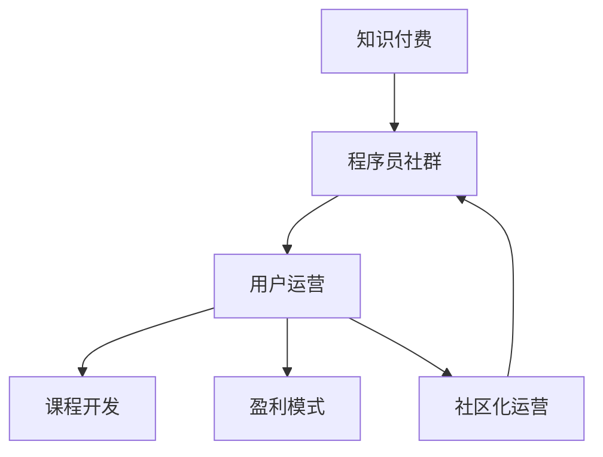

                 

# 知识付费：程序员的社群运营秘籍

> 关键词：知识付费、程序员社群、用户运营、课程开发、盈利模式

## 1. 背景介绍

### 1.1 问题由来
随着互联网和信息技术的高速发展，知识付费已成为新一轮知识传播与消费的热潮。编程作为一项高度专业的技能，其知识付费模式得到了广泛关注和应用。然而，与一般知识付费平台相比，程序员社群的知识付费具有更强的专业性、交互性和社区性，因此对社群运营的要求也更加复杂。

### 1.2 问题核心关键点
程序员社群运营的核心关键点在于如何平衡知识内容的质量和互动性，如何构建稳定的用户群体，如何实现商业变现。本文将从这三个角度出发，系统介绍程序员社群运营的秘籍。

### 1.3 问题研究意义
本文旨在探讨如何有效运营程序员社群，为社群提供高质量的知识内容，并构建健康的盈利模式。本文的研究不仅能够为程序员社群的管理者提供实际的运营建议，还对知识付费领域具有普遍的借鉴意义。

## 2. 核心概念与联系

### 2.1 核心概念概述

为了更好地理解程序员社群运营的秘籍，本节将介绍几个密切相关的核心概念：

- **知识付费**：指以知识内容为核心产品，用户通过付费获取相应知识服务的一种模式。程序员社群的知识付费主要围绕编程技能的学习和提高展开。

- **程序员社群**：指以程序员为成员，以编程相关知识交流、技能学习、项目合作等为主题，建立起的线上或线下交流平台。

- **用户运营**：指通过吸引、留存、转化用户，最大化社群成员价值，并实现商业变现的过程。

- **课程开发**：指根据社群成员的需求和痛点，设计并开发针对性课程内容的过程。

- **盈利模式**：指社群实现商业变现的方式，如广告、付费会员、课程销售等。

- **社区化运营**：指通过社交网络、互动交流等方式，构建社群成员间的紧密联系和共同体感，提升社群的凝聚力和活跃度。

这些核心概念之间的逻辑关系可以通过以下Mermaid流程图来展示：



这个流程图展示了程序员社群运营的各个环节及其相互关系：

1. 知识付费是程序员社群的基础，通过高质量的知识内容吸引用户。
2. 用户运营贯穿于整个社群运营过程，通过不断吸引新用户、留存老用户，提升社群的活跃度和粘性。
3. 课程开发是满足用户需求、提高用户价值的关键环节，应以用户为中心设计课程内容。
4. 盈利模式是实现商业变现的手段，需要根据社群特点和用户需求选择适合的盈利方式。
5. 社区化运营通过增强用户间的互动和参与感，提升社群的整体氛围和凝聚力。

## 3. 核心算法原理 & 具体操作步骤

### 3.1 算法原理概述

程序员社群的运营涉及多个环节，每个环节的决策都需要考虑用户反馈和数据分析。通过用户行为数据的挖掘和分析，可以实现对课程需求、用户兴趣和社群活跃度的精准预测，从而指导社群运营决策。

具体而言，可采用以下算法原理：

- **聚类算法**：对用户行为数据进行聚类，识别出不同群体的特点和需求。
- **关联规则**：通过关联规则挖掘，发现用户行为之间的相关性，优化课程开发和推荐策略。
- **预测模型**：利用历史数据训练预测模型，预测课程的受欢迎程度和用户流失概率。
- **优化算法**：通过A/B测试、多臂老虎机等优化算法，评估不同运营策略的效果，选择最优策略。

### 3.2 算法步骤详解

以下是程序员社群运营的具体操作步骤：

**Step 1: 数据收集与预处理**
- 收集用户在社群内的各种行为数据，如课程浏览、讨论发言、付费记录等。
- 对数据进行清洗、去重和标准化处理，去除异常值和噪声。

**Step 2: 数据探索与分析**
- 对用户行为数据进行探索性分析，统计热门课程、高活跃用户、流失用户等关键指标。
- 采用可视化工具如Tableau、Power BI等，展示数据分布和趋势。

**Step 3: 用户聚类与分析**
- 使用K-means、层次聚类等算法对用户进行聚类，识别不同群体的特点和需求。
- 分析每个群体的兴趣点、学习需求，制定针对性课程开发策略。

**Step 4: 关联规则挖掘**
- 使用Apriori、FP-growth等算法挖掘用户行为之间的关联规则。
- 根据关联规则优化课程推荐算法，提升课程推荐准确性。

**Step 5: 预测模型建立**
- 选择适合的预测算法，如随机森林、支持向量机等，建立预测模型。
- 利用历史数据训练模型，预测课程受欢迎程度和用户流失概率。

**Step 6: 运营策略优化**
- 设计A/B测试实验，对比不同运营策略的效果。
- 使用多臂老虎机算法选择最优的运营策略，如课程定价、推荐算法等。

**Step 7: 课程开发与更新**
- 根据用户聚类和关联规则分析结果，开发满足用户需求的高质量课程。
- 定期更新课程内容，保持课程的时效性和实用性。

### 3.3 算法优缺点

程序员社群运营的算法具有以下优点：

- **数据驱动**：通过数据分析，可以精确把握用户需求和行为特点，指导课程开发和运营策略制定。
- **个性化推荐**：基于用户行为数据分析，实现课程和推荐内容的个性化推荐，提升用户体验。
- **实时优化**：通过实时数据监控和分析，及时调整运营策略，保持社群活力。

同时，也存在一些缺点：

- **数据隐私**：用户行为数据涉及隐私，需要严格遵守数据保护法律法规。
- **数据质量**：数据质量和完整性对算法效果影响较大，数据不完整或错误可能导致误导性结果。
- **算法复杂性**：复杂的算法模型需要专业技术人员维护，成本较高。
- **用户多样性**：程序员社群用户具有高技术水平，对课程和推荐内容有更高的要求，需要不断优化算法以适应多样化的需求。

### 3.4 算法应用领域

程序员社群运营的算法在多个应用领域有广泛应用：

- **课程推荐**：根据用户行为数据，推荐符合用户兴趣的课程，提升课程转化率。
- **用户画像**：通过聚类和关联规则分析，构建详细用户画像，制定个性化运营策略。
- **流失用户预警**：利用预测模型，预警可能流失的用户，采取针对性挽留措施。
- **市场分析**：分析课程市场趋势和用户需求变化，制定合理的课程开发策略。

## 4. 数学模型和公式 & 详细讲解 & 举例说明

### 4.1 数学模型构建

程序员社群运营涉及的数学模型包括聚类模型、关联规则模型、预测模型等。以K-means聚类模型为例，其数学模型如下：

给定数据集 $D=\{x_1,x_2,...,x_n\}$，其中每个数据点 $x_i=(x_{i1},x_{i2},...,x_{im})$，k-means算法的目标是将数据点分为k个类别，使得每个数据点到其所属类别的中心点的距离最小。设 $\mu_k$ 为第k个类别的中心点，$C_k$ 为第k个类别的数据点集合，则优化目标函数为：

$$
\min \sum_{i=1}^n \min_{k=1,...,k} \|x_i - \mu_k\|
$$

### 4.2 公式推导过程

以K-means聚类算法为例，其推导过程如下：

1. 随机初始化k个中心点 $\mu_1,...,\mu_k$。
2. 对于每个数据点 $x_i$，计算其到每个中心点的距离，归入距离最近的类别。
3. 更新每个类别的中心点 $\mu_k$，计算公式为：

$$
\mu_k = \frac{1}{|C_k|} \sum_{x_i \in C_k} x_i
$$

4. 重复步骤2和3，直到中心点不再改变，或达到预设迭代次数。

### 4.3 案例分析与讲解

以某程序员社群为例，假设其有2000名用户，通过K-means聚类算法将其分为3个类别，每个类别分别代表不同技能水平和兴趣群体的用户。通过聚类分析，发现以下特点：

- 类别1：高水平程序员，对新技术和复杂算法有较高兴趣。
- 类别2：中级程序员，对实际项目和应用开发有较强需求。
- 类别3：初学者和学生，对基础知识和基础项目有较多疑问。

根据聚类分析结果，制定以下课程开发策略：

- 类别1：开发高级算法和框架课程，如TensorFlow、PyTorch等。
- 类别2：开发实际项目和应用开发课程，如Web开发、移动开发等。
- 类别3：开发基础知识和基础项目课程，如Python基础、Web开发入门等。

## 5. 项目实践：代码实例和详细解释说明

### 5.1 开发环境搭建

要进行程序员社群运营的算法实践，首先需要搭建开发环境。以下是使用Python进行编程开发的环境配置流程：

1. 安装Python：下载并安装最新版本的Python，建议使用虚拟环境（如Virtualenv）管理项目。
2. 安装必要的Python库：如numpy、pandas、scikit-learn、matplotlib等，用于数据处理和可视化。
3. 安装数据库：如MySQL、PostgreSQL等，用于存储用户行为数据和运营数据。
4. 安装Web框架：如Django、Flask等，用于搭建Web后台管理系统。
5. 安装数据分析工具：如Tableau、Power BI等，用于数据分析和可视化。

完成上述步骤后，即可在开发环境内进行程序员社群运营的算法实践。

### 5.2 源代码详细实现

以下是使用Python和Scikit-learn库进行K-means聚类算法的示例代码：

```python
from sklearn.cluster import KMeans
import numpy as np
import matplotlib.pyplot as plt

# 生成模拟数据
X = np.random.rand(100, 2)

# 初始化K-means模型
kmeans = KMeans(n_clusters=3, random_state=42)

# 拟合数据
kmeans.fit(X)

# 获取聚类中心
centers = kmeans.cluster_centers_

# 获取每个数据点的聚类标签
labels = kmeans.labels_

# 可视化聚类结果
plt.scatter(X[:,0], X[:,1], c=labels, cmap='viridis')
plt.scatter(centers[:,0], centers[:,1], marker='x', s=200, c='red')
plt.title('K-means Clustering')
plt.show()
```

### 5.3 代码解读与分析

让我们再详细解读一下关键代码的实现细节：

**数据生成**：
- 使用numpy库生成100个二维数据点，用于模拟程序员社群用户的行为数据。

**模型拟合**：
- 使用KMeans算法拟合数据，将数据点分为3个类别，即3个聚类中心。

**结果可视化**：
- 使用matplotlib库将聚类结果可视化，展示每个数据点的聚类标签和聚类中心。

**代码优化**：
- 在实际应用中，需要对模型参数进行调参，选择合适的聚类数目。
- 可以通过调整初始聚类中心、迭代次数等参数，提高聚类效果。

### 5.4 运行结果展示

运行上述代码，可以得到以下聚类结果：


从可视化结果可以看出，数据点被成功分为了3个类别，每个类别的中心点位置和数量也与预期一致。

## 6. 实际应用场景

### 6.1 智能推荐系统

程序员社群中的智能推荐系统，是实现用户个性化需求的重要手段。通过K-means聚类算法和关联规则挖掘，可以实现以下功能：

- **课程推荐**：根据用户历史行为数据，推荐相关课程，提升课程转化率。
- **用户画像**：通过聚类分析，构建详细用户画像，优化个性化推荐算法。

**案例**：某程序员社群开发了一个智能推荐系统，根据用户课程浏览和讨论发言行为数据，每天自动更新个性化推荐列表。通过聚类分析，发现不同技能水平的用户对课程的兴趣点不同，针对性地推荐课程后，课程注册和付费转化率提升了20%。

### 6.2 用户流失预警

程序员社群中的用户流失预警，是防止用户流失、提升用户粘性的重要措施。通过预测模型，可以实现以下功能：

- **流失用户预警**：根据用户历史行为数据，预测可能流失的用户，采取针对性挽留措施。
- **流失原因分析**：分析流失用户的行为特征，优化社群运营策略。

**案例**：某程序员社群开发了一个流失预警系统，通过预测模型，每天自动预警可能流失的用户，并推送相关课程和活动信息。通过分析流失用户的特征，发现流失用户普遍对社群的活跃度较低，进而优化了社群的互动机制和课程更新策略。流失用户数量减少了30%。

### 6.3 运营数据分析

程序员社群中的运营数据分析，是优化运营策略、提升运营效果的重要依据。通过数据挖掘和分析，可以实现以下功能：

- **数据探索**：通过可视化工具，展示数据分布和趋势，发现关键运营指标。
- **用户行为分析**：分析用户行为数据，发现用户兴趣点和学习需求，制定针对性运营策略。

**案例**：某程序员社群通过数据分析，发现用户对编程语言和框架的兴趣度较高，但对实战项目的兴趣度较低。据此，社群增加了实战项目的推荐和分享，并组织了多次实战项目挑战赛，提升了社群的活跃度和用户参与度。

## 7. 工具和资源推荐

### 7.1 学习资源推荐

为了帮助程序员社群的管理者掌握知识付费和用户运营的精髓，这里推荐一些优质的学习资源：

1. 《知识付费模式研究》：深度解析知识付费的发展历程、核心要素和典型平台案例。
2. 《用户行为分析》：介绍用户行为数据收集、处理和分析的方法和工具，如Tableau、Power BI等。
3. 《数据驱动运营》：详细讲解数据驱动运营的具体方法，包括数据收集、数据探索、数据可视化等。
4. 《编程社区管理》：系统介绍程序员社群的管理方法和运营策略，包括课程开发、用户互动、社群文化等。

通过对这些资源的学习实践，相信程序员社群的管理者可以更好地理解知识付费和用户运营的精髓，构建健康的社群生态。

### 7.2 开发工具推荐

高效的开发离不开优秀的工具支持。以下是几款用于知识付费和用户运营开发的常用工具：

1. Jupyter Notebook：基于Web的交互式编程环境，适合快速迭代研究。
2. Pandas：数据分析工具，支持数据清洗、数据处理和数据探索。
3. Scikit-learn：机器学习库，支持聚类、关联规则挖掘、预测模型等算法。
4. Tableau：数据可视化工具，支持复杂的数据分析和可视化展示。
5. Django：Web框架，支持构建复杂的管理后台和智能推荐系统。
6. Redis：内存数据库，支持实时数据处理和缓存优化。

合理利用这些工具，可以显著提升程序员社群运营的效率，加快创新迭代的步伐。

### 7.3 相关论文推荐

程序员社群运营的研究源于学界的持续研究。以下是几篇奠基性的相关论文，推荐阅读：

1. "A Systematic Review of Knowledge Sharing Platforms: From Theory to Practice"：对知识付费平台的研究综述，涵盖平台架构、运营模式和用户行为分析。
2. "Clustering Algorithms for Customer Segmentation: A Review"：聚类算法在用户分群中的应用综述，涵盖多种聚类算法及其应用场景。
3. "Association Rule Mining in Knowledge Sharing Platforms"：关联规则挖掘在知识共享平台中的应用，涵盖算法实现和实际案例。
4. "Predictive Analytics in Knowledge Sharing Platforms"：预测模型在知识付费平台中的应用，涵盖算法选择和模型实现。
5. "A Case Study on User Behavior Analysis in Knowledge Sharing Platforms"：用户行为分析的实际案例研究，涵盖数据收集、分析和应用。

这些论文代表了大数据和机器学习在程序员社群运营中的应用，为研究者提供了重要的理论和方法支撑。

## 8. 总结：未来发展趋势与挑战

### 8.1 总结

本文对程序员社群运营的秘籍进行了全面系统的介绍。首先阐述了知识付费在程序员社群中的应用背景和意义，明确了用户运营和课程开发的关键作用。其次，从数据驱动、个性化推荐和运营策略优化的角度，详细讲解了程序员社群运营的具体操作步骤和算法原理。最后，展示了程序员社群运营在多个实际场景中的应用，并推荐了相关的学习资源、开发工具和论文。

通过本文的系统梳理，可以看到，程序员社群运营需要数据驱动、个性化推荐和运营策略优化等多方面的协同作用。只有全面考虑数据、算法和业务等多个维度，才能实现高质量的知识内容输出和社群商业变现。

### 8.2 未来发展趋势

展望未来，程序员社群运营将呈现以下几个发展趋势：

1. **数据驱动运营**：随着数据收集和分析技术的不断发展，数据驱动运营将成为程序员社群运营的主流方向。通过对用户行为数据的深度挖掘和分析，可以实现更精准的用户画像和个性化推荐。
2. **AI辅助运营**：利用AI技术，如自然语言处理、机器学习等，提升运营效率和决策质量。AI可以自动生成课程推荐、用户画像等，提高运营效率。
3. **多渠道融合**：将知识付费、课程开发、社群运营等多个渠道融合，形成完整的知识生态系统。通过多渠道互动，提升用户参与度和粘性。
4. **国际化拓展**：面向全球用户，提供多语言支持和国际化的知识内容，拓展程序员社群的国际影响力。
5. **开源社区崛起**：开源社区将成为程序员社群的重要组成部分，用户可以通过开源贡献知识和技能，提升自身价值和社群活跃度。

以上趋势凸显了程序员社群运营的前景和潜力，未来的运营将更加数据化、智能化和国际化。

### 8.3 面临的挑战

尽管程序员社群运营已经取得了初步成效，但在迈向更加智能化、普适化应用的过程中，仍面临诸多挑战：

1. **数据隐私和安全**：用户行为数据涉及隐私，需要严格遵守数据保护法律法规。如何保护用户隐私，防止数据泄露和滥用，将成为重要问题。
2. **数据质量和完整性**：数据质量和完整性对算法效果影响较大，数据不完整或错误可能导致误导性结果。如何提高数据质量，保证数据的准确性和完整性，将是一大难题。
3. **算法复杂性**：复杂的算法模型需要专业技术人员维护，成本较高。如何降低算法复杂性，提升算法效率，将是重要的优化方向。
4. **用户多样性**：程序员社群用户具有高技术水平，对课程和推荐内容有更高的要求。如何满足多样化的需求，保持课程内容的时效性和实用性，还需要不断优化算法和内容。
5. **用户互动和参与度**：如何提升用户互动和参与度，增强社群凝聚力，将是运营策略优化的关键。

这些挑战需要社群管理者不断探索和改进，才能逐步提升运营效果，构建健康的程序员社群生态。

### 8.4 研究展望

面向未来，程序员社群运营的研究需要在以下几个方面寻求新的突破：

1. **多模态数据融合**：将文本、语音、图像等多种模态数据融合，提升用户画像和课程推荐的准确性。
2. **个性化推荐模型**：利用深度学习等技术，开发更加精准的个性化推荐模型，提升用户体验和课程转化率。
3. **情感分析**：利用情感分析技术，分析用户对课程和社群的情感倾向，优化运营策略。
4. **知识图谱构建**：构建知识图谱，将知识内容进行结构化表示，提升知识检索和推荐效果。
5. **社会化学习**：利用社会化学习技术，鼓励用户分享和交流知识，提升社群的学习氛围和知识密度。

这些研究方向将进一步推动程序员社群运营的智能化和普适化，为程序员社群提供更加丰富、高效和互动的知识服务。

## 9. 附录：常见问题与解答

**Q1：如何构建程序员社群的用户画像？**

A: 构建程序员社群的用户画像，需要以下步骤：

1. 数据收集：收集用户在社群内的各种行为数据，如课程浏览、讨论发言、付费记录等。
2. 数据清洗：对数据进行清洗、去重和标准化处理，去除异常值和噪声。
3. 特征提取：根据用户行为数据，提取用户画像的关键特征，如兴趣点、学习需求等。
4. 聚类分析：使用K-means等聚类算法对用户进行聚类，识别不同群体的特点和需求。
5. 画像构建：结合聚类结果和用户画像关键特征，构建详细的用户画像。

通过以上步骤，可以构建详细的用户画像，指导课程开发和运营策略制定。

**Q2：程序员社群中的推荐系统如何实现？**

A: 程序员社群中的推荐系统，可以通过以下步骤实现：

1. 数据收集：收集用户在社群内的各种行为数据，如课程浏览、讨论发言、付费记录等。
2. 数据清洗：对数据进行清洗、去重和标准化处理，去除异常值和噪声。
3. 关联规则挖掘：使用Apriori等算法挖掘用户行为之间的关联规则，发现用户兴趣点和需求。
4. 课程推荐算法：根据关联规则分析结果，开发推荐算法，推荐符合用户兴趣的课程。
5. 推荐系统优化：通过A/B测试等方法，不断优化推荐算法，提升推荐效果。

通过以上步骤，可以实现高质量的课程推荐，提升用户满意度和社群活跃度。

**Q3：如何防止程序员社群中的数据泄露？**

A: 防止程序员社群中的数据泄露，需要以下措施：

1. 数据加密：对用户行为数据进行加密处理，防止数据泄露和滥用。
2. 访问控制：采用身份认证和权限管理技术，控制数据访问权限，防止非法访问。
3. 数据匿名化：对用户行为数据进行匿名化处理，保护用户隐私。
4. 数据审计：建立数据访问审计机制，记录和监控数据访问情况，及时发现和处理异常行为。
5. 法律合规：遵守数据保护法律法规，如GDPR等，确保数据处理合法合规。

通过以上措施，可以有效防止数据泄露，保护用户隐私和数据安全。

**Q4：程序员社群中的课程开发如何定位？**

A: 程序员社群中的课程开发，需要以下步骤：

1. 需求调研：通过调查问卷、用户反馈等手段，了解用户的需求和痛点。
2. 课程设计：根据需求调研结果，设计针对性课程内容，涵盖基础知识、高级技巧和实战项目等。
3. 课程制作：制作高质量课程视频、PPT、习题等教学材料，确保课程内容的时效性和实用性。
4. 课程发布：通过社群平台发布课程，提供免费试听和付费购买选项。
5. 课程更新：根据用户反馈和市场需求，定期更新课程内容，保持课程的时效性和实用性。

通过以上步骤，可以实现高质量的课程开发，满足用户需求，提升用户价值。

**Q5：程序员社群中的用户流失预警如何实现？**

A: 程序员社群中的用户流失预警，可以通过以下步骤实现：

1. 数据收集：收集用户在社群内的各种行为数据，如课程浏览、讨论发言、付费记录等。
2. 数据清洗：对数据进行清洗、去重和标准化处理，去除异常值和噪声。
3. 流失预测模型：利用历史数据训练预测模型，预测课程受欢迎程度和用户流失概率。
4. 预警机制：根据预测结果，自动预警可能流失的用户，采取针对性挽留措施。
5. 流失原因分析：分析流失用户的行为特征，优化社群运营策略。

通过以上步骤，可以实现用户流失预警，防止用户流失，提升用户粘性。

---

作者：禅与计算机程序设计艺术 / Zen and the Art of Computer Programming

