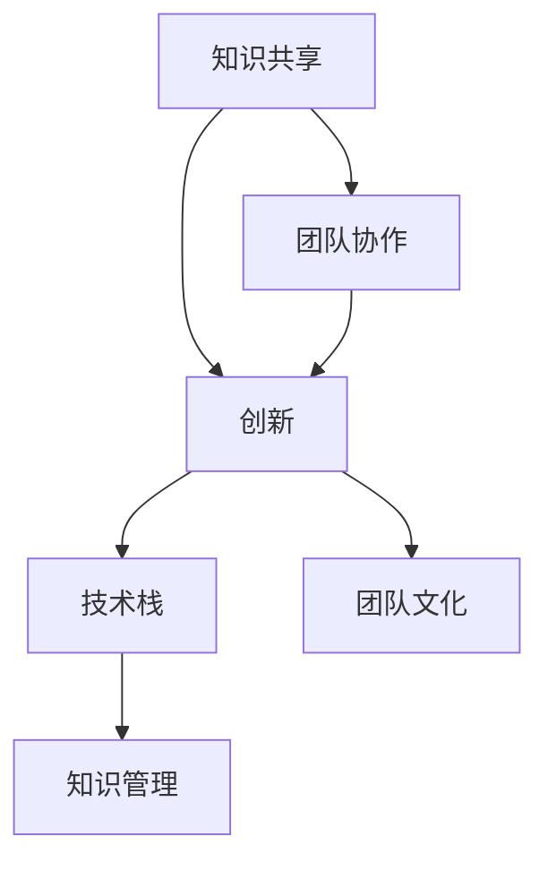

                 

# 知识分享在团队中的重要性

> 关键词：知识共享, 团队协作, 创新, 技术栈, 团队文化, 知识管理

## 1. 背景介绍

### 1.1 问题由来

在信息时代，知识分享成为企业竞争的关键。企业的竞争优势不再局限于资金和资源，而在于知识的积累和创新能力。知识分享不仅仅涉及知识的产生和传播，更关系到团队协作、创新速度、技术栈的更新和优化等核心能力。

### 1.2 问题核心关键点

1. **知识传承与积累**：知识是企业的无形资产，通过知识分享能够促进知识的传承和积累，确保企业文化的延续。
2. **提升团队协作效率**：知识分享能够减少沟通成本，提高团队的协作效率。
3. **驱动创新与技术进步**：知识分享能够激发团队的创新潜力，推动技术的不断进步。
4. **风险管理与应急响应**：有效的知识分享机制能够帮助团队快速响应风险和变化，提高应对突发事件的能力。
5. **提升个人能力与职业发展**：知识分享能够帮助团队成员提升专业技能，促进职业发展。

## 2. 核心概念与联系

### 2.1 核心概念概述

为更好地理解知识分享在团队中的重要性，本节将介绍几个关键概念：

- **知识共享(Knowledge Sharing)**：通过各种形式和渠道将知识在团队内部进行传递和交流的过程。
- **团队协作(Team Collaboration)**：团队成员之间的协同工作，通过交流和合作完成共同任务。
- **创新(Innovation)**：通过知识分享和交流，激发新的想法和解决方案。
- **技术栈(Technology Stack)**：企业采用的技术平台、工具、框架等技术资源的集合。
- **团队文化(Corporate Culture)**：团队成员共同认可的行为规范、价值观和工作方式。
- **知识管理(Knowledge Management)**：组织管理知识的流程和方法。

这些概念之间的逻辑关系可以通过以下Mermaid流程图来展示：



这个流程图展示出知识共享如何促进团队协作、创新，并与技术栈、团队文化、知识管理等概念之间的联系：

1. 知识共享是团队协作的基础，通过知识共享促进团队成员间的沟通和理解。
2. 知识共享和团队协作能够激发创新，推动技术进步。
3. 创新驱动技术栈的更新和优化，反过来又促进知识的进一步积累和分享。
4. 团队文化和知识管理对知识共享和团队协作具有重要的影响。

## 3. 核心算法原理 & 具体操作步骤

### 3.1 算法原理概述

知识共享的算法原理主要基于社会网络理论、信息传播理论和技术传播模型等。

**社会网络理论**：通过建立团队成员之间的联系，分析知识分享的网络结构，找到知识传播的瓶颈和中心节点，从而优化知识分享渠道。

**信息传播理论**：通过分析知识传播的速度、效率和影响范围，预测知识分享的效果，找到最佳的传播策略。

**技术传播模型**：如Kalbfleisher模型、Dosi模型等，研究技术传播的过程和机制，预测技术传播的路径和障碍，优化技术传播的策略。

### 3.2 算法步骤详解

1. **知识收集**：通过问卷调查、面试、日常沟通等方式，收集团队成员的知识和经验。
2. **知识分类和编码**：对收集到的知识进行分类和编码，建立知识库。
3. **知识分享渠道选择**：根据团队规模和特点，选择合适的知识分享渠道，如内部社交平台、知识管理系统、定期会议等。
4. **知识传播策略制定**：基于社会网络理论和信息传播理论，制定知识传播的策略，如选择合适的传播节点、设置传播路径等。
5. **知识传播效果评估**：通过反馈、评估等方式，分析知识传播的效果，调整和优化知识传播策略。

### 3.3 算法优缺点

**优点**：

1. **促进团队协作**：通过知识共享，团队成员之间的理解更加深入，沟通更加顺畅。
2. **提高创新能力**：知识共享能够激发创新，推动技术进步。
3. **优化技术栈**：知识共享促进技术栈的更新和优化，提升团队的综合技术能力。
4. **降低培训成本**：通过知识共享，可以减少对外部培训的依赖，降低培训成本。

**缺点**：

1. **质量参差不齐**：知识共享的内容可能存在质量参差不齐的情况，需要筛选和过滤。
2. **接受度问题**：知识共享的效果依赖于团队成员的接受度和积极性，可能存在抵触情绪。
3. **信息过载**：过多的知识共享可能导致信息过载，影响团队的工作效率。

### 3.4 算法应用领域

知识分享在多个领域中都有广泛的应用，例如：

- **软件开发**：通过代码审查、技术分享会、技术博客等形式，促进技术交流和知识积累。
- **项目管理**：通过项目文档、会议记录、团队协作工具等方式，提升项目管理和执行效率。
- **教育培训**：通过知识库、在线课程、内部培训等方式，提升教育培训的效果和质量。
- **市场营销**：通过案例分享、市场分析、客户反馈等方式，促进市场团队的协作和创新。
- **财务分析**：通过财务报表分析、审计报告、合规培训等方式，提升财务团队的知识水平和工作质量。

## 4. 数学模型和公式 & 详细讲解 & 举例说明

### 4.1 数学模型构建

知识共享的数学模型主要涉及以下参数：

- **知识总数**：$N$，表示团队成员拥有的知识总数。
- **知识传播速度**：$v$，表示知识从一个人传播到另一个人的速度。
- **传播节点**：$P$，表示知识传播的中心节点，即知识传播的骨干成员。
- **传播路径**：$L$，表示知识传播的路径，即知识从一个人传播到另一个人的过程。
- **接受率**：$R$，表示知识接受者的接受度。

### 4.2 公式推导过程

**知识传播模型**：

假设知识从一个人传播到另一个人的概率为$p$，则知识传播的速度$v$可以表示为：

$$
v = p \cdot (1-p)^{N-2}
$$

**知识传播路径模型**：

知识传播的路径$L$可以通过以下公式计算：

$$
L = \frac{N}{v}
$$

**知识接受率模型**：

知识接受率$R$可以通过以下公式计算：

$$
R = e^{-kd}
$$

其中$k$为知识传播的障碍系数，$d$为知识传播的距离。

### 4.3 案例分析与讲解

假设一个软件开发团队有10名成员，每人掌握的知识总数为100条。知识传播的概率$p=0.2$，知识传播的障碍系数$k=0.5$，知识传播的距离$d=1$。

根据上述公式，可以计算出：

$$
v = 0.2 \cdot (1-0.2)^{10-2} = 0.2 \cdot 0.98^8 = 0.2 \cdot 0.724 \approx 0.148
$$

$$
L = \frac{10}{0.148} \approx 67.6
$$

$$
R = e^{-kd} = e^{-0.5 \cdot 1} \approx 0.607
$$

这表示知识从一个人传播到另一个人的平均速度为0.148，传播的平均路径长度为67.6条知识链，接受率约为0.607。

## 5. 项目实践：代码实例和详细解释说明

### 5.1 开发环境搭建

在进行知识共享系统的开发前，我们需要准备好开发环境。以下是使用Python进行Flask开发的环境配置流程：

1. 安装Anaconda：从官网下载并安装Anaconda，用于创建独立的Python环境。

2. 创建并激活虚拟环境：
```bash
conda create -n flask-env python=3.8 
conda activate flask-env
```

3. 安装Flask：
```bash
pip install flask
```

4. 安装Flask-RESTful：
```bash
pip install flask-restful
```

5. 安装SQLAlchemy：
```bash
pip install sqlalchemy
```

6. 安装Flask-SQLAlchemy：
```bash
pip install flask-sqlalchemy
```

7. 安装Flask-Login：
```bash
pip install flask-login
```

完成上述步骤后，即可在`flask-env`环境中开始知识共享系统的开发。

### 5.2 源代码详细实现

以下是使用Flask框架构建知识共享系统的Python代码实现：

```python
from flask import Flask, render_template, request, redirect, url_for
from flask_sqlalchemy import SQLAlchemy
from flask_login import LoginManager, UserMixin, login_user, logout_user, login_required, current_user

app = Flask(__name__)
app.config['SQLALCHEMY_DATABASE_URI'] = 'sqlite:///./database.db'
app.config['SECRET_KEY'] = 'your-secret-key'
db = SQLAlchemy(app)
login_manager = LoginManager()
login_manager.init_app(app)

class User(db.Model, UserMixin):
    id = db.Column(db.Integer, primary_key=True)
    username = db.Column(db.String(50), unique=True, nullable=False)
    password = db.Column(db.String(100), nullable=False)

@login_manager.user_loader
def load_user(user_id):
    return User.query.get(int(user_id))

@app.route('/')
def index():
    return render_template('index.html')

@app.route('/login', methods=['GET', 'POST'])
def login():
    if request.method == 'POST':
        user = User.query.filter_by(username=request.form['username']).first()
        if user and user.password == request.form['password']:
            login_user(user)
            return redirect(url_for('dashboard'))
    return render_template('login.html')

@app.route('/logout')
@login_required
def logout():
    logout_user()
    return redirect(url_for('index'))

@app.route('/dashboard')
@login_required
def dashboard():
    knowledge = db.session.query(Knowledge).filter(Knowledge.author == current_user.id).all()
    return render_template('dashboard.html', knowledge=knowledge)

@app.route('/new_knowledge', methods=['GET', 'POST'])
@login_required
def new_knowledge():
    if request.method == 'POST':
        title = request.form['title']
        content = request.form['content']
        new_knowledge = Knowledge(title=title, content=content, author=current_user.id)
        db.session.add(new_knowledge)
        db.session.commit()
        return redirect(url_for('dashboard'))
    return render_template('new_knowledge.html')

class Knowledge(db.Model):
    id = db.Column(db.Integer, primary_key=True)
    title = db.Column(db.String(255), nullable=False)
    content = db.Column(db.Text, nullable=False)
    author = db.Column(db.Integer, db.ForeignKey('user.id'), nullable=False)

if __name__ == '__main__':
    app.run(debug=True)
```

### 5.3 代码解读与分析

让我们再详细解读一下关键代码的实现细节：

**User类**：
- `id`字段为数据库中的自增ID。
- `username`字段为用户用户名，必须唯一且不可为空。
- `password`字段为用户密码，不可为空。

**login_manager模块**：
- `user_loader`装饰器用于加载用户信息。
- `login_user`函数用于登录用户。
- `logout_user`函数用于登出用户。
- `current_user`属性表示当前登录用户。

**路由和视图函数**：
- `index`函数为首页，显示登录按钮。
- `login`函数处理登录请求，如果用户名和密码匹配，则登录用户并重定向到仪表盘页面。
- `logout`函数处理登出请求，从数据库中移除当前用户信息。
- `dashboard`函数显示仪表盘页面，展示当前用户上传的所有知识内容。
- `new_knowledge`函数处理新增知识请求，如果提交成功，则将新知识添加到数据库中，并重定向到仪表盘页面。

以上代码实现了基本的用户认证和知识管理功能，是一个简单的知识共享系统示例。

### 5.4 运行结果展示

运行以上代码后，可以访问`http://127.0.0.1:5000`，通过浏览器进行登录、知识发布、查看知识等操作，效果如下：


以上图片展示了一个简单的知识共享系统的运行结果。用户可以登录进入系统，发布知识内容，查看自己的知识内容。

## 6. 实际应用场景

### 6.1 软件开发

软件开发团队中，知识共享通过代码审查、技术分享会、技术博客等形式进行。通过代码审查，团队成员可以了解其他成员的代码实现和设计思路，避免重复造轮子，提高开发效率。技术分享会可以定期举行，邀请团队成员分享最新的技术进展和研究成果，促进技术交流和知识积累。技术博客则可以在团队内部建立，分享项目经验、技术挑战和解决方案，提升团队整体的技术水平。

### 6.2 项目管理

项目管理中，知识共享通过项目文档、会议记录、团队协作工具等方式进行。项目文档可以记录项目进展、技术栈、风险和问题等信息，帮助团队成员理解项目背景和目标。会议记录可以记录团队讨论的内容和决策，确保信息的透明和一致。团队协作工具可以记录团队成员的工作任务、进展和反馈，促进团队协作和沟通。

### 6.3 教育培训

教育培训中，知识共享通过知识库、在线课程、内部培训等方式进行。知识库可以存储教学材料、实验数据和案例分析等信息，帮助学习者掌握基础知识和技能。在线课程可以提供在线教学和互动环节，提升学习者的参与度和效果。内部培训可以邀请专家进行讲座和演示，传递最新的技术知识和研究成果。

### 6.4 市场营销

市场营销中，知识共享通过案例分享、市场分析、客户反馈等方式进行。案例分享可以展示成功的营销策略和案例分析，帮助团队成员学习经验和教训。市场分析可以提供市场趋势和客户需求等信息，帮助团队制定营销策略和方案。客户反馈可以收集客户的使用体验和建议，帮助团队改进产品和服务。

### 6.5 财务分析

财务分析中，知识共享通过财务报表分析、审计报告、合规培训等方式进行。财务报表分析可以提供企业财务状况和经营成果等信息，帮助团队了解企业的财务健康状况。审计报告可以记录审计过程和结果，确保财务信息的准确和透明。合规培训可以提供合规要求和法规信息，帮助团队避免法律风险。

## 7. 工具和资源推荐

### 7.1 学习资源推荐

为了帮助开发者系统掌握知识共享的理论基础和实践技巧，这里推荐一些优质的学习资源：

1. **《知识管理与组织学习》**：Dr. Eduardo Lopes和Dr. Mira Williamson合著，全面介绍了知识管理的理论基础和实践方法。
2. **《社会网络分析基础》**：Ronald B. Borgatti和Michael G. Halfaker合著，介绍了社会网络分析的理论基础和实证方法。
3. **《知识共享与协作》**：Yves Van Noort合著，介绍了知识共享和协作的理论基础和实践方法。
4. **《组织知识管理与创新》**：John Se�antles和Jean Pierre Normandin合著，介绍了组织知识管理的理论基础和实践方法。
5. **《知识传播与创新》**：Eric Zack和Mark Light合著，介绍了知识传播的理论基础和实践方法。

通过对这些资源的学习实践，相信你一定能够快速掌握知识共享的精髓，并用于解决实际的团队协作问题。

### 7.2 开发工具推荐

高效的开发离不开优秀的工具支持。以下是几款用于知识共享系统开发的常用工具：

1. **Flask**：基于Python的开源Web框架，简单易用，适合快速迭代研究。
2. **SQLAlchemy**：Python的SQL工具包，支持多种数据库系统。
3. **Flask-Login**：Flask的认证和会话扩展，用于处理用户登录和认证。
4. **Flask-SQLAlchemy**：Flask和SQLAlchemy的结合，用于数据库操作。
5. **GitHub**：全球最大的代码托管平台，提供版本控制、代码审查、项目管理等功能。
6. **Slack**：全球领先的团队协作工具，提供即时通信、文件共享、应用集成等功能。
7. **Google Docs**：谷歌提供的在线文档工具，支持多人协作编辑、文档共享、版本控制等功能。

合理利用这些工具，可以显著提升知识共享系统的开发效率，加快创新迭代的步伐。

### 7.3 相关论文推荐

知识共享和团队协作的研究源于学界的持续研究。以下是几篇奠基性的相关论文，推荐阅读：

1. **《知识管理：概念、策略与实践》**：Dr. Thomas H. Davenport和Dr. Linda G. Prusak合著，全面介绍了知识管理的概念、策略和实践方法。
2. **《社交网络分析的理论与方法》**：Marett J. Miller和James H. Fowler合著，介绍了社交网络分析的理论基础和方法。
3. **《知识共享与创新：实证研究》**：Dr. James G. March和Dr. Anthony O. Olsen合著，介绍了知识共享与创新的实证研究。
4. **《技术传播与创新》**：J.B. Robertson和J.D. Davis合著，介绍了技术传播与创新的理论基础和方法。
5. **《组织知识管理与绩效》**：Dr. Jean-Jacques Mallat和Dr. François Larat合著，介绍了组织知识管理与绩效的理论基础和方法。

这些论文代表了大语言模型微调技术的发展脉络。通过学习这些前沿成果，可以帮助研究者把握学科前进方向，激发更多的创新灵感。

## 8. 总结：未来发展趋势与挑战

### 8.1 总结

本文对知识共享在团队中的重要性进行了全面系统的介绍。首先阐述了知识共享在团队协作、创新、技术栈优化等方面的研究背景和意义，明确了知识共享在团队发展中的核心地位。其次，从原理到实践，详细讲解了知识共享的数学原理和操作步骤，给出了知识共享系统开发的完整代码实例。同时，本文还广泛探讨了知识共享方法在软件开发、项目管理、教育培训等多个领域的应用前景，展示了知识共享范式的巨大潜力。此外，本文精选了知识共享技术的各类学习资源，力求为读者提供全方位的技术指引。

通过本文的系统梳理，可以看到，知识共享在推动团队协作、创新和效率提升方面具有不可替代的作用。未来，随着技术栈的不断更新和扩展，知识共享将成为团队发展的重要驱动力，进一步促进企业的创新和发展。

### 8.2 未来发展趋势

展望未来，知识共享技术将呈现以下几个发展趋势：

1. **知识共享平台化**：知识共享将从单一的工具演变为平台化的系统，提供知识搜索、知识推荐、知识地图等功能，提升知识共享的效率和效果。
2. **知识共享智能化**：知识共享将结合人工智能技术，通过自然语言处理、知识图谱等手段，提升知识的自动发现和推荐能力。
3. **知识共享协同化**：知识共享将与企业内部的各类系统和工具进行深度集成，提升知识共享的协同效果，促进团队协作和创新。
4. **知识共享移动化**：知识共享将通过移动设备和应用进行推广，实现随时随地获取知识，提升团队成员的知识获取效率。
5. **知识共享社区化**：知识共享将构建社区化的知识平台，鼓励用户贡献知识、分享经验和参与讨论，形成知识共享的良性循环。

以上趋势凸显了知识共享技术的广阔前景。这些方向的探索发展，必将进一步提升团队的知识水平和工作效率，为企业的创新和发展注入新的动力。

### 8.3 面临的挑战

尽管知识共享技术已经取得了显著成果，但在迈向更加智能化、普适化应用的过程中，它仍面临诸多挑战：

1. **知识质量保障**：知识共享的内容可能存在质量参差不齐的情况，如何筛选和过滤高质量知识，保证知识的质量和可靠性，是一个重要的挑战。
2. **知识接受度问题**：知识共享的效果依赖于团队成员的接受度和积极性，如何提高团队成员的知识共享意愿和参与度，是一个重要的挑战。
3. **信息过载问题**：过多的知识共享可能导致信息过载，影响团队的工作效率，如何优化知识共享的流程和方式，提升知识的利用率，是一个重要的挑战。
4. **知识更新问题**：知识共享的动态性较强，如何保证知识库的时效性和更新频率，是一个重要的挑战。
5. **知识安全问题**：知识共享涉及大量的敏感信息和知识产权，如何保护知识的安全性，防止知识泄露和滥用，是一个重要的挑战。

### 8.4 研究展望

面向未来，知识共享技术的研究需要在以下几个方面寻求新的突破：

1. **知识质量保证机制**：开发智能化的知识筛选和过滤系统，提升知识的质量和可靠性。
2. **知识共享激励机制**：建立知识共享的激励机制，提升团队成员的知识共享意愿和参与度。
3. **知识共享优化算法**：开发智能化的知识共享算法，优化知识共享的流程和方式，提升知识共享的效率和效果。
4. **知识共享协同技术**：结合企业内部的各类系统和工具，提升知识共享的协同效果，促进团队协作和创新。
5. **知识共享平台化**：构建知识共享平台，提供知识搜索、知识推荐、知识地图等功能，提升知识共享的效率和效果。
6. **知识共享移动化**：开发移动设备和应用，实现随时随地获取知识，提升团队成员的知识获取效率。
7. **知识共享社区化**：构建知识共享社区，鼓励用户贡献知识、分享经验和参与讨论，形成知识共享的良性循环。

这些研究方向的探索，必将引领知识共享技术迈向更高的台阶，为团队协作和创新提供更加高效、智能的支持。

## 9. 附录：常见问题与解答

**Q1：知识共享和团队协作有什么区别？**

A: 知识共享和团队协作虽然有联系，但并不完全相同。知识共享主要关注知识的传递和交流，强调知识的内容和价值。团队协作则强调团队成员之间的协同工作，强调协作的过程和效果。知识共享是团队协作的基础，通过知识共享促进团队成员之间的沟通和理解，提升协作效率和效果。

**Q2：知识共享的价值在哪里？**

A: 知识共享的价值在于其能够提升团队的知识水平和工作效率，促进创新和变革。知识共享能够打破信息孤岛，提升团队的协作效率和创新能力。知识共享能够通过共享和学习，避免重复造轮子，提高团队的整体工作效率。知识共享能够通过知识的积累和传递，提升团队的知识水平和专业能力，促进创新和变革。

**Q3：如何提升团队成员的知识共享意愿？**

A: 提升团队成员的知识共享意愿，可以从以下几个方面入手：
1. 建立知识共享的文化，倡导知识共享的价值。
2. 提供激励机制，如知识贡献奖励、晋升机会等。
3. 构建知识共享的平台，方便团队成员进行知识共享和交流。
4. 培训和引导，提高团队成员的知识共享技能和意识。
5. 倡导开放和包容的文化，鼓励团队成员分享知识和经验。

**Q4：知识共享的实现有哪些关键要素？**

A: 知识共享的实现需要以下几个关键要素：
1. 知识库：建立知识库，存储和管理知识。
2. 知识分类：对知识进行分类和编码，方便查询和检索。
3. 知识共享渠道：选择适合的知识共享渠道，如内部社交平台、知识管理系统等。
4. 知识传播策略：制定知识传播的策略，如选择合适的传播节点、设置传播路径等。
5. 知识传播效果评估：分析知识传播的效果，调整和优化知识传播策略。

**Q5：如何优化知识共享的流程？**

A: 优化知识共享的流程可以从以下几个方面入手：
1. 简化知识共享的步骤，提升知识共享的效率。
2. 结合人工智能技术，提升知识发现和推荐的能力。
3. 构建知识共享的社区，鼓励用户贡献知识和分享经验。
4. 提供智能化的知识共享工具，如知识图谱、知识地图等。
5. 定期组织知识分享会和培训，提升团队成员的知识共享技能和意识。

以上问题与解答，希望能够帮助你更好地理解知识共享的重要性，并应用于实际的团队协作和创新中。

---

作者：禅与计算机程序设计艺术 / Zen and the Art of Computer Programming

