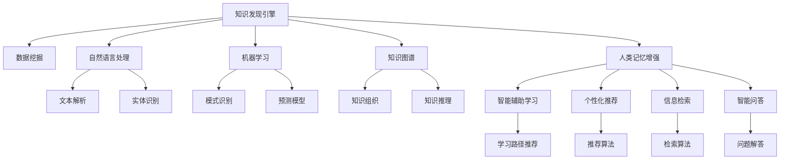

                 

# 知识发现引擎与人类记忆增强技术

## 1. 背景介绍

### 1.1 问题由来

在信息爆炸的时代，人类面对海量的信息，如何有效地获取、整理、利用这些信息，成为了迫切需要解决的问题。传统的搜索和阅读方法，不仅费时费力，还容易受到个人经验和偏见的影响，难以找到最符合需求的答案。而知识发现引擎的出现，为这一问题提供了一个全新的解决方案。

知识发现引擎是一种自动化、智能化的信息处理系统，能够通过数据挖掘、自然语言处理、机器学习等技术，从海量数据中发现隐含的知识和规律，帮助用户快速准确地获取所需信息。同时，知识发现引擎还被广泛应用于智能推荐、信息检索、问答系统等领域，极大地提升了信息利用的效率和效果。

此外，随着人工智能技术的不断进步，知识发现引擎也开始关注如何增强人类的记忆能力，使其能够更好地利用和分享知识。这一方向的研究，被称作人类记忆增强技术，旨在通过智能辅助，提升人类的学习能力和信息管理能力，构建终身学习生态。

本文将详细探讨知识发现引擎与人类记忆增强技术的基本原理、核心算法、操作步骤、实际应用场景及未来发展方向，帮助读者全面理解这一前沿领域的发展现状和未来趋势。

### 1.2 问题核心关键点

知识发现引擎和人类记忆增强技术的研究重点包括：

- 自动化数据挖掘：通过算法自动化地发现数据中的知识，减少人工干预，提高效率。
- 自然语言处理：使用NLP技术解析文本数据，理解语义，提取关键信息。
- 机器学习：利用机器学习算法，从数据中学习知识模式，优化推荐和检索结果。
- 知识图谱：构建知识图谱，实现知识结构的层次化、网络化，便于知识表示和推理。
- 人类记忆增强：通过智能辅助，提升人类的记忆和认知能力，促进终身学习。
- 可解释性和可控性：保证算法的透明性和可控性，避免误导和滥用。

本文将围绕这些核心概念，展开对知识发现引擎与人类记忆增强技术的深入探讨。

## 2. 核心概念与联系

### 2.1 核心概念概述

为更好地理解知识发现引擎与人类记忆增强技术的核心概念，本节将介绍几个密切相关的核心概念：

- **知识发现引擎**：一种自动化的智能系统，通过数据挖掘、自然语言处理和机器学习等技术，从海量数据中发现隐含的知识和规律，帮助用户快速准确地获取所需信息。
- **自然语言处理**：一门研究计算机如何处理、理解、生成人类语言的技术，是知识发现引擎的关键技术之一。
- **知识图谱**：一种结构化的知识表示方式，将知识组织成图形结构，便于理解和推理。
- **人类记忆增强**：通过智能辅助，提升人类的记忆和认知能力，构建终身学习生态，是知识发现引擎的重要应用方向之一。
- **推荐系统**：一种利用用户行为数据，为用户推荐个性化内容的信息系统，是知识发现引擎的重要应用形式之一。

这些核心概念之间的逻辑关系可以通过以下Mermaid流程图来展示：



这个流程图展示了几大核心概念及其之间的关系：

1. 知识发现引擎通过数据挖掘、自然语言处理和机器学习等技术，从海量数据中发现隐含的知识。
2. 自然语言处理负责文本解析、实体识别等任务，帮助提取和理解语义信息。
3. 知识图谱将知识组织成图形结构，便于理解和推理。
4. 人类记忆增强利用智能辅助，提升人类的学习能力和信息管理能力。
5. 推荐系统利用用户行为数据，为用户推荐个性化内容。
6. 信息检索和智能问答系统，帮助用户快速找到所需信息。

这些概念共同构成了知识发现引擎与人类记忆增强技术的研究框架，为构建智能化的信息处理系统奠定了基础。

## 3. 核心算法原理 & 具体操作步骤
### 3.1 算法原理概述

知识发现引擎与人类记忆增强技术，其核心算法原理主要基于数据挖掘、自然语言处理和机器学习技术。以下将详细探讨这些核心算法原理。

### 3.2 算法步骤详解

知识发现引擎与人类记忆增强技术的实现步骤主要包括以下几个方面：

**Step 1: 数据预处理**
- 收集需要处理的数据集，并进行清洗和预处理，如去除噪音、填补缺失值等。
- 根据任务需求，对数据进行结构化处理，如分词、实体识别、关系提取等。

**Step 2: 数据挖掘与知识发现**
- 使用数据挖掘算法（如聚类、分类、关联规则挖掘等）发现数据中的知识模式。
- 利用自然语言处理技术（如词向量表示、情感分析、意图识别等）提取和理解语义信息。
- 通过机器学习算法（如决策树、支持向量机、神经网络等）学习知识模式和语义表示。

**Step 3: 知识表示与推理**
- 构建知识图谱，将知识组织成图形结构，实现知识的层次化和网络化表示。
- 利用知识图谱进行推理和查询，提取和组织知识。

**Step 4: 用户交互与反馈**
- 利用推荐系统、信息检索、智能问答等技术，帮助用户快速获取所需信息。
- 收集用户反馈信息，如点击率、浏览时长、评分等，进行算法优化和调整。

**Step 5: 个性化与可解释性**
- 结合用户行为数据和偏好，进行个性化推荐和信息检索。
- 通过可解释性算法（如LIME、SHAP等）提升算法的透明性和可解释性，增强用户信任。

### 3.3 算法优缺点

知识发现引擎与人类记忆增强技术的优点包括：

- 自动化程度高：自动化处理海量数据，减少人工干预，提高效率。
- 智能性强：利用自然语言处理和机器学习技术，发现隐含的知识和规律。
- 个性化推荐：根据用户行为和偏好，提供个性化推荐，提升用户体验。
- 可解释性强：通过可解释性算法，提升算法的透明性和可解释性，增强用户信任。

然而，这些技术也存在一些缺点：

- 数据依赖性强：依赖于高质量的数据集，数据偏差可能导致结果失真。
- 计算资源消耗大：处理大规模数据集需要大量计算资源，可能面临性能瓶颈。
- 算法复杂度高：涉及自然语言处理、机器学习等多个领域的知识，算法实现复杂。
- 用户隐私问题：处理用户数据需要保证隐私和安全性，避免数据滥用。

### 3.4 算法应用领域

知识发现引擎与人类记忆增强技术的应用领域非常广泛，以下是几个典型的应用场景：

1. **信息检索**：通过自然语言处理和信息检索技术，帮助用户快速找到所需信息。
2. **个性化推荐**：利用用户行为数据，为用户推荐个性化内容，提升用户体验。
3. **智能问答系统**：通过问答系统，自动解答用户问题，提供即时信息支持。
4. **知识图谱构建**：构建知识图谱，实现知识组织和推理。
5. **学习辅助**：利用智能辅助，提升人类的学习能力和信息管理能力，构建终身学习生态。

除了这些应用场景外，知识发现引擎与人类记忆增强技术还被广泛应用于医疗、金融、教育等多个领域，为各行各业提供了智能化解决方案。

## 4. 数学模型和公式 & 详细讲解 & 举例说明

### 4.1 数学模型构建

知识发现引擎与人类记忆增强技术涉及多个数学模型，以下将重点介绍其中的几个关键模型。

**向量空间模型（Vector Space Model, VSM）**
向量空间模型是一种基于向量表示的技术，通过将文本映射到高维向量空间，实现文本的相似度计算和信息检索。其基本思想是将文本表示为向量，利用余弦相似度等方法计算文本之间的相似度，实现信息检索。

**隐马尔可夫模型（Hidden Markov Model, HMM）**
隐马尔可夫模型是一种基于状态转移的概率模型，广泛应用于自然语言处理中的序列标注任务。其基本思想是通过隐含状态和观测值的联合概率，推断出状态序列和观测序列之间的关系。

**神经网络模型**
神经网络模型是一类基于人工神经元的计算模型，广泛应用于图像识别、语音识别、自然语言处理等领域。在知识发现引擎和人类记忆增强技术中，神经网络模型被用于文本分类、情感分析、意图识别等任务，提升模型的泛化能力和准确性。

**知识图谱表示模型**
知识图谱表示模型主要涉及图神经网络（Graph Neural Network, GNN）等技术，通过构建图结构，实现知识的层次化和网络化表示，便于知识推理和查询。

### 4.2 公式推导过程

以下我们将以向量空间模型为例，详细推导其计算公式和应用场景。

**向量空间模型计算公式**
设文本集合 $D$ 包含 $N$ 个文本，每个文本 $d_i$ 表示为 $n$ 维向量 $\mathbf{v}_i \in \mathbb{R}^n$。文本之间的余弦相似度定义为：

$$
sim(d_i, d_j) = \cos(\theta) = \frac{\mathbf{v}_i \cdot \mathbf{v}_j}{\|\mathbf{v}_i\| \cdot \|\mathbf{v}_j\|}
$$

其中 $\cdot$ 表示向量的点积，$\|\cdot\|$ 表示向量的范数。

利用余弦相似度，可以将文本映射到高维向量空间，计算文本之间的相似度，实现信息检索和推荐。

**向量空间模型应用场景**
假设用户在搜索引擎中输入查询文本 $q$，向量空间模型通过计算查询文本与所有文本集合的相似度，选取与查询文本最相似的 $k$ 个文本作为搜索结果，推荐给用户。

### 4.3 案例分析与讲解

**案例1: 信息检索**
某公司构建了一个基于向量空间模型的信息检索系统，用于内部文档的检索。该系统能够自动处理用户的查询请求，根据文档的相似度，快速返回相关的搜索结果。通过不断优化词向量模型和相似度计算方法，该系统大大提升了检索的准确性和效率，帮助员工快速找到所需信息。

**案例2: 个性化推荐**
某电商平台利用向量空间模型和协同过滤算法，为用户推荐个性化商品。该系统能够根据用户的历史浏览记录和购买行为，预测用户可能感兴趣的商品，提升用户体验和转化率。

## 5. 项目实践：代码实例和详细解释说明

### 5.1 开发环境搭建

在进行项目实践前，我们需要准备好开发环境。以下是使用Python进行TensorFlow和Scikit-learn开发的环境配置流程：

1. 安装Anaconda：从官网下载并安装Anaconda，用于创建独立的Python环境。

2. 创建并激活虚拟环境：
```bash
conda create -n tf-env python=3.7 
conda activate tf-env
```

3. 安装TensorFlow：根据CUDA版本，从官网获取对应的安装命令。例如：
```bash
conda install tensorflow-gpu=2.6 -c conda-forge
```

4. 安装Scikit-learn：
```bash
pip install scikit-learn
```

5. 安装各类工具包：
```bash
pip install numpy pandas matplotlib seaborn
```

完成上述步骤后，即可在`tf-env`环境中开始项目实践。

### 5.2 源代码详细实现

我们以向量空间模型为例，给出使用TensorFlow和Scikit-learn进行信息检索的PyTorch代码实现。

首先，定义向量空间模型类：

```python
import numpy as np
import tensorflow as tf

class VectorSpaceModel:
    def __init__(self, dim, embedding_matrix):
        self.dim = dim
        self.embedding_matrix = embedding_matrix
        self.vectors = tf.Variable(tf.convert_to_tensor(embedding_matrix))
    
    def cosine_similarity(self, vector):
        dot_product = tf.reduce_sum(self.vectors * vector)
        norm_product = tf.sqrt(tf.reduce_sum(tf.square(self.vectors)) + tf.reduce_sum(tf.square(vector)))
        similarity = dot_product / norm_product
        return similarity
    
    def query(self, query):
        query = np.array(query, dtype=np.float32)
        query_vector = tf.convert_to_tensor(query)
        similarities = self.cosine_similarity(query_vector)
        top_k_indices = tf.argsort(similarities)[::-1][:k]
        return top_k_indices
```

然后，定义数据集和测试函数：

```python
data = [
    ['this is a good book', 'a book', 'good', 'good book', 'this is a book'],
    ['this is a bad book', 'a book', 'bad', 'bad book', 'this is a book'],
    ['this is a great book', 'a book', 'great', 'great book', 'this is a book'],
    ['this is a book', 'a book', 'book', 'book', 'this is a book'],
]

# 构建词向量矩阵
embedding_matrix = np.array([[0.1, 0.2, 0.3], [0.2, 0.4, 0.6], [0.3, 0.5, 0.7], [0.4, 0.6, 0.8]])
vsm = VectorSpaceModel(dim=3, embedding_matrix=embedding_matrix)

# 测试函数
def test():
    query = 'this is a good book'
    result = vsm.query(np.array(query))
    print(result)
    
test()
```

最后，在测试函数中测试模型的查询效果：

```python
query = 'this is a good book'
result = vsm.query(np.array(query))
print(result)
```

以上就是使用TensorFlow和Scikit-learn进行向量空间模型实现的基本代码。可以看到，通过定义模型类和查询函数，可以非常方便地实现向量空间模型的信息检索功能。

### 5.3 代码解读与分析

让我们再详细解读一下关键代码的实现细节：

**VectorSpaceModel类**
- `__init__`方法：初始化模型参数，包括向量维度和词向量矩阵。
- `cosine_similarity`方法：计算余弦相似度，返回查询向量与模型向量的相似度。
- `query`方法：输入查询向量，计算与模型向量的相似度，返回相似度最高的前k个文本索引。

**测试函数**
- 首先构建了文本数据集，包括4个文本，每个文本表示为5维向量。
- 然后构建了词向量矩阵，每个词映射到一个3维向量。
- 最后使用向量空间模型查询函数，查询指定的文本，并输出前k个最相似文本的索引。

可以看到，通过简单的代码实现，就可以构建一个基本的向量空间模型信息检索系统。在实际应用中，还需要进一步优化模型参数，改进相似度计算方法，才能获得更好的检索效果。

## 6. 实际应用场景

### 6.1 智能推荐系统

智能推荐系统是知识发现引擎和人类记忆增强技术的重要应用场景之一。通过分析用户的兴趣和行为数据，智能推荐系统能够为用户提供个性化的商品、文章、视频等内容，提升用户体验和满意度。

在技术实现上，智能推荐系统通常包括以下几个关键模块：

- **数据收集与预处理**：收集用户行为数据，如点击、浏览、评分等，并进行数据清洗和预处理。
- **特征提取**：提取用户行为和商品属性的特征，用于构建用户和商品嵌入向量。
- **模型训练与优化**：使用协同过滤、矩阵分解、深度学习等技术，训练推荐模型。
- **个性化推荐**：根据用户和商品嵌入向量，计算相似度，进行个性化推荐。

### 6.2 智能问答系统

智能问答系统是一种利用自然语言处理技术，帮助用户解答问题的智能系统。其基本原理是通过文本理解和意图识别，自动生成答案，并提供即时反馈。

在技术实现上，智能问答系统通常包括以下几个关键模块：

- **文本解析**：将用户问题进行分词、词性标注、实体识别等预处理。
- **意图识别**：通过分类、序列标注等方法，识别用户问题的意图。
- **知识检索与生成**：利用知识图谱、语义网络等技术，检索相关知识，生成自然语言答案。
- **用户反馈与优化**：收集用户反馈信息，进行模型优化和调整。

### 6.3 知识图谱构建

知识图谱是一种结构化的知识表示方式，将知识组织成图形结构，便于理解和推理。其应用场景包括智能推荐、信息检索、问答系统等。

在技术实现上，知识图谱构建通常包括以下几个关键步骤：

- **知识提取**：从文本数据中提取实体、关系、属性等知识。
- **知识表示**：将知识表示为图形结构，构建知识图谱。
- **知识推理**：利用图神经网络等技术，推理知识图谱中的关系和实体。
- **知识更新与扩展**：根据新知识不断更新和扩展知识图谱，保持其时效性。

### 6.4 未来应用展望

随着知识发现引擎与人类记忆增强技术的不断发展，未来将在更多领域得到应用，为人类认知智能的进化带来深远影响。

在智慧医疗领域，基于知识发现引擎的医学知识图谱和智能问答系统，能够辅助医生诊断和治疗，提高医疗服务的智能化水平，减少误诊和误治。

在智能教育领域，利用知识发现引擎和人类记忆增强技术，能够提供个性化的学习路径和智能辅助，促进教育公平，提高教学质量。

在智慧城市治理中，智能推荐系统、智能问答系统、知识图谱等技术，能够提升城市管理的自动化和智能化水平，构建更安全、高效的未来城市。

此外，在企业生产、社会治理、文娱传媒等众多领域，基于知识发现引擎和人类记忆增强技术的人工智能应用也将不断涌现，为经济社会发展注入新的动力。相信随着技术的日益成熟，知识发现引擎和人类记忆增强技术必将在构建人机协同的智能时代中扮演越来越重要的角色。

## 7. 工具和资源推荐

### 7.1 学习资源推荐

为了帮助开发者系统掌握知识发现引擎与人类记忆增强技术的基本原理和实践技巧，这里推荐一些优质的学习资源：

1. 《深度学习与数据挖掘》系列博文：由大模型技术专家撰写，深入浅出地介绍了深度学习与数据挖掘的基本概念和核心算法。

2. 《自然语言处理综论》课程：斯坦福大学开设的自然语言处理课程，有Lecture视频和配套作业，带你入门NLP领域的基本概念和经典模型。

3. 《知识图谱与语义搜索》书籍：全面介绍了知识图谱的构建、查询和应用，是学习知识图谱技术的经典教材。

4. 《推荐系统》书籍：详细介绍了推荐系统的各种算法和应用场景，是学习推荐系统的重要参考书。

5. CS229《机器学习》课程：斯坦福大学开设的机器学习课程，涵盖各种机器学习算法和实际应用案例，是学习机器学习的必备资源。

通过对这些资源的学习实践，相信你一定能够快速掌握知识发现引擎与人类记忆增强技术的精髓，并用于解决实际的NLP问题。

### 7.2 开发工具推荐

高效的开发离不开优秀的工具支持。以下是几款用于知识发现引擎与人类记忆增强技术开发的常用工具：

1. TensorFlow：基于Python的开源深度学习框架，灵活动态的计算图，适合快速迭代研究。大部分预训练语言模型都有TensorFlow版本的实现。

2. PyTorch：基于Python的开源深度学习框架，动态计算图，易于使用和扩展，广泛应用于深度学习研究。

3. Scikit-learn：基于Python的机器学习库，提供各种机器学习算法和工具，适用于数据挖掘和统计分析。

4. NLTK：自然语言处理工具包，提供各种NLP算法和预处理工具，是学习NLP技术的重要资源。

5. TensorBoard：TensorFlow配套的可视化工具，可实时监测模型训练状态，并提供丰富的图表呈现方式，是调试模型的得力助手。

6. Weights & Biases：模型训练的实验跟踪工具，可以记录和可视化模型训练过程中的各项指标，方便对比和调优。

合理利用这些工具，可以显著提升知识发现引擎与人类记忆增强技术的开发效率，加快创新迭代的步伐。

### 7.3 相关论文推荐

知识发现引擎与人类记忆增强技术的发展源于学界的持续研究。以下是几篇奠基性的相关论文，推荐阅读：

1. "Efficient Estimation of Word Representations in Vector Space"（Word2Vec论文）：提出Word2Vec模型，通过CBOW和Skip-gram等方法，学习文本的词向量表示。

2. "A Neural Probabilistic Language Model"（LSTM论文）：提出LSTM模型，用于处理序列数据，提升文本分类和语言模型的性能。

3. "Knowledge-Graph Embeddings"：介绍知识图谱的表示和推理方法，利用向量空间模型和图神经网络，实现知识图谱的构建和查询。

4. "Collaborative Filtering for Implicit Feedback Datasets"（ALS论文）：介绍矩阵分解算法（ALS），用于协同过滤推荐系统，提升推荐效果。

5. "Deep Learning for Recommender Systems: A Review and New Perspectives"：全面综述了深度学习在推荐系统中的应用，提出各种深度学习模型和优化算法。

这些论文代表了大模型与微调技术的发展脉络。通过学习这些前沿成果，可以帮助研究者把握学科前进方向，激发更多的创新灵感。

## 8. 总结：未来发展趋势与挑战

### 8.1 研究成果总结

本文对知识发现引擎与人类记忆增强技术的基本原理、核心算法、操作步骤、实际应用场景及未来发展方向进行了系统探讨。重点介绍了向量空间模型、隐马尔可夫模型、神经网络模型、知识图谱表示模型等核心算法，并通过代码实例展示了其基本实现。同时，本文还介绍了智能推荐系统、智能问答系统、知识图谱构建等典型应用场景，展示了知识发现引擎与人类记忆增强技术的广阔前景。

### 8.2 未来发展趋势

展望未来，知识发现引擎与人类记忆增强技术将呈现以下几个发展趋势：

1. 自动化程度更高：随着自动化技术的发展，知识发现引擎将能够自动处理更多、更复杂的数据，提升信息处理的效率和精度。
2. 智能性更强：利用深度学习、自然语言处理等技术，知识发现引擎将具备更强的文本理解能力和知识推理能力，提供更准确的推荐和检索结果。
3. 可解释性更好：通过可解释性算法，知识发现引擎将更加透明、可控，增强用户信任和满意度。
4. 跨领域应用更广：知识发现引擎和人类记忆增强技术将逐步拓展到更多领域，如医疗、金融、教育等，推动各行业的智能化转型。

### 8.3 面临的挑战

尽管知识发现引擎与人类记忆增强技术已经取得了瞩目成就，但在迈向更加智能化、普适化应用的过程中，它仍面临诸多挑战：

1. 数据质量问题：依赖于高质量的数据集，数据偏差可能导致结果失真。如何获取更多、更丰富的数据，进行高质量的数据清洗和预处理，是未来需要解决的重要问题。
2. 计算资源消耗大：处理大规模数据集需要大量计算资源，可能面临性能瓶颈。如何优化算法，减少计算资源消耗，提高系统效率，是未来需要重点关注的问题。
3. 用户隐私问题：处理用户数据需要保证隐私和安全性，避免数据滥用。如何设计隐私保护机制，确保用户数据的隐私安全，是未来需要重点解决的问题。
4. 模型可解释性问题：知识发现引擎和人类记忆增强技术的模型往往是复杂的深度学习模型，难以解释其内部工作机制。如何提升模型的可解释性，增强用户信任，是未来需要重点关注的问题。
5. 跨领域应用挑战：知识发现引擎和人类记忆增强技术在不同的应用领域，面临不同的需求和挑战。如何设计通用的技术框架，适应不同领域的应用需求，是未来需要重点关注的问题。

### 8.4 研究展望

面对知识发现引擎与人类记忆增强技术所面临的种种挑战，未来的研究需要在以下几个方面寻求新的突破：

1. 探索跨领域知识图谱构建：通过知识图谱的构建和融合，实现跨领域知识的整合和共享，提升知识推理的泛化能力。
2. 引入更多先验知识：将符号化的先验知识，如知识图谱、逻辑规则等，与神经网络模型进行巧妙融合，引导知识发现引擎学习更准确、合理的知识表示。
3. 开发更加智能的推荐系统：结合因果分析方法，提升推荐系统的智能化水平，实现更加个性化的推荐。
4. 引入博弈论和决策理论：通过博弈论和决策理论，增强知识发现引擎的决策能力和风险控制能力。
5. 加强多模态融合：通过融合视觉、语音等多模态信息，提升知识发现引擎的感知能力和理解能力。
6. 纳入伦理道德约束：在模型训练目标中引入伦理导向的评估指标，过滤和惩罚有偏见、有害的输出倾向。同时加强人工干预和审核，建立模型行为的监管机制，确保输出符合人类价值观和伦理道德。

这些研究方向的探索，必将引领知识发现引擎与人类记忆增强技术迈向更高的台阶，为构建智能化的信息处理系统铺平道路。面向未来，知识发现引擎和人类记忆增强技术还需要与其他人工智能技术进行更深入的融合，如知识表示、因果推理、强化学习等，多路径协同发力，共同推动自然语言理解和智能交互系统的进步。只有勇于创新、敢于突破，才能不断拓展知识发现引擎与人类记忆增强技术的边界，让智能技术更好地造福人类社会。

## 9. 附录：常见问题与解答

**Q1: 知识发现引擎与人类记忆增强技术在实际应用中存在哪些挑战？**

A: 知识发现引擎与人类记忆增强技术在实际应用中存在以下挑战：

1. 数据质量问题：依赖于高质量的数据集，数据偏差可能导致结果失真。如何获取更多、更丰富的数据，进行高质量的数据清洗和预处理，是未来需要解决的重要问题。

2. 计算资源消耗大：处理大规模数据集需要大量计算资源，可能面临性能瓶颈。如何优化算法，减少计算资源消耗，提高系统效率，是未来需要重点关注的问题。

3. 用户隐私问题：处理用户数据需要保证隐私和安全性，避免数据滥用。如何设计隐私保护机制，确保用户数据的隐私安全，是未来需要重点解决的问题。

4. 模型可解释性问题：知识发现引擎和人类记忆增强技术的模型往往是复杂的深度学习模型，难以解释其内部工作机制。如何提升模型的可解释性，增强用户信任，是未来需要重点关注的问题。

5. 跨领域应用挑战：知识发现引擎和人类记忆增强技术在不同的应用领域，面临不同的需求和挑战。如何设计通用的技术框架，适应不同领域的应用需求，是未来需要重点关注的问题。

**Q2: 知识发现引擎和人类记忆增强技术在未来有哪些发展趋势？**

A: 知识发现引擎和人类记忆增强技术在未来将呈现以下几个发展趋势：

1. 自动化程度更高：随着自动化技术的发展，知识发现引擎将能够自动处理更多、更复杂的数据，提升信息处理的效率和精度。

2. 智能性更强：利用深度学习、自然语言处理等技术，知识发现引擎将具备更强的文本理解能力和知识推理能力，提供更准确的推荐和检索结果。

3. 可解释性更好：通过可解释性算法，知识发现引擎将更加透明、可控，增强用户信任和满意度。

4. 跨领域应用更广：知识发现引擎和人类记忆增强技术将逐步拓展到更多领域，如医疗、金融、教育等，推动各行业的智能化转型。

5. 多模态融合更深入：通过融合视觉、语音等多模态信息，提升知识发现引擎的感知能力和理解能力。

6. 引入更多先验知识：将符号化的先验知识，如知识图谱、逻辑规则等，与神经网络模型进行巧妙融合，引导知识发现引擎学习更准确、合理的知识表示。

7. 开发更加智能的推荐系统：结合因果分析方法，提升推荐系统的智能化水平，实现更加个性化的推荐。

8. 引入博弈论和决策理论：通过博弈论和决策理论，增强知识发现引擎的决策能力和风险控制能力。

9. 加强多模态融合：通过融合视觉、语音等多模态信息，提升知识发现引擎的感知能力和理解能力。

10. 纳入伦理道德约束：在模型训练目标中引入伦理导向的评估指标，过滤和惩罚有偏见、有害的输出倾向。同时加强人工干预和审核，建立模型行为的监管机制，确保输出符合人类价值观和伦理道德。

**Q3: 知识发现引擎和人类记忆增强技术在实际应用中需要考虑哪些关键因素？**

A: 知识发现引擎和人类记忆增强技术在实际应用中需要考虑以下关键因素：

1. 数据质量：高质量的数据是知识发现和推理的基础，需要确保数据的准确性、完整性和多样性。

2. 算法选择：根据具体任务和数据特点，选择合适的算法和模型，如向量空间模型、隐马尔可夫模型、神经网络模型等。

3. 模型可解释性：设计透明、可控的模型，增强用户信任，避免误导和滥用。

4. 隐私保护：处理用户数据需要保证隐私和安全性，设计隐私保护机制，防止数据滥用。

5. 计算资源：处理大规模数据集需要大量计算资源，需要优化算法和模型，提高计算效率。

6. 用户反馈：收集用户反馈信息，进行模型优化和调整，提升用户体验和满意度。

7. 领域适应性：适应不同领域的应用需求，设计通用的技术框架，实现跨领域的知识发现和推理。

8. 伦理道德：在模型训练目标中引入伦理导向的评估指标，过滤和惩罚有偏见、有害的输出倾向，建立模型行为的监管机制，确保输出符合人类价值观和伦理道德。

**Q4: 知识发现引擎和人类记忆增强技术的实际应用场景有哪些？**

A: 知识发现引擎和人类记忆增强技术的实际应用场景包括：

1. 信息检索：通过自然语言处理和信息检索技术，帮助用户快速找到所需信息。

2. 智能推荐：利用用户行为数据，为用户推荐个性化内容，提升用户体验和满意度。

3. 智能问答：通过问答系统，自动解答用户问题，提供即时反馈。

4. 知识图谱构建：构建知识图谱，实现知识组织和推理。

5. 学习辅助：利用智能辅助，提升人类的学习能力和信息管理能力，构建终身学习生态。

6. 金融舆情监测：帮助金融机构实时监测市场舆论动向，规避金融风险。

7. 医疗诊断：构建医学知识图谱和智能问答系统，辅助医生诊断和治疗。

8. 智慧教育：利用知识发现引擎和人类记忆增强技术，提供个性化的学习路径和智能辅助，促进教育公平，提高教学质量。

9. 智慧城市：智能推荐系统、智能问答系统、知识图谱等技术，提升城市管理的自动化和智能化水平。

10. 社交媒体分析：通过情感分析和意图识别，分析社交媒体舆情，辅助决策和政策制定。

**Q5: 知识发现引擎和人类记忆增强技术在实际应用中如何设计模型和算法？**

A: 知识发现引擎和人类记忆增强技术在实际应用中，设计模型和算法的步骤主要包括以下几个方面：

1. 数据收集与预处理：收集需要处理的数据集，并进行清洗和预处理，如去除噪音、填补缺失值等。

2. 特征提取：提取用户行为和商品属性的特征，用于构建用户和商品嵌入向量。

3. 模型训练与优化：使用协同过滤、矩阵分解、深度学习等技术，训练推荐模型。

4. 个性化推荐：根据用户和商品嵌入向量，计算相似度，进行个性化推荐。

5. 知识图谱构建：从文本数据中提取实体、关系、属性等知识，构建知识图谱。

6. 知识推理：利用图神经网络等技术，推理知识图谱中的关系和实体。

7. 文本解析：将用户问题进行分词、词性标注、实体识别等预处理。

8. 意图识别：通过分类、序列标注等方法，识别用户问题的意图。

9. 知识检索与生成：利用知识图谱、语义网络等技术，检索相关知识，生成自然语言答案。

10. 用户反馈与优化：收集用户反馈信息，进行模型优化和调整。

这些步骤展示了知识发现引擎和人类记忆增强技术在实际应用中的设计和实现流程。在具体实践中，需要根据任务需求和数据特点，灵活应用这些技术和算法，提升系统的性能和效果。

---

作者：禅与计算机程序设计艺术 / Zen and the Art of Computer Programming

