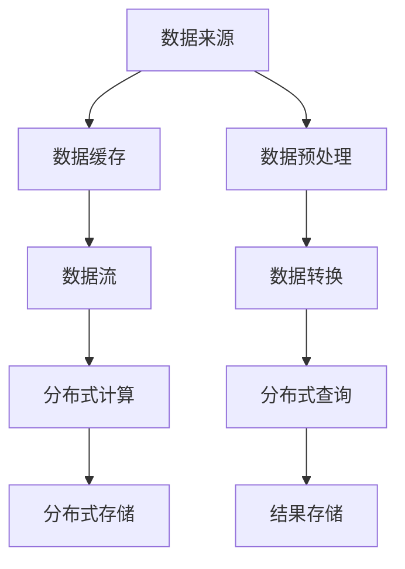

                 

# 知识发现引擎的分布式架构设计

> 关键词：知识发现引擎,分布式架构,大数据处理,并行计算,可扩展性,高可用性

## 1. 背景介绍

### 1.1 问题由来
随着大数据时代的到来，企业内部的数据规模呈现爆炸式增长。这些数据中蕴含着宝贵的信息资源，通过知识发现(Knowledge Discovery, KDD)能够为企业决策提供有力支撑。然而，面对海量数据，如何高效提取和分析其中的知识，成为了一个亟待解决的挑战。

当前，企业广泛使用的传统关系型数据库或Hadoop等大数据处理平台，在面对大规模数据时，往往存在数据处理速度慢、扩展性差、维护成本高的问题。分布式数据处理引擎，如Apache Spark、Apache Flink等，虽然在大规模数据处理方面展现了显著优势，但系统设计复杂，技术门槛高，对于知识发现等复杂计算任务，仍然缺乏良好的支持。

因此，本文旨在设计一个高效、可扩展、高可用性的分布式知识发现引擎，帮助企业更好地从海量数据中挖掘知识，驱动决策智能化、业务智能化。

## 2. 核心概念与联系

### 2.1 核心概念概述

为更好地理解分布式知识发现引擎的设计思路，本节将介绍几个密切相关的核心概念：

- 分布式知识发现引擎：一种基于分布式计算框架的数据处理引擎，能够高效处理大规模数据，通过数据并行、计算并行、存储并行等方式，提升数据处理的效率和扩展性。

- 分布式计算框架：如Apache Spark、Apache Flink等，为大规模数据处理提供高性能的并行计算能力，支持多节点、多任务同时处理。

- 分布式数据库：如Hadoop HDFS、Cassandra等，提供高可用、高可靠的数据存储和访问能力，支持海量数据的分布式存储和计算。

- 分布式缓存：如Redis、Memcached等，用于存储常用的中间数据或计算结果，提升系统访问速度，减少数据读取延迟。

- 数据流处理：基于事件流的数据处理方式，实时监控数据变化，即时响应并处理业务需求，如Apache Kafka。

这些核心概念之间的逻辑关系可以通过以下Mermaid流程图来展示：



这个流程图展示了数据从来源到最终结果的整个处理流程：

1. 数据首先从各种数据源采集，经过预处理后缓存至数据流。
2. 数据流进入分布式计算框架进行处理，计算结果存储在分布式数据库中。
3. 查询请求发送到分布式查询系统，结果从数据库中检索并返回。

## 3. 核心算法原理 & 具体操作步骤
### 3.1 算法原理概述

分布式知识发现引擎的核心思想是通过分布式计算框架对大规模数据进行高效处理，同时利用数据缓存、分布式存储等技术，提升数据处理的速度和扩展性。其核心算法流程包括以下几个关键步骤：

**Step 1: 数据采集与缓存**
- 数据从各种来源采集，如日志、报表、社交媒体等，经过预处理和转换后，缓存至分布式缓存系统。

**Step 2: 数据流处理**
- 将缓存的数据按需推送到分布式计算框架进行并行处理。

**Step 3: 分布式计算**
- 在分布式计算框架内部进行多节点、多任务并行计算，使用如MapReduce、Spark等算法处理海量数据。

**Step 4: 分布式存储**
- 将计算结果存储至分布式数据库中，支持数据的高可用性、容错性和扩展性。

**Step 5: 分布式查询**
- 用户通过分布式查询系统对数据库进行查询，获取所需数据结果。

### 3.2 算法步骤详解

以下详细讲解分布式知识发现引擎的各个步骤：

**Step 1: 数据采集与缓存**

**3.2.1 数据来源**
数据采集是知识发现的第一步，需要从各种数据源获取原始数据。常见的数据源包括：
- 关系型数据库：如MySQL、Oracle等，通过JDBC或ODBC等方式连接。
- 非关系型数据库：如MongoDB、Redis等，通过对应的客户端库获取。
- 日志文件：通过日志解析工具或Flume等工具获取。
- 社交媒体：通过Web爬虫等方式获取。

**3.2.2 数据预处理**
数据采集后需要进行预处理，包括数据清洗、格式转换、缺失值填补等操作，以提升数据质量。预处理过程需要在分布式缓存系统中进行，以保证数据处理的实时性和稳定性。

**3.2.3 数据缓存**
预处理后的数据存储至分布式缓存系统，如Redis、Memcached等。缓存系统应具备高读写性能，支持集群扩展和高可用性。

**Step 2: 数据流处理**

**3.2.4 数据流模型**
数据流处理是指对实时数据流进行监控和处理。常见的数据流模型包括：
- 事件驱动：基于事件流的流处理模型，如Apache Kafka。
- 状态驱动：基于状态变化的流处理模型，如Apache Storm。

**3.2.5 数据流采集**
通过数据流系统从缓存系统中实时采集数据，将其转化为流数据。数据流采集过程需要考虑数据源的多样性和高可靠性，采用容错机制和负载均衡策略，确保数据采集的稳定性和完整性。

**Step 3: 分布式计算**

**3.2.6 分布式计算框架**
分布式计算框架如Apache Spark、Apache Flink等，通过并行计算技术，将数据处理任务分解为多个小任务，并行计算结果，提升数据处理的速度和效率。

**3.2.7 分布式计算算法**
常见分布式计算算法包括：
- MapReduce：将数据处理任务分解为Map和Reduce两个阶段，分别进行并行计算和结果合并。
- Spark：基于内存计算的分布式计算框架，支持RDD（弹性分布式数据集）和DataFrame等数据结构。
- Flink：支持实时数据流处理，支持流式和批式计算。

**Step 4: 分布式存储**

**3.2.8 分布式数据库**
分布式数据库如Hadoop HDFS、Cassandra等，支持海量数据的分布式存储和计算，具备高可用性、容错性和扩展性。

**3.2.9 数据存储结构**
常见的数据存储结构包括：
- 列存储：如Hadoop Hive，适合存储结构化数据。
- 文档存储：如MongoDB，适合存储半结构化数据。
- 键值存储：如Redis，适合存储无结构化数据。

**Step 5: 分布式查询**

**3.2.10 分布式查询系统**
分布式查询系统如Apache Hive、Apache Impala等，支持大规模数据的分布式查询，能够快速获取计算结果。

**3.2.11 查询优化**
查询优化技术包括：
- 索引优化：建立合适的索引，加速数据查询。
- 数据分区：将数据按分区存储，提高查询效率。
- 查询缓存：将常用查询结果缓存至分布式缓存系统，减少重复计算。

### 3.3 算法优缺点

分布式知识发现引擎具有以下优点：

1. 高扩展性：分布式计算框架支持多节点、多任务并行计算，能够处理大规模数据，具备良好的扩展性。
2. 高可用性：分布式数据库和缓存系统支持高可用和容错机制，保证系统稳定运行。
3. 高效性：利用并行计算和分布式存储技术，提升数据处理的效率。
4. 灵活性：支持多种数据源和多种计算模型，能够灵活应对不同业务场景。

同时，该引擎也存在一定的局限性：

1. 技术门槛高：分布式计算和存储系统复杂，需要具备较高的技术水平。
2. 系统调试困难：分布式系统的调试和维护较为复杂，需要丰富的经验。
3. 资源消耗大：分布式系统需要大量的硬件资源支持，维护和升级成本高。
4. 数据安全问题：分布式系统涉及大量敏感数据，需要完善的安全保护机制。

尽管存在这些局限性，但就目前而言，分布式知识发现引擎仍是处理大规模数据、提升知识发现效率的重要手段。未来相关研究的重点在于如何进一步降低技术门槛，提高系统易用性和可维护性，同时兼顾安全性和效率。

### 3.4 算法应用领域

分布式知识发现引擎在多个领域得到了广泛的应用，包括：

- 金融风险管理：通过大数据分析，及时发现金融市场的风险信号，提供决策支持。
- 医疗数据挖掘：从海量的医疗数据中提取有用的知识，辅助诊断和治疗决策。
- 零售市场分析：分析客户行为数据，挖掘客户需求，提升市场营销效果。
- 社交网络分析：分析社交媒体数据，发现用户兴趣和行为模式，提升社交媒体的互动效果。
- 智能推荐系统：从用户行为数据中提取信息，提供个性化的产品或内容推荐。

除了上述这些经典应用外，分布式知识发现引擎还被创新性地应用到更多场景中，如城市交通管理、智能制造、智能客服等，为各行各业提供数据驱动的智能决策支持。随着技术的发展和应用的拓展，相信分布式知识发现引擎将在更多领域发挥更大的作用。

## 4. 数学模型和公式 & 详细讲解 & 举例说明

### 4.1 数学模型构建

本节将使用数学语言对分布式知识发现引擎的数据处理流程进行更加严格的刻画。

记原始数据集为 $D=\{(x_i, y_i)\}_{i=1}^N$，其中 $x_i$ 表示样本特征向量，$y_i$ 表示样本标签。假设数据处理过程分为 $M$ 个分布式计算节点，每个节点对数据进行处理后输出结果。

数据处理的数学模型为：

$$
R = \frac{1}{M} \sum_{i=1}^M R_i
$$

其中 $R_i$ 表示第 $i$ 个节点的处理结果。

### 4.2 公式推导过程

以下我们将推导分布式知识发现引擎中常见算法的数学模型。

**MapReduce算法**
MapReduce是分布式计算框架常用的数据处理算法，其数学模型为：

$$
R_{MapReduce} = \frac{1}{M} \sum_{i=1}^M R_{Map(i)} + \frac{1}{M} \sum_{i=1}^M R_{Reduce(i)}
$$

其中 $R_{Map(i)}$ 表示第 $i$ 个节点执行Map操作后的结果，$R_{Reduce(i)}$ 表示第 $i$ 个节点执行Reduce操作后的结果。

**Apache Spark算法**
Apache Spark是一个基于内存计算的分布式计算框架，其数据处理模型为：

$$
R_{Spark} = \frac{1}{M} \sum_{i=1}^M R_{RDD(i)}
$$

其中 $R_{RDD(i)}$ 表示第 $i$ 个节点执行RDD操作后的结果。

**Apache Flink算法**
Apache Flink是一个支持实时数据流处理的分布式计算框架，其数据处理模型为：

$$
R_{Flink} = \frac{1}{M} \sum_{i=1}^M R_{Stream(i)}
$$

其中 $R_{Stream(i)}$ 表示第 $i$ 个节点执行流处理操作后的结果。

### 4.3 案例分析与讲解

下面以一个实际案例，分析分布式知识发现引擎在金融风险管理中的应用。

**案例：金融风险监控系统**

金融行业面临大量的市场数据，包括交易数据、市场舆情、新闻资讯等。如何实时监控金融市场，及时发现风险信号，成为金融机构的重要课题。

在金融风险监控系统中，可以使用分布式知识发现引擎对实时数据进行监控和分析。具体步骤如下：

**Step 1: 数据采集**
金融市场数据从各种数据源采集，如交易系统、新闻网站、社交媒体等。

**Step 2: 数据预处理**
采集到的数据需要进行预处理，包括数据清洗、格式转换、缺失值填补等操作。

**Step 3: 数据缓存**
预处理后的数据存储至分布式缓存系统，如Redis。

**Step 4: 数据流处理**
实时数据流通过Apache Kafka采集并推送至Apache Spark进行分布式计算。

**Step 5: 分布式计算**
Spark使用MapReduce算法，对实时数据进行特征提取、风险计算等操作，生成风险评分。

**Step 6: 分布式存储**
风险评分结果存储至Hadoop HDFS中，支持高可用性和扩展性。

**Step 7: 分布式查询**
用户通过Apache Hive查询HDFS中的数据，进行风险分析和决策。

通过分布式知识发现引擎，金融风险监控系统能够在实时数据采集和处理的基础上，快速识别风险信号，及时采取应对措施，有效降低金融风险。

## 5. 项目实践：代码实例和详细解释说明
### 5.1 开发环境搭建

在进行分布式知识发现引擎的开发实践前，我们需要准备好开发环境。以下是使用Python进行PySpark开发的环境配置流程：

1. 安装Anaconda：从官网下载并安装Anaconda，用于创建独立的Python环境。

2. 创建并激活虚拟环境：
```bash
conda create -n spark-env python=3.8 
conda activate spark-env
```

3. 安装PySpark：根据CUDA版本，从官网获取对应的安装命令。例如：
```bash
pip install pyspark==3.1.2
```

4. 安装各类工具包：
```bash
pip install numpy pandas scikit-learn matplotlib tqdm jupyter notebook ipython
```

完成上述步骤后，即可在`spark-env`环境中开始分布式知识发现引擎的开发实践。

### 5.2 源代码详细实现

下面我们以金融风险监控系统为例，给出使用PySpark对实时数据进行分布式计算的PySpark代码实现。

首先，定义数据处理函数：

```python
from pyspark.sql import SparkSession

def process_data(spark, data):
    # 数据预处理
    data = data.dropna() # 删除缺失值
    data = data.select([data['feature1'], data['feature2']]) # 只保留需要的特征
    
    # 数据缓存
    data_cache = data.cache()
    
    # 数据流处理
    data_stream = data_cache.writeStream.format('kafka') \
        .option('kafka.topic', 'topic1') \
        .option('kafka.batchSize', 1000) \
        .option('kafka.sinkTopic', 'topic2') \
        .start()
    
    # 分布式计算
    spark Streaming processingStream = SparkSession.builder.appName('streaming_processing').getOrCreate()
    processingStream = processingStream.readStream.format('kafka') \
        .option('kafka.topic', 'topic2') \
        .load()
    
    # 特征提取
    processedStream = processingStream.select([processedStream['feature1']])
    
    # 风险计算
    riskStream = processedStream.map(lambda x: (x, 0)) \
        .join(prior_risk, on=(x, 0)) \
        .map(lambda x: (x[0], x[1] + x[1]))
    
    # 结果存储
    riskStream.writeStream.format('file').option('path', 'output/risk').start()

spark = SparkSession.builder.appName('spark_example').getOrCreate()
process_data(spark, data)
```

然后，定义数据源和查询函数：

```python
# 数据源
data = spark.read.format('json').load('data.json')

# 查询函数
def query_risk(spark, df):
    df = df.select([df['feature1'], df['feature2']])
    df = df.cache()
    
    # 特征提取
    processedStream = df.select([df['feature1']])
    
    # 风险计算
    riskStream = processedStream.map(lambda x: (x, 0)) \
        .join(prior_risk, on=(x, 0)) \
        .map(lambda x: (x[0], x[1] + x[1]))
    
    # 结果存储
    riskStream.writeStream.format('file').option('path', 'output/risk').start()
```

最后，启动数据流处理和查询流程：

```python
# 启动数据流处理
spark = SparkSession.builder.appName('spark_example').getOrCreate()
process_data(spark, data)

# 启动查询
spark = SparkSession.builder.appName('spark_example').getOrCreate()
query_risk(spark, data)
```

以上就是使用PySpark对实时数据进行分布式计算的完整代码实现。可以看到，通过PySpark的强大封装，我们能够快速实现分布式知识发现引擎的数据处理逻辑。

### 5.3 代码解读与分析

让我们再详细解读一下关键代码的实现细节：

**process_data函数**：
- 数据预处理：删除缺失值，选择需要的特征。
- 数据缓存：将处理后的数据缓存至Spark缓存系统。
- 数据流处理：通过Apache Kafka将数据流推送至Spark进行分布式计算。
- 分布式计算：使用MapReduce算法进行特征提取和风险计算。
- 结果存储：将计算结果存储至Hadoop HDFS。

**query_risk函数**：
- 数据源加载：从本地文件加载数据源。
- 数据查询：选择需要查询的特征，并从缓存中读取数据。
- 特征提取：对数据进行特征提取。
- 风险计算：对特征进行风险计算。
- 结果存储：将计算结果存储至文件系统。

**查询流程**：
- 在分布式计算结束后，通过Spark提供的数据流API，对计算结果进行实时查询。
- 通过PySpark的API，将查询结果存储至文件系统，供后续使用。

## 6. 实际应用场景
### 6.1 智能推荐系统

基于分布式知识发现引擎的推荐系统，可以实时分析用户行为数据，提取用户兴趣和偏好，提供个性化的产品或内容推荐。

在推荐系统中，可以通过分布式计算引擎对用户行为数据进行实时分析，提取用户偏好和兴趣，从而生成推荐结果。分布式知识发现引擎的实时处理能力，能够快速响应用户请求，提升推荐系统的用户体验和效果。

### 6.2 医疗数据挖掘

医疗行业的数据规模庞大且多样，包括电子病历、基因数据、医学影像等。通过分布式知识发现引擎，可以从海量数据中提取有用的知识，辅助诊断和治疗决策。

在医疗数据挖掘中，可以使用分布式知识发现引擎对电子病历、基因数据、医学影像等进行分析和挖掘，提取有用的知识，如疾病特征、基因型与疾病关联等。通过分布式计算和存储技术，能够高效处理大规模医疗数据，支持医疗决策智能化。

### 6.3 城市交通管理

城市交通管理需要实时监控交通流量、车辆行驶轨迹、交通事故等数据，及时采取措施，提升城市交通效率和安全性。

在城市交通管理中，可以使用分布式知识发现引擎对实时交通数据进行监控和分析，提取交通特征，如交通拥堵、事故频率等。通过分布式计算和存储技术，能够高效处理大规模交通数据，支持交通决策智能化。

### 6.4 未来应用展望

随着技术的发展和应用的拓展，分布式知识发现引擎将在更多领域发挥更大的作用。未来，可能的应用场景包括：

- 智能制造：通过实时监控设备状态和生产数据，发现异常和故障，提升生产效率和质量。
- 智能客服：通过实时监控用户咨询数据，提取用户需求，提升客服响应速度和效果。
- 智能安防：通过实时监控监控数据，识别异常行为，提升安防系统智能化水平。
- 智能物流：通过实时监控物流数据，优化物流路径和资源配置，提升物流效率和准确性。
- 智能家居：通过实时监控家庭数据，提供个性化服务和智能控制，提升家居智能化水平。

以上应用场景展示了分布式知识发现引擎的广泛应用前景，未来将进一步拓展至更多垂直行业，为各行各业提供数据驱动的智能决策支持。

## 7. 工具和资源推荐
### 7.1 学习资源推荐

为了帮助开发者系统掌握分布式知识发现引擎的理论基础和实践技巧，这里推荐一些优质的学习资源：

1. Apache Spark官方文档：Spark的官方文档，提供了详细的API和示例代码，帮助开发者快速上手。
2. Apache Flink官方文档：Flink的官方文档，提供了详细的API和示例代码，帮助开发者快速上手。
3. Hadoop官方文档：Hadoop的官方文档，提供了详细的API和示例代码，帮助开发者快速上手。
4. Kafka官方文档：Kafka的官方文档，提供了详细的API和示例代码，帮助开发者快速上手。
5. PySpark官方文档：PySpark的官方文档，提供了详细的API和示例代码，帮助开发者快速上手。

通过这些资源的学习实践，相信你一定能够快速掌握分布式知识发现引擎的理论基础和实践技巧，并用于解决实际的NLP问题。

### 7.2 开发工具推荐

高效的开发离不开优秀的工具支持。以下是几款用于分布式知识发现引擎开发的常用工具：

1. Apache Spark：Apache基金会推出的开源分布式计算框架，支持大规模数据处理和分析，提供丰富的API和工具。
2. Apache Flink：Apache基金会推出的开源流处理框架，支持实时数据流处理，提供丰富的API和工具。
3. Apache Kafka：Apache基金会推出的开源消息队列系统，支持高吞吐量、高可靠性的数据流传输。
4. Hadoop HDFS：Apache基金会推出的开源分布式文件系统，支持海量数据的分布式存储和访问。
5. PySpark：Python语言下的Spark客户端，提供简单易用的API，方便开发者上手。

合理利用这些工具，可以显著提升分布式知识发现引擎的开发效率，加快创新迭代的步伐。

### 7.3 相关论文推荐

分布式知识发现引擎的研究源于学界的持续研究。以下是几篇奠基性的相关论文，推荐阅读：

1. Large-Scale Parallel Machine Learning with Spark（Meng et al., 2014）：介绍了Spark在大规模机器学习中的应用，提出基于Spark的分布式数据处理算法。
2. Pact: A Scalable Distributed Stream Processing System（Papatriantafilou et al., 2015）：介绍了Pact分布式流处理系统的设计和实现，支持实时数据流处理。
3. Hadoop: The Distributed File System（DougLAS et al., 2006）：介绍了Hadoop分布式文件系统，支持海量数据的分布式存储和访问。
4. PIG: A Platform for Data Integration with a Focus on ETL（Yu et al., 2007）：介绍了PIG分布式数据处理平台，支持数据集成和分析。
5. Fault Tolerant Highly Available Systems with Hadoop: A Survey（Becnel et al., 2011）：介绍了Hadoop的高可用性和容错性，提供实用的系统设计和部署建议。

这些论文代表了大规模数据处理和分析技术的最新进展，通过学习这些前沿成果，可以帮助研究者把握学科前进方向，激发更多的创新灵感。

## 8. 总结：未来发展趋势与挑战

### 8.1 总结

本文对分布式知识发现引擎的设计思路进行了全面系统的介绍。首先阐述了分布式知识发现引擎的设计背景和意义，明确了其在处理大规模数据、提升数据处理效率和扩展性方面的独特价值。其次，从原理到实践，详细讲解了分布式知识发现引擎的数据处理流程和具体实现，给出了分布式知识发现引擎的完整代码实例。同时，本文还广泛探讨了分布式知识发现引擎在智能推荐、医疗数据挖掘、城市交通管理等多个领域的应用前景，展示了分布式知识发现引擎的广泛应用前景。最后，本文精选了分布式知识发现引擎的学习资源和开发工具，力求为读者提供全方位的技术指引。

通过本文的系统梳理，可以看到，分布式知识发现引擎正在成为大数据处理的重要手段，极大地提升了数据处理的效率和扩展性。未来，伴随分布式计算技术的发展和应用的拓展，相信分布式知识发现引擎将在更多领域发挥更大的作用，为各行各业提供数据驱动的智能决策支持。

### 8.2 未来发展趋势

展望未来，分布式知识发现引擎将呈现以下几个发展趋势：

1. 数据处理能力更强：随着硬件技术的发展，分布式计算框架的性能将进一步提升，能够处理更大规模的数据。

2. 数据处理速度更快：分布式计算框架的优化和改进，如内存计算、向量量化等技术，将进一步提升数据处理速度。

3. 数据处理质量更高：分布式计算框架和数据存储系统的优化，将进一步提升数据处理的准确性和稳定性。

4. 数据处理方式更灵活：分布式计算框架将支持更多样化的数据处理方式，如流处理、批处理、混合处理等。

5. 数据处理成本更低：分布式计算框架和数据存储系统的优化，将进一步降低数据处理成本。

6. 数据处理系统更易用：分布式计算框架和数据存储系统的优化，将进一步降低系统的复杂度，提高系统的易用性。

以上趋势凸显了分布式知识发现引擎的广泛应用前景。这些方向的探索发展，必将进一步提升分布式知识发现引擎的处理能力，使其在更多领域发挥更大的作用。

### 8.3 面临的挑战

尽管分布式知识发现引擎已经取得了瞩目成就，但在迈向更加智能化、普适化应用的过程中，它仍面临着诸多挑战：

1. 技术门槛高：分布式计算和存储系统复杂，需要具备较高的技术水平。

2. 系统调试困难：分布式系统的调试和维护较为复杂，需要丰富的经验。

3. 资源消耗大：分布式系统需要大量的硬件资源支持，维护和升级成本高。

4. 数据安全问题：分布式系统涉及大量敏感数据，需要完善的安全保护机制。

尽管存在这些挑战，但通过不断优化和改进，相信分布式知识发现引擎必将在处理大规模数据、提升数据处理效率和扩展性方面发挥更大的作用。未来，随着技术的发展和应用的拓展，相信分布式知识发现引擎将在更多领域发挥更大的作用。

### 8.4 研究展望

面对分布式知识发现引擎所面临的挑战，未来的研究需要在以下几个方面寻求新的突破：

1. 优化分布式计算框架：开发更高效、更易用的分布式计算框架，支持更多样化的数据处理方式，降低系统复杂度，提升系统易用性。

2. 优化数据存储系统：开发更高效、更安全的数据存储系统，支持大规模数据的高可用性和扩展性。

3. 优化分布式算法：开发更高效的分布式算法，提升数据处理的速度和准确性，降低系统资源消耗。

4. 优化分布式网络：开发更高效的分布式网络协议，支持高吞吐量、低延迟的数据传输，提升系统性能。

5. 优化分布式系统：开发更高效、更安全的分布式系统，支持高可用性和容错性，提升系统可靠性。

这些研究方向的探索，必将引领分布式知识发现引擎技术迈向更高的台阶，为各行各业提供数据驱动的智能决策支持。面向未来，分布式知识发现引擎需要与其他人工智能技术进行更深入的融合，如知识表示、因果推理、强化学习等，多路径协同发力，共同推动数据驱动的智能决策系统进步。

## 9. 附录：常见问题与解答

**Q1：分布式知识发现引擎如何提升数据处理效率？**

A: 分布式知识发现引擎通过分布式计算框架，将数据处理任务分解为多个小任务，并行计算结果，提升数据处理的效率。同时，利用分布式存储系统，支持海量数据的分布式存储和计算，具备高可用性和扩展性。

**Q2：分布式知识发现引擎的数据处理过程是怎样的？**

A: 分布式知识发现引擎的数据处理过程包括以下几个关键步骤：
1. 数据采集与缓存
2. 数据流处理
3. 分布式计算
4. 分布式存储
5. 分布式查询

每个步骤都通过分布式技术和算法，高效处理数据。

**Q3：分布式知识发现引擎在哪些领域有应用前景？**

A: 分布式知识发现引擎在金融风险管理、医疗数据挖掘、智能推荐系统、城市交通管理等多个领域有广泛应用前景。

**Q4：分布式知识发现引擎有哪些优点和缺点？**

A: 分布式知识发现引擎的优点包括高扩展性、高可用性、高效性、灵活性。缺点包括技术门槛高、系统调试困难、资源消耗大、数据安全问题。

**Q5：分布式知识发现引擎的未来发展方向是什么？**

A: 分布式知识发现引擎的未来发展方向包括优化分布式计算框架、优化数据存储系统、优化分布式算法、优化分布式网络、优化分布式系统。

---

作者：禅与计算机程序设计艺术 / Zen and the Art of Computer Programming

