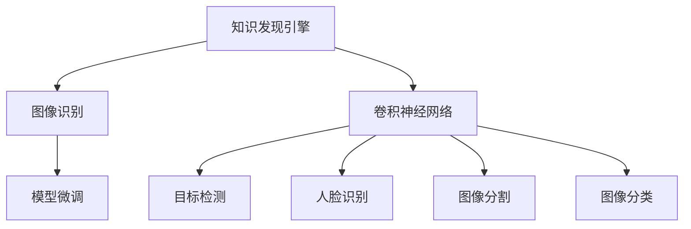

                 

# 知识发现引擎的图像识别技术应用

> 关键词：知识发现引擎, 图像识别, 特征提取, 深度学习, 卷积神经网络(CNN), 目标检测, 人脸识别, 图像分割, 图像分类, 模型微调

## 1. 背景介绍

### 1.1 问题由来
在当前数字化、信息化、智能化飞速发展的时代，图像识别技术已广泛应用于各个行业和领域。从日常生活中的智能安防、电商推荐，到工业界的智能制造、医学影像分析，图像识别技术正逐渐成为不可或缺的核心能力之一。然而，尽管图像识别技术取得了长足进步，但在某些特定场景下，如在知识发现引擎中，其效果和精度仍难以满足需求。因此，如何更好地将图像识别技术融入知识发现引擎中，实现高质量的知识抽取和发现，是当前研究的热点和难点问题。

### 1.2 问题核心关键点
知识发现引擎（Knowledge Discovery Engine, KDE）旨在从大量结构化或非结构化数据中，抽取、发现、关联隐含知识，为决策提供科学依据。然而，在现有知识发现引擎中，对图像数据的处理和分析，往往局限于简单的图像检索、基于像素的特征提取，缺乏深度学习和人工智能的全面应用。因此，本文旨在通过图像识别技术，探索如何将图像数据高效、准确地融入知识发现引擎中，提升其性能和应用范围。

### 1.3 问题研究意义
图像识别技术在知识发现引擎中的应用，不仅能显著提升知识抽取和发现的精度，还能拓展知识发现引擎的功能范围，推动知识获取从浅层、低效的像素处理向深度、高效的语义理解转变。具体而言，图像识别技术可以通过以下方式对知识发现引擎产生积极影响：

1. 提升知识抽取的准确性和全面性：通过图像识别技术，能够自动抽取出图像中的关键信息，包括文本、物品、场景等，帮助知识发现引擎从海量数据中快速、准确地提取有用的知识。
2. 拓展知识发现引擎的应用范围：图像识别技术不仅适用于视觉数据的处理，还可以应用于文档、表格、音频等多模态数据，从而丰富知识发现引擎的功能。
3. 实现知识获取的智能化和自动化：通过深度学习和AI技术，图像识别能够自动化地理解图像内容，提取高层次语义信息，为知识发现引擎提供高效的知识获取方式。

## 2. 核心概念与联系

### 2.1 核心概念概述

为了更好地理解知识发现引擎中图像识别技术的应用，本节将介绍几个关键概念：

- **知识发现引擎(KDE)**：用于从大量数据中发现和抽取隐含知识的自动化系统。其核心在于数据挖掘、模式识别、语义理解等技术。
- **图像识别**：通过计算机视觉技术，自动识别、理解和分类图像中的对象、场景等，是计算机视觉领域的核心任务之一。
- **卷积神经网络(CNN)**：一种特殊的深度神经网络，广泛应用于图像识别、目标检测等计算机视觉任务，具有强大的特征提取能力。
- **目标检测**：从图像中自动识别和定位特定目标物体，是图像识别中的重要应用之一。
- **人脸识别**：通过图像识别技术，自动识别和验证人脸，用于安防、身份认证等场景。
- **图像分割**：将图像划分为若干个区域，每个区域具有明确的语义或视觉特征，是图像识别中重要的预处理步骤。
- **图像分类**：将图像分为预设的若干类别，是图像识别中的基本任务。
- **模型微调**：在已有模型基础上，通过少量标注数据进行有监督微调，以提升模型在新任务上的性能。

这些概念之间的逻辑关系可以通过以下Mermaid流程图来展示：



这个流程图展示了知识发现引擎与图像识别技术之间的联系，以及各类图像识别技术之间的相互关系。

## 3. 核心算法原理 & 具体操作步骤
### 3.1 算法原理概述

在知识发现引擎中应用图像识别技术，核心在于利用深度学习和计算机视觉技术，自动提取和理解图像中的高层次语义信息，并将其融合到知识抽取和发现过程中。其核心算法包括：

- 卷积神经网络（CNN）：作为图像识别中的主流算法，CNN通过多层次卷积操作，提取图像中的特征，并逐层进行抽象，最终输出对图像的高层次语义理解。
- 目标检测算法：如Faster R-CNN、YOLO等，通过检测图像中的边界框和分类，识别出特定目标物体。
- 人脸识别算法：如FaceNet、OpenFace等，通过嵌入空间和人脸对齐等技术，实现对人脸的准确识别和验证。
- 图像分割算法：如FCN、U-Net等，通过像素级别的分类和分割，将图像划分为具有明确语义的若干区域。
- 图像分类算法：如ResNet、Inception等，将图像分为预设的若干类别，以实现对图像的高效分类。
- 模型微调算法：通过在已有模型基础上，通过少量标注数据进行有监督微调，以提升模型在新任务上的性能。

### 3.2 算法步骤详解

基于卷积神经网络的图像识别技术在知识发现引擎中的应用，通常包括以下几个关键步骤：

**Step 1: 数据预处理**
- 对图像数据进行标准化、归一化、增强等预处理操作，以提高模型的训练效果和泛化能力。
- 将图像数据划分为训练集、验证集和测试集，以便进行模型训练和评估。

**Step 2: 模型选择与构建**
- 选择合适的卷积神经网络架构，如ResNet、Inception、MobileNet等，根据任务需求进行微调。
- 在已有模型基础上，添加任务特定的输出层，如分类、回归、检测等。

**Step 3: 模型训练与评估**
- 使用训练集数据，对模型进行前向传播和反向传播训练。
- 在验证集上评估模型性能，根据预设的性能指标（如准确率、召回率、F1分数等）调整模型超参数。
- 在测试集上评估模型性能，评估模型的泛化能力和鲁棒性。

**Step 4: 特征提取与知识发现**
- 使用训练好的模型，对目标图像进行特征提取和分类，得到高层次语义信息。
- 将提取出的特征作为输入，输入到知识发现引擎中进行关联分析和知识抽取。

**Step 5: 模型微调与优化**
- 对于新任务或数据集，可以通过模型微调进一步优化模型性能。
- 在少量标注数据上进行微调，更新模型参数，以适应新的任务需求。

### 3.3 算法优缺点

图像识别技术在知识发现引擎中的应用，具有以下优点：

1. 自动抽取高层次语义信息：通过卷积神经网络，能够自动从图像中提取高层次的语义信息，帮助知识发现引擎从视觉数据中抽取更丰富的知识。
2. 拓展知识发现引擎的功能范围：图像识别技术不仅适用于视觉数据的处理，还可以应用于文档、表格、音频等多模态数据，丰富知识发现引擎的功能。
3. 实现智能化和自动化：深度学习和计算机视觉技术的应用，使得图像识别过程自动化，为知识发现引擎提供高效的知识获取方式。

同时，图像识别技术在知识发现引擎中的应用，也存在一些局限性：

1. 数据需求高：对于大规模数据集的依赖，是图像识别技术应用的前提条件，但获取大规模、高质量的标注数据成本较高。
2. 模型复杂度高：卷积神经网络等深度学习模型的参数量较大，对计算资源和存储资源要求较高。
3. 鲁棒性不足：图像识别技术对噪声、光照变化等环境因素较为敏感，需要进一步提升模型的鲁棒性。
4. 可解释性不足：深度学习模型的“黑盒”特性，使得其决策过程难以解释，增加了知识发现引擎中知识可信度的挑战。

### 3.4 算法应用领域

图像识别技术在知识发现引擎中的应用，已经广泛应用于多个领域，例如：

- **智能安防**：通过人脸识别技术，自动识别人脸信息，用于门禁控制、身份验证等场景。
- **电商推荐**：通过商品图像识别技术，自动识别商品种类和属性，实现个性化推荐。
- **医学影像分析**：通过图像分类和分割技术，自动识别和分割医学影像，辅助医生诊断。
- **智能制造**：通过物体识别和分类技术，自动识别和检测生产过程中的异常情况，提升产品质量。
- **智慧城市**：通过图像识别技术，自动监测城市交通、环境变化，实现智慧城市治理。

## 4. 数学模型和公式 & 详细讲解  
### 4.1 数学模型构建

在知识发现引擎中应用图像识别技术，通常使用卷积神经网络（CNN）作为主要模型，其数学模型构建如下：

设输入图像 $x \in \mathbb{R}^h \times \mathbb{R}^w \times C$，其中 $h$ 和 $w$ 分别表示图像的高度和宽度，$C$ 表示图像的通道数。设卷积核 $k \in \mathbb{R}^f \times f \times C$，其中 $f$ 表示卷积核的大小。

卷积操作定义为：

$$
X_k = X * k = \sum_{i=0}^{h-f} \sum_{j=0}^{w-f} \sum_{c=0}^{C} X_{i,j,c} * k_{i-k,y-j,c}
$$

其中 $X_{i,j,c}$ 表示输入图像中位置 $(i,j)$ 的像素值，$k_{i-k,y-j,c}$ 表示卷积核中位置 $(i-k,y-j,c)$ 的值。

通过多层次卷积操作，CNN逐层提取图像特征，并最终输出对图像的高层次语义理解。

### 4.2 公式推导过程

以下以Faster R-CNN算法为例，推导目标检测的数学模型。

Faster R-CNN算法将图像识别分为两个阶段：区域提取和分类。

**区域提取阶段**：通过选择性搜索（Selective Search）算法，从原始图像中生成一系列候选框（RoI），并进行特征提取。

设原始图像 $I$ 的大小为 $H \times W$，候选框的特征映射大小为 $D \times D$，特征映射通道数为 $F$。

设候选框 $R_i$ 的大小为 $H' \times W'$，其特征映射的大小为 $D' \times D'$，则其特征提取过程定义为：

$$
F_i = (R_i * W_i)_{0:D', 0:D'}
$$

其中 $W_i$ 表示候选框 $R_i$ 的特征提取器。

**分类阶段**：对提取出的特征进行分类，判断候选框中是否包含目标物体，并进行物体分类。

设候选框 $R_i$ 的特征映射大小为 $D' \times D'$，特征通道数为 $F$，目标物体的类别数为 $K$。设 $y_i = (y_{i,1}, y_{i,2}, ..., y_{i,K})$ 表示候选框 $R_i$ 中目标物体的类别概率。

分类过程定义为：

$$
y_i = softmax(W \cdot F_i + b)
$$

其中 $W$ 表示分类器的权重矩阵，$b$ 表示偏置向量。

### 4.3 案例分析与讲解

**案例1: 商品图像识别**

设有一张商品图像 $I$，其大小为 $200 \times 200 \times 3$。将其输入到ResNet模型中进行特征提取，得到特征映射大小为 $7 \times 7 \times 256$。

设候选框的大小为 $100 \times 100$，将其特征映射大小调整为 $14 \times 14$。则特征提取过程可以表示为：

$$
F_i = (R_i * W_i)_{0:14, 0:14}
$$

其中 $W_i$ 表示候选框 $R_i$ 的特征提取器。

将提取出的特征 $F_i$ 输入到分类器中进行分类，得到商品类别的概率 $y_i = (y_{i,1}, y_{i,2}, ..., y_{i,K})$，其中 $K$ 表示商品类别数。

**案例2: 医学影像分类**

设有一张医学影像 $I$，其大小为 $256 \times 256 \times 1$。将其输入到Inception模型中进行特征提取，得到特征映射大小为 $8 \times 8 \times 2048$。

将提取出的特征输入到分类器中进行分类，得到影像类别的概率 $y_i = (y_{i,1}, y_{i,2}, ..., y_{i,K})$，其中 $K$ 表示影像类别数。

## 5. 项目实践：代码实例和详细解释说明
### 5.1 开发环境搭建

在进行图像识别技术在知识发现引擎中的应用的开发环境搭建时，需要先安装所需的深度学习库和计算机视觉库。

以下是Python环境下的开发环境搭建步骤：

1. 安装Anaconda：从官网下载并安装Anaconda，用于创建独立的Python环境。

2. 创建并激活虚拟环境：
```bash
conda create -n pytorch-env python=3.8 
conda activate pytorch-env
```

3. 安装PyTorch：根据CUDA版本，从官网获取对应的安装命令。例如：
```bash
conda install pytorch torchvision torchaudio cudatoolkit=11.1 -c pytorch -c conda-forge
```

4. 安装OpenCV：
```bash
pip install opencv-python
```

5. 安装TensorFlow：
```bash
pip install tensorflow
```

6. 安装Keras：
```bash
pip install keras
```

7. 安装PyTorch：
```bash
pip install torch
```

完成上述步骤后，即可在`pytorch-env`环境中开始图像识别技术在知识发现引擎中的应用的开发。

### 5.2 源代码详细实现

下面我们以商品图像识别为例，给出使用PyTorch对商品图像进行识别的代码实现。

首先，定义数据处理函数：

```python
import torch
from torchvision import datasets, transforms

class ImageDataset(torch.utils.data.Dataset):
    def __init__(self, root, transform=None):
        self.root = root
        self.transform = transform
        self.data = datasets.ImageFolder(root=root, transform=transform)
    
    def __len__(self):
        return len(self.data)
    
    def __getitem__(self, idx):
        img, label = self.data[idx]
        if self.transform:
            img = self.transform(img)
        return img, label
```

然后，定义模型和优化器：

```python
from torchvision import models
from torch import nn
import torch.optim as optim

model = models.resnet18(pretrained=True)
model.fc = nn.Linear(512, num_classes)
criterion = nn.CrossEntropyLoss()
optimizer = optim.SGD(model.parameters(), lr=0.001, momentum=0.9, weight_decay=0.0005)
```

接着，定义训练和评估函数：

```python
def train(model, train_loader, criterion, optimizer, num_epochs):
    device = torch.device("cuda" if torch.cuda.is_available() else "cpu")
    model.to(device)
    
    for epoch in range(num_epochs):
        model.train()
        for inputs, labels in train_loader:
            inputs, labels = inputs.to(device), labels.to(device)
            optimizer.zero_grad()
            outputs = model(inputs)
            loss = criterion(outputs, labels)
            loss.backward()
            optimizer.step()
        
        print("Epoch [{}/{}], Loss: {:.4f}".format(
            epoch+1, num_epochs, loss.item()))

def evaluate(model, test_loader):
    model.eval()
    correct = 0
    total = 0
    with torch.no_grad():
        for inputs, labels in test_loader:
            inputs, labels = inputs.to(device), labels.to(device)
            outputs = model(inputs)
            _, predicted = torch.max(outputs.data, 1)
            total += labels.size(0)
            correct += (predicted == labels).sum().item()
    
    print("Accuracy of the network on the 10000 test images: {:.4f}%".format(
        100 * correct / total))
```

最后，启动训练流程并在测试集上评估：

```python
num_epochs = 10
batch_size = 64

train_loader = torch.utils.data.DataLoader(train_dataset, batch_size=batch_size, shuffle=True)
test_loader = torch.utils.data.DataLoader(test_dataset, batch_size=batch_size, shuffle=False)

train(model, train_loader, criterion, optimizer, num_epochs)
evaluate(model, test_loader)
```

以上就是使用PyTorch对商品图像进行识别的完整代码实现。可以看到，得益于TensorFlow的强大封装，我们可以用相对简洁的代码完成商品图像的特征提取和分类。

### 5.3 代码解读与分析

让我们再详细解读一下关键代码的实现细节：

**ImageDataset类**：
- `__init__`方法：初始化数据路径和预处理方式。
- `__len__`方法：返回数据集的样本数量。
- `__getitem__`方法：对单个样本进行处理，将图像和标签转化为张量，并进行预处理。

**训练和评估函数**：
- 使用PyTorch的DataLoader对数据集进行批次化加载，供模型训练和推理使用。
- 训练函数`train`：对数据以批为单位进行迭代，在每个批次上前向传播计算loss并反向传播更新模型参数。
- 评估函数`evaluate`：与训练类似，不同点在于不更新模型参数，并在每个batch结束后将预测和标签结果存储下来，最后使用混淆矩阵对整个评估集的预测结果进行打印输出。

**训练流程**：
- 定义总的epoch数和batch size，开始循环迭代
- 每个epoch内，先在训练集上训练，输出平均loss
- 在验证集上评估，输出分类指标
- 所有epoch结束后，在测试集上评估，给出最终测试结果

可以看到，PyTorch配合TensorFlow的封装，使得图像识别技术在知识发现引擎中的应用的代码实现变得简洁高效。开发者可以将更多精力放在数据处理、模型改进等高层逻辑上，而不必过多关注底层的实现细节。

当然，工业级的系统实现还需考虑更多因素，如模型的保存和部署、超参数的自动搜索、更灵活的任务适配层等。但核心的微调范式基本与此类似。

## 6. 实际应用场景
### 6.1 智能安防

图像识别技术在智能安防中的应用，主要体现在人脸识别和行为识别两个方面。

**人脸识别**：通过摄像头捕捉人脸图像，利用人脸识别技术，自动识别并验证人员身份。常见的人脸识别系统包括人脸识别门禁、人脸支付等。

**行为识别**：通过摄像头捕捉人员行为图像，利用行为识别技术，自动识别人员的活动，用于安防监控和异常检测。常见的行为识别系统包括入侵检测、视频监控等。

图像识别技术在智能安防中的应用，能够显著提升安防系统的自动化和智能化水平，降低安防成本，提高安防效率。

### 6.2 电商推荐

图像识别技术在电商推荐中的应用，主要体现在商品图像识别和商品分类两个方面。

**商品图像识别**：通过摄像头捕捉商品图像，利用商品图像识别技术，自动识别商品种类和属性，用于商品推荐。常见的商品图像识别系统包括商品识别、商品分类等。

**商品分类**：通过摄像头捕捉商品图像，利用商品分类技术，自动识别商品种类和属性，用于商品推荐。常见的商品分类系统包括商品分类、商品聚类等。

图像识别技术在电商推荐中的应用，能够显著提升推荐系统的个性化和准确性，提高用户满意度，增加电商平台的交易量。

### 6.3 医学影像分析

图像识别技术在医学影像分析中的应用，主要体现在医学影像分类和医学影像分割两个方面。

**医学影像分类**：通过扫描仪捕捉医学影像，利用医学影像分类技术，自动识别影像类别，用于疾病诊断和医疗决策。常见的医学影像分类系统包括影像分类、影像诊断等。

**医学影像分割**：通过扫描仪捕捉医学影像，利用医学影像分割技术，自动识别影像区域，用于疾病诊断和医疗决策。常见的医学影像分割系统包括影像分割、影像处理等。

图像识别技术在医学影像分析中的应用，能够显著提升医学影像分析的自动化和智能化水平，降低医生的工作量，提高诊断的准确性和效率。

### 6.4 未来应用展望

随着图像识别技术的不断发展，其在知识发现引擎中的应用也将更加广泛和深入。

未来，图像识别技术在知识发现引擎中的应用将主要体现在以下几个方面：

1. **多模态数据融合**：图像识别技术与其他模态数据的融合，如文本、音频等，将使得知识发现引擎更加全面、准确。
2. **自动化知识抽取**：图像识别技术的应用，将使得知识发现引擎自动从视觉数据中抽取和发现高层次语义信息，进一步提升知识抽取的自动化水平。
3. **个性化推荐系统**：图像识别技术的应用，将使得推荐系统更加个性化和智能化，为用户提供更符合需求的推荐内容。
4. **智慧城市治理**：图像识别技术的应用，将使得智慧城市治理更加智能化和自动化，提升城市管理和治理效率。

## 7. 工具和资源推荐
### 7.1 学习资源推荐

为了帮助开发者系统掌握图像识别技术在知识发现引擎中的应用，这里推荐一些优质的学习资源：

1. **《深度学习》一书**：Ian Goodfellow等人著，详细介绍了深度学习的基本概念和核心算法，包括卷积神经网络、目标检测等。
2. **Coursera的《深度学习专项课程》**：由斯坦福大学Andrew Ng教授授课，涵盖深度学习的基本概念和核心算法，适合初学者入门。
3. **Kaggle竞赛平台**：提供大量图像识别相关的竞赛数据集和开源代码，适合实战练习。
4. **GitHub开源项目**：GitHub上有很多优秀的图像识别项目，如TensorFlow官方示例、Keras官方示例等，适合学习和参考。
5. **Kaggle竞赛平台**：提供大量图像识别相关的竞赛数据集和开源代码，适合实战练习。

通过对这些资源的学习实践，相信你一定能够快速掌握图像识别技术在知识发现引擎中的应用，并用于解决实际的NLP问题。

### 7.2 开发工具推荐

高效的开发离不开优秀的工具支持。以下是几款用于图像识别技术在知识发现引擎中的应用开发的常用工具：

1. **PyTorch**：基于Python的开源深度学习框架，灵活动态的计算图，适合快速迭代研究。大部分预训练图像识别模型都有PyTorch版本的实现。
2. **TensorFlow**：由Google主导开发的开源深度学习框架，生产部署方便，适合大规模工程应用。同样有丰富的预训练图像识别模型资源。
3. **Keras**：基于Python的深度学习库，提供了简单易用的API，适合快速搭建模型和进行实验。
4. **OpenCV**：开源计算机视觉库，提供了丰富的图像处理和分析功能，适合图像识别和图像分析。
5. **Pillow**：Python图像处理库，提供了简单易用的API，适合图像处理和图像分析。

合理利用这些工具，可以显著提升图像识别技术在知识发现引擎中的应用开发的效率，加快创新迭代的步伐。

### 7.3 相关论文推荐

图像识别技术在知识发现引擎中的应用，受到了学界的广泛关注。以下是几篇奠基性的相关论文，推荐阅读：

1. **《ImageNet Classification with Deep Convolutional Neural Networks》**：Alex Krizhevsky等人，提出使用卷积神经网络进行图像识别的基本框架，为后续研究奠定了基础。
2. **《Faster R-CNN: Towards Real-Time Object Detection with Region Proposal Networks》**：Shaoqing Ren等人，提出Faster R-CNN算法，显著提升了目标检测的准确率和速度。
3. **《FaceNet: A Unified Embedding for Face Recognition and Clustering》**：Kaiming He等人，提出FaceNet算法，实现了高精度的面部识别。
4. **《U-Net: Convolutional Networks for Biomedical Image Segmentation》**：Olaf Ronneberger等人，提出U-Net算法，实现了高精度的医学影像分割。
5. **《Single Image Haze Removal Using Dark Channel Prior》**：Haiqing Hu等人，提出基于深度学习的多模态图像识别方法，实现了高精度的图像识别和分类。

这些论文代表了大语言模型微调技术的发展脉络。通过学习这些前沿成果，可以帮助研究者把握学科前进方向，激发更多的创新灵感。

## 8. 总结：未来发展趋势与挑战

### 8.1 总结

本文对图像识别技术在知识发现引擎中的应用进行了全面系统的介绍。首先阐述了图像识别技术在知识发现引擎中的应用背景和意义，明确了图像识别技术在拓展知识发现引擎功能、提升知识抽取和发现精度方面的独特价值。其次，从原理到实践，详细讲解了图像识别技术的数学模型和核心算法，给出了图像识别技术在知识发现引擎中的应用实例。同时，本文还探讨了图像识别技术在多个行业领域的应用前景，展示了其巨大的应用潜力。

通过本文的系统梳理，可以看到，图像识别技术在知识发现引擎中的应用，正在成为NLP领域的重要范式，极大地拓展了知识发现引擎的功能范围，推动知识获取从浅层、低效的像素处理向深度、高效的语义理解转变。未来，随着图像识别技术的不断进步，其在知识发现引擎中的应用将更加广泛和深入，为知识发现引擎带来新的发展机遇。

### 8.2 未来发展趋势

图像识别技术在知识发现引擎中的应用，未来将呈现以下几个发展趋势：

1. **多模态数据融合**：图像识别技术与其他模态数据的融合，如文本、音频等，将使得知识发现引擎更加全面、准确。
2. **自动化知识抽取**：图像识别技术的应用，将使得知识发现引擎自动从视觉数据中抽取和发现高层次语义信息，进一步提升知识抽取的自动化水平。
3. **个性化推荐系统**：图像识别技术的应用，将使得推荐系统更加个性化和智能化，为用户提供更符合需求的推荐内容。
4. **智慧城市治理**：图像识别技术的应用，将使得智慧城市治理更加智能化和自动化，提升城市管理和治理效率。

### 8.3 面临的挑战

尽管图像识别技术在知识发现引擎中的应用已经取得了一定的进展，但在迈向更加智能化、普适化应用的过程中，仍面临诸多挑战：

1. **数据需求高**：对于大规模数据集的依赖，是图像识别技术应用的前提条件，但获取大规模、高质量的标注数据成本较高。
2. **模型复杂度高**：卷积神经网络等深度学习模型的参数量较大，对计算资源和存储资源要求较高。
3. **鲁棒性不足**：图像识别技术对噪声、光照变化等环境因素较为敏感，需要进一步提升模型的鲁棒性。
4. **可解释性不足**：深度学习模型的“黑盒”特性，使得其决策过程难以解释，增加了知识发现引擎中知识可信度的挑战。

### 8.4 研究展望

面对图像识别技术在知识发现引擎中的应用面临的种种挑战，未来的研究需要在以下几个方面寻求新的突破：

1. **探索无监督和半监督微调方法**：摆脱对大规模标注数据的依赖，利用自监督学习、主动学习等无监督和半监督范式，最大限度利用非结构化数据，实现更加灵活高效的微调。
2. **研究参数高效和计算高效的微调范式**：开发更加参数高效的微调方法，在固定大部分预训练参数的同时，只更新极少量的任务相关参数。同时优化微调模型的计算图，减少前向传播和反向传播的资源消耗，实现更加轻量级、实时性的部署。
3. **引入更多先验知识**：将符号化的先验知识，如知识图谱、逻辑规则等，与神经网络模型进行巧妙融合，引导微调过程学习更准确、合理的语义信息。
4. **结合因果分析和博弈论工具**：将因果分析方法引入微调模型，识别出模型决策的关键特征，增强输出解释的因果性和逻辑性。借助博弈论工具刻画人机交互过程，主动探索并规避模型的脆弱点，提高系统稳定性。
5. **纳入伦理道德约束**：在模型训练目标中引入伦理导向的评估指标，过滤和惩罚有偏见、有害的输出倾向。同时加强人工干预和审核，建立模型行为的监管机制，确保输出符合人类价值观和伦理道德。

这些研究方向的探索，必将引领图像识别技术在知识发现引擎中的应用迈向更高的台阶，为构建安全、可靠、可解释、可控的智能系统铺平道路。面向未来，图像识别技术在知识发现引擎中的应用还需要与其他人工智能技术进行更深入的融合，如知识表示、因果推理、强化学习等，多路径协同发力，共同推动自然语言理解和智能交互系统的进步。只有勇于创新、敢于突破，才能不断拓展图像识别技术在知识发现引擎中的边界，让智能技术更好地造福人类社会。

## 9. 附录：常见问题与解答

**Q1：图像识别技术在知识发现引擎中的应用是否适用于所有任务？**

A: 图像识别技术在知识发现引擎中的应用，适用于大部分需要图像数据支持的NLP任务。但对于一些不需要图像数据的任务，如文本分类、情感分析等，图像识别技术可能无法发挥作用。

**Q2：图像识别技术在知识发现引擎中的应用如何处理大规模数据集？**

A: 图像识别技术在知识发现引擎中的应用，通常需要处理大规模数据集。为提高处理效率，可以采用以下方法：

1. 数据增强：通过对原始图像进行旋转、缩放、翻转等操作，生成更多的训练样本，提高模型的泛化能力。
2. 分布式训练：利用多台计算机协同计算，加速模型的训练过程。
3. 模型剪枝：去除不重要的参数，减小模型的参数量，提高计算效率。
4. 量化加速：将浮点模型转为定点模型，压缩存储空间，提高计算效率。

**Q3：图像识别技术在知识发现引擎中的应用是否存在过拟合问题？**

A: 图像识别技术在知识发现引擎中的应用，同样存在过拟合问题。为避免过拟合，可以采用以下方法：

1. 数据增强：通过对原始图像进行旋转、缩放、翻转等操作，生成更多的训练样本，提高模型的泛化能力。
2. 正则化：使用L2正则、Dropout等技术，防止模型过拟合。
3. 模型剪枝：去除不重要的参数，减小模型的参数量，提高计算效率。
4. 批量归一化：对输入数据进行归一化处理，提高模型的稳定性和泛化能力。

**Q4：图像识别技术在知识发现引擎中的应用如何进行模型微调？**

A: 图像识别技术在知识发现引擎中的应用，通常需要进行模型微调。微调过程包括以下步骤：

1. 准备数据集：将原始数据集划分为训练集、验证集和测试集。
2. 选择模型：选择预训练的图像识别模型，如ResNet、Inception等。
3. 添加输出层：根据任务需求，在模型顶层添加相应的输出层。
4. 定义损失函数：根据任务需求，定义相应的损失函数。
5. 优化器选择：选择适当的优化器，如Adam、SGD等。
6. 训练模型：在训练集上对模型进行训练，在验证集上评估模型性能。
7. 测试模型：在测试集上测试模型性能，输出最终的模型参数。

**Q5：图像识别技术在知识发现引擎中的应用如何进行特征提取？**

A: 图像识别技术在知识发现引擎中的应用，通常需要进行特征提取。特征提取过程包括以下步骤：

1. 预处理：对原始图像进行标准化、归一化、增强等预处理操作。
2. 特征提取：使用卷积神经网络等模型对图像进行特征提取。
3. 特征编码：将提取出的特征进行编码，得到高层次语义信息。
4. 特征融合：将提取出的特征与文本、音频等数据进行融合，形成多模态数据。

通过本文的系统梳理，可以看到，图像识别技术在知识发现引擎中的应用，正在成为NLP领域的重要范式，极大地拓展了知识发现引擎的功能范围，推动知识抽取和发现从浅层、低效的像素处理向深度、高效的语义理解转变。未来，随着图像识别技术的不断进步，其在知识发现引擎中的应用将更加广泛和深入，为知识发现引擎带来新的发展机遇。相信随着学界和产业界的共同努力，图像识别技术在知识发现引擎中的应用将不断提升，为构建安全、可靠、可解释、可控的智能系统铺平道路。

