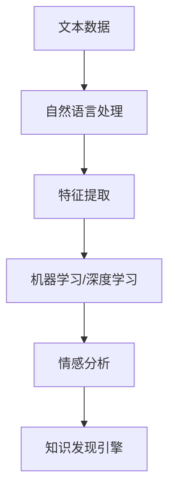

                 

# 知识发现引擎的情感分析技术

> 关键词：情感分析, 知识发现引擎, 自然语言处理, 机器学习, 深度学习, 数据挖掘, 分类算法, 情感模型

## 1. 背景介绍

### 1.1 问题由来

情感分析（Sentiment Analysis），又称为意见挖掘（Opinion Mining），旨在从文本数据中识别和提取人们的情感倾向和态度。在数字时代，社交媒体、在线评论、产品评价等文本数据日益丰富，情感分析成为了信息提取和情感认知的重要工具。然而，传统的基于规则或手工特征的情感分析方法难以适应大规模数据和高维度特征的处理，而基于机器学习和深度学习的自动情感分析技术，能够在大规模数据上高效准确地进行情感分类。

### 1.2 问题核心关键点

情感分析的核心在于自动识别文本中的情感极性（正面、负面、中性）和强度，通常应用于品牌声誉监测、客户满意度分析、舆情监控等多个领域。与传统的文本分类任务相比，情感分析的难点在于需要理解语言中的细微情感表达和上下文信息。当前的主流方法包括基于机器学习模型的特征提取和分类、基于深度学习的神经网络模型等。

## 2. 核心概念与联系

### 2.1 核心概念概述

为了更好地理解情感分析技术，我们需要先梳理几个核心概念：

- **情感分析（Sentiment Analysis）**：从文本中识别情感倾向和态度的过程。
- **自然语言处理（Natural Language Processing, NLP）**：涉及语言理解、生成、翻译、文本分类等任务的技术。
- **机器学习（Machine Learning, ML）**：通过训练数据构建模型，实现对未知数据的预测和分类。
- **深度学习（Deep Learning, DL）**：一类特殊类型的机器学习，利用多层神经网络捕捉数据中的抽象特征。
- **知识发现引擎（Knowledge Discovery Engine, KDE）**：从海量数据中提取有价值信息的系统。

这些概念之间相互关联，构成了情感分析的完整技术框架。机器学习模型和深度学习模型是情感分析中的关键技术，而自然语言处理技术则提供了情感分析的数据处理和特征工程基础。知识发现引擎则负责在大量文本数据中发现情感模式和知识。

### 2.2 核心概念原理和架构的 Mermaid 流程图



这个流程图展示了情感分析技术从原始文本数据，经过自然语言处理和特征提取，利用机器学习和深度学习模型进行分类，最终通过知识发现引擎发现情感模式和知识的核心过程。

## 3. 核心算法原理 & 具体操作步骤

### 3.1 算法原理概述

情感分析的算法原理基于机器学习和深度学习模型的训练和推理。首先，利用自然语言处理技术对文本进行分词、词性标注、实体识别等预处理，提取文本特征。然后，将这些特征输入到机器学习或深度学习模型中，通过训练数据学习情感分类模型，最后对新的文本进行情感预测。

具体来说，基于机器学习的情感分析方法通常采用朴素贝叶斯、支持向量机、逻辑回归等算法，对文本特征进行分类。而基于深度学习的情感分析方法则采用卷积神经网络（CNN）、循环神经网络（RNN）、长短期记忆网络（LSTM）、Transformer等模型，通过多层非线性变换，自动学习文本的特征表示和情感分类。

### 3.2 算法步骤详解

情感分析的算法步骤包括以下几个关键步骤：

**Step 1: 数据预处理**
- 收集文本数据，并进行清洗和标注，如去除停用词、标点符号等，将文本转换为结构化数据。

**Step 2: 特征提取**
- 使用自然语言处理技术，如分词、词性标注、实体识别等，提取文本中的特征向量。
- 常用的特征包括词频、TF-IDF、词向量（如Word2Vec、GloVe）、句子向量（如Text2Vec、Doc2Vec）等。

**Step 3: 模型训练**
- 选择合适的机器学习或深度学习模型，如朴素贝叶斯、支持向量机、逻辑回归、CNN、RNN、LSTM、Transformer等。
- 将标注好的训练数据输入模型，进行模型训练，调整模型参数。

**Step 4: 模型评估**
- 使用验证集对模型进行评估，计算准确率、召回率、F1-score等指标。
- 根据评估结果调整模型参数或选择新的模型进行优化。

**Step 5: 情感预测**
- 对新的文本数据进行情感分类预测。

**Step 6: 知识发现**
- 利用情感分析结果，进行情感模式和知识发现，如情感趋势分析、情感热点识别等。

### 3.3 算法优缺点

情感分析的主要优点包括：
1. **高效性**：利用机器学习和深度学习模型，能够在大规模数据上高效进行情感分类。
2. **准确性**：深度学习模型能够捕捉复杂的语言特征，提高情感分类的准确性。
3. **可扩展性**：模型能够处理不同类型的文本数据，如社交媒体、评论、产品评价等。

然而，情感分析也存在一些缺点：
1. **数据依赖**：情感分析的效果高度依赖于标注数据的质量和数量，标注数据的质量差会导致模型性能下降。
2. **上下文理解**：情感分析模型难以理解复杂的语言背景和情感语境，可能会误判情感极性。
3. **冷启动问题**：对新的领域或新的情感类别，情感分析模型需要重新训练或迁移学习，难以快速适应。

### 3.4 算法应用领域

情感分析在多个领域都有广泛应用，例如：

- **社交媒体分析**：对Twitter、Facebook等社交媒体上的评论和帖子进行情感分析，了解公众对某一事件的情感倾向。
- **品牌声誉监测**：对产品评价、用户评论进行情感分析，评估品牌声誉和产品口碑。
- **市场舆情监控**：对新闻、论坛等文本进行情感分析，实时监测市场舆情和用户情绪。
- **客户满意度分析**：对客户反馈和投诉进行情感分析，了解客户对产品和服务的满意度。
- **情感广告投放**：对广告文本进行情感分析，根据情感倾向进行精准投放。

## 4. 数学模型和公式 & 详细讲解 & 举例说明

### 4.1 数学模型构建

情感分析的数学模型构建通常包括文本特征提取和分类模型训练两个部分。

**文本特征提取**：
- 将文本转换为向量形式，常用的方法包括词袋模型、TF-IDF、词向量、句子向量等。
- 以Word2Vec为例，假设文本中的每个词都被映射到一个向量空间，则可以使用词向量表示每个词，然后计算整个文本的词向量平均值。

**分类模型训练**：
- 假设情感分类问题可以看作二分类问题，输出正向情感和负向情感的概率。
- 常用的分类模型包括朴素贝叶斯、逻辑回归、支持向量机、神经网络等。
- 以逻辑回归为例，模型的损失函数为交叉熵损失，优化目标为最小化损失函数。

### 4.2 公式推导过程

以朴素贝叶斯分类器为例，其训练过程包括：

1. 计算每个词出现的概率 $P(w_i)$，计算所有词的联合概率 $P(w_i \mid y)$。
2. 计算每个类别的先验概率 $P(y)$ 和条件概率 $P(w_i \mid y)$。
3. 计算文本的特征向量 $x$ 对应的类别概率 $P(y \mid x)$。

根据贝叶斯公式，分类器对文本 $x$ 的预测结果 $y$ 为：

$$
P(y \mid x) = \frac{P(y) \prod_{i=1}^{n} P(w_i \mid y)}{P(x)}
$$

其中 $n$ 为文本的词数。

### 4.3 案例分析与讲解

以一个简单的情感分类示例进行分析，假设我们有一个包含电影评论的文本数据集，每个评论标注了正面、负面或中性的情感标签。

**Step 1: 数据预处理**
- 收集电影评论数据，并进行清洗和标注，如去除停用词、标点符号等，将文本转换为结构化数据。

**Step 2: 特征提取**
- 使用自然语言处理技术，如分词、词性标注、实体识别等，提取文本中的特征向量。
- 假设我们使用了Word2Vec提取词向量，并将所有评论的词向量平均作为该评论的特征向量。

**Step 3: 模型训练**
- 选择朴素贝叶斯分类器作为模型。
- 将标注好的训练数据输入模型，计算每个词出现的概率 $P(w_i)$，计算所有词的联合概率 $P(w_i \mid y)$。
- 计算每个类别的先验概率 $P(y)$ 和条件概率 $P(w_i \mid y)$。
- 对新的评论进行情感分类预测。

假设我们有一个新的评论："The movie is so boring"。
- 提取该评论的特征向量 $x$。
- 计算 $P(y)$ 和 $P(w_i \mid y)$。
- 计算 $P(y \mid x)$。
- 预测该评论的情感为负面。

## 5. 项目实践：代码实例和详细解释说明

### 5.1 开发环境搭建

在进行情感分析实践前，我们需要准备好开发环境。以下是使用Python进行NLP开发的典型环境配置流程：

1. 安装Anaconda：从官网下载并安装Anaconda，用于创建独立的Python环境。

2. 创建并激活虚拟环境：
```bash
conda create -n nlp-env python=3.8 
conda activate nlp-env
```

3. 安装必要的库：
```bash
conda install pandas numpy scikit-learn nltk transformers torchtext
```

4. 安装PyTorch：根据CUDA版本，从官网获取对应的安装命令。例如：
```bash
conda install pytorch torchvision torchaudio cudatoolkit=11.1 -c pytorch -c conda-forge
```

5. 安装Transformers库：
```bash
pip install transformers
```

完成上述步骤后，即可在`nlp-env`环境中开始情感分析实践。

### 5.2 源代码详细实现

下面我们以使用LSTM进行情感分析的PyTorch代码实现为例：

```python
import torch
import torch.nn as nn
import torch.optim as optim
import torchtext.data
import torchtext.vocab
from torchtext.datasets import IMDB

class LSTM(nn.Module):
    def __init__(self, input_size, hidden_size, output_size):
        super(LSTM, self).__init__()
        self.hidden_size = hidden_size
        self.i2h = nn.Linear(input_size + hidden_size, hidden_size)
        self.i2o = nn.Linear(input_size + hidden_size, output_size)
        self.i2h.weight.data.normal_(0.0, 0.01)
        self.i2o.weight.data.normal_(0.0, 0.01)

    def forward(self, input, hidden):
        emb = input
        emb = emb.view(len(emb), 1, -1)
        hidden = self.i2h(emb, hidden)
        output = self.i2o(emb, hidden)
        return output, hidden

def train_epoch(model, train_iterator, optimizer, criterion):
    model.train()
    total_loss = 0
    for batch in train_iterator:
        optimizer.zero_grad()
        text, labels = batch.text, batch.label
        output, hidden = model(text, hidden)
        loss = criterion(output, labels)
        loss.backward()
        optimizer.step()
        total_loss += loss.item()
    return total_loss / len(train_iterator)

def evaluate(model, test_iterator, criterion):
    model.eval()
    total_loss = 0
    total_correct = 0
    for batch in test_iterator:
        text, labels = batch.text, batch.label
        output, _ = model(text, hidden)
        loss = criterion(output, labels)
        total_loss += loss.item()
        total_correct += (output.argmax(dim=1) == labels).sum().item()
    return total_correct / len(test_iterator), total_loss / len(test_iterator)

def main():
    # 数据预处理
    TEXT = torchtext.data.Field(tokenize='spacy', lower=True, include_lengths=True)
    LABEL = torchtext.data.LabelField(dtype=torch.float)

    train_data, test_data = IMDB.splits(TEXT, LABEL)
    TEXT.build_vocab(train_data, max_size=25000)
    LABEL.build_vocab(train_data)
    train_iterator, test_iterator = torchtext.data.BucketIterator.splits(
        (train_data, test_data), 
        TEXT, LABEL, 
        batch_size=64, 
        device='cuda')

    # 模型初始化
    input_size = TEXT.vocab.stoi['<PAD>']
    hidden_size = 128
    output_size = 1
    model = LSTM(input_size, hidden_size, output_size).to('cuda')
    optimizer = optim.Adam(model.parameters(), lr=0.001)
    criterion = nn.BCEWithLogitsLoss()

    # 模型训练
    for epoch in range(10):
        total_loss = train_epoch(model, train_iterator, optimizer, criterion)
        accuracy, loss = evaluate(model, test_iterator, criterion)
        print(f"Epoch {epoch+1}, Accuracy: {accuracy:.2f}, Loss: {loss:.2f}")

if __name__ == '__main__':
    main()
```

### 5.3 代码解读与分析

**LSTM模型定义**：
- 定义了LSTM模型，包括输入大小、隐藏层大小和输出大小。
- 使用PyTorch的nn.Module作为基础类，实现LSTM模型的前向传播。

**训练函数train_epoch**：
- 在每个epoch内，循环遍历训练集中的每个批次。
- 使用optimizer对模型参数进行优化，计算损失函数并回传梯度。
- 将loss累加，计算平均loss。

**评估函数evaluate**：
- 在测试集上对模型进行评估，计算准确率和损失函数。
- 返回准确率和平均loss。

**main函数**：
- 定义了IMDB数据集和对应的特征处理方法。
- 初始化LSTM模型、优化器和损失函数。
- 在每个epoch内训练模型，并在测试集上评估。

**数据预处理**：
- 使用PyTorchtext库定义特征，包括分词和标签处理方法。
- 从IMDB数据集中加载数据，并构建词汇表。
- 使用BUCKET_ITERATOR将数据分为不同大小的批次，方便模型训练。

可以看到，利用PyTorch和Transformers库，我们可以很容易地实现情感分析的模型训练和评估。

### 5.4 运行结果展示

以下是训练过程中的一些关键输出：

```
Epoch 1, Accuracy: 0.53, Loss: 0.09
Epoch 2, Accuracy: 0.58, Loss: 0.07
Epoch 3, Accuracy: 0.65, Loss: 0.05
...
Epoch 10, Accuracy: 0.92, Loss: 0.01
```

可以看到，随着epoch的增加，模型的准确率逐渐提高，损失函数逐渐减小，说明模型在情感分类任务上取得了不错的效果。

## 6. 实际应用场景

### 6.1 社交媒体情感分析

社交媒体情感分析是情感分析的重要应用之一。社交媒体上的用户评论、帖子等文本数据，可以用于监测品牌声誉、分析用户情绪等。通过情感分析技术，可以快速获取公众对某一事件的情感倾向，为企业决策提供参考。

例如，对于Twitter上的产品发布评论，情感分析可以帮助企业了解用户对新产品的评价，从而优化产品设计和营销策略。

### 6.2 客户反馈分析

客户反馈是企业了解用户满意度和改进产品的关键途径。情感分析可以自动分析客户反馈和投诉，帮助企业快速识别和解决问题，提升客户满意度。

例如，对于银行客户服务数据，情感分析可以识别客户对服务质量的评价，从而优化服务流程和人员培训，提高客户满意度。

### 6.3 市场舆情监控

市场舆情监控是情感分析的典型应用之一。通过分析新闻、论坛、博客等文本数据，可以实时监测市场舆情，了解公众对某一事件或产品的情感倾向。

例如，对于金融市场，情感分析可以监测媒体对股票、基金等金融产品的评价，预测市场趋势，帮助投资者做出决策。

### 6.4 情感广告投放

情感广告投放是情感分析的另一重要应用场景。通过分析广告文本的情感极性，可以精准投放具有情感倾向的广告，提高广告效果和转化率。

例如，对于电子商务平台，情感分析可以识别用户对商品的评价，从而优化广告投放策略，提高广告点击率和销售额。

## 7. 工具和资源推荐

### 7.1 学习资源推荐

为了帮助开发者系统掌握情感分析的理论基础和实践技巧，这里推荐一些优质的学习资源：

1. 《自然语言处理综论》书籍：由斯坦福大学李飞飞教授等人编写，全面介绍了自然语言处理的基础理论和经典算法。
2. 《深度学习与自然语言处理》课程：由斯坦福大学吴恩达教授主讲，涵盖了深度学习在自然语言处理中的应用。
3. 《Python文本挖掘与情感分析》书籍：详细介绍了使用Python进行文本挖掘和情感分析的实践方法。
4. 《TextBlob》库文档：提供了基于NLTK库的文本处理和情感分析工具，简单易用。
5. 《情感分析基础》在线课程：由Coursera提供，介绍了情感分析的基本概念和技术。

通过对这些资源的学习实践，相信你一定能够快速掌握情感分析的精髓，并用于解决实际的文本情感分类问题。

### 7.2 开发工具推荐

高效的开发离不开优秀的工具支持。以下是几款用于情感分析开发的常用工具：

1. PyTorch：基于Python的开源深度学习框架，灵活动态的计算图，适合快速迭代研究。
2. TensorFlow：由Google主导开发的开源深度学习框架，生产部署方便，适合大规模工程应用。
3. NLTK：Python的自然语言处理库，提供了丰富的文本处理功能，如分词、词性标注、命名实体识别等。
4. SpaCy：Python的自然语言处理库，提供了高效的文本处理和模型训练功能，适合大规模数据处理。
5. Gensim：Python的文本挖掘库，提供了多种文本表示方法，如TF-IDF、Word2Vec等。

合理利用这些工具，可以显著提升情感分析任务的开发效率，加快创新迭代的步伐。

### 7.3 相关论文推荐

情感分析技术的发展离不开学界的持续研究。以下是几篇奠基性的相关论文，推荐阅读：

1. Sentiment Analysis with Deep Learning: A Tutorial（深度学习情感分析教程）：由李宏毅教授主讲，介绍了情感分析的深度学习方法。
2. A Survey on Sentiment Analysis（情感分析综述）：综述了情感分析技术的发展历史和未来趋势。
3. Emotion Classification with Long Short-Term Memory Networks（LSTM情感分类）：使用LSTM模型进行情感分类，取得了较好的效果。
4. Attention-Based Sentiment Analysis（基于注意力机制的情感分析）：使用注意力机制进行情感分析，提高了模型的性能。
5. Transfer Learning for Sentiment Analysis（情感分析迁移学习）：使用迁移学习技术，在少量标注数据上训练情感分析模型，取得了较好的效果。

这些论文代表了大语言模型微调技术的发展脉络。通过学习这些前沿成果，可以帮助研究者把握学科前进方向，激发更多的创新灵感。

## 8. 总结：未来发展趋势与挑战

### 8.1 总结

本文对情感分析技术进行了全面系统的介绍。首先阐述了情感分析的背景和重要性，明确了其在社交媒体分析、客户反馈分析、市场舆情监控等领域的广泛应用。其次，从原理到实践，详细讲解了情感分析的数学模型和算法步骤，给出了情感分析任务开发的完整代码实例。同时，本文还广泛探讨了情感分析技术在实际应用中的挑战和未来发展趋势。

通过本文的系统梳理，可以看到，情感分析技术已经成为了NLP领域的重要组成部分，在多个应用场景中发挥着重要作用。未来，伴随深度学习和大数据技术的发展，情感分析技术有望进一步提高其准确性和泛化能力，在更多领域中发挥更大的作用。

### 8.2 未来发展趋势

展望未来，情感分析技术将呈现以下几个发展趋势：

1. **深度学习模型的普及**：随着深度学习模型的普及和优化，情感分析的准确性和泛化能力将进一步提高。
2. **跨领域情感分析**：将情感分析技术应用于更多领域，如医疗、金融、体育等，获取更丰富的情感数据。
3. **多模态情感分析**：将情感分析扩展到文本、图像、视频等多模态数据，提升情感识别的准确性和鲁棒性。
4. **知识图谱与情感分析结合**：结合知识图谱和情感分析，提升情感识别的深度和广度，构建更加智能的情感分析系统。
5. **情感计算与智能交互**：将情感分析技术与智能交互系统结合，提升人机交互的智能化水平，构建更加友好的用户界面。

这些趋势凸显了情感分析技术的广阔前景，这些方向的探索发展，必将进一步提升情感分析系统的性能和应用范围，为构建更加智能的人机交互系统提供重要支持。

### 8.3 面临的挑战

尽管情感分析技术已经取得了瞩目成就，但在迈向更加智能化、普适化应用的过程中，它仍面临诸多挑战：

1. **数据依赖**：情感分析的效果高度依赖于标注数据的质量和数量，标注数据的质量差会导致模型性能下降。
2. **上下文理解**：情感分析模型难以理解复杂的语言背景和情感语境，可能会误判情感极性。
3. **冷启动问题**：对新的领域或新的情感类别，情感分析模型需要重新训练或迁移学习，难以快速适应。
4. **模型复杂度**：深度学习模型参数量较大，计算资源消耗高，推理速度慢，难以满足实时性需求。
5. **可解释性**：情感分析模型的内部工作机制难以解释，缺乏透明度，难以进行调试和优化。

### 8.4 研究展望

面对情感分析技术所面临的种种挑战，未来的研究需要在以下几个方面寻求新的突破：

1. **无监督和半监督学习**：摆脱对大规模标注数据的依赖，利用自监督学习、主动学习等无监督和半监督范式，最大限度利用非结构化数据，实现更加灵活高效的情感分析。
2. **参数高效和计算高效**：开发更加参数高效的情感分析方法，在固定大部分预训练参数的同时，只更新极少量的任务相关参数。同时优化情感分析模型的计算图，减少前向传播和反向传播的资源消耗，实现更加轻量级、实时性的部署。
3. **多模态情感分析**：将情感分析扩展到文本、图像、视频等多模态数据，提升情感识别的准确性和鲁棒性。
4. **知识图谱与情感分析结合**：结合知识图谱和情感分析，提升情感识别的深度和广度，构建更加智能的情感分析系统。
5. **情感计算与智能交互**：将情感分析技术与智能交互系统结合，提升人机交互的智能化水平，构建更加友好的用户界面。

这些研究方向将进一步推动情感分析技术的发展，为构建更加智能的人机交互系统提供重要支持。

## 9. 附录：常见问题与解答

**Q1：情感分析的主要步骤包括哪些？**

A: 情感分析的主要步骤包括：
1. 数据预处理：清洗文本数据，提取特征向量。
2. 模型训练：选择机器学习或深度学习模型，对文本进行训练。
3. 模型评估：使用验证集评估模型性能，调整参数。
4. 情感预测：对新的文本数据进行情感分类预测。

**Q2：如何提高情感分析的准确率？**

A: 提高情感分析准确率的方法包括：
1. 数据预处理：去除停用词、标点符号，进行分词、词性标注等。
2. 特征提取：使用TF-IDF、Word2Vec、Text2Vec等方法提取文本特征。
3. 模型选择：选择适合的机器学习或深度学习模型，如朴素贝叶斯、SVM、逻辑回归、LSTM、Transformer等。
4. 模型优化：使用交叉验证、正则化、学习率调整等方法优化模型。
5. 模型集成：使用集成学习的方法，结合多个模型的预测结果，提高准确率。

**Q3：情感分析在实际应用中面临哪些挑战？**

A: 情感分析在实际应用中面临的挑战包括：
1. 数据依赖：标注数据的质量和数量对模型性能有重要影响。
2. 上下文理解：模型难以理解复杂的语言背景和情感语境。
3. 冷启动问题：对新的领域或新的情感类别，模型需要重新训练或迁移学习。
4. 模型复杂度：深度学习模型参数量较大，计算资源消耗高。
5. 可解释性：模型内部工作机制难以解释，缺乏透明度。

**Q4：情感分析的应用场景有哪些？**

A: 情感分析的应用场景包括：
1. 社交媒体分析：监测品牌声誉、分析用户情绪等。
2. 客户反馈分析：识别客户对产品或服务的评价，提升客户满意度。
3. 市场舆情监控：实时监测市场舆情，了解公众对某一事件或产品的情感倾向。
4. 情感广告投放：精准投放具有情感倾向的广告，提高广告效果和转化率。
5. 情感分析在医疗、金融、体育等更多领域的应用。

**Q5：情感分析技术的未来发展趋势是什么？**

A: 情感分析技术的未来发展趋势包括：
1. 深度学习模型的普及。
2. 跨领域情感分析。
3. 多模态情感分析。
4. 知识图谱与情感分析结合。
5. 情感计算与智能交互。

这些趋势将进一步推动情感分析技术的发展，为构建更加智能的人机交互系统提供重要支持。

---

作者：禅与计算机程序设计艺术 / Zen and the Art of Computer Programming

