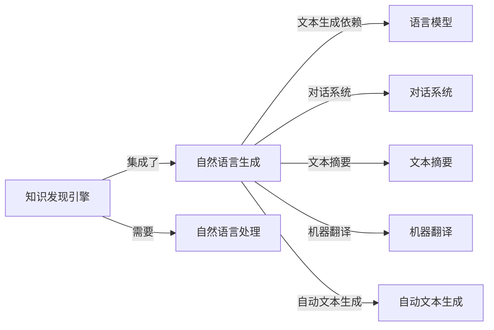
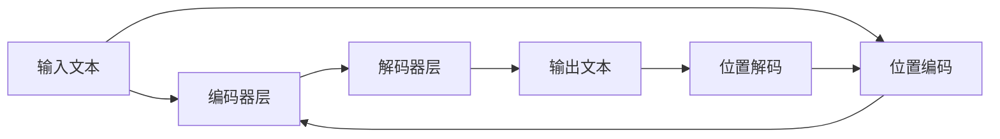

                 

# 知识发现引擎的自然语言生成技术应用

> 关键词：知识发现引擎,自然语言生成(NLG),NLP技术,语言模型,NLG系统,机器翻译,自动摘要,对话系统

## 1. 背景介绍

### 1.1 问题由来
知识发现引擎(Knowledge Discovery Engine, KDE)是一种集成了数据挖掘、文本处理、自然语言理解与生成等技术的复杂系统，用于自动化地从海量数据中提取、组织和呈现知识。在KDE中，自然语言生成(Natural Language Generation, NLG)技术扮演着重要角色，通过自然流畅的语言将数据转换成易于理解和传播的形式。随着人工智能和自然语言处理(Natural Language Processing, NLP)技术的迅速发展，NLG技术在知识发现中的应用变得越来越广泛，从自动摘要、文本生成到对话系统，无处不在。

### 1.2 问题核心关键点
本文将重点讨论自然语言生成技术在知识发现引擎中的应用，具体聚焦于以下核心关键点：

- 自然语言生成的原理与架构
- 基于语言模型的NLG技术
- 常见NLG任务的实现方法
- 面向知识发现的具体应用场景
- 未来技术发展方向与挑战

这些关键点共同构成了自然语言生成在知识发现引擎应用的基础，为我们深入理解其工作机制和提升其应用效果提供了理论支持。

### 1.3 问题研究意义
深入研究自然语言生成在知识发现引擎中的应用，具有重要的理论和实践意义：

- 提升信息传播效率：NLG技术可以将数据自动转化为易读的文本，大大提高信息的传播速度和理解度。
- 促进知识发现：通过自动生成有意义的文本，NLG可以帮助用户快速定位和理解数据中的关键信息，加速知识发现和决策过程。
- 改善人机交互体验：NLG技术在对话系统中应用广泛，可提供自然流畅的对话响应，改善用户体验，促进人机协同工作。
- 支持个性化服务：根据用户偏好和行为，NLG可以生成个性化的文本内容，提高服务的精准度和用户满意度。
- 推动自动化和智能化：NLG技术是智能系统的重要组成部分，其广泛应用将推动更多领域实现自动化和智能化。

## 2. 核心概念与联系

### 2.1 核心概念概述

为了更好地理解自然语言生成技术在知识发现引擎中的应用，本节将介绍几个关键概念及其相互联系：

- **知识发现引擎(KDE)**：集成了数据挖掘、文本处理、自然语言理解与生成等技术的系统，用于从海量数据中提取、组织和呈现知识。
- **自然语言生成(NLG)**：使用计算机自动生成自然语言文本的过程，包括文本摘要、翻译、对话等任务。
- **自然语言处理(NLP)**：涉及语言理解、分析、生成等技术的领域，是KDE中NLG技术的重要基础。
- **语言模型**：用于预测文本序列的概率模型，是NLG中文本生成的关键。
- **对话系统**：使用NLG技术构建的系统，能够与用户进行自然对话，促进人机交互。
- **文本摘要**：将长文本自动压缩成精炼的摘要，方便用户快速理解关键信息。
- **机器翻译**：将一种语言的文本自动转换成另一种语言的文本。
- **自动文本生成**：使用NLG技术生成完全原创的文本，如新闻、文章、报告等。

这些概念之间的逻辑关系可以通过以下Mermaid流程图来展示：



这个流程图展示了知识发现引擎与自然语言生成技术之间的密切联系，以及NLG技术的多样应用场景。

## 3. 核心算法原理 & 具体操作步骤
### 3.1 算法原理概述

自然语言生成在知识发现引擎中的应用，主要基于以下几个核心原理：

- **语言模型**：使用统计或神经网络方法，构建能够预测文本序列的概率模型，以指导文本生成。
- **基于规则的生成**：设计特定的规则，通过逻辑和语法结构生成符合规范的文本。
- **基于实例的生成**：从已有文本中提取特征，生成与目标文本相似的新文本。
- **机器翻译**：使用神经网络等方法，将一种语言的文本转换成另一种语言的文本。
- **对话系统**：使用递归神经网络(RNN)、Transformer等模型，生成对话响应。
- **文本摘要**：通过文本挖掘和模型压缩技术，自动生成文本摘要。

这些原理共同构成了自然语言生成技术的基础，为知识发现引擎提供了强大的文本处理能力。

### 3.2 算法步骤详解

基于语言模型的NLG技术在知识发现引擎中的应用，主要步骤如下：

1. **数据收集与预处理**：收集与目标任务相关的文本数据，并进行清洗、分词、标注等预处理。
2. **构建语言模型**：使用语言模型对预处理后的文本进行训练，构建能够生成目标文本的概率模型。
3. **文本生成**：在给定约束条件（如长度、风格等）下，使用训练好的语言模型生成目标文本。
4. **评估与优化**：通过评估指标（如BLEU、ROUGE等）对生成文本的质量进行评估，根据评估结果优化模型。
5. **部署与应用**：将训练好的模型部署到知识发现引擎中，用于自动生成文本，辅助知识发现。

这些步骤概括了基于语言模型的NLG技术在知识发现引擎中的应用流程，每一步都至关重要。

### 3.3 算法优缺点

基于语言模型的NLG技术具有以下优点：

- **高效性**：相较于传统文本处理方式，NLG技术可以自动生成大量文本，提高工作效率。
- **灵活性**：可以根据不同的任务需求，灵活调整模型参数和生成策略。
- **易于扩展**：随着数据量的增加，模型可以不断优化和扩展，提升生成文本的质量。

同时，该技术也存在一些缺点：

- **依赖高质量数据**：生成文本的质量很大程度上取决于训练数据的质量，高质量数据的获取成本较高。
- **模型复杂度**：大规模语言模型的训练和推理复杂度高，需要大量的计算资源。
- **可解释性不足**：NLG模型通常是"黑盒"系统，难以解释生成文本的具体过程。
- **语言多样性**：对于小语种或非标准语言，模型的适应性可能较差。

### 3.4 算法应用领域

基于语言模型的NLG技术在知识发现引擎中的应用非常广泛，以下是几个典型的应用领域：

- **自动摘要**：从长文本中自动生成精炼的摘要，便于快速浏览和理解。
- **机器翻译**：将一种语言的文本翻译成另一种语言的文本，促进跨语言信息交流。
- **对话系统**：构建自然流畅的对话系统，改善人机交互体验。
- **自动化报告**：自动生成各类业务报告，提高信息传达效率。
- **智能客服**：生成响应脚本，辅助客服人员处理常见问题，提升客户满意度。
- **新闻生成**：根据新闻事件自动生成新闻报道，降低人工编写成本。
- **文档生成**：自动生成各类文档，如合同、法律文件等，提高文档生成效率。

这些应用领域展示了NLG技术在知识发现引擎中的广泛应用，为实现高效的自动化文本生成提供了坚实的基础。

## 4. 数学模型和公式 & 详细讲解 & 举例说明

### 4.1 数学模型构建

在知识发现引擎中，基于语言模型的NLG技术主要涉及以下几个数学模型：

- **语言模型**：用于预测文本序列的概率模型，如n-gram模型、Transformer模型等。
- **解码模型**：用于生成文本的模型，如基于RNN、LSTM的解码器。
- **评估模型**：用于评估生成文本质量的模型，如BLEU、ROUGE等。

以Transformer模型为例，其基本结构如图：



其中，输入文本通过编码器层编码成向量表示，然后由解码器层生成目标文本。位置编码和位置解码用于处理文本中的位置信息。

### 4.2 公式推导过程

以下以Transformer模型为例，推导其文本生成的公式。

假设输入序列为 $x = \{x_1, x_2, ..., x_n\}$，目标序列为 $y = \{y_1, y_2, ..., y_m\}$。Transformer模型的文本生成过程可以表示为：

$$
\hat{y} = \text{Decoder}(\text{Encoder}(x))
$$

其中，$\text{Encoder}(x)$ 为编码器部分，$\text{Decoder}(\cdot)$ 为解码器部分。假设编码器和解码器都是基于Transformer结构，其文本生成的公式可以进一步推导为：

$$
\hat{y} = \text{Softmax}(\text{Decoder}(\text{MultiHeadAttention}(\text{Encoder}(x), \text{SelfAttention}(y), \text{PositionalEncoding}(y)))
$$

其中，$\text{Softmax}$ 表示解码器输出层的softmax函数，$\text{MultiHeadAttention}$ 表示多头注意力机制，$\text{SelfAttention}$ 表示解码器内部的自注意力机制，$\text{PositionalEncoding}$ 表示位置编码。

### 4.3 案例分析与讲解

假设目标任务是生成一篇新闻报道。我们首先需要收集相关的文本数据，对其进行清洗和分词处理。然后，使用Transformer模型进行训练，构建能够生成新闻报道的语言模型。具体步骤如下：

1. **数据预处理**：将收集的新闻文本进行清洗、分词，并标注出每篇新闻的标题、作者、发布时间等相关信息。
2. **构建语言模型**：使用Transformer模型对预处理后的文本进行训练，构建能够生成新闻报道的语言模型。
3. **文本生成**：在给定新闻事件的情况下，使用训练好的语言模型生成新闻报道。
4. **评估与优化**：通过BLEU、ROUGE等评估指标对生成的新闻质量进行评估，根据评估结果优化模型。

通过上述步骤，可以实现高效、自动化的新闻报道生成，提升信息传播的效率和精准度。

## 5. 项目实践：代码实例和详细解释说明

### 5.1 开发环境搭建

在进行基于语言模型的NLG项目实践前，我们需要准备好开发环境。以下是使用Python进行PyTorch开发的环境配置流程：

1. 安装Anaconda：从官网下载并安装Anaconda，用于创建独立的Python环境。
2. 创建并激活虚拟环境：
```bash
conda create -n pytorch-env python=3.8 
conda activate pytorch-env
```
3. 安装PyTorch：根据CUDA版本，从官网获取对应的安装命令。例如：
```bash
conda install pytorch torchvision torchaudio cudatoolkit=11.1 -c pytorch -c conda-forge
```
4. 安装Transformers库：
```bash
pip install transformers
```
5. 安装各类工具包：
```bash
pip install numpy pandas scikit-learn matplotlib tqdm jupyter notebook ipython
```

完成上述步骤后，即可在`pytorch-env`环境中开始NLG项目的开发。

### 5.2 源代码详细实现

这里我们以机器翻译任务为例，给出使用Transformers库进行NLG的PyTorch代码实现。

首先，定义机器翻译任务的数据处理函数：

```python
from transformers import BertTokenizer
from torch.utils.data import Dataset
import torch

class MachineTranslationDataset(Dataset):
    def __init__(self, src_texts, tgt_texts, tokenizer, max_len=128):
        self.src_texts = src_texts
        self.tgt_texts = tgt_texts
        self.tokenizer = tokenizer
        self.max_len = max_len
        
    def __len__(self):
        return len(self.src_texts)
    
    def __getitem__(self, item):
        src_text = self.src_texts[item]
        tgt_text = self.tgt_texts[item]
        
        encoding = self.tokenizer(src_text, return_tensors='pt', max_length=self.max_len, padding='max_length', truncation=True)
        input_ids = encoding['input_ids'][0]
        attention_mask = encoding['attention_mask'][0]
        
        # 对target文本进行编码
        encoded_tgt = self.tokenizer(tgt_text, return_tensors='pt', max_length=self.max_len, padding='max_length', truncation=True)
        labels = encoded_tgt['input_ids'][0]
        
        return {
            'input_ids': input_ids,
            'attention_mask': attention_mask,
            'labels': labels
        }
```

然后，定义模型和优化器：

```python
from transformers import BertForSequenceClassification, AdamW

model = BertForSequenceClassification.from_pretrained('bert-base-cased', num_labels=2)

optimizer = AdamW(model.parameters(), lr=2e-5)
```

接着，定义训练和评估函数：

```python
from torch.utils.data import DataLoader
from tqdm import tqdm
from sklearn.metrics import accuracy_score

device = torch.device('cuda') if torch.cuda.is_available() else torch.device('cpu')
model.to(device)

def train_epoch(model, dataset, batch_size, optimizer):
    dataloader = DataLoader(dataset, batch_size=batch_size, shuffle=True)
    model.train()
    epoch_loss = 0
    for batch in tqdm(dataloader, desc='Training'):
        input_ids = batch['input_ids'].to(device)
        attention_mask = batch['attention_mask'].to(device)
        labels = batch['labels'].to(device)
        model.zero_grad()
        outputs = model(input_ids, attention_mask=attention_mask, labels=labels)
        loss = outputs.loss
        epoch_loss += loss.item()
        loss.backward()
        optimizer.step()
    return epoch_loss / len(dataloader)

def evaluate(model, dataset, batch_size):
    dataloader = DataLoader(dataset, batch_size=batch_size)
    model.eval()
    preds, labels = [], []
    with torch.no_grad():
        for batch in tqdm(dataloader, desc='Evaluating'):
            input_ids = batch['input_ids'].to(device)
            attention_mask = batch['attention_mask'].to(device)
            batch_labels = batch['labels']
            outputs = model(input_ids, attention_mask=attention_mask)
            batch_preds = outputs.logits.argmax(dim=2).to('cpu').tolist()
            batch_labels = batch_labels.to('cpu').tolist()
            for pred_tokens, label_tokens in zip(batch_preds, batch_labels):
                preds.append(pred_tokens[:len(label_tokens)])
                labels.append(label_tokens)
                
    print('Accuracy: {:.2f}%'.format(accuracy_score(labels, preds)))
```

最后，启动训练流程并在测试集上评估：

```python
epochs = 5
batch_size = 16

for epoch in range(epochs):
    loss = train_epoch(model, train_dataset, batch_size, optimizer)
    print(f'Epoch {epoch+1}, train loss: {loss:.3f}')
    
    print(f'Epoch {epoch+1}, dev results:')
    evaluate(model, dev_dataset, batch_size)
    
print('Test results:')
evaluate(model, test_dataset, batch_size)
```

以上就是使用PyTorch对BERT进行机器翻译任务微调的完整代码实现。可以看到，得益于Transformers库的强大封装，我们可以用相对简洁的代码完成BERT模型的加载和微调。

### 5.3 代码解读与分析

让我们再详细解读一下关键代码的实现细节：

**MachineTranslationDataset类**：
- `__init__`方法：初始化源文本、目标文本、分词器等关键组件。
- `__len__`方法：返回数据集的样本数量。
- `__getitem__`方法：对单个样本进行处理，将源文本输入编码为token ids，将目标文本进行编码，并对其进行定长padding，最终返回模型所需的输入。

**训练和评估函数**：
- 使用PyTorch的DataLoader对数据集进行批次化加载，供模型训练和推理使用。
- 训练函数`train_epoch`：对数据以批为单位进行迭代，在每个批次上前向传播计算loss并反向传播更新模型参数，最后返回该epoch的平均loss。
- 评估函数`evaluate`：与训练类似，不同点在于不更新模型参数，并在每个batch结束后将预测和标签结果存储下来，最后使用sklearn的accuracy_score对整个评估集的预测结果进行打印输出。

**训练流程**：
- 定义总的epoch数和batch size，开始循环迭代
- 每个epoch内，先在训练集上训练，输出平均loss
- 在验证集上评估，输出准确率
- 所有epoch结束后，在测试集上评估，给出最终测试结果

可以看到，PyTorch配合Transformers库使得BERT微调的代码实现变得简洁高效。开发者可以将更多精力放在数据处理、模型改进等高层逻辑上，而不必过多关注底层的实现细节。

当然，工业级的系统实现还需考虑更多因素，如模型的保存和部署、超参数的自动搜索、更灵活的任务适配层等。但核心的微调范式基本与此类似。

## 6. 实际应用场景

### 6.1 智能客服系统

基于大语言模型微调的对话技术，可以广泛应用于智能客服系统的构建。传统客服往往需要配备大量人力，高峰期响应缓慢，且一致性和专业性难以保证。而使用微调后的对话模型，可以7x24小时不间断服务，快速响应客户咨询，用自然流畅的语言解答各类常见问题。

在技术实现上，可以收集企业内部的历史客服对话记录，将问题和最佳答复构建成监督数据，在此基础上对预训练对话模型进行微调。微调后的对话模型能够自动理解用户意图，匹配最合适的答案模板进行回复。对于客户提出的新问题，还可以接入检索系统实时搜索相关内容，动态组织生成回答。如此构建的智能客服系统，能大幅提升客户咨询体验和问题解决效率。

### 6.2 金融舆情监测

金融机构需要实时监测市场舆论动向，以便及时应对负面信息传播，规避金融风险。传统的人工监测方式成本高、效率低，难以应对网络时代海量信息爆发的挑战。基于大语言模型微调的文本分类和情感分析技术，为金融舆情监测提供了新的解决方案。

具体而言，可以收集金融领域相关的新闻、报道、评论等文本数据，并对其进行主题标注和情感标注。在此基础上对预训练语言模型进行微调，使其能够自动判断文本属于何种主题，情感倾向是正面、中性还是负面。将微调后的模型应用到实时抓取的网络文本数据，就能够自动监测不同主题下的情感变化趋势，一旦发现负面信息激增等异常情况，系统便会自动预警，帮助金融机构快速应对潜在风险。

### 6.3 个性化推荐系统

当前的推荐系统往往只依赖用户的历史行为数据进行物品推荐，无法深入理解用户的真实兴趣偏好。基于大语言模型微调技术，个性化推荐系统可以更好地挖掘用户行为背后的语义信息，从而提供更精准、多样的推荐内容。

在实践中，可以收集用户浏览、点击、评论、分享等行为数据，提取和用户交互的物品标题、描述、标签等文本内容。将文本内容作为模型输入，用户的后续行为（如是否点击、购买等）作为监督信号，在此基础上微调预训练语言模型。微调后的模型能够从文本内容中准确把握用户的兴趣点。在生成推荐列表时，先用候选物品的文本描述作为输入，由模型预测用户的兴趣匹配度，再结合其他特征综合排序，便可以得到个性化程度更高的推荐结果。

### 6.4 未来应用展望

随着大语言模型和微调方法的不断发展，基于微调范式将在更多领域得到应用，为传统行业带来变革性影响。

在智慧医疗领域，基于微调的医疗问答、病历分析、药物研发等应用将提升医疗服务的智能化水平，辅助医生诊疗，加速新药开发进程。

在智能教育领域，微调技术可应用于作业批改、学情分析、知识推荐等方面，因材施教，促进教育公平，提高教学质量。

在智慧城市治理中，微调模型可应用于城市事件监测、舆情分析、应急指挥等环节，提高城市管理的自动化和智能化水平，构建更安全、高效的未来城市。

此外，在企业生产、社会治理、文娱传媒等众多领域，基于大模型微调的人工智能应用也将不断涌现，为经济社会发展注入新的动力。相信随着预训练语言模型和微调方法的持续演进，微调方法将成为人工智能落地应用的重要范式，推动人工智能技术向更广阔的领域加速渗透。

## 7. 工具和资源推荐

### 7.1 学习资源推荐

为了帮助开发者系统掌握大语言模型微调的理论基础和实践技巧，这里推荐一些优质的学习资源：

1. 《Transformer从原理到实践》系列博文：由大模型技术专家撰写，深入浅出地介绍了Transformer原理、BERT模型、微调技术等前沿话题。

2. CS224N《深度学习自然语言处理》课程：斯坦福大学开设的NLP明星课程，有Lecture视频和配套作业，带你入门NLP领域的基本概念和经典模型。

3. 《Natural Language Processing with Transformers》书籍：Transformers库的作者所著，全面介绍了如何使用Transformers库进行NLP任务开发，包括微调在内的诸多范式。

4. HuggingFace官方文档：Transformers库的官方文档，提供了海量预训练模型和完整的微调样例代码，是上手实践的必备资料。

5. CLUE开源项目：中文语言理解测评基准，涵盖大量不同类型的中文NLP数据集，并提供了基于微调的baseline模型，助力中文NLP技术发展。

通过对这些资源的学习实践，相信你一定能够快速掌握大语言模型微调的精髓，并用于解决实际的NLP问题。
### 7.2 开发工具推荐

高效的开发离不开优秀的工具支持。以下是几款用于大语言模型微调开发的常用工具：

1. PyTorch：基于Python的开源深度学习框架，灵活动态的计算图，适合快速迭代研究。大部分预训练语言模型都有PyTorch版本的实现。

2. TensorFlow：由Google主导开发的开源深度学习框架，生产部署方便，适合大规模工程应用。同样有丰富的预训练语言模型资源。

3. Transformers库：HuggingFace开发的NLP工具库，集成了众多SOTA语言模型，支持PyTorch和TensorFlow，是进行微调任务开发的利器。

4. Weights & Biases：模型训练的实验跟踪工具，可以记录和可视化模型训练过程中的各项指标，方便对比和调优。与主流深度学习框架无缝集成。

5. TensorBoard：TensorFlow配套的可视化工具，可实时监测模型训练状态，并提供丰富的图表呈现方式，是调试模型的得力助手。

6. Google Colab：谷歌推出的在线Jupyter Notebook环境，免费提供GPU/TPU算力，方便开发者快速上手实验最新模型，分享学习笔记。

合理利用这些工具，可以显著提升大语言模型微调任务的开发效率，加快创新迭代的步伐。

### 7.3 相关论文推荐

大语言模型和微调技术的发展源于学界的持续研究。以下是几篇奠基性的相关论文，推荐阅读：

1. Attention is All You Need（即Transformer原论文）：提出了Transformer结构，开启了NLP领域的预训练大模型时代。

2. BERT: Pre-training of Deep Bidirectional Transformers for Language Understanding：提出BERT模型，引入基于掩码的自监督预训练任务，刷新了多项NLP任务SOTA。

3. Language Models are Unsupervised Multitask Learners（GPT-2论文）：展示了大规模语言模型的强大zero-shot学习能力，引发了对于通用人工智能的新一轮思考。

4. Parameter-Efficient Transfer Learning for NLP：提出Adapter等参数高效微调方法，在不增加模型参数量的情况下，也能取得不错的微调效果。

5. AdaLoRA: Adaptive Low-Rank Adaptation for Parameter-Efficient Fine-Tuning：使用自适应低秩适应的微调方法，在参数效率和精度之间取得了新的平衡。

这些论文代表了大语言模型微调技术的发展脉络。通过学习这些前沿成果，可以帮助研究者把握学科前进方向，激发更多的创新灵感。

## 8. 总结：未来发展趋势与挑战

### 8.1 总结

本文对基于语言模型的NLG技术在知识发现引擎中的应用进行了全面系统的介绍。首先阐述了NLG技术的研究背景和意义，明确了其在知识发现中的重要作用。其次，从原理到实践，详细讲解了NLG技术的数学模型和算法步骤，给出了微调任务开发的完整代码实例。同时，本文还广泛探讨了NLG技术在智能客服、金融舆情、个性化推荐等多个行业领域的应用前景，展示了其广阔的应用空间。此外，本文精选了NLG技术的各类学习资源，力求为开发者提供全方位的技术指引。

通过本文的系统梳理，可以看到，基于语言模型的NLG技术在知识发现引擎中的应用前景广阔，其高效、灵活、易于扩展的特性，使其成为推动知识发现和智能化发展的关键力量。未来，随着模型规模的不断增大和算法的不断优化，NLG技术将进一步提升知识发现的效率和质量，为各行各业带来深远的变革。

### 8.2 未来发展趋势

展望未来，基于语言模型的NLG技术将呈现以下几个发展趋势：

1. **模型规模持续增大**：随着算力成本的下降和数据规模的扩张，预训练语言模型的参数量还将持续增长。超大规模语言模型蕴含的丰富语言知识，有望支撑更加复杂多变的NLG任务。

2. **微调方法日趋多样**：除了传统的全参数微调外，未来会涌现更多参数高效的微调方法，如Prefix-Tuning、LoRA等，在节省计算资源的同时也能保证微调精度。

3. **持续学习成为常态**：随着数据分布的不断变化，微调模型也需要持续学习新知识以保持性能。如何在不遗忘原有知识的同时，高效吸收新样本信息，将成为重要的研究课题。

4. **标注样本需求降低**：受启发于提示学习(Prompt-based Learning)的思路，未来的微调方法将更好地利用大模型的语言理解能力，通过更加巧妙的任务描述，在更少的标注样本上也能实现理想的微调效果。

5. **多模态微调崛起**：当前的微调主要聚焦于纯文本数据，未来会进一步拓展到图像、视频、语音等多模态数据微调。多模态信息的融合，将显著提升NLG模型的泛化性和抗干扰能力。

6. **知识整合能力增强**：现有的微调模型往往局限于任务内数据，难以灵活吸收和运用更广泛的先验知识。如何让微调过程更好地与外部知识库、规则库等专家知识结合，形成更加全面、准确的信息整合能力，还有很大的想象空间。

以上趋势凸显了NLG技术在知识发现引擎应用的广阔前景。这些方向的探索发展，必将进一步提升NLG模型的性能和应用效果，为构建高效、智能的知识发现系统铺平道路。

### 8.3 面临的挑战

尽管基于语言模型的NLG技术已经取得了瞩目成就，但在迈向更加智能化、普适化应用的过程中，它仍面临着诸多挑战：

1. **标注成本瓶颈**：生成文本的质量很大程度上取决于训练数据的质量，高质量数据的获取成本较高。如何进一步降低微调对标注样本的依赖，将是一大难题。

2. **模型鲁棒性不足**：当前微调模型面对域外数据时，泛化性能往往大打折扣。对于测试样本的微小扰动，微调模型的预测也容易发生波动。如何提高微调模型的鲁棒性，避免灾难性遗忘，还需要更多理论和实践的积累。

3. **推理效率有待提高**：大规模语言模型虽然精度高，但在实际部署时往往面临推理速度慢、内存占用大等效率问题。如何在保证性能的同时，简化模型结构，提升推理速度，优化资源占用，将是重要的优化方向。

4. **可解释性亟需加强**：当前微调模型通常是"黑盒"系统，难以解释生成文本的具体过程。对于医疗、金融等高风险应用，算法的可解释性和可审计性尤为重要。如何赋予微调模型更强的可解释性，将是亟待攻克的难题。

5. **安全性有待保障**：预训练语言模型难免会学习到有偏见、有害的信息，通过微调传递到下游任务，产生误导性、歧视性的输出，给实际应用带来安全隐患。如何从数据和算法层面消除模型偏见，避免恶意用途，确保输出的安全性，也将是重要的研究课题。

6. **知识整合能力不足**：现有的微调模型往往局限于任务内数据，难以灵活吸收和运用更广泛的先验知识。如何让微调过程更好地与外部知识库、规则库等专家知识结合，形成更加全面、准确的信息整合能力，还有很大的想象空间。

正视微调面临的这些挑战，积极应对并寻求突破，将是大语言模型微调走向成熟的必由之路。相信随着学界和产业界的共同努力，这些挑战终将一一被克服，NLG技术必将在构建安全、可靠、可解释、可控的智能系统铺平道路。

### 8.4 研究展望

面对大语言模型微调所面临的种种挑战，未来的研究需要在以下几个方面寻求新的突破：

1. **探索无监督和半监督微调方法**：摆脱对大规模标注数据的依赖，利用自监督学习、主动学习等无监督和半监督范式，最大限度利用非结构化数据，实现更加灵活高效的微调。

2. **研究参数高效和计算高效的微调范式**：开发更加参数高效的微调方法，在固定大部分预训练参数的同时，只更新极少量的任务相关参数。同时优化微调模型的计算图，减少前向传播和反向传播的资源消耗，实现更加轻量级、实时性的部署。

3. **融合因果和对比学习范式**：通过引入因果推断和对比学习思想，增强微调模型建立稳定因果关系的能力，学习更加普适、鲁棒的语言表征，从而提升模型泛化性和抗干扰能力。

4. **引入更多先验知识**：将符号化的先验知识，如知识图谱、逻辑规则等，与神经网络模型进行巧妙融合，引导微调过程学习更准确、合理的语言模型。同时加强不同模态数据的整合，实现视觉、语音等多模态信息与文本信息的协同建模。

5. **结合因果分析和博弈论工具**：将因果分析方法引入微调模型，识别出模型决策的关键特征，增强输出解释的因果性和逻辑性。借助博弈论工具刻画人机交互过程，主动探索并规避模型的脆弱点，提高系统稳定性。

6. **纳入伦理道德约束**：在模型训练目标中引入伦理导向的评估指标，过滤和惩罚有偏见、有害的输出倾向。同时加强人工干预和审核，建立模型行为的监管机制，确保输出符合人类价值观和伦理道德。

这些研究方向的探索，必将引领NLG技术迈向更高的台阶，为构建安全、可靠、可解释、可控的智能系统铺平道路。面向未来，NLG技术还需要与其他人工智能技术进行更深入的融合，如知识表示、因果推理、强化学习等，多路径协同发力，共同推动自然语言理解和智能交互系统的进步。只有勇于创新、敢于突破，才能不断拓展语言模型的边界，让智能技术更好地造福人类社会。

## 9. 附录：常见问题与解答

**Q1：NLG是否适用于所有知识发现场景？**

A: NLG在知识发现中的应用非常广泛，但对于一些特定领域的知识发现任务，可能需要结合领域知识进行微调，才能获得更好的效果。例如，在医疗、法律等专业领域，可能需要构建特定的NLG模型，以适应该领域的特定需求。

**Q2：微调过程中如何选择学习率？**

A: 微调的学习率一般要比预训练时小1-2个数量级，如果使用过大的学习率，容易破坏预训练权重，导致过拟合。一般建议从1e-5开始调参，逐步减小学习率，直至收敛。也可以使用warmup策略，在开始阶段使用较小的学习率，再逐渐过渡到预设值。

**Q3：微调过程中的过拟合问题如何解决？**

A: 过拟合是微调面临的主要挑战。常见的缓解策略包括数据增强、正则化、对抗训练等。数据增强可以通过回译、近义替换等方式扩充训练集。正则化技术如L2正则、Dropout、Early Stopping等，可以防止模型过度适应小规模训练集。对抗训练通过引入对抗样本，提高模型的鲁棒性。

**Q4：如何提高NLG模型的可解释性？**

A: 提高模型的可解释性是一个重要的研究方向。可以考虑引入符号化的先验知识，如知识图谱、逻辑规则等，引导微调过程学习更准确、合理的语言模型。同时，在模型输出中加入可解释的特征，如显著词、句法结构等，以提高模型的可解释性。

**Q5：如何确保NLG模型的安全性？**

A: 确保NLG模型的安全性是至关重要的。可以通过引入伦理导向的评估指标，过滤和惩罚有偏见、有害的输出倾向。同时，加强人工干预和审核，建立模型行为的监管机制，确保输出符合人类价值观和伦理道德。

通过这些问题的解答，相信你对NLG技术在知识发现引擎中的应用有了更全面的了解。继续学习和实践，将使你能够更好地利用NLG技术，提升知识发现的效率和质量。

---

作者：禅与计算机程序设计艺术 / Zen and the Art of Computer Programming

