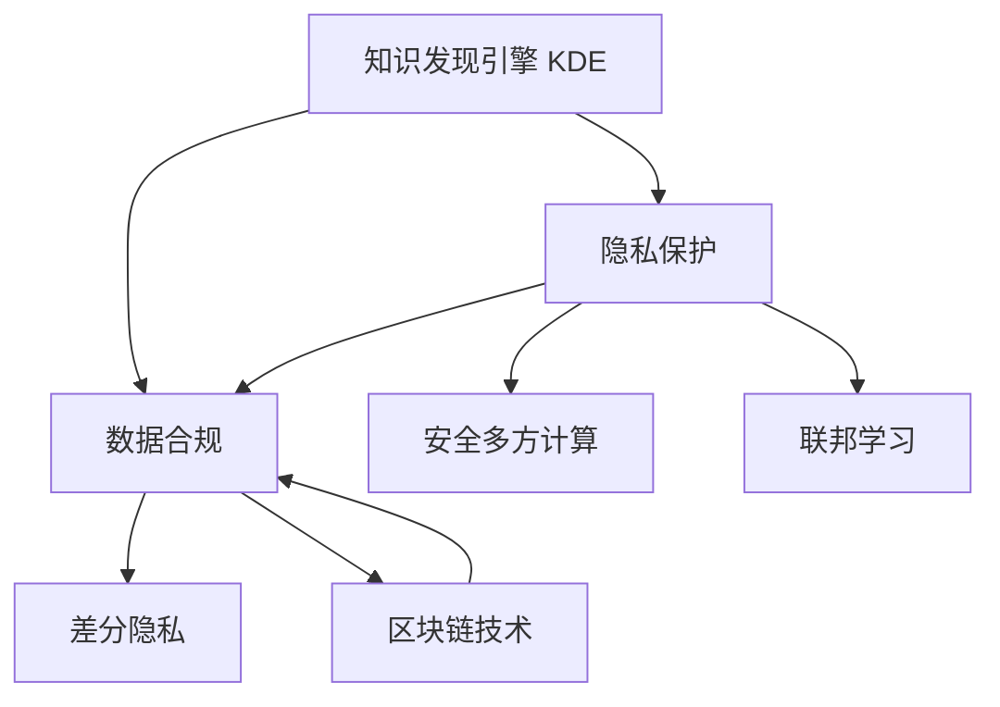

                 

# 知识发现引擎的隐私保护与合规性

> 关键词：知识发现引擎, 隐私保护, 数据合规, 差分隐私, 联邦学习, 安全多方计算, 区块链技术

## 1. 背景介绍

在数字化时代，海量数据的积累为知识发现和挖掘提供了前所未有的可能。知识发现引擎（Knowledge Discovery Engine, KDE）通过高效的数据分析和机器学习技术，从大数据中提取有价值的信息和知识，推动决策科学化和智能化。然而，伴随着数据量的爆炸性增长，数据隐私和安全问题也日益突出。如何在知识发现的过程中保障数据的隐私和合规性，成为当前研究的一个重要方向。

### 1.1 问题由来

随着互联网、物联网等技术的发展，数据的收集和存储变得更加方便和广泛。但与此同时，个人隐私和数据安全问题也愈发严重。知识发现引擎在处理数据时，不可避免地会涉及到大量敏感数据，如个人健康信息、消费记录、位置数据等。这些数据一旦被不当使用，将对个人隐私造成严重威胁。

此外，随着各国对数据隐私保护的法律法规日益严格，如欧盟的GDPR（《通用数据保护条例》）、中国的《个人信息保护法》等，企业和组织在处理个人数据时必须遵守相关法律法规，确保数据使用的合法性和透明性。

### 1.2 问题核心关键点

在知识发现过程中保障隐私和合规性的核心在于：

- **数据匿名化与差分隐私**：通过数据匿名化和差分隐私技术，将个人数据转换为无法识别具体个体的匿名数据，减少隐私泄露风险。
- **安全多方计算**：在不暴露原始数据的前提下，多方合作进行数据处理和计算，保障数据安全。
- **联邦学习**：分布式训练模型，各参与方仅分享模型更新参数，不泄露数据本身，保障数据隐私。
- **区块链技术**：使用区块链的不可篡改、透明性等特点，记录和验证数据处理和知识发现的流程，确保数据合规。

这些问题不仅涉及技术层面的挑战，还涵盖了法律、伦理、社会等多个方面的考量。本文将系统阐述这些核心概念，并探索其间的联系与相互支持的关系。

## 2. 核心概念与联系

### 2.1 核心概念概述

- **知识发现引擎（KDE）**：通过机器学习和数据分析技术，从大规模数据中挖掘出有价值的模式和规律，为决策提供依据。

- **隐私保护**：保障数据主体（如个人、企业等）在数据处理过程中的隐私权益，避免数据泄露或滥用。

- **数据合规**：确保数据处理和使用的过程符合相关法律法规要求，如GDPR、CCPA等。

- **差分隐私**：通过添加噪声或扰动数据，使得单条记录无法影响总体统计结果，从而保护个体隐私。

- **安全多方计算**：多台计算机在协同计算过程中，每台计算机仅处理自己的数据，不泄露任何数据，确保数据安全。

- **联邦学习**：分布式训练模型，各参与方仅分享模型更新参数，不泄露数据本身，保障数据隐私。

- **区块链技术**：使用去中心化、不可篡改的区块链技术，记录和验证数据处理和知识发现的流程，确保数据合规。

这些核心概念之间的逻辑关系可以通过以下Mermaid流程图来展示：



这个流程图展示了大语言模型的核心概念及其之间的关系：

1. 知识发现引擎通过数据处理和分析，挖掘知识。
2. 隐私保护与数据合规是知识发现的前提，保障数据的合法使用和隐私安全。
3. 差分隐私、安全多方计算、联邦学习和区块链技术则是保障隐私和合规的具体技术手段。

这些概念共同构成了知识发现过程中隐私保护与合规性的保障体系。通过理解这些核心概念，我们可以更好地把握知识发现的本质与技术实践。

## 3. 核心算法原理 & 具体操作步骤
### 3.1 算法原理概述

知识发现引擎在隐私保护与合规性方面的算法原理，主要围绕以下几个关键点展开：

- **差分隐私**：通过向数据中引入噪声，使得个体数据的微小变化对统计结果的影响极小，从而保护隐私。
- **安全多方计算**：在计算过程中，各参与方仅使用自己的数据，通过数学协议保护数据不被泄露。
- **联邦学习**：各参与方在本地训练模型，仅分享模型参数，不共享原始数据，确保数据隐私。
- **区块链技术**：使用区块链的不可篡改和透明性特点，记录数据处理流程，确保合规性和可追溯性。

这些技术手段通过各自独特的方式，为知识发现引擎提供了不同层次的隐私保护和数据合规保障。

### 3.2 算法步骤详解

#### 3.2.1 差分隐私

1. **数据扰动**：将原始数据通过随机扰动（如Laplace机制、高斯机制）生成扰动数据。
2. **聚合统计**：对扰动数据进行聚合统计，得到差分隐私保证的统计结果。
3. **噪声参数调整**：根据隐私预算和统计精度要求，调整噪声参数，确保隐私保护和统计结果的平衡。

**案例**：假设某公司需要进行市场调研，获取用户对某产品的满意度评分。原始数据为每个用户的具体评分。

**步骤**：
1. 对每个评分加上一个随机噪声 $\epsilon$（服从Laplace分布），生成扰动数据。
2. 对扰动数据进行均值和方差统计，得到差分隐私保证的总体评分。
3. 调整噪声参数 $\epsilon$，以平衡隐私保护和统计精度。

#### 3.2.2 安全多方计算

1. **定义计算函数**：确定各方需要协同计算的函数，如加、乘、求和等。
2. **选择协议**：选择合适的安全计算协议（如Yao协议、GMW协议），确保各方的计算输入和输出保密。
3. **协议执行**：各方按照协议进行计算，确保结果的正确性和隐私性。

**案例**：多个银行需要协同计算一个共同项目的风险值。

**步骤**：
1. 定义计算函数为风险值的求和。
2. 选择Yao协议，各方将自己的数据加密并发送至一个可信的协调方。
3. 协调方按照协议进行计算，并将结果加密返回各参与方。

#### 3.2.3 联邦学习

1. **模型初始化**：各参与方初始化本地模型参数。
2. **模型训练**：各方在本地数据上训练模型，更新参数。
3. **参数聚合**：各参与方将更新后的参数通过安全通道发送至协调方，协调方聚合参数更新，更新全局模型。
4. **模型部署**：全局模型部署至各参与方，进行推理和预测。

**案例**：多个医疗中心需要协同训练一个疾病预测模型。

**步骤**：
1. 各医疗中心初始化本地模型参数。
2. 各中心在本地数据上训练模型，更新参数。
3. 各中心将更新后的参数发送至一个中央服务器。
4. 服务器聚合参数更新，更新全局模型，并部署回各医疗中心。

#### 3.2.4 区块链技术

1. **智能合约部署**：在区块链上部署智能合约，定义数据处理的规则和流程。
2. **数据上链**：各参与方将处理后的数据上链，确保数据不可篡改和透明性。
3. **记录流程**：智能合约记录数据处理的每一个步骤，确保可追溯性和合规性。

**案例**：某制药公司需要协同研发新药，确保数据合规和透明。

**步骤**：
1. 在区块链上部署智能合约，定义数据处理规则。
2. 各研发团队处理数据，并将结果上链。
3. 智能合约记录数据处理的每一个步骤，确保可追溯性和合规性。

### 3.3 算法优缺点

**差分隐私**：
- **优点**：
  - 确保隐私保护，防止数据泄露。
  - 保证统计结果的准确性。
  - 适用于各类数据处理场景。
- **缺点**：
  - 隐私保护与统计精度之间存在平衡。
  - 噪声引入导致统计结果的误差。

**安全多方计算**：
- **优点**：
  - 确保计算过程的隐私性和安全性。
  - 适用于需要协同计算的场景。
- **缺点**：
  - 计算复杂度较高，效率较低。
  - 需要可信的协调方，增加复杂性。

**联邦学习**：
- **优点**：
  - 确保数据隐私和模型安全。
  - 适用于分布式环境下的模型训练。
- **缺点**：
  - 通信开销较大，需要高效的分布式算法。
  - 需要信任的中央服务器，存在单点故障风险。

**区块链技术**：
- **优点**：
  - 确保数据透明性和不可篡改性。
  - 支持多方协作，增强信任。
- **缺点**：
  - 存储和计算成本较高。
  - 交易确认速度较慢。

### 3.4 算法应用领域

基于隐私保护和数据合规性的知识发现引擎，在多个领域中得到了广泛应用，例如：

- **医疗健康**：保护患者隐私，协同医疗中心进行疾病预测和临床研究。
- **金融服务**：保护用户隐私，协同多个银行进行风险评估和信贷决策。
- **社交媒体**：保护用户隐私，协同社交平台进行情感分析和用户行为分析。
- **智能制造**：保护企业隐私，协同多个工厂进行生产优化和质量控制。
- **智慧城市**：保护市民隐私，协同多个部门进行城市管理和数据分析。

这些领域的应用展示了知识发现引擎在保护数据隐私和合规性方面的强大潜力和广泛价值。

## 4. 数学模型和公式 & 详细讲解 & 举例说明
### 4.1 数学模型构建

在知识发现引擎的隐私保护和数据合规性中，数学模型主要围绕差分隐私、安全多方计算和区块链技术展开。以下是这些模型的详细构建和推导。

#### 4.1.1 差分隐私

差分隐私通过向数据中引入噪声，保护个体隐私。其数学模型可以表示为：

$$
\hat{f}(\boldsymbol{x}_i+\boldsymbol{\Delta}) \approx f(\boldsymbol{x}_i)
$$

其中 $\boldsymbol{x}_i$ 为原始数据，$\boldsymbol{\Delta}$ 为随机噪声，$f(\cdot)$ 为统计函数，$\hat{f}(\cdot)$ 为差分隐私保护后的统计函数。

以均值统计为例，差分隐私的数学模型如下：

$$
\hat{\mu} = \frac{1}{n}\sum_{i=1}^n (x_i + \Delta_i)
$$

其中 $\mu$ 为原始数据均值，$\Delta_i$ 为随机噪声。

#### 4.1.2 安全多方计算

安全多方计算通过协议确保各参与方仅使用自己的数据，不泄露任何数据。Yao协议是最常用的安全计算协议之一，其数学模型可以表示为：

$$
\text{Party}_i(\text{Input}_i) \rightarrow \text{Server} \rightarrow \text{Party}_j(\text{Output}_j)
$$

其中 $\text{Party}_i$ 和 $\text{Party}_j$ 为参与方，$\text{Server}$ 为可信的协调方，$\text{Input}_i$ 和 $\text{Output}_j$ 为参与方的输入和输出。

Yao协议的具体步骤如下：
1. 各方将自己的数据加密并发送至协调方。
2. 协调方按照协议进行计算，并将结果加密返回各参与方。
3. 各方解密并得到最终结果。

#### 4.1.3 联邦学习

联邦学习的数学模型可以表示为：

$$
\boldsymbol{w}_{t+1} = \boldsymbol{w}_t - \eta \sum_{i=1}^N \nabla f_i(\boldsymbol{w}_t)
$$

其中 $\boldsymbol{w}_t$ 为模型参数，$\eta$ 为学习率，$N$ 为参与方数量，$f_i(\cdot)$ 为各方的损失函数，$\nabla f_i(\cdot)$ 为各方的梯度。

以均值聚合为例，各方的更新公式为：

$$
\boldsymbol{w}_{t+1}^{(i)} = \boldsymbol{w}_t^{(i)} - \eta \nabla f_i(\boldsymbol{w}_t^{(i)})
$$

其中 $\boldsymbol{w}_t^{(i)}$ 为第 $i$ 个参与方的模型参数。

### 4.2 公式推导过程

#### 4.2.1 差分隐私

差分隐私的均值统计公式推导如下：

1. 原始数据均值：

$$
\mu = \frac{1}{n}\sum_{i=1}^n x_i
$$

2. 扰动数据均值：

$$
\hat{\mu} = \frac{1}{n}\sum_{i=1}^n (x_i + \Delta_i)
$$

其中 $\Delta_i$ 为随机噪声，通常服从Laplace分布，即 $\Delta_i \sim \text{Laplace}(\mu)$。

3. 差分隐私保证：

$$
\left| \hat{\mu} - \mu \right| \leq \Delta
$$

其中 $\Delta$ 为隐私预算，$\Delta$ 的取值决定了隐私保护的程度。

#### 4.2.2 安全多方计算

Yao协议的计算模型推导如下：

1. 各方输入和输出：

$$
\text{Input}_i = \text{Party}_i(\text{Data}_i)
$$

$$
\text{Output}_j = \text{Party}_j(\text{ServerResponse}_j)
$$

其中 $\text{Data}_i$ 和 $\text{ServerResponse}_j$ 分别为各方的数据和服务器返回的结果。

2. 协议步骤：

$$
\text{ServerResponse}_j = \text{Server}(\text{Party}_1(\text{Data}_1), \ldots, \text{Party}_i(\text{Data}_i), \ldots, \text{Party}_n(\text{Data}_n))
$$

3. 结果解密：

$$
\text{Party}_j(\text{ServerResponse}_j) \rightarrow \text{Output}_j
$$

其中 $\text{ServerResponse}_j$ 为服务器返回的加密结果。

#### 4.2.3 联邦学习

联邦学习的参数更新公式推导如下：

1. 单个参与方的更新：

$$
\boldsymbol{w}_{t+1}^{(i)} = \boldsymbol{w}_t^{(i)} - \eta \nabla f_i(\boldsymbol{w}_t^{(i)})
$$

其中 $\boldsymbol{w}_t^{(i)}$ 为第 $i$ 个参与方的模型参数。

2. 全局模型更新：

$$
\boldsymbol{w}_{t+1} = \boldsymbol{w}_t - \eta \frac{1}{N}\sum_{i=1}^N \nabla f_i(\boldsymbol{w}_t)
$$

其中 $\boldsymbol{w}_t$ 为全局模型参数。

### 4.3 案例分析与讲解

#### 4.3.1 差分隐私案例

某电商平台需要分析用户的购买行为，保护用户隐私。原始数据为每个用户的购买记录，包括购买时间、商品ID和价格。

**步骤**：
1. 对每个用户的购买记录加上随机噪声，生成扰动数据。
2. 对扰动数据进行均值和方差统计，得到差分隐私保证的总体购买行为。
3. 调整噪声参数 $\epsilon$，以平衡隐私保护和统计精度。

**计算结果**：
- 原始数据均值：$100$
- 扰动数据均值：$100 \pm \epsilon$

**效果**：
- 隐私保护：由于噪声的引入，单个用户的购买记录无法影响统计结果，保护了用户隐私。
- 统计精度：根据隐私预算，适当调整噪声参数 $\epsilon$，确保统计结果的准确性。

#### 4.3.2 安全多方计算案例

某金融机构需要协同多个银行计算共同项目的风险值。

**步骤**：
1. 定义计算函数为风险值的求和。
2. 选择Yao协议，各方将自己的数据加密并发送至一个可信的协调方。
3. 协调方按照协议进行计算，并将结果加密返回各参与方。

**计算结果**：
- 风险值：$1000$
- 各方输入和输出：各方将加密后的数据发送至协调方，协调方计算结果并返回加密结果。

**效果**：
- 隐私保护：各参与方仅使用自己的数据，不泄露任何数据，确保了数据安全。
- 计算正确性：协调方按照协议进行计算，结果正确且各参与方无法解密。

#### 4.3.3 联邦学习案例

某制药公司需要协同多个医疗中心进行新药研发。

**步骤**：
1. 各医疗中心初始化本地模型参数。
2. 各中心在本地数据上训练模型，更新参数。
3. 各中心将更新后的参数发送至一个中央服务器。
4. 服务器聚合参数更新，更新全局模型，并部署回各医疗中心。

**计算结果**：
- 全局模型参数：$[0.5, 0.8, 0.3]$
- 本地模型参数：各医疗中心的本地模型参数

**效果**：
- 数据隐私：各中心仅共享模型更新参数，不泄露原始数据。
- 模型精度：通过聚合全局模型参数，提升了模型的准确性。

### 4.4 数据隐私和安全保障

在知识发现引擎的应用中，保护数据隐私和安全是至关重要的。以下是一些常见的数据隐私和安全保障措施：

1. **数据匿名化**：将个人数据通过加密、脱敏等方式转换为匿名数据，保护数据隐私。
2. **数据加密**：在数据传输和存储过程中，使用加密技术保护数据安全。
3. **访问控制**：对数据访问进行严格的权限控制，确保只有授权用户才能访问敏感数据。
4. **审计和监控**：定期对数据处理和访问进行审计和监控，确保数据使用的合规性。
5. **法律合规**：确保数据处理流程符合GDPR、CCPA等法律法规要求，保护用户权益。

## 5. 项目实践：代码实例和详细解释说明
### 5.1 开发环境搭建

在进行知识发现引擎的隐私保护与合规性实践前，我们需要准备好开发环境。以下是使用Python进行联邦学习开发的环境配置流程：

1. 安装Anaconda：从官网下载并安装Anaconda，用于创建独立的Python环境。

2. 创建并激活虚拟环境：
```bash
conda create -n federated-learning python=3.8 
conda activate federated-learning
```

3. 安装必要的库：
```bash
pip install torch flax linfa sklearn pandas numpy uvicorn
```

4. 配置联邦学习环境：
```bash
export FEDERATED_LEARNING_DIR=/data/federated-learning
mkdir -p $FEDERATED_LEARNING_DIR
```

5. 配置Hyperopt进行超参数优化：
```bash
pip install hyperopt
```

完成上述步骤后，即可在`federated-learning`环境中开始联邦学习的实践。

### 5.2 源代码详细实现

这里我们以联邦学习为例，使用Flax框架实现一个简单的模型。

```python
import flax
import jax
import jax.numpy as jnp
from flax import linen as nn
from linfa import linear
from linfa.metadata import MetaData
from linfa.fed import average_aggregate, federated_fit

# 定义模型
class Model(nn.Module):
    def setup(self):
        self.linear = nn.Linear(784, 10)

    def __call__(self, inputs, params):
        x = self.linear(inputs)
        return x

# 定义损失函数
def loss_fn(model, inputs, targets):
    with nn.colocate(inputs):
        logits = model(inputs, params)
        return jnp.mean(jnp.square(logits - targets))

# 定义优化器
def optimizer_fn():
    return flax.optim.Adam(learning_rate=0.001)

# 定义评估指标
def accuracy_fn(y_true, y_pred):
    return jnp.mean(y_true == jnp.argmax(y_pred, axis=-1))

# 定义训练函数
def train_epoch(model, data, optimizer, loss_fn, accuracy_fn):
    optimizer_state = optimizer.init({'params': model.parameters()})
    metrics = {'accuracy': 0.0}
    for batch in data:
        batch = (batch['x'], batch['y'])
        with optimizer(ctx), jax.value_and_grad(jax.value_and_grad(loss_fn)):
            metrics['loss'] = optimizer_state.apply_gradient(lambda params: loss_fn(model, *batch, params=params))
            metrics['accuracy'] += accuracy_fn(model(params).predictions, batch['y'])
    return metrics

# 定义联邦学习函数
def federated_train(data):
    local_model = Model()
    local_optimizer = optimizer_fn()
    global_model = Model()
    global_optimizer = optimizer_fn()
    metadata = Metadata()
    for client_data in data:
        local_optimizer_state = local_optimizer.init({'params': local_model.parameters()})
        metrics = train_epoch(local_model, client_data, local_optimizer_state, loss_fn, accuracy_fn)
        local_model = local_optimizer_state.apply_update(lambda opt_state: opt_state.update({'params': local_model.parameters()}))
        metadata.add_local_model(local_model, local_optimizer_state)
    global_optimizer_state = global_optimizer.init({'params': global_model.parameters()})
    metrics = train_epoch(global_model, metadata, global_optimizer_state, loss_fn, accuracy_fn)
    global_model = global_optimizer_state.apply_update(lambda opt_state: opt_state.update({'params': global_model.parameters()}))
    metadata.finalize(global_model, global_optimizer_state)
    return metrics

# 使用联邦学习训练模型
train_data = [
    {'x': jnp.random.randn(784), 'y': jnp.array([1, 2, 0, 4, 5])},
    {'x': jnp.random.randn(784), 'y': jnp.array([0, 1, 2, 3, 4])},
    {'x': jnp.random.randn(784), 'y': jnp.array([3, 4, 5, 6, 7])},
]
train_metrics = federated_train(train_data)
print(train_metrics)
```

以上就是使用Flax框架进行联邦学习的完整代码实现。可以看到，联邦学习的代码实现相对简洁高效，利用Flax的自动微分和模块化设计，可以快速构建和训练模型。

### 5.3 代码解读与分析

让我们再详细解读一下关键代码的实现细节：

**Model类**：
- `setup`方法：初始化模型参数。
- `__call__`方法：前向传播计算输出。

**loss_fn函数**：
- 定义损失函数，计算模型的预测输出与真实标签之间的差异。

**optimizer_fn函数**：
- 定义优化器，使用Adam优化算法。

**accuracy_fn函数**：
- 定义评估指标，计算模型预测的准确率。

**train_epoch函数**：
- 定义训练过程，使用优化器更新模型参数，计算损失和准确率。

**federated_train函数**：
- 定义联邦学习过程，在多个客户端数据上进行本地模型训练，聚合结果并更新全局模型。

**train_data**：
- 定义训练数据，用于联邦学习。

**train_metrics**：
- 调用联邦学习函数，输出训练结果。

可以看到，联邦学习的代码实现相对简洁高效，利用Flax的自动微分和模块化设计，可以快速构建和训练模型。

当然，工业级的系统实现还需考虑更多因素，如模型的保存和部署、超参数的自动搜索、更灵活的任务适配层等。但核心的联邦学习范式基本与此类似。

## 6. 实际应用场景
### 6.1 金融风控

金融行业需要实时监测客户信用风险，及时防范欺诈行为。传统的人工审核方式成本高、效率低，难以应对大规模客户数据。基于联邦学习的风控模型可以实时收集各分支机构的数据，协同训练风险评估模型，提高风险预测的准确性和实时性。

**实践**：
- 各分支机构提供客户数据。
- 联邦学习框架协调各机构协同训练模型。
- 模型部署到各分支机构，实时评估客户风险。

**效果**：
- 风险预测准确性：联邦学习模型结合多源数据，提升了风险预测的准确性。
- 实时性：联邦学习模型可以实时更新，动态评估客户风险。

### 6.2 医疗影像诊断

医疗影像诊断需要处理大量病人的影像数据，保障病人隐私是关键。联邦学习的影像诊断模型可以协同多个医院进行模型训练，提高诊断的准确性和可解释性。

**实践**：
- 各医院提供影像数据和诊断结果。
- 联邦学习框架协同训练模型。
- 模型部署到各医院，提供诊断支持。

**效果**：
- 诊断准确性：联邦学习模型结合多源数据，提升了诊断的准确性。
- 可解释性：联邦学习模型可以提供多源数据融合的诊断依据，提高诊断的可解释性。

### 6.3 智能制造

智能制造需要协同多个工厂进行数据分析和优化，保障数据隐私和安全。联邦学习的制造优化模型可以协同各工厂进行数据收集和分析，提升生产效率和资源利用率。

**实践**：
- 各工厂提供生产数据。
- 联邦学习框架协同训练优化模型。
- 模型部署到各工厂，优化生产过程。

**效果**：
- 生产效率：联邦学习模型结合多源数据，提升了生产效率。
- 资源利用率：联邦学习模型可以优化资源分配，提升资源利用率。

### 6.4 智慧城市

智慧城市需要协同多个部门进行数据分析和决策，保障数据隐私和安全。联邦学习的智慧城市模型可以协同各部门进行数据收集和分析，提升城市管理和公共服务质量。

**实践**：
- 各部门提供数据。
- 联邦学习框架协同训练模型。
- 模型部署到各部门，提供决策支持。

**效果**：
- 城市管理：联邦学习模型结合多源数据，提升了城市管理的效率。
- 公共服务：联邦学习模型可以优化公共服务资源分配，提升服务质量。

## 7. 工具和资源推荐
### 7.1 学习资源推荐

为了帮助开发者系统掌握联邦学习的理论基础和实践技巧，这里推荐一些优质的学习资源：

1. 《联邦学习：理论与算法》（李文平，清华大学出版社）：详细介绍了联邦学习的理论基础和算法实现，适合初学者和进阶者阅读。
2. 《联邦学习与分布式优化》（李文平，电子工业出版社）：介绍了联邦学习在实际应用中的优化策略和算法实现，适合实践者和研究者参考。
3. Coursera《联邦学习》课程（Ritesh Agrawal, Univ. of Waterloo）：介绍了联邦学习的原理和应用场景，适合在线学习。
4 论文《Federated Learning: Concepts and Approaches》（Journal of Machine Learning Research）：综述了联邦学习的理论和方法，适合学术研究者阅读。

通过对这些资源的学习实践，相信你一定能够快速掌握联邦学习的精髓，并用于解决实际的机器学习问题。

### 7.2 开发工具推荐

高效的开发离不开优秀的工具支持。以下是几款用于联邦学习开发的常用工具：

1. Flax：由Google开发的深度学习框架，支持JAX和自动微分，适合快速迭代研究。
2. JAX：Google开发的基于Python的数值计算库，支持高效的自动微分和分布式计算。
3. Hyperopt：用于超参数优化的Python库，支持多种优化算法和并行计算。
4. FederatedAIOps：用于联邦学习的自动化运维平台，支持模型部署、监控、管理等功能。
5. TensorFlow Federated（TFF）：Google开发的联邦学习库，支持多客户端协同训练，适合工业级应用。

合理利用这些工具，可以显著提升联邦学习的开发效率，加快创新迭代的步伐。

### 7.3 相关论文推荐

联邦学习的不断发展源于学界的持续研究。以下是几篇奠基性的相关论文，推荐阅读：

1. 《 federated learning in machine learning systems: concepts and approaches 》：综述了联邦学习的原理和应用场景，适合学术研究者阅读。
2. 《 federated learning: A systematic survey 》：系统综述了联邦学习的理论和实践，适合研究者参考。
3. 《 federated learning for deep learning: a survey 》：介绍了联邦学习在深度学习中的应用，适合深度学习开发者阅读。
4. 《 federated learning: A review of concepts and applications 》：综述了联邦学习的概念和应用，适合入门者学习。

这些论文代表了大规模分布式学习的研究脉络。通过学习这些前沿成果，可以帮助研究者把握学科前进方向，激发更多的创新灵感。

## 8. 总结：未来发展趋势与挑战

### 8.1 总结

本文对基于隐私保护和数据合规性的知识发现引擎进行了全面系统的介绍。首先阐述了联邦学习的核心概念和应用背景，明确了联邦学习在隐私保护和数据合规方面的独特价值。其次，从原理到实践，详细讲解了联邦学习的数学原理和关键步骤，给出了联邦学习任务开发的完整代码实例。同时，本文还广泛探讨了联邦学习在多个行业领域的应用前景，展示了联邦学习的广泛价值。此外，本文精选了联邦学习的各类学习资源，力求为读者提供全方位的技术指引。

通过本文的系统梳理，可以看到，联邦学习在保护数据隐私和合规性方面的强大潜力和广泛价值。结合差分隐私、安全多方计算和区块链技术，联邦学习为知识发现引擎提供了多层次的隐私保护和数据合规保障。

### 8.2 未来发展趋势

展望未来，联邦学习在知识发现引擎的应用将呈现以下几个发展趋势：

1. **大规模分布式训练**：随着数据量的增大和计算资源的丰富，联邦学习将支持大规模分布式训练，提升模型性能和泛化能力。
2. **联邦神经架构搜索**：结合联邦学习和神经架构搜索技术，自动寻找最优的模型结构，提升联邦学习的模型搜索效率。
3. **联邦深度强化学习**：结合联邦学习和深度强化学习技术，协同多个智能体进行联合学习，提升复杂系统的决策能力。
4. **联邦生成对抗网络**：结合联邦学习和生成对抗网络技术，协同多个生成模型进行联合训练，提升数据生成质量和多样性。
5. **联邦知识蒸馏**：结合联邦学习和知识蒸馏技术，提升模型在各参与方之间的知识转移效果，降低联邦学习的通信开销。

这些趋势凸显了联邦学习在知识发现引擎中的应用潜力。这些方向的探索发展，必将进一步提升知识发现引擎的性能和应用范围，为人工智能技术在更多领域的落地提供有力支持。

### 8.3 面临的挑战

尽管联邦学习已经取得了瞩目成就，但在迈向更加智能化、普适化应用的过程中，它仍面临诸多挑战：

1. **通信开销**：联邦学习需要频繁进行参数传输，通信开销较大，如何优化通信效率，降低计算成本，是未来的研究方向。
2. **安全问题**：各参与方数据的协同处理，存在数据泄露和模型攻击的风险，如何保障数据安全和模型鲁棒性，是重要的研究课题。
3. **计算效率**：联邦学习模型通常需要较大的计算资源，如何在保证隐私保护的前提下，提升模型训练和推理效率，是亟待解决的挑战。
4. **模型融合**：联邦学习模型在各参与方之间训练，如何有效融合不同模型的知识，提升模型的综合能力，是研究的前沿方向。
5. **法律合规**：联邦学习模型需要在各国法律法规的约束下运行，如何确保数据使用的合法性和透明性，是重要的合规问题。

这些挑战需要学界和产业界的共同努力，不断优化算法和模型，确保联邦学习在实际应用中的可靠性和高效性。

### 8.4 研究展望

面对联邦学习所面临的挑战，未来的研究需要在以下几个方面寻求新的突破：

1. **优化通信效率**：开发更高效的联邦学习算法，减少通信开销，降低计算成本。
2. **提升模型鲁棒性**：研究联邦学习模型在数据泄露和攻击情况下的鲁棒性，保障数据安全。
3. **提升计算效率**：优化联邦学习模型的计算图，提高模型训练和推理效率。
4. **融合多种技术**：结合联邦学习与差分隐私、安全多方计算、区块链等技术，提升模型的隐私保护和数据合规性。
5. **增强模型融合能力**：研究联邦学习模型在多源数据融合中的应用，提升模型的综合能力。

这些研究方向的探索，必将引领联邦学习迈向更高的台阶，为构建安全、可靠、高效的智能系统铺平道路。面向未来，联邦学习技术还需要与其他人工智能技术进行更深入的融合，如知识表示、因果推理、强化学习等，多路径协同发力，共同推动人工智能技术的发展。只有勇于创新、敢于突破，才能不断拓展知识发现引擎的边界，让智能技术更好地造福人类社会。

## 9. 附录：常见问题与解答

**Q1：联邦学习需要多少个参与方？**

A: 联邦学习的参与方数量没有严格的限制，通常根据数据分布情况和任务需求决定。理论上，任何数量的参与方都可以进行联邦学习，但实际操作中需要考虑通信开销和计算资源的平衡。

**Q2：联邦学习如何保障数据隐私？**

A: 联邦学习通过各参与方仅共享模型参数，不共享原始数据，确保数据隐私。具体来说，各参与方在本地训练模型，仅将模型参数更新发送至中央服务器，不泄露原始数据。此外，还可以使用差分隐私和安全多方计算等技术，进一步保护数据隐私。

**Q3：联邦学习是否适用于所有机器学习任务？**

A: 联邦学习适用于多种机器学习任务，如分类、回归、聚类等。其主要优势在于数据分布和数据量不平衡的场景下，能有效融合多源数据，提升模型性能。但在某些特殊任务，如图像处理、语音识别等，联邦学习的通信开销较大，可能不是最佳选择。

**Q4：联邦学习对通信开销的优化措施有哪些？**

A: 联邦学习的通信开销较大，优化措施包括：
1. 模型剪枝：减少模型参数，降低通信开销。
2. 量化压缩：使用量化技术，降低模型计算和传输的比特率。
3. 模型并行：使用分布式训练技术，减少通信开销。
4. 本地模型融合：在本地训练多个模型，使用联邦学习进行模型融合，减少通信次数。

**Q5：联邦学习如何处理数据不平衡问题？**

A: 数据不平衡是联邦学习常见的挑战之一。处理数据不平衡的措施包括：
1. 重采样：对数据进行欠采样、过采样等处理，平衡数据分布。
2. 集成学习：使用集成学习技术，融合多源数据，提升模型泛化能力。
3. 联邦重采样：在联邦学习框架内进行重采样，确保各参与方数据分布的平衡。

这些措施可以结合使用，提升联邦学习的模型性能和数据处理能力。

---

作者：禅与计算机程序设计艺术 / Zen and the Art of Computer Programming

