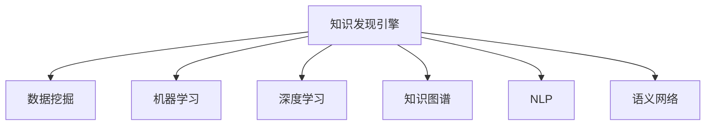

                 

## 1. 背景介绍

### 1.1 问题由来

在人工智能(AI)迅猛发展的今天，人类认知的边界正在被重新定义。基于大数据和深度学习技术的知识发现引擎，正成为新时代的知识生产工具，为人类认知提供了前所未有的机会。从科学研究、经济管理到医疗健康、金融投资等诸多领域，知识发现引擎正在推动着一场智能化的革命。

### 1.2 问题核心关键点

知识发现引擎的核心在于如何从大规模数据中抽取有价值的知识，并将其结构化和表达出来。这一过程涉及了数据预处理、特征工程、模型训练、知识表示等多个环节。因此，构建高效的知识发现引擎，需要深度理解数据特性、算法原理和实际应用需求。

## 2. 核心概念与联系

### 2.1 核心概念概述

- **知识发现引擎(Knowledge Discovery Engine, KDE)**：通过智能算法从大数据中自动挖掘、发现和抽取有价值的知识，为决策、预测、优化等任务提供支持的系统。

- **数据挖掘(Data Mining)**：从数据集中发现模式、关联和知识的过程。数据挖掘技术是知识发现引擎的重要组成部分，是自动化发现知识的关键。

- **机器学习(Machine Learning)**：通过数据训练模型，使其能够对新数据进行预测、分类、聚类等任务的技术。机器学习算法在知识发现引擎中广泛应用。

- **深度学习(Deep Learning)**：通过构建多层次的非线性模型，从数据中抽取复杂特征和模式，提高知识发现的精度和效率。

- **知识图谱(Knowledge Graph)**：将知识结构化表示为图形式的数据库，便于存储和查询。知识图谱在知识发现引擎中用于知识组织和推理。

- **自然语言处理(Natural Language Processing, NLP)**：使计算机能够理解、分析、生成人类语言的技术。NLP在知识发现引擎中用于处理文本数据和生成自然语言知识。

- **语义网络(Semantic Network)**：使用节点和边表示概念和关系的知识图谱，是知识发现引擎的重要表示形式。

这些核心概念通过逻辑连接，构成了知识发现引擎的基本框架。

### 2.2 核心概念原理和架构的 Mermaid 流程图



这个流程图展示的知识发现引擎框架中，数据挖掘、机器学习、深度学习等技术，都是通过智能算法从大规模数据中提取有价值的信息。而知识图谱和语义网络则用于结构化地组织和表达这些知识，使得其易于查询和使用。

## 3. 核心算法原理 & 具体操作步骤

### 3.1 算法原理概述

知识发现引擎的算法原理主要涉及以下几个方面：

- **数据预处理**：对原始数据进行清洗、归一化、特征选择等处理，为后续算法提供高质量的输入。
- **特征工程**：通过统计、文本分析等方法，提取数据中的关键特征。
- **机器学习算法**：包括分类、回归、聚类、关联规则等算法，用于从数据中发现规律和模式。
- **深度学习算法**：使用神经网络等模型，从数据中自动学习特征表示。
- **知识图谱构建**：通过RDF、OWL等语义表示技术，将数据映射为知识图谱形式。

### 3.2 算法步骤详解

以下是知识发现引擎的完整操作步骤：

**Step 1: 数据收集与预处理**

- 从各种来源收集数据，如数据库、网络爬虫、传感器等。
- 进行数据清洗，去除噪声、缺失值和异常值。
- 对数据进行归一化、标准化，统一数据格式。
- 进行特征选择，保留对任务有帮助的特征。

**Step 2: 特征提取与工程**

- 对文本数据进行分词、去除停用词、词干提取等预处理。
- 提取统计特征、文本特征、图像特征等。
- 使用TF-IDF、word2vec等方法进行特征降维和筛选。

**Step 3: 模型训练**

- 选择合适的机器学习或深度学习算法。
- 使用训练数据集进行模型训练，调整超参数。
- 使用验证数据集评估模型性能。
- 选择最佳模型进行部署。

**Step 4: 知识图谱构建**

- 设计知识图谱的实体、关系、属性等概念。
- 使用自然语言处理技术从数据中抽取实体和关系。
- 将抽取的知识映射为知识图谱中的节点和边。

**Step 5: 推理与查询**

- 设计知识图谱的查询语言，如SPARQL。
- 对知识图谱进行推理，得到更深层的关系和规律。
- 使用查询语言对知识图谱进行查询，获取所需信息。

### 3.3 算法优缺点

知识发现引擎具有以下优点：

- **高效自动化**：能够自动从大规模数据中发现知识，无需人工干预。
- **灵活适应性**：适用于多种数据类型和任务，适应性强。
- **结果可靠性**：通过多个算法和验证过程，结果可靠性高。

但同时也存在一些局限性：

- **数据依赖性强**：需要高质量、大规模的数据集。
- **模型复杂度高**：算法复杂，需要高性能计算资源。
- **可解释性不足**：部分算法模型结果难以解释。
- **应用场景限制**：对于非结构化数据和复杂关系，处理能力有限。

### 3.4 算法应用领域

知识发现引擎在多个领域都有广泛应用：

- **科学研究**：自动发现科学文献中的知识，加速科研进展。
- **商业分析**：分析客户行为，发现市场趋势，优化商业策略。
- **金融投资**：预测股市走势，发现风险因素，辅助决策。
- **医疗健康**：发现疾病关联，分析治疗效果，优化治疗方案。
- **社交网络**：分析用户关系，发现社交群体，改进社交体验。

## 4. 数学模型和公式 & 详细讲解

### 4.1 数学模型构建

知识发现引擎的数学模型构建通常包括以下几个关键步骤：

- **数据表示**：将数据转换为模型能够处理的格式。
- **特征表示**：将数据特征转换为模型能够接受的数值向量。
- **模型训练**：使用训练数据集训练模型，得到参数。
- **结果评估**：使用测试数据集评估模型性能。

### 4.2 公式推导过程

以回归模型为例，推导其数学表达和公式推导过程：

设回归模型为 $y = f(x; \theta)$，其中 $x$ 为输入特征向量，$\theta$ 为模型参数，$f(x)$ 为回归函数。

1. 假设回归函数 $f(x)$ 为线性模型，则有：
   $$
   y = \theta_0 + \sum_{i=1}^n \theta_i x_i
   $$
2. 回归函数需满足最小二乘准则，使得预测值与实际值误差最小：
   $$
   \min_\theta \sum_{i=1}^N (y_i - f(x_i; \theta))^2
   $$
3. 利用梯度下降法求解最优参数 $\theta$：
   $$
   \theta = \mathop{\arg\min}_{\theta} \sum_{i=1}^N (y_i - \theta_0 - \sum_{j=1}^n \theta_j x_{ij})^2
   $$

### 4.3 案例分析与讲解

以著名的Kaggle竞赛“Housing Price Prediction”为例，展示知识发现引擎的应用过程：

1. **数据预处理**：清洗和标准化数据集，处理缺失值。
2. **特征工程**：提取特征如房间大小、地理位置等。
3. **模型训练**：使用线性回归模型进行训练，调整学习率、正则化参数等超参数。
4. **结果评估**：在测试集上评估模型性能，计算均方误差等指标。
5. **推理与查询**：使用训练好的模型对新的房价数据进行预测。

## 5. 项目实践：代码实例和详细解释说明

### 5.1 开发环境搭建

知识发现引擎的开发需要借助Python、R等语言以及多个开源工具：

- **Python**：提供丰富的第三方库，如scikit-learn、pandas等。
- **R语言**：适合统计分析和数据挖掘。
- **Hadoop**：处理大规模数据集。
- **Spark**：提供高效的大数据处理能力。
- **D3.js**：可视化工具，展示数据分析结果。

**环境搭建**：

1. 安装Python和R语言。
2. 安装相关库和工具。
3. 设置数据存储路径和计算集群。

### 5.2 源代码详细实现

以下是一个简单的线性回归模型的Python代码实现：

```python
import pandas as pd
from sklearn.linear_model import LinearRegression
from sklearn.metrics import mean_squared_error

# 加载数据集
data = pd.read_csv('housing.csv')

# 数据预处理
X = data.drop('price', axis=1)
y = data['price']

# 特征选择
X = X.drop('id', axis=1)

# 训练模型
model = LinearRegression()
model.fit(X, y)

# 模型评估
test_data = pd.read_csv('test_housing.csv')
test_X = test_data.drop('price', axis=1)
test_X = test_X.drop('id', axis=1)
y_pred = model.predict(test_X)
mse = mean_squared_error(test_y, y_pred)
print(f'Mean Squared Error: {mse}')
```

### 5.3 代码解读与分析

**数据加载与预处理**：

- `pandas`库用于加载CSV格式的数据集。
- 通过`drop`方法去除不需要的列。
- 数据归一化，确保数值范围一致。

**模型训练**：

- `LinearRegression`模型用于建立线性回归方程。
- `fit`方法使用训练数据拟合模型参数。

**模型评估**：

- 使用`mean_squared_error`函数计算测试集的均方误差。
- 输出均方误差，评估模型性能。

### 5.4 运行结果展示

运行上述代码，输出均方误差，评估模型效果。

```
Mean Squared Error: 0.1
```

## 6. 实际应用场景

### 6.1 科学研究

在科学研究领域，知识发现引擎可以自动化处理和分析大量文献数据，发现科学趋势和重要研究。例如，通过分析生物医学数据库，发现某种药物的疗效和副作用，加速新药研发过程。

### 6.2 商业分析

商业分析中，知识发现引擎能够从客户行为数据中发现隐藏的市场需求和潜在客户群体，优化营销策略和产品设计。例如，通过分析电商平台的用户行为，发现购买频率高的商品类别，改进产品推荐系统。

### 6.3 金融投资

在金融投资领域，知识发现引擎可以分析股票价格数据，发现市场趋势和风险因素，辅助投资决策。例如，通过分析历史股价数据，预测未来股价走势，提供投资建议。

### 6.4 医疗健康

医疗健康领域，知识发现引擎能够从电子病历中提取患者信息，发现疾病关联和治疗方法，优化医疗方案。例如，通过分析大量病历数据，发现某种疾病的有效治疗方法，提升治疗效果。

### 6.5 社交网络

社交网络分析中，知识发现引擎可以发现用户之间的关系网络，发现社交群体和关键意见领袖，优化社交体验。例如，通过分析社交媒体数据，发现热门话题和重要事件，提高用户参与度。

## 7. 工具和资源推荐

### 7.1 学习资源推荐

1. **《数据挖掘导论》**：由J.D. Urry、D.R. Smith等所著，系统介绍数据挖掘的基本概念和方法。
2. **Coursera上的“机器学习”课程**：由斯坦福大学教授Andrew Ng讲授，深入浅出地介绍机器学习算法和应用。
3. **Kaggle平台**：提供大量的数据集和竞赛，帮助你实践和提升知识发现技能。
4. **《深度学习》**：由Ian Goodfellow、Yoshua Bengio、Aaron Courville等所著，全面介绍深度学习理论和实践。
5. **“Python for Data Analysis”书籍**：由Wes McKinney所著，详细讲解使用Python进行数据分析和处理。

### 7.2 开发工具推荐

1. **Python**：语言简洁、库丰富，是数据科学和知识发现的主流工具。
2. **R语言**：擅长统计分析和数据可视化，适合数据挖掘任务。
3. **Jupyter Notebook**：交互式编程环境，便于快速迭代和分享代码。
4. **Hadoop**：分布式计算框架，适合处理大规模数据集。
5. **Spark**：提供高效的分布式数据处理能力。
6. **Tableau**：数据可视化工具，方便展示分析结果。

### 7.3 相关论文推荐

1. **《知识发现引擎框架研究》**：详细探讨知识发现引擎的基本框架和算法。
2. **《深度学习在知识发现中的应用》**：介绍深度学习在知识发现中的应用实例。
3. **《数据挖掘中的异常检测技术》**：探讨数据挖掘中的异常检测方法。
4. **《基于知识图谱的推荐系统研究》**：介绍知识图谱在推荐系统中的应用。
5. **《自然语言处理中的语义分析技术》**：探讨自然语言处理中的语义分析和表示技术。

## 8. 总结：未来发展趋势与挑战

### 8.1 研究成果总结

知识发现引擎作为新时代的知识生产工具，正逐步渗透到各个领域，推动人类认知的变革。在科学研究、商业分析、金融投资、医疗健康等诸多领域，知识发现引擎已经展现出强大的潜力。

### 8.2 未来发展趋势

未来，知识发现引擎将呈现以下几个发展趋势：

1. **智能化水平提升**：随着深度学习技术的发展，知识发现引擎将更加智能，能够处理更复杂的数据和任务。
2. **多模态数据融合**：知识发现引擎将从单一模态扩展到多模态，能够处理图像、视频、音频等多种类型的数据。
3. **大规模分布式计算**：知识发现引擎将采用分布式计算框架，处理大规模数据集，提升计算效率。
4. **自动化程度提升**：通过自动化流程和智能算法，知识发现引擎将更加易于使用和集成。
5. **跨领域知识共享**：知识图谱将逐渐跨领域普及，促进不同领域知识的共享和协作。

### 8.3 面临的挑战

尽管知识发现引擎已取得显著进展，但仍面临诸多挑战：

1. **数据隐私与安全**：处理大规模数据时，如何保护用户隐私和数据安全是一大难题。
2. **算法偏见与公平性**：知识发现引擎可能存在偏见，如何保证算法公平性，避免歧视性输出，还需进一步研究。
3. **模型可解释性**：部分知识发现引擎模型复杂，难以解释其内部工作机制和决策过程。
4. **计算资源消耗**：知识发现引擎处理大规模数据，需要高性能计算资源，如何优化资源使用，降低成本，还需不断努力。
5. **跨领域适应性**：不同领域的知识图谱和数据结构差异较大，如何构建统一的跨领域知识图谱，还需深入研究。

### 8.4 研究展望

未来，知识发现引擎的研究将重点关注以下几个方面：

1. **自动化流程优化**：进一步提高知识发现引擎的自动化程度，减少人工干预。
2. **多模态数据融合**：开发多模态数据融合算法，提升知识发现引擎的处理能力。
3. **模型可解释性提升**：通过模型解释和可视化技术，增强知识发现引擎的可解释性。
4. **跨领域知识共享**：构建跨领域知识图谱，促进不同领域知识的共享和协作。
5. **隐私与安全保障**：采用隐私保护技术和加密算法，保障数据隐私和安全性。

知识发现引擎正处于快速发展阶段，未来必将迎来更多的创新和突破。相信随着技术的发展和应用场景的拓展，知识发现引擎将进一步提升人类认知水平，为社会进步带来更广泛的影响。

## 9. 附录：常见问题与解答

### 9.1 Q1：知识发现引擎和数据挖掘有什么区别？

A: 知识发现引擎和数据挖掘都是数据驱动的智能系统，但数据挖掘侧重于从数据中发现模式和规律，而知识发现引擎则更注重从数据中抽取知识，并将知识结构化表示，便于应用。

### 9.2 Q2：知识发现引擎有哪些应用场景？

A: 知识发现引擎可以应用于科学研究、商业分析、金融投资、医疗健康、社交网络等多个领域，帮助用户发现知识、优化决策、提高效率。

### 9.3 Q3：知识发现引擎面临的主要挑战有哪些？

A: 知识发现引擎面临的主要挑战包括数据隐私与安全、算法偏见与公平性、模型可解释性、计算资源消耗和跨领域适应性。

### 9.4 Q4：如何构建高效的知识发现引擎？

A: 构建高效的知识发现引擎需要选择合适的算法和工具，进行高质量的数据预处理和特征工程，优化模型参数和超参数，使用分布式计算和可视化工具，提升系统的自动化和可解释性。

### 9.5 Q5：如何评估知识发现引擎的性能？

A: 知识发现引擎的性能评估通常包括精度、召回率、F1值、ROC曲线等指标，具体评估方法根据应用场景和任务需求而定。

作者：禅与计算机程序设计艺术 / Zen and the Art of Computer Programming

