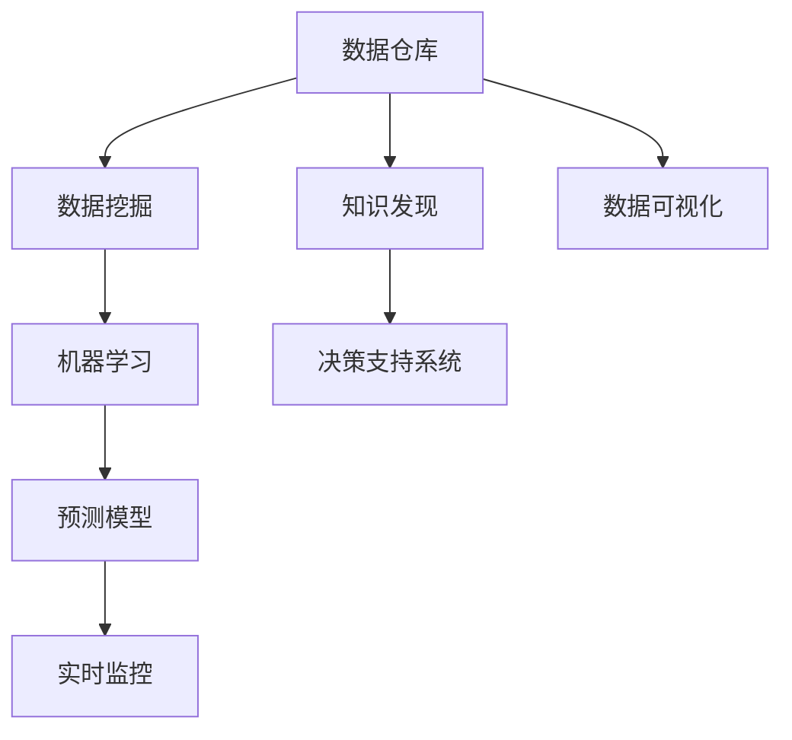

                 

# 知识发现引擎：助力企业决策的战略伙伴

> 关键词：知识发现引擎, 决策支持系统, 数据挖掘, 数据仓库, 机器学习

## 1. 背景介绍

### 1.1 问题由来

在当今瞬息万变的商业环境中，企业决策者面临着前所未有的挑战。如何从海量数据中提取有价值的信息，支持精准决策，成为了一个亟待解决的难题。传统的商业智能(Business Intelligence, BI)工具虽然能在一定程度上帮助企业洞察数据，但往往局限于历史数据的分析和报表展示，难以实现对实时数据和复杂场景的全面理解。

知识发现引擎(Knowledge Discovery Engine, KDE)应运而生，作为新一代的数据智能工具，能够利用先进的机器学习和数据挖掘技术，从多源异构数据中抽取、分析和提取知识，为企业决策提供坚实的数据支撑。相较于传统的BI工具，知识发现引擎具备更强的预测能力和解释性，能够识别数据中的隐性模式，预测未来趋势，辅助决策者制定更加科学合理的战略方案。

### 1.2 问题核心关键点

知识发现引擎的核心在于其对企业决策数据的深度挖掘和分析，通过一系列先进算法和模型，从海量数据中提取有价值的信息，并提供给决策者参考。其主要包括以下几个方面：

- 数据源的多样性和广泛性：知识发现引擎能够处理来自不同来源、格式各异的数据，包括企业内部的业务数据、外部市场数据、社交媒体数据等，为企业提供更全面的数据视角。
- 深度挖掘与分析：通过数据挖掘、机器学习等技术手段，知识发现引擎能够识别数据中的隐性模式、关联规则和复杂关系，帮助企业发现潜在问题和机会。
- 实时性：在快速变化的市场环境中，知识发现引擎能够实时监控和分析数据，及时发现并应对新的市场动态和趋势。
- 预测能力：利用先进的数据预测模型，知识发现引擎可以对未来的市场变化进行预测，为企业的长期决策提供支持。
- 可解释性：知识发现引擎不仅能提供决策建议，还能通过可视化、文本报告等方式，对模型的预测结果和推理逻辑进行详细解释，提升决策的透明性和可信度。

知识发现引擎的上述能力，使其成为现代企业决策的战略伙伴，帮助企业在数据驱动的环境下，实现业务转型升级和竞争优势。

## 2. 核心概念与联系

### 2.1 核心概念概述

为了更好地理解知识发现引擎的原理和应用，本节将介绍几个关键概念，并说明它们之间的联系：

- **数据仓库(Data Warehouse)**：集中的、统一的、标准化的数据存储环境，用于支持数据查询、分析和报告。知识发现引擎通常会构建在企业的数据仓库之上，以确保数据的完整性和可靠性。
- **数据挖掘(Data Mining)**：通过自动化或半自动化的手段，从大规模数据集中发现潜在规律和模式。数据挖掘是知识发现引擎的核心技术之一，用于从原始数据中提取有价值的信息。
- **机器学习(Machine Learning)**：利用算法和模型，让计算机系统从数据中学习规律，并进行预测或分类等任务。机器学习技术在知识发现引擎中广泛应用，用于模型的训练和优化。
- **知识发现(Knowledge Discovery)**：通过对数据进行分析和挖掘，发现有用的知识或规则。知识发现引擎的目标是实现知识发现，并帮助决策者使用这些知识进行决策。
- **决策支持系统(Decision Support System, DSS)**：利用先进的数据分析技术，提供辅助决策支持，帮助决策者制定更加科学合理的决策方案。知识发现引擎与决策支持系统紧密结合，为决策者提供数据驱动的决策建议。

这些核心概念之间的关系可以通过以下Mermaid流程图来展示：



这个流程图展示了几大核心概念之间的联系：

1. 数据仓库是知识发现的基础，为数据挖掘和机器学习提供数据支撑。
2. 数据挖掘和机器学习从数据中提取知识，构建预测模型。
3. 知识发现通过挖掘和分析，发现有用的知识或规则。
4. 决策支持系统利用知识发现的结果，提供辅助决策支持。
5. 数据可视化将分析结果进行展示，帮助决策者理解数据。
6. 实时监控通过不断更新数据，保持分析的及时性和准确性。

这些概念共同构成了知识发现引擎的基础框架，使其能够有效支持企业的决策过程。

## 3. 核心算法原理 & 具体操作步骤

### 3.1 算法原理概述

知识发现引擎的核心算法原理主要基于数据挖掘和机器学习技术，旨在从海量数据中提取有价值的信息，并进行分析和预测。其核心算法包括但不限于：

- **关联规则挖掘**：用于发现数据集中的频繁模式和关联关系，如Apriori算法、FP-growth算法等。
- **分类和回归**：用于预测和分类任务，如决策树、随机森林、支持向量机、神经网络等。
- **聚类**：用于对数据进行分组和分类，如K-means、层次聚类等。
- **异常检测**：用于识别数据中的离群点和异常值，如孤立森林、LOF等。
- **时序分析**：用于处理时间序列数据，识别趋势和周期性变化，如ARIMA、LSTM等。

### 3.2 算法步骤详解

知识发现引擎的算法步骤主要包括以下几个关键环节：

1. **数据预处理**：清洗、转换和归一化原始数据，使其适合算法处理。
2. **特征工程**：根据业务需求，选择和构造相关特征，提升模型效果。
3. **模型训练**：利用训练集数据，训练和优化机器学习模型。
4. **模型评估**：通过验证集或测试集，评估模型的性能和泛化能力。
5. **知识发现和提取**：利用训练好的模型，从数据中发现和提取有价值的知识或规则。
6. **结果呈现**：通过报告、可视化等方式，将分析结果呈现给决策者。

下面，我们将详细介绍其中的关键步骤。

### 3.3 算法优缺点

知识发现引擎在提供企业决策支持方面具有以下优点：

- **自动化的数据挖掘**：自动从海量数据中提取有价值的信息，无需人工干预，提升效率。
- **跨领域的知识整合**：能够处理不同来源、格式各异的数据，提供全面的数据视角。
- **预测和解释能力**：利用先进的数据预测模型，提供未来趋势预测和推理逻辑的解释，增强决策的科学性和可信度。
- **实时监控和分析**：能够实时监控数据变化，及时发现和应对新的市场动态。

同时，知识发现引擎也存在一些局限性：

- **对数据质量要求高**：需要高质量、完整的数据，才能得出准确的分析结果。
- **算法复杂度高**：处理大规模数据和复杂模型时，计算成本和资源消耗较大。
- **模型解释性不足**：某些复杂的机器学习模型，如深度神经网络，其决策过程难以解释，可能影响决策的透明度。
- **业务理解要求高**：需要与业务专家紧密合作，才能更好地理解业务需求，选择合适的算法和模型。

### 3.4 算法应用领域

知识发现引擎在多个领域得到了广泛应用，以下是几个典型的应用场景：

- **零售业**：通过分析销售数据、客户行为等，发现销售趋势和客户偏好，优化库存管理和营销策略。
- **金融业**：利用市场数据、交易记录等，进行风险评估和投资组合优化，提升金融产品的创新和收益。
- **制造业**：通过对生产数据、设备状态等进行分析和预测，提高生产效率和设备利用率，降低运营成本。
- **医疗保健**：利用患者数据、医疗记录等，发现疾病模式和风险因素，优化诊疗方案和治疗效果。
- **政府管理**：分析公共数据，进行社会治理、环境监测、公共安全等领域的决策支持。

此外，知识发现引擎还广泛应用于供应链管理、人力资源管理、市场营销等领域，成为企业决策支持的重要工具。

## 4. 数学模型和公式 & 详细讲解 & 举例说明

### 4.1 数学模型构建

知识发现引擎的数学模型构建涉及多个子模型，每个子模型都有其特定的数学公式和模型结构。以下是几个典型的数学模型及其构建方法：

- **分类模型**：假设分类问题为 $y \in \{0, 1\}$，输入为 $x = (x_1, x_2, ..., x_n)$，分类器模型为 $f(x; \theta)$，其中 $\theta$ 为模型参数。分类问题可以使用逻辑回归、决策树、随机森林等模型进行解决。

- **回归模型**：假设回归问题为 $y \in \mathbb{R}$，输入为 $x = (x_1, x_2, ..., x_n)$，回归模型为 $f(x; \theta)$，其中 $\theta$ 为模型参数。回归问题可以使用线性回归、岭回归、支持向量回归等模型进行解决。

- **关联规则模型**：假设交易数据为 $T = \{I_i\}_{i=1}^m$，其中 $I_i = (t_i^1, t_i^2, ..., t_i^k)$ 表示一次交易的商品集合。关联规则挖掘的任务是发现频繁项集 $S = \{I^j\}_{j=1}^J$，以及支持度 $\operatorname{supp}(I^j)$ 和置信度 $\operatorname{conf}(I^j)$。

- **聚类模型**：假设聚类问题为将数据 $X = \{x_i\}_{i=1}^N$ 分为 $K$ 个簇 $C = \{C_k\}_{k=1}^K$，聚类算法为 $A$，聚类中心为 $\mu_k = \frac{1}{|C_k|}\sum_{x_i \in C_k}x_i$。聚类问题可以使用K-means、层次聚类等算法进行解决。

### 4.2 公式推导过程

以下我们以分类模型为例，推导逻辑回归的损失函数及其梯度计算公式。

假设样本 $(x_i, y_i)$ 的分类器输出为 $\hat{y} = f(x; \theta)$，其中 $\theta$ 为模型参数。分类器的损失函数为交叉熵损失，定义如下：

$$
\ell(f(x; \theta), y) = -y\log\hat{y} - (1-y)\log(1-\hat{y})
$$

则分类模型的经验风险为：

$$
\mathcal{L}(\theta) = \frac{1}{N}\sum_{i=1}^N \ell(f(x_i; \theta), y_i)
$$

其中 $N$ 为样本数量。对模型参数 $\theta$ 求导，得到梯度公式：

$$
\nabla_{\theta}\mathcal{L}(\theta) = \frac{1}{N}\sum_{i=1}^N \nabla_{\theta}\ell(f(x_i; \theta), y_i)
$$

将交叉熵损失函数代入上述公式，得：

$$
\nabla_{\theta}\mathcal{L}(\theta) = \frac{1}{N}\sum_{i=1}^N (y_i - \hat{y}_i) \nabla_{\theta}f(x_i; \theta)
$$

其中 $\nabla_{\theta}f(x_i; \theta)$ 为分类器输出对参数 $\theta$ 的导数，可通过反向传播算法高效计算。

通过求解上述梯度公式，知识发现引擎可以不断更新模型参数 $\theta$，最小化损失函数 $\mathcal{L}(\theta)$，最终得到适应数据的分类模型。

### 4.3 案例分析与讲解

假设某零售公司需要优化其库存管理系统，通过知识发现引擎进行数据分析。

首先，将公司历史销售数据、季节性变化、促销活动等数据导入数据仓库。然后，对数据进行清洗和转换，选择与销售相关的特征，如销售额、库存量、季节因素等。

接下来，构建分类模型，利用逻辑回归算法对历史数据进行训练。训练过程中，利用交叉验证技术选择最优的特征组合和模型参数，并在验证集上评估模型性能。评估结果显示，模型在预测销售额和库存量方面表现良好。

最后，利用训练好的分类模型，对未来的销售情况进行预测，并根据预测结果调整库存策略，优化库存管理。通过实时监控销售数据和市场动态，知识发现引擎能够不断更新模型，确保库存管理的准确性和及时性。

## 5. 项目实践：代码实例和详细解释说明

### 5.1 开发环境搭建

在进行知识发现引擎的开发实践前，我们需要准备好开发环境。以下是使用Python进行Scikit-learn开发的环境配置流程：

1. 安装Anaconda：从官网下载并安装Anaconda，用于创建独立的Python环境。

2. 创建并激活虚拟环境：
```bash
conda create -n sklearn-env python=3.8 
conda activate sklearn-env
```

3. 安装Scikit-learn：使用pip命令安装Scikit-learn库，安装命令如下：
```bash
pip install scikit-learn
```

4. 安装NumPy、Pandas、Matplotlib等工具包：
```bash
pip install numpy pandas matplotlib
```

完成上述步骤后，即可在`sklearn-env`环境中开始开发实践。

### 5.2 源代码详细实现

下面以分类任务为例，给出使用Scikit-learn库对Logistic Regression模型进行知识发现引擎的PyTorch代码实现。

首先，定义分类任务的数据处理函数：

```python
from sklearn.datasets import load_iris
from sklearn.model_selection import train_test_split
from sklearn.preprocessing import StandardScaler
from sklearn.linear_model import LogisticRegression

# 加载数据集
iris = load_iris()
X = iris.data
y = iris.target

# 分割数据集
X_train, X_test, y_train, y_test = train_test_split(X, y, test_size=0.2, random_state=42)

# 数据标准化
scaler = StandardScaler()
X_train = scaler.fit_transform(X_train)
X_test = scaler.transform(X_test)

# 训练模型
model = LogisticRegression()
model.fit(X_train, y_train)

# 评估模型
score = model.score(X_test, y_test)
print(f"测试集准确率：{score:.2f}")
```

然后，定义训练和评估函数：

```python
from sklearn.metrics import accuracy_score, confusion_matrix
from sklearn.model_selection import cross_val_score

# 训练函数
def train(model, X_train, y_train):
    model.fit(X_train, y_train)
    return model

# 评估函数
def evaluate(model, X_test, y_test):
    y_pred = model.predict(X_test)
    accuracy = accuracy_score(y_test, y_pred)
    cm = confusion_matrix(y_test, y_pred)
    print(f"测试集准确率：{accuracy:.2f}")
    print(f"混淆矩阵：\n{cm}")

# 交叉验证函数
def cross_val(model, X_train, y_train):
    scores = cross_val_score(model, X_train, y_train, cv=5)
    mean_score = scores.mean()
    print(f"交叉验证平均准确率：{mean_score:.2f}")
```

最后，启动训练流程并在测试集上评估：

```python
# 训练模型
model = train(LogisticRegression())

# 在测试集上评估模型
evaluate(model, X_test, y_test)

# 交叉验证评估模型
cross_val(model, X_train, y_train)
```

以上就是使用Scikit-learn对Logistic Regression模型进行知识发现引擎的完整代码实现。可以看到，得益于Scikit-learn的强大封装，我们可以用相对简洁的代码完成模型的训练和评估。

### 5.3 代码解读与分析

让我们再详细解读一下关键代码的实现细节：

**load_iris函数**：
- 加载鸢尾花数据集，包括样本特征 $X$ 和标签 $y$。

**train_test_split函数**：
- 对数据集进行划分，生成训练集和测试集。

**StandardScaler类**：
- 对数据进行标准化，将数据缩放到均值为0，标准差为1，提升模型训练效果。

**LogisticRegression类**：
- 定义逻辑回归模型，用于分类任务。

**train函数**：
- 在训练集上训练模型，并返回训练好的模型。

**evaluate函数**：
- 在测试集上评估模型性能，计算准确率和混淆矩阵。

**cross_val函数**：
- 使用交叉验证技术评估模型性能，计算平均准确率。

通过这些代码，我们可以快速实现一个基于Logistic Regression的简单知识发现引擎，进行分类任务的数据分析和预测。

当然，工业级的系统实现还需考虑更多因素，如模型的保存和部署、超参数的自动搜索、更灵活的模型选择等。但核心的知识发现范式基本与此类似。

## 6. 实际应用场景

### 6.1 零售业

知识发现引擎在零售业的应用非常广泛，主要体现在以下几个方面：

- **销售预测**：通过对历史销售数据进行分析，预测未来的销售趋势和需求，帮助企业进行库存管理和补货决策。
- **客户细分**：通过对客户行为和购买数据进行分类，识别不同的客户群体，制定针对性的营销策略。
- **价格优化**：利用市场数据和销售数据，进行价格敏感性分析，优化定价策略。
- **供应链管理**：分析供应商数据和供应链表现，优化供应链管理和物流策略。

### 6.2 金融业

金融行业对数据的实时性和准确性要求极高，知识发现引擎在这方面的应用也尤为重要：

- **信用评估**：利用历史贷款数据和客户行为数据，构建信用评分模型，评估客户的信用风险。
- **投资分析**：通过市场数据和财务数据，构建投资组合和风险评估模型，优化投资策略。
- **欺诈检测**：分析交易数据和用户行为数据，识别潜在的欺诈行为，保障金融安全。

### 6.3 制造业

制造业企业面临大量的生产数据和设备状态数据，知识发现引擎能够帮助其进行精准的生产管理和设备维护：

- **生产优化**：通过对生产数据进行分析，优化生产流程和生产计划，提高生产效率和产品质量。
- **设备维护**：利用设备状态数据和维护记录，预测设备故障和维护需求，优化设备维护策略。
- **供应链管理**：分析供应商数据和供应链表现，优化供应链管理和物流策略。

### 6.4 未来应用展望

随着知识发现引擎技术的不断进步，其应用场景将进一步拓展，为更多行业带来数字化转型的新动力：

- **医疗保健**：利用患者数据和医疗记录，进行疾病预测和诊断，优化诊疗方案和治疗效果。
- **智慧城市**：分析公共数据，进行社会治理、环境监测、公共安全等领域的决策支持。
- **智慧农业**：通过物联网设备数据，进行农作物监测和管理，提升农业生产效率。

## 7. 工具和资源推荐
### 7.1 学习资源推荐

为了帮助开发者系统掌握知识发现引擎的理论基础和实践技巧，这里推荐一些优质的学习资源：

1. 《Python数据科学手册》：详细介绍Python在数据科学中的应用，涵盖数据清洗、数据挖掘、机器学习等内容。

2. Coursera《机器学习》课程：斯坦福大学开设的机器学习经典课程，涵盖机器学习基础、算法实现、应用案例等内容。

3. Kaggle竞赛平台：全球最大的数据科学竞赛平台，通过参与实际项目，提升数据处理和模型构建能力。

4. KDnuggets网站：涵盖数据科学、机器学习、数据挖掘等方面的内容，提供大量实战案例和资源。

5. GitHub上的开源项目：搜索和借鉴开源项目，学习知识发现引擎的实现细节和最佳实践。

通过对这些资源的学习实践，相信你一定能够快速掌握知识发现引擎的精髓，并用于解决实际的业务问题。

### 7.2 开发工具推荐

高效的开发离不开优秀的工具支持。以下是几款用于知识发现引擎开发的常用工具：

1. Python：作为数据科学和机器学习的主流语言，Python提供了丰富的库和工具，适合快速迭代研究。

2. Scikit-learn：基于Python的开源机器学习库，集成了多种常用的机器学习算法和工具。

3. Jupyter Notebook：免费的交互式笔记本工具，支持多种语言和库，适合数据处理和模型开发。

4. Weights & Biases：模型训练的实验跟踪工具，可以记录和可视化模型训练过程中的各项指标，方便对比和调优。

5. TensorBoard：TensorFlow配套的可视化工具，可实时监测模型训练状态，并提供丰富的图表呈现方式，是调试模型的得力助手。

6. Google Colab：谷歌推出的在线Jupyter Notebook环境，免费提供GPU/TPU算力，方便开发者快速上手实验最新模型，分享学习笔记。

合理利用这些工具，可以显著提升知识发现引擎的开发效率，加快创新迭代的步伐。

### 7.3 相关论文推荐

知识发现引擎的研究源于学界的持续研究。以下是几篇奠基性的相关论文，推荐阅读：

1. A Framework for Multivariate Online Learning with Adaptive Weights（阿沃塔框架）：提出一种多变量在线学习框架，用于实时更新模型参数。

2. An Introduction to Statistical Learning（统计学习简介）：经典统计学习教材，涵盖回归、分类、聚类等基本算法。

3. Mining of Association Rules in Large Databases：经典关联规则挖掘论文，介绍Apriori算法和FP-growth算法。

4. Logistic Regression：经典回归分析教材，详细介绍逻辑回归模型及其应用。

5. Datasets for various machine learning practice notebooks：Google提供的大量数据集，涵盖各种机器学习应用场景，适合实践练习。

这些论文代表了大数据挖掘和机器学习领域的研究前沿，通过学习这些前沿成果，可以帮助研究者把握学科前进方向，激发更多的创新灵感。

## 8. 总结：未来发展趋势与挑战

### 8.1 总结

本文对知识发现引擎的原理和应用进行了全面系统的介绍。首先阐述了知识发现引擎的研究背景和应用意义，明确了其在支持企业决策方面的独特价值。其次，从原理到实践，详细讲解了知识发现引擎的数学模型和关键步骤，给出了知识发现引擎的完整代码实现。同时，本文还广泛探讨了知识发现引擎在零售业、金融业、制造业等多个领域的应用前景，展示了其广泛的适用性和强大的能力。最后，本文精选了知识发现引擎的学习资源和开发工具，力求为读者提供全方位的技术指引。

通过本文的系统梳理，可以看到，知识发现引擎作为新一代的数据智能工具，已经在多个领域得到了广泛应用，为企业的决策过程提供了有力的数据支持。未来，伴随知识发现引擎技术的不断演进，其在更多领域的应用将进一步拓展，为数字化转型和智能化升级带来新的动力。

### 8.2 未来发展趋势

展望未来，知识发现引擎的发展趋势如下：

1. **自动化和智能化**：未来的知识发现引擎将更加智能化，能够自动进行数据清洗、特征选择、模型构建和评估，减少人工干预，提升效率和精度。
2. **实时性和交互性**：知识发现引擎将具备更高的实时性，能够实时监控和分析数据，支持用户进行实时查询和交互。
3. **跨领域整合**：未来的知识发现引擎将更加注重跨领域数据的整合，能够处理不同来源、格式各异的数据，提供全面的数据视角。
4. **预测能力增强**：利用先进的数据预测模型，知识发现引擎将具备更强的预测能力，能够对未来趋势进行精准预测。
5. **可解释性和透明性**：知识发现引擎将更加注重模型的可解释性和透明性，通过可视化、文本报告等方式，对模型的推理逻辑和决策过程进行详细解释。

这些趋势凸显了知识发现引擎的广阔前景，在数据驱动的环境下，知识发现引擎必将成为企业决策的重要工具。

### 8.3 面临的挑战

尽管知识发现引擎已经取得了一定的进展，但在迈向更加智能化、普适化应用的过程中，它仍面临着诸多挑战：

1. **数据质量瓶颈**：知识发现引擎需要高质量、完整的数据，才能得出准确的分析结果。对于长尾应用场景，获取高质量标注数据仍然是一个挑战。
2. **算法复杂度高**：处理大规模数据和复杂模型时，计算成本和资源消耗较大，需要高效的算法和工具支持。
3. **模型解释性不足**：某些复杂的机器学习模型，如深度神经网络，其决策过程难以解释，可能影响决策的透明度。
4. **业务理解要求高**：需要与业务专家紧密合作，才能更好地理解业务需求，选择合适的算法和模型。
5. **数据安全和隐私**：处理敏感数据时，需要确保数据安全和隐私，防止数据泄露和滥用。

这些挑战需要研究者不断探索和改进，才能进一步提升知识发现引擎的性能和应用效果。

### 8.4 研究展望

面对知识发现引擎所面临的挑战，未来的研究需要在以下几个方面寻求新的突破：

1. **无监督和半监督学习**：探索无监督和半监督学习范式，摆脱对大规模标注数据的依赖，利用自监督学习、主动学习等无监督和半监督范式，最大限度利用非结构化数据，实现更加灵活高效的分析。
2. **模型压缩和加速**：开发更加高效的数据挖掘算法和模型压缩技术，减小模型计算资源消耗，提升推理速度和实时性。
3. **跨领域知识整合**：引入更多跨领域的数据和知识，与机器学习模型进行巧妙融合，增强分析的全面性和准确性。
4. **可解释性和透明性**：开发更可解释的机器学习模型，通过因果分析和博弈论工具，增强模型的解释性和透明性。
5. **隐私保护**：在数据处理过程中，引入隐私保护技术，如差分隐私、联邦学习等，确保数据安全和隐私。

这些研究方向的探索，必将引领知识发现引擎技术迈向更高的台阶，为构建安全、可靠、可解释、可控的智能系统铺平道路。面向未来，知识发现引擎需要与其他人工智能技术进行更深入的融合，如知识图谱、因果推理、强化学习等，多路径协同发力，共同推动知识发现引擎技术的进步。只有勇于创新、敢于突破，才能不断拓展知识发现引擎的边界，让智能技术更好地造福人类社会。

## 9. 附录：常见问题与解答

**Q1：知识发现引擎与传统BI工具有何区别？**

A: 知识发现引擎与传统BI工具在功能上存在显著区别。BI工具主要侧重于数据可视化和报表展示，提供定性的分析结果，帮助企业理解数据和发现趋势。而知识发现引擎则利用机器学习和数据挖掘技术，从海量数据中提取有价值的信息，进行定量分析和预测，帮助企业制定更加科学合理的决策方案。

**Q2：知识发现引擎对数据质量的要求高吗？**

A: 是的，知识发现引擎对数据质量的要求非常高。数据缺失、错误、重复等问题都会对分析结果产生严重影响，甚至导致错误的决策。因此，在使用知识发现引擎之前，需要对数据进行全面的清洗和预处理，确保数据的完整性和可靠性。

**Q3：知识发现引擎的算法复杂度高吗？**

A: 是的，知识发现引擎在处理大规模数据和复杂模型时，计算成本和资源消耗较大。因此，需要高效的算法和工具支持，如分布式计算、模型压缩、加速训练等技术。

**Q4：知识发现引擎的模型解释性不足吗？**

A: 是的，某些复杂的机器学习模型，如深度神经网络，其决策过程难以解释，可能影响决策的透明度。因此，研究者需要开发更可解释的模型，通过可视化、文本报告等方式，对模型的推理逻辑和决策过程进行详细解释。

**Q5：知识发现引擎的应用范围广泛吗？**

A: 是的，知识发现引擎的应用范围非常广泛，涵盖了金融、零售、制造业等多个领域。企业可以结合自身的业务需求，利用知识发现引擎进行数据分析和决策支持，提升业务的智能化水平。

---

作者：禅与计算机程序设计艺术 / Zen and the Art of Computer Programming

