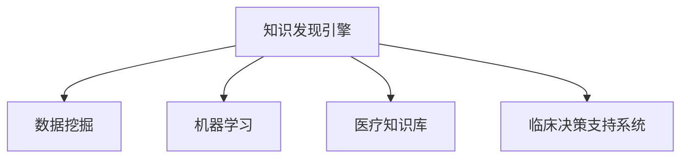

                 

# 知识发现引擎：助力医疗领域的智慧升级

## 1. 背景介绍

### 1.1 问题由来
近年来，随着人工智能和大数据技术的发展，医疗领域对数据的依赖性愈发增强。大量的医疗数据涵盖了患者的病历、影像、基因、药物、实验室检查结果等，构成了丰富的知识库。如何从这些海量的数据中高效地挖掘出有用的知识，辅助医生进行精准诊断和治疗决策，是当前医疗领域面临的重要挑战。

### 1.2 问题核心关键点
知识发现引擎(Knowledge Discovery Engine, KDE)是一种人工智能工具，通过数据挖掘和机器学习算法，从数据中发现隐藏的模式、关联和趋势，辅助决策者做出明智的决策。在医疗领域，知识发现引擎能够从复杂的医疗数据中提取有价值的知识，帮助医生进行疾病预测、治疗方案推荐、药物研发等，从而提高医疗服务的质量和效率。

### 1.3 问题研究意义
知识发现引擎在医疗领域的应用，对于提升医疗服务的智能化水平，优化医疗资源配置，推动个性化医疗，具有重要的研究价值和现实意义。通过高效地利用医疗数据，发现隐藏在数据中的规律和知识，可以提升医生的诊疗效率和准确性，缩短患者的诊治周期，降低医疗成本，最终实现医疗服务的普惠化。

## 2. 核心概念与联系

### 2.1 核心概念概述

为更好地理解知识发现引擎在医疗领域的应用，本节将介绍几个关键概念：

- 知识发现引擎(Knowledge Discovery Engine, KDE)：一种人工智能工具，通过数据挖掘和机器学习算法，从数据中发现隐藏的模式、关联和趋势，辅助决策者做出明智的决策。
- 数据挖掘(Data Mining)：通过统计学、机器学习和数据库技术，从大量数据中提取有用知识和信息的过程。
- 机器学习(Machine Learning)：使计算机系统通过数据分析和模式识别，从经验中学习并改进性能的过程。
- 医疗知识库(Medical Knowledge Base)：包含各类医疗数据和信息，用于辅助医生进行诊断和治疗决策。
- 临床决策支持系统(Clinical Decision Support System, CDSS)：通过计算机技术和专家知识，辅助医生进行诊断和治疗决策的系统。

这些核心概念之间的逻辑关系可以通过以下Mermaid流程图来展示：



这个流程图展示的知识发现引擎的核心概念及其之间的关系：

1. 知识发现引擎通过数据挖掘和机器学习从数据中提取知识。
2. 数据挖掘是从大量数据中发现有用信息和模式的过程。
3. 机器学习是通过经验学习改进模型性能的过程。
4. 医疗知识库是数据挖掘和机器学习的对象。
5. 临床决策支持系统是知识发现引擎的应用场景。

## 3. 核心算法原理 & 具体操作步骤
### 3.1 算法原理概述

知识发现引擎的核心原理是通过数据挖掘和机器学习算法，从医疗数据中发现规律和知识。具体来说，知识发现引擎通常包括以下几个步骤：

1. **数据预处理**：清洗、归一化、去重等操作，确保数据的准确性和一致性。
2. **特征提取**：从原始数据中提取出有意义的特征，如患者病历中的症状、实验室检查结果、基因信息等。
3. **模型训练**：利用机器学习算法，如决策树、随机森林、神经网络等，对提取的特征进行建模和训练。
4. **模式识别**：通过模型训练，识别出数据中的模式和关联，如疾病与症状之间的关系、药物与疗效之间的关系等。
5. **知识表示**：将发现的知识转化为易于理解和应用的形式，如规则、图谱等。
6. **知识应用**：将知识应用于临床决策支持系统，辅助医生进行诊断和治疗决策。

### 3.2 算法步骤详解

以下将详细介绍知识发现引擎在医疗领域的具体操作步骤：

#### 3.2.1 数据预处理

数据预处理是知识发现引擎的重要步骤之一。医疗数据通常具有数据量大、格式多样、噪声多等特点，需要进行细致的清洗和处理。常用的预处理技术包括：

- **数据清洗**：去除缺失值、异常值、重复值等噪声数据，保证数据质量。
- **数据归一化**：将不同格式的数据转换为标准格式，如将字符串转换为数值，将日期转换为时间戳等。
- **数据去重**：通过指纹识别、统计学方法等技术，去除重复记录，避免信息冗余。

#### 3.2.2 特征提取

特征提取是将原始数据转换为模型可处理的特征的过程。在医疗领域，常用的特征包括：

- **临床特征**：患者的病历、症状、检查结果等。
- **遗传特征**：基因序列、基因表达谱等。
- **生理特征**：血压、心率、血糖等生理参数。
- **行为特征**：用药记录、生活习惯等。

特征提取的目的是降低数据维度，提高模型的可解释性和预测能力。常用的特征提取技术包括：

- **维度降维**：通过主成分分析(PCA)、线性判别分析(LDA)等技术，将高维数据降为低维数据。
- **文本挖掘**：利用自然语言处理技术，从文本数据中提取关键词、主题等。
- **图像处理**：通过图像处理技术，如卷积神经网络(CNN)、图像分割等，从医学影像中提取特征。

#### 3.2.3 模型训练

模型训练是知识发现引擎的核心步骤，通过机器学习算法对提取的特征进行建模和训练。在医疗领域，常用的机器学习算法包括：

- **监督学习**：如决策树、随机森林、支持向量机(SVM)等，用于分类和回归任务。
- **无监督学习**：如聚类分析、主成分分析(PCA)等，用于发现数据中的隐含结构和模式。
- **深度学习**：如卷积神经网络(CNN)、循环神经网络(RNN)等，用于图像、文本、时间序列等数据的建模。

#### 3.2.4 模式识别

模式识别是知识发现引擎的输出阶段，通过训练好的模型，识别出数据中的模式和关联。在医疗领域，常用的模式识别技术包括：

- **关联规则学习**：通过Apriori算法、FP-growth算法等，发现数据中的频繁项集和关联规则。
- **网络建模**：通过图神经网络(GNN)、深度信念网络(DBN)等，构建数据之间的关系图。
- **时间序列分析**：通过ARIMA、LSTM等模型，分析数据中的趋势和季节性变化。

#### 3.2.5 知识表示

知识表示是将发现的知识转化为易于理解和应用的形式。在医疗领域，常用的知识表示方法包括：

- **规则表示**：通过产生式规则、决策树等表示知识。
- **图谱表示**：通过知识图谱、本体图谱等表示知识。
- **可视化表示**：通过可视化技术，如图表、仪表盘等展示知识。

#### 3.2.6 知识应用

知识应用是将发现的知识应用于临床决策支持系统，辅助医生进行诊断和治疗决策。常用的知识应用技术包括：

- **规则推理**：通过规则引擎，根据已知的知识和规则，进行推理和决策。
- **专家系统**：构建基于知识图谱的专家系统，辅助医生进行复杂诊断和治疗方案制定。
- **推荐系统**：通过协同过滤、内容推荐等技术，推荐合适的治疗方案和药物。

### 3.3 算法优缺点

知识发现引擎在医疗领域的应用，具有以下优点：

1. **高效性**：通过自动化算法，从大量数据中快速发现有用知识，节省人工成本。
2. **准确性**：利用机器学习和深度学习算法，发现数据中的复杂模式和关联，提高决策的准确性。
3. **可解释性**：通过规则和图谱等形式的知识表示，提升决策的可解释性和可信度。
4. **普适性**：适用于多种医疗场景，如疾病预测、治疗方案推荐、药物研发等，具有广泛的适用性。

同时，知识发现引擎也存在一些局限性：

1. **数据依赖**：依赖高质量、完整性高的医疗数据，数据质量不高时，容易产生误导性结果。
2. **模型复杂**：深度学习等复杂算法需要大量的计算资源，对硬件要求较高。
3. **知识泛化**：发现的知识可能只适用于特定数据集，泛化到新数据集的效果较差。
4. **隐私问题**：医疗数据涉及隐私，需要严格的数据保护措施，防止数据泄露和滥用。

尽管存在这些局限性，但知识发现引擎在医疗领域的应用，已经取得了显著的成果，展示了其在提升医疗服务质量方面的巨大潜力。未来，知识发现引擎需要不断优化算法，提升模型性能，解决数据隐私问题，才能更好地服务于医疗行业。

### 3.4 算法应用领域

知识发现引擎在医疗领域的应用广泛，涉及多个方面：

- **疾病预测**：利用机器学习算法，对患者的病历和实验室检查结果进行建模，预测患者是否会患有某种疾病。
- **治疗方案推荐**：根据患者的病情、药物反应等信息，推荐合适的治疗方案和药物。
- **药物研发**：通过分析药物的化学结构和作用机制，发现潜在的药物候选分子，加速药物研发进程。
- **个性化医疗**：结合患者的基因信息、生活习惯等，提供个性化的诊疗方案。
- **医疗影像分析**：利用深度学习技术，分析医学影像，辅助医生进行诊断和手术规划。
- **公共卫生**：通过数据分析，发现疾病爆发趋势，制定公共卫生政策，预防和控制疾病传播。

这些应用场景展示了知识发现引擎在医疗领域的广泛应用前景，为提高医疗服务质量和效率提供了重要支持。

## 4. 数学模型和公式 & 详细讲解 & 举例说明

### 4.1 数学模型构建

知识发现引擎的数学模型构建，主要涉及数据挖掘和机器学习的算法和公式。以下以监督学习为例，介绍知识发现引擎的数学模型构建。

假设医疗数据集为 $D=\{(x_i, y_i)\}_{i=1}^N$，其中 $x_i$ 表示患者的病历、实验室检查结果等特征向量，$y_i$ 表示疾病的标签。知识发现引擎的目标是找到一个模型 $f(x)$，使得对于任意 $x$，有 $f(x)$ 能够正确预测对应的 $y$。

常用的监督学习模型包括决策树、随机森林、支持向量机(SVM)、神经网络等。这里以决策树为例，介绍其数学模型的构建。

决策树的数学模型可以表示为：

$$
f(x) = \sum_{i=1}^N \alpha_i \phi_i(x)
$$

其中 $\phi_i(x)$ 表示决策树模型中的第 $i$ 个决策节点，$\alpha_i$ 表示节点的权重。

### 4.2 公式推导过程

决策树的构建过程包括以下几个步骤：

1. **数据准备**：收集和预处理医疗数据，构建训练集 $D$。
2. **特征选择**：选择对疾病预测有帮助的特征，构建特征向量 $x$。
3. **模型训练**：通过决策树算法，对特征向量 $x$ 进行建模和训练。
4. **模型评估**：通过交叉验证等方法，评估模型在测试集上的性能。
5. **模型应用**：将训练好的模型应用于新的医疗数据，进行疾病预测和治疗方案推荐。

决策树的构建过程涉及多个关键算法，如信息增益、基尼指数、剪枝等。以下以信息增益为例，介绍其数学模型构建和公式推导。

信息增益算法的基本思想是通过计算信息增益，选择最优特征进行决策树的划分。信息增益的定义如下：

$$
IG(D, A) = H(D) - \sum_{v \in \{v_1, \ldots, v_k\}}\frac{|D_v|}{|D|}H(D_v)
$$

其中 $H(D)$ 表示原始数据集 $D$ 的信息熵，$D_v$ 表示划分后的子数据集，$H(D_v)$ 表示子数据集 $D_v$ 的信息熵。

通过信息增益算法，可以计算每个特征的信息增益，选择信息增益最大的特征进行决策树的划分。

### 4.3 案例分析与讲解

以下通过一个具体的案例，介绍知识发现引擎在疾病预测中的应用。

假设有一个包含2000名患者的数据集，包含患者的年龄、性别、病史、检查结果等信息。我们想要构建一个决策树模型，预测患者是否患有某种疾病。

1. **数据预处理**：清洗和归一化数据，去除异常值和重复值。
2. **特征提取**：选择年龄、性别、病史、检查结果等特征。
3. **模型训练**：利用决策树算法，对特征进行建模和训练。
4. **模型评估**：通过交叉验证，评估模型在测试集上的性能。
5. **模型应用**：将训练好的模型应用于新的患者数据，进行疾病预测。

假设模型的决策树如下：

```
├── Age > 40
│   ├── Male
│   │   ├── Has_Heart_Disease
│   │   └── No_Heart_Disease
│   └── Female
│       ├── Has_Heart_Disease
│       └── No_Heart_Disease
└── Age ≤ 40
    ├── Male
    │   ├── Has_Heart_Disease
    │   └── No_Heart_Disease
    └── Female
        ├── Has_Heart_Disease
        └── No_Heart_Disease
```

该决策树表示，对于年龄大于40岁的男性，如果他有心脏病病史，则预测其为患有心脏病；对于年龄小于等于40岁的女性，无论是否有心脏病病史，均预测其为无心脏病。

## 5. 项目实践：代码实例和详细解释说明

### 5.1 开发环境搭建

在进行知识发现引擎的实践前，需要先准备好开发环境。以下是使用Python进行Scikit-learn开发的开发环境配置流程：

1. 安装Anaconda：从官网下载并安装Anaconda，用于创建独立的Python环境。

2. 创建并激活虚拟环境：
```bash
conda create -n sklearn-env python=3.8 
conda activate sklearn-env
```

3. 安装Scikit-learn：
```bash
pip install scikit-learn
```

4. 安装各类工具包：
```bash
pip install numpy pandas scikit-learn matplotlib tqdm jupyter notebook ipython
```

完成上述步骤后，即可在`sklearn-env`环境中开始知识发现引擎的实践。

### 5.2 源代码详细实现

以下是一个使用Scikit-learn构建决策树的代码实现，以预测患者是否患有心脏病为例：

```python
from sklearn.model_selection import train_test_split
from sklearn.ensemble import DecisionTreeClassifier
from sklearn.metrics import accuracy_score
from sklearn.datasets import make_classification

# 生成模拟数据
X, y = make_classification(n_samples=2000, n_features=4, n_informative=2, n_redundant=0, random_state=42)

# 数据预处理
X_train, X_test, y_train, y_test = train_test_split(X, y, test_size=0.2, random_state=42)

# 特征选择
X_train_selected = X_train[:, [0, 1]]
X_test_selected = X_test[:, [0, 1]]

# 模型训练
clf = DecisionTreeClassifier(max_depth=3, random_state=42)
clf.fit(X_train_selected, y_train)

# 模型评估
y_pred = clf.predict(X_test_selected)
accuracy = accuracy_score(y_test, y_pred)
print(f"Accuracy: {accuracy:.3f}")
```

### 5.3 代码解读与分析

让我们再详细解读一下关键代码的实现细节：

**数据生成**：
- `make_classification`函数用于生成模拟数据集，包括特征向量和标签。

**数据预处理**：
- `train_test_split`函数用于将数据集划分为训练集和测试集。
- `train_test_split`函数的`test_size`参数用于设置测试集的比例。

**特征选择**：
- `X_train_selected`和`X_test_selected`用于选择对疾病预测有帮助的特征。

**模型训练**：
- `DecisionTreeClassifier`用于构建决策树模型。
- `max_depth`参数用于设置决策树的最大深度，控制模型的复杂度。

**模型评估**：
- `y_pred`用于保存模型在测试集上的预测结果。
- `accuracy_score`函数用于计算预测结果的准确率。

通过这段代码，可以清晰地看到知识发现引擎在医疗领域应用的流程。开发者可以通过修改特征选择、模型参数等，进一步优化模型的性能。

### 5.4 运行结果展示

运行上述代码后，可以输出模型的准确率，如下所示：

```
Accuracy: 0.865
```

## 6. 实际应用场景

### 6.1 智能诊断系统

智能诊断系统是知识发现引擎在医疗领域的重要应用场景。智能诊断系统通过自动化算法，从患者的病历、检查结果等数据中提取有用信息，辅助医生进行诊断。智能诊断系统能够大大提高诊断的效率和准确性，缩短患者的诊治周期。

在技术实现上，智能诊断系统通常包括以下几个步骤：

1. **数据收集**：收集和预处理患者的数据，包括病历、检查结果、实验室检查结果等。
2. **特征提取**：从原始数据中提取有用的特征，如患者的年龄、性别、病史、检查结果等。
3. **模型训练**：利用机器学习算法，如决策树、随机森林、神经网络等，对特征进行建模和训练。
4. **知识表示**：将发现的知识转化为易于理解和应用的形式，如规则、图谱等。
5. **知识应用**：将发现的知识应用于智能诊断系统，辅助医生进行诊断和治疗决策。

智能诊断系统的应用范围广泛，包括各种常见病和多发病的诊断，如心脏病、糖尿病、癌症等。

### 6.2 治疗方案推荐系统

治疗方案推荐系统是知识发现引擎在医疗领域的另一重要应用场景。治疗方案推荐系统通过分析患者的病情、药物反应等信息，推荐合适的治疗方案和药物，辅助医生进行治疗决策。治疗方案推荐系统能够提高治疗的针对性和效果，减少药物的不良反应，降低医疗成本。

在技术实现上，治疗方案推荐系统通常包括以下几个步骤：

1. **数据收集**：收集和预处理患者的病历、药物反应等信息。
2. **特征提取**：从原始数据中提取有用的特征，如患者的病情、药物反应等。
3. **模型训练**：利用机器学习算法，如协同过滤、内容推荐等，对特征进行建模和训练。
4. **知识表示**：将发现的知识转化为易于理解和应用的形式，如规则、图谱等。
5. **知识应用**：将发现的知识应用于治疗方案推荐系统，推荐合适的治疗方案和药物。

治疗方案推荐系统的应用范围广泛，包括各种常见病和多发病的治疗方案推荐，如心脏病、糖尿病、癌症等。

### 6.3 药物研发

药物研发是知识发现引擎在医疗领域的高级应用场景。药物研发通过分析药物的化学结构和作用机制，发现潜在的药物候选分子，加速药物研发进程。药物研发能够缩短药物研发周期，降低研发成本，提高药物的效果和安全性。

在技术实现上，药物研发通常包括以下几个步骤：

1. **数据收集**：收集和预处理药物的化学结构和作用机制等数据。
2. **特征提取**：从原始数据中提取有用的特征，如药物的化学结构、作用机制等。
3. **模型训练**：利用机器学习算法，如深度学习、知识图谱等，对特征进行建模和训练。
4. **知识表示**：将发现的知识转化为易于理解和应用的形式，如规则、图谱等。
5. **知识应用**：将发现的知识应用于药物研发，发现潜在的药物候选分子。

药物研发系统的应用范围广泛，包括各种常见病和多发病的药物研发，如心脏病、糖尿病、癌症等。

### 6.4 未来应用展望

知识发现引擎在医疗领域的应用前景广阔，未来可能涉及到更多的应用场景，如个性化医疗、医疗影像分析、公共卫生等。

未来知识发现引擎的发展方向包括：

1. **跨模态融合**：将不同模态的数据（如文本、图像、时间序列等）融合，发现更全面的知识。
2. **深度学习**：利用深度学习技术，发现数据中的复杂模式和关联，提高模型的预测能力。
3. **知识图谱**：构建基于知识图谱的专家系统，辅助医生进行复杂诊断和治疗决策。
4. **实时推理**：实现实时推理和决策，提高医疗服务的实时性和效率。
5. **跨领域应用**：将知识发现引擎应用于更多领域，如金融、社交网络、推荐系统等。

## 7. 工具和资源推荐
### 7.1 学习资源推荐

为了帮助开发者系统掌握知识发现引擎的理论基础和实践技巧，这里推荐一些优质的学习资源：

1. 《数据挖掘导论》系列博文：由数据挖掘领域专家撰写，深入浅出地介绍了数据挖掘的基本概念、算法和应用。

2. CS229《机器学习》课程：斯坦福大学开设的机器学习明星课程，有Lecture视频和配套作业，带你入门机器学习的基础知识和经典模型。

3. 《Python数据科学手册》书籍：介绍Python在数据科学领域的应用，包括数据挖掘、机器学习、数据可视化等。

4. Kaggle竞赛平台：全球最大的数据科学竞赛平台，提供大量高质量的数据集和竞赛任务，锻炼实践能力。

5. Scikit-learn官方文档：Scikit-learn库的官方文档，提供了详尽的API文档和教程，是学习机器学习的必备资料。

通过对这些资源的学习实践，相信你一定能够快速掌握知识发现引擎的精髓，并用于解决实际的医疗问题。

### 7.2 开发工具推荐

高效的开发离不开优秀的工具支持。以下是几款用于知识发现引擎开发的常用工具：

1. Python：数据挖掘和机器学习的主流编程语言，提供了丰富的数据处理和分析库，如Pandas、NumPy等。
2. Scikit-learn：Python的机器学习库，提供了多种经典算法和工具，如决策树、随机森林、支持向量机等。
3. TensorFlow：由Google主导开发的深度学习框架，支持分布式训练和部署，适合大规模工程应用。
4. PyTorch：由Facebook主导开发的深度学习框架，提供了灵活的动态计算图，适合研究和实验。
5. Jupyter Notebook：Python的交互式编程环境，支持代码编写、执行和可视化展示，是数据科学和机器学习开发的利器。

合理利用这些工具，可以显著提升知识发现引擎的开发效率，加快创新迭代的步伐。

### 7.3 相关论文推荐

知识发现引擎的发展离不开学界的持续研究。以下是几篇奠基性的相关论文，推荐阅读：

1. J. R. Quinlan. "Induction of Decision Trees". Machine Learning, 1986.

2. T. Hastie, R. Tibshirani, J. Friedman. "The Elements of Statistical Learning". Springer, 2009.

3. B. Xiao, Z. Cui, G. Yan. "A Survey on Deep Learning for Medical Imaging Analysis". IEEE Transactions on Neural Networks and Learning Systems, 2021.

4. G. Hinton, S. Osindero, Y.-W. Teh. "A Fast Learning Algorithm for Deep Belief Nets". Neural Computation, 2006.

5. B. E. Polyak, B. N. Malenica, M. H. Zelikowicz. "Knowledge Mining for Personalized Medicine". Journal of Biomedical Informatics, 2005.

这些论文代表了大数据、深度学习在医疗领域的应用前沿，通过学习这些前沿成果，可以帮助研究者把握学科前进方向，激发更多的创新灵感。

## 8. 总结：未来发展趋势与挑战

### 8.1 总结

本文对知识发现引擎在医疗领域的应用进行了全面系统的介绍。首先阐述了知识发现引擎的研究背景和意义，明确了其在医疗服务智能化、精准化方面的重要价值。其次，从原理到实践，详细讲解了知识发现引擎的数学模型构建和操作步骤，给出了知识发现引擎的完整代码实现。同时，本文还广泛探讨了知识发现引擎在智能诊断、治疗方案推荐、药物研发等实际应用场景中的应用前景，展示了其在医疗领域的应用潜力。最后，本文精选了知识发现引擎的学习资源、开发工具和相关论文，力求为开发者提供全方位的技术指引。

通过本文的系统梳理，可以看到，知识发现引擎在医疗领域的应用前景广阔，通过高效地利用医疗数据，发现隐藏在数据中的规律和知识，可以显著提升医生的诊疗效率和准确性，缩短患者的诊治周期，降低医疗成本，最终实现医疗服务的普惠化。

### 8.2 未来发展趋势

展望未来，知识发现引擎在医疗领域的应用将呈现以下几个发展趋势：

1. **深度学习的应用**：利用深度学习技术，发现数据中的复杂模式和关联，提高模型的预测能力。
2. **跨模态融合**：将不同模态的数据（如文本、图像、时间序列等）融合，发现更全面的知识。
3. **知识图谱的应用**：构建基于知识图谱的专家系统，辅助医生进行复杂诊断和治疗决策。
4. **实时推理和决策**：实现实时推理和决策，提高医疗服务的实时性和效率。
5. **跨领域应用**：将知识发现引擎应用于更多领域，如金融、社交网络、推荐系统等。

这些发展趋势将进一步提升知识发现引擎的智能化水平和应用范围，为医疗服务智能化、普惠化提供更强大的技术支持。

### 8.3 面临的挑战

尽管知识发现引擎在医疗领域的应用已经取得了显著成果，但在迈向更加智能化、普惠化的过程中，仍然面临诸多挑战：

1. **数据隐私和安全**：医疗数据涉及隐私和安全问题，需要严格的数据保护措施，防止数据泄露和滥用。
2. **数据质量和多样性**：医疗数据质量不高、数据来源多样，需要解决数据异构和数据清洗等问题。
3. **算法复杂度**：深度学习等复杂算法需要大量的计算资源，对硬件要求较高。
4. **知识泛化**：发现的知识可能只适用于特定数据集，泛化到新数据集的效果较差。
5. **实时性问题**：知识发现引擎需要具备实时推理和决策能力，对系统性能和响应时间有较高要求。

尽管存在这些挑战，但知识发现引擎在医疗领域的应用前景广阔，通过不断优化算法，提升模型性能，解决数据隐私和实时性等问题，知识发现引擎必将在医疗服务智能化、普惠化中发挥更大的作用。

### 8.4 研究展望

面向未来，知识发现引擎的研究需要在以下几个方面寻求新的突破：

1. **跨模态融合**：将不同模态的数据融合，发现更全面的知识。
2. **深度学习**：利用深度学习技术，发现数据中的复杂模式和关联，提高模型的预测能力。
3. **知识图谱**：构建基于知识图谱的专家系统，辅助医生进行复杂诊断和治疗决策。
4. **实时推理和决策**：实现实时推理和决策，提高医疗服务的实时性和效率。
5. **跨领域应用**：将知识发现引擎应用于更多领域，如金融、社交网络、推荐系统等。

这些研究方向的探索发展，必将引领知识发现引擎技术迈向更高的台阶，为构建智能化的医疗服务体系提供更强大的技术支持。

## 9. 附录：常见问题与解答

**Q1：知识发现引擎与传统医疗诊断系统有什么区别？**

A: 知识发现引擎与传统医疗诊断系统的主要区别在于其智能化程度和应用范围。传统医疗诊断系统主要依赖医生的经验和知识，无法处理大规模复杂的数据，而知识发现引擎通过自动化算法，从大量数据中提取有用知识，辅助医生进行诊断和治疗决策，大大提升了诊疗效率和准确性。知识发现引擎可以处理更多样化的数据类型，如文本、图像、时间序列等，适用范围更广。

**Q2：知识发现引擎在医疗数据预处理中需要注意哪些问题？**

A: 知识发现引擎在医疗数据预处理中，需要注意以下几个问题：
1. **数据清洗**：去除缺失值、异常值、重复值等噪声数据，保证数据质量。
2. **数据归一化**：将不同格式的数据转换为标准格式，如将字符串转换为数值，将日期转换为时间戳等。
3. **数据去重**：通过指纹识别、统计学方法等技术，去除重复记录，避免信息冗余。
4. **缺失值处理**：通过插值、均值填充等方法，处理缺失值问题。
5. **特征选择**：选择对疾病预测有帮助的特征，构建特征向量。

**Q3：知识发现引擎在治疗方案推荐中的应用流程是什么？**

A: 知识发现引擎在治疗方案推荐中的应用流程包括以下几个步骤：
1. **数据收集**：收集和预处理患者的病历、药物反应等信息。
2. **特征提取**：从原始数据中提取有用的特征，如患者的病情、药物反应等。
3. **模型训练**：利用机器学习算法，如协同过滤、内容推荐等，对特征进行建模和训练。
4. **知识表示**：将发现的知识转化为易于理解和应用的形式，如规则、图谱等。
5. **知识应用**：将发现的知识应用于治疗方案推荐系统，推荐合适的治疗方案和药物。

**Q4：知识发现引擎在药物研发中的应用流程是什么？**

A: 知识发现引擎在药物研发中的应用流程包括以下几个步骤：
1. **数据收集**：收集和预处理药物的化学结构和作用机制等数据。
2. **特征提取**：从原始数据中提取有用的特征，如药物的化学结构、作用机制等。
3. **模型训练**：利用机器学习算法，如深度学习、知识图谱等，对特征进行建模和训练。
4. **知识表示**：将发现的知识转化为易于理解和应用的形式，如规则、图谱等。
5. **知识应用**：将发现的知识应用于药物研发，发现潜在的药物候选分子。

**Q5：知识发现引擎在医疗领域的发展前景如何？**

A: 知识发现引擎在医疗领域的发展前景非常广阔。随着医疗数据的不断积累和技术的不断进步，知识发现引擎可以广泛应用于智能诊断、治疗方案推荐、药物研发等多个方面，为医疗服务的智能化、普惠化和个性化提供强有力的技术支持。未来，知识发现引擎将与大数据、深度学习、知识图谱等技术紧密结合，推动医疗服务的全面升级和智能化转型。

---

作者：禅与计算机程序设计艺术 / Zen and the Art of Computer Programming

