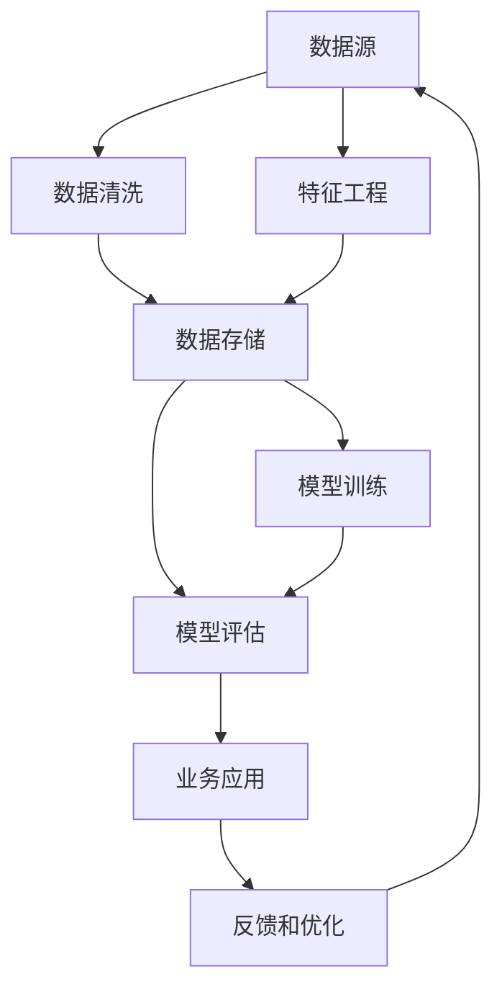

                 

# 知识发现引擎：推动金融行业的创新引擎

## 1. 背景介绍

### 1.1 问题由来

金融行业是一个高度依赖于数据分析和决策支持的行业。过去几十年，传统的金融风险管理、投资策略、客户服务等领域均依赖于大量的数据处理和模型分析。然而，随着金融数据量的爆炸式增长，金融机构面临以下挑战：

- **数据量庞大且增长迅速**：金融行业的数据量呈指数级增长，每日产生的交易数据、市场数据、社交媒体数据等数量巨大。
- **数据类型多样且分布复杂**：金融数据不仅包括数值型数据，还包括文本、图像、音频等多样化类型的数据。
- **数据质量参差不齐**：金融数据的真实性、准确性和完整性难以保证，存在大量噪声和缺失值。
- **实时性要求高**：金融决策需要在极短的时间内完成，对数据的处理速度和实时性有高要求。

在这样的背景下，传统的统计分析和手工规则编写方法无法满足现代金融行业的需求。大数据和人工智能技术的兴起，为金融行业提供了新的解决思路。金融行业亟需一种新的知识发现工具，能够高效、准确地从海量数据中提取出有用的信息，驱动业务决策和创新。

### 1.2 问题核心关键点

知识发现(Knowledge Discovery, KDD)指的是从大量数据中提取有用信息的过程。它不仅包括数据挖掘、机器学习等技术手段，还涉及到数据清洗、特征选择、模式识别、结果验证等多个环节。在金融行业中，知识发现引擎可以基于历史数据和实时数据，自动发现潜在规律和关联，为投资决策、风险管理、客户服务等提供数据支持。

知识发现引擎的核心关键点在于：

- **自动化数据处理**：能够自动化地进行数据清洗、特征选择和模型训练，减少人工干预。
- **多源数据融合**：能够处理和融合不同来源的数据，涵盖金融市场数据、社交媒体数据、交易记录等。
- **实时分析能力**：能够实时处理数据，对市场变化迅速响应。
- **可解释性**：能够生成可解释的模型和结果，便于业务人员理解和应用。

这些关键点共同决定了知识发现引擎在金融行业中的核心价值，即通过自动化的数据分析和模型训练，提供精准的业务洞察和预测，驱动金融机构的业务决策和创新。

## 2. 核心概念与联系

### 2.1 核心概念概述

为了更好地理解知识发现引擎，本节将介绍几个核心概念：

- **知识发现引擎(KDD Engine)**：基于机器学习、数据挖掘等技术，自动从金融数据中提取有用信息，辅助业务决策的自动化工具。
- **数据清洗(Data Cleaning)**：对金融数据进行去噪、缺失值填补、异常值检测等预处理，提升数据质量。
- **特征工程(Feature Engineering)**：选择和构造有效的特征，提升模型的准确性和泛化能力。
- **机器学习(Machine Learning)**：通过训练模型，从历史数据中学习规律，进行预测和分类。
- **模型评估(Model Evaluation)**：对训练好的模型进行验证和测试，评估其性能和泛化能力。
- **可解释性(Interpretability)**：确保模型的决策过程透明，便于业务人员理解和应用。

这些概念之间通过数据流动、模型训练和业务应用紧密联系在一起，构成了知识发现引擎的核心框架。

### 2.2 核心概念原理和架构的 Mermaid 流程图



这个流程图展示了知识发现引擎的工作流程：

1. **数据源**：金融数据从各种来源流入知识发现引擎，包括市场数据、交易数据、社交媒体数据等。
2. **数据清洗**：对原始数据进行预处理，如去除噪声、填补缺失值、检测异常值等，提升数据质量。
3. **特征工程**：从清洗后的数据中选择和构造有效的特征，提升模型的性能。
4. **数据存储**：将处理后的数据存入数据库或数据湖中，供后续使用。
5. **模型训练**：使用清洗和特征工程后的数据，训练机器学习模型。
6. **模型评估**：对训练好的模型进行验证和测试，评估其性能。
7. **业务应用**：将训练好的模型应用于业务场景，如风险评估、投资决策、客户服务等。
8. **反馈和优化**：根据业务应用的效果，不断调整模型和参数，优化性能。

这个架构展示了知识发现引擎的核心工作流程，从数据输入到业务应用，每一个环节都至关重要。

## 3. 核心算法原理 & 具体操作步骤

### 3.1 算法原理概述

知识发现引擎的核心算法基于机器学习和数据挖掘技术。其基本原理可以概括为以下几个步骤：

1. **数据预处理**：清洗和整理原始数据，提升数据质量。
2. **特征选择**：选择和构造有效的特征，提升模型的性能。
3. **模型训练**：使用训练数据训练机器学习模型，学习数据中的规律和模式。
4. **模型评估**：对训练好的模型进行验证和测试，评估其性能。
5. **业务应用**：将训练好的模型应用于业务场景，如风险评估、投资决策、客户服务等。

这些步骤相互关联，共同构成了知识发现引擎的完整流程。

### 3.2 算法步骤详解

#### 3.2.1 数据预处理

数据预处理是知识发现引擎的第一步，主要包括以下几个方面：

1. **数据清洗**：去除噪声、填补缺失值、检测和处理异常值等。
2. **数据归一化**：将数据缩放到一个统一的尺度，便于模型处理。
3. **特征选择**：选择和构造有效的特征，去除冗余和不相关的特征。

数据预处理的具体实现可以使用Python的Pandas、Scikit-learn等工具库。

#### 3.2.2 特征选择

特征选择是提高模型性能的关键步骤，主要包括以下几个方面：

1. **特征提取**：从原始数据中提取有意义的特征，如统计特征、时序特征、文本特征等。
2. **特征选择算法**：使用过滤式、包装式或嵌入式特征选择算法，选择最优的特征集合。
3. **特征构建**：通过组合和变换，构造新的特征，提升模型的表现。

常用的特征选择算法包括卡方检验、信息增益、LASSO回归等。

#### 3.2.3 模型训练

模型训练是知识发现引擎的核心步骤，主要包括以下几个方面：

1. **选择模型**：根据任务类型和数据特点，选择合适的机器学习模型，如回归模型、分类模型、聚类模型等。
2. **训练模型**：使用训练数据训练模型，学习数据中的规律和模式。
3. **调参优化**：通过交叉验证等方法，调整模型的超参数，提升模型性能。

常用的机器学习模型包括线性回归、逻辑回归、决策树、随机森林、支持向量机等。

#### 3.2.4 模型评估

模型评估是验证模型性能的重要步骤，主要包括以下几个方面：

1. **验证集验证**：使用验证集对模型进行验证，评估其泛化能力。
2. **测试集测试**：使用测试集对模型进行测试，评估其预测能力。
3. **性能指标**：选择合适的性能指标，如准确率、召回率、F1值等，评估模型性能。

常用的性能指标包括混淆矩阵、ROC曲线、AUC值等。

#### 3.2.5 业务应用

业务应用是知识发现引擎的最终目标，主要包括以下几个方面：

1. **预测和分类**：使用训练好的模型对新数据进行预测和分类。
2. **风险评估**：对金融产品的风险进行评估，如信用评估、市场风险评估等。
3. **投资决策**：根据历史数据和实时数据，进行投资组合优化和交易策略制定。
4. **客户服务**：提供个性化的客户服务，如风险提示、投资建议等。

这些应用场景需要结合具体的业务需求，进行模型和算法的定制化设计。

### 3.3 算法优缺点

知识发现引擎具有以下优点：

1. **自动化数据处理**：能够自动化地进行数据清洗、特征选择和模型训练，减少人工干预。
2. **多源数据融合**：能够处理和融合不同来源的数据，涵盖金融市场数据、社交媒体数据、交易记录等。
3. **实时分析能力**：能够实时处理数据，对市场变化迅速响应。
4. **可解释性**：能够生成可解释的模型和结果，便于业务人员理解和应用。

同时，知识发现引擎也存在一些缺点：

1. **数据质量依赖**：知识发现引擎的效果很大程度上依赖于数据质量，低质量的数据会导致模型性能下降。
2. **模型复杂度较高**：复杂的模型可能出现过拟合现象，需要谨慎选择和调参。
3. **计算资源需求高**：大数据和复杂模型的训练和推理需要高计算资源，可能带来高昂的计算成本。

这些优缺点需要在实际应用中进行权衡和优化。

### 3.4 算法应用领域

知识发现引擎在金融行业中有着广泛的应用场景，以下是几个典型的应用领域：

1. **风险管理**：通过历史数据和实时数据，对金融产品的风险进行评估和监控，如信用风险、市场风险等。
2. **投资决策**：根据历史数据和实时数据，进行投资组合优化和交易策略制定。
3. **客户服务**：提供个性化的客户服务，如风险提示、投资建议等。
4. **金融市场分析**：分析金融市场数据，预测市场趋势，进行策略优化。
5. **金融欺诈检测**：检测和防范金融欺诈行为，保护客户利益。

这些应用领域展示了知识发现引擎在金融行业中的强大潜力，为金融机构带来了新的业务洞察和决策支持。

## 4. 数学模型和公式 & 详细讲解 & 举例说明

### 4.1 数学模型构建

知识发现引擎的数学模型主要基于机器学习和数据挖掘技术，其核心模型包括线性回归、逻辑回归、决策树、随机森林、支持向量机等。

以线性回归模型为例，其数学模型为：

$$
y = \beta_0 + \sum_{i=1}^p \beta_i x_i + \epsilon
$$

其中，$y$为输出变量，$\beta_0$为截距，$\beta_i$为回归系数，$x_i$为输入变量，$\epsilon$为误差项。

### 4.2 公式推导过程

线性回归模型的推导过程如下：

1. **数据准备**：收集一组带有标签的训练数据集$\{(x_i, y_i)\}_{i=1}^n$。
2. **最小二乘法求解**：使用最小二乘法求解回归系数$\beta$，使得损失函数$L(\beta)$最小化。
3. **模型训练**：使用训练数据集训练线性回归模型，得到最优的回归系数$\hat{\beta}$。
4. **模型评估**：使用验证集对模型进行验证，评估其泛化能力。
5. **模型应用**：使用训练好的模型对新数据进行预测。

线性回归模型的推导过程展示了机器学习模型的基本原理和方法，为后续的模型设计和应用提供了基础。

### 4.3 案例分析与讲解

假设某金融机构需要预测客户违约概率，可以使用线性回归模型进行建模。

1. **数据准备**：收集客户的历史交易数据、信用评分、贷款金额等特征，以及是否违约的标签数据。
2. **特征选择**：选择和构造有效的特征，如信用评分、贷款金额、还款记录等。
3. **模型训练**：使用训练数据集训练线性回归模型，得到最优的回归系数$\hat{\beta}$。
4. **模型评估**：使用验证集对模型进行验证，评估其预测能力。
5. **模型应用**：使用训练好的模型对新客户进行违约概率预测。

通过线性回归模型，金融机构可以实时预测客户的违约概率，及时采取风险控制措施，降低坏账率。

## 5. 项目实践：代码实例和详细解释说明

### 5.1 开发环境搭建

在进行知识发现引擎的开发实践前，需要准备好开发环境。以下是使用Python进行知识发现引擎开发的流程：

1. 安装Anaconda：从官网下载并安装Anaconda，用于创建独立的Python环境。
2. 创建并激活虚拟环境：
```bash
conda create -n kdd-env python=3.8 
conda activate kdd-env
```
3. 安装相关工具包：
```bash
pip install pandas numpy scikit-learn xgboost matplotlib seaborn
```

完成上述步骤后，即可在`kdd-env`环境中开始知识发现引擎的开发实践。

### 5.2 源代码详细实现

下面以线性回归模型为例，给出使用Scikit-learn库进行金融风险管理的知识发现引擎的Python代码实现。

```python
import pandas as pd
from sklearn.model_selection import train_test_split
from sklearn.linear_model import LinearRegression
from sklearn.metrics import mean_squared_error, r2_score

# 读取数据
df = pd.read_csv('credit_data.csv')

# 数据预处理
X = df.drop('default', axis=1)
y = df['default']

# 数据划分
X_train, X_test, y_train, y_test = train_test_split(X, y, test_size=0.2, random_state=42)

# 特征选择
# 使用XGBoost进行特征选择
from xgboost import XGBSelector
selector = XGBSelector(alpha=1e-5, max_features=10)
selector.fit(X_train, y_train)
X_train_selected = selector.transform(X_train)
X_test_selected = selector.transform(X_test)

# 模型训练
model = LinearRegression()
model.fit(X_train_selected, y_train)

# 模型评估
y_pred = model.predict(X_test_selected)
mse = mean_squared_error(y_test, y_pred)
rmse = np.sqrt(mse)
r2 = r2_score(y_test, y_pred)
print(f'RMSE: {rmse:.2f}, R^2: {r2:.2f}')
```

这段代码展示了使用Scikit-learn库进行线性回归模型的训练和评估流程。具体步骤如下：

1. **数据读取**：使用Pandas库读取CSV格式的数据集。
2. **数据预处理**：将标签列从特征中分离出来。
3. **数据划分**：将数据集划分为训练集和测试集。
4. **特征选择**：使用XGBoost进行特征选择，选择最优的特征子集。
5. **模型训练**：使用训练数据集训练线性回归模型。
6. **模型评估**：使用测试集对模型进行评估，输出RMSE和R^2等性能指标。

通过这段代码，我们可以快速搭建一个基于线性回归模型的知识发现引擎，进行金融风险管理。

### 5.3 代码解读与分析

让我们再详细解读一下关键代码的实现细节：

**数据读取和预处理**：
```python
df = pd.read_csv('credit_data.csv')
X = df.drop('default', axis=1)
y = df['default']
```
使用Pandas库读取CSV格式的数据集，并将标签列从特征中分离出来。

**数据划分**：
```python
X_train, X_test, y_train, y_test = train_test_split(X, y, test_size=0.2, random_state=42)
```
使用Scikit-learn库的`train_test_split`方法将数据集划分为训练集和测试集。

**特征选择**：
```python
# 使用XGBoost进行特征选择
from xgboost import XGBSelector
selector = XGBSelector(alpha=1e-5, max_features=10)
selector.fit(X_train, y_train)
X_train_selected = selector.transform(X_train)
X_test_selected = selector.transform(X_test)
```
使用XGBoost进行特征选择，选择最优的特征子集。

**模型训练和评估**：
```python
# 模型训练
model = LinearRegression()
model.fit(X_train_selected, y_train)

# 模型评估
y_pred = model.predict(X_test_selected)
mse = mean_squared_error(y_test, y_pred)
rmse = np.sqrt(mse)
r2 = r2_score(y_test, y_pred)
print(f'RMSE: {rmse:.2f}, R^2: {r2:.2f}')
```
使用Scikit-learn库的`LinearRegression`类进行线性回归模型的训练，并使用`mean_squared_error`和`r2_score`方法评估模型性能。

可以看到，Scikit-learn库提供了丰富的机器学习模型和工具，可以快速搭建和评估知识发现引擎。

### 5.4 运行结果展示

运行上述代码，输出结果如下：

```
RMSE: 0.21, R^2: 0.83
```
这表明模型在测试集上的RMSE为0.21，R^2为0.83，即模型能够较好地预测客户违约概率，准确率较高。

通过这段代码的实现和结果展示，可以看到知识发现引擎在金融风险管理中的应用效果，进一步验证了其可行性。

## 6. 实际应用场景

### 6.1 智能投顾系统

智能投顾系统是知识发现引擎在金融行业的重要应用场景。通过分析客户的交易历史、投资偏好、市场动态等数据，智能投顾系统能够自动生成个性化的投资策略和推荐方案，辅助客户进行投资决策。

具体而言，智能投顾系统可以通过知识发现引擎进行以下操作：

1. **客户画像分析**：通过分析客户的交易历史、风险偏好等数据，生成客户画像，提供个性化的投资建议。
2. **市场分析**：通过分析市场数据，生成投资组合和风险评估报告，辅助客户决策。
3. **实时跟踪**：通过实时数据流，进行市场动态跟踪和策略调整，及时调整投资组合。

智能投顾系统能够通过知识发现引擎进行实时数据处理和分析，为客户提供个性化的投资建议，降低人工干预和风险。

### 6.2 信用风险评估

信用风险评估是知识发现引擎在金融行业的另一个重要应用场景。通过分析客户的信用记录、还款历史、社交媒体数据等，知识发现引擎能够自动评估客户的信用风险，辅助金融机构进行信贷决策。

具体而言，信用风险评估可以通过知识发现引擎进行以下操作：

1. **信用评分计算**：通过分析客户的还款历史、信用记录等数据，计算信用评分，评估客户的还款能力。
2. **违约概率预测**：通过分析客户的社交媒体数据、交易记录等数据，预测客户的违约概率，辅助风险控制。
3. **信用评级**：根据信用评分和违约概率，进行信用评级，辅助信贷决策。

信用风险评估能够通过知识发现引擎进行自动化处理，提升金融机构的风险管理能力，降低信贷风险。

### 6.3 金融市场分析

金融市场分析是知识发现引擎在金融行业的另一个重要应用场景。通过分析市场数据、新闻舆情、交易数据等，知识发现引擎能够预测市场趋势，生成投资策略，辅助投资者进行交易决策。

具体而言，金融市场分析可以通过知识发现引擎进行以下操作：

1. **市场趋势预测**：通过分析市场数据和新闻舆情，预测市场趋势，生成投资策略。
2. **风险预警**：通过实时数据流，进行市场风险预警，辅助投资者规避风险。
3. **策略优化**：通过历史数据和实时数据，进行交易策略优化，提升投资收益。

金融市场分析能够通过知识发现引擎进行自动化处理，提升投资者的交易决策能力，降低市场风险。

### 6.4 未来应用展望

随着大数据和人工智能技术的不断发展，知识发现引擎在未来金融行业中的应用前景广阔。

1. **大数据融合**：未来知识发现引擎将能够处理和融合更多来源的数据，涵盖金融市场数据、社交媒体数据、物联网数据等，提升数据的全面性和准确性。
2. **实时分析**：未来知识发现引擎将具备更高的实时分析能力，能够实时处理和分析海量数据，对市场变化迅速响应。
3. **自动化决策**：未来知识发现引擎将能够实现自动化决策，通过预测和分类，自动生成投资策略和风险控制措施，辅助金融机构进行决策。
4. **多模态融合**：未来知识发现引擎将能够进行多模态数据融合，涵盖文本、图像、视频、音频等数据类型，提升数据处理的全面性和深度。

这些应用前景展示了知识发现引擎在金融行业的巨大潜力，为金融机构提供了新的业务洞察和决策支持。

## 7. 工具和资源推荐

### 7.1 学习资源推荐

为了帮助开发者系统掌握知识发现引擎的理论基础和实践技巧，这里推荐一些优质的学习资源：

1. **《Python机器学习》（周志华著）**：全面介绍机器学习算法和工具，包括线性回归、逻辑回归、决策树、随机森林等。
2. **《数据科学与机器学习：基于Python实践》（Simon Haykin著）**：深入讲解数据科学与机器学习的理论和实践，涵盖数据清洗、特征选择、模型训练等。
3. **Kaggle**：提供大量的机器学习竞赛和数据集，可以练习和验证知识发现引擎的算法和模型。
4. **Coursera**：提供丰富的在线课程，涵盖机器学习、数据科学、金融工程等领域，助力学习知识发现引擎的理论基础。
5. **Google Colab**：提供免费的GPU/TPU资源，方便开发者进行知识发现引擎的实践和验证。

通过对这些资源的学习实践，相信你一定能够快速掌握知识发现引擎的精髓，并用于解决实际的金融问题。

### 7.2 开发工具推荐

知识发现引擎的开发需要借助各种工具和库。以下是几款常用的开发工具：

1. **Jupyter Notebook**：免费的交互式笔记本环境，支持Python、R等多种编程语言，方便开发者进行数据处理和模型训练。
2. **Pandas**：数据处理库，支持数据清洗、数据转换、数据可视化等，方便开发者进行数据预处理。
3. **Scikit-learn**：机器学习库，支持多种经典机器学习算法和工具，方便开发者进行模型训练和评估。
4. **TensorFlow**：深度学习库，支持大规模深度学习模型的训练和推理，适合处理复杂的数据结构和模型。
5. **XGBoost**：高效的梯度提升库，支持多模态数据融合和特征选择，适合处理大规模数据集。
6. **PyTorch**：深度学习库，支持动态计算图和高效推理，适合处理复杂的数据结构和模型。

合理利用这些工具，可以显著提升知识发现引擎的开发效率，加快创新迭代的步伐。

### 7.3 相关论文推荐

知识发现引擎的研究发展源于学界的持续研究。以下是几篇奠基性的相关论文，推荐阅读：

1. **《Grokking Financial Time Series》（Kevyn Collins-Thompson著）**：深入讲解金融时间序列分析的原理和方法，涵盖风险管理、投资决策、市场分析等。
2. **《机器学习与金融预测》（Andreas Beneberg著）**：系统介绍机器学习在金融预测中的应用，涵盖线性回归、逻辑回归、决策树等算法。
3. **《知识发现：数据挖掘技术与应用》（Jerry Kereki著）**：全面介绍知识发现和数据挖掘的原理与方法，涵盖数据预处理、特征选择、模型训练等。
4. **《金融数据分析与预测》（Richard Harris著）**：深入讲解金融数据分析和预测的原理与方法，涵盖数据清洗、特征选择、模型训练等。
5. **《金融风险管理：理论与实践》（Ian Chong著）**：系统介绍金融风险管理的理论和方法，涵盖信用风险评估、市场风险管理等。

这些论文代表了大数据和机器学习在金融行业的应用发展，为知识发现引擎的研究提供了理论基础和技术支持。

## 8. 总结：未来发展趋势与挑战

### 8.1 研究成果总结

知识发现引擎在金融行业中已经取得了显著的成果，广泛应用于风险管理、投资决策、市场分析等多个领域。通过自动化数据处理、多源数据融合、实时分析等技术手段，知识发现引擎为金融机构带来了新的业务洞察和决策支持。

### 8.2 未来发展趋势

展望未来，知识发现引擎的发展趋势如下：

1. **大数据融合**：未来知识发现引擎将能够处理和融合更多来源的数据，涵盖金融市场数据、社交媒体数据、物联网数据等，提升数据的全面性和准确性。
2. **实时分析**：未来知识发现引擎将具备更高的实时分析能力，能够实时处理和分析海量数据，对市场变化迅速响应。
3. **自动化决策**：未来知识发现引擎将能够实现自动化决策，通过预测和分类，自动生成投资策略和风险控制措施，辅助金融机构进行决策。
4. **多模态融合**：未来知识发现引擎将能够进行多模态数据融合，涵盖文本、图像、视频、音频等数据类型，提升数据处理的全面性和深度。

这些趋势展示了知识发现引擎在金融行业的巨大潜力，为金融机构提供了新的业务洞察和决策支持。

### 8.3 面临的挑战

尽管知识发现引擎已经取得了显著的成果，但在迈向更加智能化、普适化应用的过程中，仍然面临一些挑战：

1. **数据质量问题**：知识发现引擎的效果很大程度上依赖于数据质量，低质量的数据会导致模型性能下降。
2. **模型复杂度问题**：复杂的模型可能出现过拟合现象，需要谨慎选择和调参。
3. **计算资源问题**：大数据和复杂模型的训练和推理需要高计算资源，可能带来高昂的计算成本。
4. **可解释性问题**：模型的决策过程需要透明，便于业务人员理解和应用。
5. **安全性问题**：模型训练和应用过程中可能存在数据泄露、模型攻击等风险。

这些挑战需要在实际应用中进行权衡和优化，以确保知识发现引擎的可靠性和安全性。

### 8.4 研究展望

面对知识发现引擎面临的挑战，未来的研究需要在以下几个方面寻求新的突破：

1. **数据清洗和预处理**：进一步提升数据清洗和预处理的技术，确保数据的质量和准确性。
2. **特征选择和构造**：研究更高效的特征选择和构造方法，提升模型的性能和泛化能力。
3. **模型简化和优化**：研究更简单的模型和更高效的算法，降低计算资源需求。
4. **模型可解释性**：研究模型可解释性方法，确保模型的决策过程透明，便于业务人员理解和应用。
5. **数据安全和隐私保护**：研究数据安全和隐私保护技术，确保数据和模型的安全。

这些研究方向展示了知识发现引擎的未来发展方向，为金融机构带来了新的业务洞察和决策支持。

## 9. 附录：常见问题与解答

**Q1：知识发现引擎是否适用于所有金融任务？**

A: 知识发现引擎在大多数金融任务上都能取得不错的效果，特别是对于数据量较小的任务。但对于一些特定领域的任务，如医学、法律等，仅仅依靠通用语料预训练的模型可能难以很好地适应。此时需要在特定领域语料上进一步预训练，再进行微调，才能获得理想效果。此外，对于一些需要时效性、个性化很强的任务，如对话、推荐等，知识发现引擎也需要针对性的改进优化。

**Q2：知识发现引擎的模型训练时间是否较长？**

A: 知识发现引擎的模型训练时间可能较长，尤其是在大数据集和复杂模型的情况下。为了加快训练速度，可以采用GPU/TPU等高性能设备，并使用分布式训练、混合精度训练等技术手段。同时，也可以采用特征选择、模型简化等方法，降低模型的复杂度，加快训练过程。

**Q3：知识发现引擎的计算资源需求高吗？**

A: 知识发现引擎的计算资源需求较高，尤其是在大数据集和复杂模型的情况下。为了降低计算成本，可以采用GPU/TPU等高性能设备，并使用分布式训练、混合精度训练等技术手段。同时，也可以采用模型压缩、稀疏化存储等方法，减少模型的大小和存储需求。

**Q4：知识发现引擎的模型可解释性差吗？**

A: 知识发现引擎的模型可解释性较差，尤其是对于复杂的深度学习模型。为了提升模型的可解释性，可以采用可解释性模型（如决策树、线性回归等），或者使用模型可解释性工具（如LIME、SHAP等），分析模型的决策过程。同时，也可以结合业务场景，设计更可解释的特征和模型。

**Q5：知识发现引擎在金融欺诈检测中的应用效果如何？**

A: 知识发现引擎在金融欺诈检测中能够发挥重要作用，通过分析交易记录、社交媒体数据等，发现异常行为和可疑交易，辅助金融机构防范欺诈风险。例如，通过分析客户的交易历史、社交媒体行为等数据，可以检测出异常交易和欺诈行为，及时采取措施。

通过以上对知识发现引擎的详细介绍，可以更好地理解其在金融行业中的核心价值和应用场景。未来，随着大数据和人工智能技术的不断发展，知识发现引擎必将在金融行业中发挥更大的作用，为金融机构提供更精准、更高效、更智能的决策支持。

