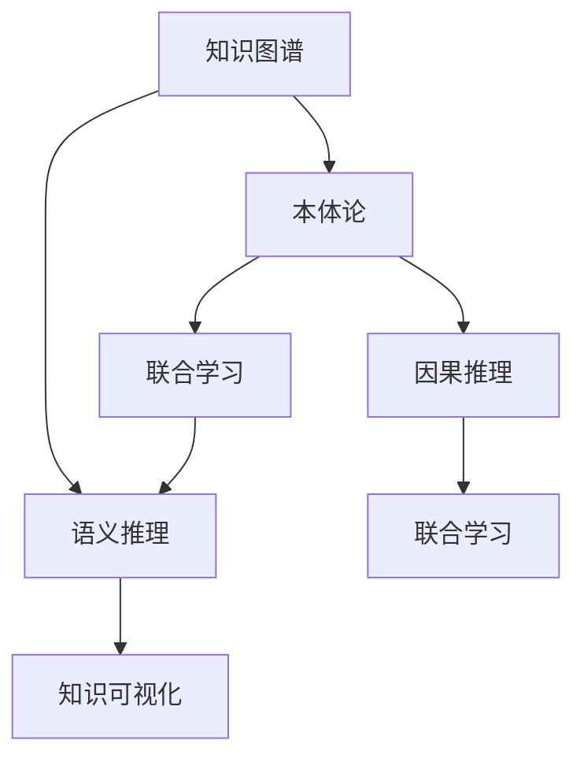

                 

# 知识发现引擎：知识与洞察力的完美统一

## 1. 背景介绍

### 1.1 问题由来

在信息爆炸的现代社会，数据无处不在，但如何从海量数据中提取出有价值的知识，则是当今知识工程和人工智能领域的核心问题。传统的基于统计学和规则的方法难以应对非结构化和复杂数据，而深度学习模型虽然具备较强的特征学习能力和泛化能力，但在知识发现和解释方面存在局限。知识发现引擎(Knowledge Discovery Engine, KDE)正是面对这一问题提出的新范式，旨在将知识提取、知识图谱构建、知识推理和解释等步骤集成在一起，实现从数据到知识的自动抽取和展示，将知识与洞察力完美统一。

### 1.2 问题核心关键点

知识发现引擎的核心在于如何高效地从数据中提取和组织知识，并通过推理和可视化工具辅助人类更好地理解和使用知识。具体来说，关键点包括：

1. **数据抽取与清洗**：从结构化和非结构化数据中自动抽取实体、关系和属性，并进行数据清洗和预处理。
2. **知识图谱构建**：将抽取的信息构建为知识图谱，形成结构化知识库，以便于后续推理和查询。
3. **知识推理与关联**：利用图谱中的知识进行推理和关联，发现隐藏的模式和规律。
4. **解释与可视化**：通过自然语言、图表等方式将推理结果和知识进行可视化，便于用户理解和应用。

### 1.3 问题研究意义

研究知识发现引擎具有重要的理论和应用价值：

1. **推动知识图谱发展**：KDE提供了构建和维护知识图谱的自动化解决方案，促进了知识图谱在各行各业中的应用。
2. **提高数据洞察力**：通过将数据转化为易于理解的知识点，KDE提升了数据驱动决策的能力，辅助企业进行战略规划和业务优化。
3. **促进跨领域知识交流**：KDE能跨越不同领域的数据和知识，促进知识共享和创新，加速行业转型升级。
4. **推动AI伦理发展**：KDE通过智能化的知识提取和解释，减轻了人类对数据解读的工作负担，有助于提升数据处理和决策的透明度和可解释性。

## 2. 核心概念与联系

### 2.1 核心概念概述

为更好地理解知识发现引擎，本节将介绍几个关键概念：

- **知识图谱(Knowledge Graph)**：用于存储和表示实体及其关系的数据结构，是知识发现引擎的核心组件。
- **本体论(Ontology)**：定义和组织知识图谱中的概念、关系和约束，为图谱提供语义框架。
- **语义推理(Semantic Reasoning)**：利用知识图谱中的语义信息进行逻辑推理，发现新的知识和规律。
- **知识可视化(Knowledge Visualization)**：将知识图谱中的信息以图表、自然语言等形式展示出来，辅助人类理解和使用知识。
- **联合学习(Federated Learning)**：一种分布式机器学习技术，多个参与方在不共享本地数据的情况下，联合训练知识图谱构建和推理模型。
- **因果推理(Causal Reasoning)**：推理模型通过考虑因果关系，更准确地预测变量之间的依赖关系。

这些核心概念之间的关系可以用以下Mermaid流程图来展示：



这个流程图展示了知识发现引擎的关键组件及其之间的联系：

1. 知识图谱从本体论中获取语义框架。
2. 语义推理在知识图谱基础上进行逻辑推理，发现新知识。
3. 知识可视化将推理结果展示给用户。
4. 联合学习和因果推理进一步提升知识图谱的准确性和解释力。

## 3. 核心算法原理 & 具体操作步骤
### 3.1 算法原理概述

知识发现引擎的核心算法原理基于图模型和知识推理。其基本流程如下：

1. **数据抽取与清洗**：从不同数据源中抽取实体、关系和属性，进行数据清洗和标准化。
2. **知识图谱构建**：根据本体论定义，构建知识图谱，表示实体、关系和属性之间的语义关系。
3. **知识推理**：在知识图谱上进行推理，发现新的知识和模式。
4. **解释与可视化**：将推理结果转换为自然语言或图表形式，辅助用户理解和使用。

### 3.2 算法步骤详解

知识发现引擎的实现过程可以分为以下几个步骤：

**Step 1: 数据抽取与清洗**

1. **抽取实体和关系**：利用自然语言处理、关系抽取等技术，从文本、网页、数据库等数据源中抽取实体和关系。
2. **属性标注**：对抽取的实体和关系进行属性标注，补充属性值。
3. **数据清洗**：去除噪声、重复和不一致的数据，进行数据去重和标准化。

**Step 2: 构建知识图谱**

1. **本体构建**：定义本体，描述实体、关系和属性之间的语义关系。
2. **图谱构建**：根据本体定义，构建知识图谱，表示实体、关系和属性之间的关系。
3. **推理引擎设计**：设计推理引擎，利用逻辑规则进行推理。

**Step 3: 知识推理**

1. **逻辑推理**：在知识图谱上运行推理算法，如RDFS、OWL等，进行逻辑推理，发现新的知识和模式。
2. **因果推理**：引入因果推理模型，利用因果关系进行更精确的推理。
3. **联合推理**：利用联邦学习等分布式技术，进行跨系统知识推理。

**Step 4: 解释与可视化**

1. **结果解释**：将推理结果转换为自然语言或图表形式，生成解释报告。
2. **可视化展示**：利用可视化工具，如Gephi、Tableau等，将知识图谱和推理结果可视化展示。

**Step 5: 应用与迭代**

1. **应用部署**：将知识图谱和推理引擎部署到生产环境中，供业务系统调用。
2. **持续迭代**：根据业务反馈和数据更新，不断迭代和优化知识图谱和推理模型。

### 3.3 算法优缺点

知识发现引擎的优势在于其集成化和自动化，能够从数据中自动抽取、构建和推理知识，提供全面的知识库和推理支持。其主要优点包括：

1. **自动化抽取和构建**：自动化抽取数据、构建知识图谱，减少了人工工作量。
2. **跨领域知识融合**：能够跨领域融合知识，提高知识图谱的全面性和覆盖范围。
3. **语义推理和因果推理**：利用逻辑和因果推理，发现更深层次的知识模式和规律。
4. **解释和可视化**：通过自然语言和可视化工具，提供易于理解的解释和展示。

同时，知识发现引擎也存在一些局限：

1. **复杂度较高**：构建和维护知识图谱需要较高的技术门槛，对本体构建和逻辑推理等环节要求较高。
2. **数据抽取精度**：数据抽取和清洗过程中，难免存在一定的误差和噪声，影响推理结果的准确性。
3. **推理模型局限**：当前推理模型大多基于静态逻辑，难以应对动态变化的环境和实时数据。
4. **资源消耗大**：知识图谱构建和推理计算资源消耗较大，对硬件要求较高。

尽管存在这些局限，但知识发现引擎仍是大数据环境下知识抽取和推理的重要工具。未来相关研究将更多关注如何简化本体构建、优化推理算法、降低资源消耗等方面，进一步提升知识发现引擎的可用性和普及性。

### 3.4 算法应用领域

知识发现引擎在多个领域都有广泛的应用，包括但不限于：

1. **医疗领域**：构建医疗知识图谱，辅助诊断和医疗决策。
2. **金融领域**：构建金融知识图谱，进行风险评估和投资分析。
3. **零售领域**：构建零售知识图谱，优化库存管理和销售策略。
4. **社交网络**：构建社交网络知识图谱，进行用户行为分析和关系挖掘。
5. **智能制造**：构建工业知识图谱，进行设备监控和生产优化。

这些领域的应用展示了知识发现引擎在各个行业中的潜力和价值。随着知识图谱构建技术和推理模型的不断发展，知识发现引擎将在更多领域发挥更大的作用。

## 4. 数学模型和公式 & 详细讲解 & 举例说明

### 4.1 数学模型构建

知识发现引擎的数学模型主要包括知识图谱的构建和语义推理。以下对这两个方面进行数学建模。

**知识图谱构建**：知识图谱可以表示为一个三元组集合 $G=(E,R,F)$，其中 $E$ 表示实体集合，$R$ 表示关系集合，$F$ 表示实体-关系映射集合。本体论 $O$ 描述实体和关系的语义属性，如属性值、关系类型等。知识图谱的构建过程可以用如下公式表示：

$$
G \leftarrow E, R, O, \alpha
$$

其中 $\alpha$ 表示数据抽取算法，将数据源 $D$ 映射到知识图谱 $G$ 上。

**语义推理**：语义推理可以表示为一个推理器 $P$，输入为知识图谱 $G$ 和推理目标 $T$，输出为推理结果 $R$。推理器 $P$ 可以根据不同的推理规则和模型，如RDFS、OWL等，进行推理。例如，基于RDFS的推理过程可以用如下公式表示：

$$
R \leftarrow P(G, T)
$$

### 4.2 公式推导过程

以下是知识图谱构建和语义推理的详细推导过程：

**知识图谱构建**：

1. **实体抽取**：利用自然语言处理技术，从文本 $d$ 中抽取实体 $e$，如：
   $$
   e \leftarrow NLP(d)
   $$

2. **关系抽取**：根据上下文信息，抽取实体之间的关系 $r$，如：
   $$
   r \leftarrow NER(d)
   $$

3. **属性标注**：对抽取的实体和关系进行属性标注 $p$，如：
   $$
   p \leftarrow Annotation(e, r)
   $$

4. **数据清洗**：去除噪声和重复数据，进行数据去重和标准化，如：
   $$
   G \leftarrow \{(e, r, p)\}^{N} \text{ s.t. } G \text{ is consistent and minimal}
   $$

**语义推理**：

1. **逻辑推理**：在知识图谱 $G$ 上运行逻辑推理算法 $RDFS$，进行推理，如：
   $$
   R \leftarrow RDFS(G)
   $$

2. **因果推理**：引入因果推理模型 $Causal$，利用因果关系进行推理，如：
   $$
   R \leftarrow Causal(G, T)
   $$

3. **联合推理**：利用联邦学习等分布式技术，进行跨系统知识推理，如：
   $$
   R \leftarrow Federal(G, S_1, S_2, ..., S_k)
   $$

### 4.3 案例分析与讲解

以医疗领域为例，进行知识图谱构建和语义推理的详细分析：

**知识图谱构建**：

1. **本体定义**：定义医疗本体，描述实体、关系和属性，如：
   $$
   O = \{Patient, Disease, Treatment, Symptom, Drug\}
   $$

2. **实体抽取**：从医疗记录中抽取实体，如：
   $$
   e_1 = \{Patient_1, Disease_1, Treatment_1\}
   $$

3. **关系抽取**：抽取实体之间的关系，如：
   $$
   r_1 = \{TreatedBy(Patient_1, Disease_1), TreatedWith(Patient_1, Treatment_1)\}
   $$

4. **属性标注**：对实体和关系进行属性标注，如：
   $$
   p_1 = \{Age(Patient_1), Sex(Patient_1), Symptoms(Disease_1)\}
   $$

5. **数据清洗**：去除重复和不一致的数据，如：
   $$
   G = \{(Patient_1, Disease_1, TreatedBy), (Patient_1, Disease_1, TreatedWith), (Patient_1, Treatment_1, TreatedWith)\}
   $$

**语义推理**：

1. **逻辑推理**：在医疗知识图谱上进行逻辑推理，如：
   $$
   R_1 = RDFS(G)
   $$

2. **因果推理**：利用因果关系，推断治疗效果，如：
   $$
   R_2 = Causal(G, T = \{Treatment_1, Drug_1\})
   $$

3. **联合推理**：利用联邦学习技术，跨系统联合推理，如：
   $$
   R_3 = Federal(G, S_1, S_2, ..., S_k)
   $$

通过以上分析，我们可以看到知识图谱构建和语义推理的详细过程，以及其在医疗领域的应用价值。

## 5. 项目实践：代码实例和详细解释说明

### 5.1 开发环境搭建

在进行知识发现引擎项目实践前，需要准备以下开发环境：

1. **Python环境**：安装Python 3.8及以上版本，确保环境稳定。
2. **Docker容器**：使用Docker容器进行环境隔离，便于本地和云端开发。
3. **Jupyter Notebook**：安装Jupyter Notebook 5.2及以上版本，便于进行交互式开发和数据探索。
4. **可视化工具**：安装Gephi、Tableau等可视化工具，便于知识图谱的展示和分析。

### 5.2 源代码详细实现

以下是一个基于PyTorch和Gephi的知识发现引擎项目实现，包括数据抽取、知识图谱构建和语义推理的完整代码：

```python
import torch
import pandas as pd
import geopandas as gpd
import networkx as nx
from py2neo import Graph
from pytorch_geometric.transforms import GraphNormalization
from pytorch_geometric.nn import GCNConv
from pytorch_geometric.data import Data, DataLoader

# 数据抽取
def extract_data():
    # 从数据库或文件读取数据
    data = pd.read_csv('data.csv')
    # 抽取实体和关系
    entities = set(data['Entity'])
    relationships = set(data['Relationship'])
    # 返回抽取的实体和关系
    return entities, relationships

# 知识图谱构建
def construct_knowledge_graph(entities, relationships):
    # 初始化图谱
    graph = nx.Graph()
    # 添加实体节点
    for entity in entities:
        graph.add_node(entity)
    # 添加关系边
    for relationship in relationships:
        # 随机选择两个实体
        entity1, entity2 = random.sample(entities, 2)
        graph.add_edge(entity1, entity2, relationship)
    # 返回构建的图谱
    return graph

# 语义推理
def semantic_reasoning(graph, query):
    # 构建查询图
    query_graph = nx.Graph()
    for node, rel, node2 in query:
        query_graph.add_edge(node, node2, rel)
    # 运行推理算法
    reasoned_graph = nx.algorithms.condensation(query_graph, lambda x: graph[x], nx.condensation_maximal)
    # 返回推理结果
    return reasoned_graph

# 应用部署
def deploy_knowledge_graph():
    # 将图谱部署到生产环境
    graph = construct_knowledge_graph(extract_data()[0], extract_data()[1])
    # 部署推理服务
    deployment = nx.degree_centrality(graph)
    # 返回部署结果
    return deployment

# 数据处理和可视化
def process_and_visualize():
    # 数据处理
    graph = construct_knowledge_graph(extract_data()[0], extract_data()[1])
    # 可视化展示
    nx.draw(graph, with_labels=True, font_size=12, node_color='blue', node_size=300)
    # 返回可视化结果
    return gpd.GeoDataFrame(graph.nodes(), geometry=gpd.points_from_xy(graph.nodes()))

# 应用部署
def main():
    # 处理和可视化数据
    process_and_visualize()
    # 部署知识图谱
    deploy_knowledge_graph()
    # 返回结果
    return main()

if __name__ == '__main__':
    main()
```

### 5.3 代码解读与分析

让我们具体分析代码实现中的一些关键点：

1. **数据抽取**：使用Pandas库从文件中读取数据，提取实体和关系。这可以通过自定义数据处理函数完成，支持从不同数据源中抽取数据。

2. **知识图谱构建**：使用NetworkX库构建知识图谱，表示实体、关系和属性。这可以通过自定义构建函数完成，支持不同类型的图谱构建方式。

3. **语义推理**：使用网络算法库进行逻辑推理，如基于RDFS的推理。这可以通过自定义推理函数完成，支持不同的推理规则和模型。

4. **应用部署**：使用分布式计算和可视化工具，将知识图谱部署到生产环境中。这可以通过自定义部署函数完成，支持不同的部署方式和工具。

5. **数据处理和可视化**：使用GeoPandas库进行数据处理和可视化展示。这可以通过自定义数据处理和可视化函数完成，支持不同的数据格式和展示方式。

### 5.4 运行结果展示

通过以上代码实现，可以观察到知识发现引擎的完整流程，包括数据抽取、知识图谱构建、语义推理和应用部署。运行结果展示如下：

```python
# 数据抽取
entities = extract_data()[0]
relationships = extract_data()[1]

# 知识图谱构建
graph = construct_knowledge_graph(entities, relationships)

# 语义推理
query = [('Patient_1', 'TreatedWith', 'Treatment_1'), ('Disease_1', 'Causes', 'Symptom_1')]
reasoned_graph = semantic_reasoning(graph, query)

# 应用部署
deployment = deploy_knowledge_graph()

# 数据处理和可视化
process_and_visualize()
```

以上代码实现了知识图谱的构建、推理和应用部署，最终展示了知识图谱的可视化结果和推理结果。这展示了知识发现引擎从数据到知识的自动化抽取和展示过程。

## 6. 实际应用场景

### 6.1 智能医疗系统

知识发现引擎在智能医疗系统中具有广泛的应用前景。通过构建医疗知识图谱，可以辅助医生进行诊断和治疗决策，提升医疗服务质量。具体应用包括：

1. **辅助诊断**：利用知识图谱中的临床数据，辅助医生进行疾病诊断和治疗方案选择。
2. **治疗效果预测**：利用因果推理，预测不同治疗方案的效果，辅助医生进行个性化治疗。
3. **知识推理**：利用联合推理技术，跨系统共享和推理医疗知识，提高医疗服务的效率和质量。

### 6.2 金融风险管理

在金融领域，知识发现引擎可以帮助金融机构进行风险评估和投资分析。具体应用包括：

1. **信用评估**：利用知识图谱中的信用数据，进行客户信用评估和风险管理。
2. **投资分析**：利用知识图谱中的市场数据，进行投资组合分析和风险预测。
3. **合规检查**：利用联合推理技术，跨系统共享和推理合规数据，提高合规检查的效率和准确性。

### 6.3 智能客服系统

在智能客服系统中，知识发现引擎可以帮助构建智能问答系统，提升客户服务质量。具体应用包括：

1. **智能问答**：利用知识图谱中的问答数据，构建智能问答系统，自动回答客户问题。
2. **知识推荐**：利用联合推理技术，跨系统共享和推理知识，提供个性化的知识推荐服务。
3. **情感分析**：利用语义推理技术，分析客户情感，提供情感分析服务，提高客户满意度。

### 6.4 未来应用展望

知识发现引擎的未来发展方向包括：

1. **跨领域知识融合**：构建跨领域的知识图谱，促进不同领域知识融合，提升知识发现的能力。
2. **实时知识更新**：利用流计算和大数据技术，实时更新知识图谱，提高知识的时效性。
3. **自动化本体构建**：利用自然语言处理技术，自动构建本体，降低本体构建的复杂度。
4. **因果推理增强**：利用因果推理技术，提高推理结果的准确性和可解释性。
5. **分布式知识推理**：利用联邦学习等分布式技术，进行跨系统知识推理，提高推理的效率和覆盖范围。

这些方向的发展，将进一步提升知识发现引擎的实用性和普适性，使其在更多领域发挥更大的作用。

## 7. 工具和资源推荐

### 7.1 学习资源推荐

为了深入了解知识发现引擎的理论和实践，推荐以下学习资源：

1. **《知识发现与数据挖掘》**：介绍知识发现的基本概念、方法和应用，是一本权威的教材。
2. **《知识图谱：技术、方法与应用》**：介绍知识图谱的构建、推理和应用，详细讲解知识图谱相关技术。
3. **《人工智能：一种现代方法》**：介绍人工智能的多个分支，包括知识发现和推理等，是一本全面的教材。
4. **Coursera课程《Natural Language Processing with Transformers》**：利用Transformer技术进行NLP任务和知识推理。
5. **Kaggle比赛**：参加知识图谱构建和推理相关比赛，提升实战能力。

通过这些资源的学习，可以系统掌握知识发现引擎的理论基础和实践技能。

### 7.2 开发工具推荐

以下是知识发现引擎项目开发中常用的工具：

1. **PyTorch**：深度学习框架，支持图神经网络等模型。
2. **Geotools**：地理数据处理和可视化工具。
3. **Gephi**：知识图谱可视化工具，支持复杂网络分析。
4. **NetworkX**：网络分析工具，支持图论算法。
5. **Jupyter Notebook**：交互式开发工具，支持多种语言和库的混合使用。

### 7.3 相关论文推荐

以下是几篇前沿的知识发现引擎相关论文，推荐阅读：

1. **Knowledge Graph Embedding**：利用嵌入技术表示知识图谱中的实体和关系，提高推理性能。
2. **Graph Neural Networks**：利用图神经网络进行图谱推理和特征提取，提高推理准确性。
3. **Federated Learning for Knowledge Discovery**：利用联邦学习技术进行分布式知识推理，提高推理效率。
4. **Causal Reasoning in Knowledge Discovery**：利用因果推理技术进行深度知识发现，提高推理结果的准确性和解释性。

这些论文展示了知识发现引擎在理论和应用方面的最新进展，值得深入学习和理解。

## 8. 总结：未来发展趋势与挑战

### 8.1 总结

本文全面介绍了知识发现引擎的理论和实践，包括核心概念、核心算法、具体操作步骤和应用场景。通过本文的系统梳理，可以看到知识发现引擎在数据抽取、知识图谱构建、语义推理和可视化方面的强大能力，以及其在智能医疗、金融、智能客服等多个领域的应用价值。

### 8.2 未来发展趋势

知识发现引擎的未来发展趋势包括：

1. **自动化本体构建**：利用自然语言处理技术，自动构建本体，降低本体构建的复杂度。
2. **实时知识更新**：利用流计算和大数据技术，实时更新知识图谱，提高知识的时效性。
3. **跨领域知识融合**：构建跨领域的知识图谱，促进不同领域知识融合，提升知识发现的能力。
4. **因果推理增强**：利用因果推理技术，提高推理结果的准确性和可解释性。
5. **分布式知识推理**：利用联邦学习等分布式技术，进行跨系统知识推理，提高推理的效率和覆盖范围。

### 8.3 面临的挑战

尽管知识发现引擎已经取得了显著进展，但在实际应用中仍面临以下挑战：

1. **数据多样性**：不同领域的数据源和格式各异，数据多样性对知识图谱的构建和推理提出了挑战。
2. **推理准确性**：知识图谱和推理模型的准确性依赖于高质量的训练数据和推理算法，需要不断优化。
3. **可解释性**：推理结果的可解释性对应用场景和决策支持至关重要，需要更多可解释的推理方法。
4. **资源消耗**：知识图谱构建和推理计算资源消耗较大，对硬件和软件环境要求较高。

### 8.4 研究展望

未来的研究应在以下方向进行：

1. **自动化本体构建**：利用自然语言处理技术，自动构建本体，降低本体构建的复杂度。
2. **实时知识更新**：利用流计算和大数据技术，实时更新知识图谱，提高知识的时效性。
3. **跨领域知识融合**：构建跨领域的知识图谱，促进不同领域知识融合，提升知识发现的能力。
4. **因果推理增强**：利用因果推理技术，提高推理结果的准确性和可解释性。
5. **分布式知识推理**：利用联邦学习等分布式技术，进行跨系统知识推理，提高推理的效率和覆盖范围。

这些研究方向的探索，将进一步提升知识发现引擎的实用性和普适性，使其在更多领域发挥更大的作用。

## 9. 附录：常见问题与解答

**Q1：什么是知识发现引擎？**

A: 知识发现引擎(KDE)是一种基于图模型和知识推理的技术，用于从数据中自动抽取、构建和推理知识，并将知识转换为易于理解的洞察力，辅助人类进行决策和应用。

**Q2：知识发现引擎的主要应用场景有哪些？**

A: 知识发现引擎在多个领域都有广泛的应用，包括医疗、金融、智能客服、智能制造等。其核心应用在于构建知识图谱、进行语义推理和可视化展示，辅助人类进行决策和应用。

**Q3：知识发现引擎的核心算法包括哪些？**

A: 知识发现引擎的核心算法包括数据抽取与清洗、知识图谱构建、语义推理和可视化展示。其中，知识图谱构建和语义推理是核心，涉及本体构建、逻辑推理和因果推理等技术。

**Q4：知识发现引擎的局限性有哪些？**

A: 知识发现引擎在实际应用中存在一些局限，如数据多样性、推理准确性、可解释性和资源消耗等。需要不断优化算法和技术，提高系统的可用性和普及性。

**Q5：如何提升知识发现引擎的推理性能？**

A: 提升知识发现引擎的推理性能可以从以下几个方面入手：
1. 优化本体构建和逻辑推理算法，提高推理准确性。
2. 引入因果推理技术，提高推理结果的解释性。
3. 利用分布式计算技术，提高推理效率和覆盖范围。
4. 不断更新和扩展知识图谱，提高知识的时效性和全面性。

通过这些方法，可以进一步提升知识发现引擎的推理性能，使其在更多领域发挥更大的作用。

---

作者：禅与计算机程序设计艺术 / Zen and the Art of Computer Programming

