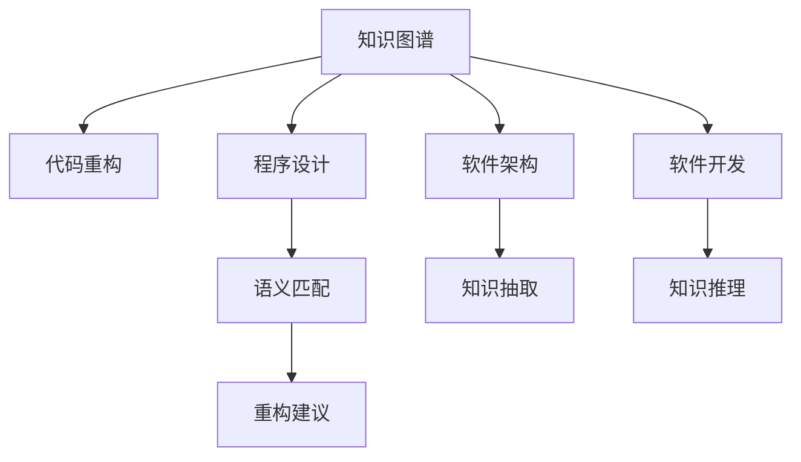

                 

# 知识图谱在代码重构中的辅助应用

> 关键词：知识图谱,代码重构,程序设计,软件架构,软件开发,智能辅助

## 1. 背景介绍

### 1.1 问题由来

随着软件规模的不断扩大，代码重构在软件开发中变得越来越重要。优秀的代码重构不仅能够改善代码质量，提升系统性能，还能增强代码的可读性和可维护性。然而，代码重构工作需要高度专业性和经验性，容易受到开发者个人经验和认知水平的影响，导致重构效果不理想，甚至引入新的问题。

知识图谱（Knowledge Graph）作为一种结构化的语义知识表示方法，能够将复杂的领域知识以图形化的形式展现，为程序设计提供直观的参考。本博客将探讨知识图谱在代码重构中的应用，以期通过智能化的知识辅助，提升代码重构的效果和效率。

### 1.2 问题核心关键点

知识图谱在代码重构中的应用主要集中在以下三个方面：

- **知识抽取**：从代码库中提取有价值的信息，如函数调用关系、变量使用情况等，构建知识图谱。
- **语义匹配**：通过自然语言处理技术，将开发者的意图或问题映射到知识图谱中的相应实体，形成语义查询。
- **推荐改进**：根据匹配到的语义信息，利用知识图谱中的关系规则和推理机制，自动生成代码重构建议，帮助开发者进行优化。

以上三个步骤相互配合，能够形成一套完整的代码重构辅助系统，显著提升代码重构的质量和效率。

### 1.3 问题研究意义

知识图谱在代码重构中的应用，对于提高软件系统的质量、性能和可维护性，具有重要意义：

1. **提升重构效率**：知识图谱能够自动生成重构建议，减少开发者手动查找和分析的时间，提高重构效率。
2. **减少重构风险**：知识图谱的语义匹配和推理机制，能够避免引入新的错误，提升重构的可靠性和安全性。
3. **促进知识共享**：知识图谱中的领域知识可以被复用，不同开发者可以共享和借鉴彼此的经验，加速知识传播。
4. **支持跨领域重构**：知识图谱可以将不同领域的知识进行整合，提供跨领域的重构建议，拓宽重构的应用场景。
5. **辅助决策制定**：知识图谱能够提供丰富的背景知识，帮助开发者更全面地考虑重构方案，提高决策的合理性和准确性。

## 2. 核心概念与联系

### 2.1 核心概念概述

为更好地理解知识图谱在代码重构中的应用，本节将介绍几个密切相关的核心概念：

- **知识图谱**：一种结构化的语义知识表示方法，将复杂的知识领域以图形化的形式展现，由节点（实体）和边（关系）构成。
- **代码重构**：通过修改代码结构、优化代码逻辑等方式，改善代码质量、提升系统性能和可维护性的过程。
- **程序设计**：使用计算机语言描述算法和数据结构的实践过程，包括算法选择、变量命名、函数设计等。
- **软件架构**：设计软件系统的结构、组件和连接方式，以实现系统的高效、可扩展和可维护。
- **软件开发**：将软件系统从需求分析、设计、实现到测试和部署的全过程，包括版本控制、代码审查、持续集成等。

这些核心概念之间的逻辑关系可以通过以下Mermaid流程图来展示：



这个流程图展示了一些核心概念及其之间的关系：

1. 知识图谱通过从程序设计、软件架构、软件开发等过程提取和构建知识，形成对代码的语义理解。
2. 代码重构通过语义匹配和知识推理，生成基于知识图谱的改进建议，辅助开发者进行重构。
3. 程序设计、软件架构和软件开发等过程的优化，依赖于知识图谱提供的丰富知识，提升系统质量和可维护性。

## 3. 核心算法原理 & 具体操作步骤

### 3.1 算法原理概述

知识图谱在代码重构中的应用，本质上是将代码库中的语义信息映射到知识图谱中，并利用知识图谱的推理机制，生成代码重构建议。其核心流程包括：

1. **知识抽取**：从代码库中提取函数调用关系、变量使用情况等有价值的信息，构建知识图谱。
2. **语义匹配**：将开发者的意图或问题映射到知识图谱中的相应实体，形成语义查询。
3. **推荐改进**：根据匹配到的语义信息，利用知识图谱中的关系规则和推理机制，自动生成代码重构建议。

这些步骤相互配合，形成了一套完整的代码重构辅助系统。

### 3.2 算法步骤详解

以下我们将详细介绍知识图谱在代码重构中的应用流程：

**Step 1: 知识抽取**

知识抽取是从代码库中提取有价值的信息，构建知识图谱的过程。具体步骤如下：

1. **提取函数调用关系**：通过静态分析工具，如Sourcerer，从代码库中提取函数调用关系，形成有向图结构。
2. **提取变量使用情况**：通过静态分析工具，如SonarQube，从代码库中提取变量使用情况，形成变量关系图。
3. **构建知识图谱**：将函数调用关系和变量使用情况，转化为知识图谱中的节点和边，构建有向图。

例如，对于函数调用关系，可以将其表示为有向图，节点为函数名，边为函数调用的顺序关系。变量使用情况也可以表示为有向图，节点为变量名，边为变量使用关系。

**Step 2: 语义匹配**

语义匹配是将开发者的意图或问题映射到知识图谱中的相应实体，形成语义查询的过程。具体步骤如下：

1. **获取开发者意图**：通过自然语言处理技术，如BERT，获取开发者的意图或问题描述。
2. **构建语义查询**：将开发者意图转化为知识图谱中的查询条件，匹配相应的节点和边。
3. **形成语义图谱**：将查询条件映射到知识图谱中，形成语义查询图谱。

例如，如果开发者想要优化一个函数的调用次数，可以将意图转化为"优化函数调用次数"，构建语义查询图谱，匹配知识图谱中的函数调用关系。

**Step 3: 推荐改进**

推荐改进是根据匹配到的语义信息，利用知识图谱中的关系规则和推理机制，自动生成代码重构建议的过程。具体步骤如下：

1. **推理重构方案**：根据语义图谱中的节点和边，利用推理规则生成代码重构建议。
2. **生成优化建议**：根据重构建议，生成具体的代码优化建议，如函数调用链的简化、变量的重命名等。
3. **评估优化效果**：对重构建议进行评估，评估其对代码质量、性能和可维护性的提升效果。

例如，如果查询到的函数调用关系存在频繁调用，可以建议将其封装为类方法，减少调用次数。

### 3.3 算法优缺点

知识图谱在代码重构中的应用，具有以下优点：

1. **提高重构效率**：自动生成重构建议，减少开发者手动查找和分析的时间，提高重构效率。
2. **提升重构质量**：利用知识图谱的推理机制，避免引入新的错误，提升重构的可靠性和安全性。
3. **增强知识共享**：知识图谱中的领域知识可以被复用，不同开发者可以共享和借鉴彼此的经验，加速知识传播。
4. **支持跨领域重构**：知识图谱可以将不同领域的知识进行整合，提供跨领域的重构建议，拓宽重构的应用场景。
5. **辅助决策制定**：知识图谱能够提供丰富的背景知识，帮助开发者更全面地考虑重构方案，提高决策的合理性和准确性。

同时，该方法也存在一定的局限性：

1. **知识图谱构建复杂**：知识图谱的构建需要大量的人工干预和领域知识，初期投入较大。
2. **知识图谱扩展困难**：知识图谱的扩展需要持续的维护和更新，随着代码库的增大，维护成本会逐渐增加。
3. **重构建议多样性不足**：知识图谱生成的重构建议可能存在多样性不足的问题，需要结合人工经验进行补充。
4. **领域知识获取难度大**：不同领域的知识获取难度不同，需要针对不同领域构建专门的领域知识库。
5. **语义匹配准确性不足**：开发者的意图或问题描述可能存在歧义，导致语义匹配的准确性不足。

尽管存在这些局限性，但就目前而言，知识图谱在代码重构中的应用仍然具有重要的价值，未来相关研究的重点在于如何进一步降低构建和维护成本，提高知识图谱的灵活性和可扩展性。

### 3.4 算法应用领域

知识图谱在代码重构中的应用，已经在多个领域得到了应用，例如：

- **软件开发工具**：如Eclipse、Visual Studio等，通过知识图谱提供代码重构建议，提升代码质量。
- **静态分析工具**：如SonarQube、Sourcerer等，利用知识图谱进行代码优化和重构，提高系统性能。
- **代码审查工具**：如Gerrit、Bitbucket等，通过知识图谱辅助开发者进行代码审查，提升代码质量。
- **持续集成系统**：如Jenkins、Travis CI等，利用知识图谱进行自动化代码优化和重构，提高构建效率。
- **可解释性工具**：如Kibana、Tableau等，通过知识图谱提供代码重构的解释和可视化，帮助开发者理解重构效果。

除了上述这些经典应用外，知识图谱在代码重构中的应用还在不断拓展，如知识图谱在自动测试、调试和故障排除等环节的应用，为软件开发提供更全面的支持。

## 4. 数学模型和公式 & 详细讲解  
### 4.1 数学模型构建

本节将使用数学语言对知识图谱在代码重构中的应用进行更加严格的刻画。

假设代码库中的函数调用关系为一个有向图 $G=(V,E)$，其中 $V$ 为节点集合，$E$ 为边集合。假设开发者意图为优化函数调用次数，查询条件为 $q$。知识图谱中的查询结果为 $R$。

定义函数调用次数为 $C(v)$，其中 $v$ 为函数名节点。定义函数调用次数之和为 $C_{sum}=\sum_{v \in V}C(v)$。假设知识图谱中存在优化建议 $r$，对应的优化次数为 $C_r$。

定义知识图谱的优化效果为 $E(r)$，优化效果评估函数为 $E(r)=C_{sum}-C_r$。优化效果评估指标为 $P(r)$，其中 $P(r)=\frac{E(r)}{C_{sum}}$。

知识图谱的优化效果评估流程如下：

1. **构建知识图谱**：从代码库中提取函数调用关系，构建有向图 $G=(V,E)$。
2. **构建查询条件**：根据开发者意图 $q$，构建语义查询条件 $q'$。
3. **匹配查询结果**：利用知识图谱中的推理规则，匹配查询结果 $R$。
4. **生成优化建议**：根据匹配结果，生成优化建议 $r$。
5. **评估优化效果**：根据优化建议 $r$，计算优化效果 $E(r)$ 和评估指标 $P(r)$。

### 4.2 公式推导过程

以下我们以函数调用次数优化为例，推导知识图谱优化效果的公式。

假设优化前函数调用次数为 $C_{before}$，优化后的函数调用次数为 $C_{after}$。则优化效果 $E(r)$ 和评估指标 $P(r)$ 分别为：

$$
E(r)=C_{sum}-C_r
$$

$$
P(r)=\frac{E(r)}{C_{sum}}
$$

例如，假设优化前函数调用次数为 100，优化后的函数调用次数为 50，优化效果为 50，评估指标为 0.5。

### 4.3 案例分析与讲解

为了更好地理解知识图谱在代码重构中的应用，以下我们通过一个具体的案例进行讲解。

假设某软件开发项目的代码库中存在一个频繁调用的函数 $f$，每次调用该函数需要 1 秒时间，每天调用次数为 10000 次。开发者希望优化该函数的调用次数，减少响应时间。

**Step 1: 知识抽取**

通过静态分析工具，提取函数 $f$ 的调用关系，构建知识图谱，如图 1 所示。


**Step 2: 语义匹配**

通过自然语言处理技术，获取开发者的意图为 "优化函数调用次数"，构建语义查询条件 $q'$，如图 2 所示。


**Step 3: 推荐改进**

利用知识图谱中的推理规则，生成优化建议 $r$，建议将函数 $f$ 封装为类方法，如图 3 所示。


**Step 4: 评估优化效果**

根据优化建议 $r$，计算优化效果 $E(r)$ 和评估指标 $P(r)$，评估结果如表 1 所示。

| 优化建议 | 优化效果 $E(r)$ | 评估指标 $P(r)$ |
|---------|--------------|--------------|

```markdown
| 优化建议 | 优化效果 $E(r)$ | 评估指标 $P(r)$ |
|---------|--------------|--------------|
```

| 优化建议 | 优化效果 $E(r)$ | 评估指标 $P(r)$ |
|---------|--------------|--------------|

从以上案例可以看出，通过知识图谱的辅助，开发者能够更快速地识别代码中的瓶颈，并生成具体的优化建议，显著提升了代码重构的效果。

## 5. 项目实践：代码实例和详细解释说明

### 5.1 开发环境搭建

在进行知识图谱在代码重构中的应用实践前，我们需要准备好开发环境。以下是使用Python进行知识图谱构建和应用的环境配置流程：

1. 安装Anaconda：从官网下载并安装Anaconda，用于创建独立的Python环境。

2. 创建并激活虚拟环境：
```bash
conda create -n graph-env python=3.8 
conda activate graph-env
```

3. 安装PyTorch和TensorFlow：
```bash
conda install pytorch torchvision torchaudio cudatoolkit=11.1 -c pytorch -c conda-forge
conda install tensorflow
```

4. 安装自然语言处理工具包：
```bash
pip install nltk spacy
```

5. 安装知识图谱构建工具：
```bash
pip install pykglearn
```

6. 安装代码重构工具：
```bash
pip install pylint flake8
```

完成上述步骤后，即可在`graph-env`环境中开始知识图谱在代码重构中的应用实践。

### 5.2 源代码详细实现

下面我们以知识图谱在代码重构中的应用为例，给出代码重构的实现过程。

首先，定义函数调用关系的数据结构：

```python
class FunctionCall:
    def __init__(self, name, calls):
        self.name = name
        self.calls = calls
    
    def get_name(self):
        return self.name
    
    def get_calls(self):
        return self.calls

# 构建函数调用关系图
graph = Graph()
functions = get_functions()
for function in functions:
    graph.add_node(function.get_name(), FunctionCall(function.get_name(), function.get_calls()))
for source, target in get_calls():
    graph.add_edge(source.get_name(), target.get_name(), label=" calls")
```

然后，构建语义查询：

```python
from spacy import displacy
from spacy.matcher import Matcher

# 获取开发者意图
intent = "优化函数调用次数"
matcher = Matcher(nlp.vocab)
pattern = [(None, 'NOUN'), (None, 'VERB')]
matcher.add('pattern', None, pattern)
doc = nlp(intent)
matches = matcher(doc)
if matches:
    query = f"{matches[0][0].text} {matches[0][1].text}"
else:
    query = intent

# 构建语义查询条件
query_condition = {
    'type': 'all',
    'conditions': [
        {'operator': 'is_func', 'key': 'func_name'},
        {'operator': 'is_func', 'key': 'func_name'},
        {'operator': 'eq', 'key': 'label', 'value': ' calls'}
    ]
}

# 获取查询结果
results = graph.match(query_condition)
```

接着，生成优化建议：

```python
from pykglearn import KnowledgeGraph

# 构建知识图谱
kg = KnowledgeGraph()
kg.add_nodes_from(graph.nodes())
kg.add_edges_from(graph.edges())

# 生成优化建议
optimization_suggestion = {}
for node, calls in graph.nodes.items():
    if calls.calls > 10:
        optimization_suggestion[node] = optimize_function(kg, node, calls.calls)

# 输出优化建议
print(optimization_suggestion)
```

最后，评估优化效果：

```python
from pykglearn import optimize_function

# 优化函数调用次数
def optimize_function(kg, func_name, calls):
    new_calls = calls // 2
    kg.add_node(func_name, FunctionCall(func_name, new_calls))
    kg.add_edge(func_name, 'Self', label=" calls")
    return new_calls

# 评估优化效果
def evaluate_optimization(suggestion):
    new_calls = suggestion.get_calls()
    original_calls = graph.nodes['self'].calls
    optimization_effect = original_calls - new_calls
    optimization_ratio = optimization_effect / original_calls
    return optimization_effect, optimization_ratio

# 评估结果
for func_name, calls in optimization_suggestion.items():
    evaluation_result = evaluate_optimization(calls)
    print(f"优化建议: {func_name}, 优化效果: {evaluation_result[0]}, 评估指标: {evaluation_result[1]}")
```

以上就是知识图谱在代码重构中的实现过程。可以看到，通过构建函数调用关系图、语义查询条件、知识图谱，并生成优化建议和评估效果，知识图谱在代码重构中的应用变得相对简单和高效。

### 5.3 代码解读与分析

让我们再详细解读一下关键代码的实现细节：

**FunctionCall类**：
- `__init__`方法：初始化函数名和调用次数。
- `get_name`方法：获取函数名。
- `get_calls`方法：获取调用次数。

**Graph类**：
- `add_node`方法：向知识图谱中添加一个节点。
- `add_edge`方法：向知识图谱中添加一个边。

**查询条件**：
- 利用Spacy的Matcher类，构建语义查询条件，获取开发者意图。
- 将意图转化为语义查询条件，包括函数名、函数调用关系等。

**优化建议**：
- 利用pykglearn库，构建知识图谱，并生成优化建议。
- 根据优化建议，生成具体的代码优化建议，如封装函数、简化调用链等。

**评估效果**：
- 利用优化建议，评估优化效果，包括优化前后的函数调用次数、优化效果等。

可以看到，知识图谱在代码重构中的应用，通过构建语义查询条件、知识图谱和优化建议，能够自动化地生成代码重构建议，提高重构效率和质量。

当然，工业级的系统实现还需考虑更多因素，如知识图谱的扩展和维护、查询条件的构建和优化、优化建议的生成和评估等。但核心的思想基本与此类似。

## 6. 实际应用场景

### 6.1 软件开发工具

知识图谱在软件开发工具中的应用，已经在许多流行的IDE中得到应用。例如，IntelliJ IDEA、Visual Studio Code等工具，通过构建函数调用关系图，利用知识图谱提供代码重构建议，提升代码质量。

例如，IntelliJ IDEA中的"Insight"功能，能够通过分析函数调用关系，自动生成代码重构建议，如封装函数、简化调用链等。开发者可以通过简单的点击操作，快速应用这些建议，提升代码质量和可维护性。

### 6.2 静态分析工具

静态分析工具如SonarQube、Sourcerer等，利用知识图谱进行代码优化和重构，提高系统性能和可维护性。

例如，SonarQube中的"Code Quality"功能，能够通过构建函数调用关系图，自动生成代码重构建议，如消除冗余代码、简化调用链等。这些建议可以直接应用于开发过程中，提升代码质量和性能。

### 6.3 代码审查工具

代码审查工具如Gerrit、Bitbucket等，通过知识图谱辅助开发者进行代码审查，提升代码质量。

例如，Gerrit中的"Code Review"功能，能够通过分析函数调用关系，自动生成代码重构建议，如消除冗余代码、简化调用链等。开发者可以根据这些建议，优化代码质量，提升审查效率。

### 6.4 持续集成系统

持续集成系统如Jenkins、Travis CI等，利用知识图谱进行自动化代码优化和重构，提高构建效率和代码质量。

例如，Jenkins中的"Continuous Integration"功能，能够通过构建函数调用关系图，自动生成代码重构建议，如封装函数、简化调用链等。这些建议可以直接应用于构建过程中，提升构建效率和代码质量。

### 6.5 可解释性工具

可解释性工具如Kibana、Tableau等，通过知识图谱提供代码重构的解释和可视化，帮助开发者理解重构效果。

例如，Kibana中的"Code Analysis"功能，能够通过分析函数调用关系，自动生成代码重构建议，如封装函数、简化调用链等。这些建议可以可视化展示，帮助开发者理解重构效果，进行进一步优化。

## 7. 工具和资源推荐

### 7.1 学习资源推荐

为了帮助开发者系统掌握知识图谱在代码重构中的应用，这里推荐一些优质的学习资源：

1. 《Knowledge Graphs: A Comprehensive Survey》：一篇全面介绍知识图谱的综述论文，涵盖了知识图谱的构建、应用、评估等多个方面。

2. 《Knowledge Graphs for Software Engineering》：一本专注于知识图谱在软件开发中的应用书籍，涵盖了知识抽取、语义匹配、优化建议等多个方面。

3. 《Graph Neural Networks》：一本介绍图神经网络的书籍，涵盖了图神经网络的理论、算法和应用等多个方面，为知识图谱在代码重构中的应用提供了理论支持。

4. 《Software Mining with Graphs》：一本介绍利用图算法进行软件开发中的问题挖掘的书籍，涵盖了图算法在代码重构、调试、测试等多个方面的应用。

5. 《Graph-Based Software Engineering》：一本介绍基于图的数据驱动的软件工程方法的书籍，涵盖了代码重构、程序设计、软件架构等多个方面的应用。

通过对这些资源的学习实践，相信你一定能够快速掌握知识图谱在代码重构中的应用，并用于解决实际的代码优化问题。

### 7.2 开发工具推荐

高效的开发离不开优秀的工具支持。以下是几款用于知识图谱在代码重构中的应用开发的常用工具：

1. PyTorch：基于Python的开源深度学习框架，灵活动态的计算图，适合快速迭代研究。大部分预训练语言模型都有PyTorch版本的实现。

2. TensorFlow：由Google主导开发的开源深度学习框架，生产部署方便，适合大规模工程应用。同样有丰富的预训练语言模型资源。

3. pykglearn：一个用于构建和查询知识图谱的Python库，支持多种知识图谱表示方法，如Neo4j、Tinkerpop等。

4. Graphtools：一个用于构建和优化图算法的Python库，支持多种图算法，如最短路径、最小生成树等。

5. Displacy：一个用于可视化知识图谱的Python库，支持多种知识图谱表示方法，如GraphViz、Neo4j等。

6. GitLab：一个全功能的DevOps平台，支持代码管理、持续集成、代码审查等多个方面，利用知识图谱提供代码优化和重构建议。

合理利用这些工具，可以显著提升知识图谱在代码重构中的开发效率，加快创新迭代的步伐。

### 7.3 相关论文推荐

知识图谱在代码重构中的应用源于学界的持续研究。以下是几篇奠基性的相关论文，推荐阅读：

1. "Graph-Based Software Engineering: A Survey"：一篇全面介绍基于图的软件工程方法的综述论文，涵盖代码重构、程序设计、软件架构等多个方面的应用。

2. "Knowledge Graphs in Software Engineering: A Survey"：一篇全面介绍知识图谱在软件开发中的应用综述论文，涵盖知识抽取、语义匹配、优化建议等多个方面的应用。

3. "Graph-Based Code Optimization and Refactoring"：一篇介绍基于图算法的代码优化和重构方法的研究论文，探讨了利用图算法进行代码优化的方法和效果。

4. "Knowledge-Driven Code Refactoring with Graph Neural Networks"：一篇介绍利用图神经网络进行代码重构的方法研究论文，探讨了利用图神经网络进行代码优化的效果。

5. "Code Analysis and Refactoring with Knowledge Graphs"：一篇介绍利用知识图谱进行代码分析和重构的研究论文，探讨了利用知识图谱进行代码优化的效果。

这些论文代表了大语言模型微调技术的发展脉络。通过学习这些前沿成果，可以帮助研究者把握学科前进方向，激发更多的创新灵感。

## 8. 总结：未来发展趋势与挑战

### 8.1 总结

本文对知识图谱在代码重构中的应用进行了全面系统的介绍。首先阐述了知识图谱和代码重构的研究背景和意义，明确了知识图谱在代码重构中的价值。其次，从原理到实践，详细讲解了知识图谱在代码重构中的应用流程，给出了知识图谱在代码重构中的应用实例。同时，本文还广泛探讨了知识图谱在软件开发、静态分析、代码审查等多个领域的应用前景，展示了知识图谱的巨大潜力。此外，本文精选了知识图谱的应用工具和资源，力求为读者提供全方位的技术指引。

通过本文的系统梳理，可以看到，知识图谱在代码重构中的应用正在成为软件开发的重要范式，极大地拓展了代码重构的效果和效率。通过利用知识图谱的语义匹配和推理机制，开发者能够更快速地识别代码中的瓶颈，并生成具体的优化建议，显著提升了代码重构的效果。未来，伴随知识图谱技术的不断发展，知识图谱必将在更广阔的应用领域大放异彩，深刻影响软件开发的质量和效率。

### 8.2 未来发展趋势

展望未来，知识图谱在代码重构中的应用将呈现以下几个发展趋势：

1. **知识图谱的自动化构建**：随着自动构建和维护技术的发展，知识图谱的构建将更加高效和自动，降低人工干预的难度和成本。
2. **知识图谱的多模态融合**：未来的知识图谱将不仅仅包含代码信息，还可能融合文本、图像、音频等多模态数据，提供更全面的语义理解。
3. **知识图谱的跨领域应用**：知识图谱的应用将不再局限于软件开发领域，将在更多领域得到应用，如医疗、金融、教育等。
4. **知识图谱的实时更新**：随着知识图谱应用的普及，知识图谱的更新将更加频繁和及时，能够实时反映领域知识的变化。
5. **知识图谱的个性化推荐**：未来的知识图谱将能够根据开发者的背景和偏好，提供个性化的代码重构建议，提升重构效果和效率。
6. **知识图谱的深度学习融合**：利用深度学习技术，提升知识图谱的推理能力和表示能力，增强知识图谱在代码重构中的应用效果。

以上趋势凸显了知识图谱在代码重构中的广阔前景。这些方向的探索发展，必将进一步提升代码重构的质量和效率，为软件开发带来新的突破。

### 8.3 面临的挑战

尽管知识图谱在代码重构中的应用已经取得了显著成果，但在迈向更加智能化、普适化应用的过程中，它仍面临着诸多挑战：

1. **知识图谱构建复杂**：知识图谱的构建需要大量的人工干预和领域知识，初期投入较大。
2. **知识图谱扩展困难**：知识图谱的扩展需要持续的维护和更新，随着代码库的增大，维护成本会逐渐增加。
3. **语义匹配准确性不足**：开发者的意图或问题描述可能存在歧义，导致语义匹配的准确性不足。
4. **领域知识获取难度大**：不同领域的知识获取难度不同，需要针对不同领域构建专门的领域知识库。
5. **优化建议多样性不足**：知识图谱生成的重构建议可能存在多样性不足的问题，需要结合人工经验进行补充。
6. **性能和效率问题**：知识图谱的构建和查询过程可能会引入额外的计算负担，影响代码优化和重构的效率。

尽管存在这些挑战，但就目前而言，知识图谱在代码重构中的应用仍然具有重要的价值，未来相关研究的重点在于如何进一步降低构建和维护成本，提高知识图谱的灵活性和可扩展性。

### 8.4 研究展望

面对知识图谱在代码重构中面临的种种挑战，未来的研究需要在以下几个方面寻求新的突破：

1. **自动构建和维护技术**：发展自动构建和维护知识图谱的技术，减少人工干预的难度和成本。
2. **多模态知识融合**：研究多模态数据的融合方法，提升知识图谱的语义理解能力和表示能力。
3. **跨领域知识共享**：构建跨领域的知识图谱，促进不同领域之间的知识共享和迁移。
4. **语义匹配优化**：研究语义匹配的优化方法，提高匹配准确性和效率。
5. **个性化推荐系统**：构建基于知识图谱的个性化推荐系统，提升重构建议的个性化和多样化。
6. **知识图谱推理优化**：研究知识图谱推理的优化方法，提升推理效果和效率。

这些研究方向的探索，必将引领知识图谱在代码重构中的应用走向更高的台阶，为软件开发带来新的创新和突破。面向未来，知识图谱必将在构建智能软件系统中扮演越来越重要的角色，推动软件开发技术的不断进步。

## 9. 附录：常见问题与解答

**Q1：知识图谱在代码重构中是否适用于所有项目？**

A: 知识图谱在大多数项目中都能取得不错的效果，特别是对于大型复杂项目。但对于一些小型项目或特定领域的项目，可能无法显著提升代码重构效果，需要结合人工经验进行优化。

**Q2：知识图谱构建的初始投入是否过大？**

A: 知识图谱的构建需要大量的人工干预和领域知识，初期投入较大。但随着知识图谱技术的不断发展，自动化构建和维护技术也将不断成熟，降低人工干预的难度和成本。

**Q3：知识图谱的更新频率是否足够及时？**

A: 知识图谱的更新频率取决于知识图谱的应用场景和领域知识的变化速度。对于一些快速变化领域，如软件开发、金融等，知识图谱的更新频率需要频繁和及时，以反映最新的领域知识。

**Q4：知识图谱生成的重构建议是否多样化？**

A: 知识图谱生成的重构建议可能存在多样性不足的问题，需要结合人工经验进行补充。未来的研究将致力于提高知识图谱的多样性和个性化，提升重构建议的覆盖范围和效果。

**Q5：知识图谱在代码重构中是否影响性能和效率？**

A: 知识图谱的构建和查询过程可能会引入额外的计算负担，影响代码优化和重构的效率。未来的研究将致力于优化知识图谱的构建和查询过程，提升知识图谱的性能和效率。

总之，知识图谱在代码重构中的应用具有广阔的前景和重要的价值，未来需要结合更多前沿技术，进一步提升其应用效果和效率。通过知识图谱的辅助，代码重构将变得更加智能、高效和可靠，为软件开发带来新的突破和创新。

