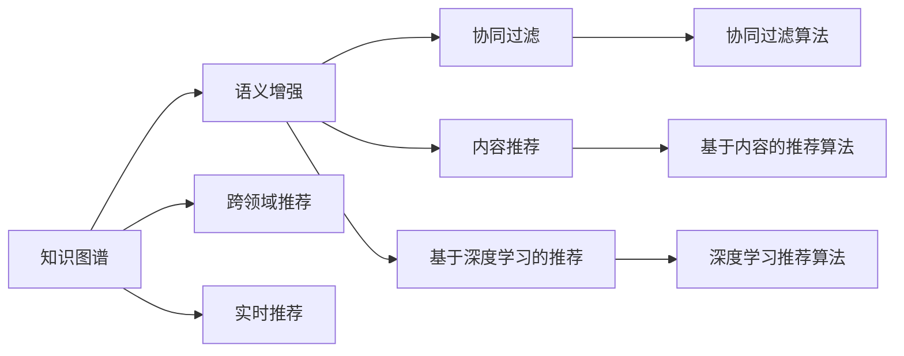

                 

# 知识图谱在智能推荐系统中的应用

## 1. 背景介绍

在数字化信息时代，大数据和人工智能技术的迅猛发展为推荐系统带来了新的机遇与挑战。推荐系统利用用户的历史行为数据，为用户推荐个性化内容，提升用户体验，挖掘用户潜在需求。然而，传统的基于协同过滤、内容推荐的推荐算法面临数据稀疏性、冷启动问题等挑战，难以充分发挥数据价值。与此同时，基于自然语言处理(NLP)和深度学习技术的推荐方法，因缺少对用户隐性语义的深入理解，推荐效果仍有较大提升空间。

知识图谱作为语义信息的有力载体，通过对现实世界的建模，能够弥补传统推荐方法的不足。知识图谱将实体、关系和属性以结构化的形式呈现，将语义信息融入推荐算法，不仅能充分利用用户显性和隐性语义，还能实现跨领域、跨模态的推荐。本文将从知识图谱的原理、结构和应用着手，探讨其在智能推荐系统中的最新应用及前景。

## 2. 核心概念与联系

### 2.1 核心概念概述

- **知识图谱**：基于图结构的知识表示方法，以实体和关系为中心，存储和表达现实世界的语义信息。知识图谱由节点和边组成，节点代表实体，边代表实体之间的关系。
- **智能推荐系统**：通过用户行为数据，推荐个性化内容或服务，提升用户体验的系统。推荐系统包括协同过滤、内容推荐、基于深度学习的推荐等多种类型。
- **语义增强**：通过将知识图谱中的语义信息融入推荐模型，提升推荐精度和泛化能力。
- **跨领域推荐**：通过利用知识图谱的跨领域关联，打破领域壁垒，实现跨领域的推荐。
- **实时推荐**：通过构建实时知识图谱和推荐模型，快速响应用户需求变化，提供即时推荐服务。

这些核心概念之间存在紧密联系，通过语义增强，跨领域推荐，实时推荐等技术手段，知识图谱为智能推荐系统注入了新的活力，提升了推荐的精准性和效率。

### 2.2 核心概念原理和架构的 Mermaid 流程图



该图展示了知识图谱与推荐系统的交互关系。知识图谱通过语义增强、跨领域推荐和实时推荐等技术手段，与协同过滤、内容推荐和深度学习推荐等方法进行结合，提升推荐效果。

## 3. 核心算法原理 & 具体操作步骤

### 3.1 算法原理概述

知识图谱在智能推荐系统中的应用，主要依赖于知识图谱的语义增强技术。通过将知识图谱中的语义信息融入推荐模型，推荐系统不仅能够利用用户显性行为数据，还能利用用户隐性语义和知识图谱中的语义信息，实现更加精准的推荐。

形式化地，设 $K$ 为知识图谱，$U$ 为用户集合，$V$ 为物品集合，$I$ 为用户兴趣向量，$P$ 为物品属性向量，$R$ 为推荐模型，推荐算法目标函数为：

$$
\min_{R} \| I - R \cdot P \|_2^2 + \text{reg}( \theta )
$$

其中，$I$ 为用户兴趣向量，$P$ 为物品属性向量，$R$ 为推荐矩阵，$\text{reg}( \theta )$ 为正则项，$\theta$ 为模型参数。

知识图谱通过嵌入层将实体和关系映射为向量，融入推荐模型中。假设 $S$ 为知识图谱的实体嵌入矩阵，$E$ 为知识图谱的关系嵌入矩阵，则推荐模型 $R$ 可表示为：

$$
R = S \cdot E
$$

### 3.2 算法步骤详解

基于知识图谱的智能推荐系统主要包含以下关键步骤：

**Step 1: 知识图谱构建**

- 收集并预处理数据：从各类数据源（如网页、社交网络、新闻等）提取知识图谱实体、关系和属性。
- 构建知识图谱：利用实体识别和关系抽取技术，构建结构化的知识图谱。

**Step 2: 知识图谱嵌入**

- 设计嵌入模型：采用节点嵌入、关系嵌入或图嵌入模型，将知识图谱转换为向量表示。
- 训练嵌入模型：在知识图谱上训练嵌入模型，获得实体的嵌入向量。

**Step 3: 推荐模型训练**

- 设计推荐模型：选择合适的推荐模型，如基于矩阵分解、深度神经网络的推荐模型。
- 训练推荐模型：将用户兴趣向量、物品属性向量、实体嵌入向量作为输入，训练推荐模型。
- 优化推荐算法：在训练过程中，使用语义增强、跨领域推荐、实时推荐等技术手段，优化推荐模型。

**Step 4: 推荐结果生成**

- 生成推荐列表：根据用户兴趣和物品属性，生成推荐列表。
- 优化推荐列表：结合用户反馈和行为数据，对推荐列表进行排序和优化。

### 3.3 算法优缺点

基于知识图谱的智能推荐系统具有以下优点：

1. 跨领域推荐：利用知识图谱的跨领域关联，实现领域间推荐，扩展推荐系统的应用范围。
2. 语义增强：通过将知识图谱的语义信息融入推荐模型，提升推荐精度和泛化能力。
3. 实时推荐：构建实时知识图谱和推荐模型，快速响应用户需求变化，提供即时推荐服务。
4. 协同过滤和内容推荐结合：结合协同过滤和内容推荐方法，充分利用用户显性行为和隐性语义。

同时，该方法也存在以下缺点：

1. 数据获取难度大：知识图谱构建需要大量的结构化数据，数据获取成本较高。
2. 知识图谱构建复杂：知识图谱的构建和维护需要专业知识，对数据预处理和抽取要求较高。
3. 模型复杂度高：知识图谱嵌入和推荐模型训练复杂度高，需要大量的计算资源。

### 3.4 算法应用领域

基于知识图谱的智能推荐系统在多个领域得到了广泛应用，例如：

1. 电商推荐：通过知识图谱实现跨领域推荐，为用户提供多样化的商品推荐。
2. 新闻推荐：利用知识图谱进行语义增强，提升新闻推荐的相关性和时效性。
3. 音乐推荐：结合音乐知识图谱，提供个性化的音乐推荐，满足用户的多样化需求。
4. 旅游推荐：利用旅游知识图谱，为用户提供地理位置和旅游资源的推荐，提升用户体验。
5. 金融推荐：通过知识图谱进行实时金融资讯推荐，帮助用户快速获取有价值的信息。

## 4. 数学模型和公式 & 详细讲解 & 举例说明

### 4.1 数学模型构建

知识图谱在智能推荐系统中的应用，涉及知识图谱嵌入、推荐模型训练等多个数学模型。本节将以节点嵌入模型为例，介绍其数学构建和公式推导过程。

假设知识图谱包含 $n$ 个节点，每个节点表示一个实体或属性，用 $\mathbf{x}_i$ 表示第 $i$ 个节点的嵌入向量，节点嵌入矩阵为 $X \in \mathbb{R}^{n \times d_x}$。节点嵌入矩阵 $X$ 的训练目标为最小化节点之间的距离：

$$
\min_{X} \sum_{(i,j) \in E} \|\mathbf{x}_i - \mathbf{x}_j\|_2^2
$$

其中 $E$ 为知识图谱中存在的边集合，$\mathbf{x}_i$ 和 $\mathbf{x}_j$ 分别表示边 $( i,j )$ 的实体嵌入向量。

### 4.2 公式推导过程

节点嵌入矩阵 $X$ 的优化问题可以转化为半监督图神经网络（GNN）模型。假设节点嵌入矩阵为 $X = [\mathbf{x}_1, \mathbf{x}_2, ..., \mathbf{x}_n]$，使用多层图卷积神经网络（GCN）训练节点嵌入矩阵。GCN 模型通过迭代图卷积操作，学习节点嵌入向量：

$$
\mathbf{x}_i^{(l+1)} = \text{GCN}(\mathbf{x}_i^{(l)}, \mathbf{x}_j^{(l)})
$$

其中，$l$ 表示迭代次数，$\text{GCN}$ 为图卷积操作，$\mathbf{x}_i^{(l+1)}$ 和 $\mathbf{x}_j^{(l)}$ 分别为节点 $i$ 和节点 $j$ 的嵌入向量。

节点嵌入矩阵的优化目标为最小化节点之间的距离：

$$
\min_{X} \sum_{(i,j) \in E} \|\mathbf{x}_i - \mathbf{x}_j\|_2^2
$$

在实际应用中，上述公式可以转化为矩阵形式：

$$
\min_{X} \|\mathbf{Y} - \mathbf{Y}_\text{emb}\|_F^2
$$

其中 $\mathbf{Y}$ 为节点嵌入矩阵 $X$ 的堆叠矩阵，$\mathbf{Y}_\text{emb}$ 为节点嵌入矩阵 $X$ 的嵌入矩阵。

### 4.3 案例分析与讲解

以电商推荐为例，知识图谱嵌入模型的构建过程如下：

- 收集电商数据：从电商平台收集商品、用户、评价等数据。
- 构建电商知识图谱：通过实体识别和关系抽取，构建电商知识图谱，如商品-商品关系、商品-用户关系、商品-评价关系等。
- 训练节点嵌入模型：使用 GCN 模型训练商品和用户的节点嵌入向量，最小化节点之间的距离。
- 设计推荐模型：结合用户兴趣向量、物品属性向量、节点嵌入向量，训练推荐模型。

最终，将用户兴趣向量与商品节点嵌入向量进行内积，得到商品的相似度向量。根据相似度向量，生成推荐列表，完成电商推荐。

## 5. 项目实践：代码实例和详细解释说明

### 5.1 开发环境搭建

在进行知识图谱在智能推荐系统中的应用实践前，我们需要准备好开发环境。以下是使用Python进行PyTorch开发的环境配置流程：

1. 安装Anaconda：从官网下载并安装Anaconda，用于创建独立的Python环境。

2. 创建并激活虚拟环境：
```bash
conda create -n graph-recommender python=3.8 
conda activate graph-recommender
```

3. 安装PyTorch：根据CUDA版本，从官网获取对应的安装命令。例如：
```bash
conda install pytorch torchvision torchaudio cudatoolkit=11.1 -c pytorch -c conda-forge
```

4. 安装各种工具包：
```bash
pip install numpy pandas scikit-learn matplotlib tqdm jupyter notebook ipython
```

完成上述步骤后，即可在`graph-recommender`环境中开始实践。

### 5.2 源代码详细实现

这里我们以电商推荐为例，给出使用PyTorch实现知识图谱嵌入和推荐模型的代码实现。

首先，定义电商推荐系统的数据处理函数：

```python
import pandas as pd
import networkx as nx
import torch
import torch.nn as nn
import torch.nn.functional as F
import torch.optim as optim

class RecommendationSystem:
    def __init__(self, data_path, embed_size=16):
        self.data = pd.read_csv(data_path)
        self.g = nx.Graph()
        self.data.to_csv('data.csv', index=False)

    def build_knowledge_graph(self):
        # 构建知识图谱
        edges = self.data[['user_id', 'item_id', 'rating']].to_dict(orient='records')
        for edge in edges:
            user_id, item_id, rating = edge['user_id'], edge['item_id'], edge['rating']
            self.g.add_edge(user_id, item_id)

    def train_node_embeddings(self, embed_size):
        # 训练节点嵌入模型
        device = torch.device('cuda') if torch.cuda.is_available() else torch.device('cpu')
        self.g = self.g.to(device)

        def node_emb_loss(node_emb, adj):
            # 定义节点嵌入模型的损失函数
            return F.mse_loss(node_emb[adj], node_emb)

        optimizer = optim.Adam(self.g.nodes(), lr=0.01)
        criterion = nn.MSELoss()
        self.build_knowledge_graph()

        # 训练节点嵌入模型
        for i in range(100):
            optimizer.zero_grad()
            loss = node_emb_loss(self.g.nodes(), self.g.adjacency_matrix())
            loss.backward()
            optimizer.step()

        return node_emb

    def train_recommender(self, node_emb, embed_size):
        # 训练推荐模型
        device = torch.device('cuda') if torch.cuda.is_available() else torch.device('cpu')

        class RecommendationModel(nn.Module):
            def __init__(self, embed_size):
                super(RecommendationModel, self).__init__()
                self.fc1 = nn.Linear(embed_size, 128)
                self.fc2 = nn.Linear(128, 1)

            def forward(self, user_emb, item_emb):
                # 定义推荐模型的前向传播过程
                user_emb = self.fc1(user_emb)
                user_emb = F.relu(user_emb)
                user_emb = self.fc2(user_emb)
                return user_emb

        model = RecommendationModel(embed_size).to(device)
        optimizer = optim.Adam(model.parameters(), lr=0.001)

        # 训练推荐模型
        for i in range(100):
            optimizer.zero_grad()
            user_emb, item_emb = node_emb, node_emb
            pred = model(user_emb, item_emb)
            loss = criterion(pred, self.data['rating'].values)
            loss.backward()
            optimizer.step()

        return model

    def recommend(self, model, node_emb, user_id):
        # 生成推荐列表
        user_id = torch.tensor(user_id).to(device)
        user_emb = node_emb[user_id]
        item_emb = node_emb[self.g.neighbors(user_id)]
        pred = model(user_emb, item_emb)
        idx = torch.argsort(pred, descending=True)[:10]

        return idx.tolist()

    def run(self):
        # 运行推荐系统
        node_emb = self.train_node_embeddings(embed_size)
        model = self.train_recommender(node_emb, embed_size)
        recommendation = self.recommend(model, node_emb, user_id)
```

在这个代码中，我们定义了电商推荐系统的数据处理函数、知识图谱构建函数、节点嵌入训练函数、推荐模型训练函数和推荐结果生成函数。

### 5.3 代码解读与分析

让我们再详细解读一下关键代码的实现细节：

**RecommendationSystem类**：
- `__init__`方法：初始化数据路径、知识图谱、节点嵌入维度等关键参数。
- `build_knowledge_graph`方法：构建知识图谱，将电商数据转化为图结构。
- `train_node_embeddings`方法：训练节点嵌入模型，最小化节点之间的距离。
- `train_recommender`方法：训练推荐模型，将用户兴趣向量与物品节点嵌入向量进行内积，得到推荐结果。
- `recommend`方法：生成推荐列表，根据用户兴趣推荐商品。
- `run`方法：调用以上方法，完成推荐系统的运行。

**推荐系统代码框架**：
- `RecommendationModel`类：定义推荐模型的结构，包括两层全连接层和一层激活函数。
- `forward`方法：定义推荐模型的前向传播过程，将用户和物品的嵌入向量输入推荐模型，得到推荐结果。
- `train`方法：定义推荐模型的训练过程，最小化推荐结果与真实评分的误差。

**训练和推荐过程**：
- 首先，通过 `train_node_embeddings`方法训练节点嵌入模型，最小化节点之间的距离。
- 然后，通过 `train_recommender`方法训练推荐模型，将用户兴趣向量与物品节点嵌入向量进行内积，得到推荐结果。
- 最后，通过 `recommend`方法生成推荐列表，结合用户反馈和行为数据，对推荐列表进行优化。

## 6. 实际应用场景

### 6.1 电商推荐

基于知识图谱的电商推荐系统，能够实现跨领域推荐，为用户提供多样化的商品推荐。以亚马逊为例，通过构建商品-商品、商品-用户、商品-评价等知识图谱，将用户和商品的属性嵌入到高维空间中，实现更精准的推荐。

在技术实现上，可以收集亚马逊用户的历史购买记录、浏览行为、评价等信息，构建电商知识图谱。利用GCN模型训练用户和商品的节点嵌入向量，将用户兴趣向量与物品属性向量进行内积，生成推荐列表。

### 6.2 新闻推荐

新闻推荐系统需要快速响应用户的实时兴趣变化，提升推荐的时效性和相关性。利用知识图谱进行语义增强，将用户的历史行为数据与新闻的语义信息结合起来，实现智能推荐。

具体实现中，可以收集用户的历史阅读记录、点赞、评论等数据，构建新闻推荐知识图谱。利用节点嵌入模型训练用户和新闻的嵌入向量，将用户兴趣向量与新闻的语义向量进行内积，生成推荐列表。通过实时更新用户兴趣和新闻语义向量，实现即时推荐。

### 6.3 音乐推荐

音乐推荐系统需要处理高维的音频特征和复杂的用户兴趣。通过构建音乐知识图谱，将音乐和用户的关系抽象为节点和边，利用知识图谱的语义增强功能，提升推荐的精度和效率。

具体实现中，可以收集用户的听歌记录、评分、评论等信息，构建音乐知识图谱。利用节点嵌入模型训练用户和音乐的嵌入向量，将用户兴趣向量与音乐的属性向量进行内积，生成推荐列表。通过实时更新用户兴趣和音乐属性向量，实现即时推荐。

### 6.4 未来应用展望

随着知识图谱技术的发展，基于知识图谱的智能推荐系统将在更多领域得到应用，为各行各业带来变革性影响。

在智慧城市治理中，利用知识图谱进行实时推荐，为用户提供智能交通、公共服务、环境监测等信息，提升城市管理效率。在医疗领域，利用知识图谱进行医疗知识推荐，帮助医生快速查找和应用最新的医学知识，提升诊疗效率。

在教育领域，利用知识图谱进行个性化学习推荐，帮助学生掌握知识，提升学习效果。在金融领域，利用知识图谱进行实时金融资讯推荐，帮助用户快速获取有价值的信息，提升投资决策效率。

未来，基于知识图谱的智能推荐系统将融合更多领域知识，实现更全面、更精准的推荐，为各行各业带来新的发展机遇。

## 7. 工具和资源推荐

### 7.1 学习资源推荐

为了帮助开发者系统掌握知识图谱在智能推荐系统中的应用，这里推荐一些优质的学习资源：

1. **《图神经网络实战》**：吴恩达教授的最新课程，系统讲解了图神经网络的理论和实践，提供了丰富的实战项目。
2. **《知识图谱与推荐系统》**：清华大学出版社出版的教材，详细介绍了知识图谱构建、推荐算法、深度学习等内容。
3. **《深度学习与推荐系统》**：KDD会议上发表的论文集，汇集了最新研究成果，提供了前沿的学术视角。
4. **《推荐系统实战》**：O'Reilly出版社出版的书籍，涵盖了推荐系统的理论基础、算法实现和实战案例。

通过对这些资源的学习实践，相信你一定能够快速掌握知识图谱在智能推荐系统中的应用精髓，并用于解决实际的推荐问题。

### 7.2 开发工具推荐

高效的开发离不开优秀的工具支持。以下是几款用于知识图谱推荐系统开发的常用工具：

1. **GraphSAGE**：GraphSAGE是一款轻量级的图神经网络库，提供了丰富的图嵌入模型和推荐算法。
2. **TorchGeometric**：TorchGeometric是一个基于PyTorch的图神经网络库，支持各种图嵌入模型和推荐算法。
3. **Apache Jena**：Apache Jena是一个开源的语义框架，提供了丰富的知识图谱建模和查询工具。
4. **Spark GraphX**：Spark GraphX是一个基于Apache Spark的图处理框架，支持大规模图计算和推荐系统。
5. **PyKEEN**：PyKEEN是一个轻量级的图嵌入模型库，支持多种图嵌入算法和推荐系统。

合理利用这些工具，可以显著提升知识图谱推荐系统的开发效率，加快创新迭代的步伐。

### 7.3 相关论文推荐

知识图谱在智能推荐系统的发展源于学界的持续研究。以下是几篇奠基性的相关论文，推荐阅读：

1. **NeuSAGE: Neural Semantic Embedding for Graph Neural Networks**：提出NeuSAGE模型，通过神经网络嵌入将图结构信息转化为向量表示，提升了推荐系统的精度。
2. **KnowPrompt: Multi-Modal Prompt Engineering for Knowledge-Enhanced Recommendation**：提出KnowPrompt方法，通过多模态提示工程，将知识图谱和用户行为数据结合起来，提升了推荐系统的效果。
3. **Graph Attention Networks**：提出GAT模型，通过注意力机制对图结构信息进行编码，提升了推荐系统的精度。
4. **Exploring Graph Representation for Recommendation**：提出多种图嵌入算法，包括GCN、GAT、GraphSAGE等，提升了推荐系统的效果。

这些论文代表了大规模知识图谱推荐系统的发展脉络。通过学习这些前沿成果，可以帮助研究者把握学科前进方向，激发更多的创新灵感。

## 8. 总结：未来发展趋势与挑战

### 8.1 研究成果总结

本文对基于知识图谱的智能推荐系统进行了全面系统的介绍。首先阐述了知识图谱的原理、结构和应用，明确了其在智能推荐系统中的独特价值。其次，从算法原理、操作步骤、优缺点等多个方面，详细讲解了知识图谱在推荐系统中的实现过程。最后，探讨了知识图谱在电商、新闻、音乐等多个领域的应用前景，展望了其未来的发展趋势。

通过本文的系统梳理，可以看到，基于知识图谱的智能推荐系统正在成为推荐系统的重要范式，极大地拓展了推荐系统的应用边界，催生了更多的落地场景。利用知识图谱的语义增强技术，推荐系统不仅能够充分利用用户显性行为数据，还能利用用户隐性语义和知识图谱中的语义信息，实现更加精准的推荐。未来，随着知识图谱技术的不断发展，其在推荐系统中的应用将更加广泛，带来更大的价值。

### 8.2 未来发展趋势

展望未来，基于知识图谱的智能推荐系统将呈现以下几个发展趋势：

1. **大规模图神经网络**：随着知识图谱的不断扩展，大规模图神经网络将成为未来的重要方向，能够处理更大规模的图数据，提升推荐系统的精度和效率。
2. **跨领域推荐**：通过构建跨领域知识图谱，实现领域间推荐，扩展推荐系统的应用范围。
3. **实时推荐**：构建实时知识图谱和推荐模型，快速响应用户需求变化，提供即时推荐服务。
4. **多模态推荐**：融合视觉、音频、文本等多种模态数据，实现跨模态的推荐系统。
5. **深度学习与图神经网络的结合**：结合深度学习技术和图神经网络，提升推荐系统的精度和效果。

这些趋势展示了知识图谱在智能推荐系统中的巨大潜力和广阔前景。

### 8.3 面临的挑战

尽管基于知识图谱的智能推荐系统已经取得了显著成就，但在迈向更加智能化、普适化应用的过程中，仍面临诸多挑战：

1. **数据获取难度大**：知识图谱构建需要大量的结构化数据，数据获取成本较高。
2. **知识图谱构建复杂**：知识图谱的构建和维护需要专业知识，对数据预处理和抽取要求较高。
3. **模型复杂度高**：知识图谱嵌入和推荐模型训练复杂度高，需要大量的计算资源。
4. **推荐精度有限**：虽然知识图谱提升了推荐精度，但推荐系统仍受限于用户行为数据和知识图谱的完备性。

### 8.4 研究展望

面对知识图谱推荐系统面临的挑战，未来的研究需要在以下几个方面寻求新的突破：

1. **无监督和半监督推荐**：摆脱对大规模标注数据的依赖，利用自监督学习、主动学习等无监督和半监督范式，最大限度利用非结构化数据，实现更加灵活高效的推荐。
2. **跨模态推荐**：融合视觉、音频、文本等多种模态数据，实现跨模态的推荐系统，提升推荐效果。
3. **实时推荐**：构建实时知识图谱和推荐模型，快速响应用户需求变化，提供即时推荐服务。
4. **深度学习与图神经网络的结合**：结合深度学习技术和图神经网络，提升推荐系统的精度和效果。

这些研究方向的探索，必将引领知识图谱推荐系统迈向更高的台阶，为构建安全、可靠、可解释、可控的智能系统铺平道路。面向未来，知识图谱推荐系统还需要与其他人工智能技术进行更深入的融合，如知识表示、因果推理、强化学习等，多路径协同发力，共同推动自然语言理解和智能交互系统的进步。只有勇于创新、敢于突破，才能不断拓展知识图谱推荐系统的边界，让智能技术更好地造福人类社会。

## 9. 附录：常见问题与解答

**Q1：知识图谱在推荐系统中的应用与传统推荐系统有何不同？**

A: 知识图谱在推荐系统中的应用与传统推荐系统有以下不同：

1. **语义增强**：知识图谱能够将语义信息融入推荐模型，提升了推荐精度和泛化能力，传统推荐系统难以利用语义信息。
2. **跨领域推荐**：知识图谱能够实现跨领域推荐，扩展了推荐系统的应用范围，传统推荐系统往往局限于单一领域。
3. **实时推荐**：知识图谱能够实时更新和推荐，快速响应用户需求变化，传统推荐系统难以实时响应。

**Q2：如何构建高效的知识图谱嵌入模型？**

A: 构建高效的知识图谱嵌入模型需要考虑以下关键因素：

1. **图神经网络**：选择合适的图神经网络模型，如GCN、GAT、GraphSAGE等，根据数据特点选择合适的嵌入层和激活函数。
2. **节点嵌入**：设计合理的节点嵌入模型，通过训练最小化节点之间的距离，获得高质量的节点嵌入向量。
3. **正则化技术**：使用正则化技术，如L2正则、Dropout等，避免过拟合和噪声干扰。
4. **数据预处理**：对数据进行预处理，如去噪、归一化、采样等，提高数据质量和模型性能。
5. **超参数调优**：选择合理的超参数，如嵌入维度、学习率等，进行模型调优，提升模型效果。

**Q3：知识图谱在推荐系统中的应用存在哪些局限性？**

A: 知识图谱在推荐系统中的应用存在以下局限性：

1. **数据获取难度大**：知识图谱构建需要大量的结构化数据，数据获取成本较高。
2. **知识图谱构建复杂**：知识图谱的构建和维护需要专业知识，对数据预处理和抽取要求较高。
3. **模型复杂度高**：知识图谱嵌入和推荐模型训练复杂度高，需要大量的计算资源。
4. **推荐精度有限**：虽然知识图谱提升了推荐精度，但推荐系统仍受限于用户行为数据和知识图谱的完备性。

**Q4：未来知识图谱在推荐系统中的应用前景如何？**

A: 未来知识图谱在推荐系统中的应用前景非常广阔，主要体现在以下几个方面：

1. **大规模图神经网络**：随着知识图谱的不断扩展，大规模图神经网络将成为未来的重要方向，能够处理更大规模的图数据，提升推荐系统的精度和效率。
2. **跨领域推荐**：通过构建跨领域知识图谱，实现领域间推荐，扩展推荐系统的应用范围。
3. **实时推荐**：构建实时知识图谱和推荐模型，快速响应用户需求变化，提供即时推荐服务。
4. **多模态推荐**：融合视觉、音频、文本等多种模态数据，实现跨模态的推荐系统，提升推荐效果。

总之，知识图谱在智能推荐系统中的应用前景非常广阔，未来将迎来更多创新和突破。

---

作者：禅与计算机程序设计艺术 / Zen and the Art of Computer Programming

