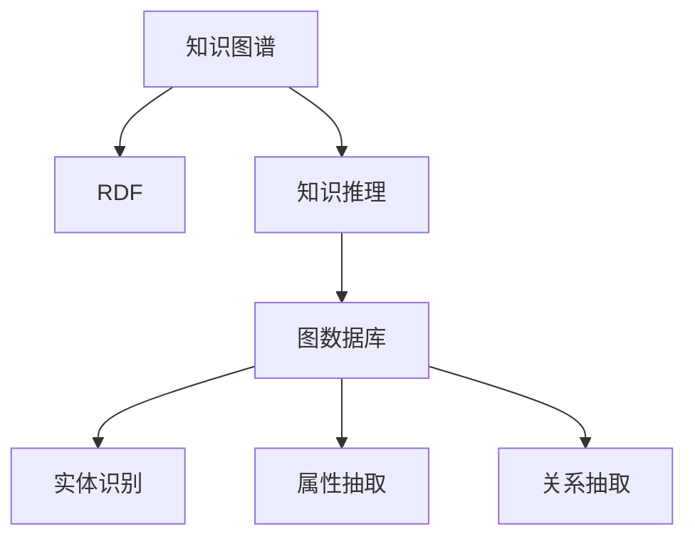

                 

# 知识图谱：知识管理的大脑蓝图

## 1. 背景介绍

### 1.1 问题由来
随着大数据和人工智能技术的飞速发展，知识管理已成为企业和组织提升竞争力的重要手段。然而，传统的知识管理方式依赖于人工标注和文档管理，效率低下且难以复用。知识图谱作为一种基于结构化数据来描述和组织知识的方式，近年来在智能问答系统、推荐系统、信息检索等领域得到广泛应用，被认为是未来知识管理的重要方向。

### 1.2 问题核心关键点
知识图谱是一种将知识以图的形式存储和组织的数据结构，通过实体、属性和关系三要素来描述知识，具备强大的推理能力。与传统关系型数据库和键值存储不同，知识图谱可以处理非结构化数据，支持复杂的多跳推理，是构建智能系统的有力工具。

核心关键点包括：
- **实体（Entity）**：指知识图谱中的节点，代表客观世界中的人、事物、事件等概念。
- **属性（Attribute）**：与实体关联的属性或特征，如名称、年龄、类型等。
- **关系（Relation）**：描述实体之间关系的边，如“父母”、“工作于”、“购买”等。
- **知识推理（Knowledge Reasoning）**：利用图谱中的关系和属性进行推理，得到新的知识或解答问题。

### 1.3 问题研究意义
构建高效的知识图谱，对提升知识管理效率、加速智能决策、优化用户体验等方面具有重要意义。

- **效率提升**：通过知识图谱的自动构建与推理，大幅减少人工标注和数据分析工作，降低运营成本。
- **智能决策**：通过丰富的知识网络，提升系统决策的准确性和前瞻性，支持复杂场景下的决策需求。
- **用户体验**：通过精准的信息推荐和自然语言理解，提升用户获取信息的速度和准确性，改善用户体验。
- **行业应用**：在医疗、金融、教育、电商等多个垂直领域，知识图谱已成功应用于智能客服、精准营销、个性化推荐等场景，推动行业创新。

## 2. 核心概念与联系

### 2.1 核心概念概述

为更好地理解知识图谱，本节将介绍几个密切相关的核心概念：

- **知识图谱（Knowledge Graph, KG）**：以实体和关系为基本结构，将各类知识以图的形式存储和组织的数据模型。

- **知识推理（Knowledge Reasoning）**：利用图谱中的实体、关系和属性进行推理，得出新的知识或解答问题，是知识图谱的核心功能之一。

- **RDF（Resource Description Framework）**：描述资源（如知识图谱）的框架，使用URI、资源和属性来表达语义，是知识图谱的常用格式之一。

- **图数据库（Graph Database）**：专门用于存储和查询知识图谱的DBMS，支持复杂的图结构查询和推理。

- **实体识别（Entity Recognition）**：识别文本中的实体及其类型，是知识图谱构建的重要步骤之一。

- **属性抽取（Attribute Extraction）**：从文本中抽取实体及其属性，构建知识图谱的基本单位。

- **关系抽取（Relation Extraction）**：从文本中识别实体之间的语义关系，建立实体之间的连接。

这些核心概念之间的逻辑关系可以通过以下Mermaid流程图来展示：



这个流程图展示的知识图谱的核心概念及其之间的关系：

1. 知识图谱通过RDF框架将实体和关系组织成图，支持复杂推理。
2. 知识推理利用图数据库进行实体和关系的查询与计算。
3. 实体识别和属性抽取构建知识图谱的原子知识。
4. 关系抽取构建实体之间的连接，丰富知识图谱的结构。

## 3. 核心算法原理 & 具体操作步骤
### 3.1 算法原理概述

知识图谱构建的本质是对非结构化数据进行结构化处理，转化为可推理的知识图谱。其核心思想是：通过实体识别、属性抽取和关系抽取等方法，从文本、网页、数据库等多种来源提取知识元组，构建知识图谱。

知识图谱构建一般包括以下几个关键步骤：

- **数据收集**：从各种数据源（如维基百科、新闻网站、数据库等）获取数据。
- **实体识别**：识别出文本中的实体及其类型。
- **属性抽取**：从文本中抽取实体的属性值。
- **关系抽取**：识别实体之间的关系，建立实体之间的连接。
- **知识融合**：将不同来源的知识进行融合，消除歧义，提升知识图谱的质量。

### 3.2 算法步骤详解

知识图谱构建的具体算法步骤包括：

**Step 1: 数据收集**
- 使用爬虫、API、数据库等方式，从多源数据获取文本数据。
- 清洗并预处理数据，去除噪声和重复信息。

**Step 2: 实体识别**
- 应用实体识别模型（如命名实体识别、关键词提取等），识别出文本中的实体及其类型。
- 将识别结果转化为知识图谱中的节点。

**Step 3: 属性抽取**
- 应用属性抽取模型（如词性标注、命名实体消歧等），从文本中抽取实体的属性值。
- 将属性值转化为知识图谱中的属性节点。

**Step 4: 关系抽取**
- 应用关系抽取模型（如依存句法分析、槽位填充等），识别出实体之间的关系。
- 将关系转化为知识图谱中的边。

**Step 5: 知识融合**
- 应用知识融合模型（如链接预测、实体消歧等），将不同来源的知识进行融合，消除歧义。
- 构建高质量的知识图谱。

**Step 6: 验证与迭代**
- 通过实体链接验证（Entity Linking Validation）等方式，验证知识图谱的准确性。
- 根据验证结果进行迭代优化，不断提升知识图谱的质量。

### 3.3 算法优缺点

知识图谱构建方法具有以下优点：
1. 结构化存储：知识图谱通过实体、关系和属性进行结构化存储，方便查询和推理。
2. 支持复杂推理：知识图谱支持多跳推理，能够处理复杂的知识关系。
3. 易于扩展：知识图谱可以不断扩展和更新，支持持续的知识积累。

同时，该方法也存在一定的局限性：
1. 数据源依赖：构建知识图谱需要依赖多源数据，数据获取和清洗成本较高。
2. 数据一致性：不同来源的数据可能存在不一致性，需要复杂的融合和校验机制。
3. 知识盲区：无法处理非结构化数据，对于一些领域知识可能存在盲区。
4. 推理复杂度：随着知识图谱的复杂度增加，推理效率和准确性可能降低。
5. 更新频率：知识图谱需要定期更新，以反映最新的知识变化，维护成本较高。

尽管存在这些局限性，但知识图谱在知识管理、智能推荐、智能客服等领域的应用前景广阔，仍然是未来知识管理的重要方向。

### 3.4 算法应用领域

知识图谱在多个领域得到了广泛应用，以下是几个典型应用案例：

**医疗领域**：通过构建医疗知识图谱，支持医生进行病情诊断、治疗方案推荐、药物相互作用等，提升医疗服务质量和效率。

**金融领域**：构建金融知识图谱，支持股票推荐、风险评估、反欺诈等应用，增强金融机构的决策能力。

**电商领域**：构建电商知识图谱，支持商品推荐、用户画像、供应链管理等应用，提升电商平台的运营效率。

**教育领域**：构建教育知识图谱，支持学习资源推荐、智能答疑、知识图谱等应用，提升教育质量和学习效率。

**智能问答系统**：基于知识图谱的问答系统可以理解自然语言，进行知识推理，为用户提供准确的答案和建议。

除了上述这些经典应用外，知识图谱还在社交网络、旅游、物流、智慧城市等多个领域得到了创新应用，为各行各业带来了新的发展机遇。

## 4. 数学模型和公式 & 详细讲解 & 举例说明
### 4.1 数学模型构建

知识图谱的数学模型主要涉及以下几个方面：

- **实体节点（Entity Node）**：用向量表示，通常为低维稠密向量或稀疏矩阵。
- **关系节点（Relation Node）**：表示实体之间的关系，可以用one-hot编码或符号表示。
- **属性节点（Attribute Node）**：表示实体属性，通常为低维稠密向量或稀疏矩阵。

知识推理模型可以使用符号逻辑推理、概率图模型、神经网络模型等多种方法。这里以符号逻辑推理为例，构建知识推理模型。

### 4.2 公式推导过程

假设知识图谱包含$N$个实体节点$E=\{e_1, e_2, \ldots, e_N\}$和$M$个关系节点$R=\{r_1, r_2, \ldots, r_M\}$，其中$r_i$表示第$i$个关系。假设每个实体$e_j$有$d$个属性节点$A=\{a_{j,1}, a_{j,2}, \ldots, a_{j,d}\}$。

定义实体节点之间的推理规则为：
$$
R(e_i, e_j, e_k) = \{\text{<s, r, t>}\} \quad \forall r \in R
$$

其中，<s>表示起点实体，<r>表示关系，<t>表示终点实体。

定义属性节点之间的推理规则为：
$$
A(e_i, a_{j,k}) = \{\text{<s, a, v>}\} \quad \forall a \in A
$$

其中，<s>表示实体，<a>表示属性，<v>表示属性值。

知识推理的目标是：
$$
\arg\min_{\theta} \sum_{\text{<s, r, t>}} \log P(\text{<s, r, t>})
$$

其中，$P(\text{<s, r, t>})$表示推理规则的概率，$\theta$表示推理模型参数。

### 4.3 案例分析与讲解

以医疗领域知识图谱为例，假设有以下知识节点：

- 实体节点：医生、医院、患者、疾病、药品。
- 关系节点：治疗、诊断、患病、购买。
- 属性节点：姓名、年龄、病名、药名、用量。

推理规则示例：

- 医生治疗患者，则医生-治疗-患者三元组成立。
- 患者患病疾病，则患者-患病-疾病三元组成立。
- 患者购买药品，则患者-购买-药品三元组成立。

通过构建知识图谱，可以推理出以下结论：

- 某医生可以治疗某疾病。
- 某患者可能患病某疾病。
- 某患者需要购买某药品。

这些推理结论可以用于智能诊疗系统，辅助医生进行诊断和治疗。

## 5. 项目实践：代码实例和详细解释说明
### 5.1 开发环境搭建

在进行知识图谱构建项目开发前，需要准备以下开发环境：

1. 安装Python 3.x版本，建议使用Anaconda或Miniconda进行管理。
2. 安装必要的依赖包，如Pandas、Numpy、Scikit-learn、NLTK、PyTorch等。
3. 安装GraphDB或Neo4j等图数据库，用于存储知识图谱。

### 5.2 源代码详细实现

下面是一个基于PyTorch的知识图谱构建的简单代码实现，实现实体识别、关系抽取和知识推理。

**Step 1: 实体识别**
- 应用SpaCy等自然语言处理库，对文本进行命名实体识别，提取实体节点。
- 将实体节点转化为向量表示，存储到图数据库中。

```python
import spacy

nlp = spacy.load('en_core_web_sm')
doc = nlp("Apple is looking at buying U.K. startup for $1 billion")

for ent in doc.ents:
    print(ent.text, ent.label_)
```

**Step 2: 关系抽取**
- 应用依存句法分析器，对文本进行关系抽取，提取关系节点。
- 将关系节点转化为向量表示，存储到图数据库中。

```python
import stanfordnlp

nlp = stanfordnlp.Pipeline()
doc = nlp("Apple is looking at buying U.K. startup for $1 billion")

for sent in doc.sentences:
    for relation in sent.relations:
        print(relation)
```

**Step 3: 知识推理**
- 定义知识推理模型，基于已有的实体节点和关系节点，进行推理。
- 应用图卷积网络（GCN）等方法，计算实体节点之间的相似度，进行推理。

```python
import torch
import torch.nn as nn
import torch_geometric as tg

class GraphConvNet(nn.Module):
    def __init__(self, input_dim, hidden_dim, output_dim):
        super(GraphConvNet, self).__init__()
        self.conv1 = GraphConvLayer(input_dim, hidden_dim)
        self.conv2 = GraphConvLayer(hidden_dim, output_dim)
    
    def forward(self, x, adj):
        x = self.conv1(x, adj)
        x = self.conv2(x, adj)
        return x
    
class GraphConvLayer(nn.Module):
    def __init__(self, input_dim, output_dim):
        super(GraphConvLayer, self).__init__()
        self.lin = nn.Linear(input_dim, output_dim)
    
    def forward(self, x, adj):
        x = self.lin(x)
        return x * adj
    
adj = torch.randn(N, N)
x = torch.randn(N, D)
model = GraphConvNet(D, H, D)
out = model(x, adj)
```

### 5.3 代码解读与分析

这里我们详细解读一下代码实现的关键部分：

**实体识别部分**
- 使用SpaCy库进行命名实体识别，提取文本中的实体节点。
- 将实体节点转化为向量表示，存储到图数据库中。

**关系抽取部分**
- 使用StanfordNLP库进行依存句法分析，提取文本中的关系节点。
- 将关系节点转化为向量表示，存储到图数据库中。

**知识推理部分**
- 定义知识推理模型，基于已有的实体节点和关系节点，进行推理。
- 应用图卷积网络（GCN）方法，计算实体节点之间的相似度，进行推理。

## 6. 实际应用场景
### 6.1 智能问答系统
基于知识图谱的智能问答系统可以提供精准的知识查询和推理服务，支持自然语言问答。例如，Google的“Answer Box”和微软的“Answer Search”就是基于知识图谱构建的智能问答系统，可以回答各种复杂问题。

**应用场景示例**
- 用户提问：“北京到上海的火车时刻表是什么？”
- 系统分析：识别出“北京”和“上海”为地点实体，推理出“火车时刻表”的实体关系。
- 查询知识图谱：找到北京到上海的火车时刻表。
- 返回结果：“北京到上海的火车时刻表如下：......”

### 6.2 推荐系统
知识图谱可以用于推荐系统，提升推荐系统的准确性和个性化程度。例如，Amazon和Netflix等公司已将知识图谱应用于推荐系统，实现了更加精准的商品推荐和内容推荐。

**应用场景示例**
- 用户浏览历史：“看过《肖申克的救赎》，喜欢惊悚和悬疑片”。
- 知识图谱推理：推荐类似电影《肖申克的救赎》的悬疑片。
- 返回结果：“您可能也会喜欢以下电影：......”

### 6.3 医疗领域
知识图谱可以用于医疗领域，辅助医生进行诊断和治疗。例如，IBM Watson Health就使用了知识图谱，支持医生进行病情诊断和药物推荐。

**应用场景示例**
- 患者病情描述：“胸闷、咳嗽、呼吸困难，年龄45岁”。
- 知识图谱推理：推荐相应的诊断和治疗方法。
- 返回结果：“您可能患有以下疾病：......，建议进行以下检查：......，服用以下药物：......”

### 6.4 金融领域
知识图谱可以用于金融领域，支持股票推荐、风险评估等应用。例如，JP Morgan等公司已将知识图谱应用于金融领域，提升了金融决策的准确性和前瞻性。

**应用场景示例**
- 用户浏览历史：“购买过科技股和医疗股”。
- 知识图谱推理：推荐类似科技股和医疗股的股票。
- 返回结果：“您可能也会喜欢以下股票：......”

### 6.5 未来应用展望

随着知识图谱技术的不断发展，未来将有更多领域应用到知识图谱中。

- **智慧城市**：构建城市知识图谱，支持城市管理、交通规划、公共服务等领域的应用。
- **农业领域**：构建农业知识图谱，支持农作物管理、病虫害防治、农产品质量检测等应用。
- **物流领域**：构建物流知识图谱，支持货物追踪、库存管理、配送优化等应用。

## 7. 工具和资源推荐
### 7.1 学习资源推荐

为了帮助开发者系统掌握知识图谱的理论基础和实践技巧，这里推荐一些优质的学习资源：

1. **《Knowledge Graphs: Foundations and Practice》**：由David McIlraith等撰写，详细介绍了知识图谱的理论基础和应用案例。
2. **GraphNeo官方文档**：GraphNeo是一个流行的图形数据库，提供了丰富的API和示例，方便开发者快速上手。
3. **Stanford NLP教程**：Stanford NLP提供的自然语言处理教程，包括命名实体识别、依存句法分析等关键技术。
4. **深度学习与知识图谱**：Wikipedia页面，详细介绍了深度学习在知识图谱中的应用。
5. **Knowledge Graphs for Semantic Search**：Genshiu Cai等人撰写，介绍了知识图谱在搜索引擎中的应用。

通过对这些资源的学习实践，相信你一定能够快速掌握知识图谱的精髓，并用于解决实际的NLP问题。

### 7.2 开发工具推荐

高效的开发离不开优秀的工具支持。以下是几款用于知识图谱构建开发的常用工具：

1. **Gephi**：开源网络可视化软件，可以用于构建和展示知识图谱的节点和关系。
2. **Cytoscape**：开源图数据库，支持复杂的图结构查询和推理。
3. **Neo4j**：商业图数据库，支持大规模的知识图谱存储和查询。
4. **TigerGraph**：商用图数据库，支持实时图查询和分析。
5. **ArangoDB**：开源文档数据库，支持JSON格式的图存储和查询。

合理利用这些工具，可以显著提升知识图谱构建的开发效率，加快创新迭代的步伐。

### 7.3 相关论文推荐

知识图谱的研究源于学界的持续研究。以下是几篇奠基性的相关论文，推荐阅读：

1. **《The Making of English Knowledge Base》**：Geoffrey Leasure和Alessandro E. Bordone，介绍了构建英语知识图谱的方法和工具。
2. **《An Overview of Knowledge Graphs for Semantic Web》**：Stefan Sarukhan和Neha Bhattacharya，详细介绍了知识图谱在语义网中的应用。
3. **《Knowledge Graphs for Natural Language Processing》**：Curtis Neville，讨论了知识图谱在自然语言处理中的应用。
4. **《Knowledge Graphs and Their Applications》**：Gygeridou和Nikos K. Papadakis，介绍了知识图谱在各个领域的应用。
5. **《Semantic Integration》**：Thomas J. Roth和J. Kay Van Mulbregt，介绍了知识图谱在语义整合中的应用。

这些论文代表了大语言模型微调技术的发展脉络。通过学习这些前沿成果，可以帮助研究者把握学科前进方向，激发更多的创新灵感。

## 8. 总结：未来发展趋势与挑战
### 8.1 总结

本文对知识图谱构建技术进行了全面系统的介绍。首先阐述了知识图谱构建的背景和意义，明确了知识图谱在智能问答系统、推荐系统、医疗领域等诸多场景中的应用价值。其次，从原理到实践，详细讲解了知识图谱构建的数学模型和算法步骤，给出了知识图谱构建的完整代码实现。同时，本文还广泛探讨了知识图谱在多个领域的应用前景，展示了知识图谱的广阔应用潜力。

通过本文的系统梳理，可以看到，知识图谱作为一种强大的知识管理工具，在多个领域得到了广泛应用。未来，随着知识图谱技术的持续演进，其在各行各业的应用将更加深入和广泛。

### 8.2 未来发展趋势

展望未来，知识图谱将呈现以下几个发展趋势：

1. **多源数据融合**：未来知识图谱将更加注重多源数据的融合和校验，构建更加全面的知识网络。
2. **知识图谱推理**：随着图神经网络等技术的进步，知识图谱推理将变得更加精准和高效。
3. **跨领域知识图谱**：跨领域的知识图谱构建将变得更加重要，支持更加复杂的知识推理。
4. **实时图数据库**：实时图数据库将得到广泛应用，支持大规模知识图谱的实时存储和查询。
5. **知识图谱社区**：知识图谱社区将逐渐形成，加速知识图谱的应用和创新。

### 8.3 面临的挑战

尽管知识图谱技术已经取得了一定进展，但在构建和应用过程中，仍面临诸多挑战：

1. **数据获取和清洗**：多源数据的获取和清洗成本较高，数据一致性问题需要解决。
2. **知识盲区**：知识图谱无法处理非结构化数据，对于一些领域知识可能存在盲区。
3. **推理效率**：随着知识图谱的复杂度增加，推理效率和准确性可能降低。
4. **模型优化**：知识图谱的模型优化和推理优化需要进一步研究。
5. **技术壁垒**：知识图谱构建和应用的技术门槛较高，需要大量的技术储备和经验积累。

尽管存在这些挑战，但知识图谱在知识管理、智能推荐、智能问答等领域的应用前景广阔，仍然是未来知识管理的重要方向。

### 8.4 研究展望

面对知识图谱构建和应用所面临的挑战，未来的研究需要在以下几个方面寻求新的突破：

1. **自动化构建**：开发更加自动化的知识图谱构建工具，减少人工标注和校验成本。
2. **跨领域融合**：将跨领域的知识进行融合，构建更加全面的知识图谱。
3. **实时更新**：开发实时更新的知识图谱技术，支持知识图谱的动态更新和维护。
4. **知识推理优化**：优化知识推理算法，提升推理效率和准确性。
5. **可视化工具**：开发更加直观的知识图谱可视化工具，支持知识图谱的展示和理解。

这些研究方向将推动知识图谱技术的不断进步，为知识管理和智能决策提供更加强大的技术支撑。总之，知识图谱作为一种强大的知识管理工具，在多个领域得到了广泛应用，未来将继续拓展其应用范围，为各行各业带来新的发展机遇。

## 9. 附录：常见问题与解答

**Q1：什么是知识图谱？**

A: 知识图谱是一种以实体和关系为基本结构，将各类知识以图的形式存储和组织的数据模型。

**Q2：知识图谱的应用场景有哪些？**

A: 知识图谱在智能问答系统、推荐系统、医疗领域、金融领域、电商领域等诸多领域得到了广泛应用。

**Q3：如何构建知识图谱？**

A: 知识图谱构建一般包括以下几个关键步骤：数据收集、实体识别、属性抽取、关系抽取和知识融合。

**Q4：知识图谱的数学模型是什么？**

A: 知识图谱的数学模型主要涉及实体节点、关系节点和属性节点。实体节点和关系节点通常用向量表示，属性节点通常用稀疏矩阵表示。

**Q5：知识图谱的未来发展方向是什么？**

A: 知识图谱的未来发展方向包括多源数据融合、知识图谱推理、跨领域知识图谱、实时图数据库和知识图谱社区等。

---

作者：禅与计算机程序设计艺术 / Zen and the Art of Computer Programming

