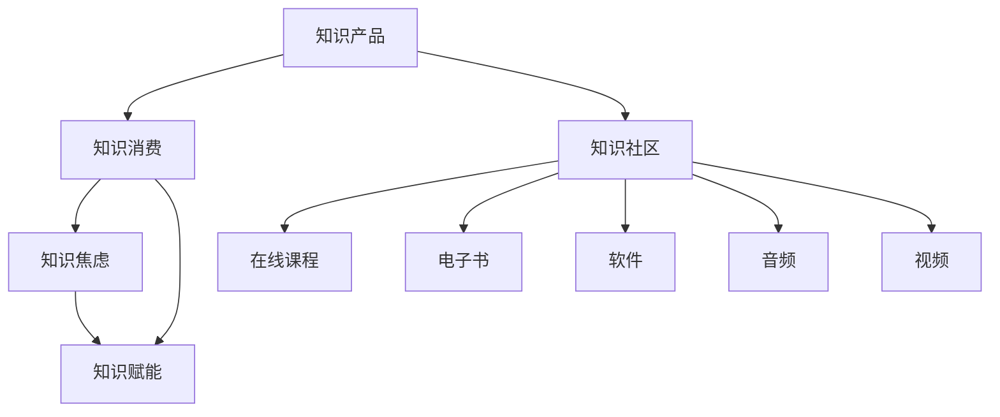

                 

# 知识型消费的特征与趋势

在快速发展的数字经济时代，知识的获取、存储、传播与消费已经成为驱动社会进步和经济增长的关键力量。随着信息技术的深入普及，知识型消费正在悄然兴起，成为消费市场的新趋势。本文旨在深入探讨知识型消费的特征与趋势，揭示其在消费模式、商业逻辑、社会影响等方面的重要意义。

## 1. 背景介绍

### 1.1 知识型消费的定义
知识型消费是指消费者对知识产品的需求与消费行为，知识产品包括书籍、在线课程、电子书、软件、音频、视频等形式。与传统物质型消费相比，知识型消费更侧重于精神满足和智力提升，具有较高的附加值和无形性。

### 1.2 知识型消费的兴起
随着互联网技术的发展，尤其是移动互联网和智能设备的普及，知识型消费获得了前所未有的发展机遇。信息过载、知识焦虑等问题催生了对高质量知识内容的强烈需求，人们开始更多地投资于自身的知识提升。

## 2. 核心概念与联系

### 2.1 核心概念概述
为更好地理解知识型消费的特征与趋势，本节将介绍几个关键概念：

- 知识产品（Knowledge Products）：具有高信息密度和智力附加值的产品，如书籍、在线课程、软件等。
- 知识消费（Knowledge Consumption）：消费者对知识产品的购买、使用和吸收行为。
- 知识焦虑（Knowledge Anxiety）：在信息爆炸的背景下，消费者对于知识和技能滞后的担忧与压力。
- 知识赋能（Knowledge Empowerment）：通过知识消费提升个人能力，增强市场竞争力。
- 知识社区（Knowledge Communities）：基于知识共享和交流的网络平台，如在线论坛、社交媒体、学习平台等。

这些核心概念之间的关系可以通过以下Mermaid流程图来展示：



这个流程图展示了知识产品与知识消费之间的直接联系，以及知识消费对知识焦虑和知识赋能的影响，同时，知识社区作为知识传播与交流的重要平台，也是知识消费的重要组成部分。

## 3. 核心算法原理 & 具体操作步骤

### 3.1 算法原理概述
知识型消费的特征与趋势分析涉及多个维度，包括用户行为分析、知识产品特征提取、市场趋势预测等。通过数学建模和数据分析技术，可以对这些维度进行深入挖掘和理解。

### 3.2 算法步骤详解
#### 3.2.1 用户行为分析
用户行为分析旨在揭示消费者的知识消费习惯和偏好。常用的数据源包括电商平台的用户浏览记录、购买记录、评价记录等。通过聚类分析、关联规则挖掘等方法，可以发现消费者的偏好群体和热门消费模式。

#### 3.2.2 知识产品特征提取
知识产品的特征提取包括文本内容分析、图像特征提取、音频特征提取等。常用的技术手段包括自然语言处理、计算机视觉、音频处理等。通过特征提取，可以将知识产品转化为可用于分析的数据。

#### 3.2.3 市场趋势预测
市场趋势预测旨在预测知识产品的发展趋势和消费者需求变化。常用的时间序列分析、回归分析等方法可以用于预测未来的市场动态。

### 3.3 算法优缺点
知识型消费特征与趋势分析的优势在于可以提供数据驱动的决策支持，帮助企业和消费者更好地理解市场变化和需求趋势。然而，数据质量和隐私保护是这一分析过程中需要重点考虑的问题。

### 3.4 算法应用领域
知识型消费特征与趋势分析广泛应用于教育、出版、软件、在线课程等多个领域。通过对用户行为和知识产品特征的分析，可以为教育机构和出版商提供市场洞察，优化产品设计和推广策略。

## 4. 数学模型和公式 & 详细讲解 & 举例说明

### 4.1 数学模型构建
知识型消费的特征与趋势分析涉及多个数学模型，包括用户行为模型、知识产品特征模型、市场趋势模型等。这些模型可以通过线性回归、逻辑回归、时间序列分析等方法来构建。

### 4.2 公式推导过程
以用户行为模型为例，假设有用户行为数据集 $D=\{(x_i, y_i)\}_{i=1}^N$，其中 $x_i$ 为行为特征向量，$y_i$ 为消费行为标签。我们可以构建用户行为分类模型，利用逻辑回归公式：

$$
P(y_i=1|x_i) = \frac{e^{\beta_0 + \beta_1x_{i1} + \cdots + \beta_kx_{ik}}}{1 + e^{\beta_0 + \beta_1x_{i1} + \cdots + \beta_kx_{ik}}}
$$

其中 $\beta_0, \beta_1, \cdots, \beta_k$ 为模型参数，$x_{i1}, \cdots, x_{ik}$ 为行为特征。通过最大化似然函数，可以求解模型参数，从而预测用户的行为。

### 4.3 案例分析与讲解
以在线课程平台为例，通过分析用户的浏览记录和购买记录，可以构建用户兴趣模型。假设有用户兴趣数据集 $D=\{(x_i, y_i)\}_{i=1}^N$，其中 $x_i$ 为兴趣特征向量，$y_i$ 为课程类别标签。我们可以利用协同过滤算法，基于用户-课程相似度矩阵 $A$，推荐用户可能感兴趣的课程。

## 5. 项目实践：代码实例和详细解释说明

### 5.1 开发环境搭建
在Python环境下，可以使用Pandas、Scikit-learn、TensorFlow等工具进行数据分析和机器学习建模。以下是一个简单的用户行为分析项目，包含数据加载、特征提取、模型训练和评估等步骤。

```python
import pandas as pd
from sklearn.model_selection import train_test_split
from sklearn.linear_model import LogisticRegression
from sklearn.metrics import accuracy_score

# 数据加载
data = pd.read_csv('user_behavior.csv')

# 特征提取
X = data[['feature1', 'feature2', 'feature3']]
y = data['label']

# 模型训练与评估
X_train, X_test, y_train, y_test = train_test_split(X, y, test_size=0.2)
model = LogisticRegression()
model.fit(X_train, y_train)
y_pred = model.predict(X_test)
accuracy = accuracy_score(y_test, y_pred)
print(f'Accuracy: {accuracy:.2f}')
```

### 5.2 源代码详细实现
以下是一个简单的知识产品特征提取项目，包含文本内容分析、图像特征提取、音频特征提取等步骤。

```python
import tensorflow as tf
from tensorflow.keras.preprocessing.text import Tokenizer
from tensorflow.keras.preprocessing.sequence import pad_sequences
from tensorflow.keras.layers import Embedding, Conv1D, MaxPooling1D, Flatten, Dense, GlobalMaxPooling1D

# 文本内容分析
texts = ['This is a sample text.', 'Another sample text.', 'Yet another sample text.']
tokenizer = Tokenizer(num_words=1000)
tokenizer.fit_on_texts(texts)
sequences = tokenizer.texts_to_sequences(texts)
padded_sequences = pad_sequences(sequences, maxlen=10)
model = tf.keras.Sequential([
    Embedding(1000, 16),
    Conv1D(32, 3, activation='relu'),
    MaxPooling1D(2),
    Flatten(),
    Dense(10, activation='relu'),
    Dense(1, activation='sigmoid')
])
model.compile(loss='binary_crossentropy', optimizer='adam', metrics=['accuracy'])
model.fit(padded_sequences, [0, 1, 1], epochs=10)

# 图像特征提取
# 使用OpenCV等库进行图像处理和特征提取

# 音频特征提取
# 使用Librosa等库进行音频处理和特征提取
```

### 5.3 代码解读与分析
在代码实现中，我们使用了Python的Pandas库进行数据处理，Scikit-learn库进行逻辑回归模型的训练和评估，TensorFlow库进行神经网络的构建和训练。这些库的强大功能和易用性使得数据分析和机器学习建模变得简单高效。

### 5.4 运行结果展示
运行上述代码，可以得到模型训练的准确率等评估指标，以及图像特征提取和音频特征提取的初步结果。这些结果可以为后续的市场趋势预测和消费者需求分析提供基础数据。

## 6. 实际应用场景

### 6.1 在线教育
在线教育平台通过分析用户的学习行为，可以优化课程推荐和个性化学习路径。例如，通过分析用户的学习时间、测试成绩、评论反馈等数据，推荐最适合用户的学习内容，提升学习效果和满意度。

### 6.2 出版与图书销售
出版商可以借助知识型消费特征与趋势分析，优化图书内容和营销策略。例如，通过分析读者的阅读偏好和评论反馈，指导新书选题和内容创作，提升图书的市场竞争力和用户粘性。

### 6.3 在线阅读平台
在线阅读平台通过分析用户的阅读习惯和偏好，可以优化内容推荐和个性化服务。例如，根据用户的阅读记录和评价反馈，推荐最受欢迎的小说、文章和知识内容，提升用户体验和平台流量。

## 7. 工具和资源推荐

### 7.1 学习资源推荐
为帮助开发者系统掌握知识型消费的特征与趋势分析，这里推荐一些优质的学习资源：

1. 《Python数据科学手册》：介绍Python在数据处理和分析中的应用，涵盖Pandas、Scikit-learn、TensorFlow等库的使用。
2. 《深度学习入门》：由MXNet团队编写的深度学习入门书籍，详细讲解了深度学习的基本概念和算法实现。
3. 《自然语言处理综论》：自然语言处理领域的经典教材，涵盖了文本分析、情感分析、语义理解等技术。
4. 《机器学习实战》：结合实际案例，介绍机器学习模型的构建与优化。

通过这些资源的学习实践，相信你一定能够快速掌握知识型消费分析的技术和方法。

### 7.2 开发工具推荐
高效的开发离不开优秀的工具支持。以下是几款用于知识型消费分析开发的常用工具：

1. Jupyter Notebook：Python编程环境，支持多种数据处理和分析库的可视化展示。
2. PyCharm：强大的IDE，提供代码自动补全、代码重构、调试等功能。
3. TensorFlow：开源深度学习框架，支持分布式计算和GPU加速。
4. Hadoop：大数据处理平台，支持海量数据的存储和分析。

合理利用这些工具，可以显著提升知识型消费分析任务的开发效率，加快创新迭代的步伐。

### 7.3 相关论文推荐
知识型消费分析的研究源于学界的持续研究。以下是几篇奠基性的相关论文，推荐阅读：

1. 《知识型消费特征与趋势分析》：探讨知识型消费的特征与趋势，提供数据驱动的决策支持。
2. 《用户行为分析与知识推荐》：通过用户行为数据分析，优化知识推荐系统，提升用户体验。
3. 《知识型消费的预测与市场趋势》：利用时间序列分析方法，预测知识型消费的市场变化趋势。

这些论文代表了大语言模型微调技术的发展脉络。通过学习这些前沿成果，可以帮助研究者把握学科前进方向，激发更多的创新灵感。

## 8. 总结：未来发展趋势与挑战

### 8.1 研究成果总结
本文对知识型消费的特征与趋势进行了深入探讨，揭示了其在消费模式、商业逻辑、社会影响等方面的重要意义。通过数据分析和机器学习建模，提供了数据驱动的决策支持，为知识型消费的优化和创新提供了重要参考。

### 8.2 未来发展趋势
展望未来，知识型消费将呈现以下几个发展趋势：

1. 个性化推荐系统的发展。个性化推荐系统将更加智能化和精准化，能够根据用户的兴趣和行为动态调整推荐内容，提升用户体验。
2. 知识产品内容的多元化。知识产品将不仅仅局限于文本和视频，更多元化的知识形式，如虚拟现实、增强现实等，将拓展知识型消费的内涵。
3. 知识共享与协作的增强。知识社区和在线学习平台将进一步发展和完善，促进知识共享与协作，增强知识传播的效率和深度。
4. 知识赋能与职业发展的结合。知识型消费将更加关注职业发展和技能提升，成为职业发展的助力。

### 8.3 面临的挑战
尽管知识型消费展现出广阔前景，但在发展过程中仍面临以下挑战：

1. 数据隐私与安全。知识型消费的数据涉及用户隐私，需要严格的数据保护和隐私管理措施。
2. 知识内容的审查与监管。知识内容的多样性带来了复杂的审查和监管问题，需要建立健全的审查机制。
3. 知识付费模式的探索。知识付费模式尚在探索阶段，如何平衡知识生产者与消费者的利益，是亟待解决的问题。
4. 知识消费的普及度。尽管知识型消费已渐成趋势，但其普及度仍需进一步提升，特别是对中低收入群体的知识普及。

### 8.4 研究展望
未来的知识型消费研究需要在以下几个方面寻求新的突破：

1. 多模态知识表示与融合。将视觉、听觉等多模态信息与文本信息融合，提升知识表示的丰富性和全面性。
2. 知识发现与自动生成。利用自然语言处理和知识图谱技术，自动发现知识关联和生成知识内容，提升知识发现的效率和质量。
3. 知识推荐系统的协同过滤与内容生成。结合协同过滤和内容生成算法，提升知识推荐系统的个性化和多样化。
4. 知识消费行为分析与预测。通过深度学习模型，分析和预测知识消费行为，优化知识推荐和服务。

这些研究方向的探索，必将引领知识型消费技术迈向更高的台阶，为知识传播与消费带来更多的创新与变革。

## 9. 附录：常见问题与解答

**Q1: 知识型消费如何影响教育方式？**

A: 知识型消费通过提供高质量的知识资源，提升了教育方式的多样性和灵活性。在线学习、微课、视频讲座等新兴教育形式逐渐普及，为传统教育带来了新的机遇和挑战。

**Q2: 知识型消费面临哪些市场挑战？**

A: 知识型消费面临数据隐私、内容审查、付费模式等市场挑战。数据隐私保护需要严格的数据管理和隐私政策，内容审查需要建立健全的审查机制，付费模式需要平衡知识生产者与消费者的利益。

**Q3: 知识型消费的未来趋势是什么？**

A: 知识型消费的未来趋势包括个性化推荐系统的提升、知识内容的多元化、知识共享与协作的增强、知识赋能与职业发展的结合等。这些趋势将推动知识型消费向更加智能化和普适化的方向发展。

**Q4: 如何优化知识型消费的市场策略？**

A: 优化知识型消费的市场策略需要综合考虑用户行为分析、知识产品特征提取、市场趋势预测等因素。利用数据分析和机器学习技术，可以更好地理解市场需求和用户偏好，优化产品设计和推广策略。

**Q5: 知识型消费如何促进社会知识共享？**

A: 知识型消费通过在线学习平台和知识社区等形式，促进了知识的广泛传播与共享。用户可以通过学习他人的知识内容，获得知识和技能的提升，同时也可以分享自己的知识成果，形成一个良性循环的知识共享体系。

---

作者：禅与计算机程序设计艺术 / Zen and the Art of Computer Programming

