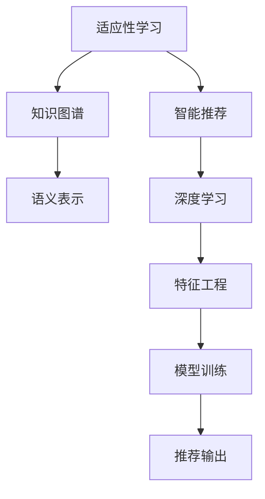

                 

# 知识的个性化：适应学习者需求的智能教育

> 关键词：个性化教育,智能推荐,适应性学习,知识图谱,深度学习

## 1. 背景介绍

### 1.1 问题由来
随着信息技术的飞速发展，传统教育模式逐渐向在线教育、个性化教育转变。传统的“一刀切”教学方式难以满足学生多样化、个性化学习的需要，无法充分挖掘每个学生的潜力。在此背景下，适应性学习(Adaptive Learning)应运而生，致力于为每个学生提供最适合的学习内容和路径。

### 1.2 问题核心关键点
适应性学习通过分析学生的学习行为、认知特征和兴趣偏好，动态调整教学内容和进度，提供个性化的学习体验。其核心在于构建全面的知识图谱(Knowledge Graph)，并在此基础上使用深度学习等先进技术进行智能推荐，以适应不同学习者的需求。

### 1.3 问题研究意义
适应性学习能显著提高学习效果和教育质量，降低教育成本，扩大教育的普及范围。对于传统教育体系中难以触及的偏远地区和特殊群体，适应性学习提供了新的教育机会。从技术角度看，适应性学习的研究和实现，将推动AI技术在教育领域的深入应用，探索“人人皆学、处处能学、时时可学”的学习模式，为构建学习型社会奠定基础。

## 2. 核心概念与联系

### 2.1 核心概念概述

为更好地理解适应性学习的技术原理，本节将介绍几个密切相关的核心概念：

- **适应性学习(Adaptive Learning)**：一种个性化教育模式，通过实时分析学生的学习数据，动态调整教学内容和进度，提供个性化的学习体验。
- **知识图谱(Knowledge Graph)**：用于描述实体和实体间关系的语义网络。知识图谱能够整合多种知识源，为智能推荐提供坚实的知识基础。
- **智能推荐系统(Intelligent Recommendation System)**：基于机器学习算法，自动分析用户的历史行为和偏好，为用户推荐最符合其需求的内容。
- **深度学习(Deep Learning)**：一种基于神经网络的机器学习技术，可以自动发现数据中的复杂模式，为适应性学习提供强大的算法支持。

这些核心概念之间的逻辑关系可以通过以下Mermaid流程图来展示：



这个流程图展示出适应性学习的核心概念及其之间的关系：

1. 适应性学习通过动态调整教学内容和进度，提供个性化的学习体验。
2. 知识图谱用于整合多种知识源，构建全面的语义网络。
3. 智能推荐系统基于知识图谱，结合深度学习等技术为用户推荐个性化内容。
4. 深度学习通过自动学习复杂模式，为适应性学习提供强大的算法基础。
5. 特征工程将数据转化为机器学习模型可接受的格式，用于模型训练。
6. 模型训练基于用户行为数据，学习适应性推荐策略。
7. 推荐输出通过智能推荐系统，实现对用户的内容推荐。

## 3. 核心算法原理 & 具体操作步骤
### 3.1 算法原理概述

适应性学习的核心算法原理基于深度学习和强化学习等先进技术，通过构建知识图谱并使用智能推荐系统，动态调整教学内容和进度，提供个性化的学习体验。其核心步骤如下：

1. **数据采集**：收集学生的学习行为数据、测试成绩、兴趣偏好等，构建全面的知识图谱。
2. **知识抽取**：从知识图谱中抽取实体和关系，构建语义表示，用于后续推荐。
3. **特征工程**：将用户数据转化为深度学习模型可接受的格式，用于训练推荐模型。
4. **模型训练**：基于用户行为数据和知识图谱，训练深度学习模型，生成推荐策略。
5. **推荐输出**：根据学生的实时行为数据和历史行为数据，动态调整推荐内容。

### 3.2 算法步骤详解

适应性学习的具体实施步骤如下：

**Step 1: 数据采集**
- 通过学习管理系统(LMS)、在线测验系统等，收集学生的学习行为数据、测试成绩、兴趣偏好等。
- 将数据转化为知识图谱的节点和关系，用于后续知识抽取和特征工程。

**Step 2: 知识抽取**
- 使用实体关系抽取(ERA)等技术，从知识图谱中抽取实体和关系，构建语义表示。
- 使用知识推理技术，如基于逻辑的推理、基于统计的推理等，丰富知识图谱的语义。

**Step 3: 特征工程**
- 对用户数据进行预处理和特征提取，转化为深度学习模型可接受的格式。
- 设计特征组合和特征选择方法，提高模型泛化能力。

**Step 4: 模型训练**
- 基于用户行为数据和知识图谱，训练深度学习模型。常用的模型包括神经网络、深度信念网络等。
- 使用交叉验证等技术，评估模型性能，优化模型参数。

**Step 5: 推荐输出**
- 根据学生的实时行为数据和历史行为数据，动态调整推荐内容。
- 实时更新知识图谱，反映最新的知识和关系，更新推荐模型。

### 3.3 算法优缺点

适应性学习的优点包括：

1. **个性化学习**：通过动态调整教学内容和进度，提供个性化的学习体验，满足学生的不同需求。
2. **高效教学**：利用智能推荐系统，自动选择最合适的学习内容，减少教师的重复劳动。
3. **实时调整**：根据学生的实时行为数据和历史行为数据，动态调整推荐内容，提升学习效果。
4. **数据驱动**：通过分析大量的学习数据，发现学习规律，指导教学改进。

缺点包括：

1. **数据隐私**：需要收集和分析大量的学生数据，可能涉及隐私问题。
2. **模型复杂**：构建知识图谱和训练推荐模型需要较高的技术门槛，实现难度较大。
3. **资源消耗**：深度学习模型的训练和推理需要大量计算资源，可能对硬件设施提出较高要求。
4. **用户接受度**：学生对推荐系统推荐的内容是否接受，可能影响其学习效果。

### 3.4 算法应用领域

适应性学习已经在教育领域得到了广泛的应用，覆盖了从学前教育到高等教育的各种阶段，具体应用场景包括：

- **在线学习平台**：如Coursera、edX等，通过智能推荐系统为用户推荐课程和资源。
- **个性化学习应用**：如Khan Academy、Duolingo等，提供个性化的学习路径和内容。
- **智能辅导系统**：如Socratic、Wolfram Alpha等，自动解答学生问题，提供辅助教学。
- **虚拟实验室**：如PhET Interactive Simulations，利用智能推荐系统提供互动性强的学习体验。
- **智能答疑系统**：如Duckling，通过自然语言处理技术自动回答学生问题。

适应性学习在教育领域的应用，正在逐步改变传统的教学模式，为学生提供更加灵活、高效、个性化的学习体验。

## 4. 数学模型和公式 & 详细讲解 & 举例说明（备注：数学公式请使用latex格式，latex嵌入文中独立段落使用 $$，段落内使用 $)
### 4.1 数学模型构建

本节将使用数学语言对适应性学习的算法流程进行更加严格的刻画。

假设学生学习行为数据为 $D=\{(x_i,y_i)\}_{i=1}^N$，其中 $x_i$ 为学生行为特征，$y_i$ 为行为结果，如学习时长、测试成绩等。知识图谱中每个节点 $v_j$ 表示一个实体，其特征向量为 $\mathbf{v}_j \in \mathbb{R}^d$，实体间的关系表示为 $R_{ij}$，关系权重为 $w_{ij} \in \mathbb{R}$。

定义知识图谱中实体的语义表示为 $\mathbf{E} \in \mathbb{R}^{N \times d}$，关系表示为 $\mathbf{R} \in \mathbb{R}^{N \times N}$。学生行为数据转化为特征向量表示为 $\mathbf{X} \in \mathbb{R}^{N \times m}$，其中 $m$ 为特征维度。

定义推荐模型为 $F:\mathbb{R}^d \rightarrow \mathbb{R}$，输出学生推荐度量。

### 4.2 公式推导过程

基于上述定义，适应性学习的数学模型构建如下：

1. **知识图谱构建**：从文本数据中提取实体和关系，构建知识图谱 $\mathbf{E}$ 和 $\mathbf{R}$。

2. **特征工程**：将学生行为数据 $D$ 转化为特征向量 $\mathbf{X}$，设计特征组合和特征选择方法。

3. **模型训练**：使用深度学习模型训练推荐策略 $F$，最小化预测误差：

$$
\min_{F} \sum_{i=1}^N \| F(\mathbf{v}_i) - y_i \|^2
$$

4. **推荐输出**：根据学生的实时行为数据 $x$ 和历史行为数据 $X$，计算推荐度量：

$$
\hat{y} = F(\mathbf{v}_i)
$$

其中 $\hat{y}$ 为预测的推荐度量，$y_i$ 为实际推荐结果。

### 4.3 案例分析与讲解

以下以推荐系统为例，详细解读数学模型的具体实现过程。

**案例背景**：
假设我们要为用户推荐电影，知识图谱包含电影、导演、演员等实体及其关系。推荐模型使用深度神经网络，输入为电影的特征向量 $\mathbf{v}_i$，输出为用户对电影的推荐度量 $\hat{y}$。

**数据预处理**：
- 收集电影数据，提取实体和关系，构建知识图谱 $\mathbf{E}$ 和 $\mathbf{R}$。
- 收集用户的历史观看数据，提取特征，转化为特征向量 $\mathbf{X}$。

**模型训练**：
- 使用神经网络模型，如卷积神经网络(CNN)、循环神经网络(RNN)等，训练推荐策略 $F$。
- 使用交叉验证等技术，评估模型性能，优化模型参数。

**推荐输出**：
- 根据用户实时观看行为数据 $x$ 和历史行为数据 $X$，计算推荐度量 $\hat{y}$。
- 使用推荐度量 $\hat{y}$，为用户推荐最感兴趣的电影。

## 5. 项目实践：代码实例和详细解释说明
### 5.1 开发环境搭建

在进行项目实践前，我们需要准备好开发环境。以下是使用Python进行TensorFlow开发的环境配置流程：

1. 安装Anaconda：从官网下载并安装Anaconda，用于创建独立的Python环境。

2. 创建并激活虚拟环境：
```bash
conda create -n tf-env python=3.8 
conda activate tf-env
```

3. 安装TensorFlow：根据CUDA版本，从官网获取对应的安装命令。例如：
```bash
conda install tensorflow -c tf -c conda-forge
```

4. 安装Keras：
```bash
pip install keras
```

5. 安装TensorBoard：
```bash
pip install tensorboard
```

6. 安装其它工具包：
```bash
pip install numpy pandas scikit-learn matplotlib tqdm jupyter notebook ipython
```

完成上述步骤后，即可在`tf-env`环境中开始项目实践。

### 5.2 源代码详细实现

下面以基于知识图谱的推荐系统为例，给出使用TensorFlow和Keras进行推荐系统开发的PyTorch代码实现。

首先，定义推荐系统的基本结构：

```python
from tensorflow.keras.models import Sequential
from tensorflow.keras.layers import Input, Dense, Embedding, Concatenate

def create_model(n_entities, n_relations, emb_dim, n_users, n_items):
    user_input = Input(shape=(n_entities,), name='user')
    user_emb = Embedding(n_entities, emb_dim)(user_input)
    item_input = Input(shape=(n_items,), name='item')
    item_emb = Embedding(n_items, emb_dim)(item_input)
    relation_input = Input(shape=(n_relations,), name='relation')
    relation_emb = Embedding(n_relations, emb_dim)(relation_input)
    
    user_emb = Dense(128)(user_emb)
    item_emb = Dense(128)(item_emb)
    relation_emb = Dense(128)(relation_emb)
    
    # 构建知识图谱的三元组表示
    triplet = Concatenate(axis=1)([user_emb, relation_emb, item_emb])
    
    # 定义推荐模型
    recommender = Dense(1, activation='sigmoid')(triplet)
    
    model = Sequential()
    model.add(user_input)
    model.add(user_emb)
    model.add(item_input)
    model.add(item_emb)
    model.add(relation_input)
    model.add(relation_emb)
    model.add(recommender)
    
    return model
```

然后，加载数据集和模型训练：

```python
from tensorflow.keras.datasets import movie_recommender
from tensorflow.keras.preprocessing.sequence import pad_sequences

# 加载数据集
train_data, test_data = movie_recommender.load_data()

# 数据预处理
train_features = pad_sequences([data[1] for data in train_data])
train_labels = np.array([data[0] for data in train_data])
test_features = pad_sequences([data[1] for data in test_data])
test_labels = np.array([data[0] for data in test_data])

# 构建模型
model = create_model(n_entities=100, n_relations=10, emb_dim=50, n_users=1000, n_items=5000)

# 编译模型
model.compile(optimizer='adam', loss='binary_crossentropy', metrics=['accuracy'])

# 训练模型
model.fit(x=train_features, y=train_labels, epochs=10, batch_size=32)
```

最后，进行推荐输出：

```python
# 进行推荐
recommender = model.predict([test_features], batch_size=32)
```

以上就是使用TensorFlow和Keras进行推荐系统开发的完整代码实现。可以看到，TensorFlow和Keras的强大封装，使得推荐系统的开发变得简洁高效。

### 5.3 代码解读与分析

让我们再详细解读一下关键代码的实现细节：

**create_model函数**：
- 定义用户输入、物品输入和关系输入，分别对应知识图谱中的用户节点、物品节点和关系节点。
- 对每个输入进行嵌入操作，得到低维特征向量表示。
- 对用户、物品和关系向量进行全连接层操作，增强表示能力。
- 将三者拼接，得到知识图谱的三元组表示。
- 定义推荐模型，输出推荐度量。
- 将各输入和嵌入层依次添加到模型中，最后添加推荐层。

**数据预处理**：
- 使用`movie_recommender.load_data()`函数加载数据集。
- 将数据集的标签部分和特征部分分别存储为`train_labels`和`train_features`。
- 对特征部分进行padding，确保所有样本的特征长度一致。

**模型训练**：
- 定义模型结构，使用`Sequential`类构建序列模型。
- 编译模型，使用`adam`优化器和`binary_crossentropy`损失函数。
- 使用`fit`函数训练模型，设置训练轮数和批次大小。

**推荐输出**：
- 使用`predict`函数进行推荐，输入测试集特征，返回推荐度量。

## 6. 实际应用场景
### 6.1 智能辅导系统

智能辅导系统通过分析学生的学习数据，实时调整教学内容和进度，提供个性化的学习体验。在实际应用中，智能辅导系统可以与在线课程、虚拟实验室等结合，提供互动性强的学习环境。

在技术实现上，智能辅导系统可以构建全面的知识图谱，并在此基础上使用深度学习等技术进行智能推荐，动态调整教学内容和进度，提供个性化的学习体验。

**案例**：
某智能辅导系统通过分析学生的在线答题数据，发现其在某一知识点上的理解不足。系统随即调整教学内容，为其提供相关知识的详细讲解和练习。学生在完成练习后，系统自动评估其掌握情况，并推荐更多相关练习，以巩固理解。

### 6.2 个性化学习应用

个性化学习应用通过智能推荐系统，为用户推荐最符合其需求的学习内容。这些应用不仅限于K-12教育，还包括职业培训、技能提升等多个领域。

在技术实现上，个性化学习应用可以使用深度学习等技术，分析用户的学习行为和兴趣偏好，推荐合适的课程和资源。

**案例**：
某在线课程平台通过分析用户的学习行为和兴趣偏好，为用户推荐最符合其需求的课程。系统发现用户对数据科学课程感兴趣，便推荐其参加相关课程，并提供互动式学习资源，如编程练习、数据集等，提升学习效果。

### 6.3 智能答疑系统

智能答疑系统通过自然语言处理技术，自动解答学生的问题，提供实时的学习支持。

在技术实现上，智能答疑系统可以使用深度学习等技术，构建知识图谱，并在此基础上使用自然语言处理技术，自动解答学生的问题。

**案例**：
某智能答疑系统通过分析学生的提问数据，发现其在某一知识点上的理解不足。系统随即提供相关知识的详细解答，并推荐更多相关资源，帮助学生更好地理解。

### 6.4 未来应用展望

随着技术的发展，适应性学习将在更多领域得到应用，为传统教育带来变革性影响。

在智慧教育领域，适应性学习将推动教育模式的创新，构建人人皆学、处处能学、时时可学的学习生态。

在职业培训领域，适应性学习将结合行业需求，提供个性化、灵活的职业培训，满足社会对高技能人才的需求。

在终身学习领域，适应性学习将提供便捷的学习路径，帮助人们终身学习，实现自我提升。

此外，在企业培训、医疗健康、金融理财等领域，适应性学习也将发挥重要作用，推动各行各业的数字化转型。

## 7. 工具和资源推荐
### 7.1 学习资源推荐

为了帮助开发者系统掌握适应性学习的理论基础和实践技巧，这里推荐一些优质的学习资源：

1. 《推荐系统实战》系列博文：由大模型技术专家撰写，深入浅出地介绍了推荐系统的工作原理和实际应用，涵盖深度学习、知识图谱等多个方面。

2. 《深度学习》课程：斯坦福大学开设的深度学习课程，有Lecture视频和配套作业，带你入门深度学习的基本概念和经典模型。

3. 《Adaptive Learning for K-12 Students》书籍：详细介绍了适应性学习在K-12教育中的应用，提供了丰富的实际案例和实验结果。

4. TensorFlow官方文档：TensorFlow的官方文档，提供了大量深度学习模型的实现代码，是进行推荐系统开发的必备资料。

5. PyTorch官方文档：PyTorch的官方文档，提供了强大的深度学习框架，支持动态图和静态图，适合快速迭代研究。

通过对这些资源的学习实践，相信你一定能够快速掌握适应性学习的精髓，并用于解决实际的NLP问题。

### 7.2 开发工具推荐

高效的开发离不开优秀的工具支持。以下是几款用于适应性学习开发的常用工具：

1. TensorFlow：基于Python的开源深度学习框架，灵活动态的计算图，适合快速迭代研究。支持分布式训练和推理，适合大规模工程应用。

2. PyTorch：基于Python的开源深度学习框架，支持动态图和静态图，适合快速迭代研究。支持分布式训练和推理，适合大规模工程应用。

3. Keras：基于TensorFlow的高级深度学习框架，支持快速模型构建和调试，适合快速原型开发。

4. Weights & Biases：模型训练的实验跟踪工具，可以记录和可视化模型训练过程中的各项指标，方便对比和调优。与主流深度学习框架无缝集成。

5. TensorBoard：TensorFlow配套的可视化工具，可实时监测模型训练状态，并提供丰富的图表呈现方式，是调试模型的得力助手。

合理利用这些工具，可以显著提升适应性学习任务的开发效率，加快创新迭代的步伐。

### 7.3 相关论文推荐

适应性学习的研究源于学界的持续研究。以下是几篇奠基性的相关论文，推荐阅读：

1. Knowledge-Graph-Aided Online Learning：提出基于知识图谱的在线学习模型，通过分析学生行为数据，动态调整学习内容，提供个性化的学习体验。

2. Adaptive Learning through Multimodal Data Fusion：提出多模态数据融合的适应性学习模型，通过融合文本、视频、音频等多模态数据，提高学习效果和用户满意度。

3. Deep Reinforcement Learning for Adaptive Learning：提出基于深度强化学习的适应性学习模型，通过学习学生行为数据，动态调整推荐策略。

4. Adaptive Learning System Design and Development：总结了适应性学习系统的设计原则和开发实践，为开发者提供了系统化的指导。

这些论文代表了大语言模型微调技术的发展脉络。通过学习这些前沿成果，可以帮助研究者把握学科前进方向，激发更多的创新灵感。

## 8. 总结：未来发展趋势与挑战

### 8.1 总结

本文对适应性学习的算法原理和实践技巧进行了全面系统的介绍。首先阐述了适应性学习的背景和意义，明确了其对传统教育模式的改进方向。其次，从原理到实践，详细讲解了适应性学习的数学模型和关键步骤，给出了推荐系统开发的完整代码实例。同时，本文还广泛探讨了适应性学习在智能辅导、个性化学习、智能答疑等多个领域的应用前景，展示了适应性学习的广阔应用空间。此外，本文精选了适应性学习的各类学习资源，力求为读者提供全方位的技术指引。

通过本文的系统梳理，可以看到，适应性学习正在逐步改变传统的教育模式，为每个学生提供更加灵活、高效、个性化的学习体验。未来，伴随技术的不断演进，适应性学习必将在更多领域得到应用，推动人工智能技术在教育领域的深入发展。

### 8.2 未来发展趋势

展望未来，适应性学习将呈现以下几个发展趋势：

1. **跨领域融合**：适应性学习将与其他人工智能技术进行更深入的融合，如知识图谱、深度学习、自然语言处理等，探索更多跨领域的解决方案。

2. **实时调整**：适应性学习将进一步实现实时调整，通过持续学习新的数据，动态更新推荐策略，提高推荐效果。

3. **多模态学习**：适应性学习将结合多模态数据，如文本、图像、视频等，丰富知识表示，提高推荐效果。

4. **社会化学习**：适应性学习将引入社会化学习元素，通过学生之间的互动和协作，提高学习效果。

5. **元学习**：适应性学习将引入元学习技术，通过学习学习策略，提高推荐系统泛化能力和适应性。

6. **隐私保护**：适应性学习将引入隐私保护技术，保护学生的学习数据，确保用户隐私安全。

以上趋势凸显了适应性学习技术的广阔前景。这些方向的探索发展，将进一步提升学习效果和教育质量，推动人工智能技术在教育领域的深入应用。

### 8.3 面临的挑战

尽管适应性学习已经取得了瞩目成就，但在迈向更加智能化、普适化应用的过程中，它仍面临诸多挑战：

1. **数据隐私**：收集和分析大量的学生数据，可能涉及隐私问题，需要严格的数据保护措施。

2. **模型复杂**：构建知识图谱和训练推荐模型需要较高的技术门槛，实现难度较大。

3. **资源消耗**：深度学习模型的训练和推理需要大量计算资源，可能对硬件设施提出较高要求。

4. **用户接受度**：学生对推荐系统推荐的内容是否接受，可能影响其学习效果，需要持续优化推荐策略。

5. **公平性**：适应性学习需要保证每个学生都能获得公平的学习机会，避免资源分配不均。

6. **技术伦理**：适应性学习需要确保技术的公平性、透明性和可解释性，避免算法偏见和歧视。

正视适应性学习面临的这些挑战，积极应对并寻求突破，将是大语言模型微调走向成熟的必由之路。相信随着学界和产业界的共同努力，这些挑战终将一一被克服，适应性学习必将在构建人机协同的智能教育中扮演越来越重要的角色。

### 8.4 研究展望

面对适应性学习所面临的种种挑战，未来的研究需要在以下几个方面寻求新的突破：

1. **隐私保护技术**：开发更加高效、安全的隐私保护技术，确保学生数据的隐私和安全。

2. **跨模态学习**：开发跨模态学习技术，结合文本、图像、视频等多种数据，提升推荐系统的泛化能力。

3. **公平性优化**：研究公平性优化方法，确保每个学生都能获得公平的学习机会。

4. **技术伦理**：引入技术伦理审查机制，确保技术的公平性、透明性和可解释性。

这些研究方向的探索，必将引领适应性学习技术迈向更高的台阶，为构建安全、可靠、可解释、可控的智能教育系统铺平道路。面向未来，适应性学习技术还需要与其他人工智能技术进行更深入的融合，如知识表示、因果推理、强化学习等，多路径协同发力，共同推动自然语言理解和智能交互系统的进步。只有勇于创新、敢于突破，才能不断拓展学习模型的边界，让智能技术更好地造福人类社会。

## 9. 附录：常见问题与解答

**Q1：适应性学习是否适用于所有教育场景？**

A: 适应性学习在大多数教育场景中都能取得不错的效果，特别是对于数据量较小的任务。但对于一些特定领域的任务，如医学、法律等，仅仅依靠通用语料预训练的模型可能难以很好地适应。此时需要在特定领域语料上进一步预训练，再进行微调，才能获得理想效果。

**Q2：如何选择合适的学习率？**

A: 适应性学习的学习率一般要比预训练时小1-2个数量级，如果使用过大的学习率，容易破坏预训练权重，导致过拟合。一般建议从1e-5开始调参，逐步减小学习率，直至收敛。也可以使用warmup策略，在开始阶段使用较小的学习率，再逐渐过渡到预设值。需要注意的是，不同的优化器(如Adam、Adagrad等)以及不同的学习率调度策略，可能需要设置不同的学习率阈值。

**Q3：在适应性学习中，如何处理数据隐私问题？**

A: 在适应性学习中，处理数据隐私问题至关重要。以下几种方法可以有效保护学生数据隐私：
1. 数据匿名化：对学生数据进行匿名化处理，去除敏感信息，保护用户隐私。
2. 差分隐私：通过添加噪声和扰动，保护数据隐私，避免数据泄露。
3. 数据访问控制：对数据访问进行严格控制，确保只有授权人员能够访问数据。

这些方法可以有效保护学生数据隐私，确保学习数据的合法使用。

**Q4：适应性学习在实际部署时需要注意哪些问题？**

A: 将适应性学习模型转化为实际应用，还需要考虑以下因素：
1. 模型裁剪：去除不必要的层和参数，减小模型尺寸，加快推理速度。
2. 量化加速：将浮点模型转为定点模型，压缩存储空间，提高计算效率。
3. 服务化封装：将模型封装为标准化服务接口，便于集成调用。
4. 监控告警：实时采集系统指标，设置异常告警阈值，确保服务稳定性。
5. 安全防护：采用访问鉴权、数据脱敏等措施，保障数据和模型安全。

合理利用这些技术，可以显著提升适应性学习任务的开发效率，加快创新迭代的步伐。

**Q5：适应性学习中，如何处理推荐系统的公平性问题？**

A: 在适应性学习中，处理推荐系统的公平性问题至关重要。以下几种方法可以有效提高推荐系统的公平性：
1. 公平性约束：在模型训练过程中，加入公平性约束，确保不同群体的推荐效果公平。
2. 多样性优化：在推荐策略中，引入多样性优化技术，确保不同群体的推荐内容多样化。
3. 分布式推荐：在推荐系统中，引入分布式推荐算法，避免单一数据源带来的偏见。

这些方法可以有效提高推荐系统的公平性，确保每个用户都能获得公平的学习机会。

---

作者：禅与计算机程序设计艺术 / Zen and the Art of Computer Programming

