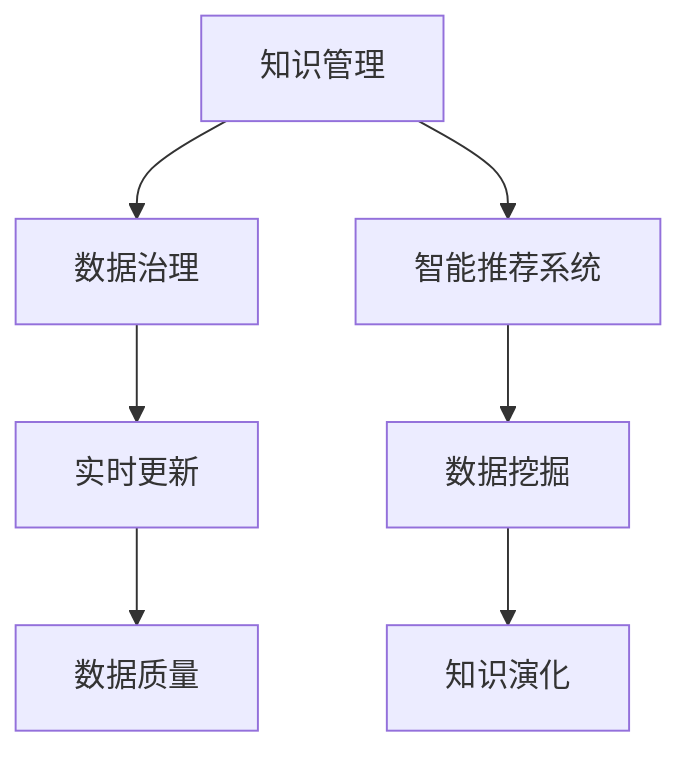

                 

# 知识的动态性：实时更新与知识演化

> 关键词：知识管理, 实时更新, 知识演化, 数据挖掘, 智能推荐, 数据治理, 数据质量

## 1. 背景介绍

### 1.1 问题由来

在信息时代，知识的生成速度和传播速度都呈爆炸式增长。企业、科研机构、教育机构等各类组织面临着如何高效管理、实时更新和动态演化的挑战。传统的静态知识库和管理系统无法满足快速变化的知识需求，企业需要更加智能、动态和可持续的知识管理系统。

知识的动态性是指知识库中的内容能够随着时间、环境、情境的变化而实时更新，动态演化。传统的静态知识库虽然系统稳定，但数据更新周期长，响应速度慢，无法适应快速变化的知识需求。

### 1.2 问题核心关键点

解决知识动态性的关键在于：
- 如何设计高效的数据治理策略，保证数据质量，提升数据更新频率。
- 如何引入实时数据流，动态更新知识库，避免信息滞后。
- 如何构建智能推荐系统，个性化推荐相关知识，提高知识获取效率。
- 如何通过数据挖掘和分析技术，发现知识演化规律，预测未来趋势。

这些核心点共同构成了知识动态性的关键技术框架，也是本文讨论的重点。

## 2. 核心概念与联系

### 2.1 核心概念概述

为更好地理解知识动态性，本节将介绍几个核心概念：

- 知识管理(Knowledge Management, KM)：指通过技术手段和管理策略，对组织内部的知识资源进行收集、存储、共享和应用的过程。

- 实时更新(Real-time Update)：指在知识库中，当数据发生变化时，能够及时更新相关内容，保持知识的时效性。

- 知识演化(Knowledge Evolution)：指知识库中的内容随着时间推移、情境变化而动态更新，演化成新的知识形态。

- 数据治理(Data Governance)：指通过规范化的数据标准和流程，保障数据质量、确保数据安全、提升数据利用效率的管理活动。

- 智能推荐系统(Intelligent Recommendation System)：通过数据分析和算法模型，预测用户兴趣，推荐相关内容，提升用户获取知识的效率。

- 数据挖掘(Data Mining)：指从大量数据中提取有用信息和知识，为知识动态性管理提供数据支撑。

- 数据质量(Data Quality)：指数据的一致性、完整性、准确性和及时性，是知识管理的基础。

这些核心概念之间的逻辑关系可以通过以下Mermaid流程图来展示：



这个流程图展示的知识动态性核心概念及其之间的关系：

1. 知识管理通过数据治理策略，保障数据质量，为智能推荐系统提供数据支持。
2. 实时更新通过数据流，动态更新知识库，提升数据的时效性。
3. 数据挖掘提取数据中的有用信息，支持知识演化和智能推荐系统。
4. 智能推荐系统根据用户行为预测兴趣，推荐相关内容，提升知识获取效率。
5. 知识演化是数据治理和智能推荐系统的目标，通过动态更新和智能推荐，实现知识动态性。

## 3. 核心算法原理 & 具体操作步骤
### 3.1 算法原理概述

知识动态性管理的核心算法主要包括实时数据更新算法、知识演化算法、智能推荐算法等。其中，数据治理是基础，实时更新和知识演化是目标，智能推荐系统则是在数据治理和知识演化基础上提升知识获取效率的核心工具。

数据治理算法主要关注数据质量管理、数据标准制定、元数据管理等，确保数据一致性和可靠性。实时更新算法通过数据流技术，动态更新知识库，保障知识的时效性。知识演化算法通过数据分析和挖掘，发现知识变化规律，预测未来趋势。智能推荐算法通过用户行为分析，预测用户兴趣，提升知识获取效率。

### 3.2 算法步骤详解

以下是知识动态性管理的主要算法步骤：

**Step 1: 数据治理与质量管理**

- 定义数据治理框架和标准，如数据定义、数据分类、数据属性等。
- 实施数据清洗和数据标准化，如去除重复数据、校正数据格式等。
- 设定数据质量监控机制，实时检测数据变化，发现异常情况并及时处理。

**Step 2: 实时数据更新**

- 引入实时数据流技术，自动捕获数据变化。
- 使用变更数据捕获(CDC)工具，实时同步变更到知识库。
- 设计增量更新策略，仅更新变化的部分数据，减小系统负担。

**Step 3: 知识演化分析**

- 进行知识图谱构建，建立实体和关系之间的知识网络。
- 引入机器学习和数据挖掘技术，发现知识变化趋势和规律。
- 使用统计分析方法，预测未来知识的变化和演化。

**Step 4: 智能推荐系统构建**

- 收集用户行为数据，如浏览记录、点击率、评分等。
- 设计推荐算法，如协同过滤、基于内容的推荐等，预测用户兴趣。
- 结合知识图谱，生成推荐结果，提供个性化知识推荐。

### 3.3 算法优缺点

知识动态性管理算法的主要优点包括：
- 数据质量高：通过数据治理，保证数据的准确性和一致性。
- 时效性强：实时数据更新保障知识的最新状态。
- 预测能力强：通过知识演化分析，预测未来趋势。
- 个性化推荐：智能推荐系统提升用户获取知识的效率。

同时，该算法也存在一些局限性：
- 依赖技术实现：算法依赖于高效的数据治理和实时数据流技术。
- 计算资源消耗高：知识演化分析和智能推荐系统需要大量的计算资源。
- 用户隐私保护：在收集和分析用户行为时，需要注意用户隐私保护问题。

尽管存在这些局限性，但就目前而言，知识动态性管理算法仍是最主流和高效的知识管理范式。未来相关研究的重点在于如何进一步降低算法对计算资源和技术实现依赖，提高算法的可扩展性和鲁棒性，同时兼顾隐私保护和安全性等因素。

### 3.4 算法应用领域

知识动态性管理算法在多个领域已经得到了广泛应用，例如：

- 企业知识管理：构建企业内部知识库，实时更新和动态演化，提高企业竞争力。
- 科研知识管理：维护科研知识库，自动更新相关文献、数据等，推动科学研究进步。
- 教育知识管理：提供个性化的学习资源推荐，提升教学质量和学生学习效果。
- 医疗知识管理：构建医疗知识库，实时更新临床数据，推动医学研究和临床实践。
- 金融知识管理：管理金融市场数据，提供实时行情和分析报告，支持投资决策。

除了上述这些领域外，知识动态性管理算法还将在更多场景中得到应用，如智慧城市、智能客服、智能家居等，为社会带来全新的变革。

## 4. 数学模型和公式 & 详细讲解  
### 4.1 数学模型构建

知识动态性管理算法主要涉及以下几个数学模型：

- 数据治理模型：用于描述数据质量管理的数学框架。
- 实时更新模型：描述知识库数据实时同步的数学模型。
- 知识演化模型：描述知识库内容动态演化的数学模型。
- 智能推荐模型：用于预测用户兴趣的数学模型。

这里仅以智能推荐模型的构建为例，介绍其数学表达。

假设用户有$N$个，每个用户有$m$个兴趣点，知识库中有$K$个知识项。每个知识项$i$与$m$个用户兴趣点$u$的匹配度为$w_{iu}$，且满足$0 \leq w_{iu} \leq 1$。用户对知识项$i$的评分$R_i$，可由以下加权求和得到：

$$
R_i = \sum_{u=1}^m w_{iu}r_{iu}
$$

其中$r_{iu}$为兴趣点$u$与知识项$i$的评分，$i=1,\ldots,K$。

**推荐算法**：
- 协同过滤算法：基于用户行为相似性，推荐相关知识项。
- 基于内容的推荐算法：利用知识项特征，推荐匹配度高的知识项。
- 混合推荐算法：结合多种推荐策略，提升推荐效果。

### 4.2 公式推导过程

以协同过滤算法为例，推导推荐评分公式：

假设用户$u$和用户$v$在$k$个兴趣点上的评分相似度为$s_{uv}=\sum_{i=1}^k \min\{r_{ui},r_{vi}\}$。用户$u$对知识项$i$的推荐评分$R_{iu}$，可通过下式计算：

$$
R_{iu} = \frac{\sum_{v \neq u}\alpha_v s_{uv}}{\sum_{v \neq u}\alpha_v}
$$

其中$\alpha_v$为其他用户$v$的权重，一般采用高斯核函数$e^{-||u-v||^2}$进行计算。

通过以上推导，可以发现协同过滤算法通过用户行为相似性，动态更新推荐评分，实现个性化推荐。

### 4.3 案例分析与讲解

**案例一：企业知识库**

某大型企业构建了内部知识库，涵盖了技术、管理、市场等多个领域的知识。通过数据治理，企业确保知识库中数据的准确性和一致性。实时数据更新技术捕获知识库中数据的变更，自动同步到系统中。智能推荐系统根据员工行为，动态生成个性化知识推荐。

**案例二：科研机构知识库**

某大学科研机构搭建了科研知识库，存储了大量的学术论文、实验数据等科研资源。通过数据治理和实时更新，知识库能够快速响应新的科研成果，自动同步更新相关内容。智能推荐系统根据科研人员的兴趣点，提供个性化知识推荐，加速科研进程。

## 5. 项目实践：代码实例和详细解释说明
### 5.1 开发环境搭建

在进行知识动态性管理项目实践前，我们需要准备好开发环境。以下是使用Python进行开发的环境配置流程：

1. 安装Anaconda：从官网下载并安装Anaconda，用于创建独立的Python环境。

2. 创建并激活虚拟环境：
```bash
conda create -n knowledge-management python=3.8 
conda activate knowledge-management
```

3. 安装PyTorch：基于Python的开源深度学习框架，支持高效的数值计算和科学计算。
```bash
conda install pytorch torchvision torchaudio cudatoolkit=11.1 -c pytorch -c conda-forge
```

4. 安装TensorFlow：由Google主导开发的开源深度学习框架，生产部署方便，支持大规模工程应用。
```bash
conda install tensorflow
```

5. 安装Pandas、Numpy等工具包：
```bash
pip install pandas numpy scipy
```

6. 安装FastAPI：用于快速构建Web API的轻量级框架，支持异步编程和HTTP请求处理。
```bash
pip install fastapi
```

完成上述步骤后，即可在`knowledge-management`环境中开始项目实践。

### 5.2 源代码详细实现

这里我们以智能推荐系统为例，给出使用FastAPI进行知识推荐服务的Python代码实现。

```python
from fastapi import FastAPI, HTTPException
from pydantic import BaseModel
import pandas as pd
import numpy as np
import torch
from transformers import TFAutoModelForRecommendation, AutoTokenizer

class User(BaseModel):
    id: int
    interests: list[str]

class Item(BaseModel):
    id: int
    name: str
    description: str
    tags: list[str]
    average_score: float
    user_ratings: dict[int, float]

class Recommendation(BaseModel):
    id: int
    name: str
    description: str
    score: float

app = FastAPI()

# 定义模型和tokenizer
model = TFAutoModelForRecommendation.from_pretrained('bert-base-cased')
tokenizer = AutoTokenizer.from_pretrained('bert-base-cased')

# 定义数据集
data = pd.read_csv('data.csv')
items = list(data['item_id'].unique())
users = list(data['user_id'].unique())

# 用户行为数据
user_behav = data[['user_id', 'item_id', 'score']].pivot(index='user_id', columns='item_id', values='score').fillna(0)
user_behav = user_behav.to_numpy()

# 知识库数据
items_data = data[['item_id', 'name', 'description', 'tags', 'average_score']].set_index('item_id').to_dict(orient='records')

# 定义推荐函数
def get_recommendations(user: User):
    user_idx = user_behav[user.id].tolist()
    user_vec = np.array(user_behav[user.id]).reshape(-1, 1)
    user_vec = (user_vec - np.mean(user_vec, axis=0)) / np.std(user_vec, axis=0)

    item_vecs = []
    for item in items:
        if item in items_data:
            item_vec = np.array(items_data[item]['user_ratings']).reshape(-1, 1)
            item_vec = (item_vec - np.mean(item_vec, axis=0)) / np.std(item_vec, axis=0)
            item_vecs.append(item_vec)

    if len(item_vecs) > 0:
        item_vecs = np.array(item_vecs)
        item_vecs = (item_vecs - np.mean(item_vecs, axis=0)) / np.std(item_vecs, axis=0)

        scores = model(user_vec, item_vecs)[:, 0]
        scores = scores.tolist()
        recommendations = [{'id': item, 'name': items_data[item]['name'], 'description': items_data[item]['description'], 'score': score} for score, item in zip(scores, items_data.keys())]
        return recommendations
    else:
        raise HTTPException(status_code=404, detail='No recommendations found')

# 定义API接口
@app.get('/recommendations/{user_id: int}', response_model=Recommendation, summary="Get recommendations for a user")
async def get_recommendations_for_user(user_id: int):
    user = User(id=user_id, interests=[])
    recommendations = get_recommendations(user)
    return recommendations

if __name__ == '__main__':
    import uvicorn
    uvicorn.run(app, host='0.0.0.0', port=8000)
```

以上是使用FastAPI实现智能推荐服务的完整代码实现。可以看到，通过定义User、Item和Recommendation三个模型，使用Transformer模型对用户行为进行推荐，FastAPI框架提供API接口，使得推荐服务可以方便地部署和调用。

### 5.3 代码解读与分析

让我们再详细解读一下关键代码的实现细节：

**User、Item和Recommendation模型**：
- 使用Pydantic定义了User、Item和Recommendation三个模型，分别表示用户、知识项和推荐结果，为API请求提供了清晰的定义和验证机制。

**推荐函数get_recommendations**：
- 定义了推荐函数get_recommendations，接收一个User对象作为参数。
- 根据用户的行为数据，计算用户向量和知识项向量。
- 使用Transformer模型计算用户向量与知识项向量的相似度得分。
- 根据得分排序，生成推荐结果。

**API接口**：
- 使用FastAPI的get方法定义了API接口，接收用户ID作为路径参数。
- 调用get_recommendations函数生成推荐结果，并返回Recommendation模型对象。

**运行环境**：
- 使用uvicorn运行FastAPI应用，启动Web服务器，监听端口8000。

通过上述代码实现，可以清晰地理解智能推荐系统的核心逻辑和实现细节。

## 6. 实际应用场景
### 6.1 智能客服系统

智能客服系统是知识动态性管理的重要应用场景之一。智能客服系统通过实时更新和智能推荐，能够快速响应用户需求，提供个性化服务。

在技术实现上，可以通过构建智能知识库，存储常见问题和解决方案。实时更新系统根据用户咨询内容，动态匹配相关问题，生成推荐结果。智能推荐系统根据用户历史行为，提供个性化回复，提高服务效率和用户满意度。

### 6.2 金融投资平台

金融投资平台需要实时获取市场行情和数据，及时更新投资策略和风险控制措施。知识动态性管理可以应用于构建实时行情和分析报告，支持投资决策。

在技术实现上，可以通过构建金融知识库，存储各类金融数据和分析报告。实时更新系统根据市场行情，自动更新知识库内容。智能推荐系统根据用户投资偏好和行为，推荐相关分析和策略，提升投资效果。

### 6.3 教育在线平台

教育在线平台需要实时更新课程和教学资源，支持个性化学习和知识推荐。知识动态性管理可以应用于构建在线学习平台，动态更新课程内容，提供个性化推荐。

在技术实现上，可以通过构建课程知识库，存储各类课程和教学资源。实时更新系统根据课程更新内容，自动更新知识库。智能推荐系统根据用户学习行为，推荐相关课程和资源，提升学习效果。

### 6.4 未来应用展望

随着知识动态性管理技术的不断发展，未来将有更多应用场景得到广泛应用，为社会带来全新的变革。

在智慧医疗领域，知识动态性管理可以应用于构建医学知识库，实时更新临床数据，推动医学研究和临床实践。在智慧城市治理中，知识动态性管理可以应用于构建城市事件监测系统，实时更新城市信息，提高城市管理效率。在智慧零售领域，知识动态性管理可以应用于构建商品推荐系统，实时更新商品信息，提升用户购物体验。

## 7. 工具和资源推荐
### 7.1 学习资源推荐

为了帮助开发者系统掌握知识动态性管理的理论基础和实践技巧，这里推荐一些优质的学习资源：

1. 《数据治理与知识管理》系列博文：由数据治理专家撰写，深入浅出地介绍了数据治理、知识管理等核心概念和实践方法。

2. 《深度学习与数据挖掘》课程：清华大学的在线课程，涵盖数据治理、数据挖掘、知识动态性管理等前沿技术。

3. 《大数据时代的数据治理与知识管理》书籍：系统介绍了数据治理、知识管理、智能推荐等技术，并结合实际案例进行讲解。

4. HuggingFace官方文档：Transformer库的官方文档，提供了海量预训练模型和完整的推荐系统实现样例，是上手实践的必备资料。

5. Kaggle数据集：提供了丰富的数据集和挑战赛，帮助开发者进行数据治理和知识管理的实践。

通过对这些资源的学习实践，相信你一定能够快速掌握知识动态性管理的精髓，并用于解决实际的NLP问题。

### 7.2 开发工具推荐

高效的开发离不开优秀的工具支持。以下是几款用于知识动态性管理开发的常用工具：

1. PyTorch：基于Python的开源深度学习框架，支持高效的数值计算和科学计算，适用于推荐系统构建。

2. TensorFlow：由Google主导开发的开源深度学习框架，生产部署方便，支持大规模工程应用。

3. FastAPI：用于快速构建Web API的轻量级框架，支持异步编程和HTTP请求处理，适合API接口构建。

4. Pandas：Python数据分析库，支持高效的数据处理和分析，适合数据治理和知识库构建。

5. NumPy：Python数值计算库，支持高效的矩阵计算和数据分析，适合知识演化分析。

6. ElasticSearch：分布式搜索与分析引擎，支持高效的数据存储和查询，适合构建知识库和数据仓库。

合理利用这些工具，可以显著提升知识动态性管理的开发效率，加快创新迭代的步伐。

### 7.3 相关论文推荐

知识动态性管理的发展源于学界的持续研究。以下是几篇奠基性的相关论文，推荐阅读：

1. 《数据治理的理论与实践》：探讨了数据治理的基本理论、方法和技术，为知识动态性管理提供了理论基础。

2. 《智能推荐系统：理论与应用》：介绍了智能推荐系统的基本算法、模型和实现方法，是推荐系统领域的经典教材。

3. 《知识图谱与语义网络》：系统介绍了知识图谱的概念、构建方法和应用，为知识演化分析提供了技术支持。

4. 《大数据时代的知识管理》：探讨了大数据背景下知识管理的新思路和新方法，为知识动态性管理提供了新的研究方向。

5. 《深度学习与知识发现》：研究了深度学习在知识发现和知识动态性管理中的应用，推动了知识管理的智能化发展。

这些论文代表了大数据、人工智能与知识管理融合的前沿研究，是理解知识动态性管理的关键文献。通过学习这些前沿成果，可以帮助研究者把握学科前进方向，激发更多的创新灵感。

## 8. 总结：未来发展趋势与挑战

### 8.1 总结

本文对知识动态性管理进行了全面系统的介绍。首先阐述了知识动态性的背景和意义，明确了实时更新和知识演化在知识管理中的重要性。其次，从原理到实践，详细讲解了知识动态性管理的核心算法和操作步骤，给出了知识推荐系统的代码实现。同时，本文还广泛探讨了知识动态性管理在多个领域的应用前景，展示了其在社会治理和经济发展中的巨大潜力。此外，本文精选了知识动态性管理的各类学习资源，力求为读者提供全方位的技术指引。

通过本文的系统梳理，可以看到，知识动态性管理技术在企业、科研、教育、医疗等多个领域的应用前景广阔，为知识管理带来了革命性的变化。伴随技术的不断进步，知识动态性管理必将在构建知识驱动的未来社会中发挥更大的作用。

### 8.2 未来发展趋势

展望未来，知识动态性管理技术将呈现以下几个发展趋势：

1. 数据治理自动化：引入自动化工具，提高数据治理效率，减少人工干预。

2. 实时更新智能化：引入智能算法，自动发现和处理数据变更，减少人工干预。

3. 知识演化智能化：引入机器学习，预测知识变化趋势，提供动态演化方案。

4. 推荐系统个性化：引入深度学习，个性化推荐系统，提升用户获取知识的效率。

5. 数据治理与安全结合：引入数据安全机制，保障数据隐私和安全，提升数据治理的可信度。

6. 数据治理与伦理结合：引入伦理导向的评估指标，过滤和惩罚有偏见、有害的输出倾向，提升数据治理的公正性。

以上趋势凸显了知识动态性管理技术的广阔前景。这些方向的探索发展，必将进一步提升知识管理的效率和质量，为知识驱动的未来社会提供更强大、更智能的知识管理能力。

### 8.3 面临的挑战

尽管知识动态性管理技术已经取得了瞩目成就，但在迈向更加智能化、普适化应用的过程中，它仍面临着诸多挑战：

1. 数据质量瓶颈：数据治理技术依赖于高质量的数据，但实际数据往往存在噪音和不一致性，需要进一步提升数据清洗和标准化能力。

2. 实时更新延时：实时更新技术依赖于高效的数据流处理，但在处理大规模数据时，延时问题难以避免，需要进一步提升数据处理能力。

3. 智能推荐精准度：智能推荐系统需要精确的模型和算法，但当前模型存在过拟合和泛化能力不足的问题，需要进一步提升模型优化能力。

4. 数据隐私保护：在收集和分析用户行为时，需要注意用户隐私保护问题，需要进一步提升数据隐私保护技术。

5. 数据治理成本：数据治理需要大量的人力和物力投入，成本较高，需要进一步提升数据治理自动化水平。

6. 知识演化预测准确性：知识演化预测需要高效的数据挖掘和机器学习技术，但当前模型存在预测准确性不足的问题，需要进一步提升模型优化能力。

正视知识动态性管理面临的这些挑战，积极应对并寻求突破，将是大规模知识管理向智能、动态、普适化发展的重要保障。相信随着学界和产业界的共同努力，这些挑战终将一一被克服，知识动态性管理必将在构建未来社会中扮演越来越重要的角色。

### 8.4 研究展望

面向未来，知识动态性管理研究需要在以下几个方面寻求新的突破：

1. 探索自动化数据治理技术。开发自动化工具，提升数据治理效率，减少人工干预。

2. 引入深度学习和强化学习技术。开发高效推荐算法，提升推荐系统的个性化和精准度。

3. 结合因果推理和博弈论工具。构建稳定因果关系，提高知识演化预测的准确性。

4. 引入伦理导向的评估指标。过滤和惩罚有偏见、有害的输出倾向，提升数据治理的公正性和可信度。

5. 引入数据安全和隐私保护机制。保障数据隐私和安全，提升数据治理的可信度。

这些研究方向的探索，必将引领知识动态性管理技术迈向更高的台阶，为构建安全、可靠、可解释、可控的知识管理系统铺平道路。面向未来，知识动态性管理技术还需要与其他人工智能技术进行更深入的融合，如知识表示、因果推理、强化学习等，多路径协同发力，共同推动知识驱动的未来社会进步。只有勇于创新、敢于突破，才能不断拓展知识管理的边界，让智能技术更好地造福人类社会。

## 9. 附录：常见问题与解答

**Q1：知识动态性管理与传统静态知识管理有何区别？**

A: 知识动态性管理与传统静态知识管理的主要区别在于数据的实时更新和演化。传统静态知识管理依赖于人工维护和更新，数据更新周期长，响应速度慢。而知识动态性管理能够实时捕获数据变化，自动更新知识库，提升数据的即时性和时效性。

**Q2：数据治理与数据动态性管理的关系是什么？**

A: 数据治理是数据动态性管理的基础，通过规范化的数据标准和流程，保障数据质量、确保数据安全、提升数据利用效率。数据动态性管理则是在数据治理的基础上，通过实时数据流、智能推荐等技术手段，动态更新知识库，提升数据的时效性和可用性。两者共同构成了一个完整的知识管理系统。

**Q3：智能推荐算法有哪些？**

A: 智能推荐算法主要包括以下几种：
1. 协同过滤算法：基于用户行为相似性，推荐相关知识项。
2. 基于内容的推荐算法：利用知识项特征，推荐匹配度高的知识项。
3. 混合推荐算法：结合多种推荐策略，提升推荐效果。
4. 深度学习推荐算法：利用深度神经网络，构建更高效的推荐模型。

**Q4：知识动态性管理的核心技术是什么？**

A: 知识动态性管理的核心技术包括：
1. 数据治理：通过规范化数据标准和流程，保障数据质量。
2. 实时更新：通过数据流技术，动态更新知识库。
3. 知识演化：通过数据挖掘和机器学习，发现知识变化规律。
4. 智能推荐：通过用户行为分析，提供个性化推荐。

**Q5：知识动态性管理在实际应用中有哪些挑战？**

A: 知识动态性管理在实际应用中面临的挑战包括：
1. 数据质量瓶颈：需要进一步提升数据清洗和标准化能力。
2. 实时更新延时：需要进一步提升数据处理能力。
3. 智能推荐精准度：需要进一步提升模型优化能力。
4. 数据隐私保护：需要进一步提升数据隐私保护技术。
5. 数据治理成本：需要进一步提升数据治理自动化水平。
6. 知识演化预测准确性：需要进一步提升模型优化能力。

正视这些挑战，积极应对并寻求突破，将是大规模知识管理向智能、动态、普适化发展的重要保障。

---

作者：禅与计算机程序设计艺术 / Zen and the Art of Computer Programming

