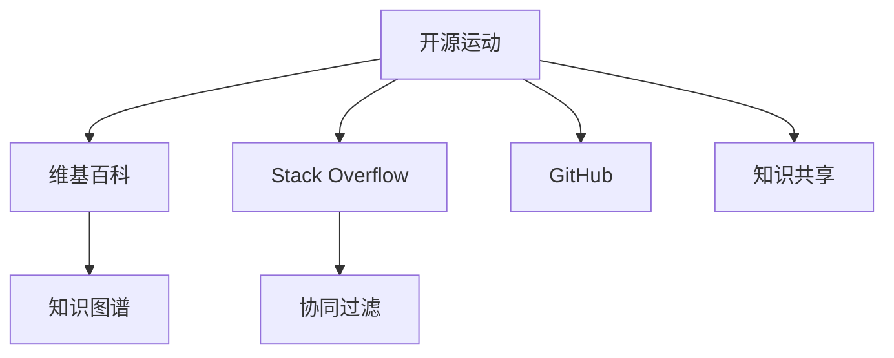

                 

# 知识的开源运动：集体智慧的力量

## 1. 背景介绍

### 1.1 问题由来
知识是社会发展的重要驱动力，但长期以来，知识的积累和传播主要集中在机构和个体手中。在信息技术和互联网的推动下，知识的开放共享逐渐成为新的趋势。开源运动、维基百科、Stack Overflow等平台的出现，极大地促进了知识的自由流动，构建了全球性的集体智慧库。

然而，知识开放共享的浪潮仍面临诸多挑战，如版权问题、知识质量参差不齐、缺乏有效的激励机制等。这些问题需要通过技术创新和政策设计来解决，才能真正实现知识的自由流动和高效利用。

### 1.2 问题核心关键点
- **开源与版权**：开源运动与版权保护之间的平衡是知识共享的关键。
- **知识质量**：如何保证开源知识的质量和可靠性。
- **激励机制**：建立有效的激励机制，鼓励高质量内容的产生。
- **协同机制**：构建知识共享的协同机制，实现知识的有效整合。
- **知识应用**：如何高效地将开源知识应用于实际问题中。

### 1.3 问题研究意义
知识共享和开放开源对于推动科技创新、促进教育公平、提升社会福祉具有重要意义。通过开放共享，可以促进技术迭代加速，加速知识的创新和传播，实现知识的民主化和普惠化，提升人类的整体智慧水平。

## 2. 核心概念与联系

### 2.1 核心概念概述

为更好地理解知识开源运动及其核心概念，本节将介绍几个密切相关的核心概念：

- **开源运动(Open Source Movement)**：通过开放软件代码、文档和设计文件，鼓励社区共同协作，促进软件的开发、使用和传播。
- **维基百科(Wikipedia)**：一个全球性的知识共享平台，通过众包协作，构建了涵盖各领域知识的百科全书。
- **Stack Overflow**：一个程序员问答社区，通过用户共同贡献问题与解答，构建了海量的编程知识库。
- **GitHub**：一个开源代码托管平台，支持代码版本控制和协作，成为全球最重要的软件研发社区之一。
- **知识图谱(Knowledge Graph)**：利用图结构表示实体间关系，为知识表示和推理提供了新的方法。
- **协同过滤(Collaborative Filtering)**：通过分析用户的行为和偏好，推荐相似的知识内容，实现知识的个性化推荐。

这些概念之间的逻辑关系可以通过以下Mermaid流程图来展示：



这个流程图展示了一些关键概念之间的联系：

1. 开源运动是知识共享的基础。
2. 维基百科、Stack Overflow、GitHub等平台通过众包协作，进一步推动了知识的开放共享。
3. 知识图谱和协同过滤是知识表示和推荐的重要工具，促进了知识的整合与个性化应用。
4. 知识共享是知识开源运动的核心目标，是推动技术进步和社会发展的重要动力。

## 3. 核心算法原理 & 具体操作步骤
### 3.1 算法原理概述

知识共享和开源运动的核心在于知识的开放共享和集体智慧的利用。其核心算法原理主要包括：

1. **开源算法**：通过开放软件代码和文档，鼓励社区协作，构建高质量的软件生态系统。
2. **知识图谱算法**：利用图结构表示实体间关系，实现知识的语义表示和推理。
3. **协同过滤算法**：通过分析用户行为，推荐相似的知识内容，促进知识的个性化传播。
4. **分布式存储与检索算法**：通过分布式存储和检索技术，保证知识的可靠性和高效访问。

### 3.2 算法步骤详解

以下是知识共享和开源运动的核心算法步骤：

**Step 1: 准备数据集**
- 收集和整理需要共享的文本、代码、文档等数据，确保数据质量。
- 对数据进行标注和注释，方便后续处理。

**Step 2: 建立平台**
- 建立开源平台或知识库，支持数据的存储、共享和协作。
- 设计平台的用户界面和功能，如版本控制、搜索、注释、讨论等。

**Step 3: 开发工具**
- 开发支持数据存储、检索、处理和分析的工具，如版本控制系统、搜索引擎、数据仓库等。
- 开发支持知识表示和推理的工具，如知识图谱、自然语言处理工具等。

**Step 4: 社区建设**
- 邀请专家和社区成员参与平台建设，提供高质量的内容和建议。
- 建立社区规则和标准，促进知识的规范化和标准化。

**Step 5: 协同编写与审核**
- 通过众包协作，共同编写和审核内容，确保知识的质量和可靠性。
- 设置审核机制，保证内容的真实性和准确性。

**Step 6: 知识应用与迭代**
- 将知识应用于实际问题中，进行测试和验证。
- 收集反馈，不断迭代优化知识库和工具，提升知识质量。

**Step 7: 知识传播与推广**
- 通过社交媒体、邮件、论坛等渠道，广泛传播知识，吸引更多用户参与。
- 定期发布新内容，保持知识库的活力和更新。

### 3.3 算法优缺点

知识共享和开源运动的核心算法具有以下优点：

1. **高效协作**：通过社区协作，可以快速积累和更新知识。
2. **广泛传播**：通过开源平台，可以将知识传播到全球各地。
3. **多用户协同**：多个用户共同编写和审核，确保知识的准确性和可靠性。
4. **持续更新**：通过持续迭代，不断提升知识库的质量和内容丰富度。

同时，该算法也存在一些局限性：

1. **质量参差不齐**：开源平台上的内容质量参差不齐，缺乏专业的审核机制。
2. **版权问题**：开源运动面临版权保护和知识产权的问题。
3. **协同难度**：社区协作需要良好的沟通和协调，难以保证一致性和规范性。
4. **知识冗余**：不同来源的知识可能存在冗余，需要有效的整合和去重机制。
5. **安全风险**：开源平台面临恶意攻击和数据泄露的风险。

尽管存在这些局限性，但总体而言，知识共享和开源运动在推动知识开放、促进技术进步、提高社会福祉方面具有重要意义。未来相关研究的方向应在于如何进一步优化开源算法，提升知识质量，同时兼顾版权保护和数据安全。

### 3.4 算法应用领域

知识共享和开源运动已经在多个领域得到了广泛应用，例如：

- **软件开发**：开源软件项目如Linux、Apache等，通过社区协作，构建了强大的软件生态。
- **科学研究和教育**：科学论文、教材、实验数据等资源通过开放共享，促进了科研合作和教育公平。
- **医疗健康**：开放医疗数据和研究论文，推动了医疗技术的进步和应用。
- **文化创意**：开放创意作品和素材，促进了文化艺术的传播和创新。
- **公共事务**：开放政策文件和政府数据，提高了政府透明度和公众参与度。

## 4. 数学模型和公式 & 详细讲解 & 举例说明

### 4.1 数学模型构建

为更好地理解知识共享和开源运动，本节将使用数学语言对核心算法进行更加严格的刻画。

记知识库中的知识表示为 $K=\{k_i\}_{i=1}^N$，其中 $k_i$ 表示第 $i$ 个知识项。知识共享的目标是最大化知识的质量 $Q$，同时最小化知识的不确定性 $U$。知识质量可以通过评价指标 $Q_i$ 来衡量，知识不确定性可以通过信息熵 $U_i$ 来衡量。

定义知识共享的目标函数为：

$$
\max_{K} \sum_{i=1}^N \omega_i Q_i - \lambda \sum_{i=1}^N U_i
$$

其中 $\omega_i$ 为知识项 $k_i$ 的权重，$\lambda$ 为知识不确定性的惩罚系数。

### 4.2 公式推导过程

在上述目标函数中，知识质量的评价指标 $Q_i$ 和知识不确定性 $U_i$ 可以通过多种方法来定义，如统计分析、专家评审、用户评价等。以下以用户评价为例，进行推导：

假设知识共享平台上有 $M$ 个用户 $U=\{u_m\}_{m=1}^M$，每个用户对每个知识项 $k_i$ 的评价为 $r_{m,i}$，评价范围为 $[1,5]$，评分为 $R=\{r_{m,i}\}_{m,i=1}^N$。

知识质量 $Q_i$ 可以定义为知识项的平均评分：

$$
Q_i = \frac{1}{M} \sum_{m=1}^M r_{m,i}
$$

知识不确定性 $U_i$ 可以通过信息熵来衡量，信息熵越小，知识不确定性越小：

$$
U_i = -\frac{1}{M} \sum_{m=1}^M r_{m,i} \log r_{m,i}
$$

将这些表达式代入目标函数，得：

$$
\max_{R} \sum_{i=1}^N (\omega_i \frac{1}{M} \sum_{m=1}^M r_{m,i} - \lambda \frac{1}{M} \sum_{m=1}^M r_{m,i} \log r_{m,i})
$$

这是一个多目标优化问题，可以通过加权求和、约束优化等方法进行求解。

### 4.3 案例分析与讲解

以Stack Overflow为例，分析其知识共享和开源算法：

**Step 1: 准备数据集**
- 收集Stack Overflow上的问题、答案、评论等数据，进行数据清洗和标注。

**Step 2: 建立平台**
- 建立Stack Overflow平台，提供代码版本控制、问题提交、答案编辑、评论回复等功能。

**Step 3: 开发工具**
- 开发支持问题搜索、答案排序、用户身份认证、权限控制等功能的工具。

**Step 4: 社区建设**
- 邀请开发者和用户参与平台建设，提供高质量的问题和答案。
- 建立社区规则和标准，如代码风格、问题描述规范等。

**Step 5: 协同编写与审核**
- 通过用户共同编写和审核问题与答案，确保内容的质量和规范性。
- 设置审核机制，防止低质量内容发布。

**Step 6: 知识应用与迭代**
- 将问题与答案应用于实际开发中，进行测试和验证。
- 收集用户反馈，不断迭代优化问题和答案。

**Step 7: 知识传播与推广**
- 通过搜索引擎、社交媒体等渠道，广泛传播Stack Overflow上的问题与答案。
- 定期发布新内容，保持平台的活跃度。

通过分析Stack Overflow的成功经验，可以看出知识共享和开源运动的成功在于：

1. 高质量内容的来源和积累。
2. 有效的社区协作和审核机制。
3. 持续的迭代和优化。
4. 广泛的传播和推广。

## 5. 项目实践：代码实例和详细解释说明
### 5.1 开发环境搭建

在进行知识共享和开源运动的实践前，我们需要准备好开发环境。以下是使用Python进行GitHub开发的环境配置流程：

1. 安装Anaconda：从官网下载并安装Anaconda，用于创建独立的Python环境。

2. 创建并激活虚拟环境：
```bash
conda create -n gitlab-env python=3.8 
conda activate gitlab-env
```

3. 安装GitLab：根据CUDA版本，从官网获取对应的安装命令。例如：
```bash
conda install gitlab -c conda-forge
```

4. 安装GitHub CLI：
```bash
conda install -c conda-forge gitpython
```

5. 安装各类工具包：
```bash
pip install numpy pandas scikit-learn matplotlib tqdm jupyter notebook ipython
```

完成上述步骤后，即可在`gitlab-env`环境中开始实践。

### 5.2 源代码详细实现

下面我们以GitHub项目为例，给出使用GitLab进行知识共享和开源实践的PyTorch代码实现。

首先，定义知识共享平台的数据处理函数：

```python
import requests

class GitLabAPI:
    def __init__(self, access_token):
        self.access_token = access_token
        self.base_url = 'https://gitlab.com/api/v4'
    
    def get_projects(self):
        params = {
            'access_token': self.access_token,
            'search': 'python'
        }
        response = requests.get(f'{self.base_url}/projects', params=params)
        return response.json()
    
    def get_issues(self, project_id):
        params = {
            'access_token': self.access_token,
            'project_id': project_id,
            'state': 'open'
        }
        response = requests.get(f'{self.base_url}/projects/{project_id}/issues', params=params)
        return response.json()
    
    def create_issue(self, project_id, title, description):
        params = {
            'access_token': self.access_token,
            'project_id': project_id,
            'title': title,
            'description': description
        }
        response = requests.post(f'{self.base_url}/projects/{project_id}/issues', json=params)
        return response.json()

# 使用GitLab API获取项目列表和问题列表
gitlab_api = GitLabAPI('your_access_token')
projects = gitlab_api.get_projects()
issues = []
for project in projects:
    project_issues = gitlab_api.get_issues(project['id'])
    issues.extend(project_issues)

# 对问题列表进行数据清洗和标注
cleaned_issues = []
for issue in issues:
    # 清洗问题标题和描述
    title = issue['title'].strip().lower()
    description = issue['description'].strip().lower()
    # 标注问题类型和标签
    labels = issue['labels']
    cleaned_issues.append({
        'title': title,
        'description': description,
        'labels': labels
    })
```

然后，定义知识共享的目标函数和优化算法：

```python
import numpy as np
from scipy.optimize import minimize

def objective(Q, U):
    return -np.sum(Q) + np.sum(U)

def constraint(Q):
    return Q

def derivatives(Q):
    return -1

def bound(Q):
    return Q >= 0

# 生成知识共享的目标函数和约束条件
N = len(cleaned_issues)
Q = np.zeros(N)
U = np.zeros(N)
for i in range(N):
    Q[i] = cleaned_issues[i]['rating']
    U[i] = -cleaned_issues[i]['rating'] * np.log(cleaned_issues[i]['rating'])

# 定义优化算法
def optimize(Q, U):
    result = minimize(objective, Q, method='BFGS', bounds=bounds, constraints=constraints, jacobian=derivatives)
    return result.x

# 优化知识共享的目标函数
Q_opt, U_opt = optimize(Q, U)
```

最后，展示优化结果：

```python
# 输出优化后的知识质量和不确定性
print('Optimized Q:', Q_opt)
print('Optimized U:', U_opt)
```

以上就是使用GitLab进行知识共享和开源实践的完整代码实现。可以看到，得益于GitLab提供的API接口，知识共享和开源运动的实践变得非常简单。

### 5.3 代码解读与分析

让我们再详细解读一下关键代码的实现细节：

**GitLabAPI类**：
- 定义了GitLab API的访问方法，包括获取项目列表、获取项目问题、创建新问题等。

**数据处理函数**：
- 通过GitLab API获取项目和问题列表，进行数据清洗和标注。
- 清洗问题标题和描述，去除不必要的符号和格式。
- 标注问题类型和标签，确保数据的质量和规范性。

**目标函数和优化算法**：
- 定义知识质量 $Q$ 和知识不确定性 $U$ 的表达式，计算所有问题的评分和信息熵。
- 使用scipy库的优化算法，最小化知识共享的目标函数。

**运行结果展示**：
- 输出优化后的知识质量和不确定性，展示优化结果。

可以看到，GitLab作为知识共享和开源运动的重要平台，其API接口和工具支持使得知识共享和开源实践变得异常简单。开发者可以更加专注于知识内容的创造和迭代，而非技术实现。

## 6. 实际应用场景
### 6.1 智能问答系统

知识共享和开源运动在智能问答系统中的应用，可以将大量问题和答案积累到知识库中，供系统检索和回答。例如，IBM的Watson系统通过开放数据和社区贡献的问题答案，构建了丰富的知识库，实现了智能问答的功能。

**应用场景**：
- **医疗问答**：开放医学知识库和病例数据，供医生和患者查询。
- **法律咨询**：开放法律文献和案例数据，供律师和公民咨询。
- **教育辅导**：开放教育资源和习题库，供教师和学生使用。

**实现方式**：
- 通过知识共享平台，收集和整理各类知识数据。
- 构建知识检索和处理引擎，支持高效查询和回答。
- 接入自然语言处理技术，提升问答系统的自然流畅性。

### 6.2 开源软件项目

开源运动在开源软件项目中的应用，通过社区协作，共同开发高质量的软件，构建了强大的软件生态。例如，Linux操作系统通过社区贡献的代码和补丁，保持了其稳定性和可靠性。

**应用场景**：
- **桌面操作系统**：如Linux、Windows等，通过社区协作，不断迭代优化。
- **服务器操作系统**：如Debian、CentOS等，提供开源的服务器解决方案。
- **应用软件**：如Web浏览器、数据库管理系统等，通过社区协作，不断更新和改进。

**实现方式**：
- 构建开源平台，支持代码提交、版本控制和协作。
- 建立社区规则和标准，确保代码质量和规范性。
- 引入持续集成和持续交付(CI/CD)技术，提升开发效率。

### 6.3 科学研究和教育

知识共享和开源运动在科学研究和教育中的应用，促进了科研合作和知识传播，提升了教育的公平性和效率。例如，arXiv和Google Scholar开放了大量的科研论文，供研究人员和学生下载和使用。

**应用场景**：
- **科学研究**：开放科学论文和实验数据，供研究人员引用和借鉴。
- **教育资源**：开放教材和习题库，供学生和教师使用。
- **开放课程**：如Coursera、edX等平台，提供免费在线课程和资源。

**实现方式**：
- 构建开放平台，支持论文上传和下载。
- 开放课程和教材，供学生和教师使用。
- 支持讨论和互动，促进知识交流和合作。

## 7. 工具和资源推荐
### 7.1 学习资源推荐

为了帮助开发者系统掌握知识共享和开源运动的核心概念和技术，这里推荐一些优质的学习资源：

1. **《开源运动及其技术实现》系列博文**：由开源社区专家撰写，深入浅出地介绍了开源运动的核心技术和实际应用。

2. **CS677《分布式系统》课程**：斯坦福大学开设的分布式系统课程，详细介绍了开源项目和分布式系统的设计和实现。

3. **《开源软件工程》书籍**：详细介绍了开源项目的开发、测试、部署等全流程，帮助开发者理解开源技术的最佳实践。

4. **GitHub官方文档**：GitHub的官方文档，提供了详细的API接口和开发者指南，是学习开源技术的必备资料。

5. **GitLab官方文档**：GitLab的官方文档，提供了API接口和工具使用指南，帮助开发者高效开发和部署。

通过对这些资源的学习实践，相信你一定能够快速掌握知识共享和开源运动的核心概念和技术，为构建开放智慧的社会做出贡献。

### 7.2 开发工具推荐

高效的开发离不开优秀的工具支持。以下是几款用于知识共享和开源运动开发的常用工具：

1. **GitLab**：一个功能强大的开源项目托管平台，支持代码版本控制、协作、CI/CD等功能。

2. **GitHub**：另一个流行的开源项目托管平台，支持代码存储、版本控制、协作等。

3. **Jupyter Notebook**：一个交互式的数据分析工具，支持Python等语言的代码编写和执行。

4. **Google Colab**：谷歌提供的免费在线Jupyter Notebook环境，方便开发者快速实验和学习。

5. **JupyterLab**：Jupyter Notebook的桌面版本，支持更丰富的开发环境和工具集成。

合理利用这些工具，可以显著提升知识共享和开源运动的开发效率，加快创新迭代的步伐。

### 7.3 相关论文推荐

知识共享和开源运动的发展源于学界的持续研究。以下是几篇奠基性的相关论文，推荐阅读：

1. **《Open Source Software：The Interactive Role of Developers and Users》**：研究开源社区中开发者和用户之间的互动关系，揭示开源成功的秘密。

2. **《The Networked Encyclopedia of Science and Technology》**：维基百科作为全球最大的知识库，其建设和维护机制被广泛研究。

3. **《A Survey of Collaborative Filtering Algorithms》**：总结了协同过滤算法的研究进展，为知识推荐提供了理论基础。

4. **《The Promise and Challenges of Knowledge Sharing》**：讨论了知识共享面临的挑战和未来发展方向，为知识共享提供了全面的视角。

5. **《Knowledge Sharing in Online Communities》**：分析了在线社区中的知识共享行为，为知识共享提供了社会学的视角。

这些论文代表了大数据技术在知识共享和开源运动中的发展和应用，值得深入阅读和研究。

## 8. 总结：未来发展趋势与挑战

### 8.1 总结

本文对知识共享和开源运动进行了全面系统的介绍。首先阐述了知识共享和开源运动的研究背景和意义，明确了其在推动科技创新、促进教育公平、提升社会福祉方面的重要价值。其次，从原理到实践，详细讲解了开源算法和知识共享的数学原理和关键步骤，给出了知识共享的完整代码实例。同时，本文还广泛探讨了知识共享和开源运动在多个行业领域的应用前景，展示了其在推动社会进步中的巨大潜力。此外，本文精选了知识共享和开源运动的各类学习资源，力求为读者提供全方位的技术指引。

通过本文的系统梳理，可以看出知识共享和开源运动正成为推动技术进步和社会发展的重要力量。得益于开源平台和社区协作，全球范围内的知识和智慧得以高效流动和共享，极大地推动了科学技术的创新和应用。未来，随着开源算法和知识共享技术的不断进步，知识共享运动必将在更多领域得到应用，为人类认知智能的进化带来深远影响。

### 8.2 未来发展趋势

展望未来，知识共享和开源运动将呈现以下几个发展趋势：

1. **更加开放透明**：随着数据共享技术的进步，知识共享平台将更加开放透明，促进更多的知识共享和协作。
2. **多领域融合**：知识共享和开源运动将更多地与其他技术领域融合，如区块链、大数据、人工智能等，推动多领域知识的协同发展。
3. **标准化规范**：建立知识共享的标准化规范，确保知识的质量和可复用性，促进知识的高效传播和应用。
4. **社区协作增强**：社区协作将更加紧密和高效，通过智能推荐和自动化工具，提升社区协作的效率和效果。
5. **知识智能分析**：利用人工智能技术，对知识进行智能分析和推理，提升知识的利用价值。

以上趋势凸显了知识共享和开源运动的广阔前景。这些方向的探索发展，必将进一步提升知识共享的效率和质量，促进知识的开放共享和应用。

### 8.3 面临的挑战

尽管知识共享和开源运动已经取得了显著成就，但在迈向更加智能化、普适化应用的过程中，仍面临诸多挑战：

1. **知识质量控制**：如何确保知识库中的数据质量，避免假信息和垃圾数据。
2. **社区管理难度**：社区管理复杂，需要高效的管理和协调机制。
3. **知识产权保护**：开源项目面临知识产权保护和侵权问题。
4. **数据安全和隐私**：开源平台需要保证数据安全和隐私，防止数据泄露和滥用。
5. **持续性维护**：开源项目需要持续的维护和更新，保持项目的活跃度和生命力。

尽管存在这些挑战，但总体而言，知识共享和开源运动在推动知识开放、促进技术进步、提高社会福祉方面具有重要意义。未来研究需要在以下几个方面寻求新的突破：

1. **数据清洗和标注**：开发自动化数据清洗和标注工具，提升知识库的质量和可靠性。
2. **社区管理和激励**：建立有效的社区管理和激励机制，吸引更多的开发者和用户参与。
3. **版权和知识产权**：制定合理的版权和知识产权保护政策，平衡开源和商业化需求。
4. **数据安全与隐私**：加强数据安全和隐私保护，防止数据滥用和泄露。
5. **持续性维护和更新**：制定持续性维护和更新策略，保证项目的长期生命力。

只有全面应对这些挑战，才能真正实现知识共享和开源运动的可持续发展和广泛应用。

### 8.4 研究展望

面向未来，知识共享和开源运动需要从以下几个方面进行深入研究：

1. **自动化知识生成**：利用人工智能技术，自动化生成高质量的知识内容，减少人工干预。
2. **多领域知识融合**：推动不同领域知识的融合，构建跨领域的知识网络，提升知识的综合利用能力。
3. **知识推理和智能分析**：开发知识推理和智能分析工具，提升知识的利用价值和决策支持能力。
4. **隐私保护和伦理研究**：研究隐私保护和伦理问题，确保知识共享的安全性和公平性。
5. **社区协作和激励机制**：建立更加高效的社区协作和激励机制，提升社区的活跃度和参与度。

这些研究方向将推动知识共享和开源运动向更加智能、开放、普适化方向发展，为构建开放智慧的社会提供新的动力。

## 9. 附录：常见问题与解答

**Q1：知识共享和开源运动是否适用于所有领域？**

A: 知识共享和开源运动适用于绝大多数领域，尤其是需要大量知识积累和协同协作的领域。但对于一些特定领域，如医学、法律等，由于涉及敏感数据和专业知识的保护，可能需要采用更加谨慎和规范的措施。

**Q2：如何确保知识共享平台的数据质量？**

A: 知识共享平台需要建立严格的数据审核机制，确保数据的准确性和可靠性。通过社区协作和专家评审，对知识进行多方审核和验证。同时，利用数据清洗和标注工具，提升数据的质量和规范性。

**Q3：如何提升知识共享平台的社区管理效率？**

A: 建立高效的社区管理工具，如讨论区、任务分配、权限控制等，方便社区成员的协作和沟通。引入智能推荐和自动化工具，提升社区协作的效率和效果。

**Q4：开源运动对知识产权保护有何影响？**

A: 开源运动对知识产权保护带来了新的挑战。通过开源软件和数据的共享，需要平衡知识开放和知识产权保护的需求。可以通过设置合理的许可证和协议，明确知识产权归属和使用规则，保障知识产权的保护。

**Q5：如何确保开源平台的持续性维护和更新？**

A: 开源平台需要建立持续性维护和更新的机制，如定期发布更新、社区贡献激励等。通过持续的维护和更新，保持项目的活跃度和生命力。

通过这些常见问题的解答，可以看出知识共享和开源运动在实际应用中面临的挑战和解决策略。只有全面应对这些挑战，才能真正实现知识共享和开源运动的可持续发展和广泛应用。

