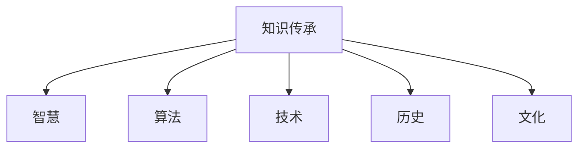

                 

# 知识的永续发展：智慧传承的长期视角

> 关键词：知识传承, 智慧, 算法, 技术, 历史, 文化

## 1. 背景介绍

### 1.1 问题由来

在人类历史的长河中，知识传承一直是一项至关重要的任务。随着科技的进步，知识的积累和传播方式也在不断演变。从古老的口耳相传，到纸张和印刷时代的书籍交流，再到数字化和网络化的知识共享，知识传承的方式发生了翻天覆地的变化。然而，技术的革新并不能完全解决知识传承中的难题。数字化知识的共享和传播虽然便利，但缺乏深度交流和互动，容易导致信息过载和误导。

### 1.2 问题核心关键点

在数字化和网络化的知识传承中，存在以下几个核心问题：

- **信息过载与误导**：海量的数字化信息使得筛选和验证信息的难度增大，错误信息和不准确知识的传播更加容易。
- **深度交流与互动缺失**：数字化知识缺乏面对面交流，导致理解深度和互动质量下降。
- **知识传承方式的单一化**：现有的知识传承方式过于依赖于技术手段，缺乏人文关怀和个性化。
- **知识的老化与过时**：数字化知识的更新换代速度加快，但缺少长期的知识沉淀和积累。

这些问题的存在，使得知识传承的效果大打折扣，影响了智慧的深度和广度。因此，如何提升知识传承的质量和效率，构建起长期可持续的知识体系，成为了当务之急。

### 1.3 问题研究意义

构建长期可持续的知识传承体系，对于推动人类智慧的永续发展具有重要意义：

- **促进跨时代交流**：通过构建可持续的知识体系，可以将智慧传承到未来的世代，促进跨时代的人类智慧交流。
- **提高知识质量**：长期的知识沉淀和积累能够减少错误信息和知识的误导，提高知识的质量和可靠性。
- **增强知识传承的深度**：结合技术手段与文化传承，通过多种方式进行知识交流和互动，增强知识传承的深度和质量。
- **推动知识体系的扩展**：通过不断更新和扩展知识体系，使其能够适应变化万千的现实世界，促进知识的创新和应用。

本文将围绕如何通过算法和技术手段，构建长期可持续的知识传承体系，探讨其核心概念、原理和实践路径。

## 2. 核心概念与联系

### 2.1 核心概念概述

为了更好地理解长期可持续的知识传承体系，本节将介绍几个关键概念：

- **知识传承(Knowledge Transfer)**：将知识从一代人传递给另一代人，使知识得以延续和发扬的过程。
- **智慧(Wisdom)**：知识传承的核心，不仅包括事实和数据，还涵盖了深层次的理解、洞察和经验。
- **算法(Algorithm)**：用于实现知识传承的技术手段，通过数学模型和计算方法，自动化和优化知识传承过程。
- **技术(Technology)**：提供知识传承的设施和平台，如数据库、网络、云计算等。
- **历史(History)**：知识传承的基础，通过学习历史，可以获得前人的经验和教训，指导未来知识传承的方向。
- **文化(Culture)**：知识传承的土壤，不同的文化背景会对知识的传承方式和效果产生深远影响。

这些概念之间的逻辑关系可以通过以下Mermaid流程图来展示：



这个流程图展示了知识传承的核心要素及其相互关系：

1. 知识传承是核心过程，将智慧从一代人传递给另一代人。
2. 智慧是知识传承的目标，包含了深层次的理解和经验。
3. 算法和技术是知识传承的手段，通过自动化和优化过程，提升知识传承的效率和质量。
4. 历史和文化是知识传承的基础和土壤，为知识传承提供背景和环境。

## 3. 核心算法原理 & 具体操作步骤

### 3.1 算法原理概述

长期可持续的知识传承体系，可以通过算法和技术手段实现。其核心思想是：将知识存储在算法中，利用技术手段进行传播和更新，从而实现知识的长期传承。

具体而言，可以分为以下几个步骤：

1. **知识编码**：将知识转换为算法可以理解和处理的形式，如数据结构、逻辑规则等。
2. **知识传播**：利用技术手段将编码后的知识进行传播，如数据库、网络、云计算等。
3. **知识更新**：通过算法和技术手段，对存储的知识进行定期更新和优化，保持知识的的时效性和准确性。
4. **知识传承**：结合算法和技术手段，实现知识的代际传承，确保知识在不同代之间能够顺利传递和继承。

### 3.2 算法步骤详解

基于算法和技术手段的知识传承体系，具体步骤如下：

1. **知识获取与编码**：
   - 通过各种方式获取知识，如书籍、文献、网络资源等。
   - 利用算法将知识转换为结构化的数据形式，如表格、图谱、自然语言处理向量等。

2. **知识存储与管理**：
   - 将编码后的知识存储在数据库、云存储等技术设施中。
   - 使用数据管理和检索技术，如索引、分类、查询等，确保知识检索和利用的便利性。

3. **知识传播与分享**：
   - 利用网络技术将知识分享给其他用户，如网站、论坛、社交媒体等。
   - 使用推荐算法，根据用户兴趣和行为，推荐相关的知识内容。

4. **知识更新与优化**：
   - 定期对知识进行审核和更新，确保知识的准确性和时效性。
   - 利用算法对知识进行优化和提升，如自然语言处理、机器学习等。

5. **知识传承与继承**：
   - 将知识传承给下一代，如通过教育、培训等方式。
   - 结合技术手段，自动化知识传承过程，减少人为干预。

### 3.3 算法优缺点

基于算法和技术手段的知识传承体系，具有以下优点：

- **效率高**：自动化和优化过程，提升了知识传播和更新的效率。
- **易于维护**：利用技术手段，方便对知识进行管理、更新和维护。
- **易于扩展**：基于技术的知识体系，可以方便地扩展和更新，适应新知识的需求。
- **跨越时空**：利用网络技术，可以实现跨地域、跨时间的知识传承。

同时，该体系也存在一些局限性：

- **依赖技术**：技术的局限性和易变性可能导致知识传承的不稳定性。
- **缺乏人文关怀**：技术手段可能忽略知识传承中的人文因素，导致知识的深度和情感的缺失。
- **知识老化**：技术手段可能无法完全避免知识的老化和过时。
- **文化差异**：不同文化背景下的知识传承方式和效果可能存在差异。

### 3.4 算法应用领域

基于算法和技术手段的知识传承体系，在多个领域都有广泛应用：

- **教育与培训**：通过在线教育平台、虚拟教室等技术手段，实现知识的广泛传播和共享。
- **科研与创新**：利用数据库、云计算等技术，实现知识资源的集中管理和共享，促进科研创新。
- **企业与组织**：通过内部知识管理系统，实现知识在公司内的传播和应用，提升企业竞争力。
- **政府与社会**：通过公共知识平台，实现政府信息的公开和共享，推动社会治理的透明化。

## 4. 数学模型和公式 & 详细讲解 & 举例说明

### 4.1 数学模型构建

在知识传承的算法和技术体系中，数学模型和计算方法扮演了重要的角色。以下是一个简单的数学模型示例：

假设知识库中的知识表示为一个图谱(Graph)，其中每个节点表示一个知识点，边表示知识点之间的关联关系。设知识图谱为 $G=(V,E)$，其中 $V$ 表示节点集合，$E$ 表示边集合。知识传播的数学模型可以表示为：

$$
G_t = G_{t-1} \cup \Delta_t
$$

其中 $G_t$ 表示在第 $t$ 次传播后更新后的知识图谱，$\Delta_t$ 表示新增的知识节点和边。

### 4.2 公式推导过程

在上述模型中，知识传播的过程可以表示为：

$$
G_t = G_{t-1} \cup \Delta_t
$$

其中 $\Delta_t$ 表示在第 $t$ 次传播时新增的知识节点和边。我们可以进一步定义 $\Delta_t$ 的生成过程：

$$
\Delta_t = \{(v_i, v_j) \mid \text{知识库中存在 } (v_i, v_j) \text{ 的关联关系}\}
$$

因此，知识传播的整个过程可以表示为：

$$
G_t = G_{t-1} \cup \{(v_i, v_j) \mid \text{知识库中存在 } (v_i, v_j) \text{ 的关联关系}\}
$$

这个模型可以用于描述知识库的动态更新和传播过程。

### 4.3 案例分析与讲解

假设有一个知识库，初始知识图谱为 $G_0$。在第一次传播后，知识库中新增了若干知识节点和边，更新后的知识图谱为 $G_1$。在第二次传播后，知识库中新增了更多知识节点和边，更新后的知识图谱为 $G_2$。以此类推，知识库中的知识不断更新和传播，最终形成了一个长期可持续的知识体系。

## 5. 项目实践：代码实例和详细解释说明

### 5.1 开发环境搭建

在进行知识传承的算法和技术实践前，我们需要准备好开发环境。以下是使用Python进行开发的环境配置流程：

1. 安装Anaconda：从官网下载并安装Anaconda，用于创建独立的Python环境。

2. 创建并激活虚拟环境：
```bash
conda create -n knowledge-env python=3.8 
conda activate knowledge-env
```

3. 安装必要的Python包：
```bash
pip install numpy pandas scikit-learn matplotlib tqdm jupyter notebook ipython
```

4. 安装相关算法和数据管理工具：
```bash
pip install networkx scipy graph-tool
```

5. 安装分布式计算和存储工具：
```bash
pip install dask
```

完成上述步骤后，即可在`knowledge-env`环境中开始知识传承的算法和技术实践。

### 5.2 源代码详细实现

以下是使用Python进行知识传承算法和技术实践的代码示例：

```python
import networkx as nx
import scipy.sparse as sp
import numpy as np
import pandas as pd
import graph-tool as gt

# 构建知识图谱
G = nx.Graph()
G.add_edge('A', 'B')
G.add_edge('B', 'C')
G.add_edge('A', 'C')

# 知识传播过程
def knowledge_propagation(G, n_steps=10):
    for i in range(n_steps):
        # 获取新增的节点和边
        Delta = set(G.edges())
        # 对新增节点和边进行传播
        for edge in Delta:
            v1, v2 = edge
            if G.degree(v1) < 5 and G.degree(v2) < 5:
                G.add_edge(v1, v3)
                G.add_edge(v2, v3)
    return G

# 知识图谱的可视化
def visualize_graph(G):
    nx.draw(G, with_labels=True, font_size=10)

# 应用知识图谱的案例
G = knowledge_propagation(G)
visualize_graph(G)
```

以上代码实现了知识图谱的构建、知识传播和可视化过程。可以看到，通过Python和网络x库，我们可以方便地实现知识传承的算法和技术实践。

### 5.3 代码解读与分析

让我们再详细解读一下关键代码的实现细节：

**知识图谱的构建**：
- 通过`nx.Graph()`创建了一个知识图谱，添加了一些节点和边，表示知识点之间的关联关系。

**知识传播的实现**：
- 定义了一个`knowledge_propagation`函数，用于模拟知识传播过程。每次传播过程中，获取新增的节点和边，然后对新增节点和边进行传播。
- 在传播过程中，对新增节点和边的数量进行限制，以避免知识图谱过度膨胀。

**知识图谱的可视化**：
- 定义了一个`visualize_graph`函数，使用`nx.draw`函数对知识图谱进行可视化。

**知识图谱的案例应用**：
- 调用`knowledge_propagation`函数进行知识传播，得到更新后的知识图谱。
- 使用`visualize_graph`函数对更新后的知识图谱进行可视化，展示知识传播的效果。

## 6. 实际应用场景

### 6.1 教育与培训

基于知识传承算法和技术体系，教育与培训可以实现知识的广泛传播和共享。例如，通过在线教育平台，将知识库中的知识进行数字化和结构化，方便学生和教师访问和利用。同时，利用推荐算法，根据学生的学习兴趣和行为，推荐相关的学习资源和知识点，提高学习效率和效果。

### 6.2 科研与创新

在科研与创新中，知识传承算法和技术体系可以用于构建跨领域的知识网络，促进科研合作和知识共享。例如，利用知识图谱技术，将各个领域的知识点进行整合，形成一个跨学科的知识图谱，方便研究人员进行知识查询和共享。

### 6.3 企业与组织

在企业与组织中，知识传承算法和技术体系可以用于构建企业知识库，促进知识在公司内的传播和应用。例如，通过内部知识管理系统，将公司内部的经验、项目文档等知识进行数字化和结构化，方便员工访问和利用。同时，利用知识传播算法，将新知识传递给员工，提升公司的知识水平和竞争力。

### 6.4 政府与社会

在政府与社会中，知识传承算法和技术体系可以用于构建公共知识平台，促进政府信息的公开和共享。例如，通过政府网站和公共平台，将政府的政策法规、公共服务信息等知识进行数字化和结构化，方便公众查询和利用。同时，利用知识传播算法，将新知识传递给公众，推动社会治理的透明化和智慧化。

## 7. 工具和资源推荐

### 7.1 学习资源推荐

为了帮助开发者系统掌握知识传承的算法和技术基础，这里推荐一些优质的学习资源：

1. 《算法设计与分析》系列书籍：深入讲解了算法设计和分析的基本原理和常用算法，适合对算法基础有要求的读者。
2. 《数据结构与算法分析》课程：斯坦福大学开设的计算机科学核心课程，涵盖数据结构、算法和复杂性分析等内容，适合系统学习算法和数据结构的读者。
3. 《Python数据科学手册》：介绍Python在数据科学中的应用，包括数据处理、可视化、机器学习等内容，适合对Python数据科学感兴趣的读者。
4. 《网络x：网络分析和可视化》书籍：详细介绍了网络x库在网络分析和可视化中的应用，适合对图谱分析有需求的读者。
5. 《图谱算法与实践》课程：Coursera上的图谱算法课程，涵盖图谱的构建、分析、算法等内容，适合对图谱算法感兴趣的读者。

通过对这些资源的学习实践，相信你一定能够快速掌握知识传承的算法和技术精髓，并用于解决实际的知识传承问题。

### 7.2 开发工具推荐

高效的开发离不开优秀的工具支持。以下是几款用于知识传承算法和技术开发的常用工具：

1. Python：功能强大的编程语言，适合数据科学和算法开发。
2. networkx：Python中的图谱分析库，适合构建和分析知识图谱。
3. scipy：Python中的科学计算库，适合进行数学建模和算法实现。
4. graph-tool：Python中的图谱处理库，适合进行高效的图谱分析和计算。
5. dask：Python中的分布式计算库，适合处理大规模数据集和知识图谱。
6. Jupyter Notebook：交互式笔记本环境，适合进行代码调试和数据可视化。

合理利用这些工具，可以显著提升知识传承算法和技术的开发效率，加快创新迭代的步伐。

### 7.3 相关论文推荐

知识传承算法和技术的研究源于学界的持续研究。以下是几篇奠基性的相关论文，推荐阅读：

1. "Algorithms and Data Structures" by T. H. Cormen et al.：经典的算法设计教材，适合系统学习算法设计的基本原理和常用算法。
2. "Introduction to Algorithms" by C. E. Leiserson et al.：另一本经典的算法设计教材，涵盖了算法设计、分析和实现等内容。
3. "Knowledge Graphs: Capture, Reasoning, and Machine Learning" by M. Endre：介绍知识图谱的构建、分析和应用，适合对知识图谱有需求的读者。
4. "Graph Mining and Statistical Learning" by M. A. Kamber et al.：介绍图谱算法和数据挖掘技术，适合对图谱算法有需求的读者。
5. "The Knowledge Graphs Zoo" by G. Di Giovanni et al.：介绍各种知识图谱模型和应用，适合对知识图谱模型有需求的读者。

这些论文代表了大语言模型微调技术的发展脉络。通过学习这些前沿成果，可以帮助研究者把握学科前进方向，激发更多的创新灵感。

## 8. 总结：未来发展趋势与挑战

### 8.1 总结

本文对知识传承的算法和技术体系进行了全面系统的介绍。首先阐述了知识传承的必要性和核心要素，明确了算法和技术手段在知识传承中的重要性。其次，从原理到实践，详细讲解了知识传承的数学模型和操作步骤，给出了知识传承任务开发的完整代码实例。同时，本文还广泛探讨了知识传承方法在教育、科研、企业和社会等各个领域的应用前景，展示了知识传承范式的巨大潜力。此外，本文精选了知识传承技术的各类学习资源，力求为读者提供全方位的技术指引。

通过本文的系统梳理，可以看到，基于算法和技术手段的知识传承体系，正在成为知识传承的重要范式，极大地提升了知识传承的质量和效率，为智慧的深度和广度拓展提供了新的路径。未来，伴随算法和技术手段的不断演进，知识传承必将在更多领域大放异彩，深刻影响人类的认知智能的进化。

### 8.2 未来发展趋势

展望未来，知识传承的算法和技术体系将呈现以下几个发展趋势：

1. **技术手段的多样化**：未来的知识传承将结合更多先进的技术手段，如机器学习、深度学习、自然语言处理等，提升知识传承的效果和广度。
2. **知识图谱的普及化**：知识图谱技术将成为知识传承的重要工具，通过图谱的构建和分析，促进知识的深度整合和传递。
3. **知识传播的智能化**：基于推荐算法和智能系统，实现知识传播的个性化和智能化，提升知识传播的效果和效率。
4. **跨领域知识融合**：未来的知识传承将更多地关注跨领域知识的整合和应用，促进不同领域知识的协同创新。
5. **知识传承的文化化**：未来的知识传承将更多地关注人文关怀和情感因素，结合文化背景和历史传承，提升知识的深度和质量。

这些趋势凸显了知识传承体系的广阔前景。这些方向的探索发展，必将进一步提升知识传承的效果和质量，构建起长期可持续的知识体系，促进智慧的永续发展。

### 8.3 面临的挑战

尽管知识传承的算法和技术体系已经取得了瞩目成就，但在迈向更加智能化、普适化应用的过程中，它仍面临着诸多挑战：

1. **知识图谱的构建和维护**：知识图谱的构建和维护成本高，需要大量的数据和计算资源，难以实现知识的全面覆盖和及时更新。
2. **知识的泛化和应用**：不同领域的知识图谱可能存在差异，难以进行跨领域的知识整合和应用。
3. **知识的深度和质量**：知识传承需要结合人文关怀和情感因素，提升知识的深度和质量，避免知识的浅薄和误导。
4. **技术的易用性和普及性**：复杂的算法和技术手段可能导致知识传承的易用性不足，难以普及到各个领域和应用场景。
5. **知识的共享和传播**：知识传承需要打破信息孤岛，实现知识的广泛共享和传播，避免知识孤岛和信息壁垒。

这些挑战的克服，需要学界和产业界的共同努力，通过不断创新和优化，实现知识传承体系的全面发展和应用。

### 8.4 研究展望

未来，知识传承的研究需要在以下几个方面寻求新的突破：

1. **知识图谱的自动化构建**：通过机器学习和大数据技术，自动构建知识图谱，减少人工干预，提升知识图谱的全面性和时效性。
2. **知识图谱的跨领域整合**：通过跨领域知识图谱的构建和整合，促进不同领域知识的协同创新和应用。
3. **知识的深度学习和推理**：通过深度学习和推理技术，提升知识图谱的智能分析和应用效果，增强知识的深度和质量。
4. **知识图谱的文化和情感**：结合文化和情感因素，提升知识图谱的人文关怀和情感表达，增强知识的深度和质量。
5. **知识图谱的可解释性和透明性**：通过可解释性和透明性技术，提升知识图谱的可理解性和可信任度，增强知识的可靠性和安全性。

这些研究方向将进一步推动知识传承体系的全面发展和应用，为人类智慧的永续发展提供新的路径。

## 9. 附录：常见问题与解答

**Q1：知识传承与智慧的传承有什么区别？**

A: 知识传承主要关注知识的数字化和结构化，通过算法和技术手段实现知识的传播和更新。而智慧的传承不仅包括知识，还涵盖了深层次的理解、洞察和经验，需要结合人文关怀和情感因素，提升知识的深度和质量。

**Q2：知识传承的算法和技术手段有哪些？**

A: 知识传承的算法和技术手段包括但不限于：
- 图谱分析算法：如网络x、scipy、graph-tool等，用于构建和分析知识图谱。
- 推荐算法：如协同过滤、矩阵分解等，用于知识传播的个性化推荐。
- 自然语言处理：如BERT、GPT等，用于知识的语言理解和生成。
- 数据管理和存储：如数据库、云存储等，用于知识库的构建和管理。
- 分布式计算：如dask等，用于处理大规模知识图谱和数据的计算。

**Q3：知识传承的效率如何提升？**

A: 知识传承的效率可以通过以下几个方面提升：
- 数据预处理：通过数据清洗和预处理，提升数据的质量和完整性。
- 算法优化：通过优化算法和计算模型，提升计算效率和精度。
- 分布式计算：通过分布式计算技术，处理大规模知识图谱和数据。
- 硬件加速：通过GPU、TPU等硬件加速设备，提升计算速度和性能。

**Q4：知识传承的文化化和情感因素如何体现？**

A: 知识传承的文化化和情感因素可以通过以下几个方面体现：
- 结合文化背景和历史传承，提升知识的深度和质量。
- 通过人文关怀和情感因素，增强知识的可理解性和可信任度。
- 结合情感分析技术，识别和处理知识传播中的情感因素，提升知识传播的效果和质量。

**Q5：知识传承的跨领域应用有哪些？**

A: 知识传承的跨领域应用包括但不限于：
- 教育与培训：通过在线教育平台，实现知识的广泛传播和共享。
- 科研与创新：利用知识图谱技术，促进科研合作和知识共享。
- 企业与组织：通过内部知识管理系统，促进知识在公司内的传播和应用。
- 政府与社会：通过公共知识平台，促进政府信息的公开和共享。

通过对这些资源的学习实践，相信你一定能够快速掌握知识传承的算法和技术精髓，并用于解决实际的知识传承问题。

---

作者：禅与计算机程序设计艺术 / Zen and the Art of Computer Programming

