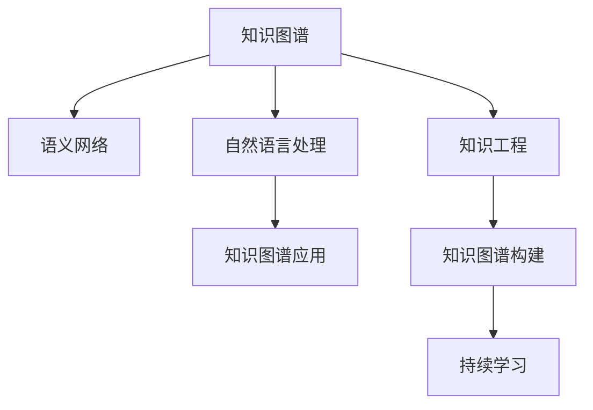
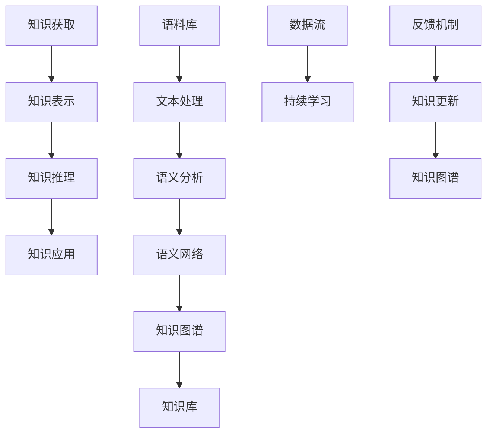

                 

# 知识的流动性：信息时代的学习动态

> 关键词：知识图谱, 语义网络, 自然语言处理, 知识工程, 持续学习

## 1. 背景介绍

### 1.1 问题由来
在信息时代，知识的流动性和学习动态正变得前所未有的复杂和多样化。随着互联网和大数据技术的发展，知识的量级、结构和传播方式都在快速变化。如何高效地获取、组织、处理和利用知识，成为了科技界和社会各界共同关注的焦点。特别是在教育、医疗、科研等领域，知识的流动性和学习动态对人类社会的影响更加深远。

### 1.2 问题核心关键点
本节将探讨知识流动性和学习动态的核心概念及其重要性：

- **知识图谱**：一种用于描述实体、关系及其属性的结构化知识表示形式，具有语义关联性，能够支持复杂的推理和查询。
- **语义网络**：以节点和边为基本单位构建的知识图谱模型，用于表示实体、属性、关系和语义逻辑，是知识图谱的核心组成部分。
- **自然语言处理(NLP)**：涉及计算机对自然语言的理解、生成和交互的技术，是知识图谱和语义网络的重要应用领域。
- **知识工程**：将人类知识转换为机器可理解的形式，构建知识库和推理系统的过程，是实现知识图谱和语义网络的关键技术。
- **持续学习**：一种使机器能够持续从新数据中学习，同时保持已有知识的技术，是维持知识图谱动态更新和保持信息时效性的重要手段。

这些概念之间的关系可以通过以下Mermaid流程图来展示：



这个流程图展示了知识图谱、语义网络、自然语言处理、知识工程和持续学习这些核心概念之间的逻辑关系：

1. 知识图谱通过语义网络描述实体、关系及其属性。
2. 自然语言处理技术帮助计算机理解和使用自然语言，将文本转化为语义网络。
3. 知识工程技术将人类知识映射为机器可理解的形式，构建和维护知识图谱。
4. 持续学习技术使知识图谱能够不断从新数据中学习，保持知识的时效性和准确性。
5. 知识图谱和语义网络被广泛应用于各种场景，如问答系统、知识推荐、文本挖掘等。

## 2. 核心概念与联系

### 2.1 核心概念概述

本节将对知识图谱、语义网络和自然语言处理等核心概念进行概述，并解释它们之间的联系。

- **知识图谱**：由节点（实体）和边（关系）构成，用于描述实体和关系之间的语义联系。每个节点包含属性，用于进一步细化实体的信息。例如，一个节点的属性可能包括名称、类别、属性值等。

- **语义网络**：一种无向图，节点代表概念，边代表概念之间的关系，体现了概念之间的语义联系。例如，“Tom”和“Jerry”之间的边代表“Tom”和“Jerry”是同一系列中的角色。

- **自然语言处理(NLP)**：涉及文本的自动处理，包括文本分类、命名实体识别、句法分析、语义分析、情感分析等。通过NLP技术，计算机可以理解、生成和交互自然语言，将其转化为语义网络。

- **知识工程**：构建知识库和推理系统的过程，包括知识获取、知识表示、知识推理和知识管理等。通过知识工程，人类知识可以转化为机器可理解的形式，并构建知识图谱。

- **持续学习**：一种使机器能够不断学习新知识的技术，保持已有知识的有效性和及时性。持续学习使知识图谱能够动态更新，保持信息的时效性。

### 2.2 核心概念原理和架构的 Mermaid 流程图



这个流程图展示了知识获取、知识表示、知识推理、知识应用、语料库、文本处理、语义分析、语义网络、知识图谱、知识库、数据流、持续学习和反馈机制等核心概念之间的联系：

1. 知识获取：通过数据流从语料库中获取知识。
2. 知识表示：将获取的知识转化为语义网络。
3. 知识推理：基于语义网络进行逻辑推理，得出新的知识和结论。
4. 知识应用：将推理出的知识应用于实际问题，如问答、推荐等。
5. 文本处理和语义分析：将文本转化为语义网络，为知识表示和推理提供基础。
6. 语义网络和知识图谱：通过语义网络和知识图谱，将知识表示为结构化的形式。
7. 知识库：存储和管理知识图谱，支持知识的检索、更新和应用。
8. 持续学习：从新数据中学习，更新知识库和知识图谱。
9. 反馈机制：将应用效果反馈到知识获取和知识表示中，优化知识获取和表示过程。

## 3. 核心算法原理 & 具体操作步骤

### 3.1 算法原理概述

知识图谱和语义网络的构建和应用，通常涉及以下几个步骤：

1. **知识获取**：从各种数据源中提取实体、关系和属性，转化为语义网络。
2. **知识表示**：将语料库中的信息转化为语义网络，包括实体识别、关系抽取、属性填充等。
3. **知识推理**：基于已有的语义网络进行推理，得出新的知识和结论。
4. **知识应用**：将推理出的知识应用于实际问题，如问答、推荐、文本生成等。
5. **持续学习**：通过新数据不断更新知识图谱，保持知识的实时性和准确性。

这些步骤通常涉及到自然语言处理、知识工程和机器学习等技术。其中，自然语言处理用于将文本转化为语义网络，知识工程用于构建和管理知识图谱，机器学习用于持续学习新知识。

### 3.2 算法步骤详解

以下将详细介绍知识图谱构建的详细步骤：

1. **数据收集**：从互联网、数据库、文献等数据源中收集实体和关系信息，构建语料库。
2. **文本预处理**：对收集到的文本进行清洗、分词、去停用词等预处理操作，提取出有意义的实体和关系。
3. **实体识别**：使用命名实体识别(NER)技术，识别出文本中的实体，并将其映射为知识图谱中的节点。
4. **关系抽取**：使用关系抽取技术，识别出实体之间的关系，并将其映射为知识图谱中的边。
5. **属性填充**：为实体添加属性，进一步细化实体的信息，如名称、类别、属性值等。
6. **知识表示**：将实体、关系和属性等信息转化为语义网络，构建知识图谱。
7. **知识推理**：基于知识图谱进行推理，得出新的知识和结论，如实体间的类比、属性继承等。
8. **知识应用**：将推理出的知识应用于实际问题，如问答系统、知识推荐、文本生成等。
9. **持续学习**：通过新数据不断更新知识图谱，保持知识的实时性和准确性。

### 3.3 算法优缺点

知识图谱和语义网络具有以下优点：

1. **结构化表示**：将知识转化为结构化的语义网络，便于计算机理解和处理。
2. **知识复用**：通过推理和继承机制，知识可以在不同场景中复用，提高知识利用效率。
3. **推理能力**：基于逻辑推理，可以得出新的知识和结论，支持复杂问题的解决。

同时，这些技术也存在一些缺点：

1. **数据依赖**：知识图谱的构建高度依赖于高质量的数据源，数据质量直接影响知识图谱的准确性。
2. **复杂性高**：知识图谱的构建和维护需要复杂的算法和技术，成本较高。
3. **推理限制**：尽管知识图谱具备推理能力，但在某些复杂场景下，推理能力仍有所限制，需要结合其他技术手段。

### 3.4 算法应用领域

知识图谱和语义网络广泛应用于以下几个领域：

- **问答系统**：通过推理机制，回答问题并给出答案。例如，IBM Watson、百度知源等问答系统。
- **知识推荐**：基于用户行为和知识图谱进行推荐，例如，Amazon、Netflix等电商平台的推荐系统。
- **文本挖掘**：通过知识图谱进行实体关系抽取、情感分析、主题分类等。
- **医疗领域**：构建疾病、药物、基因等知识图谱，支持医疗决策和疾病诊断。
- **金融领域**：构建公司、股票、交易等知识图谱，支持金融分析和投资决策。
- **社交网络**：构建用户关系、行为等知识图谱，支持社交分析和推荐。

## 4. 数学模型和公式 & 详细讲解 & 举例说明

### 4.1 数学模型构建

知识图谱的构建通常使用图神经网络(Graph Neural Network, GNN)模型，以下是一个简单的知识图谱构建的数学模型：

假设知识图谱由节点和边构成，节点集合为 $V$，边集合为 $E$。每个节点 $v_i \in V$ 表示一个实体，包含属性 $a_i$，节点之间的关系由边 $e_{ij} \in E$ 表示，边的权重为 $w_{ij}$。知识图谱的数学模型可以表示为：

$$
G(V, E, W) = \{ (v_i, e_{ij}, a_i, w_{ij}) \mid i, j \in V, i \neq j \}
$$

其中 $W$ 表示边的权重矩阵。

### 4.2 公式推导过程

知识图谱的构建通常涉及以下几个步骤：

1. **节点表示**：将节点 $v_i$ 表示为向量 $x_i$，其中 $x_i = (x_{i1}, x_{i2}, ..., x_{ik})$，$x_{ik}$ 表示节点 $v_i$ 的属性 $a_k$。
2. **边表示**：将边 $e_{ij}$ 表示为向量 $h_{ij}$，其中 $h_{ij} = (h_{ij1}, h_{ij2}, ..., h_{ijk})$，$h_{ij1}$ 表示节点 $v_i$ 和 $v_j$ 之间的关系类型。
3. **节点嵌入**：使用 GNN 模型对节点 $v_i$ 进行嵌入，得到向量 $y_i$，其中 $y_i = (y_{i1}, y_{i2}, ..., y_{im})$，$y_{im}$ 表示节点 $v_i$ 的嵌入向量。
4. **边嵌入**：使用 GNN 模型对边 $e_{ij}$ 进行嵌入，得到向量 $z_{ij}$，其中 $z_{ij} = (z_{ij1}, z_{ij2}, ..., z_{ijm})$，$z_{ij1}$ 表示节点 $v_i$ 和 $v_j$ 之间的关系嵌入。
5. **知识表示**：将节点和边的嵌入向量组合，得到知识图谱的向量表示 $H$，其中 $H = (y_1, y_2, ..., y_n, z_{12}, z_{13}, ..., z_{nm})$，$z_{12}$ 表示节点 $v_1$ 和 $v_2$ 之间的关系嵌入。

### 4.3 案例分析与讲解

以知识图谱在医疗领域的应用为例：

假设有一个知识图谱，包含疾病、症状、治疗方案等实体和关系。对于以下输入：

- 输入节点：疾病节点 $v_1$ 和症状节点 $v_2$。
- 输入边：节点 $v_1$ 和 $v_2$ 之间存在治疗方案关系。

可以计算节点 $v_1$ 和 $v_2$ 的嵌入向量 $y_1$ 和 $y_2$，以及边 $e_{12}$ 的嵌入向量 $z_{12}$。基于这些向量，可以推理出节点 $v_1$ 的治疗方案节点 $v_3$，得到新的关系节点 $v_4$。

## 5. 项目实践：代码实例和详细解释说明

### 5.1 开发环境搭建

以下是使用 Python 和 PyTorch 搭建知识图谱构建环境的流程：

1. 安装 PyTorch：
```bash
pip install torch torchvision torchaudio
```

2. 安装 PyTorch Geometric：
```bash
pip install pytorch-geometric
```

3. 安装相关依赖：
```bash
pip install numpy scipy pandas jupyter notebook
```

完成环境搭建后，即可开始知识图谱的构建实践。

### 5.2 源代码详细实现

以下是一个简单的知识图谱构建代码实现：

```python
import torch
from torch_geometric.datasets import Planetoid
from torch_geometric.nn import GNNConv
from torch_geometric.data import Data

# 加载数据集
data = Planetoid('Cora', 'Edge', download=True)

# 构建节点嵌入
node_embeddings = torch.randn(data.num_nodes, data.num_features)

# 构建边嵌入
edge_embeddings = torch.randn(data.num_edges, data.num_node_features)

# 构建图数据
data = Data(x=node_embeddings, edge_index=data.edge_index, edge_attr=edge_embeddings)

# 构建图神经网络
gnn = GNNConv(in_channels=node_embeddings.shape[1], out_channels=node_embeddings.shape[1])

# 前向传播
embeddings = gnn(data.x, data.edge_index, data.edge_attr)

# 输出节点嵌入
print(embeddings)
```

### 5.3 代码解读与分析

这段代码实现了基于 GNN 的知识图谱构建。具体解释如下：

- 首先，使用 `torch_geometric` 库加载数据集。
- 然后，构建节点嵌入和边嵌入，作为知识图谱的输入。
- 接着，构建图数据，使用图神经网络对节点嵌入进行嵌入。
- 最后，输出节点嵌入，表示知识图谱的向量表示。

## 6. 实际应用场景

### 6.1 医疗问答系统

知识图谱在医疗领域的应用可以用于构建医疗问答系统。通过知识图谱，系统可以回答医疗领域的问题，如疾病诊断、药物推荐、治疗方案等。例如，使用知识图谱中的疾病、症状、治疗方案等实体和关系，构建医疗知识图谱，并使用图神经网络进行推理，可以回答如“某症状可能由哪些疾病引起？”、“某药物可以治疗哪些疾病？”等问题。

### 6.2 推荐系统

知识图谱在推荐系统中的应用可以用于个性化推荐。通过知识图谱，系统可以推荐用户可能感兴趣的商品、内容、服务等。例如，使用知识图谱中的商品、属性、类别等实体和关系，构建推荐知识图谱，并使用图神经网络进行推理，可以推荐用户可能感兴趣的商品、内容、服务等。

### 6.3 金融分析

知识图谱在金融领域的应用可以用于金融分析和投资决策。通过知识图谱，系统可以分析公司、股票、交易等实体和关系，得出有关市场、公司、交易等的新知识和结论。例如，使用知识图谱中的公司、财务数据、交易数据等实体和关系，构建金融知识图谱，并使用图神经网络进行推理，可以分析公司财务数据、市场走势等，支持投资决策。

### 6.4 未来应用展望

随着知识图谱和语义网络技术的不断发展和应用，未来在更多领域会有新的突破和应用：

- **智能城市**：构建城市基础设施、交通、环境等知识图谱，支持智能城市管理和决策。
- **自动驾驶**：构建道路、车辆、行人等知识图谱，支持自动驾驶系统推理和决策。
- **社交网络**：构建用户关系、行为等知识图谱，支持社交分析和推荐。
- **工业制造**：构建设备、工艺、流程等知识图谱，支持智能制造和工业自动化。
- **教育培训**：构建课程、教师、学生等知识图谱，支持个性化教育培训和评估。

## 7. 工具和资源推荐

### 7.1 学习资源推荐

为了帮助开发者系统掌握知识图谱和语义网络技术，这里推荐一些优质的学习资源：

1. 《知识图谱理论与应用》课程：斯坦福大学开设的课程，讲解知识图谱的理论基础和应用技术。
2. 《自然语言处理与深度学习》课程：斯坦福大学和DeepLearning.AI联合开设的课程，讲解NLP和深度学习技术。
3. 《图神经网络基础》书籍：讲解图神经网络的基本概念和应用技术，适合初学者入门。
4. 《深度学习知识图谱》书籍：讲解知识图谱的构建、表示和应用技术，适合深入学习。
5. 《Transformers in NLP》论文：讲解基于Transformer的知识图谱和语义网络构建技术，适合研究人员学习。

### 7.2 开发工具推荐

以下是几款用于知识图谱和语义网络开发的常用工具：

1. PyTorch Geometric：用于构建图神经网络，支持知识图谱构建和推理。
2. GNNEmbed：用于构建图神经网络，支持知识图谱嵌入和推理。
3. Elasticsearch：用于存储和检索知识图谱，支持大规模知识图谱管理。
4. Neo4j：用于存储和查询知识图谱，支持复杂关系查询。
5. RDF4J：用于存储和查询知识图谱，支持语义Web和知识图谱构建。

### 7.3 相关论文推荐

知识图谱和语义网络的发展离不开学术界的持续研究。以下是几篇奠基性的相关论文，推荐阅读：

1. Knowledge-Graph-Based Approach to Enhance Natural Language Processing Systems（Graph Neural Networks）：提出使用图神经网络进行知识图谱构建和推理。
2. Transductive Representation Learning on Knowledge Graphs：提出使用图神经网络进行知识图谱表示学习。
3. How to Disentangle Knowledge Graphs for Web Mining（Knowledge Graph Embeddings）：提出使用知识图谱嵌入技术进行知识表示和推理。
4. The Promise and Challenges of Knowledge Graphs（Knowledge Graphs）：提出知识图谱在自然语言处理和智能系统中的应用。
5. Knowledge-Graph-Based Recommender Systems：提出使用知识图谱进行推荐系统开发。

这些论文代表了大规模知识图谱和语义网络技术的发展脉络。通过学习这些前沿成果，可以帮助研究者把握学科前进方向，激发更多的创新灵感。

## 8. 总结：未来发展趋势与挑战

### 8.1 研究成果总结

本文对知识图谱和语义网络技术进行了全面系统的介绍。首先，探讨了知识图谱、语义网络、自然语言处理、知识工程和持续学习等核心概念及其重要性。其次，详细介绍了知识图谱构建的详细步骤和数学模型，并给出了具体的代码实现。最后，探讨了知识图谱在医疗、推荐、金融等领域的应用前景，并提出了未来发展趋势和面临的挑战。

### 8.2 未来发展趋势

展望未来，知识图谱和语义网络技术将呈现以下几个发展趋势：

1. **多模态融合**：将知识图谱与其他模态的数据进行融合，如视觉、语音、文本等，支持多模态推理和应用。
2. **动态更新**：通过持续学习和自动化技术，保持知识图谱的实时性和准确性。
3. **智能推理**：使用更高级的推理技术，如因果推理、图神经网络等，支持复杂的推理任务。
4. **大规模应用**：构建更大规模、更复杂的知识图谱，支持更广泛的应用场景。
5. **自动化构建**：使用自动化技术，如自动化知识获取、自动化推理等，降低知识图谱构建的复杂性。
6. **智能决策**：通过知识图谱和语义网络，支持智能决策和自动化决策系统。

### 8.3 面临的挑战

尽管知识图谱和语义网络技术已经取得了瞩目成就，但在迈向更加智能化、普适化应用的过程中，它仍面临着诸多挑战：

1. **数据质量**：知识图谱的构建高度依赖于高质量的数据源，数据质量直接影响知识图谱的准确性。
2. **复杂性高**：知识图谱的构建和维护需要复杂的算法和技术，成本较高。
3. **推理限制**：尽管知识图谱具备推理能力，但在某些复杂场景下，推理能力仍有所限制，需要结合其他技术手段。
4. **自动化程度低**：知识图谱的构建和维护需要人工干预，自动化程度较低。
5. **安全性和隐私**：知识图谱中的数据涉及隐私和安全问题，需要采取有效的保护措施。

### 8.4 研究展望

面对知识图谱和语义网络技术所面临的挑战，未来的研究需要在以下几个方面寻求新的突破：

1. **自动化构建**：开发自动化知识获取、自动化推理等技术，降低知识图谱构建的复杂性。
2. **多模态融合**：将知识图谱与其他模态的数据进行融合，支持多模态推理和应用。
3. **动态更新**：通过持续学习和自动化技术，保持知识图谱的实时性和准确性。
4. **智能推理**：使用更高级的推理技术，如因果推理、图神经网络等，支持复杂的推理任务。
5. **大规模应用**：构建更大规模、更复杂的知识图谱，支持更广泛的应用场景。
6. **安全性和隐私**：采取有效的保护措施，确保知识图谱中的数据安全性和隐私性。

这些研究方向的探索，必将引领知识图谱和语义网络技术迈向更高的台阶，为构建智能决策系统提供更坚实的技术基础。

## 9. 附录：常见问题与解答

**Q1：知识图谱和语义网络的区别是什么？**

A: 知识图谱是一种用于描述实体、关系及其属性的结构化知识表示形式，具有语义关联性，能够支持复杂的推理和查询。语义网络是知识图谱的核心组成部分，由节点和边构成，节点表示概念，边表示概念之间的关系。

**Q2：知识图谱的构建需要哪些步骤？**

A: 知识图谱的构建通常涉及以下几个步骤：数据收集、文本预处理、实体识别、关系抽取、属性填充、知识表示、知识推理和知识应用。这些步骤通常涉及到自然语言处理、知识工程和机器学习等技术。

**Q3：知识图谱的应用有哪些？**

A: 知识图谱广泛应用于问答系统、推荐系统、医疗领域、金融领域、社交网络等。例如，在问答系统中，知识图谱可以支持医疗问答、金融问答等；在推荐系统中，知识图谱可以支持商品推荐、内容推荐等；在医疗领域，知识图谱可以支持疾病诊断、药物推荐等；在金融领域，知识图谱可以支持金融分析和投资决策等。

**Q4：知识图谱的优点和缺点是什么？**

A: 知识图谱的优点包括结构化表示、知识复用和推理能力。缺点包括数据依赖、复杂性高和推理限制。

**Q5：知识图谱的未来发展趋势是什么？**

A: 知识图谱的未来发展趋势包括多模态融合、动态更新、智能推理、大规模应用、自动化构建和智能决策。这些趋势将推动知识图谱在更多领域的应用，带来更智能化的决策支持。

---

作者：禅与计算机程序设计艺术 / Zen and the Art of Computer Programming

