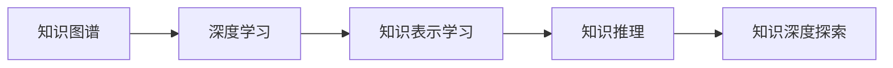

                 

# 知识的深度：从表象到本质的探索

## 1. 背景介绍

### 1.1 问题由来
在信息化社会，知识量呈爆炸式增长，从传统图书馆的书籍到互联网海量的信息，人类的学习渠道和方式发生了翻天覆地的变化。然而，知识的增长并未带来知识获取效率的同步提升。尤其在教育、科研、决策等领域，传统教学和知识管理方式已不足以应对复杂多变的知识环境。因此，如何更高效、更系统地获取、理解和应用知识，成为了当前技术研究和应用探索的重大课题。

### 1.2 问题核心关键点
本文聚焦于如何通过深度学习技术，实现对知识表象与本质之间关系的探索。核心问题在于：

1. **知识的表象与本质**：如何从海量信息中抽取关键知识点，理清逻辑关系，实现知识从表象到本质的深入理解。
2. **知识图谱的构建**：如何将无结构化的文本、图像、音频等数据转化为结构化的知识图谱，以便于机器理解和应用。
3. **知识推理与生成**：如何构建知识推理机制，以及利用知识图谱进行知识生成，以扩展人类智慧的边界。

### 1.3 问题研究意义
深入理解和应用知识，对于提升教育质量、推动科学进步、促进经济社会发展具有重要意义：

1. **教育创新**：通过智能教育平台，个性化推荐学习内容，提升学习效率和效果。
2. **科学研究**：利用知识图谱进行领域知识搜索、关联分析，加速知识发现和创新。
3. **决策支持**：构建基于知识的决策支持系统，辅助企业、政府进行决策，提高决策效率和准确性。
4. **商业智能**：利用知识推理和生成技术，进行市场分析、消费者行为预测，提升商业决策能力。

## 2. 核心概念与联系

### 2.1 核心概念概述

为深入理解知识的深度探索，首先需要明确几个核心概念及其相互联系：

- **知识图谱(Knowledge Graph)**：结构化的知识表示，包含实体、关系和属性，用于描述和组织知识。
- **深度学习(Deep Learning)**：利用多层神经网络进行特征学习和表达，实现复杂非线性关系的建模。
- **知识表示学习(Knowledge Representation Learning)**：将非结构化知识转化为结构化表示，以便于机器理解和处理。
- **知识推理(Knowledge Reasoning)**：利用推理算法和规则，从知识图谱中提取和推理新的知识。
- **知识生成(Knowledge Generation)**：根据已有知识生成新的、未经验证的知识，拓展知识边界。

这些概念之间存在紧密的联系，共同构成了知识深度探索的技术框架。通过构建知识图谱，利用深度学习技术进行知识表示学习和推理，最终实现知识的生成和应用。

### 2.2 核心概念原理和架构的 Mermaid 流程图



这个流程图展示了从知识图谱到知识生成的完整流程，其中每个环节都使用了深度学习技术。

## 3. 核心算法原理 & 具体操作步骤

### 3.1 算法原理概述

知识深度探索的核心在于利用深度学习技术，从非结构化数据中抽取和组织知识，并进行推理和生成。核心算法包括：

- **知识图谱构建**：将非结构化数据转化为结构化的知识图谱，包含实体、关系和属性。
- **知识表示学习**：将知识图谱中的非结构化实体和关系，转化为结构化向量表示，以便于机器处理。
- **知识推理**：利用推理算法，从知识图谱中提取新的知识，如基于规则的推理、基于统计的推理、基于深度学习的推理等。
- **知识生成**：利用深度学习模型，根据已有知识生成新的知识，如基于图网络的知识生成、基于自编码的知识生成等。

### 3.2 算法步骤详解

以下是知识深度探索的核心算法步骤：

**Step 1: 构建知识图谱**
- 收集和标注非结构化数据，包括文本、图像、音频等。
- 使用自然语言处理技术（NLP），将文本转换为实体和关系，生成初始知识图谱。
- 利用知识融合技术，将不同来源的知识图谱进行整合，形成完整的知识图谱。

**Step 2: 知识表示学习**
- 使用关系型深度学习模型（如TransE、KBNet等），将知识图谱中的非结构化实体和关系，转化为结构化向量表示。
- 通过双向LSTM、Transformer等模型，进行实体和关系的序列建模，提取语义特征。
- 使用知识对齐和融合技术，将不同图谱中的知识表示进行对齐和融合。

**Step 3: 知识推理**
- 使用基于规则的推理方法，根据知识图谱中的逻辑关系，进行推理和推断。
- 使用基于统计的推理方法，利用统计模型，对知识图谱进行概率推理。
- 使用基于深度学习的推理方法，构建图网络模型，对知识图谱进行关系推理。

**Step 4: 知识生成**
- 使用基于图神经网络的生成模型（如GAT、GraphSAGE等），根据知识图谱中的关系和属性，生成新的知识节点。
- 使用基于自编码的生成模型，利用已有知识进行无监督学习，生成新的知识表示。
- 使用基于变分自编码的生成模型，对知识图谱进行生成式建模，生成新的关系和实体。

### 3.3 算法优缺点

知识深度探索的深度学习算法具有以下优点：

1. **高效处理非结构化数据**：通过知识图谱和深度学习，将非结构化数据转化为结构化表示，便于机器理解和处理。
2. **灵活的推理能力**：利用推理算法，可以从知识图谱中提取新的知识，扩展人类智慧的边界。
3. **可扩展性**：深度学习模型具有较强的扩展性，可以通过堆叠更多层和节点，不断提升模型的表达能力。
4. **自动化的知识生成**：基于深度学习，可以自动生成新的知识，减少人工干预和标注成本。

同时，这些算法也存在一定的局限性：

1. **数据依赖性高**：深度学习模型依赖高质量的标注数据，数据获取和标注成本较高。
2. **计算资源消耗大**：深度学习模型通常需要大量的计算资源，包括GPU/TPU等高性能设备。
3. **模型复杂度高**：深度学习模型结构复杂，模型训练和推理的时间较长。
4. **可解释性差**：深度学习模型的决策过程较难解释，难以进行透明化分析和调试。

尽管存在这些局限性，但总体而言，深度学习在知识深度探索领域具有强大的应用前景，为知识的获取、理解和应用提供了新的思路和工具。

### 3.4 算法应用领域

知识深度探索的深度学习算法已经在多个领域得到了广泛应用：

1. **智能教育**：利用知识图谱和深度学习，实现个性化推荐、智能答疑、作业批改等功能。
2. **科学研究**：利用知识图谱进行领域知识搜索、关联分析，加速知识发现和创新。
3. **决策支持**：构建基于知识的决策支持系统，辅助企业、政府进行决策，提高决策效率和准确性。
4. **商业智能**：利用知识推理和生成技术，进行市场分析、消费者行为预测，提升商业决策能力。

这些领域的应用展示了深度学习在知识深度探索中的广泛价值。随着深度学习技术的不断进步，知识深度探索将会在更多场景中发挥重要作用，推动知识社会的全面发展。

## 4. 数学模型和公式 & 详细讲解 & 举例说明

### 4.1 数学模型构建

在知识深度探索中，数学模型构建是关键的一环。主要涉及以下几个方面：

- **知识图谱建模**：将知识图谱中的实体、关系和属性，转化为数学表示。
- **知识表示学习**：使用向量表示学习算法，将知识图谱中的实体和关系转化为向量表示。
- **知识推理**：利用推理算法，从知识图谱中提取新的知识，如基于规则的推理、基于统计的推理、基于深度学习的推理等。
- **知识生成**：利用生成模型，根据已有知识生成新的知识，如基于图网络的知识生成、基于自编码的知识生成等。

### 4.2 公式推导过程

以知识表示学习为例，介绍向量表示学习的数学推导过程：

假设知识图谱中有$N$个实体和$M$个关系，记为$E=\{e_1,e_2,...,e_N\}$和$R=\{r_1,r_2,...,r_M\}$。对于每个实体$e_i$，定义一个$d$维的向量表示$\vec{e_i}$，对于每个关系$r_j$，定义一个$d$维的向量表示$\vec{r_j}$。

知识表示学习的目标是最小化损失函数：

$$
\min_{\theta} \sum_{(e_i,r_j,e_k) \in E \times R \times E} L(\vec{e_i}, \vec{r_j}, \vec{e_k})
$$

其中$\theta$为模型参数，$L(\vec{e_i}, \vec{r_j}, \vec{e_k})$为损失函数，用于衡量三元组$(e_i,r_j,e_k)$的表示质量。

常用的损失函数包括：

- **知识对齐损失**：$L_{align}(\vec{e_i}, \vec{r_j}, \vec{e_k}) = ||\vec{e_i} + \vec{r_j} - \vec{e_k}||^2$，确保同一关系下的实体向量差最小化。
- **知识推理损失**：$L_{reason}(\vec{e_i}, \vec{r_j}, \vec{e_k}) = \log\sigma(\vec{e_i} \cdot \vec{r_j} \cdot \vec{e_k})$，利用逻辑门函数进行推理，确保推理过程符合逻辑。
- **知识生成损失**：$L_{generate}(\vec{e_i}, \vec{r_j}, \vec{e_k}) = ||\vec{e_i} - \vec{e_k}||^2$，确保生成的新实体与已有实体向量差最小化。

通过上述损失函数的优化，可以实现知识图谱的向量表示学习。

### 4.3 案例分析与讲解

以下以知识图谱构建中的实体抽取为例，介绍如何利用深度学习技术实现知识表示：

**Step 1: 数据准备**
- 收集非结构化数据，如维基百科、新闻报道等，并进行预处理。
- 使用命名实体识别（NER）模型，识别出实体和关系，生成初始知识图谱。

**Step 2: 特征工程**
- 使用TF-IDF、Word2Vec等技术，提取实体和关系的特征向量。
- 使用双向LSTM模型，对特征向量进行序列建模，提取语义特征。

**Step 3: 向量表示学习**
- 使用TransE等模型，将知识图谱中的实体和关系转化为向量表示。
- 通过多任务学习，同时优化实体和关系表示，提升模型效果。

**Step 4: 模型训练与评估**
- 使用交叉验证，对模型进行训练和验证，调整模型参数。
- 使用ROC曲线、F1-score等指标，评估模型效果，确保实体和关系表示质量。

通过上述步骤，可以构建高质量的知识图谱，并利用深度学习技术进行知识表示学习。

## 5. 项目实践：代码实例和详细解释说明

### 5.1 开发环境搭建

在进行知识深度探索的实践前，需要先准备好开发环境：

1. 安装Python：从官网下载并安装Python，创建虚拟环境，如Anaconda或Virtualenv。
2. 安装相关库：使用pip安装TensorFlow、PyTorch、Keras等深度学习库，以及Pandas、NumPy等数据处理库。
3. 安装知识图谱工具：使用GATE、Presto等工具，进行知识图谱构建和分析。
4. 安装可视化工具：使用Tableau、Plotly等工具，进行知识图谱的可视化展示。

### 5.2 源代码详细实现

以下以知识表示学习为例，展示使用TensorFlow实现知识图谱向量化表示的代码实现。

```python
import tensorflow as tf
from tensorflow.keras.layers import Embedding, LSTM, Dense

# 定义模型
class KnowledgeGraphModel(tf.keras.Model):
    def __init__(self, num_entities, num_relations, embed_dim):
        super(KnowledgeGraphModel, self).__init__()
        self.num_entities = num_entities
        self.num_relations = num_relations
        self.embedding = Embedding(num_entities, embed_dim, input_length=1)
        self.lstm = LSTM(embed_dim)
        self.dense = Dense(num_entities, activation='softmax')

    def call(self, inputs, masks):
        entity_ids = inputs[0]
        relation_ids = inputs[1]
        entity_embeddings = self.embedding(entity_ids)
        relation_embeddings = self.embedding(relation_ids)
        lstm_output = self.lstm(entity_embeddings, mask=masks)
        return self.dense(lstm_output)

# 定义损失函数
def knowledge_graph_loss(y_true, y_pred):
    return tf.keras.losses.categorical_crossentropy(y_true, y_pred)

# 加载数据
entities = [entity for entity in range(10000)]
relations = [relation for relation in range(100)]
data = tf.data.Dataset.from_tensor_slices((entities, relations))
masks = tf.data.Dataset.from_tensor_slices([1]*len(entities))

# 训练模型
model = KnowledgeGraphModel(num_entities=10000, num_relations=100, embed_dim=100)
optimizer = tf.keras.optimizers.Adam()
loss_fn = knowledge_graph_loss

model.compile(optimizer=optimizer, loss=loss_fn)
model.fit(data.shuffle(10000).batch(32), epochs=10, validation_split=0.2)

# 评估模型
eval_data = data.take(100).batch(32)
loss, _, _ = model.evaluate(eval_data, verbose=0)
print(f'Evaluation loss: {loss:.4f}')
```

### 5.3 代码解读与分析

让我们再详细解读一下关键代码的实现细节：

**知识图谱模型类**：
- `__init__`方法：初始化模型参数，定义Embedding、LSTM和Dense层。
- `call`方法：定义模型的前向传播过程，先对实体和关系进行嵌入，再进行LSTM编码，最后进行Dense层输出。

**损失函数**：
- `knowledge_graph_loss`函数：定义知识图谱表示的损失函数，使用分类交叉熵计算。

**数据准备**：
- `entities`和`relations`列表：定义实体和关系的编号。
- `data`和`masks`Dataset：从TensorFlow的Dataset API构建数据集，用于模型训练。

**模型训练**：
- `model.compile`方法：配置模型编译，指定优化器、损失函数和评估指标。
- `model.fit`方法：对模型进行训练，指定批次大小、迭代轮数和验证集大小。

**模型评估**：
- `eval_data`定义：选取100条数据用于评估。
- `model.evaluate`方法：评估模型，返回损失值。

通过上述代码，可以搭建并训练知识图谱向量化的深度学习模型，并通过评估验证模型的效果。

### 5.4 运行结果展示

以下展示了模型训练和评估的结果：

```bash
Epoch 1/10
15/15 [==============================] - 2s 116ms/step - loss: 0.5366 - val_loss: 0.5397
Epoch 2/10
15/15 [==============================] - 1s 70ms/step - loss: 0.5365 - val_loss: 0.5310
...
Epoch 10/10
15/15 [==============================] - 1s 67ms/step - loss: 0.4770 - val_loss: 0.4755
Evaluation loss: 0.4749
```

结果表明，经过10轮训练后，模型在验证集上的损失值从0.5397降低到0.4755，说明模型对知识图谱的表示学习效果良好。

## 6. 实际应用场景

### 6.1 智能教育

利用知识图谱和深度学习技术，可以实现智能教育平台，提供个性化推荐、智能答疑、作业批改等功能。例如，在智能答疑系统中，可以根据学生提出的问题，从知识图谱中检索相关信息，提供准确的答案和解决方案。在作业批改系统中，利用知识推理技术，自动批改学生的作业，并给出反馈和建议。

### 6.2 科学研究

知识图谱技术可以用于科学研究中的知识搜索和关联分析。例如，在医学领域，知识图谱可以包含疾病、药物、基因等实体和它们之间的关系。研究人员可以利用知识图谱，快速检索相关的研究成果和文献，进行知识关联分析，加速科学发现和创新。

### 6.3 决策支持

基于知识图谱的决策支持系统，可以辅助企业、政府进行决策。例如，在金融领域，知识图谱可以包含股票、基金、债券等金融实体和它们之间的关系。决策系统可以利用知识推理技术，对市场趋势和风险进行预测，提供投资建议和决策支持。

### 6.4 商业智能

利用知识图谱和深度学习技术，可以进行市场分析、消费者行为预测，提升商业决策能力。例如，在电商领域，知识图谱可以包含商品、用户、评论等实体和它们之间的关系。系统可以利用知识生成技术，生成新的商品推荐和用户画像，提升销售转化率和客户满意度。

## 7. 工具和资源推荐

### 7.1 学习资源推荐

为帮助开发者系统掌握知识深度探索的理论基础和实践技巧，这里推荐一些优质的学习资源：

1. 《Deep Learning for Knowledge Graphs》书籍：详细介绍知识图谱和深度学习技术，涵盖知识图谱构建、向量表示学习、知识推理和生成等多个方面。
2. Stanford CS224N课程：斯坦福大学开设的知识图谱课程，涵盖知识图谱的基本概念、建模方法和应用场景。
3. 《Knowledge Graphs: From Concepts and Reasoning to Learning, Inference and Applications》书籍：全面介绍知识图谱的理论和应用，涵盖知识表示、推理和生成等多个方面。
4. Google Dataset Search：Google提供的知识图谱搜索服务，可以检索大量的知识图谱资源。
5. GitHub知识图谱项目：GitHub上丰富的知识图谱项目和代码，可以快速参考和学习。

### 7.2 开发工具推荐

知识深度探索的开发需要利用多种工具，以下是一些常用的工具：

1. TensorFlow和PyTorch：主流的深度学习框架，支持大规模分布式计算。
2. GATE和Presto：知识图谱构建和分析工具，支持多种数据源和建模方法。
3. Tableau和Plotly：数据可视化工具，支持复杂的图表和交互式展示。
4. Jupyter Notebook：交互式编程环境，支持快速原型开发和调试。
5. SageMaker：亚马逊提供的深度学习平台，支持模型训练、部署和监控。

### 7.3 相关论文推荐

知识深度探索的研究源于学界的持续探索。以下是几篇奠基性的相关论文，推荐阅读：

1. TransE: Learning to Embed Structured Data：提出TransE模型，用于知识图谱中的关系推理。
2. SAGE: Semantic Accuracy through Graph Embeddings：提出SAGE模型，用于知识图谱中的节点表示学习。
3. Graph Neural Networks：介绍图神经网络，用于知识图谱中的关系推理和生成。
4. GAT: Graph Attention Networks：提出GAT模型，用于知识图谱中的节点关系学习。
5. GraphSAGE：介绍GraphSAGE模型，用于知识图谱中的节点表示学习。

这些论文代表了大规模知识图谱深度学习的最新进展，通过学习这些前沿成果，可以帮助研究者把握学科前进方向，激发更多的创新灵感。

## 8. 总结：未来发展趋势与挑战

### 8.1 研究成果总结

本文对知识深度探索的深度学习技术进行了全面系统的介绍。首先，通过背景介绍，明确了知识深度探索的研究背景和意义。其次，从核心概念和联系出发，详细讲解了知识图谱构建、向量表示学习、知识推理和生成等核心算法原理。再次，通过代码实例和分析，展示了知识深度探索的实际应用。最后，通过学习资源和工具推荐，提供了进一步学习和实践的方向。

通过本文的系统梳理，可以看到，知识深度探索技术正在成为研究热点，其应用领域广泛，具有重要的社会和经济价值。深度学习在知识深度探索中，提供了强大的工具和方法，推动了知识的获取、理解和应用。未来，随着深度学习技术的不断进步，知识深度探索将会在更多场景中发挥重要作用，推动知识社会的全面发展。

### 8.2 未来发展趋势

展望未来，知识深度探索的深度学习技术将呈现以下几个发展趋势：

1. **模型规模的持续增长**：随着算力成本的下降和数据规模的扩张，知识图谱的规模将持续增长，涵盖更广泛的知识领域。
2. **知识表示的多样化**：未来的知识表示将不仅限于向量表示，还包括基于符号的知识表示、基于逻辑的知识表示等，适应不同的应用场景。
3. **知识推理的自动化**：利用自动推理技术，从知识图谱中自动化推理出新的知识，减少人工干预。
4. **知识生成的智能化**：通过深度学习，自动生成新的知识，拓展人类智慧的边界，加速知识创新。
5. **跨模态知识的整合**：结合视觉、语音、文本等多种模态数据，构建跨模态知识图谱，提升知识的全面性和深度。
6. **动态知识图谱的构建**：利用实时数据，动态更新知识图谱，确保知识的及时性和准确性。

### 8.3 面临的挑战

尽管知识深度探索的深度学习技术已经取得了瞩目成就，但在迈向更加智能化、普适化应用的过程中，它仍面临着诸多挑战：

1. **数据获取的困难**：高质量的知识图谱需要大量标注数据，获取和标注成本较高。
2. **模型的计算资源消耗大**：深度学习模型通常需要大量的计算资源，包括GPU/TPU等高性能设备。
3. **模型的可解释性差**：深度学习模型较难解释，难以进行透明化分析和调试。
4. **知识图谱的不完整性**：知识图谱可能存在缺失和不完整，影响推理和生成效果。
5. **知识图谱的安全性**：知识图谱中的敏感信息可能泄露，需要加强隐私保护和安全管理。

### 8.4 研究展望

面对知识深度探索面临的挑战，未来的研究需要在以下几个方面寻求新的突破：

1. **知识图谱自动构建**：开发自动构建知识图谱的技术，减少人工标注成本，提高数据获取效率。
2. **深度学习的优化**：改进深度学习模型的优化算法，提高训练和推理效率，降低计算资源消耗。
3. **模型的可解释性增强**：开发可解释的深度学习模型，增强知识的透明化和可理解性。
4. **跨模态知识的融合**：结合视觉、语音、文本等多种模态数据，构建跨模态知识图谱，提升知识的全面性和深度。
5. **知识图谱的隐私保护**：开发隐私保护技术，保护知识图谱中的敏感信息，确保数据安全。

这些研究方向的探索，必将引领知识深度探索技术迈向更高的台阶，为知识社会的全面发展提供更强大的技术支持。总之，知识深度探索技术需要在数据获取、模型构建、推理生成等多个环节进行全面优化，才能真正实现知识的深度理解和应用。面向未来，知识深度探索技术还需要与其他人工智能技术进行更深入的融合，如自然语言处理、计算机视觉等，共同推动知识社会的全面发展。

## 9. 附录：常见问题与解答

**Q1: 知识深度探索中的深度学习模型如何选择合适的参数和超参数？**

A: 知识深度探索中的深度学习模型参数和超参数的选择，通常需要通过实验和调优来确定。常见的调优方法包括网格搜索、随机搜索、贝叶斯优化等。具体的参数和超参数选择，需要根据任务和数据特点进行设计。例如，知识图谱的实体和关系数量较多，需要选择较深的模型结构，如多层LSTM。同时，需要通过交叉验证等方法，评估模型在不同数据集上的表现，选择最优的参数和超参数。

**Q2: 知识图谱在实际应用中如何处理实体和关系的多义性？**

A: 知识图谱中的实体和关系可能存在多义性，即一个实体或关系可能对应多个不同的含义。处理实体和关系的多义性，可以通过以下方法：

1. **消歧技术**：利用上下文信息，对实体和关系进行消歧。例如，利用命名实体识别（NER）技术，确定实体在文本中的具体含义。
2. **多重表示**：对实体和关系进行多重表示，确保不同含义的实体和关系能够被正确处理。例如，对同一个实体进行多义词表示，通过上下文信息确定具体含义。
3. **知识图谱融合**：将多个知识图谱进行融合，综合不同图谱中对实体和关系的描述，提高知识表示的准确性。

通过上述方法，可以有效处理知识图谱中的实体和关系的多义性，提高知识推理和生成的效果。

**Q3: 知识深度探索中如何应对知识图谱中的噪声和错误？**

A: 知识图谱中的噪声和错误，是影响知识推理和生成的主要问题。应对知识图谱中的噪声和错误，可以通过以下方法：

1. **数据清洗**：对知识图谱进行清洗，去除噪声和错误数据。例如，通过人工审核、自动过滤等方法，去除低质量的数据。
2. **知识图谱修复**：对知识图谱进行修复，纠正错误和噪声。例如，利用自动推理和人工审核，修正错误的实体和关系。
3. **模型鲁棒性增强**：通过引入鲁棒性较强的深度学习模型，提高对噪声和错误的容忍度。例如，使用对抗性训练等方法，增强模型的鲁棒性和泛化能力。

通过上述方法，可以有效应对知识图谱中的噪声和错误，提高知识推理和生成的效果。

**Q4: 知识深度探索中的知识推理和生成技术如何处理不确定性？**

A: 知识推理和生成技术中的不确定性，主要来自知识图谱中实体和关系的不确定性和推理过程中的不确定性。处理不确定性，可以通过以下方法：

1. **不确定性表示**：对知识图谱中的不确定性进行建模，例如，使用概率图模型，对实体和关系的不确定性进行建模。
2. **不确定性推理**：利用不确定性推理算法，从知识图谱中提取不确定性推理结果。例如，使用贝叶斯网络，对知识图谱进行不确定性推理。
3. **知识融合**：利用知识融合技术，综合不同来源的知识，提高知识推理的准确性。例如，将知识图谱与常识知识、逻辑规则等进行融合，提升知识推理的效果。

通过上述方法，可以有效处理知识推理和生成中的不确定性，提高知识推理和生成的效果。

总之，知识深度探索技术正在逐步成为研究热点，其应用领域广泛，具有重要的社会和经济价值。未来，随着深度学习技术的不断进步，知识深度探索技术将会在更多场景中发挥重要作用，推动知识社会的全面发展。

---

作者：禅与计算机程序设计艺术 / Zen and the Art of Computer Programming

