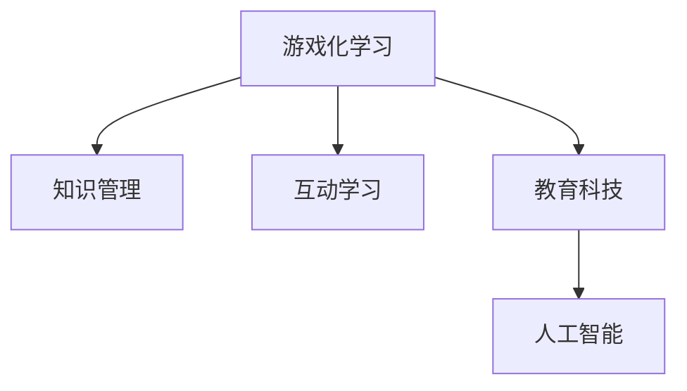

                 

# 知识的游戏化：寓教于乐的学习新模式

> 关键词：游戏化学习, 知识管理, 互动学习, 教育科技, 人工智能

## 1. 背景介绍

### 1.1 问题由来
近年来，随着技术的迅猛发展，人们的学习方式也在发生翻天覆地的变化。从传统的教室学习，到在线课程、MOOCs、e-learning，再到如今的虚拟现实、增强现实、人工智能，技术在不断推动教育领域的创新。然而，传统教育体系依然存在诸多局限：被动接受式学习、知识碎片化、评估方式单一等。如何使学习过程更加生动有趣、高效系统，成为了当下教育领域亟待解决的问题。

### 1.2 问题核心关键点
通过游戏化学习（Gamification in Learning），将知识与游戏元素融合，可以使学习过程变得更有吸引力，激发学生的学习兴趣，提高学习效率。游戏化学习主要包括四个要素：目标设定、反馈机制、竞争元素和奖励系统。这些要素通过游戏化的方式，使学习过程具有挑战性、可量化、社交互动和即时反馈，从而激发学习者的内在动力，形成持续学习的良性循环。

## 2. 核心概念与联系

### 2.1 核心概念概述

为更好地理解游戏化学习的核心概念，本节将介绍几个关键要素及其相互关系：

- **游戏化学习（Gamification）**：通过游戏化的方式，使学习过程更加有趣和高效。游戏化学习不仅包括传统意义上的游戏，还包括各种交互式的活动和挑战。

- **知识管理（Knowledge Management）**：通过技术手段，帮助个体和组织获取、存储、共享和应用知识。知识管理的目标是使知识在组织中流动和应用，提升组织绩效。

- **互动学习（Interactive Learning）**：通过互动的方式，使学习过程更加生动和参与性强。互动学习有助于知识的内化，提高学习效果。

- **教育科技（EdTech）**：应用科技手段，改善教育质量和学习体验。教育科技涉及众多技术领域，如人工智能、大数据、虚拟现实等。

- **人工智能（AI）**：使计算机系统能够模拟人类智能的科技，包括学习、推理、感知等。人工智能在游戏化学习和知识管理中扮演重要角色。

这些核心概念之间的逻辑关系可以通过以下Mermaid流程图来展示：



这个流程图展示了大语言模型的核心概念及其之间的关系：

1. 游戏化学习通过游戏元素提升学习的趣味性和互动性，使学习过程更加吸引人。
2. 知识管理提供知识获取和共享的技术支持，帮助学习者更高效地掌握知识。
3. 互动学习增强了学习的参与性和主动性，提升了知识的内化效果。
4. 教育科技融合了多种技术手段，为游戏化学习提供了实现工具。
5. 人工智能在知识管理和互动学习中起到关键作用，提供个性化的学习体验和精准的评估。

这些概念共同构成了游戏化学习的基本框架，使其在教育领域具有广泛的应用前景。通过理解这些核心概念，我们可以更好地把握游戏化学习的本质和实践方向。

## 3. 核心算法原理 & 具体操作步骤
### 3.1 算法原理概述

游戏化学习的核心算法原理主要围绕两个方面展开：激励机制设计和学习路径优化。

### 3.2 算法步骤详解

**Step 1: 目标设定**

设定明确的学习目标，使学习者有清晰的方向。目标应具体、可测量、具有挑战性，且能激励学习者持续前进。

**Step 2: 反馈机制**

提供即时反馈，让学习者知道自己的进步和不足。反馈机制可以基于多种数据源，如测试成绩、任务完成度、互动评价等。

**Step 3: 竞争元素**

引入竞争元素，使学习过程更有挑战性和互动性。可以是团队竞赛、个人挑战、排行榜等形式。

**Step 4: 奖励系统**

设置奖励系统，激励学习者达成目标。奖励可以是实物奖励、虚拟奖励、认证和头衔等。

**Step 5: 学习路径优化**

根据学习者需求和目标，优化学习路径。通过个性化推荐和自适应学习，使学习者能够在最短的时间内掌握所需知识。

### 3.3 算法优缺点

游戏化学习的优点包括：

1. 提高学习兴趣：游戏元素使学习过程更加有趣，激发学习者的内在动力。
2. 增强互动性：互动学习有助于知识的内化，提升学习效果。
3. 提升自主性：目标设定和奖励系统使学习者具有更高自主性，能够主动规划学习。
4. 提高效率：通过即时反馈和竞争元素，加速学习进程，提高学习效率。

但游戏化学习也存在一些缺点：

1. 过度依赖奖励：过分依赖奖励可能导致学习者只关注外部激励，忽视内在兴趣。
2. 忽视知识掌握：过于关注比赛排名，可能忽略知识本身的掌握。
3. 泛化能力不足：游戏化学习往往针对特定任务，泛化能力可能有限。
4. 心理负担：过度的竞争和反馈可能导致学习者心理压力增大。

### 3.4 算法应用领域

游戏化学习在游戏、教育、企业培训等多个领域都有广泛应用。例如：

- **游戏领域**：电子游戏、桌面游戏等。
- **教育领域**：在线课程、MOOCs、虚拟课堂等。
- **企业培训**：员工技能培训、客户服务培训等。
- **心理健康**：心理治疗、行为改变等。

游戏化学习已经广泛应用于各个行业，并取得了显著成效。

## 4. 数学模型和公式 & 详细讲解 & 举例说明

### 4.1 数学模型构建

为了更好地理解游戏化学习的数学模型，我们首先定义几个关键变量：

- $T$：学习目标集合，表示学习者需要掌握的知识和技能。
- $P$：学习路径集合，表示学习者达到目标的路径。
- $R$：奖励系统，表示学习者达成目标后获得的奖励。
- $F$：反馈机制，表示学习者学习过程中的即时反馈。
- $C$：竞争元素，表示学习者在学习过程中与其他学习者进行的竞争。

游戏化学习的目标是最小化学习者达到目标的路径长度和资源消耗，同时最大化学习者获得的奖励。

### 4.2 公式推导过程

我们可以将游戏化学习的过程建模为一个优化问题。设 $x_i$ 表示学习者完成第 $i$ 个任务的完成度，$i \in T$。则学习者达到目标的总完成度为：

$$
\sum_{i \in T} x_i
$$

学习者获得的总奖励为：

$$
\sum_{i \in T} R_i(x_i)
$$

其中 $R_i$ 表示学习者完成第 $i$ 个任务后获得的奖励函数。

为了最小化路径长度和资源消耗，我们需要优化目标函数的代价函数 $C(x)$，目标为：

$$
\min_{x} C(x) \quad \text{s.t.} \quad \sum_{i \in T} x_i = 1
$$

其中 $C(x)$ 表示学习者完成目标路径所需的代价函数。

### 4.3 案例分析与讲解

以在线学习平台Khan Academy为例，分析其游戏化学习的数学模型：

- **目标设定**：平台通过明确的学习目标，帮助学习者规划学习路径。每个目标有具体的知识点，如代数、几何、历史等。
- **反馈机制**：通过即时反馈，平台让学习者知道自己在每个知识点上的掌握情况。反馈可以基于测试成绩、互动评价等。
- **竞争元素**：平台通过排行榜和竞赛功能，激励学习者与其他用户竞争，提升学习动力。
- **奖励系统**：平台通过虚拟奖励（如徽章、认证）和实际奖励（如奖学金），激励学习者达成目标。

通过优化数学模型，Khan Academy能够根据学习者的个性化需求，推荐最合适的学习路径和奖励，从而实现高效的学习效果。

## 5. 项目实践：代码实例和详细解释说明

### 5.1 开发环境搭建

在进行游戏化学习的项目实践前，我们需要准备好开发环境。以下是使用Python进行Flask开发的环境配置流程：

1. 安装Anaconda：从官网下载并安装Anaconda，用于创建独立的Python环境。

2. 创建并激活虚拟环境：
```bash
conda create -n game-env python=3.8 
conda activate game-env
```

3. 安装Flask：
```bash
pip install Flask
```

4. 安装游戏化学习所需的库：
```bash
pip install numpy pandas scikit-learn matplotlib tqdm jupyter notebook ipython
```

完成上述步骤后，即可在`game-env`环境中开始游戏化学习的开发实践。

### 5.2 源代码详细实现

这里我们以一个简单的游戏化学习平台为例，展示如何使用Flask实现目标设定、反馈机制和奖励系统。

首先，定义学习目标：

```python
from flask import Flask, render_template, request

app = Flask(__name__)

@app.route('/')
def index():
    return render_template('index.html')
```

然后，添加目标设定和反馈机制：

```python
@app.route('/set-goal', methods=['POST'])
def set_goal():
    goal = request.form['goal']
    # 添加目标到学习目标集合 T
    # 提供即时反馈，如提示完成度
    return render_template('goal.html', goal=goal)
```

接着，实现奖励系统：

```python
@app.route('/get-reward', methods=['POST'])
def get_reward():
    reward = request.form['reward']
    # 根据学习者的完成度，计算并返回奖励
    return render_template('reward.html', reward=reward)
```

最后，展示游戏化学习平台的完整代码：

```python
from flask import Flask, render_template, request

app = Flask(__name__)

@app.route('/')
def index():
    return render_template('index.html')

@app.route('/set-goal', methods=['POST'])
def set_goal():
    goal = request.form['goal']
    # 添加目标到学习目标集合 T
    # 提供即时反馈，如提示完成度
    return render_template('goal.html', goal=goal)

@app.route('/get-reward', methods=['POST'])
def get_reward():
    reward = request.form['reward']
    # 根据学习者的完成度，计算并返回奖励
    return render_template('reward.html', reward=reward)

if __name__ == '__main__':
    app.run(debug=True)
```

### 5.3 代码解读与分析

让我们再详细解读一下关键代码的实现细节：

**index函数**：
- 显示主页面，包含目标设定和反馈机制的链接。

**set_goal函数**：
- 从表单获取学习目标，将其添加到学习目标集合中。
- 返回目标设定页面的HTML模板，并显示学习目标。

**get_reward函数**：
- 从表单获取学习者获得的奖励，计算奖励函数 $R_i(x_i)$。
- 返回奖励页面，显示学习者获得的奖励。

**运行结果展示**：
- 主页面显示学习目标设定和奖励页面的链接。
- 学习者可以通过目标设定页面设定学习目标，并通过奖励页面获得即时反馈和奖励。

可以看到，Flask配合Python使得游戏化学习的实现变得简洁高效。开发者可以将更多精力放在目标设定、反馈机制、奖励系统的设计上，而不必过多关注底层的实现细节。

当然，工业级的系统实现还需考虑更多因素，如用户认证、权限控制、数据存储等。但核心的游戏化学习范式基本与此类似。

## 6. 实际应用场景
### 6.1 企业员工培训

在企业培训中，传统培训方式往往效率低下，难以激发员工的学习兴趣。通过游戏化学习，企业可以设计各种挑战和奖励机制，使员工更积极主动地参与培训。

在技术实现上，可以收集员工的培训历史数据，将其转换为游戏化任务，设计相应的奖励和反馈机制。员工在完成每个培训任务后，可以获得虚拟奖励和认证，从而提升参与度。

### 6.2 学校课堂教学

在学校课堂教学中，游戏化学习可以极大地提升学生的学习兴趣和参与度。通过将知识点融入游戏元素，使学习过程更加生动有趣。

具体而言，教师可以设计各种互动式学习活动，如知识竞赛、角色扮演等，使学生在轻松愉快的氛围中掌握知识。同时，通过即时反馈和奖励系统，激励学生积极参与，提升学习效果。

### 6.3 个人自我提升

个人也可以通过游戏化学习平台，进行自我提升和学习。例如，学习编程、语言学习、兴趣爱好等。通过设定具体的学习目标和奖励机制，使学习过程更加高效和有动力。

### 6.4 未来应用展望

随着游戏化学习技术的不断发展，其在教育、企业培训、个人学习等领域的潜力将进一步释放。未来的游戏化学习将更加注重个性化、社交化和实时反馈，提升学习效果和用户体验。

- **个性化学习**：根据学习者的兴趣和需求，推荐个性化的学习路径和内容。
- **社交化学习**：通过互动和协作，提升学习者的社交互动和团队合作能力。
- **实时反馈**：通过即时反馈，帮助学习者及时调整学习策略，提升学习效果。

此外，游戏化学习还将与其他教育技术进行更深入的融合，如虚拟现实、增强现实、人工智能等，为学习者提供更加沉浸式和互动式的学习体验。

## 7. 工具和资源推荐
### 7.1 学习资源推荐

为了帮助开发者系统掌握游戏化学习的理论基础和实践技巧，这里推荐一些优质的学习资源：

1. 《游戏化设计：理论和实践》系列博文：由游戏化学习专家撰写，深入浅出地介绍了游戏化学习的理论基础和设计原则。

2. 《Gamification by Design》书籍：Defrag团队创作的经典著作，系统讲解了游戏化学习的理论基础和应用案例。

3. Khan Academy平台：世界领先的在线学习平台，提供丰富的游戏化学习资源和案例，值得深入学习和借鉴。

4. Coursera和Udemy的Gamification课程：斯坦福大学和Coursera合作开发的课程，系统讲解了游戏化学习的理论和实践。

5. UNESCO的《教育游戏化指南》：联合国教科文组织发布的指南，提供了游戏化学习在教育领域的最佳实践和案例。

通过对这些资源的学习实践，相信你一定能够快速掌握游戏化学习的精髓，并用于解决实际的NLP问题。
### 7.2 开发工具推荐

高效的开发离不开优秀的工具支持。以下是几款用于游戏化学习开发的常用工具：

1. Flask：Python的轻量级Web框架，适合快速开发游戏化学习平台。

2. Unity和Unreal Engine：强大的游戏开发引擎，支持丰富的游戏化学习功能，适合开发复杂的互动式学习应用。

3. GPT-3：最新的自然语言处理模型，支持生成式文本互动，适合开发语言学习和自然语言理解的应用。

4. TensorFlow和PyTorch：深度学习框架，支持多种神经网络模型的设计和训练，适合开发高级的互动学习应用。

5. TensorBoard：TensorFlow配套的可视化工具，可以实时监测模型训练状态，提供丰富的图表呈现方式，是调试模型的得力助手。

6. Jupyter Notebook：交互式编程环境，适合进行数据探索和模型调试，适合开发复杂的互动学习应用。

合理利用这些工具，可以显著提升游戏化学习开发的效率，加快创新迭代的步伐。

### 7.3 相关论文推荐

游戏化学习的研究源于学界的持续研究。以下是几篇奠基性的相关论文，推荐阅读：

1. "Gamification in education: a systematic review and meta-analysis of empirical studies"：对游戏化学习的理论和应用进行了全面综述。

2. "The effects of gamification on intrinsic motivation: a meta-analysis of experience sampling studies"：通过实证研究，探讨了游戏化学习对内在动机的影响。

3. "Designing effective game-based learning experiences"：提供了游戏化学习设计的基本原则和方法。

4. "Gamification by Design"：Defrag团队创作的经典著作，系统讲解了游戏化学习的理论基础和应用案例。

5. "How to implement game-based learning in classrooms"：提供了游戏化学习在课堂教学中的具体实施方法。

这些论文代表了大语言模型微调技术的发展脉络。通过学习这些前沿成果，可以帮助研究者把握学科前进方向，激发更多的创新灵感。

## 8. 总结：未来发展趋势与挑战
### 8.1 总结

本文对游戏化学习的核心概念和实践方法进行了全面系统的介绍。首先阐述了游戏化学习的背景和意义，明确了其在游戏、教育、企业培训等领域的应用前景。其次，从原理到实践，详细讲解了游戏化学习的数学模型和关键步骤，给出了游戏化学习任务开发的完整代码实例。同时，本文还探讨了游戏化学习的未来发展趋势和面临的挑战，提供了深入的见解和思考。

通过本文的系统梳理，可以看到，游戏化学习正在成为教育领域的重要范式，极大地提升了学习者的学习兴趣和效率。未来，伴随游戏化学习技术的不断发展，相信其在各个领域的应用前景将更加广阔，为学习者提供更加生动、有趣、高效的学习体验。

### 8.2 未来发展趋势

展望未来，游戏化学习技术将呈现以下几个发展趋势：

1. **个性化学习**：根据学习者的兴趣和需求，推荐个性化的学习路径和内容，使学习过程更加高效和有动力。
2. **社交化学习**：通过互动和协作，提升学习者的社交互动和团队合作能力。
3. **实时反馈**：通过即时反馈，帮助学习者及时调整学习策略，提升学习效果。
4. **融合多种技术**：与其他教育技术（如虚拟现实、增强现实、人工智能等）进行更深入的融合，提供更加沉浸式和互动式的学习体验。
5. **跨领域应用**：游戏化学习不仅在教育领域有广泛应用，在游戏、企业培训、个人学习等领域也将得到进一步发展。

以上趋势凸显了游戏化学习技术的广阔前景。这些方向的探索发展，必将进一步提升游戏化学习的用户体验和学习效果，为教育领域的创新带来新的动力。

### 8.3 面临的挑战

尽管游戏化学习技术已经取得了显著成就，但在迈向更加智能化、普适化应用的过程中，仍面临诸多挑战：

1. **成本问题**：开发和维护游戏化学习系统需要一定的成本和技术投入，可能对小型机构或个人用户构成障碍。
2. **内容开发**：游戏化学习需要丰富的内容和互动活动，内容开发难度大且成本高。
3. **技术融合**：游戏化学习需要与其他教育技术（如虚拟现实、增强现实、人工智能等）进行融合，技术复杂度较高。
4. **数据隐私**：游戏化学习平台需要收集和分析大量的用户数据，数据隐私和安全问题需要严格保障。
5. **评估标准**：游戏化学习的评估标准尚未完全统一，如何衡量其效果和效果提升难度较大。

### 8.4 研究展望

面对游戏化学习面临的挑战，未来的研究需要在以下几个方面寻求新的突破：

1. **自动化内容开发**：开发自动生成内容的技术和工具，降低内容开发难度和成本。
2. **跨平台整合**：实现游戏化学习平台在不同平台和设备上的无缝整合，提升用户体验。
3. **数据隐私保护**：研究数据隐私保护技术，确保用户数据的安全和隐私。
4. **多模态融合**：研究多模态游戏化学习的融合技术，提升学习效果和用户体验。
5. **评估体系建设**：构建全面、系统的游戏化学习评估体系，提供客观、公正的评估标准。

这些研究方向的探索，必将引领游戏化学习技术迈向更高的台阶，为构建安全、可靠、可解释、可控的智能系统铺平道路。面向未来，游戏化学习需要与其他人工智能技术进行更深入的融合，共同推动教育科技的发展，为学习者提供更加丰富、有趣、高效的学习体验。总之，游戏化学习需要在数据、算法、工程、业务等多个维度协同发力，才能真正实现其价值，为教育科技带来新的突破。

## 9. 附录：常见问题与解答

**Q1：游戏化学习是否适用于所有学科？**

A: 游戏化学习可以应用于几乎所有学科，只要能够将其知识点融入游戏元素。例如，科学、数学、历史、语言等学科都可以通过游戏化学习进行有效教学。

**Q2：如何设计合适的游戏元素？**

A: 设计合适的游戏元素需要考虑学科特点和学生需求。一般包括以下几个要素：
1. 挑战性：使学习过程具有一定难度，激发学生的好奇心和挑战欲望。
2. 趣味性：使学习过程有趣和吸引人，提高学生的参与度。
3. 可量化：使学习效果可以量化，便于评估和反馈。
4. 可扩展性：游戏元素可以扩展和升级，适应不同阶段的学习需求。

**Q3：如何确保游戏化学习的公平性？**

A: 游戏化学习需要关注公平性问题，避免因游戏元素的不当设计而加剧学习者之间的差异。一般有以下几个策略：
1. 多样化游戏元素：提供多种游戏元素，满足不同学习者的需求。
2. 个性化推荐：根据学习者的特点和需求，推荐合适的游戏元素。
3. 公平评估：提供公平的评估机制，避免因游戏元素的不当设计而产生歧视。

**Q4：如何设计合适的反馈机制？**

A: 合适的反馈机制需要及时、具体、可操作。一般包括以下几个要素：
1. 即时反馈：在学习过程中及时提供反馈，帮助学习者及时调整学习策略。
2. 具体反馈：反馈应具体、明确，帮助学习者了解自己的优势和不足。
3. 操作性反馈：反馈应具有操作性，帮助学习者明确下一步学习方向。

**Q5：如何设计合适的奖励系统？**

A: 合适的奖励系统应具有激励性和可量化性。一般包括以下几个要素：
1. 激励性：奖励应具有激励性，能够激发学习者的内在动力。
2. 可量化：奖励应具有可量化性，便于评估和比较。
3. 公平性：奖励应公平，避免因奖励设计不当而产生不公平现象。

这些策略需要根据具体学科和需求进行调整，设计合适的游戏化学习系统。

---

作者：禅与计算机程序设计艺术 / Zen and the Art of Computer Programming

