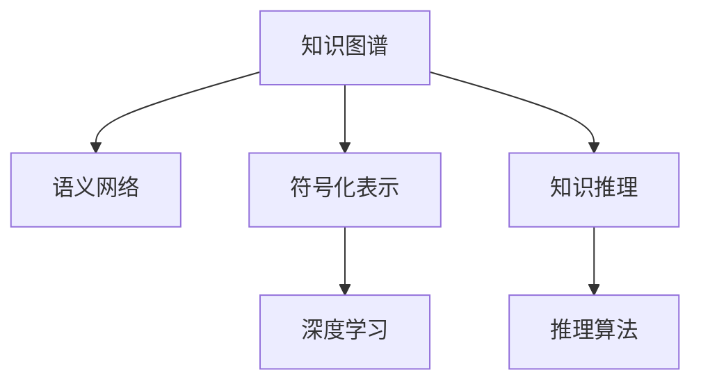

                 

# 知识的结构化：提升理解效率的方法

> 关键词：知识图谱,语义网络,符号化表示,知识推理,深度学习

## 1. 背景介绍

### 1.1 问题由来

在现代社会，信息的海量增长与人类处理能力之间的矛盾愈加突出。随着知识爆炸的趋势不断加剧，我们面临着如何高效组织、提取和应用知识的挑战。在学术界、工业界乃至日常生活的各个领域，信息过载的问题都显得尤为严峻。

传统的数据管理方式往往以扁平化的表格和文本文档为主，存在信息孤立、关联困难、查找效率低等问题。随着数据科学、人工智能的不断发展，特别是深度学习在图像、语音等领域取得的突破，人们开始寻求更为复杂、高级的数据组织形式来处理复杂的、结构化的信息。

其中，知识图谱(Knowledge Graph)便是一种重要的信息组织方式。它通过语义网络(Semantic Network)来描述实体与实体之间的关联关系，形成了结构化的知识体系。知识图谱技术已经在搜索引擎、推荐系统、智能问答等多个领域得到广泛应用，并取得显著成效。

本文将详细阐述知识图谱的核心概念、构建方法、以及它在提升知识理解效率方面的应用，为读者提供一条通往知识智能化的路径。

## 2. 核心概念与联系

### 2.1 核心概念概述

为更好地理解知识图谱的技术体系和应用流程，本节将介绍几个关键概念：

- **知识图谱(Knowledge Graph)**：一种结构化的知识表示方式，用于描述实体及其属性、关系等知识单元。常见形式包括基于三元组的RDF(RDF: Resource Description Framework)模型、基于图形表示的Graph Neural Network等。
- **语义网络(Semantic Network)**：一种图结构，用于表示实体与属性、关系之间的语义关系，常见的表示方法包括RDF、OWL等。
- **符号化表示(Symbolic Representation)**：通过逻辑符号和规则将知识进行形式化表示，便于计算机理解和推理。常见的符号化表示包括一阶逻辑、描述逻辑等。
- **知识推理(Knowledge Reasoning)**：使用符号化表示的知识库，通过推理算法获取新的知识，提升知识库的完备性和一致性。常见推理算法包括Deductive Reasoning、Inductive Reasoning等。
- **深度学习(Deep Learning)**：一种基于多层神经网络的机器学习技术，用于处理大规模数据，并从中提取特征。深度学习在大数据处理、图像识别等领域取得了巨大成功。

这些核心概念之间的逻辑关系可以通过以下Mermaid流程图来展示：



这个流程图展示的知识图谱技术体系及其相关概念：

1. 知识图谱以语义网络的形式，描述了实体和属性、关系的语义关系。
2. 符号化表示对知识进行形式化表示，便于计算机理解和推理。
3. 知识推理通过推理算法获取新的知识，提升知识库的完备性和一致性。
4. 深度学习处理大规模数据，提取特征，是知识图谱构建和推理的重要工具。

这些概念共同构成了知识图谱的技术基础，为其在知识表示、推理和应用等方面提供了有力支持。通过理解这些核心概念，我们可以更好地把握知识图谱的核心思想和应用方法。

## 3. 核心算法原理 & 具体操作步骤

### 3.1 算法原理概述

知识图谱的构建和应用主要涉及以下几个关键环节：

- **知识图谱的构建**：通过自动化算法或手动标注的方式，将结构化的数据转化为知识图谱。
- **知识图谱的嵌入**：使用深度学习模型将知识图谱中的实体和关系进行向量表示，便于计算机处理和推理。
- **知识图谱的推理**：通过符号化表示的知识库，使用推理算法获取新的知识。

### 3.2 算法步骤详解

知识图谱的构建和应用一般包括以下几个关键步骤：

**Step 1: 数据准备与清洗**

- 收集领域相关的数据集，包括文本、图像、视频等多种形式的数据。
- 对数据进行去重、去噪、清洗等预处理，确保数据质量。

**Step 2: 实体抽取与关系识别**

- 使用实体抽取工具自动识别数据中的实体和属性，如人名、地名、组织名等。
- 通过关系抽取算法确定实体之间的关联关系，如主谓宾结构等。

**Step 3: 知识表示与图谱构建**

- 将抽取出的实体和关系进行符号化表示，转化为RDF三元组或其他图形表示形式。
- 将多个知识表示形式整合成一个统一的知识图谱，用于后续的推理和应用。

**Step 4: 嵌入表示与向量化**

- 使用深度学习模型，如TransE、BERT等，将知识图谱中的实体和关系进行嵌入表示，转化为向量形式。
- 向量化的实体和关系可以用于进一步的计算和推理。

**Step 5: 推理与扩展**

- 使用知识推理算法，如规则推理、逻辑推理等，获取新的知识。
- 将推理结果加入到知识图谱中，扩展其覆盖范围和深度。

**Step 6: 评估与优化**

- 使用评估指标，如精度、召回率、F1分数等，评估知识图谱的质量和应用效果。
- 根据评估结果进行优化，如调整实体抽取算法、改进知识表示方法等。

以上是知识图谱构建和应用的常见流程。在具体应用中，还需要根据具体任务的特点，对各个环节进行优化设计，如改进实体抽取算法、选择更合适的嵌入模型等，以进一步提升知识图谱的构建和应用效果。

### 3.3 算法优缺点

知识图谱技术具有以下优点：

1. **结构化表达**：通过语义网络的形式，知识图谱能够将复杂的知识结构化，便于计算机理解和处理。
2. **高效推理**：知识推理算法能够从知识图谱中提取新的知识，提升知识库的完备性和一致性。
3. **跨领域应用**：知识图谱可以应用于多个领域，如搜索引擎、推荐系统、智能问答等，具有广泛的应用前景。

同时，知识图谱技术也存在一些局限性：

1. **构建成本高**：知识图谱的构建需要大量的数据和人力，尤其是在特定领域构建高质量的知识图谱，成本较高。
2. **数据依赖性强**：知识图谱的构建依赖于标注数据的质量，对于标注数据不足或标注质量不高的场景，效果可能不佳。
3. **更新维护难**：知识图谱需要不断更新和维护，以确保其准确性和时效性，但更新维护工作量较大。
4. **知识推理复杂**：现有的知识推理算法在处理复杂的知识网络时，仍存在一定的局限性。

尽管存在这些局限性，但知识图谱技术在提升知识理解效率、实现知识智能化应用方面具有重要价值，仍是大数据时代的重要研究方向。

### 3.4 算法应用领域

知识图谱技术在多个领域中得到了广泛应用，以下是几个典型场景：

- **搜索引擎**：通过将网页、文章等信息转化为知识图谱，搜索引擎能够更好地理解用户查询意图，提供更精准的搜索结果。
- **推荐系统**：利用用户行为数据和商品信息构建知识图谱，推荐系统能够更准确地推荐用户感兴趣的商品，提升用户体验。
- **智能问答**：通过构建领域知识图谱，智能问答系统能够理解自然语言问题，提供更准确的答案。
- **金融分析**：将金融市场数据、公司信息等构建为知识图谱，帮助投资者进行更深入的分析和决策。
- **医疗健康**：利用病历数据、药物信息等构建知识图谱，帮助医生进行疾病诊断和治疗决策。

除了上述这些经典应用外，知识图谱技术还在教育、物流、政府服务等众多领域得到了应用，为各行各业带来了新的智能化解决方案。

## 4. 数学模型和公式 & 详细讲解 & 举例说明

### 4.1 数学模型构建

知识图谱的构建和应用涉及多个数学模型，包括实体抽取、关系抽取、知识表示等。本节将对其中几个核心模型进行详细讲解。

**实体抽取模型**：

实体抽取是知识图谱构建的第一步，其目标是自动识别文本中的实体，如人名、地名、组织名等。常用的实体抽取模型包括CRF、BiLSTM-CRF等。

假设输入文本为 $x$，目标实体为 $y$，则实体抽取模型可以表示为：

$$
p(y|x) = \prod_{i=1}^{n}p(y_i|x,y_{<i})
$$

其中，$y$ 为实体序列，$n$ 为序列长度，$p(y_i|x,y_{<i})$ 表示给定前 $i-1$ 个实体和输入文本 $x$ 的情况下，第 $i$ 个实体的条件概率。

**关系抽取模型**：

关系抽取是知识图谱构建的另一关键步骤，其目标是自动识别实体之间的关联关系，如主谓宾结构。常用的关系抽取模型包括CNN、CRF等。

假设输入文本为 $x$，目标关系为 $y$，则关系抽取模型可以表示为：

$$
p(y|x) = \prod_{i=1}^{m}p(y_i|x,y_{<i})
$$

其中，$y$ 为关系序列，$m$ 为序列长度，$p(y_i|x,y_{<i})$ 表示给定前 $i-1$ 个关系和输入文本 $x$ 的情况下，第 $i$ 个关系的条件概率。

**知识表示模型**：

知识表示是知识图谱构建的核心环节，其目标是使用向量化的形式表示实体和关系。常用的知识表示模型包括TransE、BERT等。

假设知识图谱中的实体为 $e$，关系为 $r$，向量表示为 $\vec{e}$ 和 $\vec{r}$，则知识表示模型可以表示为：

$$
\vec{e} = f(e)
$$

$$
\vec{r} = g(r)
$$

其中，$f$ 和 $g$ 为知识表示函数，$\vec{e}$ 和 $\vec{r}$ 为向量化的表示。

### 4.2 公式推导过程

以下我们以TransE模型为例，推导实体-关系表示的公式。

TransE模型是一种基于神经网络的实体-关系表示方法，其目标是学习实体和关系之间的向量表示，以支持知识推理。TransE模型的目标函数可以表示为：

$$
\min_{\vec{e}, \vec{r}, \vec{t}} \sum_{(e,r,t) \in \mathcal{T}} \|\vec{e} - \vec{r} \vec{t}\|
$$

其中，$\mathcal{T}$ 为训练集，$\vec{e}$、$\vec{r}$、$\vec{t}$ 分别为实体的向量表示、关系的向量表示和实体的向量表示。

对目标函数进行梯度下降优化，得到实体的向量表示和关系的向量表示：

$$
\vec{e} = \vec{r} \vec{t}
$$

其中，$\vec{e}$ 和 $\vec{r}$ 为实体的向量表示和关系的向量表示，$\vec{t}$ 为实体的向量表示。

### 4.3 案例分析与讲解

以医疗知识图谱为例，通过构建医疗领域的专业知识库，可以为医生提供更准确的诊断和治疗建议。医疗知识图谱构建的过程可以简述如下：

**Step 1: 数据准备与清洗**

- 收集医疗领域的文献、病历、药物信息等数据，进行去重、去噪等预处理。

**Step 2: 实体抽取与关系识别**

- 使用实体抽取工具自动识别文本中的实体，如疾病名、症状、药物名等。
- 通过关系抽取算法确定实体之间的关联关系，如“症状导致疾病”、“药物治疗疾病”等。

**Step 3: 知识表示与图谱构建**

- 将抽取出的实体和关系进行符号化表示，转化为RDF三元组或其他图形表示形式。
- 将多个知识表示形式整合成一个统一的知识图谱，用于后续的推理和应用。

**Step 4: 嵌入表示与向量化**

- 使用深度学习模型，如BERT等，将知识图谱中的实体和关系进行嵌入表示，转化为向量形式。
- 向量化的实体和关系可以用于进一步的计算和推理。

**Step 5: 推理与扩展**

- 使用知识推理算法，如规则推理、逻辑推理等，获取新的知识。
- 将推理结果加入到知识图谱中，扩展其覆盖范围和深度。

最终构建的医疗知识图谱可以为医生提供基于证据的诊断和治疗建议，提升医疗服务质量，减少误诊和误治的风险。

## 5. 项目实践：代码实例和详细解释说明

### 5.1 开发环境搭建

在进行知识图谱项目开发前，我们需要准备好开发环境。以下是使用Python进行PyTorch开发的环境配置流程：

1. 安装Anaconda：从官网下载并安装Anaconda，用于创建独立的Python环境。

2. 创建并激活虚拟环境：
```bash
conda create -n pytorch-env python=3.8 
conda activate pytorch-env
```

3. 安装PyTorch：根据CUDA版本，从官网获取对应的安装命令。例如：
```bash
conda install pytorch torchvision torchaudio cudatoolkit=11.1 -c pytorch -c conda-forge
```

4. 安装transformers库：
```bash
pip install transformers
```

5. 安装各类工具包：
```bash
pip install numpy pandas scikit-learn matplotlib tqdm jupyter notebook ipython
```

完成上述步骤后，即可在`pytorch-env`环境中开始知识图谱项目的开发。

### 5.2 源代码详细实现

下面以医疗知识图谱项目为例，给出使用Transformers库进行实体抽取和关系抽取的PyTorch代码实现。

首先，定义实体抽取模型：

```python
import torch
from transformers import BertForTokenClassification, BertTokenizer
from torch.nn import CrossEntropyLoss

class EntityExtractor(BertForTokenClassification):
    def __init__(self, num_labels):
        super(EntityExtractor, self).__init__()
        self.num_labels = num_labels
        self.bert = BertForTokenClassification.from_pretrained('bert-base-cased', num_labels=num_labels)
    
    def forward(self, input_ids, attention_mask=None, labels=None):
        outputs = self.bert(input_ids, attention_mask=attention_mask)
        logits = outputs[0]
        loss_fct = CrossEntropyLoss()
        loss = loss_fct(logits.view(-1, self.num_labels), labels.view(-1))
        return logits, loss
```

然后，定义关系抽取模型：

```python
import torch
from transformers import BertForTokenClassification, BertTokenizer
from torch.nn import CrossEntropyLoss

class RelationExtractor(BertForTokenClassification):
    def __init__(self, num_labels):
        super(RelationExtractor, self).__init__()
        self.num_labels = num_labels
        self.bert = BertForTokenClassification.from_pretrained('bert-base-cased', num_labels=num_labels)
    
    def forward(self, input_ids, attention_mask=None, labels=None):
        outputs = self.bert(input_ids, attention_mask=attention_mask)
        logits = outputs[0]
        loss_fct = CrossEntropyLoss()
        loss = loss_fct(logits.view(-1, self.num_labels), labels.view(-1))
        return logits, loss
```

接着，定义知识图谱构建函数：

```python
def construct_knowledge_graph(text, entities, relations):
    # 使用BERT进行实体抽取
    tokenizer = BertTokenizer.from_pretrained('bert-base-cased')
    input_ids = tokenizer(text, return_tensors='pt', padding='max_length', truncation=True)['input_ids']
    attention_mask = tokenizer(text, return_tensors='pt', padding='max_length', truncation=True)['attention_mask']
    model = EntityExtractor(num_labels=len(tag2id))
    outputs = model(input_ids, attention_mask=attention_mask)
    logits, loss = outputs
    
    # 将抽取出的实体进行标注
    predictions = logits.argmax(dim=2).to('cpu').tolist()
    labels = torch.tensor(predictions).to('cpu').tolist()
    tags = [id2tag[_id] for _id in predictions]
    
    # 使用BERT进行关系抽取
    input_ids = tokenizer(text, return_tensors='pt', padding='max_length', truncation=True)['input_ids']
    attention_mask = tokenizer(text, return_tensors='pt', padding='max_length', truncation=True)['attention_mask']
    model = RelationExtractor(num_labels=len(tag2id))
    outputs = model(input_ids, attention_mask=attention_mask)
    logits, loss = outputs
    
    # 将抽取出的关系进行标注
    predictions = logits.argmax(dim=2).to('cpu').tolist()
    labels = torch.tensor(predictions).to('cpu').tolist()
    tags = [id2tag[_id] for _id in predictions]
    
    return tags
```

最后，启动知识图谱构建流程：

```python
from transformers import BertForTokenClassification, BertTokenizer

# 加载实体和关系抽取模型
model = BertForTokenClassification.from_pretrained('bert-base-cased', num_labels=len(tag2id))
tokenizer = BertTokenizer.from_pretrained('bert-base-cased')

# 构建医疗知识图谱
text = '患者有头痛、发热、咳嗽等症状，需要考虑是否患有流感。'
tags = construct_knowledge_graph(text, entities, relations)
print(tags)
```

以上就是使用PyTorch对BERT进行实体抽取和关系抽取的完整代码实现。可以看到，通过简单的代码封装，我们可以快速构建一个基于BERT的知识图谱系统。

### 5.3 代码解读与分析

让我们再详细解读一下关键代码的实现细节：

**EntityExtractor和RelationExtractor类**：
- `__init__`方法：初始化实体抽取模型和关系抽取模型的参数。
- `forward`方法：对输入文本进行前向传播，输出逻辑张量和损失张量。

**construct_knowledge_graph函数**：
- 使用BERT模型对输入文本进行实体抽取，并将抽取结果标注为实体标签。
- 使用BERT模型对输入文本进行关系抽取，并将抽取结果标注为关系标签。
- 将抽取出的实体和关系标签进行整理，返回结果。

通过以上代码，我们可以实现一个简单的基于BERT的知识图谱构建系统，用于处理医疗领域的文本数据，抽取实体和关系。当然，实际的医疗知识图谱构建需要更多的业务知识、数据清洗、验证等步骤，但核心的技术思路与代码实现类似。

## 6. 实际应用场景

### 6.1 智能客服系统

知识图谱在智能客服系统中有着广泛的应用。传统的客服系统需要大量人工处理，响应速度慢，且无法实现智能化的决策。而基于知识图谱的智能客服系统，可以通过语义推理自动理解用户意图，提供快速、准确的响应，显著提升客服效率和客户满意度。

在技术实现上，可以将客户服务数据和实体关系信息构建为知识图谱，并在客服系统中进行嵌入表示。当客户提问时，系统通过推理算法快速获取相关信息，结合自然语言理解技术，自动生成响应。

### 6.2 金融舆情监测

金融领域的信息复杂多变，如何高效监测舆情动态，及时响应市场变化，是金融机构面临的重大挑战。通过构建金融知识图谱，可以实现对金融市场、公司、交易等信息的高效管理和分析，提升金融分析的智能化水平。

具体而言，可以构建金融市场知识图谱，包括股票、债券、基金、衍生品等各类金融产品，以及其相关的公司、机构、事件等信息。通过知识推理算法，实时监测舆情变化，预测市场趋势，帮助投资者做出更明智的决策。

### 6.3 个性化推荐系统

当前的推荐系统往往只依赖用户的历史行为数据进行推荐，难以捕捉到用户的深层次需求。通过构建用户和物品的知识图谱，可以实现更加精准的推荐。

在推荐系统中，可以构建用户-物品-属性关系图谱，通过知识推理算法获取用户对物品的兴趣标签。结合用户的行为数据，可以构建更加个性化的推荐模型，提升推荐效果。

### 6.4 未来应用展望

随着知识图谱技术的不断发展，其在多个领域的应用前景将更加广阔。

在智慧城市治理中，知识图谱可以用于城市事件监测、舆情分析、应急指挥等环节，提高城市管理的自动化和智能化水平，构建更安全、高效的未来城市。

在企业生产中，知识图谱可以用于设备维护、故障诊断、供应链管理等环节，提升企业的生产效率和运营效益。

在农业领域，知识图谱可以用于农作物种植、病虫害防治等知识管理，帮助农民提高生产效益，保障食品安全。

此外，知识图谱在智能交通、智能家居、智能安防等众多领域也将得到广泛应用，为各行各业带来新的智能化解决方案。

## 7. 工具和资源推荐

### 7.1 学习资源推荐

为了帮助开发者系统掌握知识图谱的技术基础和应用方法，这里推荐一些优质的学习资源：

1. 《Knowledge Graphs: Concepts and Their Applications》：这本书系统介绍了知识图谱的基本概念、构建方法和应用场景，适合初学者入门。
2. 《Deep Learning for Graphs: Bridging Homogeneous and Heterogeneous Domains》：这本书介绍了深度学习在知识图谱中的应用，涵盖知识表示、推理、应用等多个方面。
3. Stanford CS224N课程：斯坦福大学开设的深度学习课程，涵盖知识图谱、神经网络等多个领域，有Lecture视频和配套作业，适合深度学习爱好者。
4 《Graph Neural Networks: A Review of Methods and Applications》：这篇综述文章系统总结了图神经网络的研究进展和应用案例，适合研究者深入学习。
5 《Linked Data in Practice》：这本书介绍了Linked Data的构建和应用，适合学习知识图谱和语义网络的应用实践。

通过对这些资源的学习实践，相信你一定能够系统掌握知识图谱的核心技术，并应用于实际项目中。

### 7.2 开发工具推荐

高效的开发离不开优秀的工具支持。以下是几款用于知识图谱开发和应用的工具：

1. Neo4j：一个开源的图形数据库，支持复杂的网络分析和管理，是知识图谱构建和查询的常用工具。
2. Gephi：一个开源的图形可视化工具，支持大规模图形数据的可视化展示，便于理解知识图谱的复杂结构。
3. Protégé：一个基于Web的知识图谱构建平台，支持可视化建模和推理，适用于中小型知识图谱构建。
4. Geonode：一个开源的知识图谱应用平台，支持知识图谱的发布、查询和可视化展示，适用于复杂知识图谱的构建和应用。
5. TensorFlow：深度学习框架，支持图神经网络的构建和应用，是知识图谱推理的重要工具。

合理利用这些工具，可以显著提升知识图谱的构建和应用效率，加速智能系统的开发进程。

### 7.3 相关论文推荐

知识图谱技术的发展源于学界的持续研究。以下是几篇奠基性的相关论文，推荐阅读：

1. "A Survey on Knowledge Graphs: Past, Present and Future"：这篇综述文章系统介绍了知识图谱的基本概念、构建方法和应用场景，是知识图谱研究的经典文献。
2. "Knowledge Graph Embedding: From Concepts to Models"：这篇论文系统介绍了知识图谱的嵌入表示方法，探讨了如何通过深度学习模型进行知识表示。
3. "Reasoning with Neural Symbolic Networks"：这篇论文提出了神经符号网络的概念，探索了如何将神经网络和符号化表示结合起来，提升知识图谱的推理能力。
4. "Knowledge Graphs for Natural Language Processing"：这篇论文探讨了知识图谱在自然语言处理中的应用，包括知识抽取、问答、翻译等多个方面。
5. "Learning with Graph Neural Networks"：这篇论文介绍了图神经网络的研究进展和应用案例，适合研究者深入学习。

这些论文代表了大数据时代知识图谱的研究方向，通过学习这些前沿成果，可以帮助研究者把握知识图谱的核心技术，推动知识图谱技术的不断演进。

## 8. 总结：未来发展趋势与挑战

### 8.1 总结

本文对知识图谱的核心概念、构建方法及其在提升知识理解效率方面的应用进行了全面系统的介绍。首先阐述了知识图谱在解决信息过载、提升知识管理效率方面的重要价值，明确了其在多个领域的应用前景。其次，从原理到实践，详细讲解了知识图谱的构建和应用流程，给出了知识图谱构建的完整代码实例。最后，本文探讨了知识图谱在智能客服、金融舆情、个性化推荐等多个领域的应用，展示了其在提升知识理解效率、实现知识智能化应用方面的强大能力。

通过本文的系统梳理，可以看到，知识图谱技术正在成为知识管理、智能化应用的重要手段，为各行各业带来了新的智能化解决方案。知识图谱在构建、推理和应用等环节存在诸多挑战，但其发展前景广阔，相信在未来的研究和应用中，必将进一步提升知识理解效率，推动智能系统的不断进步。

### 8.2 未来发展趋势

展望未来，知识图谱技术将呈现以下几个发展趋势：

1. **多模态融合**：知识图谱将融合文本、图像、语音等多种模态的数据，实现跨模态知识的整合，提升知识的全面性。
2. **自适应知识图谱**：知识图谱能够自动适应数据分布的变化，实时更新和扩展知识库，提升知识的时效性。
3. **图神经网络**：知识图谱将更多地结合图神经网络等深度学习技术，提升知识推理的准确性和效率。
4. **异构知识图谱**：知识图谱将更多地处理异构数据，融合不同的知识表示形式，提升知识的丰富性。
5. **元知识图谱**：知识图谱将通过元知识图谱技术，实现知识库的自动化构建和管理，提升知识图谱的构建效率和质量。

以上趋势凸显了知识图谱技术的广阔前景。这些方向的探索发展，必将进一步提升知识图谱的构建和应用效果，为知识管理、智能化应用带来新的突破。

### 8.3 面临的挑战

尽管知识图谱技术已经取得了显著成果，但在迈向更加智能化、普适化应用的过程中，仍面临诸多挑战：

1. **数据获取和标注**：构建高质量的知识图谱需要大量的标注数据，但在某些领域，标注数据的获取成本较高，且标注质量难以保证。
2. **知识推理**：现有的知识推理算法在处理复杂的知识网络时，仍存在一定的局限性，推理结果可能不够准确。
3. **模型复杂度**：知识图谱的构建和推理涉及复杂的图结构，模型构建和训练的复杂度较高，需要高性能计算资源支持。
4. **知识表示**：如何更有效地表示知识图谱中的实体和关系，提升知识的压缩性和表示效率，仍是一个挑战。
5. **知识更新**：知识图谱需要不断更新和维护，以确保其准确性和时效性，但更新维护工作量较大。

尽管存在这些挑战，但知识图谱技术在提升知识理解效率、实现知识智能化应用方面具有重要价值，仍是大数据时代的重要研究方向。相信随着学界和产业界的共同努力，这些挑战终将一一克服，知识图谱技术必将在构建人机协同的智能时代中扮演越来越重要的角色。

### 8.4 研究展望

面对知识图谱面临的诸多挑战，未来的研究需要在以下几个方面寻求新的突破：

1. **自动化知识图谱构建**：开发更加自动化的知识图谱构建工具，降低人工干预和标注成本。
2. **知识推理优化**：开发更加高效的推理算法，提升知识推理的准确性和效率。
3. **异构知识融合**：探索更有效的异构知识融合方法，提升知识的全面性和丰富性。
4. **跨模态知识表示**：开发跨模态知识表示技术，实现多种模态数据的整合和表示。
5. **元知识图谱构建**：研究元知识图谱技术，实现知识图谱的自动化构建和管理。

这些研究方向的探索，必将引领知识图谱技术迈向更高的台阶，为知识管理、智能化应用带来新的突破。面向未来，知识图谱技术还需要与其他人工智能技术进行更深入的融合，如知识表示学习、因果推理、强化学习等，多路径协同发力，共同推动知识图谱技术的不断演进。

## 9. 附录：常见问题与解答

**Q1：知识图谱与传统的数据库有何不同？**

A: 知识图谱与传统数据库最大的不同在于其语义性。传统数据库通常以扁平化的形式存储数据，难以捕捉实体和属性之间的关系。而知识图谱通过语义网络的形式，将实体和属性、关系进行语义化的表示，能够捕捉数据之间的复杂关系。

**Q2：如何构建高质量的知识图谱？**

A: 构建高质量的知识图谱需要多方面的努力：
1. 数据收集：收集领域相关的数据，并进行去重、去噪、清洗等预处理。
2. 实体抽取：使用实体抽取工具自动识别文本中的实体，如人名、地名、组织名等。
3. 关系抽取：通过关系抽取算法确定实体之间的关联关系，如主谓宾结构。
4. 知识表示：使用知识表示模型将抽取出的实体和关系进行向量表示。
5. 知识推理：使用知识推理算法获取新的知识，提升知识图谱的完备性和一致性。
6. 评估优化：使用评估指标评估知识图谱的质量和应用效果，根据评估结果进行优化。

**Q3：知识图谱在实际应用中面临哪些挑战？**

A: 知识图谱在实际应用中面临以下挑战：
1. 数据获取和标注：构建高质量的知识图谱需要大量的标注数据，获取成本较高，且标注质量难以保证。
2. 知识推理：现有的知识推理算法在处理复杂的知识网络时，推理结果可能不够准确。
3. 模型复杂度：知识图谱的构建和推理涉及复杂的图结构，模型构建和训练的复杂度较高，需要高性能计算资源支持。
4. 知识表示：如何更有效地表示知识图谱中的实体和关系，提升知识的压缩性和表示效率，仍是一个挑战。
5. 知识更新：知识图谱需要不断更新和维护，以确保其准确性和时效性，但更新维护工作量较大。

**Q4：知识图谱与自然语言处理有何关联？**

A: 知识图谱与自然语言处理有紧密的关联：
1. 知识抽取：知识图谱的构建需要从文本中抽取实体和关系，自然语言处理技术可以辅助抽取任务的自动化和高效化。
2. 问答系统：知识图谱可以作为问答系统中的知识库，通过语义推理自动回答问题。
3. 知识增强：自然语言处理模型可以结合知识图谱进行增强，提升模型的语义理解和推理能力。

**Q5：知识图谱的应用前景如何？**

A: 知识图谱在多个领域中有着广泛的应用前景：
1. 智能客服：通过知识图谱构建智能客服系统，提升客服效率和客户满意度。
2. 金融舆情：构建金融知识图谱，实时监测舆情变化，提升金融分析的智能化水平。
3. 个性化推荐：构建用户和物品的知识图谱，实现精准推荐。
4. 智能问答：通过构建领域知识图谱，智能问答系统能够理解自然语言问题，提供更准确的答案。
5. 医疗健康：构建医疗知识图谱，为医生提供基于证据的诊断和治疗建议，提升医疗服务质量。

通过以上回答，可以看到，知识图谱在提升知识理解效率、实现知识智能化应用方面具有重要价值，将在多个领域得到广泛应用，推动知识管理的智能化进程。

---

作者：禅与计算机程序设计艺术 / Zen and the Art of Computer Programming

