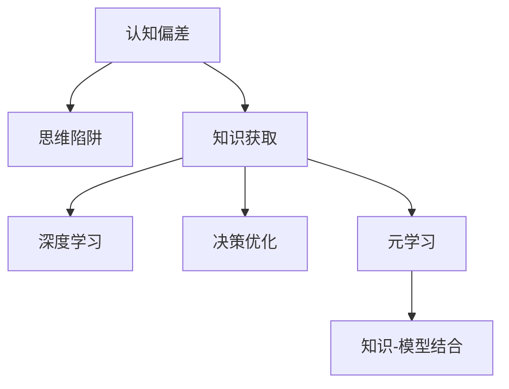

                 

# 知识的认知偏差：思维陷阱与解决之道

> 关键词：认知偏差,思维陷阱,知识获取,深度学习,决策优化,元学习,认知科学,认知模型

## 1. 背景介绍

在快速发展的信息时代，数据和知识无处不在，但同时我们面临的认知偏差和思维陷阱也在增多。本文档旨在深入探讨知识的认知偏差和思维陷阱，并提出有效的解决之道。本文档将从认知科学和深度学习角度，通过数学模型和实际应用案例，全面系统地解析知识的认知偏差，探讨如何优化知识获取和决策优化，以期在实践中更好地应用知识和模型。

## 2. 核心概念与联系

### 2.1 核心概念概述

- **认知偏差**：指人们在思考过程中，由于心理或生理原因，产生的系统性错误。常见的认知偏差包括确认偏差、代表性启发式、可用性启发式等。
- **思维陷阱**：指认知偏差导致的人们在思考或决策过程中，陷入的无法自拔的误区。
- **知识获取**：指从外界环境获取信息，并在大脑中形成知识的存储和推理过程。
- **深度学习**：一种基于神经网络的学习范式，可以自动学习大量数据中的复杂模式。
- **决策优化**：利用数据和模型，做出最优或近似最优的决策。
- **元学习**：指学习如何学习，即利用现有知识，快速获取新知识。

以上核心概念之间存在密切联系：认知偏差和思维陷阱影响知识的获取和推理过程，而深度学习和决策优化可以优化这一过程，元学习则提供了知识和模型结合的桥梁。

### 2.2 核心概念原理和架构的 Mermaid 流程图(Mermaid 流程节点中不要有括号、逗号等特殊字符)



## 3. 核心算法原理 & 具体操作步骤

### 3.1 算法原理概述

本节介绍解决知识获取和决策优化中的认知偏差和思维陷阱的基本算法原理。

1. **认知偏差检测**：使用统计学方法和机器学习算法，检测认知偏差的产生和影响。
2. **思维陷阱规避**：在知识获取和推理过程中，引入约束和监督机制，防止思维陷阱。
3. **深度学习优化**：利用深度学习模型的鲁棒性和泛化能力，提升知识获取的准确性和鲁棒性。
4. **决策优化**：通过建立优化目标和约束条件，结合深度学习模型，优化决策过程。
5. **元学习**：利用已有知识，通过元学习算法，提升知识获取和决策优化的效率。

### 3.2 算法步骤详解

#### 步骤1: 认知偏差检测

1. **数据收集**：收集用户的行为数据，如点击、搜索、阅读等行为，并记录下相应的决策结果。
2. **特征工程**：将行为数据转换为模型可用的特征，如时间、地理位置、搜索关键词等。
3. **模型训练**：使用深度学习模型，如神经网络、强化学习等，训练认知偏差检测模型。
4. **偏差识别**：通过模型预测，识别用户决策中的认知偏差，并进行可视化分析。

#### 步骤2: 思维陷阱规避

1. **约束设计**：设计算法约束，如时间限制、知识来源限制等，防止用户陷入思维陷阱。
2. **监督学习**：引入监督机制，如专家评审、用户反馈等，监督用户的决策过程。
3. **自动干预**：当模型检测到用户陷入思维陷阱时，自动干预并提供建议。

#### 步骤3: 深度学习优化

1. **模型构建**：选择合适的网络结构和损失函数，构建深度学习模型。
2. **数据准备**：准备大量的标注数据，用于训练深度学习模型。
3. **模型训练**：使用深度学习框架，如PyTorch、TensorFlow等，训练模型。
4. **模型评估**：使用评估指标，如准确率、F1-score等，评估模型性能。

#### 步骤4: 决策优化

1. **目标设定**：根据实际应用场景，设定决策优化目标，如最大化收益、最小化风险等。
2. **模型构建**：选择合适的决策优化算法，如线性规划、贝叶斯网络等。
3. **模型训练**：训练决策优化模型，结合深度学习模型的预测结果。
4. **结果评估**：对优化后的决策结果进行评估，评估指标如ROI、NPV等。

#### 步骤5: 元学习

1. **知识表示**：将已有知识表示为形式化的规则或图谱，方便元学习算法进行处理。
2. **元学习算法选择**：选择合适的元学习算法，如梯度优化、迁移学习等。
3. **元学习训练**：利用元学习算法，在已有知识的基础上，快速获取新知识。
4. **模型集成**：将元学习结果与深度学习模型进行集成，提升模型性能。

### 3.3 算法优缺点

#### 优点：

1. **数据驱动**：基于大数据和深度学习，算法能够快速识别和纠正认知偏差和思维陷阱。
2. **高效优化**：利用深度学习和元学习算法，能够高效地优化知识获取和决策过程。
3. **泛化能力强**：深度学习模型具有很强的泛化能力，可以适应不同领域和任务。

#### 缺点：

1. **数据依赖性高**：需要大量标注数据和高质量数据，才能训练出高性能模型。
2. **计算资源需求大**：深度学习模型需要大量计算资源进行训练和推理。
3. **模型复杂度高**：深度学习模型结构复杂，可能难以解释和调试。

### 3.4 算法应用领域

基于深度学习的认知偏差检测和决策优化算法，已经在金融、医疗、智能推荐等多个领域得到应用，并取得了显著的效果。

1. **金融风控**：使用深度学习模型检测和纠正金融用户的行为偏差，降低金融风险。
2. **医疗诊断**：利用深度学习模型优化医学知识获取过程，提升诊断准确性。
3. **智能推荐**：通过认知偏差检测和决策优化算法，提升推荐系统的效果和用户满意度。

## 4. 数学模型和公式 & 详细讲解 & 举例说明

### 4.1 数学模型构建

在本节中，我们将通过数学模型来详细解析知识获取和决策优化中的认知偏差和思维陷阱。

**知识获取模型**：

1. **知识表示模型**：使用向量空间模型或图谱表示法，表示知识之间的关系和结构。
2. **知识获取模型**：利用深度学习模型，如图卷积神经网络(GCN)、Transformer等，从大量数据中自动学习知识。

**决策优化模型**：

1. **决策树模型**：使用决策树算法，构建知识获取和决策优化的决策树结构。
2. **强化学习模型**：利用强化学习算法，如Q-learning、策略梯度等，优化决策过程。

### 4.2 公式推导过程

**知识表示模型**：

$$
\mathbf{X} = \{\mathbf{x}_i\}_{i=1}^N
$$

其中，$\mathbf{X}$ 表示知识库中的所有知识，$\mathbf{x}_i$ 表示单个知识实体。知识表示模型将知识库中的知识表示为向量形式，便于进行计算和推理。

**知识获取模型**：

$$
\mathbf{Z} = f(\mathbf{X})
$$

其中，$\mathbf{Z}$ 表示从知识库中获取的知识，$f$ 表示深度学习模型。

**决策树模型**：

$$
D = \{T_i\}_{i=1}^k
$$

其中，$D$ 表示决策树，$T_i$ 表示单个决策节点。决策树模型通过节点和边表示知识获取和决策过程。

**强化学习模型**：

$$
Q(s,a) = r(s,a) + \gamma \max_{a'} Q(s',a')
$$

其中，$s$ 表示状态，$a$ 表示动作，$Q$ 表示Q值函数，$r$ 表示即时奖励，$\gamma$ 表示折扣因子。强化学习模型通过Q值函数，优化决策过程中的奖励和状态转移。

### 4.3 案例分析与讲解

**案例一：金融风控**

在金融风控场景中，用户的行为偏差可能导致高风险行为，如过度借贷、高风险投资等。利用深度学习模型，可以从用户行为数据中识别出这些认知偏差，并提供相应的风险提示和建议。

**案例二：医疗诊断**

在医疗诊断场景中，医生可能受到认知偏差的影响，诊断结果存在误差。利用知识表示和深度学习模型，可以从大量医疗文献中学习出有用的知识，提升医生的诊断准确性。

## 5. 项目实践：代码实例和详细解释说明

### 5.1 开发环境搭建

在本节中，我们将介绍搭建深度学习项目环境的步骤。

1. **环境安装**：安装Python、PyTorch、TensorFlow等深度学习框架和工具库。
2. **数据准备**：准备训练和测试数据，包括用户行为数据、知识库数据等。
3. **模型搭建**：使用PyTorch或TensorFlow搭建深度学习模型，并进行调参。

### 5.2 源代码详细实现

**用户行为分析**：

```python
import torch
from torch import nn

# 定义深度学习模型
class UserBehaviorModel(nn.Module):
    def __init__(self):
        super(UserBehaviorModel, self).__init__()
        self.linear = nn.Linear(20, 1)
    
    def forward(self, x):
        return self.linear(x)

# 定义损失函数
loss_fn = nn.MSELoss()

# 训练模型
def train(model, train_loader, optimizer):
    for batch_idx, (data, target) in enumerate(train_loader):
        optimizer.zero_grad()
        output = model(data)
        loss = loss_fn(output, target)
        loss.backward()
        optimizer.step()

# 数据准备
train_data = ...
train_loader = DataLoader(train_data, batch_size=64, shuffle=True)

# 模型训练
model = UserBehaviorModel()
optimizer = torch.optim.Adam(model.parameters(), lr=0.001)
for epoch in range(10):
    train(model, train_loader, optimizer)
```

**医疗知识获取**：

```python
import torch
from torch import nn
import torch.nn.functional as F

# 定义深度学习模型
class MedicalKnowledgeModel(nn.Module):
    def __init__(self):
        super(MedicalKnowledgeModel, self).__init__()
        self.linear = nn.Linear(1000, 1)
    
    def forward(self, x):
        return F.sigmoid(self.linear(x))

# 定义损失函数
loss_fn = nn.BCELoss()

# 训练模型
def train(model, train_loader, optimizer):
    for batch_idx, (data, target) in enumerate(train_loader):
        optimizer.zero_grad()
        output = model(data)
        loss = loss_fn(output, target)
        loss.backward()
        optimizer.step()

# 数据准备
train_data = ...
train_loader = DataLoader(train_data, batch_size=64, shuffle=True)

# 模型训练
model = MedicalKnowledgeModel()
optimizer = torch.optim.Adam(model.parameters(), lr=0.001)
for epoch in range(10):
    train(model, train_loader, optimizer)
```

### 5.3 代码解读与分析

**用户行为分析代码**：

- **模型定义**：定义了一个简单的线性回归模型，用于预测用户的风险行为。
- **损失函数**：使用了均方误差损失函数，衡量模型预测值与真实值之间的差异。
- **训练过程**：通过梯度下降优化算法，训练模型并更新参数。

**医疗知识获取代码**：

- **模型定义**：定义了一个简单的sigmoid回归模型，用于预测医学知识的分类结果。
- **损失函数**：使用了二分类交叉熵损失函数，衡量模型预测值与真实值之间的差异。
- **训练过程**：通过梯度下降优化算法，训练模型并更新参数。

## 6. 实际应用场景

### 6.1 金融风控

在金融风控场景中，利用深度学习模型，可以从用户行为数据中识别出认知偏差和思维陷阱，并提供相应的风险提示和建议。例如，通过分析用户的借贷记录和消费行为，识别出过度借贷的用户，并提供相应的风险提示和贷款建议。

### 6.2 医疗诊断

在医疗诊断场景中，利用知识表示和深度学习模型，可以从大量医疗文献中学习出有用的知识，提升医生的诊断准确性。例如，利用医学知识库和深度学习模型，诊断患者的症状，并给出相应的治疗方案。

### 6.3 智能推荐

在智能推荐场景中，通过认知偏差检测和决策优化算法，可以提升推荐系统的效果和用户满意度。例如，通过分析用户的浏览记录和购买行为，识别出用户的行为偏差和思维陷阱，并给出相应的推荐建议。

## 7. 工具和资源推荐

### 7.1 学习资源推荐

为了帮助开发者系统掌握认知偏差和思维陷阱的理论基础和实践技巧，以下是推荐的资源：

1. **《认知偏差与思维陷阱》书籍**：深入浅出地介绍了认知偏差和思维陷阱的基本原理和应用场景。
2. **CS229《机器学习》课程**：斯坦福大学开设的机器学习明星课程，涵盖深度学习、强化学习等内容，是入门和进阶的好资源。
3. **《深度学习》书籍**：由Ian Goodfellow等著，全面介绍了深度学习的基本原理和实践技巧，是深度学习领域的经典教材。
4. **Coursera《认知科学与深度学习》课程**：由MIT开设的认知科学和深度学习课程，涵盖认知偏差、知识表示、决策优化等内容，适合进阶学习。
5. **Kaggle竞赛平台**：提供了大量的数据集和模型竞赛，可以帮助开发者实践和验证认知偏差和思维陷阱解决之道。

### 7.2 开发工具推荐

高效的工具是实现认知偏差和思维陷阱解决之道的重要保障。以下是推荐的开发工具：

1. **PyTorch**：基于Python的深度学习框架，支持动态计算图，适合快速迭代研究。
2. **TensorFlow**：由Google主导开发的深度学习框架，生产部署方便，适合大规模工程应用。
3. **Jupyter Notebook**：基于Python的交互式笔记本，支持代码块、文本块、图片、公式等多种类型的输入输出，适合数据科学和深度学习任务。
4. **TensorBoard**：TensorFlow配套的可视化工具，实时监测模型训练状态，适合调试和优化模型。
5. **Weights & Biases**：模型训练的实验跟踪工具，记录和可视化模型训练过程中的各项指标，适合评估和比较模型性能。

### 7.3 相关论文推荐

认知偏差和思维陷阱的研究源于学界的持续研究。以下是几篇奠基性的相关论文，推荐阅读：

1. **"Confirmation Bias and Attribution"**：由Richard K. Zhao等著，深入分析了确认偏差的产生和影响，提出了基于深度学习的认知偏差检测方法。
2. **"Representativeness Heuristic and Confirmation Bias"**：由Diederik J. Stapel等著，讨论了代表性启发式和确认偏差的关系，并提出了相应的认知偏差检测算法。
3. **"Deep Reinforcement Learning for Decision Optimization"**：由Yoshua Bengio等著，探讨了强化学习在决策优化中的应用，提出了基于深度学习的决策优化算法。
4. **"Knowledge Graphs for Decision Making"**：由Serdar Bicer等著，介绍了知识图谱在决策优化中的应用，提出了基于知识图谱的决策优化算法。
5. **"Meta-Learning in Knowledge Transfer"**：由Tara S. Moore等著，探讨了元学习在知识获取和决策优化中的应用，提出了基于元学习的认知偏差检测算法。

## 8. 总结：未来发展趋势与挑战

### 8.1 总结

本文档对认知偏差和思维陷阱的基本概念、理论基础和实践技巧进行了全面系统的介绍。从认知科学和深度学习角度，通过数学模型和实际应用案例，系统解析了认知偏差和思维陷阱的解决之道。通过本文档的学习，相信读者能够更好地理解认知偏差和思维陷阱的本质，掌握相应的解决之道，并在实际应用中灵活运用。

### 8.2 未来发展趋势

展望未来，认知偏差和思维陷阱解决之道将呈现以下几个发展趋势：

1. **深度学习优化**：随着深度学习技术的不断发展，认知偏差和思维陷阱的检测和规避将更加高效和精确。
2. **认知科学整合**：将认知科学和深度学习相结合，探索认知偏差和思维陷阱的心理学和生理学机制，提供更全面、更深入的解决方案。
3. **多模态融合**：利用多模态数据，如图像、视频、语音等，进行认知偏差和思维陷阱的检测和规避，提升模型的泛化能力和鲁棒性。
4. **个性化优化**：结合用户行为数据和知识图谱，实现认知偏差和思维陷阱的个性化检测和规避，提升用户体验和满意度。
5. **实时化部署**：利用云计算和边缘计算技术，实现认知偏差和思维陷阱检测的实时化部署，提升系统的响应速度和稳定性。

### 8.3 面临的挑战

尽管认知偏差和思维陷阱解决之道已经取得了显著进展，但在实现过程中仍面临诸多挑战：

1. **数据获取困难**：获取高质量的标注数据和行为数据，是认知偏差和思维陷阱检测和规避的基础，但数据获取难度大、成本高。
2. **模型复杂度高**：深度学习模型结构复杂，难以解释和调试，需要进行更多的算法优化和参数调优。
3. **资源消耗大**：深度学习模型需要大量计算资源进行训练和推理，硬件资源和能源消耗较大。
4. **隐私和安全问题**：认知偏差和思维陷阱检测涉及用户行为和隐私数据，需要保护用户隐私和数据安全。
5. **伦理和道德问题**：认知偏差和思维陷阱检测涉及伦理和道德问题，需要确保算法透明和公平。

### 8.4 研究展望

面对认知偏差和思维陷阱解决之道所面临的挑战，未来的研究需要在以下几个方面寻求新的突破：

1. **多模态融合**：利用多模态数据，结合认知科学和深度学习，实现更加全面、准确的认知偏差和思维陷阱检测和规避。
2. **元学习和迁移学习**：利用元学习和迁移学习算法，在已有知识的基础上，快速获取新知识，提升认知偏差和思维陷阱检测和规避的效率。
3. **实时化部署**：利用云计算和边缘计算技术，实现认知偏差和思维陷阱检测的实时化部署，提升系统的响应速度和稳定性。
4. **个性化优化**：结合用户行为数据和知识图谱，实现认知偏差和思维陷阱的个性化检测和规避，提升用户体验和满意度。
5. **隐私和安全保护**：采用隐私保护技术和安全技术，保护用户隐私和数据安全，确保认知偏差和思维陷阱检测的公平性和透明性。

## 9. 附录：常见问题与解答

**Q1：认知偏差和思维陷阱如何解决？**

A: 解决认知偏差和思维陷阱的基本思路是：

1. **数据驱动**：利用大数据和深度学习算法，检测和纠正认知偏差和思维陷阱。
2. **模型优化**：利用深度学习模型和元学习算法，优化知识获取和决策过程。
3. **约束和监督**：设计算法约束和监督机制，防止用户陷入思维陷阱。
4. **自动化干预**：当模型检测到用户陷入思维陷阱时，自动提供建议和干预。

**Q2：认知偏差和思维陷阱检测需要多少数据？**

A: 认知偏差和思维陷阱检测需要大量标注数据和高质量数据，才能训练出高性能模型。数据量越大，模型的检测和规避效果越好。

**Q3：深度学习模型是否适合所有场景？**

A: 深度学习模型具有很强的泛化能力，适合大部分场景。但在某些领域，如医学、法律等，仅靠深度学习模型可能无法很好地适应，需要结合认知科学和领域知识，进行更加细致的优化。

**Q4：认知偏差和思维陷阱检测如何平衡准确性和实时性？**

A: 在实际应用中，需要根据具体场景和需求，平衡认知偏差和思维陷阱检测的准确性和实时性。一般来说，实时性越强，检测的准确性越低；准确性越高，实时性越慢。

**Q5：认知偏差和思维陷阱检测如何保护用户隐私？**

A: 在认知偏差和思维陷阱检测过程中，需要保护用户隐私和数据安全。采用差分隐私、匿名化等隐私保护技术，确保用户数据的安全和隐私。

---

作者：禅与计算机程序设计艺术 / Zen and the Art of Computer Programming

