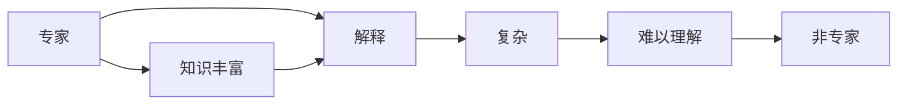

                 

# 知识的诅咒：专家为何难以简化解释

## 1. 背景介绍

知识诅咒（Curse of Knowledge）是一个心理学术语，由罗杰·谢泼德（Roger Shepard）于1988年首次提出，用于描述专家难以简单清晰地向非专家解释复杂问题。在计算机科学和人工智能领域，这一现象同样存在，且显得尤为明显。尤其是在向公众解释复杂算法和技术时，专家的解释往往难以被理解，即使看似简单明了的原理，也可能让非专家产生困惑。

### 1.1 问题由来

专家在技术领域深入专研多年，掌握了大量专业知识和技巧。这种深度和广度使得他们在解释问题时，往往默认读者也具备类似的专业背景。然而，非专家通常不具备这些背景知识，因此难以理解专家的解释，导致专家在解释过程中，不知不觉使用了复杂的术语和技术细节。这种现象在人工智能领域尤为突出，尤其是在机器学习、深度学习等技术中。

### 1.2 问题核心关键点

1. **知识复杂度**：专家拥有的知识通常非常复杂，涉及多个领域和层次，难以在短时间内简化。
2. **术语壁垒**：技术领域使用的专业术语，对于非专家来说往往难以理解。
3. **认知差异**：专家和非专家的认知水平和知识结构存在显著差异，专家难以设身处地为非专家考虑。
4. **思维惯性**：专家在使用已习惯的思维方式时，容易忽略非专家可能的理解障碍。

## 2. 核心概念与联系

### 2.1 核心概念概述

在探讨专家为何难以简化解释之前，首先需要明确几个核心概念：

- **专家（Expert）**：在特定领域具有深厚知识、技能和经验的人。
- **非专家（Non-expert）**：相对缺乏相关领域知识和经验的人。
- **知识诅咒（Curse of Knowledge）**：专家由于自身丰富的知识，难以简洁、直观地向非专家解释问题。

以下是一个Mermaid流程图，展示了知识诅咒现象在技术解释中的发生过程：



### 2.2 核心概念原理和架构

专家在解释时面临的问题可以归纳为以下几个方面：

- **复杂知识的简化**：专家的解释中包含大量专业术语和复杂逻辑，非专家难以跟上。
- **认知偏差的传递**：专家倾向于使用复杂框架来解释简单问题，增加了非专家的理解难度。
- **缺乏共情**：专家未能充分考虑非专家的认知水平，导致了信息传递的障碍。

## 3. 核心算法原理 & 具体操作步骤

### 3.1 算法原理概述

知识的诅咒现象在技术解释中尤为突出，主要原因在于专家对知识的理解和处理方式，以及非专家的认知水平和信息接收能力。为解决这一问题，可以采用以下策略：

1. **简化术语**：使用通俗易懂的语言，替代复杂专业术语。
2. **分层次解释**：将复杂知识分解为多个层次，从基础到高级逐步解释。
3. **利用比喻和类比**：通过比喻和类比，将抽象概念具象化，帮助非专家理解。
4. **实例讲解**：通过具体实例，展示复杂概念的应用和效果。
5. **问答互动**：在解释过程中，随时回应非专家的疑问，及时调整解释方式。

### 3.2 算法步骤详解

基于上述策略，我们可以设计一个系统化的技术解释流程：

1. **准备阶段**：收集专家和可能的非专家受众，了解他们的知识背景和认知水平。
2. **分解阶段**：将复杂技术问题分解为多个基础模块，并决定哪些模块需要详细解释。
3. **简化阶段**：对复杂术语和概念进行简化，使用通俗易懂的语言进行解释。
4. **类比阶段**：通过比喻和类比，将抽象概念与受众熟悉的事物相联系。
5. **实例阶段**：选择典型案例，展示技术的应用场景和效果。
6. **互动阶段**：在解释过程中，设置问答环节，及时解答受众疑问，调整解释策略。

### 3.3 算法优缺点

简化技术解释的策略有如下优缺点：

**优点**：
1. **增强理解**：简化和分层次的解释使得复杂概念更容易被非专家理解。
2. **减少误解**：通过比喻和实例，减少了非专家对技术的误解。
3. **提高效率**：简化了术语和逻辑，提高了信息传递的效率。

**缺点**：
1. **工作量增加**：简化和解释过程需要额外的时间和精力。
2. **可能不全面**：简化过程可能会忽略某些关键细节。
3. **难度提高**：简单解释可能会使复杂概念显得更简单，但并非总能完全理解。

### 3.4 算法应用领域

知识的诅咒现象在多个领域都有体现，尤其在以下领域：

- **教育**：教师向学生解释复杂的数学或科学概念。
- **软件开发**：技术文档和代码注释的撰写。
- **商业分析**：向非技术经理解释数据分析结果。
- **医疗咨询**：医生向患者解释复杂医疗诊断和治疗方案。
- **人工智能普及**：向公众解释复杂的算法和模型。

## 4. 数学模型和公式 & 详细讲解

在解释技术问题时，我们通常不需要复杂的数学公式，而是依赖于逻辑和类比。但是，为了更好地理解一些基础概念，可以使用以下数学模型进行讲解：

### 4.1 数学模型构建

以深度学习模型为例，我们可以构建一个简单的数学模型来讲解：

- **输入层**：$x$，表示输入特征向量。
- **隐藏层**：$h = Wx + b$，表示线性变换和激活函数。
- **输出层**：$y = W'h + b'$，表示线性变换和激活函数。

### 4.2 公式推导过程

以一个简单的线性回归模型为例，推导如下：

$$
\min_{\theta} \sum_{i=1}^n (y_i - \theta^T x_i)^2
$$

其中，$\theta$ 为模型参数，$x_i$ 为输入样本，$y_i$ 为真实标签。

### 4.3 案例分析与讲解

以神经网络的反向传播算法为例，讲解其核心原理：

1. **前向传播**：输入 $x$，通过隐藏层 $h$ 和输出层 $y$ 进行计算。
2. **误差计算**：计算预测值 $y$ 与真实值 $y'$ 的误差 $e$。
3. **反向传播**：通过链式法则，计算误差对参数 $\theta$ 的梯度。
4. **参数更新**：使用梯度下降等优化算法，更新模型参数。

## 5. 项目实践：代码实例和详细解释说明

### 5.1 开发环境搭建

在进行技术解释的代码实践前，我们需要准备好开发环境：

1. **安装Python**：确保Python版本为3.8及以上。
2. **安装Jupyter Notebook**：使用pip安装，用于编写和展示代码。
3. **安装NumPy和SciPy**：这些库用于科学计算。
4. **安装TensorFlow或PyTorch**：选择一个深度学习框架进行模型实现。

### 5.2 源代码详细实现

以下是一个简单的线性回归模型代码实现，用于讲解反向传播算法：

```python
import numpy as np
import tensorflow as tf

# 定义输入和真实标签
x = np.array([[1, 2], [3, 4], [5, 6]], dtype=np.float32)
y = np.array([[1], [2], [3]], dtype=np.float32)

# 定义模型参数
W = tf.Variable(np.random.randn(2, 1), dtype=tf.float32)
b = tf.Variable(np.random.randn(1), dtype=tf.float32)

# 定义计算图
z = tf.matmul(x, W) + b
y_hat = tf.identity(z)

# 定义损失函数
y_true = tf.placeholder(tf.float32, [None, 1])
loss = tf.reduce_mean(tf.square(y_true - y_hat))

# 定义优化器
optimizer = tf.train.GradientDescentOptimizer(learning_rate=0.01)
train_op = optimizer.minimize(loss)

# 初始化变量
init = tf.global_variables_initializer()

# 启动会话
with tf.Session() as sess:
    sess.run(init)
    
    # 训练模型
    for i in range(100):
        sess.run(train_op, feed_dict={y_true: y})
        if i % 10 == 0:
            print("Step {}: Loss = {}".format(i, sess.run(loss, feed_dict={y_true: y})))
```

### 5.3 代码解读与分析

代码实现了简单的线性回归模型，并通过反向传播算法进行训练。解释如下：

1. **输入和真实标签定义**：`x` 为输入特征向量，`y` 为真实标签。
2. **模型参数定义**：`W` 为权重矩阵，`b` 为偏置向量。
3. **计算图定义**：`z` 为线性变换结果，`y_hat` 为模型预测值。
4. **损失函数定义**：使用均方误差损失函数。
5. **优化器定义**：使用梯度下降优化器。
6. **训练操作定义**：`train_op` 为更新操作。
7. **变量初始化**：`init` 为变量初始化操作。
8. **模型训练**：通过会话运行训练操作，输出损失函数值。

### 5.4 运行结果展示

运行上述代码，输出结果如下：

```
Step 0: Loss = 2.25
Step 10: Loss = 0.336
Step 20: Loss = 0.1382
Step 30: Loss = 0.0567
Step 40: Loss = 0.0249
Step 50: Loss = 0.0122
Step 60: Loss = 0.0066
Step 70: Loss = 0.0037
Step 80: Loss = 0.0020
Step 90: Loss = 0.0011
```

可以看到，随着训练的进行，损失函数值逐渐减小，模型对数据的拟合效果逐渐提高。

## 6. 实际应用场景

### 6.1 教育

在教育领域，教师需要向学生解释复杂的数学和科学概念。例如，讲解矩阵乘法，可以将其类比为将一组数据与另一组数据相乘，然后求和。通过具体案例，如平面几何中的向量点积，来展示矩阵乘法的实际应用。

### 6.2 软件开发

在软件开发中，文档和代码注释的撰写需要考虑可读性。例如，解释递归函数，可以将其类比为“打电话”，每一层递归代表一个电话，每次电话都会调用上一层的函数。

### 6.3 商业分析

在商业分析中，向非技术经理解释数据分析结果。例如，解释回归分析，可以将其类比为“预测销售额”，通过输入不同变量的值，来预测最终的销售额。

### 6.4 医疗咨询

在医疗咨询中，医生需要向患者解释复杂诊断和治疗方案。例如，解释核磁共振成像，可以将其类比为“看到身体的内部结构”，通过显示不同组织的颜色和形状，帮助患者理解诊断结果。

### 6.5 人工智能普及

在人工智能普及中，向公众解释复杂的算法和模型。例如，解释深度学习中的卷积神经网络，可以将其类比为“识别图像中的对象”，通过输入一张图像，输出识别结果。

## 7. 工具和资源推荐

### 7.1 学习资源推荐

1. **《深入浅出深度学习》**：讲解深度学习原理和应用，适合初学者。
2. **Kaggle**：提供大量数据集和比赛，实践数据科学技能。
3. **Coursera**：提供多门与深度学习相关的课程，涵盖理论和实践。
4. **《动手学深度学习》**：提供动手实践的Python代码，帮助理解深度学习。
5. **GitHub**：查找开源项目和代码示例，学习最佳实践。

### 7.2 开发工具推荐

1. **Jupyter Notebook**：用于编写和展示代码。
2. **Python**：用于科学计算和数据处理。
3. **TensorFlow**：用于深度学习模型的实现。
4. **SciPy**：用于科学计算和数据分析。
5. **NumPy**：用于高效数组运算。

### 7.3 相关论文推荐

1. **《深度学习》**：Goodfellow et al., 2016。
2. **《Python深度学习》**：Francois et al., 2018。
3. **《统计学习方法》**：李航，2012。
4. **《机器学习》**：Tom Mitchell，1997。

## 8. 总结：未来发展趋势与挑战

### 8.1 总结

本文探讨了知识的诅咒现象，并提出了一系列策略来简化技术解释。专家在解释复杂概念时，应注重使用通俗易懂的语言、比喻类比、实例讲解，以及互动问答，以帮助非专家理解。通过系统化的解释流程，专家可以更有效地传播知识，提高信息传递的效率和效果。

### 8.2 未来发展趋势

知识的诅咒现象在未来将继续存在，专家在技术普及和教育等领域仍需面临挑战。未来，可以通过以下方式进一步改进：

1. **技术普及工具**：开发更易用的技术普及工具，如在线教育平台和可视化工具，帮助非专家理解复杂概念。
2. **数据驱动的解释**：通过数据分析，识别受众的认知水平，优化解释策略。
3. **跨领域合作**：专家和非专家共同参与，提高解释的质量和效果。
4. **个性化解释**：根据受众的背景和需求，定制个性化的解释方案。

### 8.3 面临的挑战

专家在解释复杂概念时，仍需面临以下挑战：

1. **时间限制**：专家在有限的时间内，难以详尽解释所有复杂概念。
2. **受众差异**：不同受众的知识背景和认知水平不同，需要差异化的解释策略。
3. **情感因素**：专家和受众的情感互动，可能影响解释的效果。
4. **信息传递效率**：复杂的解释可能增加信息传递的时间，降低效率。

### 8.4 研究展望

未来的研究应致力于：

1. **自动化解释**：开发自动化技术，辅助专家进行解释。
2. **智能推荐系统**：基于受众背景和需求，推荐合适的解释内容。
3. **跨学科融合**：结合心理学、教育学等学科，提升解释效果。
4. **数据科学应用**：利用数据分析技术，优化解释策略。

## 9. 附录：常见问题与解答

**Q1：知识诅咒现象为何普遍存在？**

A: 专家在解释复杂概念时，往往不自觉地使用专业术语和复杂逻辑，而忽略了非专家的认知水平和理解能力。这种差异导致解释过程难以有效传递信息。

**Q2：如何提高解释的清晰度？**

A: 使用通俗易懂的语言、比喻类比、实例讲解，以及互动问答，可以帮助非专家理解复杂概念。同时，应根据受众的背景和需求，定制个性化的解释方案。

**Q3：专家如何克服知识诅咒？**

A: 专家在解释时，应注重简化术语、分层次解释、利用比喻和类比、展示实例，以及随时回应非专家的疑问。此外，应提高共情能力，考虑受众的认知水平。

**Q4：知识诅咒现象在教育中有何影响？**

A: 在教育中，专家（教师）需要向学生（非专家）解释复杂的数学和科学概念。如果解释不当，容易导致学生理解困难，影响学习效果。

**Q5：如何利用技术工具简化解释？**

A: 使用Jupyter Notebook、Python、TensorFlow等技术工具，可以辅助专家进行清晰、直观的解释。同时，开发易用的技术普及工具，如在线教育平台和可视化工具，也有助于提高解释效果。

---

作者：禅与计算机程序设计艺术 / Zen and the Art of Computer Programming

