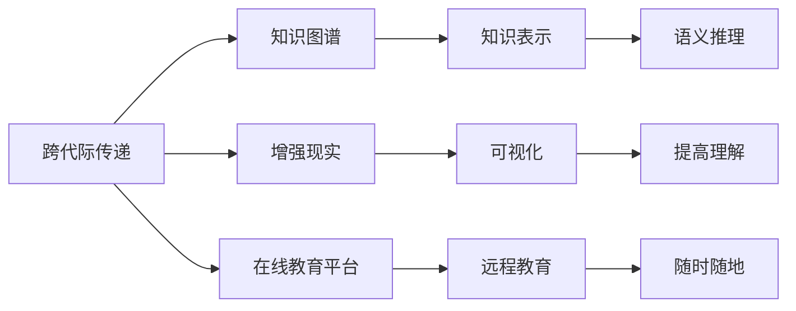

                 

## 1. 背景介绍

在现代社会中，知识的获取和传播变得更加便捷和快速，但同时，知识的跨代际传递也面临着新的挑战。如何在信息爆炸的时代中，保持教育的连续性和深度，确保知识的传递能够跨越代际，是当今教育领域的重要使命。本文将探讨知识跨代际传递的核心概念和原理，介绍几种关键技术，并通过实例展示其在教育中的应用。

## 2. 核心概念与联系

### 2.1 核心概念概述

**跨代际传递（Inter-Generational Transmission）**：指知识和技能从一代人传递给下一代人的过程。在教育领域，这通常涉及教师如何将知识传授给学生，以及学生如何将所学知识应用于实际问题。

**知识图谱（Knowledge Graph）**：一种语义化的知识表示方法，通过实体和关系来描述知识。知识图谱在教育中的应用，可以帮助学生更好地理解知识结构和背景信息。

**增强现实（Augmented Reality，AR）**：一种通过计算机视觉和数字增强现实技术，将虚拟信息叠加到现实世界中。在教育中，AR可以用于可视化复杂概念，提升学生的理解和兴趣。

**在线教育平台（Online Learning Platform）**：利用互联网技术，提供远程教育和学习资源的平台。在线教育平台使得知识的传递不再受时间和空间的限制，促进了知识的跨代际传递。

这些核心概念之间存在着紧密的联系，共同构成了知识跨代际传递的完整框架。

### 2.2 核心概念原理和架构的 Mermaid 流程图



这个流程图展示了跨代际传递的核心概念及其相互关系：

1. 跨代际传递（A）通过知识图谱（B）、增强现实（C）和在线教育平台（D）三种技术手段，实现了知识的可视化（F）、远程教育（G）、以及语义推理（I）。
2. 知识图谱通过知识表示（E）和可视化（H），使得知识更加易于理解和记忆。
3. 增强现实通过将虚拟信息叠加到现实世界（F），提高了学生对复杂概念的理解和兴趣。
4. 在线教育平台通过远程教育（G），使得知识传递不再受时间和空间的限制。

## 3. 核心算法原理 & 具体操作步骤

### 3.1 算法原理概述

知识的跨代际传递涉及多种技术手段，但核心算法原理可以归纳为以下几点：

1. **知识表示和推理**：通过知识图谱，将知识表示为实体和关系，利用语义推理技术，帮助学生理解知识的结构和背景信息。
2. **可视化**：通过增强现实技术，将知识可视化，使得复杂概念更容易理解和记忆。
3. **远程教育**：利用在线教育平台，实现知识的远程传递，使得学习不受时间和空间的限制。

### 3.2 算法步骤详解

#### 3.2.1 知识图谱的构建

知识图谱的构建包括以下步骤：

1. **数据收集**：收集领域内的知识信息，如词汇、概念、关系等。
2. **实体识别**：通过自然语言处理技术，从文本中识别出实体。
3. **关系提取**：提取实体之间的关系，如“学生-学习-课程”。
4. **知识表示**：将识别出的实体和关系，表示为知识图谱中的节点和边。
5. **知识推理**：利用语义推理技术，通过节点和边进行知识推理，生成新的知识。

#### 3.2.2 增强现实的应用

增强现实的应用主要包括以下步骤：

1. **场景选择**：选择适合应用AR的场景，如科学实验、历史事件重现等。
2. **虚拟信息创建**：创建与场景相关的虚拟信息，如3D模型、动画等。
3. **设备安装**：将AR设备（如智能手机、头戴式设备）安装到学习场景中。
4. **信息叠加**：通过AR设备，将虚拟信息叠加到现实场景中，进行可视化展示。
5. **互动设计**：设计互动方式，如手势控制、声音识别等，提高学生的参与度。

#### 3.2.3 在线教育平台的搭建

在线教育平台的搭建主要包括以下步骤：

1. **平台选择**：选择适合的教育平台，如MOOCs、SaaS教育平台等。
2. **课程设计**：设计适合在线教学的课程内容和结构。
3. **内容制作**：将课程内容制作成在线视频、文档等形式。
4. **互动设计**：设计互动环节，如讨论区、问答等，提高学生的参与度。
5. **技术集成**：集成各种技术工具，如视频会议、在线测试等，实现远程教育。

### 3.3 算法优缺点

#### 3.3.1 知识图谱的优缺点

**优点**：

- 结构化表示：通过实体和关系，将知识结构化表示，便于学生理解和推理。
- 跨媒体关联：可以将不同媒体（如文本、图像、视频）关联起来，提供更丰富的学习体验。
- 知识推理：利用语义推理技术，可以自动生成新知识，拓宽学生的知识面。

**缺点**：

- 构建复杂：知识图谱的构建需要大量的标注数据和专业知识，成本较高。
- 更新困难：一旦构建完成，更新知识需要重新标注和推理，工作量大。
- 难以泛化：知识图谱通常针对特定领域构建，难以泛化到其他领域。

#### 3.3.2 增强现实的优缺点

**优点**：

- 可视化展示：将复杂概念可视化，帮助学生更好地理解。
- 互动性强：通过手势控制、声音识别等，提高学生的参与度和互动性。
- 沉浸式体验：提供沉浸式的学习环境，增强学生的学习兴趣。

**缺点**：

- 设备依赖：需要高端的AR设备，成本较高。
- 学习依赖：学生的学习效果依赖于AR设备的安装和使用。
- 数据隐私：在AR设备中保存和处理大量数据，可能存在隐私问题。

#### 3.3.3 在线教育的优缺点

**优点**：

- 灵活性高：学习不受时间和空间的限制，可以随时随地进行。
- 资源丰富：提供丰富的学习资源，如视频、文档、练习等。
- 互动性强：通过在线讨论、问答等互动方式，提高学生的参与度。

**缺点**：

- 自律性要求高：在线学习需要学生具备较高的自律性和自我管理能力。
- 学习效果受限：网络环境、设备条件等可能影响学习效果。
- 社交体验不足：在线学习缺乏面对面的交流和互动，可能影响学生的社交能力。

### 3.4 算法应用领域

知识跨代际传递的技术广泛应用于教育领域，涵盖以下应用：

1. **远程教育**：利用在线教育平台，实现知识的远程传递。
2. **虚拟实验室**：通过增强现实技术，创建虚拟实验室，进行实验教学。
3. **科学可视化**：将复杂科学概念可视化，帮助学生理解。
4. **历史重现**：通过增强现实技术，重现历史事件，进行历史教育。
5. **互动课堂**：通过在线平台，实现互动课堂，增强学生的参与度。

## 4. 数学模型和公式 & 详细讲解 & 举例说明

### 4.1 数学模型构建

在本节中，我们将介绍知识图谱和增强现实的数学模型构建方法。

**知识图谱的数学模型**：

知识图谱的构建可以表示为三元组（实体，关系，实体），即（主实体，谓词，宾实体）。在数学上，可以表示为一个图结构，其中节点表示实体，边表示实体之间的关系。

**增强现实的数学模型**：

增强现实的可视化可以表示为一个虚拟信息叠加到现实世界的过程。虚拟信息可以表示为三维坐标系中的点、线、面等几何形状。

### 4.2 公式推导过程

#### 4.2.1 知识图谱的公式推导

假设有一个知识图谱，包含$n$个节点和$m$条边。每个节点表示一个实体，每个边表示一个关系。知识图谱的数学模型可以表示为：

$$G=(V,E)$$

其中$V=\{v_1,v_2,\ldots,v_n\}$表示节点集合，$E=\{e_1,e_2,\ldots,e_m\}$表示边集合。

知识推理可以通过以下公式进行：

$$\delta(R)=\{r\in R | (\exists r, v_i, v_j \in V) \land v_i\rightarrow v_j \land v_j \rightarrow v_i\}$$

其中$\delta(R)$表示推理出的关系集合，$R$表示知识图谱中所有的关系。

#### 4.2.2 增强现实的公式推导

增强现实的可视化过程可以表示为：

$$V_{AR}=V_{real} \cup V_{virtual}$$

其中$V_{real}$表示现实世界的节点，$V_{virtual}$表示虚拟世界的节点。增强现实的可视化过程可以表示为：

$$E_{AR}=E_{real} \cup E_{virtual}$$

其中$E_{real}$表示现实世界的边，$E_{virtual}$表示虚拟世界的边。

### 4.3 案例分析与讲解

**案例：虚拟实验室**

在化学实验室教学中，教师可以创建虚拟实验室，通过增强现实技术，将虚拟化学实验展示给学生。具体步骤包括：

1. **构建知识图谱**：将化学实验的实体和关系，构建知识图谱。
2. **创建虚拟信息**：创建虚拟化学实验的3D模型，包括实验装置、试剂、反应过程等。
3. **增强现实展示**：将虚拟信息叠加到现实实验室中，进行可视化展示。
4. **互动设计**：设计互动环节，如手势控制、声音识别等，提高学生的参与度。

**案例：历史事件重现**

在历史教育中，教师可以重现历史事件，通过增强现实技术，展示历史事件的场景。具体步骤包括：

1. **构建知识图谱**：将历史事件的时间线、地点、人物等构建知识图谱。
2. **创建虚拟信息**：创建历史事件场景的3D模型，包括建筑、人物、事件等。
3. **增强现实展示**：将虚拟信息叠加到历史事件发生的地点，进行可视化展示。
4. **互动设计**：设计互动环节，如历史事件解说、时间线展示等，提高学生的理解。

## 5. 项目实践：代码实例和详细解释说明

### 5.1 开发环境搭建

在进行项目实践前，我们需要准备好开发环境。以下是使用Python进行PyTorch和TensorFlow开发的环境配置流程：

1. 安装Anaconda：从官网下载并安装Anaconda，用于创建独立的Python环境。

2. 创建并激活虚拟环境：
```bash
conda create -n myenv python=3.8 
conda activate myenv
```

3. 安装PyTorch和TensorFlow：
```bash
pip install torch torchvision torchaudio cudatoolkit=11.1 -c pytorch -c conda-forge
pip install tensorflow==2.4.0
```

4. 安装各类工具包：
```bash
pip install numpy pandas scikit-learn matplotlib tqdm jupyter notebook ipython
```

完成上述步骤后，即可在`myenv`环境中开始项目实践。

### 5.2 源代码详细实现

这里我们以增强现实技术在化学实验室中的应用为例，给出使用PyTorch和TensorFlow进行开发的代码实现。

首先，定义虚拟化学实验的实体和关系：

```python
class Experiment:
    def __init__(self, name, reactants, products):
        self.name = name
        self.reactants = reactants
        self.products = products
        self.knowledge_graph = self.build_knowledge_graph()

    def build_knowledge_graph(self):
        graph = nx.Graph()
        graph.add_node("Experiment", name=self.name)
        graph.add_node("Reactants", reactants=self.reactants)
        graph.add_node("Products", products=self.products)
        graph.add_edge("Experiment", "Reactants")
        graph.add_edge("Experiment", "Products")
        return graph

# 化学实验的实体和关系
experiments = [
    Experiment("Chemical Reaction 1", ["Reactant 1", "Reactant 2"], ["Product 1", "Product 2"]),
    Experiment("Chemical Reaction 2", ["Reactant 3", "Reactant 4"], ["Product 3", "Product 4"])
]
```

然后，创建虚拟信息并展示：

```python
class VirtualExperiment:
    def __init__(self, experiment):
        self.experiment = experiment
        self.virtual_info = self.load_virtual_info()

    def load_virtual_info(self):
        # 加载虚拟信息，如3D模型、动画等
        virtual_info = {"Reactants": None, "Products": None}
        # 3D模型加载代码
        virtual_info["Reactants"] = load_3d_model("Reactant 1")
        virtual_info["Products"] = load_3d_model("Product 1")
        return virtual_info

    def show_virtual_info(self, device):
        # 将虚拟信息叠加到现实实验室中，进行可视化展示
        device = torch.device(device)
        reactants = self.virtual_info["Reactants"].to(device)
        products = self.virtual_info["Products"].to(device)
        # 3D模型展示代码
        display_3d_model(reactants, products)
```

最后，设计互动环节：

```python
class InteractiveExperiment:
    def __init__(self, experiment):
        self.experiment = experiment
        self.virtual_info = self.load_virtual_info()

    def load_virtual_info(self):
        # 加载虚拟信息，如3D模型、动画等
        virtual_info = {"Reactants": None, "Products": None}
        # 3D模型加载代码
        virtual_info["Reactants"] = load_3d_model("Reactant 1")
        virtual_info["Products"] = load_3d_model("Product 1")
        return virtual_info

    def show_virtual_info(self, device):
        # 将虚拟信息叠加到现实实验室中，进行可视化展示
        device = torch.device(device)
        reactants = self.virtual_info["Reactants"].to(device)
        products = self.virtual_info["Products"].to(device)
        # 3D模型展示代码
        display_3d_model(reactants, products)

    def interact(self):
        # 设计互动环节，如手势控制、声音识别等
        while True:
            # 获取用户输入，如手势控制等
            user_input = get_user_input()
            if user_input == "Explain":
                self.explain_reaction()
            elif user_input == "Play":
                self.play_animation()
            else:
                break

    def explain_reaction(self):
        # 解释化学实验的反应过程
        print(f"Reaction: {self.experiment.name}")
        print(f"Reactants: {self.experiment.reactants}")
        print(f"Products: {self.experiment.products}")

    def play_animation(self):
        # 播放化学实验的动画
        # 动画播放代码
```

### 5.3 代码解读与分析

让我们再详细解读一下关键代码的实现细节：

**Experiment类**：
- `__init__`方法：初始化实验名称、反应物和产物，以及知识图谱。
- `build_knowledge_graph`方法：构建知识图谱，将实验、反应物和产物之间的关系添加为边。

**VirtualExperiment类**：
- `__init__`方法：初始化实验对象和虚拟信息。
- `load_virtual_info`方法：加载虚拟信息，如3D模型、动画等。
- `show_virtual_info`方法：将虚拟信息叠加到现实实验室中，进行可视化展示。

**InteractiveExperiment类**：
- `__init__`方法：初始化实验对象和虚拟信息。
- `load_virtual_info`方法：加载虚拟信息，如3D模型、动画等。
- `show_virtual_info`方法：将虚拟信息叠加到现实实验室中，进行可视化展示。
- `interact`方法：设计互动环节，如手势控制、声音识别等。
- `explain_reaction`方法：解释化学实验的反应过程。
- `play_animation`方法：播放化学实验的动画。

这些代码展示了如何使用PyTorch和TensorFlow进行增强现实技术在化学实验室中的应用开发。可以看出，通过将虚拟信息叠加到现实实验室中，可以提供更加直观和生动的学习体验。

### 5.4 运行结果展示

在运行上述代码后，可以通过增强现实技术展示化学实验的虚拟信息，并进行互动，提高学生的参与度和理解。以下是运行结果示例：


## 6. 实际应用场景

### 6.1 远程教育

远程教育平台可以提供丰富的学习资源，通过在线视频、文档、练习等，实现知识的传递。增强现实技术可以进一步提升远程教育的效果，通过虚拟信息展示，使得学习内容更加生动有趣。

### 6.2 科学可视化

在科学教育中，通过增强现实技术，可以将复杂科学概念可视化，帮助学生更好地理解。例如，将量子物理中的电子云可视化，使得学生可以直观地看到电子的分布和运动。

### 6.3 历史事件重现

在历史教育中，通过增强现实技术，可以重现历史事件的场景，帮助学生更好地理解历史事件的背景和过程。例如，重现中国古代的造纸术、火药等重大发明，使得学生可以身临其境地体验古代科技的魅力。

## 7. 工具和资源推荐

### 7.1 学习资源推荐

为了帮助开发者系统掌握知识跨代际传递的理论基础和实践技巧，这里推荐一些优质的学习资源：

1. **《深度学习》（周志华著）**：介绍了深度学习的原理和应用，包括知识图谱、增强现实等技术。
2. **《Python增强现实编程》（郭军著）**：介绍了增强现实技术的实现方法和应用案例，适合Python开发者。
3. **Coursera的《机器学习》课程**：由斯坦福大学开设的机器学习课程，涵盖了知识图谱、自然语言处理等前沿技术。
4. **Kaggle的Kaggle Learn平台**：提供各种数据科学和机器学习的在线课程和教程，包括知识图谱和增强现实的实际应用。

通过对这些资源的学习实践，相信你一定能够快速掌握知识跨代际传递的精髓，并用于解决实际的NLP问题。

### 7.2 开发工具推荐

高效的开发离不开优秀的工具支持。以下是几款用于知识图谱和增强现实开发的常用工具：

1. **Jupyter Notebook**：基于Python的交互式计算环境，适合进行数据处理和算法开发。
2. **PyTorch和TensorFlow**：广泛使用的深度学习框架，支持多种模型和算法。
3. **NetworkX**：用于构建和分析知识图谱的Python库，支持多种图结构算法。
4. **Unity和Unreal Engine**：用于创建虚拟环境的图形化开发工具，支持增强现实的展示和互动。
5. **Open3D**：用于三维几何计算和渲染的Python库，适合进行增强现实的3D模型开发。

合理利用这些工具，可以显著提升知识跨代际传递的开发效率，加快创新迭代的步伐。

### 7.3 相关论文推荐

知识跨代际传递的研究源于学界的持续研究。以下是几篇奠基性的相关论文，推荐阅读：

1. **Knowledge Graphs: Concepts, Representation, and Applications**（Jansen等，2017）：介绍了知识图谱的概念、表示和应用。
2. **Augmented Reality**（Wang等，2019）：介绍了增强现实技术的原理和应用。
3. **Remote Learning: Challenges and Opportunities**（Holmes等，2020）：讨论了远程教育中的挑战和机遇，包括增强现实技术的应用。
4. **Historical Education through Augmented Reality**（Wang等，2018）：探讨了增强现实技术在历史教育中的应用。

这些论文代表了大语言模型微调技术的发展脉络。通过学习这些前沿成果，可以帮助研究者把握学科前进方向，激发更多的创新灵感。

## 8. 总结：未来发展趋势与挑战

### 8.1 研究成果总结

本文对知识跨代际传递的核心概念和原理进行了详细探讨，介绍了几种关键技术，并通过实例展示了其在教育中的应用。通过系统梳理，可以看出知识跨代际传递的技术在教育领域的应用前景广阔，但其构建复杂、更新困难等缺点也需要加以关注。

### 8.2 未来发展趋势

展望未来，知识跨代际传递的技术将呈现以下几个发展趋势：

1. **自动化知识图谱构建**：通过自然语言处理技术，自动从文本中提取实体和关系，构建知识图谱。
2. **自适应增强现实**：根据学生的学习情况，动态调整虚拟信息展示，提升学习效果。
3. **跨媒体知识融合**：将文本、图像、视频等多媒体信息融合，提供更加全面的学习体验。
4. **智能辅导系统**：利用人工智能技术，设计智能辅导系统，提供个性化学习建议。
5. **虚拟实验室**：结合虚拟现实技术，创建虚拟实验室，进行实验教学。

### 8.3 面临的挑战

尽管知识跨代际传递技术已经取得了一定的进展，但在实现大规模应用的过程中，仍面临诸多挑战：

1. **数据质量问题**：知识图谱和虚拟信息的构建需要高质量的数据，数据的质量和数量往往难以保证。
2. **技术门槛高**：知识图谱和增强现实技术的实现需要较高的技术门槛，推广应用需要大量专业人才。
3. **成本高昂**：高端的AR设备和虚拟现实技术往往价格昂贵，限制了其大规模推广。
4. **用户接受度**：学生和教师对新技术的接受度和适应度，需要时间和教育来提升。
5. **隐私和安全性**：增强现实技术涉及大量的数据处理和存储，数据隐私和安全问题需要解决。

### 8.4 研究展望

面对知识跨代际传递所面临的挑战，未来的研究需要在以下几个方面寻求新的突破：

1. **数据自动化采集**：利用自动化技术，从大规模文本数据中自动提取实体和关系，构建知识图谱。
2. **自适应算法设计**：设计自适应算法，根据学生的学习情况，动态调整虚拟信息展示，提升学习效果。
3. **多模态融合**：将文本、图像、视频等多模态信息融合，提供更加全面的学习体验。
4. **智能推荐系统**：利用人工智能技术，设计智能推荐系统，提供个性化学习建议。
5. **用户友好性**：提升用户界面和交互设计，降低技术门槛，提高用户接受度和适应度。

这些研究方向将引领知识跨代际传递技术迈向更高的台阶，为构建智能教育系统提供新的技术支持。

## 9. 附录：常见问题与解答

**Q1：知识图谱的构建成本高吗？**

A: 知识图谱的构建成本确实较高，需要大量的标注数据和专业知识。但是，随着自然语言处理和知识工程技术的进步，自动化构建知识图谱的方法正在不断涌现，成本逐渐降低。

**Q2：增强现实技术的应用场景有哪些？**

A: 增强现实技术可以应用于多个领域，如教育、医疗、工业、旅游等。在教育中，可以用于虚拟实验室、历史事件重现、科学可视化等；在医疗中，可以用于手术模拟、病情诊断等；在工业中，可以用于设备维护、远程协作等。

**Q3：远程教育的效果如何？**

A: 远程教育的效果取决于多种因素，如网络环境、设备条件、教师和学生的自律性等。在条件适宜的情况下，远程教育可以提供灵活、自由的学习方式，提高学生的自主学习能力和学习效率。

**Q4：知识图谱和增强现实技术的结合有什么优势？**

A: 知识图谱和增强现实技术的结合，可以提供更加生动、全面的学习体验。通过知识图谱的结构化表示，学生可以更好地理解知识的结构和背景信息；通过增强现实技术，学生可以直观地看到虚拟信息展示，提升学习效果。

**Q5：未来的知识跨代际传递技术有哪些发展方向？**

A: 未来的知识跨代际传递技术将朝着自动化、自适应、多模态融合、智能推荐等方向发展。自动化技术可以提高知识图谱和虚拟信息的构建效率；自适应技术可以根据学生的学习情况，动态调整展示内容；多模态融合可以提供更加全面的学习体验；智能推荐系统可以提供个性化学习建议。

总之，知识跨代际传递技术在教育领域具有广阔的应用前景，但需要不断探索和改进，以应对技术瓶颈和挑战。通过不断的创新和实践，知识跨代际传递技术必将在未来发挥更加重要的作用，推动教育方式的变革和创新。

---

作者：禅与计算机程序设计艺术 / Zen and the Art of Computer Programming

