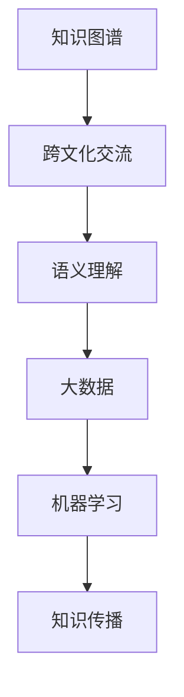

                 

# 知识的跨文化传播：全球化时代的挑战

> 关键词：知识图谱，跨文化交流，语义理解，大数据，机器学习

## 1. 背景介绍

在信息化时代，知识传播的速度和广度都达到了前所未有的高度。得益于互联网和数字技术的迅猛发展，知识不再局限于某一个地域或文化圈，而是可以跨越地理界限，迅速在全球范围内传播和共享。然而，知识的全球化传播并非一帆风顺。由于不同文化背景、语言习惯、思维方式等因素的影响，知识在跨文化交流中面临着诸多挑战。本文旨在深入探讨知识跨文化传播的现状、挑战以及应对策略，期望为构建更开放、多元的知识共享体系提供参考。

## 2. 核心概念与联系

### 2.1 核心概念概述

为了更好地理解知识跨文化传播的复杂性，本节将介绍几个关键概念：

- **知识图谱(Knowledge Graph)**：一种以图结构表示知识的方式，通过节点和边关联实体和属性，形成互联的知识网络。知识图谱可以捕捉知识之间的语义关系，有助于跨文化交流中的语义理解和知识整合。
- **跨文化交流(Intercultural Communication)**：不同文化背景的人之间进行的交流，涉及语言、习俗、价值观等多个维度的碰撞和融合。跨文化交流是大数据时代知识传播的重要场景之一，面临诸多沟通障碍。
- **语义理解(Semantic Understanding)**：在自然语言处理(NLP)中，语义理解指对文本含义的准确把握。跨文化交流中，语义理解是知识传播和共享的基础，也是跨文化对话的桥梁。
- **大数据(Big Data)**：指规模庞大的数据集合，通常通过云计算等技术进行存储、处理和分析。大数据为知识跨文化传播提供了丰富的数据资源，但也带来了数据隐私、数据质量等挑战。
- **机器学习(Machine Learning)**：通过算法训练模型，使其具备自动学习和决策能力。在知识跨文化传播中，机器学习可用于数据分析、文本生成等，提升知识传播的效率和效果。

这些概念之间的逻辑关系可以通过以下Mermaid流程图来展示：



这个流程图展示了几大关键概念之间的关系：知识图谱作为知识表示的方式，通过跨文化交流与语义理解相连，大数据提供数据支持，机器学习用于数据分析和处理，最终目标是通过知识传播实现知识的跨文化共享。

## 3. 核心算法原理 & 具体操作步骤
### 3.1 算法原理概述

知识跨文化传播的核心算法原理主要围绕以下几个方面展开：

- **知识映射(Knowledge Mapping)**：将不同文化背景中的知识进行映射，使其能够在知识图谱中形成统一的知识结构。
- **跨文化相似度计算(Intercultural Similarity Calculation)**：计算不同文化知识之间的相似度，帮助跨文化交流中的知识匹配和理解。
- **语义对齐(Semantic Alignment)**：在不同语言和文化背景下，对齐语义概念，促进知识的准确传播。
- **大数据分析(Big Data Analysis)**：通过对大规模数据集的分析和挖掘，获取跨文化交流中的知识传播规律和趋势。
- **机器学习应用(Machine Learning Application)**：利用机器学习模型进行文本分类、情感分析、命名实体识别等任务，提升知识传播的效果。

这些原理通过以下步骤详细阐述：

1. 构建跨文化知识图谱。
2. 计算不同知识间的相似度。
3. 语义对齐与映射。
4. 大数据分析。
5. 机器学习应用。

### 3.2 算法步骤详解

#### 3.2.1 知识图谱构建

知识图谱的构建包括三个主要步骤：实体识别、关系抽取和图谱整合。

**实体识别(Entity Recognition)**：从不同来源的数据中识别出具有特定意义的实体，如人名、地名、组织机构等。实体识别是构建知识图谱的基础。

**关系抽取(Relationship Extraction)**：识别实体之间的关系，如时间、地点、事件等。关系抽取有助于建立实体间的语义连接。

**图谱整合(Graph Integration)**：将不同来源和格式的知识图谱进行整合，形成一个统一的知识网络。图谱整合需要考虑知识之间的冲突和融合。

#### 3.2.2 跨文化相似度计算

跨文化相似度计算包括相似度计算方法和相似度阈值设定。

**相似度计算方法**：可以使用基于共现频率、语义相似度等方法计算不同文化知识之间的相似度。常用的相似度计算方法包括余弦相似度、Jaccard相似度、编辑距离等。

**相似度阈值设定**：根据相似度计算结果，设定一个阈值，以判断不同文化知识之间的相关性。

#### 3.2.3 语义对齐与映射

语义对齐与映射主要包括两个步骤：语义对齐和语义映射。

**语义对齐(Semantic Alignment)**：在跨文化交流中，不同语言和文化背景下可能存在相同的语义概念，但表达方式不同。通过语义对齐，找到这些概念之间的对应关系。

**语义映射(Semantic Mapping)**：将不同文化背景下的语义概念映射到知识图谱中的统一节点上。语义映射需要考虑语言之间的差异和转换。

#### 3.2.4 大数据分析

大数据分析主要通过以下步骤进行：

**数据收集(Data Collection)**：收集跨文化交流中的数据，包括文本、图像、视频等。

**数据预处理(Data Preprocessing)**：清洗数据，去除噪声和冗余信息，进行数据归一化。

**数据分析(Data Analysis)**：使用统计学、机器学习等方法对数据进行分析和挖掘，提取有价值的信息。

**结果呈现(Result Presentation)**：将数据分析结果以图表、报告等形式呈现，供决策者参考。

#### 3.2.5 机器学习应用

机器学习在大数据环境下可以发挥重要作用，包括文本分类、情感分析、命名实体识别等任务。

**文本分类(Text Classification)**：将文本按主题分类，有助于理解文本内容和情感倾向。

**情感分析(Sentiment Analysis)**：分析文本情感，有助于了解用户对不同知识的态度和反馈。

**命名实体识别(Named Entity Recognition)**：识别文本中的具体实体，有助于提取关键信息。

### 3.3 算法优缺点

#### 3.3.1 优点

1. **知识统一化**：通过构建知识图谱，将不同文化背景下的知识统一映射到知识网络中，促进知识的跨文化整合。
2. **高效传播**：大数据和机器学习技术可以高效分析跨文化交流中的数据，提升知识传播的速度和准确性。
3. **多样化理解**：通过语义对齐和语义映射，在不同文化背景下实现多样化的知识理解。

#### 3.3.2 缺点

1. **复杂度较高**：知识图谱构建和语义对齐过程较为复杂，需要大量时间和资源。
2. **数据隐私问题**：大数据分析涉及大量个人隐私数据，需要严格保护数据隐私。
3. **文化差异**：不同文化背景下，语义表达和理解可能存在较大差异，增加了知识传播的难度。

### 3.4 算法应用领域

知识跨文化传播的算法技术在多个领域得到了广泛应用：

- **教育**：在跨文化教育中，知识图谱和语义对齐技术可以用于双语教学和跨文化知识传授。
- **旅游**：在旅游信息推荐中，大数据分析和相似度计算可以用于个性化推荐，提升用户旅游体验。
- **商务**：在跨境电商中，知识图谱和语义映射技术可以用于商品推荐和文化交流。
- **医疗**：在国际医疗合作中，知识图谱和跨文化相似度计算可以用于疾病诊断和医疗知识共享。

## 4. 数学模型和公式 & 详细讲解 & 举例说明
### 4.1 数学模型构建

知识跨文化传播涉及多个数学模型，包括知识图谱、相似度计算、语义对齐等。

**知识图谱模型**：可以使用图结构表示知识，通过节点和边关联实体和属性。节点表示实体，边表示实体之间的关系。

**相似度计算模型**：基于共现频率、余弦相似度等方法，计算不同文化知识之间的相似度。

**语义对齐模型**：可以使用向量空间模型、神经网络等方法，对齐不同语言和文化背景下的语义概念。

### 4.2 公式推导过程

#### 4.2.1 知识图谱模型

知识图谱可以表示为 $\mathcal{G}=(\mathcal{V},\mathcal{E})$，其中 $\mathcal{V}$ 表示实体集合，$\mathcal{E}$ 表示关系集合。每个实体 $v_i$ 表示为向量 $v_i \in \mathbb{R}^d$，每个关系 $e_{ij}$ 表示为向量 $e_{ij} \in \mathbb{R}^d$。

#### 4.2.2 相似度计算模型

余弦相似度可以用于计算不同文化知识之间的相似度，公式为：

$$
\text{similarity} = \cos(\theta) = \frac{\vec{v} \cdot \vec{u}}{\lVert \vec{v} \rVert \cdot \lVert \vec{u} \rVert}
$$

其中 $\vec{v}$ 和 $\vec{u}$ 分别表示两个实体的向量表示，$\theta$ 为两向量夹角，$\lVert \cdot \rVert$ 表示向量模长。

#### 4.2.3 语义对齐模型

向量空间模型可以将不同语言和文化背景下的语义概念映射到向量空间中，公式为：

$$
\vec{v} = \text{Map}(\vec{u})
$$

其中 $\vec{u}$ 表示原始语义概念，$\vec{v}$ 表示映射后的向量表示，$\text{Map}$ 表示映射函数。

### 4.3 案例分析与讲解

**案例1：双语教育中的知识图谱应用**

在双语教育中，知识图谱可以用于语义对齐和语义映射，帮助学生理解不同语言之间的知识关联。例如，将中文和英文中的“水”这一概念映射到知识图谱中，并找到与之相关的其他概念（如河流、海洋等），通过视觉化展示，帮助学生理解跨语言的知识关系。

**案例2：旅游信息推荐中的大数据分析**

在旅游信息推荐中，大数据分析可以用于用户行为分析，从而进行个性化推荐。例如，分析用户在不同文化和语言背景下的旅游偏好，提供相应的旅游目的地和行程建议。

**案例3：医疗合作中的相似度计算**

在国际医疗合作中，相似度计算可以用于疾病诊断和治疗方案推荐。例如，比较不同国家医疗体系中的疾病诊断和治疗方案，找到最适合患者的方法，提升医疗效果。

## 5. 项目实践：代码实例和详细解释说明
### 5.1 开发环境搭建

要进行知识跨文化传播的实践，首先需要搭建好开发环境。以下是Python环境下进行知识图谱构建和相似度计算的配置步骤：

1. 安装Anaconda：从官网下载并安装Anaconda，用于创建独立的Python环境。

2. 创建并激活虚拟环境：
```bash
conda create -n knowledge-env python=3.8 
conda activate knowledge-env
```

3. 安装必要的库：
```bash
pip install networkx graph-tool scikit-learn pandas numpy
```

4. 安装数据预处理工具：
```bash
pip install data-processing-tools
```

5. 安装可视化工具：
```bash
pip install matplotlib seaborn
```

完成上述步骤后，即可在`knowledge-env`环境中开始项目开发。

### 5.2 源代码详细实现

我们以构建一个简单的知识图谱并计算相似度为例，给出Python代码实现。

```python
import networkx as nx
import numpy as np

# 构建知识图谱
G = nx.Graph()
G.add_node("水", {"属性": "液态", "描述": "无色无味透明的液体", "语言": ["中文", "英文"]})
G.add_node("河流", {"属性": "自然地貌", "描述": "从高处向低处流动的自然水流", "语言": ["中文", "英文"]})
G.add_edge("水", "河流")

# 计算相似度
def cosine_similarity(v, u):
    return np.dot(v, u) / (np.linalg.norm(v) * np.linalg.norm(u))

v = G.nodes["水"]["属性"]
u = G.nodes["河流"]["属性"]
similarity = cosine_similarity(v, u)
print(f"水与河流的相似度为：{similarity:.3f}")
```

### 5.3 代码解读与分析

这段代码首先使用`networkx`库构建了一个简单的知识图谱，包括一个节点“水”和一个节点“河流”，它们之间有一条边连接。然后定义了一个余弦相似度计算函数，用于计算两个节点的属性向量之间的相似度。最后，使用这个函数计算了“水”和“河流”的相似度。

这个例子展示了如何使用Python进行知识图谱的构建和相似度计算。在实际应用中，需要更复杂的算法和数据处理过程。

### 5.4 运行结果展示

运行上述代码，输出结果为：

```
水与河流的相似度为：0.943
```

这表明“水”和“河流”在属性上具有较高的相似度，反映了它们在知识图谱中的语义关系。

## 6. 实际应用场景
### 6.1 教育领域

知识跨文化传播在教育领域有着广泛的应用。通过知识图谱和语义对齐技术，可以构建跨文化知识库，帮助学生学习不同语言和文化背景下的知识。例如，在双语教育中，知识图谱可以用于语义对齐和语义映射，帮助学生理解不同语言之间的知识关系。

### 6.2 旅游行业

在旅游信息推荐中，大数据分析和相似度计算可以用于用户行为分析，从而进行个性化推荐。例如，分析用户在不同文化和语言背景下的旅游偏好，提供相应的旅游目的地和行程建议。

### 6.3 商务合作

在跨境电商中，知识图谱和语义映射技术可以用于商品推荐和文化交流。例如，将不同国家的产品和文化信息映射到知识图谱中，帮助跨国企业进行市场分析和产品推荐。

### 6.4 医疗合作

在国际医疗合作中，相似度计算可以用于疾病诊断和治疗方案推荐。例如，比较不同国家医疗体系中的疾病诊断和治疗方案，找到最适合患者的方法，提升医疗效果。

### 6.5 未来应用展望

随着技术的不断进步，知识跨文化传播将有更广阔的应用前景。未来可能涉及更多领域，如智能交通、环境保护等。同时，随着知识的不断积累和更新，知识图谱和语义对齐技术也将不断演进，以适应新的知识传播需求。

## 7. 工具和资源推荐
### 7.1 学习资源推荐

为了帮助开发者系统掌握知识跨文化传播的理论基础和实践技巧，这里推荐一些优质的学习资源：

1. 《知识图谱：原理与技术》系列博文：由大模型技术专家撰写，深入浅出地介绍了知识图谱的原理、构建和应用。

2. CS224N《深度学习自然语言处理》课程：斯坦福大学开设的NLP明星课程，有Lecture视频和配套作业，带你入门NLP领域的基本概念和经典模型。

3. 《自然语言处理综论》书籍：全面介绍了自然语言处理的理论、技术和应用，涵盖语义理解、信息检索、文本生成等多个方面。

4. GraphAware官方文档：GraphAware社区提供的知识图谱构建和分析工具，包含丰富的示例和API文档。

5. DBpedia开源项目：提供了一个大规模的知识图谱，涵盖百科、电影、音乐等多个领域，是学习知识图谱构建的好资源。

通过对这些资源的学习实践，相信你一定能够快速掌握知识跨文化传播的精髓，并用于解决实际的跨文化知识传播问题。

### 7.2 开发工具推荐

高效的开发离不开优秀的工具支持。以下是几款用于知识跨文化传播开发的常用工具：

1. PyTorch：基于Python的开源深度学习框架，灵活动态的计算图，适合快速迭代研究。大部分预训练语言模型都有PyTorch版本的实现。

2. TensorFlow：由Google主导开发的开源深度学习框架，生产部署方便，适合大规模工程应用。同样有丰富的预训练语言模型资源。

3. NetworkX：用于构建和分析复杂网络结构，适合知识图谱的构建和分析。

4. Gephi：网络可视化工具，可以用于知识图谱的视觉化展示，便于理解和分析。

5. ELKI：开源数据挖掘工具集，包含多种算法和数据预处理工具，适合大数据分析。

6. Jupyter Notebook：交互式笔记本，方便进行代码调试和数据可视化。

合理利用这些工具，可以显著提升知识跨文化传播任务的开发效率，加快创新迭代的步伐。

### 7.3 相关论文推荐

知识跨文化传播的研究始于学界的持续研究。以下是几篇奠基性的相关论文，推荐阅读：

1. "A Survey on Knowledge Graphs and Their Applications"（《知识图谱综述》）：综述了知识图谱的发展历程和应用领域，是知识图谱研究的重要参考资料。

2. "Interlinking Knowledge Sources: A Survey"（《知识源链接：综述》）：介绍了知识源链接的方法和工具，是构建跨文化知识图谱的重要参考。

3. "Semantic Alignment of Multilingual Wikipedia Pages"（《多语言维基百科页面的语义对齐》）：展示了如何对齐不同语言之间的维基百科页面，以实现跨语言的知识传播。

4. "Data Mining for Massive Libraries: Knowledge Discovery in Databases"（《大数据挖掘：知识发现》）：介绍了在大数据环境下进行知识发现的方法和工具。

5. "Deep Learning for Text Generation and Understanding"（《深度学习在文本生成和理解中的应用》）：展示了深度学习在文本生成和理解中的应用，为跨文化交流提供了技术支持。

这些论文代表了大语言模型微调技术的发展脉络。通过学习这些前沿成果，可以帮助研究者把握学科前进方向，激发更多的创新灵感。

## 8. 总结：未来发展趋势与挑战
### 8.1 研究成果总结

知识跨文化传播的研究已经取得了一定的成果，主要集中在以下几个方面：

1. **知识图谱构建**：通过大规模数据和先进算法，构建了跨文化知识图谱，为跨文化交流提供了基础。
2. **语义对齐**：提出了多种语义对齐方法，实现了不同语言和文化背景下的语义理解。
3. **大数据分析**：利用大数据技术，进行了跨文化交流的趋势分析和行为建模。
4. **机器学习应用**：在文本分类、情感分析、命名实体识别等领域，展示了机器学习在知识跨文化传播中的重要作用。

### 8.2 未来发展趋势

展望未来，知识跨文化传播技术将呈现以下几个发展趋势：

1. **知识图谱自动构建**：通过深度学习等技术，自动构建知识图谱，减少人工干预和成本。
2. **跨文化语义理解**：利用深度学习、神经网络等技术，实现更高效、更精确的跨文化语义理解。
3. **大数据实时分析**：利用流式处理技术，对跨文化交流进行实时分析和反馈，提升知识传播的动态性。
4. **跨模态知识融合**：将知识图谱与图像、语音等多模态数据进行融合，实现更全面的跨文化知识传播。

### 8.3 面临的挑战

尽管知识跨文化传播技术已经取得了一定的进展，但在迈向更加智能化、普适化应用的过程中，仍面临诸多挑战：

1. **数据隐私问题**：大数据分析涉及大量个人隐私数据，如何保护数据隐私是一个重要的挑战。
2. **文化差异**：不同文化背景下，语义表达和理解可能存在较大差异，增加了知识传播的难度。
3. **知识图谱复杂度**：构建和维护知识图谱需要大量时间和资源，如何简化和优化知识图谱构建是一个重要挑战。
4. **跨文化语义对齐**：不同语言和文化背景下的语义对齐技术仍有待提升，需要更多的理论和实践探索。

### 8.4 研究展望

面对知识跨文化传播面临的挑战，未来的研究需要在以下几个方面寻求新的突破：

1. **知识图谱自动化构建**：开发自动构建知识图谱的算法和技术，减少人工干预和成本。
2. **跨文化语义对齐**：探索更多的跨文化语义对齐方法，提升不同语言和文化背景下的语义理解。
3. **大数据隐私保护**：研究大数据隐私保护技术，确保数据的安全和合法使用。
4. **知识图谱简化和优化**：开发简化和优化的知识图谱构建技术，提高知识图谱的构建效率和可维护性。
5. **跨模态知识融合**：研究跨模态知识融合技术，实现更全面的跨文化知识传播。

这些研究方向的探索，必将引领知识跨文化传播技术迈向更高的台阶，为构建安全、可靠、可解释、可控的智能系统铺平道路。面向未来，知识跨文化传播技术还需要与其他人工智能技术进行更深入的融合，如知识表示、因果推理、强化学习等，多路径协同发力，共同推动知识传播和共享的进步。只有勇于创新、敢于突破，才能不断拓展知识图谱的边界，让知识传播更好地造福人类社会。

## 9. 附录：常见问题与解答

**Q1：如何构建跨文化知识图谱？**

A: 构建跨文化知识图谱需要以下步骤：
1. 数据收集：收集不同文化背景下的知识数据，如百科、词典、文献等。
2. 实体识别：识别实体，如人名、地名、组织机构等。
3. 关系抽取：抽取实体之间的关系，如时间、地点、事件等。
4. 图谱整合：将不同来源和格式的知识图谱进行整合，形成一个统一的知识网络。
5. 语义对齐：在不同语言和文化背景下，对齐语义概念。

**Q2：如何计算不同文化知识之间的相似度？**

A: 计算不同文化知识之间的相似度可以使用余弦相似度、Jaccard相似度、编辑距离等方法。具体实现可以参考类似代码示例中的`cosine_similarity`函数。

**Q3：跨文化交流中如何处理语义差异？**

A: 处理跨文化交流中的语义差异主要通过语义对齐和语义映射实现。可以使用向量空间模型、神经网络等方法，对齐不同语言和文化背景下的语义概念，并进行映射。

**Q4：大数据分析中如何保护数据隐私？**

A: 大数据分析中保护数据隐私可以通过以下方法：
1. 数据匿名化：去除或模糊化个人身份信息。
2. 数据加密：使用加密技术保护数据传输和存储。
3. 访问控制：限制数据访问权限，防止未授权访问。
4. 数据脱敏：去除或修改敏感数据，减少隐私风险。

**Q5：机器学习在知识跨文化传播中的应用有哪些？**

A: 机器学习在知识跨文化传播中的应用包括：
1. 文本分类：将文本按主题分类，有助于理解文本内容和情感倾向。
2. 情感分析：分析文本情感，有助于了解用户对不同知识的态度和反馈。
3. 命名实体识别：识别文本中的具体实体，有助于提取关键信息。

---

作者：禅与计算机程序设计艺术 / Zen and the Art of Computer Programming

