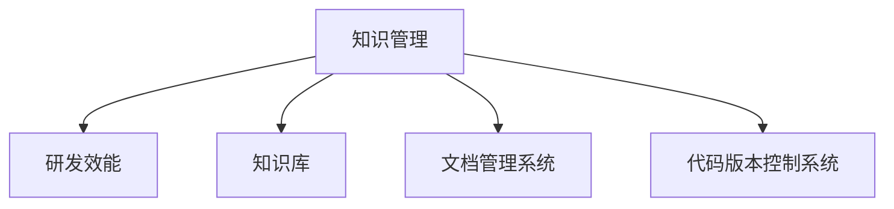

                 

# 知识管理在研发创新中的关键作用

> 关键词：知识管理,研发创新,知识共享,创新加速,研发效能

## 1. 背景介绍

### 1.1 问题由来
在当今快速变化的商业环境中，企业竞争优势往往取决于其创新能力和研发速度。知识是创新的核心驱动力，对于研发团队而言，知识管理已成为提高研发效能和推动技术创新的关键环节。传统的知识管理方式以文档和邮件为中心，难以应对复杂的信息量和多样化的知识形态。面对研发过程中的海量信息，如何有效收集、组织、共享、应用这些知识，成为企业亟需解决的问题。

### 1.2 问题核心关键点
研发知识管理的核心在于如何构建一个高效的、易于获取和分享的系统，以支持研发团队的协作和创新。这一过程中，知识库、文档管理系统、代码版本控制系统等工具起到关键作用。这些工具通过集中管理、索引、搜索等手段，帮助团队快速定位知识、避免重复劳动，提高研发效率。

### 1.3 问题研究意义
通过高效的知识管理，研发团队能够快速获得所需知识，降低信息过载，促进知识共享和创新。这不仅能提高研发效能，还能缩短产品上市时间，加速创新迭代，使企业在市场竞争中保持领先地位。因此，知识管理在提升研发创新能力、推动技术进步方面具有重要意义。

## 2. 核心概念与联系

### 2.1 核心概念概述

为更好地理解知识管理在研发创新中的作用，本节将介绍几个密切相关的核心概念：

- **知识管理(Knowledge Management, KM)**：通过组织、分享和应用知识来提升个人和组织效能的过程。知识管理旨在构建一个无缝的知识共享环境，支持信息检索、协作、创新等活动。

- **研发效能(Research and Development Efficiency, R&D Efficiency)**：衡量研发团队完成项目的时间、成本和质量。高效的研发效能能够快速响应市场变化，推动新产品开发。

- **知识库(Knowledge Base)**：存储、管理和检索知识的电子系统，通常包括文档、代码、专利、论文等各类知识形态。

- **文档管理系统(Document Management System, DMS)**：帮助组织存储、管理和检索文档的工具。DMS支持文档的创建、修订、批准、发布和存档。

- **代码版本控制系统(Version Control System, VCS)**：管理代码变化的工具，记录每次版本变更，支持多人协同开发和版本回滚等操作。

这些核心概念之间的逻辑关系可以通过以下Mermaid流程图来展示：



这个流程图展示了一个知识管理系统的整体架构，以及它与研发效能提升的紧密联系。

## 3. 核心算法原理 & 具体操作步骤
### 3.1 算法原理概述

研发知识管理系统的核心思想是构建一个集成的、智能的知识库和搜索系统，帮助研发团队快速获取所需信息。知识管理的算法原理主要包括以下几个方面：

- **知识分类与标注**：将知识进行分类和标注，便于快速检索和理解。
- **语义搜索**：通过自然语言处理技术，理解用户查询意图，返回最相关的知识。
- **版本控制与协同开发**：使用代码版本控制系统记录每次版本变更，支持多人协作开发。
- **知识共享与传播**：建立知识共享平台，促进团队内部交流，推动知识传播。

### 3.2 算法步骤详解

研发知识管理的步骤一般包括：

**Step 1: 知识收集与整合**
- 从研发过程中收集各类知识，包括文档、代码、实验数据等。
- 使用OCR、文档解析等技术提取结构化数据。
- 对知识进行分类和标注，建立索引。

**Step 2: 知识存储与管理**
- 使用知识库和文档管理系统，对知识进行集中存储。
- 设计合适的存储结构，如文档树、分类目录等。
- 设定访问权限，保护敏感信息。

**Step 3: 知识检索与查询**
- 实现高效的语义搜索算法，支持自然语言查询。
- 优化搜索算法，减少响应时间，提高检索效率。
- 支持模糊查询、联想推荐等功能，提升用户体验。

**Step 4: 知识应用与创新**
- 将知识库与研发工具集成，如代码编辑器、项目管理软件等。
- 提供知识推荐、相似性比较等工具，帮助研发人员快速定位知识。
- 建立知识共享平台，促进团队内部交流和协作。

**Step 5: 知识监控与反馈**
- 定期评估知识库的覆盖率和活跃度。
- 收集用户反馈，持续改进知识库质量。
- 根据需求变化，动态调整知识分类和索引。

### 3.3 算法优缺点

研发知识管理系统的优点包括：

1. **提升研发效能**：通过集中管理和快速检索，显著减少查找知识的时间，提高团队协作效率。
2. **促进知识共享**：打破信息孤岛，促进知识在团队内部流动，加速知识创新。
3. **降低重复劳动**：利用知识库和版本控制系统，避免重复劳动，减少工作量。
4. **支持决策支持**：通过分析知识库中的数据，为决策提供支持，提高决策质量。

系统的缺点主要在于：

1. **初始投资高**：搭建和维护知识管理系统需要较高的初始投入。
2. **复杂度高**：系统集成和配置较为复杂，需要专业技术人员支持。
3. **数据量大**：随着研发过程的推进，知识库的数据量会不断增加，管理难度增大。
4. **数据质量**：知识库的全面性和准确性取决于数据收集的质量，可能需要额外的人力和时间进行审核和清洗。

### 3.4 算法应用领域

研发知识管理系统在多个领域中得到了广泛应用，具体包括：

- **新产品开发**：知识库和文档管理系统帮助研发团队快速找到相关资料，加速产品研发。
- **技术支持**：支持技术文档和FAQ的快速检索，提升客户满意度。
- **知识共享**：建立公司级的知识共享平台，促进技术积累和传承。
- **项目管理**：与项目管理工具集成，提升项目跟踪和管理效率。
- **协同开发**：支持多人协作开发，促进团队协作，提升代码质量。

## 4. 数学模型和公式 & 详细讲解 & 举例说明（备注：数学公式请使用latex格式，latex嵌入文中独立段落使用 $$，段落内使用 $)
### 4.1 数学模型构建

知识管理系统的数学模型主要涉及知识检索和版本控制两个方面。

- **知识检索模型**：基于布尔检索、向量空间模型、语义检索等模型进行知识检索。公式如下：

  $$
  \text{Retrieval Score} = \text{Semantic Similarity}(\text{Query}, \text{Document}) + \text{TF-IDF Score}(\text{Query}, \text{Document})
  $$

- **版本控制系统**：使用Git等工具，记录每次版本变更，提供版本回滚和合并功能。

  $$
  \text{Version History} = \{\text{Commit History}, \text{Diff History}\}
  $$

### 4.2 公式推导过程

- **知识检索公式推导**：
  - 布尔检索：
    $$
    \text{Score} = \sum_{i=1}^{n} w_i \cdot \text{Score}_i
    $$
    其中 $w_i$ 为权重，$\text{Score}_i$ 为查询项与文档项的匹配度。
  - 向量空间模型：
    $$
    \text{Score} = \text{Cosine Similarity}(\text{Query Vector}, \text{Document Vector})
    $$
    其中 $\text{Query Vector}$ 和 $\text{Document Vector}$ 为文本的向量表示。
  - 语义检索：
    $$
    \text{Score} = \text{Semantic Similarity}(\text{Query}, \text{Document}) + \text{TF-IDF Score}(\text{Query}, \text{Document})
    $$
    其中 $\text{Semantic Similarity}$ 为语义相似度，$\text{TF-IDF Score}$ 为词频-逆文档频率得分。

- **版本控制公式推导**：
  - Git提交历史：
    $$
    \text{Commit History} = \{\text{Commit ID}, \text{Author}, \text{Date}, \text{Message}\}
    $$
  - Diff历史：
    $$
    \text{Diff History} = \{\text{File Diff}, \text{Line Diff}, \text{Version Diff}\}
    $$

### 4.3 案例分析与讲解

以Git版本控制系统为例，展示如何利用版本控制支持研发创新：

- **版本控制与协作开发**：
  - 研发团队通过Git进行版本控制，记录每次代码变更，支持多人协作开发。
  - 利用Git的分支和合并功能，团队成员可以并行工作，避免代码冲突。
  - 定期进行代码合并和回测，确保代码质量。

- **版本控制与知识传播**：
  - 在Git仓库中，每个变更都会留下详细的历史记录，包括作者、日期、修改内容等。
  - 利用Git的历史记录和分支管理，可以快速定位问题，查找历史变更，支持团队学习和知识传播。
  - 通过Git的协作工具（如GitHub），团队成员可以共同维护和更新代码，促进知识共享。

## 5. 项目实践：代码实例和详细解释说明
### 5.1 开发环境搭建

在进行知识管理系统的开发前，我们需要准备好开发环境。以下是使用Python和Git进行知识管理系统的环境配置流程：

1. 安装Anaconda：从官网下载并安装Anaconda，用于创建独立的Python环境。

2. 创建并激活虚拟环境：
```bash
conda create -n km-env python=3.8 
conda activate km-env
```

3. 安装相关库：
```bash
pip install numpy pandas sklearn dask django
```

4. 搭建Git仓库：
```bash
git clone https://github.com/example/km-system.git
cd km-system
git config --global user.name "Your Name"
git config --global user.email "youremail@example.com"
```

5. 初始化Git仓库：
```bash
git init
git add .
git commit -m "Initial commit"
```

完成上述步骤后，即可在`km-env`环境中开始知识管理系统的开发。

### 5.2 源代码详细实现

下面以Git版本控制系统为例，给出知识管理系统（Django应用）的代码实现。

```python
from django.http import HttpResponse
from django.shortcuts import render
from django.contrib.auth.decorators import login_required

@login_required
def commit_list(request):
    commit_list = Commit.objects.all()
    return render(request, 'commit_list.html', {'commit_list': commit_list})

@login_required
def commit_detail(request, commit_id):
    commit = Commit.objects.get(id=commit_id)
    return render(request, 'commit_detail.html', {'commit': commit})
```

以上代码实现了知识管理系统的两个功能：

- `commit_list`视图：列出所有提交记录。
- `commit_detail`视图：展示单个提交的详细信息。

### 5.3 代码解读与分析

**Django框架**：
- Django是Python的一个Web框架，用于快速开发Web应用。
- 通过Django的ORM，我们可以方便地操作数据库，实现数据持久化。

**Git库**：
- Git是一个版本控制系统，用于管理代码变更。
- 在代码中，我们通过Git的Python接口操作Git仓库，获取提交历史和代码变更信息。

**视图与模板**：
- Django的视图（View）处理用户请求，生成响应。
- 模板（Template）用于展示数据，通常使用HTML和Jinja2语法。

**用户认证**：
- 使用Django的用户认证系统，确保只有登录用户才能访问系统。

### 5.4 运行结果展示

运行上述代码后，即可在浏览器中访问知识管理系统：

- 访问`/commit/list`，列出所有提交记录。
- 访问`/commit/commit_id`，展示单个提交的详细信息。

## 6. 实际应用场景
### 6.1 智能产品开发

知识管理在智能产品开发中起到了关键作用。智能产品通常涉及复杂的技术栈和多种数据源，知识管理系统的构建有助于研发团队快速定位所需知识，避免重复劳动，加速产品开发。例如，在智能语音识别产品的开发中，知识管理系统可以整合语音数据、代码、模型等信息，提供实时的知识检索和共享，帮助研发团队高效协作，缩短开发周期。

### 6.2 软件开发

知识管理系统在软件开发中同样具有重要价值。软件开发是一个迭代的过程，通过版本控制和知识共享，团队成员可以及时获取最新的代码变更和文档，快速定位问题，促进知识的积累和传播。例如，在开源软件开发中，知识管理系统能够帮助开发者管理项目文档、代码变更历史、测试报告等信息，支持项目管理和协作。

### 6.3 科技公司创新

知识管理系统的构建有助于科技公司推动技术创新。知识管理不仅支持知识的共享和传播，还通过数据分析和决策支持，帮助公司识别创新机会和风险，优化研发流程。例如，在科技公司的研发部门，知识管理系统可以整合专利、研究论文、实验数据等信息，支持科技创新的评估和决策。

### 6.4 未来应用展望

随着AI和大数据技术的不断发展，知识管理系统的智能化和自动化水平将进一步提升。未来的知识管理系统将具备更强的智能推荐、知识发现、情感分析等功能，支持研发团队的个性化知识获取和创新支持。例如，通过自然语言处理技术，知识管理系统可以理解用户查询意图，自动推荐最相关的知识资源。通过机器学习算法，知识管理系统可以预测技术趋势，推荐最新的研究成果和应用案例。

## 7. 工具和资源推荐
### 7.1 学习资源推荐

为了帮助开发者系统掌握知识管理系统的开发和应用，这里推荐一些优质的学习资源：

1. **《Python Web开发实战》**：介绍Django框架的开发实践，帮助开发者构建高效的知识管理系统。
2. **《Git入门与实践》**：讲解Git版本控制的基本概念和操作技巧，帮助开发者掌握版本控制技术。
3. **《Django实战》**：提供Django框架的详细教程，帮助开发者快速上手Web应用开发。
4. **《GitHub最佳实践》**：介绍GitHub平台的使用技巧和最佳实践，帮助开发者构建高效的知识共享平台。
5. **《数据科学导论》**：讲解数据科学的基本概念和方法，帮助开发者应用数据分析技术提升知识管理系统的功能。

通过对这些资源的学习实践，相信你一定能够快速掌握知识管理系统的开发技巧，并将其应用于研发创新中。

### 7.2 开发工具推荐

高效的开发离不开优秀的工具支持。以下是几款用于知识管理系统开发和应用推荐的工具：

1. **Django**：Python的Web框架，用于快速构建知识管理系统的Web界面。
2. **Git**：版本控制系统，用于管理代码变更和版本历史。
3. **Dask**：分布式计算库，支持大规模数据处理和分析。
4. **Jupyter Notebook**：交互式编程环境，支持数据分析和可视化。
5. **TensorFlow**：机器学习框架，支持知识管理系统中的数据分析和机器学习功能。

合理利用这些工具，可以显著提升知识管理系统的开发效率，加快创新迭代的步伐。

### 7.3 相关论文推荐

知识管理系统的研究涉及多个学科领域，包括计算机科学、管理科学、数据科学等。以下是几篇奠基性的相关论文，推荐阅读：

1. **《Knowledge Management Systems: Supporting Group Work: Method and Experience》**：介绍知识管理系统在支持群体工作中的应用。
2. **《Semantic Web Services: An Introduction》**：讲解语义Web服务在知识共享中的应用。
3. **《Knowledge Sharing: Incentives, Practices, and Technologies》**：探讨知识共享的动机、实践和技术。
4. **《Introduction to Software Architecture》**：讲解软件架构的基本概念和设计原则，帮助开发者设计高效的知识管理系统。
5. **《Machine Learning for Knowledge Discovery》**：介绍机器学习在知识发现中的应用，帮助开发者应用数据分析技术提升知识管理系统的功能。

这些论文代表了大规模知识管理系统的发展脉络，帮助读者了解知识管理的理论基础和实践技巧。

## 8. 总结：未来发展趋势与挑战
### 8.1 总结

本文对知识管理在研发创新中的作用进行了全面系统的介绍。首先阐述了知识管理在提升研发效能、促进知识共享和创新方面的重要性。其次，从原理到实践，详细讲解了知识管理系统的构建方法，提供了代码实例和解释。同时，本文还广泛探讨了知识管理系统在智能产品开发、软件开发、科技公司创新等实际应用场景中的应用前景，展示了知识管理系统的巨大潜力。

通过本文的系统梳理，可以看到，知识管理系统的构建对于研发团队的协作和创新具有重要意义。这些系统的应用不仅能提升研发效能，还能促进知识传播，加速技术创新。未来，知识管理系统将继续向着智能化、自动化方向发展，为研发团队的协作和创新提供更强有力的支持。

### 8.2 未来发展趋势

展望未来，知识管理系统的发展趋势主要包括以下几个方面：

1. **智能化增强**：通过自然语言处理和机器学习技术，知识管理系统将具备更强的智能推荐、知识发现和情感分析功能，支持研发团队的个性化知识获取和创新支持。
2. **自动化优化**：借助自动化工具和流程，知识管理系统将实现更高效的知识管理和传播，减少人工干预和操作，提升用户体验。
3. **跨领域融合**：知识管理系统将与其他信息系统和AI技术进行更深入的融合，如知识图谱、语义搜索、深度学习等，形成更全面、高效的知识生态系统。
4. **平台化应用**：知识管理系统将向平台化方向发展，支持跨组织、跨地域的协作和创新，成为企业级知识管理和创新的重要工具。
5. **多模态整合**：知识管理系统将整合多种数据形态，如文本、图像、视频等，支持多模态数据的统一管理和检索，提升知识管理系统的应用范围和功能。

### 8.3 面临的挑战

尽管知识管理系统在研发创新中起到了重要作用，但在应用过程中仍面临诸多挑战：

1. **数据质量**：知识管理系统的功能依赖于高质量的数据输入，如果数据不全面、不准确，系统效果将大打折扣。
2. **系统复杂度**：知识管理系统的构建涉及多方面技术，需要跨学科的知识和技能，对技术团队的要求较高。
3. **用户接受度**：知识管理系统的有效使用需要用户主动参与，如果用户对系统缺乏理解和信任，系统效果将难以发挥。
4. **隐私与安全**：知识管理系统需要处理敏感信息，如何保障数据隐私和安全，是系统建设的重要挑战。
5. **跨组织协作**：知识管理系统需要支持跨组织、跨部门的知识共享和协作，系统架构和机制设计较为复杂。

### 8.4 研究展望

面对知识管理系统的挑战，未来的研究需要在以下几个方面寻求新的突破：

1. **多源数据融合**：通过数据融合技术，将不同来源、不同格式的数据整合到知识库中，提升知识管理的全面性和准确性。
2. **自动化知识标注**：利用自然语言处理和机器学习技术，自动标注和分类知识，减少人工干预，提高知识管理的效率。
3. **隐私保护机制**：研究隐私保护技术，如差分隐私、联邦学习等，保障知识管理系统中的数据隐私和安全。
4. **跨组织协作框架**：研究跨组织协作机制，建立知识共享平台，促进组织间知识流动和创新。
5. **知识图谱与本体构建**：研究知识图谱与本体构建技术，支持更深入的知识关联和语义理解。

这些研究方向的探索，将推动知识管理系统向更智能化、自动化方向发展，为研发团队的协作和创新提供更强有力的支持。只有勇于创新、敢于突破，才能不断拓展知识管理系统的边界，为研发创新提供更高效、更全面的知识服务。

## 9. 附录：常见问题与解答

**Q1：知识管理系统如何与现有的研发工具集成？**

A: 知识管理系统通常通过API接口与现有的研发工具进行集成，如代码编辑器、项目管理工具等。常见的集成方式包括：
1. RESTful API：通过RESTful API，知识管理系统提供数据接口，研发工具可以通过API获取和更新数据。
2. 插件和扩展：许多研发工具支持插件和扩展，知识管理系统可以通过插件或扩展功能集成到工具中。
3. 数据同步：通过定期同步数据，知识管理系统与研发工具保持数据一致性。

**Q2：如何评估知识管理系统的性能？**

A: 知识管理系统的性能评估通常包括以下几个方面：
1. 检索速度：系统能否快速响应用户查询，返回最相关的知识。
2. 数据准确性：知识库中的数据是否全面、准确，是否存在重复和错误。
3. 用户体验：用户对系统的使用是否便捷、直观，是否满足用户需求。
4. 知识共享：知识管理系统是否促进了团队内部的知识共享和协作。
5. 创新效果：系统能否支持技术创新和项目管理，提升研发效能。

**Q3：知识管理系统在大型企业中的应用需要注意哪些问题？**

A: 知识管理系统在大型企业中的应用需要注意以下问题：
1. 数据标准：制定统一的数据标准和格式，确保数据的一致性和兼容性。
2. 用户培训：对用户进行系统培训，提升用户对系统的理解和操作能力。
3. 权限管理：根据不同角色和部门，设置合适的权限和访问控制，保护数据安全。
4. 数据隐私：制定数据隐私保护政策，保障用户数据的隐私和安全。
5. 系统监控：建立监控机制，及时发现和解决系统问题，保障系统稳定运行。

**Q4：知识管理系统在中小型企业中的应用有哪些优势？**

A: 知识管理系统在中小型企业中的优势主要体现在：
1. 成本较低：知识管理系统的搭建和维护成本相对较低，易于在中小型企业中推广。
2. 快速部署：中小型企业通常具有较高的灵活性，知识管理系统可以快速部署和实施。
3. 提升效能：知识管理系统能够帮助中小型企业快速定位知识，提升研发效率，缩短项目周期。
4. 促进创新：知识管理系统支持知识共享和传播，促进团队协作和创新。
5. 简化流程：知识管理系统能够简化工作流程，减少重复劳动，提高工作效率。

**Q5：知识管理系统与文档管理系统有何不同？**

A: 知识管理系统与文档管理系统有以下不同：
1. 数据范围：文档管理系统主要管理文档和文本，知识管理系统支持多种数据形态，如代码、视频、音频等。
2. 知识共享：知识管理系统不仅支持文档的共享，还支持知识的应用和传播，如知识推荐、相似性比较等。
3. 智能检索：知识管理系统利用自然语言处理和机器学习技术，支持智能检索和推荐，提升检索效率和准确性。
4. 版本控制：文档管理系统通常不支持复杂的版本控制和协同开发，知识管理系统集成版本控制和协同开发功能。
5. 数据关联：知识管理系统支持更深入的数据关联和知识发现，如知识图谱、语义搜索等。

知识管理系统与文档管理系统在功能和应用场景上有所不同，但两者在提升研发效能和促进知识共享方面都具有重要价值。选择合适的工具，可以最大化发挥其优势，支持企业研发创新。

---

作者：禅与计算机程序设计艺术 / Zen and the Art of Computer Programming

